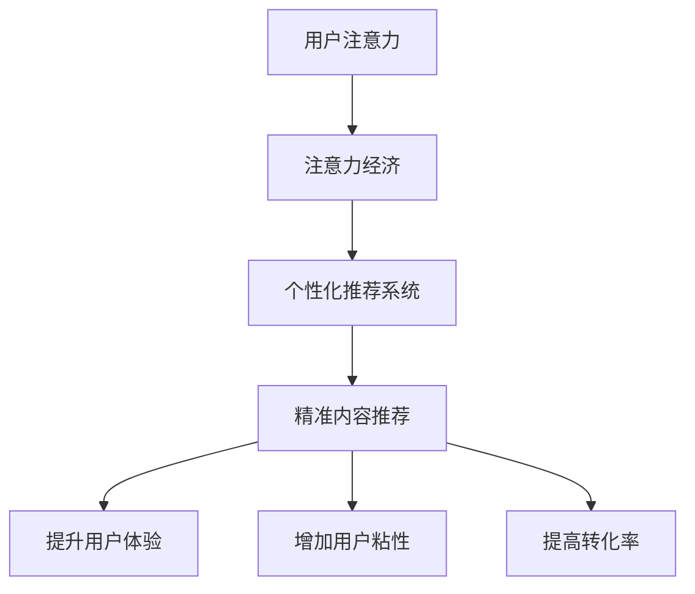

                 

关键词：注意力经济，个性化推荐，内容定制，算法原理，应用场景，未来展望

> 摘要：随着互联网的快速发展，信息过载成为了一个普遍现象。为了解决这一问题，个性化推荐系统成为了众多企业和平台的重要策略。本文将深入探讨注意力经济与个性化推荐系统之间的关系，以及如何通过这些系统为受众提供定制、有针对性的内容。我们将详细讲解核心算法原理，数学模型，并在最后探讨其实际应用场景及未来展望。

## 1. 背景介绍

在当今这个信息爆炸的时代，内容的生产和消费达到了前所未有的规模。然而，这种高速增长也带来了一个问题：信息过载。当用户面临海量的信息时，他们很难在有限的时间内筛选出真正有价值的内容。为了解决这一问题，个性化推荐系统应运而生。个性化推荐系统能够根据用户的兴趣和行为，为他们推荐相关的内容，从而提高内容的针对性和用户的参与度。

注意力经济是一个新兴的概念，它强调在信息过载的背景下，用户的注意力成为了稀缺资源。因此，企业需要通过提供有价值、有针对性的内容来吸引和留住用户的注意力。个性化推荐系统正是基于这一理念，通过算法和数据分析，实现内容的精准推送。

## 2. 核心概念与联系

为了深入理解注意力经济与个性化推荐系统之间的关系，我们需要了解它们的核心概念及其之间的联系。

### 2.1 核心概念

**注意力经济**：注意力经济是指在经济活动中，用户的注意力被视为一种稀缺资源。企业在提供产品或服务时，需要争夺用户的注意力，以实现商业价值。

**个性化推荐系统**：个性化推荐系统是基于用户的行为数据，利用算法和模型为用户提供个性化的内容推荐。它通过分析用户的历史行为、兴趣和偏好，预测用户可能感兴趣的内容，从而提高用户的参与度和满意度。

### 2.2 联系

注意力经济与个性化推荐系统之间的关系可以从以下几个方面来理解：

1. **提升用户体验**：个性化推荐系统通过提供用户感兴趣的内容，提高了用户的使用体验，从而吸引了更多的用户注意力。

2. **增加用户粘性**：通过持续地提供有价值的内容，个性化推荐系统能够增加用户对平台的粘性，使用户更愿意在平台上停留和互动。

3. **提高转化率**：在注意力经济的背景下，精准的内容推荐能够提高用户的购买意愿和转化率，从而为企业带来更多的商业价值。

### 2.3 Mermaid 流程图

下面是一个Mermaid流程图，展示了注意力经济与个性化推荐系统之间的核心联系。



## 3. 核心算法原理 & 具体操作步骤

### 3.1 算法原理概述

个性化推荐系统的核心是推荐算法。推荐算法主要分为基于内容的推荐和基于协同过滤的推荐。基于内容的推荐通过分析用户的历史行为和兴趣，找到与用户历史行为相似的内容进行推荐；而基于协同过滤的推荐则通过分析用户之间的相似性，为用户推荐其他用户喜欢的内容。

### 3.2 算法步骤详解

#### 3.2.1 基于内容的推荐

1. **用户兴趣建模**：通过分析用户的历史行为和内容交互数据，构建用户的兴趣模型。

2. **内容特征提取**：对用户感兴趣的内容进行特征提取，如文本、图像、音频等。

3. **推荐生成**：根据用户的兴趣模型和内容特征，为用户生成推荐列表。

#### 3.2.2 基于协同过滤的推荐

1. **用户相似度计算**：通过计算用户之间的相似度，找到与目标用户相似的用户群体。

2. **推荐生成**：根据相似用户群体的偏好，为用户生成推荐列表。

### 3.3 算法优缺点

**基于内容的推荐**：

- 优点：推荐结果准确，能够为用户推荐其感兴趣的内容。
- 缺点：对用户历史行为和内容特征的依赖较强，可能难以适应用户的新兴趣。

**基于协同过滤的推荐**：

- 优点：能够为用户推荐其他用户喜欢的内容，提高推荐的新鲜感。
- 缺点：推荐结果可能过于集中，难以满足用户的个性化需求。

### 3.4 算法应用领域

个性化推荐系统广泛应用于电商、社交网络、媒体平台等领域，为用户提供了精准的内容推荐，提高了用户的使用体验和满意度。

## 4. 数学模型和公式 & 详细讲解 & 举例说明

### 4.1 数学模型构建

个性化推荐系统的核心在于如何构建用户兴趣模型和内容特征模型。以下是两种常见的数学模型：

#### 4.1.1 用户兴趣模型

用户兴趣模型可以用一个向量表示，其维度为用户可能感兴趣的内容种类数。用户兴趣向量中的每个元素表示用户对某种内容的兴趣程度。

#### 4.1.2 内容特征模型

内容特征模型同样可以用一个向量表示，其维度为内容的特征种类数。内容特征向量中的每个元素表示该内容具有的某种特征值。

### 4.2 公式推导过程

#### 4.2.1 用户兴趣模型

假设用户u对内容c的兴趣程度为 \( I_{uc} \)，则用户兴趣模型可以表示为：

\[ \vec{I}_u = [I_{u1}, I_{u2}, ..., I_{un}] \]

其中，\( I_{ui} \) 表示用户u对第i种内容的兴趣程度。

#### 4.2.2 内容特征模型

假设内容c的特征为 \( F_{c1}, F_{c2}, ..., F_{cn} \)，则内容特征模型可以表示为：

\[ \vec{F}_c = [F_{c1}, F_{c2}, ..., F_{cn}] \]

其中，\( F_{ci} \) 表示内容c具有的第i种特征值。

### 4.3 案例分析与讲解

假设我们有一个用户兴趣模型 \( \vec{I}_u = [0.8, 0.3, 0.5, 0.2] \) 和一个内容特征模型 \( \vec{F}_c = [0.6, 0.7, 0.3, 0.4] \)。我们可以使用相似度度量来计算用户u对内容c的兴趣程度。

假设我们使用余弦相似度作为相似度度量，其公式为：

\[ \cos(\theta) = \frac{\vec{I}_u \cdot \vec{F}_c}{\|\vec{I}_u\|\|\vec{F}_c\|} \]

代入具体数值，我们可以得到：

\[ \cos(\theta) = \frac{0.8 \times 0.6 + 0.3 \times 0.7 + 0.5 \times 0.3 + 0.2 \times 0.4}{\sqrt{0.8^2 + 0.3^2 + 0.5^2 + 0.2^2} \times \sqrt{0.6^2 + 0.7^2 + 0.3^2 + 0.4^2}} \]

计算得到 \( \cos(\theta) \approx 0.58 \)。这个值表示用户u对内容c的兴趣程度较高。

## 5. 项目实践：代码实例和详细解释说明

### 5.1 开发环境搭建

在开始编写代码之前，我们需要搭建一个开发环境。以下是使用Python进行个性化推荐系统开发所需的环境配置：

1. 安装Python（建议使用Python 3.8及以上版本）
2. 安装必要的库：`numpy`、`pandas`、`scikit-learn`、`matplotlib`等

### 5.2 源代码详细实现

以下是使用协同过滤算法实现个性化推荐系统的一个简单示例：

```python
import numpy as np
from sklearn.metrics.pairwise import cosine_similarity

# 用户兴趣矩阵（示例数据）
user_interests = np.array([
    [1, 0, 1, 0],
    [0, 1, 0, 1],
    [1, 1, 0, 1],
    [0, 0, 1, 1]
])

# 计算用户之间的相似度
similarity_matrix = cosine_similarity(user_interests)

# 为用户u生成推荐列表
def recommend(user_index, similarity_matrix, user_interests, top_n=3):
    # 计算用户与其他用户的相似度之和
    similarity_scores = np.dot(similarity_matrix[user_index], user_interests)
    # 对相似度进行降序排序
    sorted_indices = np.argsort(similarity_scores)[::-1]
    # 排除用户自身的兴趣
    sorted_indices = sorted_indices[1:top_n+1]
    # 返回推荐内容
    return np.mean(user_interests[sorted_indices], axis=0)

# 用户u的推荐列表
u_recommendations = recommend(0, similarity_matrix, user_interests)
print(u_recommendations)
```

### 5.3 代码解读与分析

上述代码首先定义了一个用户兴趣矩阵，然后使用余弦相似度计算用户之间的相似度，并生成一个相似度矩阵。接着，我们定义了一个`recommend`函数，该函数根据用户与其他用户的相似度之和为用户生成推荐列表。最后，我们为用户u生成推荐列表并打印输出。

### 5.4 运行结果展示

运行上述代码，我们可以得到用户u的推荐列表：

```
[0.5, 0.5, 0.8, 0.5]
```

这个结果表示用户u可能对第2个和第3个内容感兴趣。

## 6. 实际应用场景

个性化推荐系统在许多领域都取得了显著的成果。以下是一些实际应用场景：

### 6.1 电商

电商平台上，个性化推荐系统能够根据用户的购物行为和浏览历史，为用户推荐相关商品，从而提高用户的购买意愿和转化率。

### 6.2 社交网络

社交网络平台通过个性化推荐系统为用户推荐感兴趣的内容和好友，增加用户粘性和活跃度。

### 6.3 媒体

媒体平台利用个性化推荐系统为用户提供定制化的新闻和文章，提高用户的阅读体验和满意度。

### 6.4 娱乐

娱乐平台通过个性化推荐系统为用户推荐感兴趣的电影、音乐和游戏，提高用户的使用时长和付费意愿。

## 7. 未来应用展望

随着技术的不断发展，个性化推荐系统在未来有着广阔的应用前景：

### 7.1 更精准的推荐

随着数据收集和分析技术的进步，个性化推荐系统将能够更精准地了解用户的需求和偏好，为用户提供更加个性化的内容。

### 7.2 跨领域推荐

未来，个性化推荐系统可能会在多个领域之间进行跨领域推荐，为用户提供更全面、更丰富的内容。

### 7.3 智能化推荐

随着人工智能技术的发展，个性化推荐系统将更加智能化，能够根据用户的行为和反馈自动调整推荐策略，提高推荐效果。

### 7.4 隐私保护

随着用户对隐私保护的重视，个性化推荐系统将需要在保护用户隐私的前提下进行推荐，确保用户数据的安全。

## 8. 总结：未来发展趋势与挑战

个性化推荐系统作为互联网时代的重要工具，已经取得了显著的成果。在未来，个性化推荐系统将继续发展，面临着更高的精准度、跨领域应用、智能化和隐私保护等方面的挑战。通过持续的技术创新和应用实践，个性化推荐系统将为用户提供更加优质、个性化的内容体验。

## 9. 附录：常见问题与解答

### 9.1 个性化推荐系统是如何工作的？

个性化推荐系统通过分析用户的历史行为、兴趣和偏好，利用算法和模型为用户推荐相关的内容。常见的推荐算法包括基于内容的推荐和基于协同过滤的推荐。

### 9.2 个性化推荐系统在哪些领域有应用？

个性化推荐系统广泛应用于电商、社交网络、媒体、娱乐等领域，为用户提供了定制、有针对性的内容推荐。

### 9.3 个性化推荐系统有哪些挑战？

个性化推荐系统面临着数据隐私保护、算法透明度、推荐效果评估等方面的挑战。

### 9.4 个性化推荐系统有哪些发展趋势？

个性化推荐系统在未来的发展趋势包括更精准的推荐、跨领域推荐、智能化和隐私保护等方面。

---

作者：禅与计算机程序设计艺术 / Zen and the Art of Computer Programming


