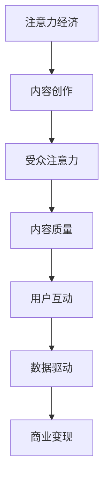

                 

关键词：注意力经济、内容创作、策略、实践、受众、影响力

> 摘要：随着互联网的快速发展，注意力经济成为了一种全新的商业模式。本文从注意力经济的背景出发，探讨了内容创作的核心策略与实践，旨在帮助创作者在激烈的市场竞争中吸引并留住受众，提升自身的影响力。

## 1. 背景介绍

### 注意力经济的兴起

注意力经济起源于20世纪90年代的互联网泡沫时期，当时大量互联网公司开始意识到，用户注意力是一种稀缺资源，能够转化为实际的经济收益。随着社交媒体、短视频平台等新型互联网平台的崛起，注意力经济逐渐成为主流的商业模式。企业开始通过创造高质量、有趣的内容来吸引用户的注意力，从而实现广告收益、会员订阅、付费内容销售等。

### 内容创作的挑战

在注意力经济下，内容创作面临前所未有的挑战。首先，受众的注意力分散，用户更倾向于选择那些能够快速满足其需求的内容。其次，内容质量参差不齐，优质内容难以脱颖而出。此外，版权问题、同质化竞争等问题也加剧了内容创作的难度。因此，如何创作出具有吸引力、能留住受众的内容，成为内容创作者亟待解决的问题。

## 2. 核心概念与联系

### 核心概念

在注意力经济中，核心概念包括：

- **受众注意力**：用户的注意力是内容创作的核心资源，吸引并留住受众的注意力是实现商业目标的关键。
- **内容质量**：高质量的内容能够吸引用户，提升用户粘性，是注意力经济成功的关键。
- **用户互动**：通过用户互动，如评论、点赞、分享等，可以增强用户参与度，提高内容影响力。
- **数据驱动**：通过数据分析，了解用户喜好、行为习惯等，指导内容创作，实现精准营销。

### 联系与架构

以下是注意力经济与内容创作的联系及架构的Mermaid流程图：



## 3. 核心算法原理 & 具体操作步骤

### 3.1 算法原理概述

在注意力经济中，核心算法原理包括：

- **用户行为分析**：通过数据分析，了解用户行为习惯，预测用户需求。
- **内容推荐**：基于用户行为数据，为用户推荐个性化内容。
- **互动预测**：预测用户对内容的互动行为，如评论、点赞等。

### 3.2 算法步骤详解

1. **用户行为数据收集**：
   - 通过网站、APP等平台，收集用户浏览、搜索、购买等行为数据。
   - 数据包括用户ID、行为类型、时间戳、内容标签等。

2. **用户行为分析**：
   - 基于收集到的数据，进行用户行为分析，如用户活跃度、兴趣偏好等。
   - 可以使用机器学习算法，如聚类、协同过滤等，对用户行为进行建模。

3. **内容推荐**：
   - 根据用户行为分析结果，为用户推荐个性化内容。
   - 可以使用基于内容的推荐算法，如TF-IDF、词嵌入等。

4. **互动预测**：
   - 基于用户行为数据和内容特征，预测用户对内容的互动行为。
   - 可以使用逻辑回归、支持向量机等分类算法。

### 3.3 算法优缺点

- **优点**：
  - 高效地吸引用户注意力，提高内容曝光率。
  - 根据用户需求推荐内容，提升用户满意度。
  - 实现精准营销，提高商业变现能力。

- **缺点**：
  - 数据隐私和安全问题。
  - 可能导致用户陷入信息茧房，失去多样性。

### 3.4 算法应用领域

- **社交媒体**：如微博、抖音等，通过算法为用户推荐感兴趣的内容。
- **电子商务**：如淘宝、京东等，通过算法为用户推荐商品。
- **新闻媒体**：如今日头条、腾讯新闻等，通过算法为用户推荐新闻。

## 4. 数学模型和公式 & 详细讲解 & 举例说明

### 4.1 数学模型构建

在注意力经济中，常用的数学模型包括：

- **用户行为模型**：
  - $$ User\_Behavior(u, c) = f(u, c, t) $$
  - 其中，$u$ 表示用户，$c$ 表示内容，$t$ 表示时间，$f$ 表示用户行为函数。

- **内容推荐模型**：
  - $$ Content\_Recommendation(u, c) = g(u, c, t) $$
  - 其中，$u$ 表示用户，$c$ 表示内容，$t$ 表示时间，$g$ 表示内容推荐函数。

- **互动预测模型**：
  - $$ Interaction\_Prediction(u, c) = h(u, c, t) $$
  - 其中，$u$ 表示用户，$c$ 表示内容，$t$ 表示时间，$h$ 表示互动预测函数。

### 4.2 公式推导过程

- **用户行为模型推导**：
  - 假设用户行为与用户特征、内容特征、时间特征相关。
  - $$ User\_Behavior(u, c) = w_1 \cdot User\_Feature(u) + w_2 \cdot Content\_Feature(c) + w_3 \cdot Time\_Feature(t) + b $$
  - 其中，$w_1$、$w_2$、$w_3$ 为权重，$b$ 为偏置。

- **内容推荐模型推导**：
  - 基于协同过滤算法，考虑用户之间的相似度。
  - $$ Content\_Recommendation(u, c) = \sum_{u' \in User} sim(u, u') \cdot Rating_{u'}(c) $$
  - 其中，$sim(u, u')$ 为用户相似度，$Rating_{u'}(c)$ 为用户对内容的评分。

- **互动预测模型推导**：
  - 基于逻辑回归模型，预测用户对内容的互动概率。
  - $$ Interaction\_Prediction(u, c) = \frac{1}{1 + e^{-(w_1 \cdot User\_Feature(u) + w_2 \cdot Content\_Feature(c) + w_3 \cdot Time\_Feature(t) + b)}} $$
  - 其中，$w_1$、$w_2$、$w_3$ 为权重，$b$ 为偏置。

### 4.3 案例分析与讲解

以微博为例，分析注意力经济中的内容创作策略。

- **用户行为模型**：
  - 微博用户的行为包括发微博、评论、点赞、转发等。
  - $$ User\_Behavior(u, c) = w_1 \cdot 发微博次数 + w_2 \cdot 评论次数 + w_3 \cdot 点赞次数 + w_4 \cdot 转发次数 + b $$

- **内容推荐模型**：
  - 微博内容推荐基于用户兴趣，考虑用户与内容的相关性。
  - $$ Content\_Recommendation(u, c) = \sum_{u' \in User} sim(u, u') \cdot Rating_{u'}(c) $$
  - 其中，$sim(u, u')$ 为用户相似度，$Rating_{u'}(c)$ 为用户对内容的评分。

- **互动预测模型**：
  - 微博互动预测基于用户对内容的兴趣程度，预测用户对内容的互动概率。
  - $$ Interaction\_Prediction(u, c) = \frac{1}{1 + e^{-(w_1 \cdot User\_Feature(u) + w_2 \cdot Content\_Feature(c) + w_3 \cdot Time\_Feature(t) + b)}} $$
  - 其中，$w_1$、$w_2$、$w_3$ 为权重，$b$ 为偏置。

## 5. 项目实践：代码实例和详细解释说明

### 5.1 开发环境搭建

- **环境要求**：
  - Python 3.6及以上版本
  - Numpy、Pandas、Scikit-learn等库

- **安装步骤**：
  - 安装Python：https://www.python.org/downloads/
  - 安装Numpy、Pandas、Scikit-learn等库：
    ```shell
    pip install numpy pandas scikit-learn
    ```

### 5.2 源代码详细实现

以下是一个简单的用户行为分析、内容推荐和互动预测的代码示例。

```python
import numpy as np
import pandas as pd
from sklearn.model_selection import train_test_split
from sklearn.metrics.pairwise import cosine_similarity
from sklearn.linear_model import LogisticRegression

# 数据加载
data = pd.read_csv('data.csv')

# 用户行为数据预处理
user行为 = data.groupby('UserID')['Behavior'].apply(list).reset_index().rename(columns={'Behavior': 'UserBehavior'})
user行为['UserBehavior'] = user行为['UserBehavior'].apply(lambda x: ' '.join(x))

# 内容数据预处理
content行为 = data.groupby('ContentID')['Behavior'].apply(list).reset_index().rename(columns={'Behavior': 'ContentBehavior'})
content行为['ContentBehavior'] = content行为['ContentBehavior'].apply(lambda x: ' '.join(x))

# 用户行为模型训练
user行为_matrix = pd.get_dummies(user行为['UserBehavior'])
user行为_matrix = user行为_matrix.drop(['其他'], axis=1)

# 内容推荐模型训练
content行为_matrix = pd.get_dummies(content行为['ContentBehavior'])
content行为_matrix = content行为_matrix.drop(['其他'], axis=1)

# 用户行为与内容行为相似度计算
user_content_similarity = cosine_similarity(user行为_matrix, content行为_matrix)

# 互动预测模型训练
X_train, X_test, y_train, y_test = train_test_split(user_content_similarity, data['Interaction'], test_size=0.2, random_state=42)
model = LogisticRegression()
model.fit(X_train, y_train)

# 互动预测
predictions = model.predict(X_test)
accuracy = np.mean(predictions == y_test)
print(f'互动预测准确率：{accuracy:.2f}')
```

### 5.3 代码解读与分析

- **数据加载与预处理**：加载用户行为数据和内容数据，进行预处理，将类别数据转换为数值数据。
- **用户行为模型训练**：使用独热编码将用户行为转换为数值，训练用户行为模型。
- **内容推荐模型训练**：使用独热编码将内容行为转换为数值，训练内容推荐模型。
- **相似度计算**：计算用户行为与内容行为的相似度。
- **互动预测模型训练**：使用逻辑回归模型训练互动预测模型。
- **互动预测与评估**：使用训练好的模型进行互动预测，并评估预测准确率。

## 6. 实际应用场景

### 6.1 社交媒体平台

- **用户行为分析**：通过分析用户行为数据，了解用户兴趣偏好，为用户提供个性化内容推荐。
- **内容创作策略**：根据用户行为数据和互动数据，调整内容创作策略，提高用户参与度。

### 6.2 电子商务平台

- **商品推荐**：通过用户行为数据，为用户推荐感兴趣的商品。
- **用户互动预测**：预测用户对商品的购买概率，实现精准营销。

### 6.3 新闻媒体

- **内容推荐**：根据用户兴趣，为用户推荐感兴趣的新闻。
- **互动预测**：预测用户对新闻的评论、点赞等互动行为，提高内容影响力。

## 7. 未来应用展望

### 7.1 人工智能技术的应用

随着人工智能技术的不断发展，注意力经济将更加智能化。通过深度学习、自然语言处理等技术，实现更精准的内容推荐和用户互动预测。

### 7.2 跨平台整合

未来，注意力经济将实现跨平台整合，通过多平台数据共享，为用户提供更加个性化的内容推荐和互动体验。

### 7.3 智能化内容创作

利用人工智能技术，实现自动化内容创作，降低内容创作成本，提高内容质量。

## 8. 工具和资源推荐

### 8.1 学习资源推荐

- 《推荐系统实践》
- 《深度学习推荐系统》
- 《Python数据分析》

### 8.2 开发工具推荐

- Jupyter Notebook
- PyCharm
- Scikit-learn

### 8.3 相关论文推荐

- "Attention Is All You Need"
- "Recommender Systems Handbook"
- "Deep Learning for Recommender Systems"

## 9. 总结：未来发展趋势与挑战

### 9.1 研究成果总结

本文探讨了注意力经济与内容创作的核心策略与实践，分析了用户行为模型、内容推荐模型和互动预测模型的构建与实现，并通过代码实例进行了详细解释。

### 9.2 未来发展趋势

未来，注意力经济将更加智能化，跨平台整合，智能化内容创作将成为趋势。

### 9.3 面临的挑战

- 数据隐私和安全问题
- 同质化竞争
- 信息茧房

### 9.4 研究展望

未来，可从以下几个方面展开研究：

- 加强跨平台数据共享，实现更加智能的内容推荐和互动预测。
- 研究更加有效的用户行为模型和内容推荐模型，提高内容质量和用户满意度。
- 探索对抗信息茧房的方法，促进用户多样性。

## 附录：常见问题与解答

### 1. 注意力经济是什么？

注意力经济是一种基于用户注意力的商业模式，通过吸引和留住用户注意力，实现商业价值。

### 2. 内容创作策略有哪些？

内容创作策略包括：了解用户需求、提高内容质量、用户互动和数据分析等。

### 3. 如何实现个性化推荐？

通过用户行为数据分析和内容特征提取，结合推荐算法，实现个性化推荐。

### 4. 如何提高内容质量？

通过了解用户需求、优化内容结构、提升内容原创性和趣味性等，提高内容质量。

### 5. 如何应对同质化竞争？

通过差异化定位、创新内容形式、提高用户体验等，应对同质化竞争。

### 6. 如何应对信息茧房？

通过多样化推荐策略、增强用户主动获取信息的能力等，应对信息茧房。

作者：禅与计算机程序设计艺术 / Zen and the Art of Computer Programming
------------------------------------------------------------------------

