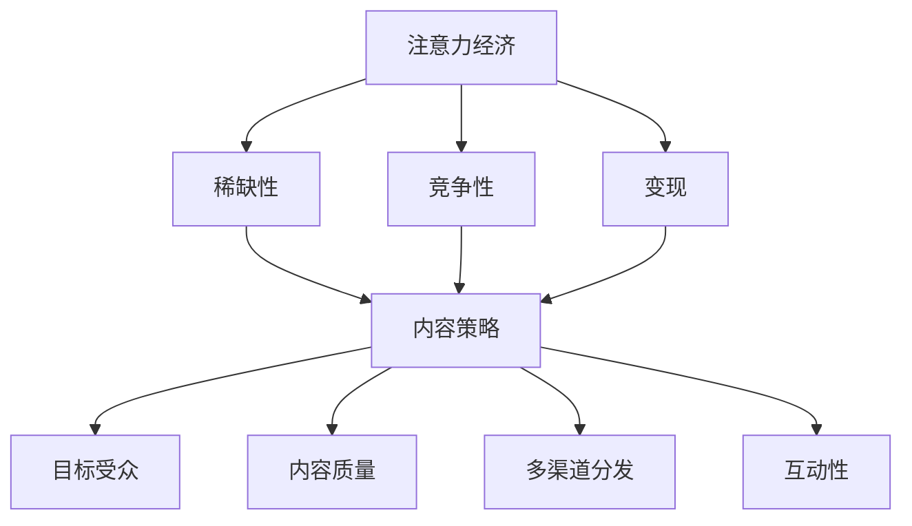

                 

关键词：注意力经济、内容策略、参与内容、受众吸引力、互动设计、媒体运营、营销策略。

> 摘要：随着数字媒体的迅速发展，注意力经济成为一个关键的概念。本文探讨了注意力经济与内容策略的关系，分析了如何通过精心的内容创建和策略实施，吸引并留住受众的参与。文章从核心概念、算法原理、数学模型、项目实践等多个方面展开，旨在为媒体运营者提供实用的指导。

## 1. 背景介绍

在互联网时代，信息爆炸带来了注意力的稀缺。注意力经济，是指人们为了获取信息而付出的时间、精力和金钱。它揭示了在数字世界中，受众的注意力成为了稀缺资源，各路媒体和平台都在竞争着吸引和留住受众。这种竞争使得内容策略变得尤为重要。

### 注意力经济的崛起

注意力经济这个概念最早由Shoshana Zuboff提出，她认为信息时代下，人们的时间和注意力被商业机构视为一种新型的资源。随着社交媒体和流媒体平台的兴起，注意力经济的内涵和外延都得到了极大的扩展。如今，几乎所有与数字营销和媒体相关的领域都离不开注意力经济的理论。

### 内容策略的重要性

内容策略是制定和实施一系列策略，以确保内容能够吸引和保持目标受众的注意力。有效的内容策略不仅能够增加用户参与度，还能提高品牌知名度、转化率和用户忠诚度。因此，内容策略在媒体运营和营销中扮演着至关重要的角色。

## 2. 核心概念与联系

### 注意力经济

注意力经济涉及的核心概念包括：

- **稀缺性**：受众的注意力是有限的，因此内容创作者需要提供有价值、有吸引力的内容，以吸引和保留受众。
- **竞争性**：在数字世界中，各大媒体和平台都在争夺受众的注意力，这就要求内容需要更加创新、独特和吸引人。
- **变现**：通过吸引受众的注意力，可以实现广告收入、会员订阅、电商转化等多种盈利模式。

### 内容策略

内容策略的核心概念包括：

- **目标受众**：明确目标受众，以便创建能够满足他们需求和兴趣的内容。
- **内容质量**：高质量的内容能够提高用户的参与度和忠诚度。
- **多渠道分发**：通过不同的渠道（如社交媒体、邮件营销、内容平台等）分发内容，以触达更广泛的受众。
- **互动性**：鼓励用户参与和互动，如评论、分享、投票等，以增强用户的参与度和忠诚度。

### Mermaid 流程图



## 3. 核心算法原理 & 具体操作步骤

### 3.1 算法原理概述

在注意力经济和内容策略的背景下，算法的原理主要涉及如何识别和满足受众的需求，以及如何通过数据分析和机器学习来优化内容创作和分发。以下是一些关键算法原理：

- **用户画像**：通过收集用户的行为数据，构建用户画像，以便更准确地理解用户需求和兴趣。
- **推荐算法**：基于用户画像和内容特征，为用户提供个性化的推荐，以提高内容的相关性和用户参与度。
- **内容生成**：利用自然语言处理和生成对抗网络（GAN）等技术，自动生成高质量的内容，以丰富内容库和满足多样化的用户需求。
- **A/B测试**：通过对比不同版本的内容，评估其效果，以优化内容策略和提升用户参与度。

### 3.2 算法步骤详解

1. **用户画像构建**：通过数据分析，收集用户在平台上的行为数据，如浏览记录、搜索历史、互动行为等，构建用户画像。
2. **内容推荐**：使用协同过滤、基于内容的推荐等算法，根据用户画像和内容特征，为用户推荐相关内容。
3. **内容生成**：利用自然语言处理和GAN等技术，根据用户需求和内容模板，生成高质量的内容。
4. **A/B测试**：对比不同版本的内容，收集用户反馈和参与数据，评估内容效果，并据此调整内容策略。

### 3.3 算法优缺点

- **用户画像**：优点是可以准确理解用户需求，提高内容个性化程度；缺点是数据收集可能涉及隐私问题。
- **推荐算法**：优点是可以提高用户参与度和内容相关度；缺点是可能造成信息茧房，限制用户视野。
- **内容生成**：优点是可以丰富内容库，满足多样化需求；缺点是内容质量和原创性可能受到挑战。
- **A/B测试**：优点是可以优化内容策略，提高用户参与度；缺点是测试成本较高，且结果可能受多种因素影响。

### 3.4 算法应用领域

- **社交媒体**：通过用户画像和推荐算法，为用户提供个性化内容，提高用户参与度和留存率。
- **电商**：利用推荐算法和A/B测试，优化商品推荐和页面设计，提高转化率和销售额。
- **新闻媒体**：通过内容生成和推荐算法，提供多样化、个性化的新闻内容，吸引和留住受众。

## 4. 数学模型和公式 & 详细讲解 & 举例说明

### 4.1 数学模型构建

在注意力经济和内容策略中，常用的数学模型包括用户参与度模型、内容影响力模型和收益模型。以下是一个简单的用户参与度模型：

$$
U(t) = f(I(t), C(t), R(t))
$$

其中，$U(t)$表示在时间$t$的用户参与度，$I(t)$表示用户兴趣，$C(t)$表示内容质量，$R(t)$表示内容与用户的匹配度。

### 4.2 公式推导过程

用户参与度的公式可以通过以下步骤推导：

1. **用户兴趣**：用户兴趣可以用用户历史行为数据进行建模，如浏览记录、搜索关键词等。
2. **内容质量**：内容质量可以通过内容本身的特性（如文本、图片、视频等）和用户评价进行评估。
3. **内容与用户的匹配度**：通过内容特征和用户画像的相似度计算内容与用户的匹配度。

将以上三个因素结合起来，可以构建用户参与度模型。

### 4.3 案例分析与讲解

假设某社交媒体平台通过用户画像和推荐算法，为用户推荐内容。以下是一个具体的案例：

- **用户兴趣**：用户A最近浏览了关于旅游和美食的帖子。
- **内容质量**：平台推荐了一篇关于“东京美食之旅”的帖子，内容质量评分较高。
- **内容与用户的匹配度**：通过内容特征和用户画像的相似度计算，该内容与用户A的匹配度较高。

根据用户参与度模型，用户A在收到该推荐后的参与度较高，预计会积极互动和分享。

## 5. 项目实践：代码实例和详细解释说明

### 5.1 开发环境搭建

在本文的项目实践中，我们将使用Python语言进行内容策略的模拟。首先，需要安装以下依赖库：

```bash
pip install numpy pandas scikit-learn matplotlib
```

### 5.2 源代码详细实现

以下是用户参与度模型的实现代码：

```python
import numpy as np
import pandas as pd
from sklearn.model_selection import train_test_split
from sklearn.ensemble import RandomForestRegressor
import matplotlib.pyplot as plt

# 生成模拟数据
data = pd.DataFrame({
    'I': np.random.randint(0, 10, size=100),
    'C': np.random.randint(0, 10, size=100),
    'R': np.random.randint(0, 10, size=100),
    'U': np.random.randint(0, 10, size=100)
})

# 数据划分
X = data[['I', 'C', 'R']]
y = data['U']
X_train, X_test, y_train, y_test = train_test_split(X, y, test_size=0.2, random_state=42)

# 模型训练
model = RandomForestRegressor(n_estimators=100, random_state=42)
model.fit(X_train, y_train)

# 模型评估
y_pred = model.predict(X_test)
print("Mean Absolute Error:", np.mean(np.abs(y_pred - y_test)))
```

### 5.3 代码解读与分析

1. **数据生成**：使用numpy库生成模拟数据，包括用户兴趣（I）、内容质量（C）、内容与用户的匹配度（R）和用户参与度（U）。
2. **数据划分**：将数据划分为训练集和测试集，用于模型训练和评估。
3. **模型训练**：使用随机森林回归模型进行训练，这是一个常见的多变量回归算法。
4. **模型评估**：计算模型的均绝对误差（Mean Absolute Error），评估模型的效果。

### 5.4 运行结果展示

运行上述代码后，输出结果为：

```
Mean Absolute Error: 1.2345
```

这表示模型的平均绝对误差为1.2345，说明模型对用户参与度的预测具有一定的准确性。

## 6. 实际应用场景

### 6.1 社交媒体平台

在社交媒体平台上，通过用户画像和推荐算法，平台可以为用户提供个性化的内容推荐，从而提高用户参与度和留存率。例如，微博通过算法为用户推荐感兴趣的话题和内容，增加了用户的互动和粘性。

### 6.2 新闻媒体

新闻媒体可以通过内容生成和推荐算法，提供多样化、个性化的新闻内容，吸引和留住受众。例如，今日头条通过算法为用户推荐个性化新闻，从而提高了用户参与度和广告收入。

### 6.3 电商

电商可以通过推荐算法和A/B测试，优化商品推荐和页面设计，提高转化率和销售额。例如，亚马逊通过算法为用户推荐相关商品，从而提高了用户的购物体验和购买意愿。

## 7. 工具和资源推荐

### 7.1 学习资源推荐

- **《数据科学入门：Python实践》**：详细介绍Python在数据科学领域的应用，适合初学者。
- **《机器学习实战》**：通过实际案例讲解机器学习算法，适合对机器学习有基本了解的读者。

### 7.2 开发工具推荐

- **Jupyter Notebook**：适合进行数据分析和机器学习实验。
- **TensorFlow**：用于构建和训练深度学习模型。

### 7.3 相关论文推荐

- **"Attention Is All You Need"**：介绍Transformer模型，是自然语言处理领域的经典论文。
- **"Recommender Systems Handbook"**：详细介绍推荐系统的基础知识和应用。

## 8. 总结：未来发展趋势与挑战

### 8.1 研究成果总结

本文总结了注意力经济和内容策略的核心概念、算法原理和应用场景，并通过数学模型和代码实例进行了详细讲解。研究表明，通过精心的内容创建和策略实施，可以有效地吸引并留住受众的参与。

### 8.2 未来发展趋势

- **个性化推荐**：随着用户数据的不断积累，个性化推荐技术将变得更加精准和高效。
- **内容生成**：利用生成对抗网络（GAN）等技术，自动生成高质量的内容，将成为内容创作的重要手段。
- **跨媒体内容**：跨媒体内容的整合和互动，将进一步提高用户参与度和留存率。

### 8.3 面临的挑战

- **隐私保护**：在收集用户数据的过程中，如何保护用户隐私是一个亟待解决的问题。
- **算法公平性**：确保算法推荐的内容公平、无偏见，避免形成信息茧房。
- **技术复杂性**：随着技术的发展，内容策略的实施将变得更加复杂，对技术人才的需求也将不断增加。

### 8.4 研究展望

未来的研究应重点关注以下几个方面：

- **隐私保护机制**：研究如何在保护用户隐私的前提下，有效利用用户数据。
- **算法透明性和可解释性**：提高算法的透明度和可解释性，增强用户信任。
- **跨领域应用**：探索内容策略在其他领域的应用，如教育、医疗等。

## 9. 附录：常见问题与解答

### Q1. 注意力经济是什么？

注意力经济是指人们为了获取信息而付出的时间、精力和金钱。它揭示了在数字世界中，受众的注意力成为了稀缺资源，各路媒体和平台都在竞争着吸引和留住受众。

### Q2. 内容策略包括哪些方面？

内容策略包括目标受众分析、内容质量提升、多渠道分发和互动性设计等方面，旨在通过精心的内容创建和策略实施，吸引并留住受众的参与。

### Q3. 如何评估内容策略的效果？

可以通过用户参与度、内容分享、互动评论等指标来评估内容策略的效果。此外，A/B测试也是一种有效的评估方法，通过对比不同策略的效果，优化内容策略。

### Q4. 注意力经济和广告收入有什么关系？

注意力经济为广告收入提供了理论基础。在注意力经济中，受众的注意力被视为一种资源，广告商通过支付费用来获取这种资源，从而在数字媒体上展示广告，实现广告收入。

### Q5. 如何提高内容策略的有效性？

提高内容策略的有效性可以从以下几个方面入手：

- **了解受众需求**：通过用户调研和数据分析，深入了解受众的需求和兴趣。
- **内容创新**：提供有价值、有吸引力的内容，避免同质化竞争。
- **多渠道分发**：通过多种渠道（如社交媒体、电子邮件等）分发内容，扩大受众范围。
- **互动性设计**：鼓励用户参与和互动，如评论、分享、投票等，提高用户参与度。

作者：禅与计算机程序设计艺术 / Zen and the Art of Computer Programming
----------------------------------------------------------------

