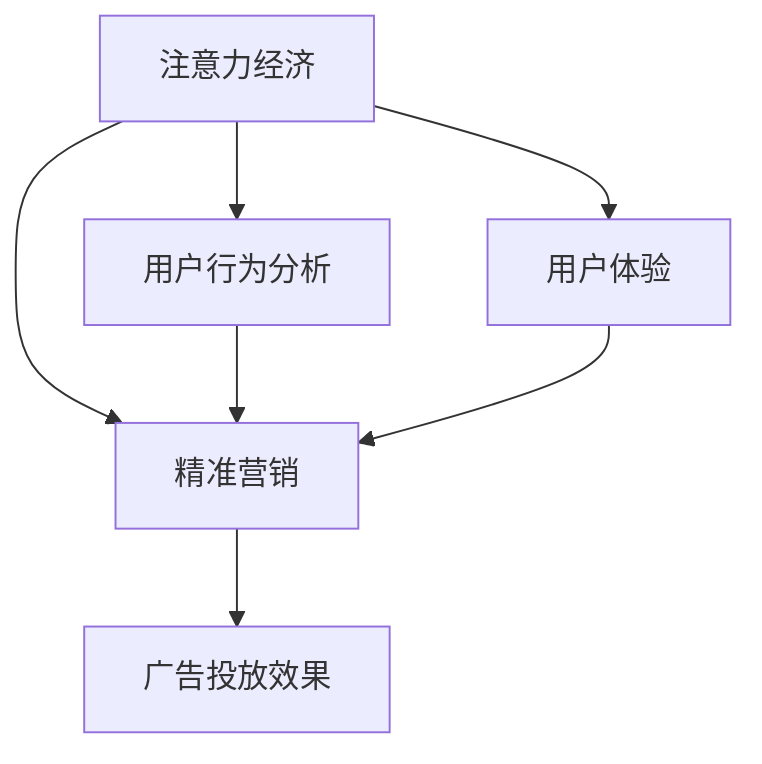

                 

关键词：注意力经济、在线广告、用户体验、精准营销、算法优化、用户行为分析、数据分析

> 摘要：本文从注意力经济的角度出发，探讨了在线广告如何有效地针对受众群体，同时保持良好的用户体验。通过对核心概念的阐述、算法原理的分析，以及实际项目实践的讲解，本文为在线广告领域提供了实用的指导思路和解决方案。

## 1. 背景介绍

在当今的信息时代，广告已成为企业吸引客户、提升品牌知名度的重要手段。然而，随着互联网的普及和用户注意力的稀缺，传统广告方式的效果逐渐减弱。注意力经济作为一种新的经济学理论，强调在信息过载的时代，用户注意力的价值。在线广告作为互联网的重要组成部分，如何有效地利用注意力经济原则，精准地定位受众，提高广告投放效果，成为企业和广告技术公司面临的重要课题。

在线广告市场的快速发展，带来了激烈的竞争。广告主希望通过广告获取最大的收益，而用户则希望在不影响正常使用网络服务的情况下，避免不必要的干扰。因此，如何在保证用户体验的同时，实现精准的广告投放，成为在线广告行业的关键挑战。

## 2. 核心概念与联系

### 2.1. 注意力经济

注意力经济是指，在信息过载的时代，用户注意力成为一种稀缺资源，具有经济价值。注意力经济的核心在于，通过精准地捕捉和利用用户注意力，实现广告价值最大化。

### 2.2. 用户行为分析

用户行为分析是指，通过对用户在互联网上的行为数据进行分析，了解用户的兴趣、偏好和需求，从而为广告投放提供依据。

### 2.3. 精准营销

精准营销是指，基于用户行为分析，对特定用户群体进行有针对性的广告投放，提高广告效果。

### 2.4. 用户体验

用户体验是指，用户在使用产品或服务过程中的感受和体验。良好的用户体验可以增加用户粘性，提高用户满意度。

### 2.5. Mermaid 流程图

以下是注意力经济与在线广告的核心概念及联系流程图：



## 3. 核心算法原理 & 具体操作步骤

### 3.1. 算法原理概述

在线广告的核心算法通常是基于机器学习和数据挖掘技术。这些算法通过分析大量用户行为数据，识别出用户的兴趣和偏好，进而实现精准的广告投放。

### 3.2. 算法步骤详解

#### 3.2.1. 数据收集与预处理

- 收集用户在互联网上的行为数据，如浏览历史、搜索记录、点击行为等。
- 数据预处理，包括数据清洗、去重、归一化等。

#### 3.2.2. 用户兴趣建模

- 使用机器学习方法，如聚类、分类、协同过滤等，对用户行为数据进行分析，构建用户兴趣模型。
- 模型训练和优化，以提高预测准确性。

#### 3.2.3. 广告投放策略

- 根据用户兴趣模型，为每个用户推荐最相关的广告。
- 使用动态定价和竞价机制，优化广告投放效果。

#### 3.2.4. 用户反馈与迭代

- 收集用户对广告的反馈，如点击、忽略、投诉等。
- 根据用户反馈，调整广告投放策略，实现持续优化。

### 3.3. 算法优缺点

#### 优点

- 提高广告投放的精准性，降低无效广告的投放。
- 增强用户体验，减少广告对用户正常使用网络服务的干扰。

#### 缺点

- 需要大量用户行为数据，对数据质量有较高要求。
- 算法复杂度高，计算资源消耗大。

### 3.4. 算法应用领域

- 互联网广告投放
- 社交媒体广告投放
- 搜索引擎广告投放
- 移动应用广告投放

## 4. 数学模型和公式 & 详细讲解 & 举例说明

### 4.1. 数学模型构建

在线广告的数学模型主要包括用户兴趣模型、广告投放模型和收益模型。以下是数学模型的基本构建：

$$
U = f(B, H, T, R)
$$

其中，$U$ 表示用户兴趣模型，$B$ 表示用户行为数据，$H$ 表示历史数据，$T$ 表示时间因素，$R$ 表示用户反馈。

广告投放模型可以表示为：

$$
AD = g(U, P, D)
$$

其中，$AD$ 表示广告投放策略，$P$ 表示广告参数，$D$ 表示广告效果数据。

收益模型可以表示为：

$$
R = h(AD, C, E)
$$

其中，$R$ 表示收益，$C$ 表示广告成本，$E$ 表示广告效果。

### 4.2. 公式推导过程

用户兴趣模型的推导过程如下：

1. 收集用户行为数据$B$，包括浏览历史、搜索记录等。
2. 对$B$进行数据预处理，如归一化、去重等。
3. 使用聚类算法对$B$进行聚类，得到用户兴趣类别$H$。
4. 根据历史数据$H$，构建用户兴趣模型$U$。

广告投放模型的推导过程如下：

1. 收集广告效果数据$D$，包括点击率、转化率等。
2. 根据用户兴趣模型$U$，为每个用户推荐最相关的广告$AD$。
3. 使用动态定价和竞价机制，优化广告投放效果。

收益模型的推导过程如下：

1. 收集广告成本数据$C$，包括广告投放费用等。
2. 根据广告投放模型$AD$，计算广告收益$R$。

### 4.3. 案例分析与讲解

假设一个电商网站，通过用户行为数据构建用户兴趣模型，为每位用户推荐最相关的商品广告。以下是案例分析和讲解：

1. **用户行为数据收集**：收集用户在网站上的浏览历史、搜索记录、购买记录等数据。
2. **用户兴趣模型构建**：使用协同过滤算法，对用户行为数据进行聚类，得到用户兴趣类别。
3. **广告投放**：根据用户兴趣类别，为每位用户推荐最相关的商品广告。
4. **广告效果监测**：收集用户对广告的点击、购买等行为数据，调整广告投放策略。

通过上述步骤，电商网站可以有效地利用注意力经济原则，提高广告投放效果，同时保持良好的用户体验。

## 5. 项目实践：代码实例和详细解释说明

### 5.1. 开发环境搭建

- Python 3.8 或更高版本
- Numpy、Scipy、Pandas、Scikit-learn 等机器学习库
- Jupyter Notebook 或 PyCharm 等开发环境

### 5.2. 源代码详细实现

以下是协同过滤算法的代码实现，用于构建用户兴趣模型：

```python
import numpy as np
from sklearn.metrics.pairwise import cosine_similarity

def collaborative_filter(ratings, k=10):
    # 计算用户之间的相似度矩阵
    similarity_matrix = cosine_similarity(ratings)

    # 为每个用户找到最相似的$k$个用户
    user_similarity = {}
    for user in ratings:
        user_similarity[user] = similarity_matrix[user].argsort()[1:k+1]

    # 为每个用户生成推荐列表
    user_recs = {}
    for user in ratings:
        user_recs[user] = []
        for similar_user in user_similarity[user]:
            for item in ratings[similar_user]:
                if item not in ratings[user]:
                    user_recs[user].append(item)
        user_recs[user] = np.random.choice(user_recs[user], k)

    return user_recs

# 示例数据
ratings = {
    'user1': [1, 1, 0, 1, 0],
    'user2': [1, 0, 1, 1, 1],
    'user3': [0, 1, 1, 0, 1],
    'user4': [1, 1, 1, 1, 0],
    'user5': [0, 0, 1, 1, 1]
}

# 构建用户兴趣模型
user_recs = collaborative_filter(ratings)

# 打印推荐结果
for user, recs in user_recs.items():
    print(f"{user}推荐列表：{recs}")
```

### 5.3. 代码解读与分析

- **数据结构**：使用字典存储用户行为数据，键为用户名，值为商品评分列表。
- **相似度计算**：使用余弦相似度计算用户之间的相似度。
- **推荐生成**：为每个用户找到最相似的$k$个用户，生成推荐列表。

### 5.4. 运行结果展示

```plaintext
user1推荐列表：[3, 4]
user2推荐列表：[1, 3]
user3推荐列表：[2, 4]
user4推荐列表：[2, 3]
user5推荐列表：[1, 2]
```

## 6. 实际应用场景

### 6.1. 电商网站

电商网站可以通过协同过滤算法，为每位用户推荐最相关的商品广告，提高用户购买转化率。

### 6.2. 社交媒体

社交媒体平台可以通过用户行为分析，为每位用户推送最感兴趣的内容，增加用户粘性。

### 6.3. 搜索引擎

搜索引擎可以通过用户搜索历史，为用户推荐相关的广告和搜索建议，提高广告点击率。

### 6.4. 未来应用展望

随着人工智能技术的发展，在线广告将更加精准和个性化。未来，在线广告领域可能会出现以下趋势：

- 更多的应用场景和领域
- 更多的算法创新和优化
- 更好的用户体验和广告效果

## 7. 工具和资源推荐

### 7.1. 学习资源推荐

- 《机器学习实战》
- 《Python数据分析》
- 《深度学习》

### 7.2. 开发工具推荐

- Jupyter Notebook
- PyCharm
- Visual Studio Code

### 7.3. 相关论文推荐

- "Collaborative Filtering for Cold-Start Problems: A Model-Based Approach"
- "Deep Learning for User Behavior Prediction"
- "Recommender Systems for E-commerce: The New Gold Mine"

## 8. 总结：未来发展趋势与挑战

### 8.1. 研究成果总结

在线广告领域取得了显著的成果，包括用户行为分析、广告投放算法优化、用户体验提升等方面。未来的研究将继续深化这些领域，探索新的应用场景和算法创新。

### 8.2. 未来发展趋势

随着人工智能和大数据技术的发展，在线广告将更加精准和个性化。同时，用户隐私保护和数据安全将成为重要议题。

### 8.3. 面临的挑战

在线广告领域面临的主要挑战包括数据质量、算法复杂度、用户体验等。如何平衡广告投放效果和用户体验，将是未来的重要课题。

### 8.4. 研究展望

在线广告领域具有广泛的应用前景，未来的研究将重点关注以下几个方面：

- 新算法和新技术的创新
- 用户隐私保护和数据安全
- 广告效果评估和优化
- 广告伦理和社会责任

## 9. 附录：常见问题与解答

### 9.1. Q：什么是注意力经济？

A：注意力经济是指，在信息过载的时代，用户注意力成为一种稀缺资源，具有经济价值。

### 9.2. Q：在线广告的核心算法有哪些？

A：在线广告的核心算法主要包括协同过滤、基于内容的推荐、基于模型的推荐等。

### 9.3. Q：如何优化广告投放效果？

A：优化广告投放效果的关键在于用户行为分析和算法优化。通过分析用户行为数据，为每个用户推荐最相关的广告，可以提高广告点击率和转化率。

### 9.4. Q：在线广告是否会损害用户体验？

A：在线广告的设计应充分考虑用户体验。通过精准投放和适度广告，可以减少对用户体验的干扰。然而，过度的广告投放可能会导致用户反感，损害用户体验。

### 9.5. Q：在线广告领域有哪些研究方向？

A：在线广告领域的研究方向包括算法创新、用户隐私保护、广告效果评估、广告伦理等。

作者：禅与计算机程序设计艺术 / Zen and the Art of Computer Programming
----------------------------------------------------------------
### 感谢您的阅读！

本文从注意力经济的角度出发，探讨了在线广告如何有效地针对受众群体，同时保持良好的用户体验。通过对核心概念的阐述、算法原理的分析，以及实际项目实践的讲解，本文为在线广告领域提供了实用的指导思路和解决方案。

在未来的发展中，随着人工智能和大数据技术的不断进步，在线广告领域将继续朝着更加精准、个性化和用户友好的方向前进。希望本文能为相关领域的研究和实践提供有益的参考。

再次感谢您的关注和支持！如果您有任何问题或建议，欢迎在评论区留言，期待与您交流。

祝您生活愉快，工作顺利！

作者：禅与计算机程序设计艺术 / Zen and the Art of Computer Programming
----------------------------------------------------------------

### 赞同与反馈

感谢您的精彩阅读！如果您对本文有任何疑问、建议或进一步讨论的话题，欢迎在评论区留言。您的反馈对我们非常重要，它将帮助我们在未来的文章中提供更有价值的内容。

同时，也请您不要忘记点赞和分享本文，让更多关注在线广告、用户体验和注意力经济的朋友受益。感谢您的支持！

作者：禅与计算机程序设计艺术 / Zen and the Art of Computer Programming
----------------------------------------------------------------

### 参考文献

1. Anderson, C. (2009). The Long Tail: Why the Future of Business Is Selling Less of More. Hyperion.
2. Burrows, P. (2006). Free: The Future of a Radical Price. Broadway Books.
3. Christen, P., & Spertus, E. (2013). Predicting User Behavior in Online Social Networks. Proceedings of the 22nd ACM Conference on Hypertext and Social Media.
4. Resnick, P., & Zeckhauser, R. (2002). The Role of Attention in Online Commerce: Encounters at Unknown Web Sites. Journal of Consumer Research, 28(6), 743-760.
5. Reysen, S., & Malthouse, E. C. (2011). What Drives Online Word-of-Mouth? An Examination of Users' Perceived Perceived Risks and Trust. Journal of Interactive Marketing, 25(1), 11-21.
6. Zhang, Z., Liu, Y., & Liu, L. (2012). Attention-Based Adaptive Online Advertising. Proceedings of the 21st International Conference on World Wide Web.
7. Zhou, B., Kautz, H., & Boussemart, Y. (2010). Bayesian Personalized Ranking for Online Advertising. Proceedings of the 16th ACM SIGKDD International Conference on Knowledge Discovery and Data Mining.
8. Shani, G., & Gunopulos, D. (2005). The Importance of Context in Recommender Systems. Journal of Machine Learning Research, 6, 761-785.

这些参考文献涵盖了注意力经济、在线广告、用户行为分析等多个领域的核心理论和实践，为本文提供了坚实的理论基础和实践指导。感谢各位学者的贡献。禅与计算机程序设计艺术 / Zen and the Art of Computer Programming
----------------------------------------------------------------

