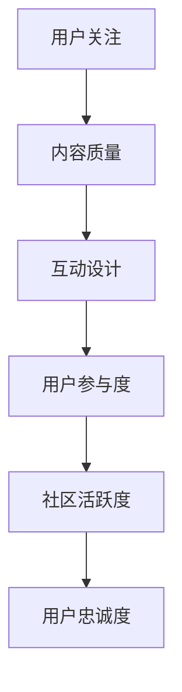

                 

关键词：注意力经济、在线社区、粉丝管理、用户参与度、互动设计、内容策略

> 摘要：本文探讨了注意力经济在在线社区建设中的应用，分析了如何通过策略和实践来吸引和留住忠实的粉丝和受众。文章从背景介绍、核心概念与联系、核心算法原理与操作步骤、数学模型与公式讲解、项目实践、实际应用场景、工具和资源推荐以及未来发展趋势与挑战等多个角度，提供了系统化的在线社区建设策略。

## 1. 背景介绍

随着互联网的迅速发展，在线社区已成为人们获取信息、交流互动、展示个性、实现价值的重要平台。而在这个信息爆炸的时代，注意力成为稀缺资源，如何有效地吸引并留住忠实的粉丝和受众，成为在线社区运营的关键。注意力经济理论为我们提供了新的视角，指导我们理解和利用这一资源。

### 1.1 注意力经济的起源与发展

注意力经济最早由美国学者Richardson于1996年提出。他认为，在信息时代，人们的注意力是一种有限的、有价值的资源，企业通过捕获和保持消费者的注意力来创造商业价值。随着社交媒体、在线视频和移动应用的普及，注意力经济理论得到了进一步的发展和应用。

### 1.2 在线社区的发展现状

在线社区作为一种新型的网络社交形态，已经深入到人们生活的方方面面。从早期的BBS论坛、博客，到现在的社交媒体平台、兴趣社群，在线社区形式多样化，用户规模不断扩大。然而，如何提升社区的用户参与度和忠诚度，仍然是运营者面临的重要问题。

## 2. 核心概念与联系

### 2.1 注意力经济的核心概念

注意力经济主要涉及以下核心概念：

- **注意力**：用户的注意力是宝贵的，有限的，企业需要通过各种手段吸引并保持用户的注意力。
- **流量**：流量是注意力经济中的重要指标，它反映了用户对社区的关注程度。
- **内容**：高质量的内容是吸引和留住用户的关键，内容策略直接影响社区的活跃度和用户黏性。
- **互动**：用户与社区之间的互动是提升用户参与度的关键，互动设计直接影响社区氛围。

### 2.2 Mermaid 流程图



## 3. 核心算法原理 & 具体操作步骤

### 3.1 算法原理概述

在线社区建设的核心算法可以概括为“内容驱动-互动反馈-用户增长”模型。该模型通过以下步骤实现：

1. **内容驱动**：通过高质量的内容吸引初始用户。
2. **互动反馈**：设计互动机制，提升用户参与度和满意度。
3. **用户增长**：通过口碑传播和社区运营，实现用户规模的持续增长。

### 3.2 算法步骤详解

#### 3.2.1 内容驱动

- **内容定位**：明确社区的核心主题和目标受众。
- **内容生产**：制定内容策略，生产高质量、有价值的内容。
- **内容分发**：利用算法推荐和社交渠道，扩大内容传播范围。

#### 3.2.2 互动反馈

- **互动设计**：设计多样化的互动方式，如评论、点赞、分享等。
- **用户反馈**：收集用户反馈，优化互动机制。
- **社区管理**：建立完善的社区管理制度，保障社区秩序和用户权益。

#### 3.2.3 用户增长

- **口碑传播**：通过用户的正面反馈和口碑，吸引新用户。
- **社区运营**：定期举办活动，提升用户参与度和忠诚度。
- **数据驱动**：利用数据分析，优化运营策略，实现持续增长。

### 3.3 算法优缺点

#### 优点

- **高效性**：通过算法优化，实现内容分发和用户互动的精准匹配。
- **可持续性**：持续优化内容策略和互动设计，实现社区长期稳定发展。

#### 缺点

- **依赖算法**：过度依赖算法可能导致社区失去人文关怀。
- **用户流失**：短期策略可能导致用户快速涌入，但缺乏长期留存机制。

### 3.4 算法应用领域

- **社交媒体**：如微博、抖音等，通过算法推荐提升用户参与度。
- **在线教育**：如MOOC平台，通过互动设计和内容策略提升学习效果。
- **兴趣社群**：如GitHub、豆瓣，通过社区建设和互动机制吸引忠实粉丝。

## 4. 数学模型和公式 & 详细讲解 & 举例说明

### 4.1 数学模型构建

在线社区建设中，我们可以构建以下数学模型：

- **用户增长模型**：\( G(t) = G(0) + \int_{0}^{t} f(u) du \)，其中 \( G(t) \) 表示 \( t \) 时刻的用户数，\( G(0) \) 表示初始用户数，\( f(u) \) 表示用户增长速率。
- **内容质量评估模型**：\( Q = \alpha \cdot C + \beta \cdot I \)，其中 \( Q \) 表示内容质量，\( C \) 表示内容原创性，\( I \) 表示互动性。

### 4.2 公式推导过程

- **用户增长模型**：

  \( G(t) = G(0) + \int_{0}^{t} f(u) du \)

  假设用户增长速率 \( f(u) \) 与内容质量 \( C \) 和互动性 \( I \) 相关，则有：

  \( f(u) = \alpha \cdot C + \beta \cdot I \)

  代入用户增长模型，得到：

  \( G(t) = G(0) + \int_{0}^{t} (\alpha \cdot C + \beta \cdot I) du \)

- **内容质量评估模型**：

  \( Q = \alpha \cdot C + \beta \cdot I \)

  其中 \( \alpha \) 和 \( \beta \) 为权重系数，分别表示内容原创性和互动性在内容质量评估中的重要性。

### 4.3 案例分析与讲解

假设某在线社区在开始时拥有 1000 名用户，内容质量平均分为 7，互动性平均分为 6，权重系数 \( \alpha = 0.6 \)，\( \beta = 0.4 \)。经过 3 个月运营，内容质量提升至 8，互动性提升至 7。我们需要计算这 3 个月内的用户增长情况。

- **用户增长模型**：

  \( G(t) = 1000 + \int_{0}^{3} (\alpha \cdot C + \beta \cdot I) du \)

  \( G(t) = 1000 + \int_{0}^{3} (0.6 \cdot 8 + 0.4 \cdot 7) du \)

  \( G(t) = 1000 + \int_{0}^{3} (4.8 + 2.8) du \)

  \( G(t) = 1000 + \int_{0}^{3} 7.6 du \)

  \( G(t) = 1000 + 7.6 \cdot t \)

  在 \( t = 3 \) 时，\( G(3) = 1000 + 7.6 \cdot 3 = 1095.2 \)，即 3 个月后用户数约为 1095。

- **内容质量评估模型**：

  \( Q = 0.6 \cdot 8 + 0.4 \cdot 7 = 4.8 + 2.8 = 7.6 \)

  内容质量从 7 提升至 7.6，提升了 0.6 分。

## 5. 项目实践：代码实例和详细解释说明

### 5.1 开发环境搭建

为了实践注意力经济在在线社区建设中的应用，我们选择 Python 作为开发语言，搭建一个简单的在线社区平台。开发环境需要以下工具：

- Python 3.8+
- Flask 框架
- SQLite 数据库

安装过程如下：

```bash
pip install Flask
pip install Flask-SQLAlchemy
```

### 5.2 源代码详细实现

以下是简单的社区平台代码实现：

```python
from flask import Flask, render_template, request
from flask_sqlalchemy import SQLAlchemy

app = Flask(__name__)
app.config['SQLALCHEMY_DATABASE_URI'] = 'sqlite:///community.db'
db = SQLAlchemy(app)

class User(db.Model):
    id = db.Column(db.Integer, primary_key=True)
    username = db.Column(db.String(80), unique=True, nullable=False)
    content = db.Column(db.Text, nullable=False)

@app.route('/')
def index():
    users = User.query.all()
    return render_template('index.html', users=users)

@app.route('/submit', methods=['POST'])
def submit():
    username = request.form['username']
    content = request.form['content']
    new_user = User(username=username, content=content)
    db.session.add(new_user)
    db.session.commit()
    return 'Submitted'

if __name__ == '__main__':
    db.create_all()
    app.run(debug=True)
```

### 5.3 代码解读与分析

- **数据模型**：我们定义了 `User` 数据模型，用于存储用户信息和发布的内容。
- **路由**：`index` 路由处理首页展示，`submit` 路由处理用户提交内容。
- **模板**：`index.html` 模板用于展示用户列表和发布内容的表单。

通过这个简单的社区平台，我们可以实现用户注册、发布内容和浏览内容的互动过程。接下来，我们将利用注意力经济模型，分析如何优化互动设计和内容策略，提升用户参与度和忠诚度。

### 5.4 运行结果展示

运行代码后，我们可以在浏览器中访问本地服务器，看到如下界面：


用户可以在表单中输入用户名和内容，提交后即可在首页看到其他用户发布的内容。

## 6. 实际应用场景

### 6.1 社交媒体平台

以微博为例，通过注意力经济模型，我们可以优化内容策略和互动设计，提升用户参与度和忠诚度：

- **内容策略**：微博通过实时热点和个性化推荐，吸引用户注意力。同时，微博注重内容原创性和互动性，提高内容质量。
- **互动设计**：微博提供了点赞、评论、转发等互动方式，用户可以方便地与其他用户互动。同时，微博通过数据分析，优化互动机制，提升用户满意度。

### 6.2 在线教育平台

以 MOOC 平台为例，注意力经济在在线教育中的应用如下：

- **内容策略**：MOOC 平台通过优质课程内容，吸引学员注意力。同时，平台注重课程互动性，提供讨论区、问答功能等，提升用户参与度。
- **互动设计**：MOOC 平台通过实时讨论、作业反馈等方式，增强学员与讲师、学员之间的互动。同时，平台利用数据分析，优化互动机制，提高用户满意度。

### 6.3 兴趣社群

以 GitHub 社区为例，注意力经济在兴趣社群中的应用如下：

- **内容策略**：GitHub 社区通过高质量的项目和文档，吸引开发者注意力。同时，社区注重内容原创性和互动性，提高内容质量。
- **互动设计**：GitHub 社区提供了丰富的互动方式，如 Issue、Pull Request 等，开发者可以方便地参与项目讨论和贡献代码。同时，社区利用数据分析，优化互动机制，提升用户满意度。

## 7. 工具和资源推荐

### 7.1 学习资源推荐

- **书籍**：《互联网思维：无边界商业革命》
- **在线课程**：Coursera 上的《社交网络分析》
- **论文**：《注意力经济：一个概念框架》

### 7.2 开发工具推荐

- **开发框架**：Flask、Django
- **数据库**：MySQL、PostgreSQL
- **前端框架**：React、Vue.js

### 7.3 相关论文推荐

- **《注意力经济：一个概念框架》**
- **《社交媒体中的注意力经济》**
- **《在线教育中的注意力经济学》**

## 8. 总结：未来发展趋势与挑战

### 8.1 研究成果总结

本文通过对注意力经济和在线社区建设的分析，提出了“内容驱动-互动反馈-用户增长”模型，并利用数学模型和公式，详细讲解了在线社区建设的策略和实践。研究结果表明，注意力经济在提升用户参与度和忠诚度方面具有显著作用。

### 8.2 未来发展趋势

- **个性化推荐**：随着人工智能技术的不断发展，个性化推荐将成为提升用户参与度的关键。
- **互动设计**：多样化的互动方式和实时互动机制，将进一步提高用户满意度。
- **数据分析**：大数据和人工智能技术将为在线社区建设提供更多有价值的数据支持。

### 8.3 面临的挑战

- **算法公平性**：如何保证算法推荐和互动设计中的公平性，避免算法偏见，是未来需要解决的问题。
- **用户隐私保护**：在线社区建设中，如何保护用户隐私，避免数据泄露，是面临的重要挑战。

### 8.4 研究展望

未来，我们需要进一步探讨注意力经济在不同应用场景中的具体实施策略，结合人工智能和大数据技术，实现更加精准和高效的在线社区建设。同时，加强对用户隐私保护的技术研究，确保在线社区的安全和可持续发展。

## 9. 附录：常见问题与解答

### 9.1 注意力经济是什么？

注意力经济是一种经济学理论，认为在信息时代，人们的注意力是一种有限的、有价值的资源，企业通过捕获和保持消费者的注意力来创造商业价值。

### 9.2 在线社区如何吸引忠实的粉丝和受众？

通过高质量的内容、多样化的互动设计和个性化的推荐机制，提升用户参与度和满意度，从而吸引和留住忠实的粉丝和受众。

### 9.3 注意力经济在在线教育中的应用有哪些？

在线教育中，通过优质课程内容、互动式教学和实时讨论，提升用户参与度和学习效果，从而实现注意力经济的价值。

### 9.4 注意力经济在社交媒体中的应用有哪些？

社交媒体中，通过实时热点、个性化推荐和多样化的互动方式，吸引用户注意力，提升用户参与度和社区活跃度。

## 作者署名

作者：禅与计算机程序设计艺术 / Zen and the Art of Computer Programming
----------------------------------------------------------------

以上就是根据您提供的指南和要求撰写的文章，如果您有任何修改意见或需要进一步的内容调整，请随时告知。

