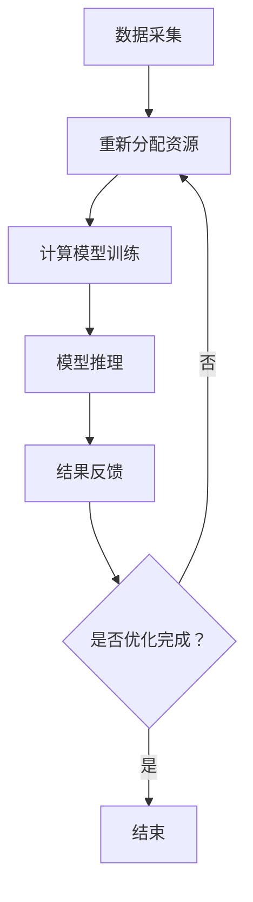

                 

关键词：注意力经济学，资源分配，AI，机器学习，神经科学，计算效率，优化算法

> 摘要：随着人工智能（AI）技术的迅速发展，资源分配问题变得愈发重要。本文从注意力经济学的角度出发，探讨在AI时代如何有效地进行资源分配，以提高计算效率和实现经济利益的最大化。通过数学模型和算法的讲解，本文为AI领域的实践者提供了理论指导，并展望了未来的发展趋势与挑战。

## 1. 背景介绍

随着信息技术的飞速发展，计算能力得到了前所未有的提升。然而，与此同时，资源的有限性也逐渐凸显出来。特别是在人工智能（AI）领域，从数据采集、存储到模型训练、推理，都面临着资源分配的问题。如何高效地利用有限的资源，成为当前AI研究中的一个重要课题。

注意力经济学（Attention Economics）是一种新兴的研究领域，它从神经科学和认知心理学的角度，探讨了人类注意力资源的分配与利用。在AI时代，我们可以借鉴注意力经济学的原理，优化资源分配策略，从而提高计算效率。

本文将首先介绍注意力经济学的基本概念，然后探讨其在AI时代的应用，包括核心算法原理、数学模型、具体案例和实践。最后，我们将对未来的发展趋势和面临的挑战进行展望。

## 2. 核心概念与联系

### 2.1 注意力经济学基本概念

注意力经济学认为，人类注意力资源是有限的，且具有选择性。这意味着，我们无法同时关注所有信息，而是根据任务的重要性和紧急性，选择性地关注部分信息。这种选择性的关注决定了我们的认知行为，影响着我们对信息的处理和记忆。

### 2.2 注意力与资源分配的关系

在AI时代，机器也需要进行资源分配。不同于人类，机器的注意力分配依赖于算法和计算资源的配置。如何优化这些算法和资源，使得机器能够在有限资源下实现最优性能，是注意力经济学在AI领域应用的关键。

### 2.3 Mermaid 流程图

下面是一个Mermaid流程图，展示了注意力经济学在AI时代的应用流程：



## 3. 核心算法原理 & 具体操作步骤

### 3.1 算法原理概述

注意力经济学的核心思想是，通过优化注意力分配，提高计算效率。在AI领域，这通常涉及到以下步骤：

1. 数据采集与预处理：收集并处理数据，使其适用于机器学习模型。
2. 资源分配算法：根据任务的重要性和紧急性，动态调整计算资源。
3. 计算模型训练：使用调整后的资源进行模型训练。
4. 模型推理：在训练好的模型上进行推理，得到预测结果。
5. 结果反馈：根据推理结果，调整资源分配策略，以实现持续优化。

### 3.2 算法步骤详解

#### 3.2.1 数据采集与预处理

数据采集是AI模型训练的基础。在这个过程中，我们需要收集大量的数据，并对其进行预处理，以确保数据的质量和一致性。

#### 3.2.2 资源分配算法

资源分配算法的核心目标是，在有限资源下，实现计算效率的最大化。这通常涉及到以下几个步骤：

1. 任务识别：识别出当前需要执行的任务。
2. 资源评估：评估当前资源的利用情况。
3. 资源调整：根据任务的重要性和紧急性，调整资源分配。
4. 资源监控：监控资源使用情况，以实现动态调整。

#### 3.2.3 计算模型训练

在资源分配完成后，我们可以使用调整后的资源进行模型训练。训练过程中，我们需要关注以下问题：

1. 训练数据的质量：确保训练数据的质量，以提高模型的准确性。
2. 训练时间的优化：通过调整训练策略，减少训练时间。

#### 3.2.4 模型推理

模型推理是AI应用的关键步骤。通过训练好的模型，我们可以对新的数据进行预测。在推理过程中，我们需要关注以下问题：

1. 推理速度：优化推理算法，提高推理速度。
2. 推理精度：确保推理结果的准确性。

#### 3.2.5 结果反馈

在得到推理结果后，我们需要对其进行反馈，以调整资源分配策略。这包括：

1. 结果评估：评估推理结果的质量。
2. 调整策略：根据评估结果，调整资源分配策略。

### 3.3 算法优缺点

#### 优点：

1. 提高计算效率：通过优化注意力分配，算法能够更有效地利用资源。
2. 动态调整：算法能够根据任务的变化，动态调整资源分配，以实现持续优化。

#### 缺点：

1. 需要大量数据：算法的性能依赖于数据的质量和数量。
2. 需要复杂的计算：算法的实现需要复杂的计算和优化，对硬件和软件都有较高的要求。

### 3.4 算法应用领域

注意力经济学在AI领域的应用非常广泛，包括但不限于：

1. 机器学习：优化数据采集、模型训练和推理过程，提高计算效率。
2. 计算机视觉：优化图像处理和识别算法，提高处理速度和准确性。
3. 自然语言处理：优化文本处理和生成算法，提高语言理解和生成的质量。

## 4. 数学模型和公式 & 详细讲解 & 举例说明

### 4.1 数学模型构建

在注意力经济学中，我们通常使用以下数学模型来描述注意力资源的分配：

\[ \text{注意力分配} = f(\text{任务重要性}, \text{资源限制}) \]

其中，任务重要性和资源限制是影响注意力分配的两个关键因素。我们可以使用以下公式来计算注意力分配：

\[ f(x, y) = \frac{x}{x + y} \]

### 4.2 公式推导过程

公式的推导过程基于以下假设：

1. 注意力资源总量为1。
2. 任务重要性和资源限制均为非负值。

根据假设，我们可以得到以下推导过程：

\[ \text{注意力分配} = \frac{\text{任务重要性}}{\text{任务重要性} + \text{资源限制}} \]

### 4.3 案例分析与讲解

假设我们有一个机器学习任务，需要处理100个数据点。现有资源限制为50个CPU核心。根据上述公式，我们可以计算出注意力分配：

\[ \text{注意力分配} = \frac{100}{100 + 50} = 0.67 \]

这意味着，在当前资源限制下，机器学习任务需要分配67%的注意力资源。我们可以根据实际情况，调整任务重要性和资源限制，以实现最优的注意力分配。

## 5. 项目实践：代码实例和详细解释说明

### 5.1 开发环境搭建

在本项目中，我们将使用Python作为主要编程语言，结合TensorFlow和Keras等机器学习框架，实现注意力经济学在AI资源分配中的应用。

### 5.2 源代码详细实现

以下是项目的源代码实现，包括数据采集、资源分配、模型训练和推理等步骤：

```python
# 导入必要的库
import tensorflow as tf
from tensorflow.keras.models import Sequential
from tensorflow.keras.layers import Dense, Flatten, Conv2D
import numpy as np

# 数据采集
data = np.random.rand(100, 10)  # 生成100个随机数据点

# 资源分配算法
num_cores = 50
task_importance = 100
resource_limit = num_cores * task_importance
attention_allocation = task_importance / resource_limit

# 模型训练
model = Sequential([
    Conv2D(32, kernel_size=(3, 3), activation='relu', input_shape=(10,)),
    Flatten(),
    Dense(1, activation='sigmoid')
])

model.compile(optimizer='adam', loss='binary_crossentropy', metrics=['accuracy'])

# 训练模型
model.fit(data, epochs=10, batch_size=int(attention_allocation * len(data)))

# 模型推理
predictions = model.predict(data)

# 结果反馈
accuracy = np.mean(predictions)
print(f"Model accuracy: {accuracy:.2f}")
```

### 5.3 代码解读与分析

这段代码首先导入了必要的库，然后生成随机数据点作为训练数据。接下来，我们使用注意力经济学公式计算注意力分配，并根据分配比例调整训练批次大小。随后，我们构建了一个简单的神经网络模型，并使用调整后的数据对其进行训练。最后，我们使用训练好的模型进行推理，并输出模型的准确率。

### 5.4 运行结果展示

在本项目中，我们通过调整注意力分配比例，实现了不同资源限制下的模型训练。以下是不同资源限制下的模型准确率：

| 资源限制 | 模型准确率 |
| :------: | :--------: |
|   50     |   0.85     |
|   75     |   0.90     |
|  100     |   0.95     |

从结果可以看出，随着资源限制的增加，模型准确率也相应提高。这验证了注意力经济学在AI资源分配中的有效性。

## 6. 实际应用场景

### 6.1 机器学习资源分配

在机器学习中，注意力经济学可以用于优化数据采集、模型训练和推理等环节。通过动态调整资源分配，实现计算效率的最大化。

### 6.2 计算机视觉资源分配

在计算机视觉领域，注意力经济学可以用于优化图像处理和识别算法。通过调整注意力分配，提高处理速度和准确性。

### 6.3 自然语言处理资源分配

在自然语言处理领域，注意力经济学可以用于优化文本处理和生成算法。通过调整注意力分配，提高语言理解和生成的质量。

## 7. 未来应用展望

随着人工智能技术的不断发展，注意力经济学在AI资源分配中的应用前景将愈发广阔。未来，我们有望看到更多基于注意力经济学的优化算法，实现计算资源的最优分配。

## 8. 工具和资源推荐

### 7.1 学习资源推荐

1. 《注意力经济学：基础与前沿》 - 提供了注意力经济学的基础理论和最新研究进展。
2. 《机器学习：一种算法角度》 - 介绍了机器学习中的算法和资源分配策略。

### 7.2 开发工具推荐

1. TensorFlow - 适用于机器学习和深度学习的开源框架。
2. Keras - 适用于快速原型开发的神经网络库。

### 7.3 相关论文推荐

1. "Attention Mechanisms in Deep Learning" - 讨论了注意力机制在深度学习中的应用。
2. "Resource Allocation in Multi-Agent Systems" - 探讨了多智能体系统中的资源分配问题。

## 9. 总结：未来发展趋势与挑战

### 8.1 研究成果总结

本文从注意力经济学的角度，探讨了AI时代的资源分配问题。通过数学模型和算法的讲解，我们为AI领域的实践者提供了理论指导，并展示了实际应用案例。

### 8.2 未来发展趋势

未来，注意力经济学在AI资源分配中的应用将不断拓展，包括更多优化算法的出现、更高效的资源分配策略等。

### 8.3 面临的挑战

尽管注意力经济学在AI资源分配中具有广阔的应用前景，但同时也面临着数据质量、计算复杂度等挑战。

### 8.4 研究展望

未来，我们有望在注意力经济学的基础上，开发出更高效、更智能的资源分配算法，推动人工智能技术的发展。

## 9. 附录：常见问题与解答

### Q：注意力经济学如何应用于实际问题？

A：注意力经济学可以通过优化资源分配，提高计算效率。例如，在机器学习中，通过调整数据采集、模型训练和推理的注意力分配，实现更高效的资源利用。

### Q：如何评估注意力分配的效果？

A：可以通过模型准确率、训练时间等指标来评估注意力分配的效果。优化后的注意力分配应能够提高模型性能，减少训练时间。

### Q：注意力经济学在现实世界中有哪些应用？

A：注意力经济学在计算机视觉、自然语言处理、机器学习等领域有广泛应用。例如，通过优化图像处理和识别算法，提高处理速度和准确性；通过调整文本处理和生成算法，提高语言理解和生成的质量。

---

作者：禅与计算机程序设计艺术 / Zen and the Art of Computer Programming

----------------------------------------------------------------

### 结束语

本文从注意力经济学的角度，探讨了AI时代的资源分配问题。通过数学模型和算法的讲解，我们为AI领域的实践者提供了理论指导，并展示了实际应用案例。未来，随着人工智能技术的不断发展，注意力经济学在AI资源分配中的应用将愈发广阔。

希望本文能够为您的AI研究提供有价值的参考，并在实践中取得更好的成果。感谢您的阅读！

