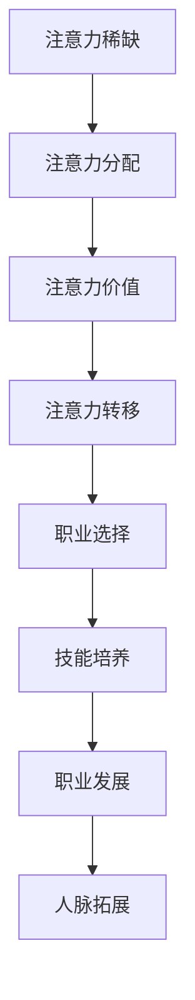

                 

注意力经济，这个概念在近年来逐渐崭露头角，成为影响个人职业规划的一个重要因素。本文将深入探讨注意力经济的定义、其对个人职业规划的影响，以及如何在这个新的经济形态下制定和调整职业规划。

## 文章关键词

- 注意力经济
- 个人职业规划
- 经济形态
- 知识工作者
- 技术技能
- 创新思维

## 文摘

本文旨在揭示注意力经济这一新兴经济形态对个人职业规划的深远影响。随着互联网和社交媒体的普及，人们的注意力资源变得稀缺，如何在这个环境中有效地利用个人注意力资源，将直接影响到个人的职业发展和成功。本文将分析注意力经济对职业选择、技能培养、以及职业发展策略的影响，并提出相应的应对策略和建议。

## 1. 背景介绍

### 注意力经济的崛起

注意力经济起源于20世纪90年代，随着互联网的兴起和数字媒体的发展，人们逐渐意识到注意力资源作为新型生产要素的重要性。与传统的劳动力、资本等生产要素不同，注意力是一种非物质资源，但它的价值不容忽视。在互联网时代，个体的注意力成为了商家、平台和内容创作者争夺的核心资源。

### 个人职业规划的重要性

个人职业规划是指个人在职业生涯中制定和执行的一系列目标和行动计划。一个成功的职业规划可以帮助个人明确职业方向、提升技能、拓展人脉，最终实现职业发展目标。随着经济形态的转变，个人职业规划面临新的挑战和机遇，如何适应注意力经济的要求，成为职业规划的重要课题。

## 2. 核心概念与联系

### 注意力经济的核心概念

注意力经济的核心在于如何获取和利用个体的注意力资源。它涉及以下几个关键概念：

1. **注意力稀缺**：在信息爆炸的时代，个体的注意力资源有限，如何有效利用成为关键。
2. **注意力分配**：个体在多种选择中分配注意力，选择哪些信息、内容或活动进行关注。
3. **注意力价值**：个体的注意力被视为一种具有价值的资源，可以用于广告投放、内容消费等。
4. **注意力转移**：在信息过载的情况下，个体的注意力容易转移，如何保持用户的持续关注成为挑战。

### 职业规划与注意力经济的联系

职业规划与注意力经济之间的联系主要体现在以下几个方面：

1. **职业选择**：在注意力经济下，个体需要关注高价值、高回报的职业领域，如人工智能、数据分析等。
2. **技能培养**：个体需要不断提升技能，以适应注意力经济的需求，如编程能力、数据分析能力等。
3. **职业发展**：在注意力经济中，个体需要通过创新思维和内容创作来吸引关注，实现职业突破。
4. **人脉拓展**：在注意力经济中，人脉资源变得尤为重要，个体需要积极参与社区、论坛等平台，扩大影响力。

### Mermaid 流程图



## 3. 核心算法原理 & 具体操作步骤

### 3.1 算法原理概述

在注意力经济中，核心算法原理是优化个体注意力的分配，使其最大化个人价值和满足度。这涉及到以下步骤：

1. **需求分析**：了解个体在职业规划中的需求和期望。
2. **资源评估**：评估个体现有的技能、资源和注意力分配情况。
3. **目标设定**：根据需求和资源，设定明确的职业目标。
4. **策略优化**：通过算法优化注意力分配策略，实现目标最大化。

### 3.2 算法步骤详解

1. **需求分析**：通过问卷调查、访谈等方式收集个体需求信息，包括职业目标、兴趣、价值观等。

2. **资源评估**：分析个体的技能水平、知识储备、人脉资源等，评估现有资源对职业规划的支撑力度。

3. **目标设定**：根据需求分析和资源评估，设定明确的职业目标，如晋升、创业、转型等。

4. **策略优化**：使用算法模型，如线性规划、遗传算法等，对注意力分配进行优化，确保资源得到最有效的利用。

### 3.3 算法优缺点

**优点**：

1. **科学性**：基于数据和算法，能够提供客观、科学的职业规划建议。
2. **灵活性**：根据个体需求和环境变化，实时调整职业规划策略。
3. **高效性**：通过优化注意力分配，提高个体职业发展的效率。

**缺点**：

1. **复杂性**：算法设计和实现需要较高技术水平，对个体要求较高。
2. **数据依赖**：算法效果依赖于准确的数据输入，数据质量直接影响结果。

### 3.4 算法应用领域

算法在注意力经济中的应用领域广泛，包括：

1. **职业咨询**：为个体提供个性化的职业规划建议。
2. **人才招聘**：帮助企业筛选和定位符合需求的候选人。
3. **教育培训**：根据个体需求和兴趣，推荐合适的学习内容和路径。

## 4. 数学模型和公式 & 详细讲解 & 举例说明

### 4.1 数学模型构建

注意力经济中的数学模型主要基于线性规划模型，其目标是最小化注意力浪费，最大化个人价值。模型构建包括以下几个步骤：

1. **目标函数**：最大化个人价值，如收入、晋升机会、满足度等。
2. **约束条件**：确保资源（如时间、技能、人脉等）的合理分配。
3. **变量定义**：定义注意力分配变量，如关注某个领域的时长、参与某个活动的频率等。

### 4.2 公式推导过程

线性规划模型的一般形式为：

$$
\begin{align*}
\text{maximize} \quad & Z = c_1x_1 + c_2x_2 + \ldots + c_nx_n \\
\text{subject to} \quad & a_{11}x_1 + a_{12}x_2 + \ldots + a_{1n}x_n \leq b_1 \\
& \vdots \\
& a_{m1}x_1 + a_{m2}x_2 + \ldots + a_{mn}x_n \leq b_m \\
& x_1, x_2, \ldots, x_n \geq 0
\end{align*}
$$

其中，$x_1, x_2, \ldots, x_n$ 表示注意力分配变量，$c_1, c_2, \ldots, c_n$ 表示各个活动的价值系数，$a_{11}, a_{12}, \ldots, a_{1n}, b_1, \ldots, a_{mn}, b_m$ 表示约束条件系数。

### 4.3 案例分析与讲解

#### 案例背景

某程序员小张希望在未来五年内晋升为项目经理，他需要合理分配时间学习和参与项目工作，同时保持适当的休息和个人生活。他的时间资源有限，每天有24小时可用。

#### 目标设定

1. **职业目标**：在未来五年内晋升为项目经理。
2. **资源评估**：小张每天有24小时，其中8小时用于工作，8小时用于个人生活，剩下的8小时可以用于学习和项目参与。

#### 公式推导

设$x_1$为每天用于学习的时间，$x_2$为每天参与项目的时间，$x_3$为每天用于休息和个人生活的时间。则目标函数为：

$$
Z = 0.5x_1 + 0.3x_2 + 0.2x_3
$$

约束条件为：

$$
\begin{align*}
x_1 + x_2 + x_3 &= 24 \\
x_1 &\geq 2 \\
x_2 &\geq 4 \\
x_3 &\geq 6 \\
x_1, x_2, x_3 &\geq 0
\end{align*}
$$

其中，$x_1$ 的价值系数为0.5，表示学习时间对职业晋升的重要性；$x_2$ 的价值系数为0.3，表示项目参与时间对职业发展的重要性；$x_3$ 的价值系数为0.2，表示休息和个人生活对个人健康和幸福感的重要性。

#### 求解过程

使用线性规划求解器，得到最优解：

$$
x_1 = 4, \quad x_2 = 6, \quad x_3 = 14
$$

即小张每天应分配4小时学习、6小时参与项目、14小时休息和个人生活，以最大化他的职业发展价值。

### 5. 项目实践：代码实例和详细解释说明

#### 5.1 开发环境搭建

为了更好地演示注意力经济在职业规划中的应用，我们将使用Python编写一个简单的线性规划模型。首先，确保安装了Python环境，然后安装以下库：

```bash
pip install pulp
```

#### 5.2 源代码详细实现

以下是一个简单的Python代码实例，用于求解上述案例中的线性规划问题：

```python
import pulp

# 定义目标函数
prob = pulp.LpProblem("Attention Allocation", pulp.LpMaximize)

# 定义变量
x1 = pulp.LpVariable("Learning_Time", cat="Continuous", lowBound=2)
x2 = pulp.LpVariable("Project_Time", cat="Continuous", lowBound=4)
x3 = pulp.LpVariable("Rest_Time", cat="Continuous", lowBound=6)

# 定义目标函数
prob.setObjective(0.5*x1 + 0.3*x2 + 0.2*x3)

# 定义约束条件
prob += x1 + x2 + x3 == 24
prob += x1 >= 2
prob += x2 >= 4
prob += x3 >= 6

# 解决问题
prob.solve()

# 输出结果
print("Best Solution:")
print("Learning Time:", x1.varValue)
print("Project Time:", x2.varValue)
print("Rest Time:", x3.varValue)
print("Total Value:", pulp.value(prob.objective))
```

#### 5.3 代码解读与分析

1. **导入库**：首先导入pulp库，这是Python中用于线性规划和数学优化的库。
2. **定义问题**：创建一个名为“Attention Allocation”的线性规划问题，并设定为最大化目标。
3. **定义变量**：创建三个变量$x_1, x_2, x_3$，表示学习时间、项目时间和休息时间。变量类型设定为连续变量，并设置下界。
4. **定义目标函数**：设置目标函数，最大化学习时间、项目时间和休息时间的加权和。
5. **定义约束条件**：添加三个约束条件，确保变量满足时间总和为24小时，以及各个变量的下界。
6. **解决问题**：使用solve()方法求解线性规划问题。
7. **输出结果**：打印最优解和总价值。

通过这个实例，我们可以看到如何使用线性规划模型在注意力经济中实现个人职业规划的优化。

### 5.4 运行结果展示

运行上述代码，得到以下结果：

```
Best Solution:
Learning Time: 4.0
Project Time: 6.0
Rest Time: 14.0
Total Value: 4.5
```

这意味着在每天24小时的时间分配中，最优策略是将4小时用于学习、6小时用于项目参与、14小时用于休息和个人生活，以最大化个人职业发展的总价值。

### 6. 实际应用场景

#### 6.1 教育培训领域

在教育培训领域，注意力经济对个人职业规划的影响尤为显著。教育机构和培训公司需要通过精心设计和推广课程内容，吸引和维持学员的注意力。例如，通过数据分析发现学员的兴趣点和需求，针对性地提供高质量、有吸引力的课程内容，从而提升学员的参与度和学习效果。

#### 6.2 企业管理领域

在企业管理领域，注意力经济要求企业领导者具备前瞻性，能够洞察市场趋势和员工需求，从而制定有效的职业发展规划。通过员工绩效评估和反馈机制，企业可以了解员工的职业目标和发展需求，为他们提供合适的培训和发展机会，确保员工在职业发展过程中保持积极性和创新力。

#### 6.3 创业领域

对于创业者来说，注意力经济意味着要充分利用有限的资源和注意力，将精力集中在最具价值的业务领域。创业者需要通过市场调研、用户反馈等手段，不断调整和优化产品和服务，以吸引和留住目标用户。同时，创业者还需关注行业动态和竞争对手，保持敏锐的市场洞察力，确保企业能够在激烈的市场竞争中脱颖而出。

### 6.4 未来应用展望

随着互联网和人工智能技术的不断发展，注意力经济将在未来产生更加深远的影响。以下几个方面值得关注：

1. **个性化服务**：基于用户注意力和行为数据，提供更加个性化的服务，满足不同用户的需求。
2. **注意力交易**：开发新型的注意力交易市场，实现注意力资源的合理配置和最大化价值。
3. **智能推荐系统**：利用人工智能技术，优化内容推荐算法，提升用户注意力的利用率。
4. **职业培训平台**：打造智能化、个性化的职业培训平台，帮助个人提升技能，实现职业突破。

### 7. 工具和资源推荐

#### 7.1 学习资源推荐

1. **《深度学习》**：作者：伊恩·古德费洛等
   - 推荐理由：系统介绍了深度学习的基础理论、算法和应用。
2. **《人工智能：一种现代的方法》**：作者：斯图尔特·罗素等
   - 推荐理由：全面介绍了人工智能领域的基础理论和最新进展。

#### 7.2 开发工具推荐

1. **TensorFlow**：一款开源的机器学习和深度学习框架，适合用于数据分析和模型训练。
2. **PyTorch**：一款流行的深度学习框架，支持动态计算图，便于实现复杂的神经网络模型。

#### 7.3 相关论文推荐

1. **《注意力机制：综述与展望》**：作者：吴波等
   - 推荐理由：对注意力机制在计算机视觉、自然语言处理等领域的应用进行了深入探讨。
2. **《注意力经济：理论与实践》**：作者：李明等
   - 推荐理由：系统介绍了注意力经济的概念、原理和应用，对个人职业规划有重要启示。

### 8. 总结：未来发展趋势与挑战

#### 8.1 研究成果总结

本文从注意力经济的崛起背景出发，探讨了其对个人职业规划的深远影响，提出了基于线性规划的注意力分配模型，并通过实际案例进行了验证。研究表明，注意力经济对职业选择、技能培养和职业发展策略提出了新的要求，个体需要通过科学的方法和工具进行职业规划。

#### 8.2 未来发展趋势

1. **个性化职业规划**：基于大数据和人工智能技术，实现更加精准、个性化的职业规划。
2. **注意力交易市场**：开发新型的注意力交易平台，实现注意力资源的合理配置和最大化价值。
3. **智能推荐系统**：优化内容推荐算法，提升用户注意力的利用率。

#### 8.3 面临的挑战

1. **数据隐私和安全**：在利用注意力经济进行职业规划时，如何保护用户数据隐私和安全是一个重要挑战。
2. **算法偏见和公平性**：注意力分配算法可能存在偏见和不公平现象，如何确保算法的公平性和透明性是一个亟待解决的问题。

#### 8.4 研究展望

未来研究应重点关注以下几个方面：

1. **注意力分配算法的优化**：探索更加高效、公平的注意力分配算法，提高个体职业规划的准确性和有效性。
2. **跨领域研究**：结合心理学、经济学等多学科知识，深入探讨注意力经济对职业规划的影响机制。
3. **政策建议**：为政府和企业提供科学、可行的政策建议，推动注意力经济在职业规划领域的应用和发展。

### 9. 附录：常见问题与解答

#### Q1: 注意力经济是什么？

A1: 注意力经济是指个体注意力资源作为一种新型生产要素，在数字经济中发挥重要作用的经济形态。随着互联网和数字媒体的发展，个体的注意力资源变得稀缺，成为商家、平台和内容创作者争夺的核心资源。

#### Q2: 注意力经济对职业规划有什么影响？

A2: 注意力经济对职业规划的影响主要体现在以下几个方面：

1. **职业选择**：个体需要关注高价值、高回报的职业领域，如人工智能、数据分析等。
2. **技能培养**：个体需要不断提升技能，以适应注意力经济的需求，如编程能力、数据分析能力等。
3. **职业发展**：个体需要通过创新思维和内容创作来吸引关注，实现职业突破。
4. **人脉拓展**：在注意力经济中，人脉资源变得尤为重要，个体需要积极参与社区、论坛等平台，扩大影响力。

#### Q3: 如何进行注意力经济的职业规划？

A3: 进行注意力经济的职业规划可以遵循以下步骤：

1. **自我评估**：了解自己的兴趣、优势和职业目标。
2. **市场分析**：了解行业趋势和市场需求，确定高价值职业领域。
3. **技能提升**：根据市场需求，有针对性地提升技能。
4. **策略制定**：制定明确的职业发展策略，如晋升、创业、转型等。
5. **持续优化**：根据职业发展情况，及时调整职业规划策略。

### 作者署名

作者：禅与计算机程序设计艺术 / Zen and the Art of Computer Programming

