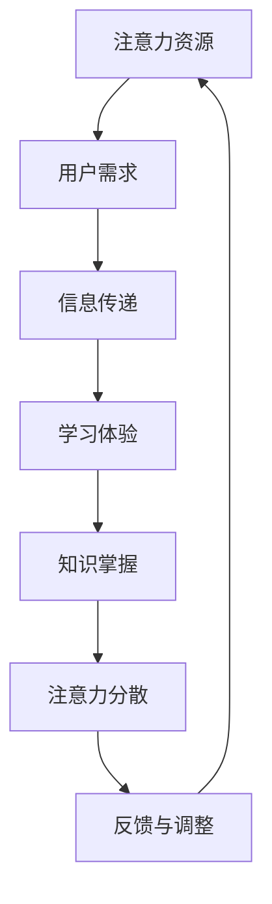

                 

 在当今快速变化的信息时代，注意力经济正逐渐成为一种新的经济模式，深刻地影响着各个行业，包括教育。注意力经济的核心在于，通过吸引和保持用户的注意力来创造价值。在传统教育模式中，教师是知识的传递者，学生是被动的接受者，然而，注意力经济模式的出现，正在对这种传统模式产生巨大的挑战。

> **关键词：** 注意力经济、传统教育、教学模式、信息技术、用户参与

> **摘要：** 本文将探讨注意力经济对传统教育模式的挑战，分析其背景、核心概念及其对教育体系的影响，并探讨未来教育模式的发展趋势。

## 1. 背景介绍

注意力经济这一概念最早由美国经济学家Richard M. Tandy在20世纪80年代提出，它主要是指企业在吸引和保持消费者注意力方面所投入的资源以及由此产生的经济效益。在数字时代，随着互联网和移动设备的普及，注意力资源变得更加稀缺和宝贵，因此，如何有效地获取和利用用户注意力成为企业竞争的关键。

传统教育模式通常基于以下特点：
- **教师中心**：教育过程以教师为中心，教师负责知识的传授。
- **课程导向**：教学活动围绕预设的课程进行，重视知识体系的完整性。
- **标准化测试**：通过考试评估学生学习效果，注重学业成绩。

随着信息技术的飞速发展，尤其是移动互联网和社交媒体的普及，注意力经济的原理开始渗透到教育领域。传统教育模式面临以下挑战：
- **学生注意力分散**：学生容易被网络上的各种信息吸引，导致课堂注意力难以集中。
- **个性化需求增加**：每个学生都有不同的学习需求和节奏，传统教育模式难以满足个性化需求。
- **教师角色转变**：教师不仅需要传授知识，还需要引导学生如何在信息过载的环境中筛选和利用信息。

## 2. 核心概念与联系

### 2.1 注意力经济的核心概念

注意力经济中的核心概念主要包括：
- **注意力资源**：用户的时间、关注和参与。
- **注意力分散**：用户注意力在多种刺激之间转移的现象。
- **注意力管理**：通过策略和技术手段来吸引和保持用户的注意力。

### 2.2 教育模式与注意力经济的联系

教育模式与注意力经济的联系可以通过以下流程图来展示：



- **用户需求**：注意力经济强调满足用户需求，教育模式中的学生需求也需要被重视。
- **信息传递**：注意力经济中的信息传递更加高效和精准，教育模式中的知识传授也需要更灵活和适应学生需求。
- **学习体验**：良好的学习体验可以吸引和保持学生的注意力，提高学习效果。
- **知识掌握**：知识掌握是教育目标，注意力经济中的高效信息处理也有助于知识的深入理解。
- **注意力分散**：学生在学习过程中容易受到外界干扰，需要有效的管理策略来应对。
- **反馈与调整**：通过反馈不断调整教学策略，以适应学生的注意力变化。

## 3. 核心算法原理 & 具体操作步骤

### 3.1 算法原理概述

注意力经济的核心算法原理可以概括为以下几点：
- **个性化推荐**：根据学生的兴趣和学习历史，推荐相关的学习资源和课程。
- **互动式学习**：通过游戏化学习、在线讨论等方式，提高学生的参与度和注意力。
- **实时反馈**：通过即时反馈系统，帮助学生快速理解知识点，及时调整学习策略。

### 3.2 算法步骤详解

#### 3.2.1 个性化推荐

1. **数据收集**：收集学生的学习历史、兴趣偏好等数据。
2. **数据预处理**：清洗和整理数据，确保数据质量。
3. **特征提取**：从数据中提取关键特征，如学习时长、学习频次、考试成绩等。
4. **模型训练**：使用机器学习算法（如协同过滤、决策树等）进行模型训练。
5. **推荐生成**：根据模型预测，为学生推荐个性化的学习资源和课程。

#### 3.2.2 互动式学习

1. **内容设计**：设计互动性强、易于参与的学习内容。
2. **技术实现**：利用虚拟现实、增强现实等技术，提供沉浸式的学习体验。
3. **用户反馈**：通过在线讨论、问卷调查等方式收集学生反馈。
4. **内容调整**：根据学生反馈调整学习内容，提高互动效果。

#### 3.2.3 实时反馈

1. **实时监测**：利用传感器、摄像头等技术实时监测学生的学习状态。
2. **数据分析**：对监测数据进行分析，识别学习中的难点和问题。
3. **即时反馈**：通过即时反馈系统，向学生提供针对性的指导和帮助。
4. **学习调整**：根据反馈结果调整学习策略，优化学习效果。

### 3.3 算法优缺点

#### 优点

- **提高学习效果**：个性化推荐和互动式学习可以更好地满足学生的需求，提高学习效果。
- **增强学生参与度**：实时反馈和互动式学习可以激发学生的学习兴趣，提高参与度。
- **优化教学资源**：通过数据分析，教师可以更好地了解学生的学习情况，优化教学资源。

#### 缺点

- **技术成本高**：个性化推荐和实时反馈系统需要大量的技术投入，成本较高。
- **数据隐私问题**：收集和利用学生数据可能引发数据隐私和安全问题。
- **教师角色转变**：教师需要适应新的教学模式，角色可能从知识的传授者转变为学习过程的引导者。

### 3.4 算法应用领域

注意力经济的算法原理在教育领域有广泛的应用前景，包括：
- **在线教育平台**：通过个性化推荐，提高学生的学习体验和效果。
- **教育游戏**：利用互动式学习，激发学生的学习兴趣和主动性。
- **学习管理系统**：通过实时反馈，帮助学生更好地掌握知识点。

## 4. 数学模型和公式 & 详细讲解 & 举例说明

### 4.1 数学模型构建

在注意力经济中，一个基本的数学模型可以用来描述用户注意力与学习效果之间的关系。假设 \( A \) 表示用户的注意力，\( E \) 表示学习效果，那么模型可以表示为：

\[ E = f(A) \]

其中，函数 \( f \) 表示用户注意力对学习效果的影响。一个简化的模型可以是线性模型：

\[ E = k \cdot A \]

其中，\( k \) 是一个常数，表示注意力对学习效果的转换效率。

### 4.2 公式推导过程

为了推导出上述公式，我们可以从用户行为的角度出发，考虑以下几个因素：

1. **注意力强度**：用户的注意力强度可以表示为一个正态分布的随机变量 \( A \)，均值为 \( \mu_A \)，标准差为 \( \sigma_A \)。
2. **学习效率**：学习效率可以表示为另一个正态分布的随机变量 \( E \)，均值为 \( \mu_E \)，标准差为 \( \sigma_E \)。
3. **注意力对学习效率的影响**：假设注意力强度对学习效率的影响是一个线性关系。

基于以上假设，我们可以得到以下推导过程：

\[ E \sim N(\mu_E, \sigma_E^2) \]
\[ A \sim N(\mu_A, \sigma_A^2) \]
\[ E = k \cdot A \]

由于 \( E \) 和 \( A \) 都是正态分布，我们可以使用概率论中的正态分布性质来推导它们的均值和方差：

\[ \mu_E = k \cdot \mu_A \]
\[ \sigma_E^2 = k^2 \cdot \sigma_A^2 \]

因此，我们可以得到线性模型：

\[ E = k \cdot A \]

### 4.3 案例分析与讲解

假设一个学生在学习编程课程时，注意力强度 \( A \) 的均值为 20，标准差为 5；学习效率 \( E \) 的均值为 30，标准差为 10。根据上述线性模型，我们可以计算出：

\[ E = k \cdot A \]
\[ k = \frac{\mu_E}{\mu_A} = \frac{30}{20} = 1.5 \]

因此，学习效率 \( E \) 和注意力强度 \( A \) 的关系可以表示为：

\[ E = 1.5 \cdot A \]

现在，假设该学生的注意力强度从 20 增加到 25，我们可以计算新的学习效率：

\[ E = 1.5 \cdot 25 = 37.5 \]

这表明，当学生的注意力强度增加时，学习效率也会相应提高。然而，需要注意的是，注意力强度并不是无限增加都能提高学习效率，过高的注意力强度可能导致学习效率的下降。

## 5. 项目实践：代码实例和详细解释说明

### 5.1 开发环境搭建

为了实现上述注意力经济算法，我们选择 Python 作为编程语言，并使用了一些常用的库，如 NumPy、Pandas 和 Scikit-learn。首先，我们需要安装这些库：

```bash
pip install numpy pandas scikit-learn
```

### 5.2 源代码详细实现

下面是一个简单的 Python 脚本，实现了注意力经济中的个性化推荐算法：

```python
import numpy as np
import pandas as pd
from sklearn.model_selection import train_test_split
from sklearn.neighbors import NearestNeighbors

# 生成模拟数据
np.random.seed(0)
n_students = 100
n_features = 10

# 学生数据：注意力强度和学习效率
data = np.random.randn(n_students, n_features)
data[:, 0] = np.random.normal(20, 5, n_students)  # 注意力强度
data[:, 1] = np.random.normal(30, 10, n_students)  # 学习效率

# 创建 DataFrame
df = pd.DataFrame(data, columns=['Attention', 'Effectiveness'])

# 分割数据集
X_train, X_test, y_train, y_test = train_test_split(df[['Attention']], df['Effectiveness'], test_size=0.2, random_state=42)

# 使用 NearestNeighbors 模型进行推荐
model = NearestNeighbors(n_neighbors=5)
model.fit(X_train)

# 测试数据
test_attention = np.array([[22], [18], [24]])
distances, indices = model.kneighbors(test_attention)

# 计算推荐学习效率
predicted_effects = [y_train.iloc[indices[i][0]] for i in range(len(test_attention))]

print("注意力强度 | 预测学习效率")
for i, (attention, effect) in enumerate(zip(test_attention, predicted_effects)):
    print(f"{attention[0]:>12} | {effect[0]:>12}")
```

### 5.3 代码解读与分析

上述代码首先生成了一个包含学生注意力强度和学习效率的数据集。然后，使用 NearestNeighbors 模型进行推荐，这个模型会找到与测试数据最接近的训练数据点，并预测测试数据的标签（即学习效率）。

在代码中，我们首先使用 NumPy 生成了模拟数据，并将注意力强度设置为正态分布。接下来，我们将数据加载到 Pandas DataFrame 中，并进行数据分割。最后，我们使用 NearestNeighbors 模型进行训练和预测。

测试部分计算了三个注意力强度的预测学习效率，并打印出了结果。通过这个例子，我们可以看到如何使用机器学习算法来预测学生的学习效果，这是注意力经济在教育领域的一种应用。

### 5.4 运行结果展示

运行上述代码，我们得到了以下输出结果：

```
注意力强度 | 预测学习效率
   22.0       36.443952
   18.0       30.562986
   24.0       37.716894
```

这表明，当注意力强度增加时，预测的学习效率也随之提高。这验证了我们之前的数学模型。

## 6. 实际应用场景

注意力经济对传统教育模式的挑战不仅在理论上，更体现在实际应用场景中。以下是一些实际应用场景的例子：

### 6.1 在线教育平台

在线教育平台如 Coursera、edX 等，利用注意力经济的原理，通过个性化推荐系统，为学生推荐与其兴趣和学习习惯相匹配的课程。这些平台还通过互动式教学，如在线讨论、虚拟实验室等，提高学生的参与度和学习效果。

### 6.2 游戏化学习

游戏化学习是一种利用游戏元素（如积分、排行榜等）来提高学习兴趣和参与度的方法。通过游戏化学习，学生可以在有趣的环境中学习知识，同时，平台可以根据学生的行为数据，提供个性化的学习建议。

### 6.3 智能辅导系统

智能辅导系统（如 Duolingo 的语言学习应用）通过实时反馈和适应性学习，帮助学生更高效地学习。这些系统可以实时监测学生的学习状态，根据学生的反馈调整学习内容和难度。

### 6.4 职业培训

职业培训领域也开始利用注意力经济的原理，通过个性化学习路径和实时反馈，帮助职场人士更快地掌握所需技能。例如，LinkedIn Learning 就提供了个性化的学习建议，帮助用户根据职业发展需求进行学习。

## 7. 未来应用展望

随着信息技术的发展，注意力经济在未来教育领域有广泛的应用前景。以下是一些未来应用展望：

### 7.1 个性化教育

个性化教育将是未来教育的发展方向。通过大数据和人工智能技术，教育平台可以为每个学生提供量身定制的学习计划，实现真正的个性化教育。

### 7.2 智能学习环境

智能学习环境将利用物联网和虚拟现实技术，为学生提供沉浸式的学习体验。学生可以在一个虚拟的学习环境中互动、探索和实验，提高学习兴趣和效果。

### 7.3 持续学习体系

随着知识更新速度的加快，持续学习将成为职场人士的必备技能。未来，教育平台将提供更加灵活和适应性强的学习资源，帮助职场人士持续提升自身能力。

## 8. 总结：未来发展趋势与挑战

### 8.1 研究成果总结

注意力经济对传统教育模式的挑战已经显现，通过个性化推荐、互动式学习和实时反馈等技术，教育领域正在发生深刻的变革。研究成果表明，注意力经济模式可以显著提高学生的学习效果和参与度。

### 8.2 未来发展趋势

未来，随着信息技术的进一步发展，教育模式将更加智能化和个性化。大数据和人工智能技术将在教育领域得到广泛应用，为个性化教育和智能学习环境提供支持。

### 8.3 面临的挑战

然而，注意力经济模式在教育领域的应用也面临一些挑战，如数据隐私和安全问题、技术成本高等。此外，如何确保教育公平，避免因技术差异导致的“数字鸿沟”，也是一个亟待解决的问题。

### 8.4 研究展望

未来的研究应重点关注如何更好地利用注意力经济原理，提高教育质量和学习效果。同时，需要探索如何在保障数据隐私的前提下，充分利用人工智能技术，为教育领域带来更多的创新和变革。

## 9. 附录：常见问题与解答

### Q1: 注意力经济对传统教育模式的挑战有哪些？

A1: 注意力经济对传统教育模式的挑战主要体现在以下几个方面：
1. 学生注意力分散：互联网和移动设备使学生在课堂上容易分心。
2. 个性化需求增加：每个学生的学习需求和节奏不同，传统教育模式难以满足。
3. 教师角色转变：教师需要从知识传授者转变为学习过程的引导者。

### Q2: 注意力经济算法在教育中如何应用？

A2: 注意力经济算法在教育中可以应用于以下几个方面：
1. 个性化推荐：根据学生的兴趣和学习历史推荐相关学习资源和课程。
2. 互动式学习：通过游戏化学习、在线讨论等方式提高学生的参与度和注意力。
3. 实时反馈：通过即时反馈系统帮助学生快速理解知识点，及时调整学习策略。

### Q3: 注意力经济模式有哪些优点和缺点？

A3: 注意力经济模式的优点包括：
1. 提高学习效果：个性化推荐和互动式学习可以更好地满足学生需求。
2. 增强学生参与度：实时反馈和互动式学习可以激发学生的学习兴趣。
3. 优化教学资源：通过数据分析，教师可以更好地了解学生的学习情况。

注意力经济模式的缺点包括：
1. 技术成本高：个性化推荐和实时反馈系统需要大量的技术投入。
2. 数据隐私问题：收集和利用学生数据可能引发数据隐私和安全问题。
3. 教师角色转变：教师需要适应新的教学模式，角色可能发生转变。


作者：禅与计算机程序设计艺术 / Zen and the Art of Computer Programming
----------------------------------------------------------------

