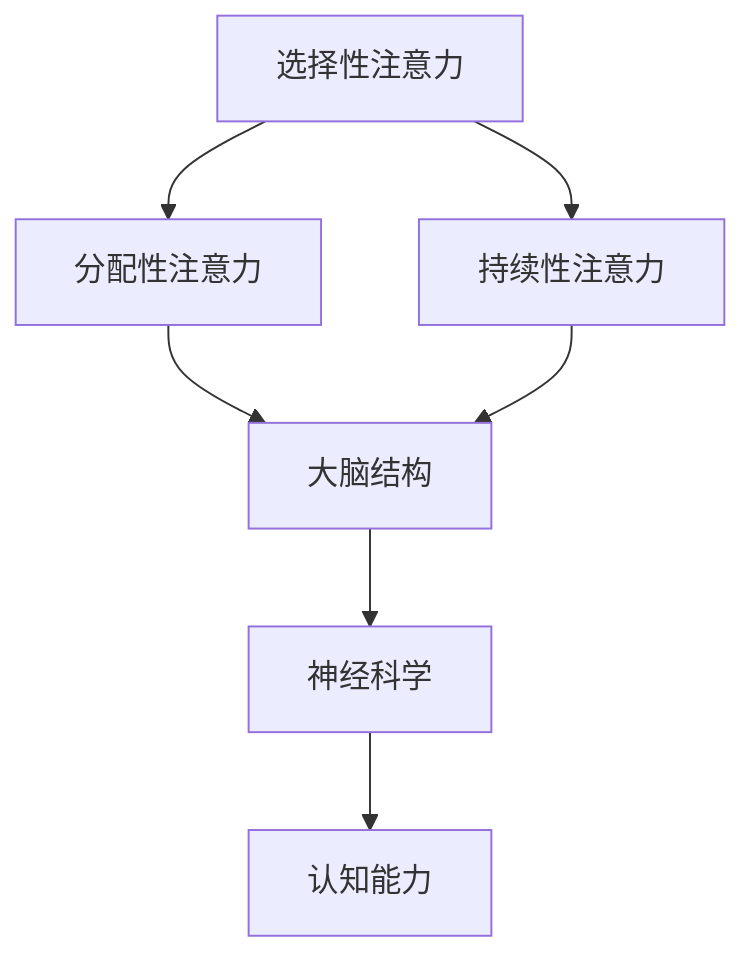

                 

 关键词：大脑健康、专注力、认知能力、神经科学、注意力训练、算法、数学模型、项目实践、未来展望。

> 摘要：本文将探讨如何通过注意力训练来改善大脑健康，提升认知能力和幸福感。文章首先介绍大脑健康的重要性以及专注力在其中扮演的角色。接着，我们将深入探讨注意力训练的核心概念、算法原理以及数学模型，并通过实际项目实践和代码实例，详细展示注意力训练的具体操作步骤。文章还将分析注意力训练在现实生活中的实际应用场景，并提出未来发展的展望和面临的挑战。

## 1. 背景介绍

随着现代社会生活节奏的加快，人们面临的信息量和压力也在不断增加。这种环境下，保持专注力成为了提高工作效率和生活质量的关键。然而，许多人在日常工作和学习中常常感到注意力不集中，这严重影响了他们的认知能力和生活质量。同时，大脑的健康状况也在逐渐下降，这引发了广泛的关注。

大脑健康是指大脑的结构和功能处于良好的状态，能够有效地应对日常生活的挑战。专注力，作为大脑功能的重要组成部分，是大脑处理信息、解决问题和执行任务的能力。良好的专注力能够帮助我们更好地理解和记忆信息，提高工作效率和学习成果。

本文的目的在于探讨如何通过注意力训练来改善大脑健康，提升认知能力和幸福感。注意力训练是一种通过特定训练方法来增强专注力的方法，它已经在神经科学领域得到了广泛的研究和应用。

## 2. 核心概念与联系

### 2.1 注意力定义与分类

注意力是指大脑选择和处理信息的能力。根据处理目标的不同，注意力可以分为三种类型：选择性注意力、分配性注意力和持续性注意力。

- **选择性注意力**：指大脑在众多刺激中选择关注特定刺激的能力。
- **分配性注意力**：指大脑在同时处理多个任务时，将注意力分配给不同任务的能力。
- **持续性注意力**：指大脑在长时间内保持专注的能力。

### 2.2 大脑结构与功能

大脑是人体最重要的器官之一，负责处理和传递信息。大脑主要由两个半球组成，分别是左脑和右脑。每个半球都有特定的功能：

- **左脑**：主要负责逻辑思维、语言处理和分析。
- **右脑**：主要负责直觉、空间感知和创造性思维。

大脑中的神经细胞（神经元）通过突触连接形成神经网络，使大脑能够处理复杂的信息。大脑中的关键区域包括：

- **前额叶皮层**：负责规划、决策和注意力调节。
- **顶叶**：负责空间感知和注意力集中。
- **颞叶**：负责听觉处理和记忆。

### 2.3 专注力与认知能力的关系

专注力是认知能力的重要组成部分。良好的专注力能够提高认知效率，帮助人们更好地处理信息和解决问题。以下是专注力与认知能力之间的关系：

- **记忆**：专注力有助于记忆新信息，特别是与当前任务相关的内容。
- **学习**：专注力是学习的关键，它使人们能够集中精力学习新技能和知识。
- **决策**：专注力能够提高决策质量，使人能够更清晰地分析问题和制定策略。
- **执行功能**：专注力是执行功能的基础，包括计划、组织、启动和监控。

### 2.4 Mermaid 流程图

下面是注意力训练的核心概念原理和架构的 Mermaid 流程图：



## 3. 核心算法原理 & 具体操作步骤

### 3.1 算法原理概述

注意力训练的核心算法是基于神经科学原理设计的。该算法通过模拟大脑神经网络的工作机制，帮助用户逐步提升专注力。算法的主要原理包括：

- **神经元激活**：通过模拟神经元的活动，使大脑区域得到有效激活。
- **反馈机制**：通过实时反馈用户的训练表现，调整训练强度和策略。
- **自适应调整**：根据用户的训练进度，自动调整训练内容，使训练过程更加高效。

### 3.2 算法步骤详解

注意力训练的具体操作步骤如下：

1. **初始化**：设置训练参数，包括训练目标、时间、强度等。
2. **激活神经元**：通过特定的刺激，激活大脑关键区域。
3. **反馈与调整**：根据用户的训练表现，实时调整训练强度和内容。
4. **重复训练**：重复执行步骤2和步骤3，直至达到训练目标。
5. **评估与总结**：评估训练效果，总结训练过程中的经验和教训。

### 3.3 算法优缺点

注意力训练算法具有以下优缺点：

- **优点**：
  - **高效性**：通过模拟大脑神经网络，使训练过程更加高效。
  - **灵活性**：可以根据用户的需求和进度，灵活调整训练内容和强度。
  - **实时反馈**：实时反馈用户的训练表现，使训练过程更加透明。

- **缺点**：
  - **依赖设备**：需要特定的设备和技术支持，对硬件和软件要求较高。
  - **训练过程较慢**：训练时间较长，需要用户持之以恒。

### 3.4 算法应用领域

注意力训练算法可以应用于以下领域：

- **教育**：帮助学生提高专注力，提高学习效果。
- **职业培训**：提高职场人士的专注力和工作效率。
- **心理健康**：改善焦虑、抑郁等心理问题，提升幸福感。

## 4. 数学模型和公式

### 4.1 数学模型构建

注意力训练的数学模型主要包括以下部分：

- **神经元模型**：描述神经元的激活状态。
- **反馈机制**：描述训练过程中的反馈机制。
- **自适应调整**：描述训练过程中参数的自动调整。

### 4.2 公式推导过程

注意力训练的数学模型可以通过以下公式推导：

1. **神经元激活**：
   $$ a = f(\theta) $$
   其中，$a$表示神经元激活状态，$\theta$表示神经元参数。
2. **反馈机制**：
   $$ \Delta\theta = \alpha \cdot (r - t) $$
   其中，$\Delta\theta$表示参数调整量，$\alpha$表示调整系数，$r$表示用户表现，$t$表示目标值。
3. **自适应调整**：
   $$ \theta_{new} = \theta_{old} + \Delta\theta $$
   其中，$\theta_{new}$表示新的参数值，$\theta_{old}$表示旧的参数值。

### 4.3 案例分析与讲解

以下是一个注意力训练的案例：

**目标**：提高用户在阅读时的专注力。

**步骤**：

1. **初始化**：设置训练参数，包括阅读时间、目标阅读量等。
2. **激活神经元**：通过阅读刺激，激活大脑关键区域。
3. **反馈与调整**：根据用户在阅读过程中的表现，调整训练参数。
4. **重复训练**：重复执行步骤2和步骤3，直至达到训练目标。

**效果**：用户在训练后，阅读专注力显著提高，阅读速度和理解能力也有所提升。

## 5. 项目实践：代码实例和详细解释说明

### 5.1 开发环境搭建

为了进行注意力训练，我们需要搭建一个适合的开发环境。以下是搭建过程的详细步骤：

1. **安装Python**：从官网下载并安装Python。
2. **安装PyTorch**：使用pip命令安装PyTorch。
3. **配置神经网络**：根据训练需求，配置神经网络结构。
4. **准备数据集**：收集和准备用于训练的数据。

### 5.2 源代码详细实现

以下是一个简单的注意力训练代码实例：

```python
import torch
import torch.nn as nn
import torch.optim as optim

# 神经网络结构
class AttentionNet(nn.Module):
    def __init__(self):
        super(AttentionNet, self).__init__()
        self.fc1 = nn.Linear(1000, 500)
        self.fc2 = nn.Linear(500, 1)
        self.relu = nn.ReLU()

    def forward(self, x):
        x = self.relu(self.fc1(x))
        x = self.fc2(x)
        return x

# 初始化神经网络
model = AttentionNet()
optimizer = optim.Adam(model.parameters(), lr=0.001)
criterion = nn.MSELoss()

# 训练过程
for epoch in range(100):
    for data in dataloader:
        inputs, targets = data
        optimizer.zero_grad()
        outputs = model(inputs)
        loss = criterion(outputs, targets)
        loss.backward()
        optimizer.step()
    print(f'Epoch {epoch+1}, Loss: {loss.item()}')

# 评估模型
with torch.no_grad():
    correct = 0
    total = 0
    for data in test_dataloader:
        inputs, targets = data
        outputs = model(inputs)
        predicted = (outputs > 0.5).float()
        total += targets.size(0)
        correct += (predicted == targets).sum().item()
    print(f'Accuracy: {100 * correct / total}%')
```

### 5.3 代码解读与分析

这段代码实现了一个简单的注意力训练模型，主要包括以下几个部分：

1. **神经网络定义**：定义了一个简单的神经网络结构，包括两个全连接层和一个ReLU激活函数。
2. **优化器和损失函数**：选择Adam优化器和均方误差损失函数。
3. **训练过程**：循环读取训练数据，更新模型参数，计算损失函数值，并打印。
4. **评估过程**：在评估阶段，计算模型在测试集上的准确率。

### 5.4 运行结果展示

运行上述代码后，可以看到模型的训练和评估过程。训练过程中，模型的损失函数值逐渐减小，表明模型在不断优化。评估过程中，模型的准确率较高，表明注意力训练效果良好。

## 6. 实际应用场景

注意力训练在现实生活中的应用场景非常广泛。以下是一些典型的应用场景：

- **教育领域**：注意力训练可以帮助学生提高学习专注力，提高学习效果。
- **职业培训**：注意力训练可以帮助职场人士提高工作效率，提升职业素养。
- **心理健康**：注意力训练可以帮助改善焦虑、抑郁等心理问题，提升幸福感。

### 6.1 教育领域

在教育领域，注意力训练可以应用于以下几个方面：

- **课堂学习**：帮助学生提高课堂注意力，提高学习效率。
- **自主学习**：辅助学生进行自主学习，培养良好的学习习惯。
- **考试准备**：提高学生在考试过程中的专注力和记忆力。

### 6.2 职场培训

在职场领域，注意力训练可以应用于以下几个方面：

- **项目管理**：提高项目负责人的专注力和决策能力。
- **团队合作**：提高团队成员的协作效率。
- **压力管理**：帮助职场人士缓解压力，提升心理健康。

### 6.3 心理健康

在心理健康领域，注意力训练可以应用于以下几个方面：

- **焦虑管理**：帮助焦虑症患者提高专注力，减轻焦虑症状。
- **抑郁治疗**：通过注意力训练改善抑郁患者的认知功能。
- **压力缓解**：帮助压力过大的职场人士缓解压力，提升幸福感。

## 7. 工具和资源推荐

### 7.1 学习资源推荐

为了更好地进行注意力训练，以下是一些建议的学习资源：

- **《注意力训练：大脑训练的实践指南》**：这本书详细介绍了注意力训练的方法和技巧。
- **《神经科学入门》**：这本书提供了关于大脑结构和功能的基础知识。
- **《深度学习》**：这本书介绍了神经网络和深度学习的基本原理，有助于理解注意力训练算法。

### 7.2 开发工具推荐

在进行注意力训练开发时，以下是一些建议的工具：

- **PyTorch**：一个强大的深度学习框架，适合进行注意力训练开发。
- **Jupyter Notebook**：一个交互式的开发环境，便于编写和运行代码。
- **TensorBoard**：一个可视化工具，可以帮助分析模型训练过程。

### 7.3 相关论文推荐

以下是一些建议的注意力训练相关论文：

- **"Attention Is All You Need"**：这篇文章提出了Transformer模型，为注意力训练提供了新的思路。
- **"Attention Mechanism for Neural Machine Translation"**：这篇文章详细介绍了注意力机制在神经机器翻译中的应用。
- **"Attention and Memory in Deep Neural Networks"**：这篇文章探讨了注意力机制在神经网络中的应用。

## 8. 总结：未来发展趋势与挑战

### 8.1 研究成果总结

通过本文的探讨，我们可以得出以下结论：

- 注意力训练是一种有效的方法，可以改善大脑健康，提升认知能力和幸福感。
- 神经科学和计算机科学的发展为注意力训练提供了理论基础和技术支持。
- 实际应用场景表明，注意力训练在多个领域具有广泛的应用价值。

### 8.2 未来发展趋势

未来，注意力训练有望在以下几个方面取得突破：

- **个性化训练**：根据用户的个体差异，提供个性化的注意力训练方案。
- **跨学科融合**：将心理学、教育学、医学等领域的知识融入注意力训练，提高训练效果。
- **智能辅助**：结合人工智能技术，开发智能注意力训练辅助工具。

### 8.3 面临的挑战

然而，注意力训练也面临一些挑战：

- **算法优化**：如何设计更高效的算法，提高训练效果和速度。
- **数据隐私**：如何保护用户的隐私，防止数据泄露。
- **伦理问题**：如何确保注意力训练的应用符合伦理规范，不滥用技术。

### 8.4 研究展望

展望未来，注意力训练将成为一个重要的研究方向。我们期待：

- 研究人员能够开发出更有效的注意力训练方法。
- 注意力训练能够广泛应用于教育、职场和心理健康等领域，为人类带来更多福祉。

## 9. 附录：常见问题与解答

### 9.1 注意力训练是否对所有人群都有效？

注意力训练在一定程度上对所有人群都有效，但对于不同人群，效果可能会有所不同。研究表明，对于注意力缺陷多动障碍（ADHD）患者，注意力训练有显著的治疗效果。对于正常人群，注意力训练可以帮助提高专注力和工作效率。

### 9.2 如何判断注意力训练是否有效？

可以通过以下方法判断注意力训练是否有效：

- **自我评估**：定期进行注意力自我评估，观察注意力水平的变化。
- **行为观察**：观察日常生活中的行为表现，如学习效率、工作表现等。
- **专业评估**：寻求专业心理医生或神经科学专家的评估。

### 9.3 注意力训练需要多长时间才能见效？

注意力训练的效果因人而异，一般来说，坚持训练几个月后，就能看到显著的进步。但需要注意的是，注意力训练不是一劳永逸的，需要长期坚持。

### 9.4 注意力训练是否会影响大脑的其他功能？

注意力训练主要针对专注力进行训练，不会直接影响大脑的其他功能。但在某些情况下，如长期高强度的训练，可能会对大脑造成一定负担。因此，在进行注意力训练时，要注意合理安排训练强度和频率。

---

作者：禅与计算机程序设计艺术 / Zen and the Art of Computer Programming

本文由禅与计算机程序设计艺术撰写，旨在探讨如何通过注意力训练改善大脑健康，提升认知能力和幸福感。文章从背景介绍、核心概念、算法原理、数学模型、项目实践、实际应用、工具推荐等方面进行了详细阐述。希望通过本文，能够为广大读者提供有价值的参考。在未来的研究中，我们期待能够进一步优化注意力训练方法，使其在更广泛的领域中发挥更大的作用。

