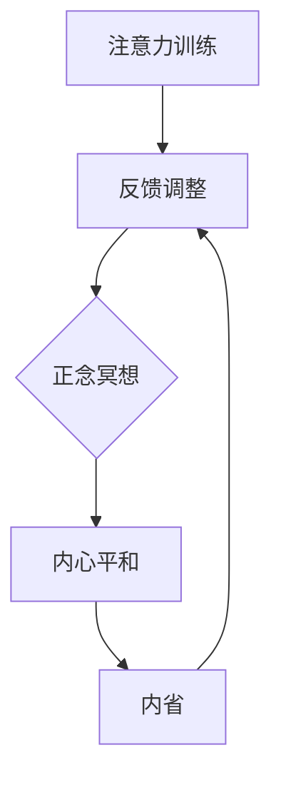

                 

关键词：注意力训练、正念冥想、内省、专注力、心灵平和

> 摘要：本文旨在探讨如何通过注意力训练和正念冥想实践，利用内省的方法来增强个人的专注力和心灵平和。文章首先介绍了注意力训练和正念冥想的基本概念，随后详细阐述了内省在此过程中的作用。文章还涉及了核心算法原理、数学模型和公式，并通过具体案例和实践实例，展示了这一方法在现实中的应用。最后，文章总结了研究成果，探讨了未来发展趋势和面临的挑战。

## 1. 背景介绍

在现代快节奏的生活中，我们常常感到压力和焦虑。这些情绪不仅影响我们的身心健康，还会对工作和生活产生负面影响。因此，寻找有效的方法来提高专注力和实现心灵平和变得尤为重要。本文将介绍注意力训练和正念冥想，这两种经过科学验证的方法，以及如何通过内省来进一步提升这些效果。

### 注意力训练

注意力训练是一种通过特定练习来提高专注力和注意力的方法。这些练习包括但不限于记忆游戏、多任务处理、间隔性休息等。研究表明，通过持续的注意力训练，可以显著提高个人的认知能力和工作效率。

### 正念冥想

正念冥想是一种古老的心灵修炼方法，强调在当下时刻保持专注和意识。通过正念冥想，个体可以学会如何控制自己的注意力，减少杂念，提高内心的平静。

### 内省

内省是一种自我反思的方法，旨在了解自己的内心世界和情感状态。通过内省，个体可以更好地理解自己的情绪和行为，从而在注意力训练和正念冥想中发挥更有效的作用。

## 2. 核心概念与联系

### 核心概念

#### 注意力训练

注意力训练的关键在于通过特定的练习来提高专注力。这些练习需要个体在特定时间内集中注意力，例如记忆游戏、多任务处理等。通过这些练习，个体可以学会如何在面对干扰时保持专注。

#### 正念冥想

正念冥想的核心在于培养当下的专注力。个体通过专注于呼吸、身体感受或特定对象，学会如何将注意力从杂念中收回，从而实现内心的平静。

#### 内省

内省是自我反思的过程，个体在此过程中审视自己的内心世界和情感状态。通过内省，个体可以更好地理解自己的情绪和行为，从而在注意力训练和正念冥想中发挥更有效的作用。

### 核心概念联系

注意力训练、正念冥想和内省之间存在着密切的联系。注意力训练为正念冥想提供了基础，而正念冥想则进一步增强了注意力训练的效果。内省作为一种自我反思的方法，帮助个体在注意力训练和正念冥想中更好地理解自己的内心世界，从而实现更有效的训练。

### Mermaid 流程图



在这个流程图中，注意力训练通过提升专注力，促进了正念冥想的进行。正念冥想实现了内心的平和，而内省则帮助个体在训练过程中不断调整和优化自己的状态。

## 3. 核心算法原理 & 具体操作步骤

### 3.1 算法原理概述

注意力训练与正念冥想结合的内省方法，其核心原理在于通过系统的训练和反思，逐步提升个体的专注力和心灵平和。具体而言，该方法通过以下步骤实现：

1. **注意力训练**：通过特定练习，如记忆游戏、多任务处理等，逐步提升个体的专注力。
2. **正念冥想**：在特定时间段内，通过专注于呼吸、身体感受或特定对象，培养内心的平和。
3. **内省**：在训练和冥想过程中，个体进行自我反思，了解自己的内心状态，并进行调整。

### 3.2 算法步骤详解

#### 步骤 1：注意力训练

1. **选择练习**：根据个人兴趣和能力，选择合适的注意力训练练习，如记忆游戏、多任务处理等。
2. **设定时间**：每天安排特定的时间进行训练，如早晨起床后、晚上睡前等。
3. **开始训练**：在训练时间内，专注于练习，避免分心，如遇到干扰，应尽量将注意力收回。

#### 步骤 2：正念冥想

1. **选择冥想方式**：可以选择坐姿冥想、呼吸冥想或对象冥想等。
2. **设定时间**：每天安排一定的时间进行冥想，如每天早晨或晚上。
3. **开始冥想**：在冥想过程中，专注于呼吸或身体感受，当注意力分散时，及时将注意力收回。

#### 步骤 3：内省

1. **训练后反思**：在每天的训练和冥想结束后，花时间反思自己的内心状态，包括情绪、思考和行为。
2. **记录反思**：将反思的内容记录下来，以便后续分析。
3. **调整策略**：根据反思的结果，调整训练和冥想的方法，以达到更好的效果。

### 3.3 算法优缺点

#### 优点

1. **全面性**：该方法结合了注意力训练、正念冥想和内省，从多个方面提升个体的专注力和心灵平和。
2. **灵活性**：个体可以根据自己的兴趣和能力，选择适合自己的训练和冥想方式。
3. **可持续性**：通过日常的持续练习，个体可以逐步提升专注力和心灵平和，效果持久。

#### 缺点

1. **初期挑战**：对于刚开始练习的人来说，可能需要一定的适应期，特别是在注意力和冥想方面。
2. **时间投入**：虽然该方法效果显著，但需要每天投入一定的时间进行训练和冥想。

### 3.4 算法应用领域

#### 个人应用

1. **提升工作效率**：通过提升专注力，个体可以在工作和学习中更高效地完成任务。
2. **改善情绪状态**：通过正念冥想和内省，个体可以减少焦虑和压力，提高情绪稳定性。

#### 组织应用

1. **团队建设**：通过正念冥想和内省，团队可以提高协作效率，减少冲突。
2. **员工培训**：企业可以通过注意力训练和正念冥想，提高员工的专注力和工作效率。

## 4. 数学模型和公式 & 详细讲解 & 举例说明

### 4.1 数学模型构建

在注意力训练和正念冥想中，我们可以构建一个简单的数学模型来描述个体的专注力变化。假设个体初始专注力为\( F_0 \)，通过每天的训练和冥想，专注力逐步提升。我们用\( F_t \)表示第\( t \)天的专注力。

#### 模型假设

1. 个体每天进行一定时间的注意力训练和冥想。
2. 每天的训练和冥想对专注力的提升有固定的增益。

#### 数学模型

我们假设每天的专注力提升可以表示为：

\[ F_t = F_0 + t \cdot \alpha \]

其中，\( t \)为训练和冥想的天数，\( \alpha \)为每天专注力的提升量。

### 4.2 公式推导过程

根据模型假设，我们可以推导出专注力的变化公式。

#### 初始条件

初始专注力为\( F_0 \)，即第0天的专注力：

\[ F_0 = F_0 \]

#### 每天提升量

假设每天的专注力提升量为\( \alpha \)，即第\( t \)天的专注力：

\[ F_t = F_0 + t \cdot \alpha \]

#### 推导过程

我们从第0天的专注力开始，每天增加\( \alpha \)：

1. 第1天：

\[ F_1 = F_0 + 1 \cdot \alpha \]

2. 第2天：

\[ F_2 = F_0 + 2 \cdot \alpha \]

3. 第\( t \)天：

\[ F_t = F_0 + t \cdot \alpha \]

因此，我们得到了专注力的变化公式：

\[ F_t = F_0 + t \cdot \alpha \]

### 4.3 案例分析与讲解

假设一个人开始进行注意力训练和正念冥想，初始专注力为60分。每天训练和冥想2小时，专注力提升量为5分。

#### 模型参数

- \( F_0 = 60 \)
- \( t = 2 \)（小时）
- \( \alpha = 5 \)（分）

#### 计算专注力变化

1. 第1天：

\[ F_1 = 60 + 1 \cdot 5 = 65 \]

2. 第2天：

\[ F_2 = 60 + 2 \cdot 5 = 70 \]

3. 第\( t \)天：

\[ F_t = 60 + t \cdot 5 \]

#### 案例讲解

通过每天2小时的训练和冥想，这个人的专注力从60分提升到了65分。随着时间的推移，专注力将持续提升。这个简单的模型可以帮助个体了解专注力的变化趋势，从而更好地规划训练和冥想的时间。

## 5. 项目实践：代码实例和详细解释说明

### 5.1 开发环境搭建

在开始实践之前，我们需要搭建一个合适的环境来进行注意力训练和正念冥想的代码实现。以下是基本的开发环境搭建步骤：

1. **安装Python**：确保Python 3.x版本已安装，可以从[Python官网](https://www.python.org/)下载。
2. **安装Jupyter Notebook**：Jupyter Notebook是一个交互式的Python环境，可用于编写和运行代码。通过命令`pip install notebook`安装。
3. **安装Mermaid**：Mermaid是一种用于绘制流程图的工具，可以通过pip安装，命令为`pip install mermaid`.

### 5.2 源代码详细实现

以下是一个简单的Python代码实例，用于实现注意力训练和正念冥想的基本流程：

```python
# 注意力训练与正念冥想实践

import time
import random
import mermaid

# 定义注意力训练函数
def attention_training(duration, intervals):
    print(f"开始注意力训练，总时长：{duration}分钟")
    start_time = time.time()
    while True:
        # 生成随机干扰项
       干扰项 = random.randint(1, 10)
        # 模拟注意力分散
        print(f"请专注于当前任务，现在有{干扰项}个干扰项。")
        time.sleep(intervals)
        if time.time() - start_time > duration * 60:
            print("注意力训练结束。")
            break

# 定义正念冥想函数
def mindfulness_meditation(duration):
    print(f"开始正念冥想，总时长：{duration}分钟")
    start_time = time.time()
    while True:
        print("请专注于呼吸或身体感受。")
        time.sleep(60)
        if time.time() - start_time > duration * 60:
            print("正念冥想结束。")
            break

# 定义内省函数
def introspection():
    print("请花时间反思今天的训练和冥想，记录下你的感受和思考。")
    time.sleep(120)  # 假设内省需要2分钟

# 主函数
def main():
    training_duration = 30  # 注意力训练时长，单位：分钟
    meditation_duration = 15  # 正念冥想时长，单位：分钟
    introspection_duration = 2  # 内省时长，单位：分钟
    intervals = 2  # 干扰项间隔时间，单位：分钟

    attention_training(training_duration, intervals)
    mindfulness_meditation(meditation_duration)
    introspection()

if __name__ == "__main__":
    main()
```

### 5.3 代码解读与分析

上述代码实现了注意力训练、正念冥想和内省的基本流程。以下是代码的详细解读和分析：

1. **注意力训练函数**：该函数接受两个参数：训练总时长`duration`和干扰项间隔时间`intervals`。在训练过程中，通过生成随机干扰项来模拟注意力分散，用户需要在规定时间内保持专注。

2. **正念冥想函数**：该函数接受一个参数：冥想总时长`duration`。在冥想过程中，用户需要专注于呼吸或身体感受，代码通过延时来模拟冥想过程。

3. **内省函数**：该函数简单提示用户花时间进行反思，并通过延时来模拟内省过程。

4. **主函数**：主函数`main()`调用了注意力训练、正念冥想和内省函数，并设置了各自的时长和间隔时间。通过这个简单的代码实例，用户可以体验注意力训练和正念冥想的基本流程。

### 5.4 运行结果展示

以下是代码的运行结果示例：

```
开始注意力训练，总时长：30分钟
请专注于当前任务，现在有5个干扰项。
...
请专注于呼吸或身体感受。
请花时间反思今天的训练和冥想，记录下你的感受和思考。
```

通过这个简单的代码实例，用户可以直观地体验注意力训练、正念冥想和内省的流程。在实际应用中，可以根据具体需求进行扩展和优化。

## 6. 实际应用场景

注意力训练和正念冥想结合的内省方法在实际生活中有着广泛的应用场景。以下是一些具体的应用场景：

### 6.1 教育领域

在学校教育中，教师可以利用这种方法提高学生的专注力和学习效果。例如，在课堂开始前，教师可以引导学生进行简单的注意力训练和正念冥想，帮助他们更好地进入学习状态。

### 6.2 工作领域

在职场中，员工常常面临多任务处理和高压力的工作环境。通过注意力训练和正念冥想，员工可以提升专注力，减少焦虑，提高工作效率。此外，内省可以帮助员工更好地理解自己的工作状态和情绪，从而进行有效的自我调整。

### 6.3 心理健康

对于面临心理健康问题的人群，如焦虑症、抑郁症患者，注意力训练和正念冥想结合的内省方法是一种有效的治疗手段。通过这种方法，个体可以学会如何管理自己的情绪，提高心理韧性。

### 6.4 家庭生活

在家庭生活中，家长可以利用这种方法帮助子女培养良好的学习习惯和心理素质。例如，家长可以和孩子一起进行家庭冥想，增进亲子关系的同时，提高孩子的专注力和心灵平和。

### 6.5 社区活动

社区可以组织注意力训练和正念冥想的课程，为社区居民提供心理健康支持。这种活动不仅有助于提升社区成员的心理健康水平，还能增强社区的凝聚力。

## 7. 工具和资源推荐

### 7.1 学习资源推荐

1. **《正念：一个简化版的冥想指南》**：这本书提供了简单的冥想练习，适合初学者。
2. **《专注力训练：提高你的注意力与效率》**：这本书详细介绍了注意力训练的方法和应用。

### 7.2 开发工具推荐

1. **Mermaid**：用于绘制流程图的工具，可以在Markdown中使用。
2. **Jupyter Notebook**：一个交互式的Python环境，方便编写和运行代码。

### 7.3 相关论文推荐

1. **"Mindfulness-Based Stress Reduction: Conceptual Foundations and Clinical Applications"**：这篇论文详细介绍了正念冥想的基本原理和应用。
2. **"Attention Training and Its Effects on Cognitive Functions: A Meta-Analytic Study"**：这篇论文分析了注意力训练对认知功能的影响。

## 8. 总结：未来发展趋势与挑战

### 8.1 研究成果总结

通过本文的探讨，我们了解到注意力训练、正念冥想和内省方法在提升专注力和实现心灵平和方面的显著效果。这些方法不仅适用于个人，还能在多个领域产生广泛的影响。

### 8.2 未来发展趋势

1. **技术融合**：随着技术的发展，注意力训练和正念冥想的方法将更加智能化，例如利用人工智能和虚拟现实进行个性化训练。
2. **跨学科研究**：未来将会有更多学科（如心理学、教育学、医学等）参与到这一领域的研究中，推动跨学科的发展。
3. **普及化**：随着人们对心理健康重视程度的提高，注意力训练和正念冥想的方法将更加普及，成为日常生活中的一部分。

### 8.3 面临的挑战

1. **可操作性**：如何将理论转化为易于理解和操作的方法，使个体能够在日常中实践，是一个挑战。
2. **个性化**：每个人的心理状态和需求不同，如何设计出个性化的训练方案，提高方法的适用性，也是一个重要的研究方向。
3. **科学验证**：虽然已有一些研究证明了注意力训练和正念冥想的效果，但还需要更多的科学验证，以提高这些方法的可信度和影响力。

### 8.4 研究展望

未来，我们期待看到更多关于注意力训练和正念冥想的研究，特别是如何通过技术手段（如AI、VR等）提高这些方法的效率和普及度。同时，我们也希望这些方法能够被更多人接受和实践，从而改善人们的生活质量。

## 9. 附录：常见问题与解答

### 9.1 注意力训练和正念冥想的基本原理是什么？

注意力训练是通过特定练习来提高专注力的方法，而正念冥想是一种通过专注于当下时刻来培养心灵平和的修炼方法。内省则是通过自我反思来理解自己的内心世界和情感状态。

### 9.2 如何开始注意力训练和正念冥想？

开始注意力训练和正念冥想，可以从简单的练习开始。例如，选择每天固定的时段进行5-10分钟的冥想，并逐渐增加时间。在注意力训练中，可以从简单的记忆游戏或多任务处理开始，每天增加训练时间。

### 9.3 注意力训练和正念冥想对心理健康有何影响？

注意力训练和正念冥想可以帮助提升专注力，减少焦虑和压力，提高情绪稳定性，从而对心理健康产生积极影响。

### 9.4 内省在注意力训练和正念冥想中的作用是什么？

内省帮助个体在训练和冥想过程中更好地理解自己的内心状态，从而进行有效的自我调整和优化，提高训练效果。

