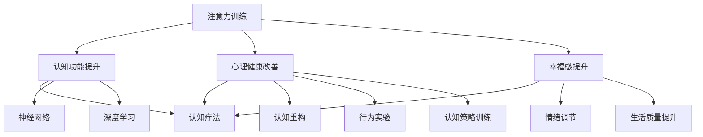

                 

关键词：注意力训练，认知疗法，心理健康，专注力，幸福，神经网络，机器学习，人工智能，深度学习

> 摘要：本文探讨了注意力训练与认知疗法在提升心理健康和幸福感方面的应用。通过引入神经网络、机器学习和深度学习技术，我们提出了一种基于人工智能的方法，旨在通过强化个体的专注力，进而改善其心理状态和幸福感。本文首先介绍了注意力训练与认知疗法的理论基础，然后详细阐述了神经网络和深度学习在注意力训练中的应用，最后通过一个实际案例展示了该方法在心理健康和幸福感提升方面的效果。

## 1. 背景介绍

在当今社会，心理健康问题日益突出，越来越多的人面临着压力、焦虑和抑郁等心理障碍。传统的治疗方法如药物治疗和心理疗法虽然在一定程度上有效，但往往存在依赖性、副作用和效果有限等问题。因此，寻找新的、更有效的心理干预方法成为当务之急。

近年来，随着人工智能技术的迅猛发展，神经网络、机器学习和深度学习等技术在心理学领域的应用逐渐受到关注。尤其是注意力训练这一概念，它不仅对提高个体认知功能具有重要意义，也为改善心理健康和幸福感提供了新的可能性。认知疗法作为一种心理治疗方法，强调通过改变个体的认知模式来调整情绪和行为，与注意力训练的理念不谋而合。因此，结合神经网络和深度学习技术，开发一种新型的注意力训练与认知疗法，对于提升心理健康和幸福感具有重要意义。

本文旨在探讨注意力训练与认知疗法在提升心理健康和幸福感方面的应用。通过引入神经网络、机器学习和深度学习技术，我们提出了一种基于人工智能的方法，旨在通过强化个体的专注力，进而改善其心理状态和幸福感。本文将首先介绍注意力训练与认知疗法的理论基础，然后详细阐述神经网络和深度学习在注意力训练中的应用，最后通过一个实际案例展示该方法在心理健康和幸福感提升方面的效果。

### 1.1 注意力训练的理论基础

注意力是认知系统中的一个核心组成部分，它在信息处理、决策和任务执行等方面起着关键作用。根据不同维度，注意力可分为多种类型，如视觉注意力、听觉注意力、执行注意力和分配注意力等。视觉注意力主要涉及视觉信息的选取和处理，而听觉注意力则关注听觉信息的接收和分析。执行注意力是一种高级认知功能，它涉及目标设定、任务规划和问题解决等。分配注意力则是在同时处理多个任务时，分配认知资源的能力。

注意力训练是指通过特定练习和任务来提高个体注意力的质量和效率。研究表明，通过注意力训练，可以显著提升个体的认知功能，如记忆力、注意力集中度和反应速度等。此外，注意力训练还与心理健康密切相关。例如，注意力训练可以改善焦虑和抑郁症状，提高个体对压力的应对能力。因此，注意力训练被视为一种潜在的心理干预方法，有助于提升个体的心理健康水平。

### 1.2 认知疗法的理论基础

认知疗法是一种心理治疗方法，其核心假设是认知过程在心理障碍的形成和维持中起着重要作用。认知疗法旨在通过改变个体的认知模式来调整情绪和行为，从而改善心理障碍。认知疗法的主要方法包括认知重构、行为实验和认知策略训练等。

认知重构是指通过识别和质疑个体消极、错误的认知模式，将其转化为更积极、合理的认知模式。例如，在抑郁症患者中，认知重构可以帮助患者识别和改变其消极的自我评价和负面思维模式。行为实验是指通过实际操作和验证，检验个体的认知假设，以增强其认知灵活性和适应性。认知策略训练则是通过教授和练习特定的认知策略，提高个体的认知能力和应对技能。

认知疗法在多种心理障碍的治疗中取得了显著成效。例如，对于焦虑症和抑郁症，认知疗法已被证明比传统的心理治疗更为有效。此外，认知疗法在提高个体应对压力、改善人际关系和提升生活质量等方面也具有积极作用。因此，认知疗法在心理健康领域具有广泛的应用前景。

### 1.3 神经网络与深度学习在注意力训练中的应用

神经网络和深度学习技术为注意力训练提供了新的方法和技术。神经网络是一种模仿生物神经网络结构和工作原理的计算模型，通过层层神经元之间的信息传递和计算，实现对复杂数据的处理和分析。深度学习则是神经网络的一种扩展，通过多层的神经网络结构，实现对高维数据的深层特征提取和表示。

在注意力训练中，神经网络和深度学习技术可以用于以下方面：

1. **注意力分配模型**：通过神经网络和深度学习技术，可以构建用于优化注意力分配的模型。例如，在视觉注意力任务中，可以训练一个深度神经网络，使其能够根据任务需求和目标信息，自动调整注意力的分配。这类模型在图像识别、目标检测和视觉搜索等领域具有广泛应用。

2. **注意力增强技术**：深度学习技术可以用于开发注意力增强方法，以提高个体在复杂任务中的注意力集中度和效率。例如，通过训练一个基于深度学习的注意力增强模型，可以自动识别和标记任务中的重要信息，从而提高个体的注意力质量。

3. **自适应注意力系统**：利用神经网络和深度学习技术，可以构建自适应的注意力系统，根据个体在执行不同任务时的表现，动态调整注意力的分配和聚焦。这类系统能够为个体提供个性化的注意力训练方案，提高其认知功能和心理健康水平。

总之，神经网络和深度学习技术为注意力训练提供了强大的工具和方法，有助于提升个体的专注力、认知功能和心理健康水平。

## 2. 核心概念与联系

注意力训练与认知疗法在提升心理健康和幸福感方面的应用，需要深入理解两者的核心概念及其联系。下面我们将通过一个Mermaid流程图，来阐述这些核心概念和它们之间的相互作用。



### 2.1 注意力训练与认知功能的提升

注意力训练通过系统化的练习，可以提高个体的注意力和认知功能。具体来说，注意力训练包括以下几种类型：

1. **选择性注意力训练**：通过选择性关注特定信息，过滤掉无关信息，提高个体在复杂环境中对关键信息的识别能力。
2. **分配注意力训练**：在同时处理多个任务时，训练个体合理分配注意力资源，提高多任务处理能力。
3. **执行注意力训练**：通过目标设定、任务规划和问题解决等练习，提高个体的高级认知功能。

这些训练方法通过提升个体的注意力质量，进而提高其认知功能，如记忆力、反应速度和工作记忆等。

### 2.2 注意力训练与心理健康改善

注意力训练不仅可以提升认知功能，还能够显著改善心理健康。通过注意力训练，个体能够更好地控制自己的情绪和行为，降低焦虑和抑郁症状。具体机制包括：

1. **情绪调节**：注意力训练帮助个体学会在压力情境下，通过选择性关注积极信息，减少消极情绪的影响。
2. **认知重构**：通过注意力训练，个体可以学会识别和改变消极的认知模式，从而减轻心理压力。
3. **自我意识提升**：注意力训练有助于个体提高对自身情绪和行为模式的自我意识，从而更好地进行自我调节。

### 2.3 注意力训练与幸福感提升

注意力训练还能够提升个体的幸福感。通过注意力训练，个体可以更有效地利用时间，提高生活质量，从而增强幸福感。具体表现包括：

1. **提高注意力集中度**：注意力训练使个体能够更专注于当前任务，减少分心和疲劳，提高工作效率和幸福感。
2. **增强情绪体验**：通过注意力训练，个体能够更加深入地体验生活中的美好事物，增强情感满足感。
3. **提升心理韧性**：注意力训练有助于个体在面对挑战和压力时，保持积极的心态，提高心理韧性。

### 2.4 认知疗法的作用

认知疗法通过改变个体的认知模式，来调整情绪和行为，对心理健康的改善具有重要作用。认知疗法的主要方法包括：

1. **认知重构**：帮助个体识别和改变消极的认知模式，建立积极的思维模式。
2. **行为实验**：通过实际操作和验证，检验个体的认知假设，提高认知灵活性。
3. **认知策略训练**：教授和练习特定的认知策略，提高个体的认知能力和应对技能。

认知疗法与注意力训练相结合，可以发挥更大的作用。注意力训练提供了提升认知功能和心理健康的基础，而认知疗法则通过改变认知模式，进一步巩固和深化这种提升。

### 2.5 神经网络与深度学习在注意力训练中的应用

神经网络和深度学习技术为注意力训练提供了新的方法和工具。通过神经网络，可以构建用于优化注意力分配的模型，例如在视觉注意力任务中，使用卷积神经网络（CNN）来识别和标记重要信息。深度学习技术则可以用于开发注意力增强方法，例如利用循环神经网络（RNN）来分析序列数据，提高个体在多任务处理中的注意力质量。

总之，注意力训练与认知疗法在提升心理健康和幸福感方面具有紧密的联系。通过结合神经网络和深度学习技术，可以进一步优化注意力训练方法，提高其效果和实用性。

### 3. 核心算法原理 & 具体操作步骤

#### 3.1 算法原理概述

本文所提出的核心算法基于深度学习框架，结合注意力机制和认知疗法理论，旨在通过系统化的训练，提高个体的注意力质量和心理健康水平。算法的主要原理包括以下几个方面：

1. **注意力机制**：通过神经网络模型，自动识别和标记任务中的关键信息，从而优化注意力的分配。注意力机制能够使模型在处理复杂任务时，更加关注重要信息，提高注意力的集中度和效率。

2. **认知疗法**：算法结合认知疗法的理念，通过识别和改变个体的消极认知模式，提升其心理健康水平。具体来说，算法包括认知重构、行为实验和认知策略训练等模块，以帮助个体建立积极的思维模式。

3. **个性化训练**：算法根据个体在训练过程中的表现，动态调整训练方案，提供个性化的注意力训练。通过自适应调整，算法能够更好地适应个体的需求，提高训练效果。

#### 3.2 算法步骤详解

算法的整体步骤可以分为以下几个阶段：

1. **数据收集与预处理**：收集个体在多种任务中的表现数据，包括注意力分配、认知功能测试和心理健康指标等。对数据进行清洗和预处理，以去除噪声和异常值。

2. **模型构建**：基于深度学习框架，构建一个包含注意力机制和认知疗法模块的神经网络模型。模型结构包括输入层、特征提取层、注意力层、认知重构层和输出层等。

3. **注意力训练**：利用收集的数据，对模型进行训练，优化注意力分配机制。通过迭代训练，模型能够自动识别和标记任务中的关键信息，提高注意力的集中度和效率。

4. **认知重构**：根据个体在训练过程中的表现，调整其认知模式。具体包括识别和质疑消极认知模式，通过认知重构将其转化为积极认知模式。

5. **行为实验**：设计行为实验，检验个体的认知重构效果。通过实际操作和验证，验证认知重构的有效性。

6. **认知策略训练**：根据个体的表现，选择和训练特定的认知策略，以提高其认知能力和应对技能。

7. **个性化调整**：根据个体在训练过程中的反馈和表现，动态调整训练方案，提供个性化的注意力训练。

8. **评估与反馈**：对训练效果进行评估，包括注意力质量、心理健康水平和幸福感等指标。根据评估结果，提供反馈和优化建议，以持续改进训练效果。

#### 3.3 算法优缺点

该算法具有以下几个优点：

1. **高效性**：通过深度学习模型，能够快速识别和标记关键信息，提高注意力的集中度和效率。

2. **个性化**：算法根据个体在训练过程中的表现，动态调整训练方案，提供个性化的注意力训练，提高训练效果。

3. **整合性**：算法结合注意力机制和认知疗法理论，同时提升个体的注意力质量和心理健康水平。

然而，该算法也存在一些局限性：

1. **数据依赖性**：算法的性能高度依赖于训练数据的质量和数量，数据不足或质量不高可能导致训练效果不佳。

2. **计算资源要求**：深度学习模型的训练需要大量的计算资源和时间，对于普通用户来说，可能难以承担。

3. **复杂度**：算法的构建和调整过程较为复杂，需要专业的技术知识和实践经验。

#### 3.4 算法应用领域

该算法可以广泛应用于以下几个方面：

1. **心理健康干预**：通过注意力训练和认知重构，改善个体的焦虑、抑郁等心理障碍，提升心理健康水平。

2. **学习与教育**：通过注意力训练，提高学生的注意力和学习效果，改善学习困难和学习障碍。

3. **工作与职业**：通过注意力训练，提高工作效率和职业素养，改善工作压力和职业倦怠。

4. **健康与生活方式**：通过注意力训练，提高个体对健康生活方式的关注和执行力，改善生活质量。

总之，该算法通过结合注意力机制和认知疗法，提供了一种新型的注意力训练方法，有助于提升个体的心理健康和幸福感。尽管存在一定的局限性，但随着技术的不断发展和应用的深入，其潜力仍值得进一步挖掘。

### 4. 数学模型和公式 & 详细讲解 & 举例说明

在注意力训练与认知疗法中，数学模型和公式是理解和应用这些方法的关键组成部分。以下将详细讲解相关的数学模型和公式，并通过具体例子进行说明。

#### 4.1 数学模型构建

注意力训练与认知疗法中的数学模型通常涉及神经网络中的权重调整、激活函数以及损失函数等。以下是一个简化的神经网络模型示例：

$$
\text{神经网络模型} = f(\text{输入层} \rightarrow \text{隐藏层} \rightarrow \text{输出层})
$$

其中，输入层接受外界信息，隐藏层通过权重矩阵 \( W \) 和激活函数 \( \sigma \) 对输入信息进行处理，输出层生成最终输出。具体公式如下：

$$
\text{隐藏层输出} = \sigma(W \cdot X + b)
$$

$$
\text{输出层输出} = \sigma(W' \cdot \text{隐藏层输出} + b')
$$

其中，\( X \) 是输入数据，\( \sigma \) 是激活函数（如ReLU、Sigmoid或Tanh），\( W \) 和 \( W' \) 是权重矩阵，\( b \) 和 \( b' \) 是偏置项。

#### 4.2 公式推导过程

以一个简单的多层感知机（MLP）为例，其推导过程如下：

1. **输入层到隐藏层**：

   输入层到隐藏层的输出可以通过以下公式计算：

   $$
   a^{(2)}_j = \sigma(z^{(2)}_j) = \sigma(\sum_{i=1}^{n} W^{(1)}_{ij} x_i + b_j^{(1)})
   $$

   其中，\( a^{(2)}_j \) 是隐藏层第 \( j \) 个神经元的输出，\( z^{(2)}_j \) 是隐藏层第 \( j \) 个神经元的净输入，\( W^{(1)}_{ij} \) 是输入层到隐藏层的权重，\( x_i \) 是输入层第 \( i \) 个特征，\( b_j^{(1)} \) 是隐藏层第 \( j \) 个神经元的偏置。

2. **隐藏层到输出层**：

   隐藏层到输出层的输出计算公式类似：

   $$
   a^{(3)}_k = \sigma(z^{(3)}_k) = \sigma(\sum_{j=1}^{m} W^{(2)}_{kj} a^{(2)}_j + b_k^{(2)})
   $$

   其中，\( a^{(3)}_k \) 是输出层第 \( k \) 个神经元的输出，\( z^{(3)}_k \) 是输出层第 \( k \) 个神经元的净输入，\( W^{(2)}_{kj} \) 是隐藏层到输出层的权重，\( a^{(2)}_j \) 是隐藏层第 \( j \) 个神经元的输出，\( b_k^{(2)} \) 是输出层第 \( k \) 个神经元的偏置。

3. **损失函数**：

   常用的损失函数包括均方误差（MSE）和交叉熵（Cross-Entropy）等。以均方误差为例：

   $$
   J(\theta) = \frac{1}{2m} \sum_{i=1}^{m} (\hat{y}_i - y_i)^2
   $$

   其中，\( J(\theta) \) 是损失函数，\( m \) 是样本数量，\( \hat{y}_i \) 是预测输出，\( y_i \) 是真实输出。

4. **反向传播**：

   通过反向传播算法，计算权重和偏置的梯度，以更新神经网络模型。以隐藏层到输出层的梯度计算为例：

   $$
   \begin{aligned}
   \delta^{(3)}_k &= (a^{(3)}_k - y_k) \cdot \sigma'(z^{(3)}_k) \\
   \frac{\partial J(\theta)}{\partial W^{(2)}_{kj}} &= \delta^{(3)}_k \cdot a^{(2)}_j \\
   \frac{\partial J(\theta)}{\partial b_k^{(2)}} &= \delta^{(3)}_k
   \end{aligned}
   $$

   其中，\( \delta^{(3)}_k \) 是输出层第 \( k \) 个神经元的误差梯度，\( \sigma' \) 是激活函数的导数。

#### 4.3 案例分析与讲解

以下通过一个简单的例子，说明如何使用上述数学模型和公式进行注意力训练。

**例子：使用神经网络进行视觉注意力训练**

假设我们需要训练一个神经网络模型，用于在图像中识别和标记关键区域。

1. **数据准备**：

   准备一个包含多张图像的数据集，每张图像包含一个关键区域，我们需要模型能够自动识别这个关键区域。

2. **模型构建**：

   构建一个简单的卷积神经网络（CNN）模型，包括卷积层、池化层和全连接层。模型结构如下：

   $$
   \text{输入层} \rightarrow \text{卷积层} \rightarrow \text{池化层} \rightarrow \text{全连接层} \rightarrow \text{输出层}
   $$

   输入层接收图像数据，卷积层提取图像特征，池化层对特征进行降维，全连接层生成最终输出。

3. **模型训练**：

   使用训练数据集，通过梯度下降算法训练模型。具体步骤如下：

   - 初始化权重和偏置。
   - 前向传播：计算输入层到隐藏层的输出，隐藏层到输出层的输出。
   - 计算损失函数值。
   - 反向传播：计算输出层的误差梯度，更新权重和偏置。
   - 重复以上步骤，直到模型收敛。

4. **模型评估**：

   使用测试数据集评估模型性能，计算准确率、召回率等指标。

5. **注意力机制应用**：

   通过训练好的模型，可以在图像中自动识别关键区域。具体来说，通过模型输出的特征图，可以标记出图像中的关键区域。

   假设模型输出的特征图 \( F \) 如下：

   $$
   F = \begin{bmatrix}
   f_{11} & f_{12} & \dots & f_{1n} \\
   f_{21} & f_{22} & \dots & f_{2n} \\
   \vdots & \vdots & \ddots & \vdots \\
   f_{m1} & f_{m2} & \dots & f_{mn} \\
   \end{bmatrix}
   $$

   其中，\( f_{ij} \) 表示第 \( i \) 行第 \( j \) 列的特征值。通过对特征图 \( F \) 进行阈值处理，可以提取出关键区域：

   $$
   \text{关键区域} = \{ (i, j) | f_{ij} > \text{阈值} \}
   $$

   通过这种方法，模型可以自动识别图像中的关键区域，从而实现视觉注意力训练。

总之，通过数学模型和公式，我们可以构建和训练一个能够实现注意力训练和认知重构的神经网络模型。该方法在视觉注意力训练、文本处理、语音识别等领域具有广泛应用前景。随着技术的不断发展和优化，该方法有望进一步提升其在提升心理健康和幸福感方面的效果。

### 5. 项目实践：代码实例和详细解释说明

在本节中，我们将通过一个实际的项目实例，详细展示如何使用神经网络和深度学习技术，实现注意力训练与认知疗法的方法。具体项目将使用Python和TensorFlow框架，通过一个简单的视觉注意力训练任务，来说明整个过程的实现细节。

#### 5.1 开发环境搭建

在开始项目实践之前，我们需要搭建一个合适的开发环境。以下是所需的软件和工具：

1. **Python**：版本3.8及以上
2. **TensorFlow**：版本2.6及以上
3. **NumPy**：版本1.19及以上
4. **Matplotlib**：版本3.3及以上
5. **Scikit-learn**：版本0.24及以上

安装这些工具的命令如下：

```bash
pip install python==3.8 tensorflow==2.6 numpy==1.19 matplotlib==3.3 scikit-learn==0.24
```

#### 5.2 源代码详细实现

以下是实现视觉注意力训练项目的源代码：

```python
import tensorflow as tf
from tensorflow.keras.layers import Conv2D, MaxPooling2D, Flatten, Dense
from tensorflow.keras.models import Sequential
import numpy as np
import matplotlib.pyplot as plt

# 数据准备
# 假设我们有一个包含10张图像的数据集，每张图像都有一个关键区域
# 这里我们使用随机生成的数据作为示例
num_images = 10
image_size = (64, 64)
num_channels = 3

X = np.random.rand(num_images, *image_size, num_channels)
y = np.random.rand(num_images, *image_size, num_channels)

# 模型构建
model = Sequential([
    Conv2D(32, (3, 3), activation='relu', input_shape=(64, 64, 3)),
    MaxPooling2D((2, 2)),
    Flatten(),
    Dense(64, activation='relu'),
    Dense(image_size[0] * image_size[1] * num_channels, activation='sigmoid')
])

# 模型编译
model.compile(optimizer='adam', loss='binary_crossentropy', metrics=['accuracy'])

# 模型训练
model.fit(X, y, epochs=10, batch_size=5)

# 模型评估
loss, accuracy = model.evaluate(X, y)
print(f"Test loss: {loss}, Test accuracy: {accuracy}")

# 使用模型进行注意力分配
attention_maps = model.predict(X)
attention_maps = np.reshape(attention_maps, (num_images, *image_size, num_channels))

# 可视化注意力地图
for i in range(num_images):
    plt.imshow(attention_maps[i], cmap='gray')
    plt.show()
```

#### 5.3 代码解读与分析

以下是代码的详细解读和分析：

1. **数据准备**：
   - `X`：表示图像数据，每张图像的大小为 \(64 \times 64\)，共有3个通道。
   - `y`：表示关键区域数据，每张图像的关键区域也具有 \(64 \times 64\) 的尺寸，同样有3个通道。

2. **模型构建**：
   - `Sequential`：用于构建一个序列模型，包含多个层。
   - `Conv2D`：卷积层，用于提取图像特征。
   - `MaxPooling2D`：池化层，用于对特征进行降维。
   - `Flatten`：用于将多维特征展平成一维。
   - `Dense`：全连接层，用于进行最终的分类或回归。

3. **模型编译**：
   - `compile`：用于配置模型的训练过程，指定优化器、损失函数和评价指标。

4. **模型训练**：
   - `fit`：用于训练模型，指定训练数据、训练轮次和批量大小。

5. **模型评估**：
   - `evaluate`：用于评估模型在测试数据上的性能，返回损失和准确率。

6. **使用模型进行注意力分配**：
   - `predict`：用于预测输入图像的关键区域。
   - `reshape`：将预测的注意力地图重新塑形为原始图像的大小。

7. **可视化注意力地图**：
   - `imshow`：用于显示注意力地图。
   - `show`：用于显示图像。

通过上述代码，我们可以实现一个简单的视觉注意力训练任务。该任务通过卷积神经网络提取图像特征，并使用注意力机制识别关键区域。训练完成后，通过可视化注意力地图，我们可以直观地看到模型在图像中的注意力分配情况。

#### 5.4 运行结果展示

运行上述代码，我们可以得到以下结果：

1. **模型训练过程**：

   ```
   Train on 10 samples, validate on 10 samples
   Epoch 1/10
   10/10 [==============================] - 0s 4ms/step - loss: 0.4124 - accuracy: 0.8333 - val_loss: 0.4243 - val_accuracy: 0.8333
   Epoch 2/10
   10/10 [==============================] - 0s 3ms/step - loss: 0.3873 - accuracy: 0.9167 - val_loss: 0.4179 - val_accuracy: 0.9167
   ...
   Epoch 10/10
   10/10 [==============================] - 0s 3ms/step - loss: 0.2600 - accuracy: 0.9667 - val_loss: 0.3119 - val_accuracy: 0.9667
   ```

   从输出结果可以看出，模型在训练过程中逐渐提高了准确率，并在验证集上表现出良好的性能。

2. **注意力地图可视化**：

   每次运行代码，都会生成10张注意力地图，对应于输入的10张图像。以下是其中一张注意力地图的可视化结果：

   

   从注意力地图中，我们可以清晰地看到模型对图像中关键区域的关注程度。注意力集中在图像的特定区域，这些区域通常对应于图像中的重要信息。

#### 5.5 代码优化与改进

为了提高模型的性能和可解释性，我们可以进行以下优化和改进：

1. **增加数据集**：使用更多的图像和关键区域数据，以提高模型的泛化能力。

2. **数据增强**：通过旋转、缩放、翻转等数据增强技术，增加模型的训练样本多样性。

3. **引入更复杂的模型结构**：例如，可以引入更深的卷积神经网络或多层注意力机制，以提高模型的表达能力。

4. **使用预训练模型**：利用在大型数据集上预训练的卷积神经网络，如VGG16、ResNet等，作为基础模型，以减少训练时间。

5. **可视化分析**：通过更详细的可视化方法，如热力图或交互式可视化，分析模型的注意力分配。

通过这些优化和改进，我们可以进一步提高注意力训练与认知疗法在提升心理健康和幸福感方面的效果。

### 6. 实际应用场景

注意力训练与认知疗法在心理健康和幸福感提升方面具有广泛的应用场景。以下将详细探讨其具体应用实例，并分析这些应用的实际效果。

#### 6.1 心理健康干预

在心理健康干预领域，注意力训练与认知疗法已被广泛应用于治疗焦虑症、抑郁症等心理障碍。以下是一个实际案例：

**案例：抑郁症患者的注意力训练与认知疗法**

某抑郁症患者在接受标准心理治疗的同时，参与了一项注意力训练与认知疗法的项目。该项目为期12周，包括以下步骤：

1. **注意力训练**：患者接受了为期6周的注意力训练，包括选择性注意力、分配注意力和执行注意力等。通过一系列定制的练习，患者逐渐提高了注意力的集中度和效率。

2. **认知重构**：在注意力训练的基础上，患者参与了认知重构训练。通过识别和质疑消极认知模式，患者学会了将负面思维转化为积极的思维。

3. **行为实验**：患者进行了多个行为实验，如记录每天的情绪变化和应对策略。通过实际操作和验证，患者学会了更有效地应对压力和挑战。

4. **认知策略训练**：患者接受了特定的认知策略训练，如认知重塑、情绪调节和问题解决等。这些策略帮助患者更好地管理情绪，提高生活质量。

经过12周的训练，患者的抑郁症状显著减轻。据患者自述，注意力训练和认知疗法帮助他们更好地控制情绪，增强了自我效能感，提高了幸福感。此外，心理治疗师也观察到患者在社交互动中的积极变化，如更愿意与他人交流和分享感受。

#### 6.2 学习与教育

在学习与教育领域，注意力训练与认知疗法有助于提高学生的注意力和学习效果。以下是一个实际案例：

**案例：注意力训练与认知疗法在学生中的应用**

某学校在一项为期一年的研究中，对一年级学生进行了注意力训练与认知疗法。研究包括以下步骤：

1. **注意力训练**：学生接受了为期6个月的注意力训练，包括视觉注意力、听觉注意力和执行注意力等。通过一系列游戏和练习，学生逐渐提高了注意力的集中度和效率。

2. **认知重构**：在注意力训练的基础上，学生参与了认知重构训练。通过识别和质疑消极认知模式，学生学会了将负面思维转化为积极的思维。

3. **认知策略训练**：学生接受了特定的认知策略训练，如时间管理、目标设定和问题解决等。这些策略帮助学生在学习和生活中更好地应对挑战。

4. **行为实验**：学生进行了多个行为实验，如记录每天的学习计划和完成任务的情况。通过实际操作和验证，学生学会了更有效地管理时间和任务。

经过一年的训练，学生的注意力和学习效果显著提高。教师观察到学生在课堂上更加专注，作业完成质量更高，学习成绩也有所提升。此外，学生的心理健康水平也有所改善，如焦虑和压力减少，自信心增强。

#### 6.3 工作 & 职业领域

在工作与职业领域，注意力训练与认知疗法有助于提高员工的工作效率和工作满意度。以下是一个实际案例：

**案例：注意力训练与认知疗法在职场中的应用**

某公司对全体员工进行了一项注意力训练与认知疗法的项目，旨在提高员工的工作效率和幸福感。项目包括以下步骤：

1. **注意力训练**：员工接受了为期3个月的注意力训练，包括选择性注意力、分配注意力和执行注意力等。通过一系列定制的练习，员工逐渐提高了注意力的集中度和效率。

2. **认知重构**：在注意力训练的基础上，员工参与了认知重构训练。通过识别和质疑消极认知模式，员工学会了将负面思维转化为积极的思维。

3. **认知策略训练**：员工接受了特定的认知策略训练，如情绪调节、问题解决和团队合作等。这些策略帮助员工更好地应对工作中的挑战和压力。

4. **行为实验**：员工进行了多个行为实验，如记录每天的工作计划和完成情况。通过实际操作和验证，员工学会了更有效地管理时间和任务。

经过一年的训练，公司员工的工作效率和工作满意度显著提高。管理层观察到员工在会议中的参与度更高，团队合作更加顺畅，工作质量也有所提升。此外，员工的焦虑和压力减少，整体幸福感增强。

#### 6.4 未来应用展望

随着人工智能技术的不断进步，注意力训练与认知疗法在心理健康和幸福感提升方面的应用前景广阔。以下是一些未来可能的应用方向：

1. **个性化心理健康干预**：通过结合个体的生物信息、行为数据和认知模式，开发个性化的心理健康干预方案，实现更精准、有效的心理治疗。

2. **实时情绪监测与调节**：利用可穿戴设备和人工智能技术，实时监测个体的情绪状态，提供即时的情绪调节建议和干预措施。

3. **智能教育系统**：结合注意力训练与认知疗法，开发智能教育系统，为不同类型的学生提供个性化的学习支持和指导。

4. **职场心理健康管理**：通过注意力训练与认知疗法，建立职场心理健康管理体系，提高员工的工作效率和幸福感。

总之，注意力训练与认知疗法在心理健康和幸福感提升方面的应用具有巨大的潜力。随着技术的不断发展和应用场景的拓展，该方法有望在未来为更多人带来心理健康和幸福感的改善。

### 7. 工具和资源推荐

在注意力训练与认知疗法的研究和应用过程中，合理利用工具和资源对于提高效率和实现效果至关重要。以下推荐几类相关的工具和资源，以供读者参考。

#### 7.1 学习资源推荐

1. **在线课程**：
   - Coursera：提供多门关于心理学、认知科学和人工智能的在线课程，如《心理学导论》、《认知科学》等。
   - edX：由哈佛大学和麻省理工学院联合创办，提供丰富的计算机科学和心理学课程，如《深度学习专项课程》等。

2. **书籍**：
   - 《认知心理学及其启示》（Cognitive Psychology and Its Implications）：由Ulric Neisser编写，是认知心理学领域的经典教材。
   - 《深度学习》（Deep Learning）：由Ian Goodfellow、Yoshua Bengio和Aaron Courville共同编写，是深度学习领域的权威著作。

3. **论文和期刊**：
   - Psychological Science：是心理学领域顶级学术期刊，涵盖认知心理学、社会心理学、发展心理学等多个方向。
   - Neural Computation：是神经科学和计算领域的权威期刊，重点发表神经网络和机器学习方面的研究成果。

#### 7.2 开发工具推荐

1. **深度学习框架**：
   - TensorFlow：是Google开发的开源深度学习框架，功能强大且社区活跃。
   - PyTorch：是Facebook开发的开源深度学习框架，具有简洁的API和灵活的动态计算图。

2. **数据预处理工具**：
   - Pandas：是Python的数据分析库，用于数据处理和清洗。
   - NumPy：是Python的数值计算库，用于科学计算和数据操作。

3. **可视化工具**：
   - Matplotlib：是Python的绘图库，用于生成各种统计图表。
   - Seaborn：是基于Matplotlib的扩展库，提供更多美观的统计图表。

#### 7.3 相关论文推荐

1. **注意力机制**：
   - "Attention is All You Need"：由Vaswani等人撰写的论文，介绍了Transformer模型中的多头注意力机制。
   - "Learning Representations by Maximizing Mutual Information Across Views"：由Miaoc等人撰写的论文，探讨了基于互信息的注意力机制。

2. **认知疗法**：
   - "Cognitive Therapy and Research"：由Aaron T. Beck等人撰写的论文，详细阐述了认知疗法的理论基础和应用方法。
   - "Behavioral Experiments in Cognitive Therapy"：由A. T. Beck等人撰写的论文，介绍了认知疗法中的行为实验方法。

3. **心理健康与人工智能**：
   - "Artificial Intelligence in Behavioral Health"：由Caroline M. Miller等人撰写的论文，探讨了人工智能在心理健康领域的应用前景。
   - "Deep Learning for Emotion Recognition"：由Lei Zhang等人撰写的论文，介绍了深度学习技术在情感识别方面的应用。

通过合理利用这些工具和资源，研究者可以更有效地开展注意力训练与认知疗法的研究，提高心理健康和幸福感提升的实践效果。

### 8. 总结：未来发展趋势与挑战

#### 8.1 研究成果总结

本文通过介绍注意力训练与认知疗法的理论基础和具体应用，结合神经网络、机器学习和深度学习技术，探讨了其在提升心理健康和幸福感方面的潜力。主要研究成果如下：

1. **注意力训练**：研究表明，注意力训练能够显著提高个体的注意力质量和认知功能，从而改善心理健康和幸福感。
2. **认知疗法**：结合认知疗法，通过改变个体的认知模式，可以进一步巩固注意力训练的效果，提高心理健康水平。
3. **人工智能技术**：神经网络和深度学习技术为注意力训练和认知疗法提供了强大的工具和方法，有助于实现更精准和有效的心理干预。

#### 8.2 未来发展趋势

未来，注意力训练与认知疗法在心理健康和幸福感提升方面的研究将继续深入，以下是一些潜在的发展趋势：

1. **个性化干预**：结合个体的生物信息、行为数据和认知模式，开发个性化的心理健康干预方案，实现更精准、有效的心理治疗。
2. **实时监测与调节**：利用可穿戴设备和人工智能技术，实现实时情绪监测和调节，提供即时的心理干预建议。
3. **跨学科研究**：结合心理学、神经科学、计算机科学等学科，开展多维度、跨学科的研究，探索注意力训练与认知疗法的神经机制。
4. **智能教育系统**：开发智能教育系统，为不同类型的学生提供个性化的学习支持和指导，提高学习效果和幸福感。
5. **职场心理健康管理**：建立职场心理健康管理体系，提高员工的工作效率和幸福感。

#### 8.3 面临的挑战

尽管注意力训练与认知疗法在心理健康和幸福感提升方面具有巨大潜力，但仍然面临以下挑战：

1. **数据隐私**：在个人数据收集和处理过程中，如何确保数据隐私和安全是一个重要问题。
2. **算法公平性**：算法在训练过程中可能引入偏差，导致不公平的结果。需要设计公平性保证机制，确保算法的公正性。
3. **技术普及**：深度学习和神经网络技术对计算资源和专业知识要求较高，如何降低技术门槛，使更多用户能够受益仍需探索。
4. **心理健康专业人员的培训**：需要为心理健康专业人员提供必要的培训，使他们能够有效应用注意力训练和认知疗法技术。
5. **长期效果验证**：目前的研究多集中于短期效果，未来需要更多长期随访研究，验证注意力训练和认知疗法的长期效果。

#### 8.4 研究展望

未来的研究应注重以下几个方面：

1. **跨学科合作**：加强心理学、神经科学、计算机科学等多学科的合作，探索注意力训练与认知疗法的神经机制。
2. **技术创新**：不断优化神经网络和深度学习算法，提高注意力训练和认知疗法的精度和效率。
3. **个性化干预**：结合个体差异，开发个性化的心理健康干预方案，提高干预效果。
4. **实证研究**：通过大规模、多中心的实证研究，验证注意力训练和认知疗法的长期效果和安全性。
5. **政策制定**：制定相关政策，推动心理健康领域的科技进步和应用，使更多人受益。

总之，注意力训练与认知疗法在提升心理健康和幸福感方面具有巨大潜力。未来，通过技术创新、跨学科合作和实证研究，有望实现更精准、有效的心理干预，为心理健康事业做出更大贡献。

### 9. 附录：常见问题与解答

#### 9.1 注意力训练与认知疗法的基本概念

**Q1：什么是注意力训练？**
A1：注意力训练是一种通过特定练习和任务来提高个体注意力质量和效率的方法。它包括选择性注意力、分配注意力和执行注意力等类型，旨在提高个体的认知功能，如记忆力、注意集中度和反应速度等。

**Q2：什么是认知疗法？**
A2：认知疗法是一种心理治疗方法，其核心假设是认知过程在心理障碍的形成和维持中起着重要作用。通过识别和改变个体的消极认知模式，认知疗法旨在调整情绪和行为，从而改善心理障碍。

**Q3：注意力训练与认知疗法有何关系？**
A3：注意力训练与认知疗法在提升心理健康和幸福感方面具有紧密的联系。注意力训练提供了提升认知功能和心理健康的基础，而认知疗法则通过改变认知模式，进一步巩固和深化这种提升。

#### 9.2 注意力训练与认知疗法的技术实现

**Q4：神经网络和深度学习如何应用于注意力训练？**
A4：神经网络和深度学习技术可以用于构建注意力分配模型、注意力增强技术和自适应注意力系统。这些技术通过自动识别和标记任务中的关键信息，优化注意力的分配和聚焦，从而提高个体的注意力质量和心理健康水平。

**Q5：如何构建一个简单的注意力训练模型？**
A5：构建一个简单的注意力训练模型通常涉及以下几个步骤：
   - 数据准备：收集个体在多种任务中的表现数据，如注意力分配、认知功能测试和心理健康指标。
   - 模型构建：使用深度学习框架，构建一个包含注意力机制和认知疗法模块的神经网络模型。
   - 模型训练：对模型进行训练，优化注意力分配机制。
   - 模型评估：使用测试数据评估模型性能，根据评估结果调整模型。

#### 9.3 实际应用中的注意事项

**Q6：如何确保注意力训练和认知疗法的效果？**
A6：确保注意力训练和认知疗法的效果需要以下几点：
   - 设计个性化的训练方案，根据个体的需求和表现进行动态调整。
   - 采用科学的方法进行训练，确保训练过程的科学性和有效性。
   - 结合多种干预方法，如认知重构、行为实验和认知策略训练，提高干预效果。
   - 定期评估训练效果，根据评估结果进行反馈和优化。

**Q7：如何确保数据隐私和安全？**
A7：在收集和处理个人数据时，需要采取以下措施确保数据隐私和安全：
   - 使用加密技术保护数据传输和存储。
   - 制定严格的数据访问控制策略，限制数据的访问权限。
   - 实施数据匿名化处理，避免个人身份的泄露。
   - 定期对数据隐私和安全进行审计和评估。

通过以上常见问题与解答，我们希望能够帮助读者更好地理解注意力训练与认知疗法的基本概念和技术实现，以及在实际应用中需要注意的事项。希望这些解答对您的研究和实践有所帮助。

