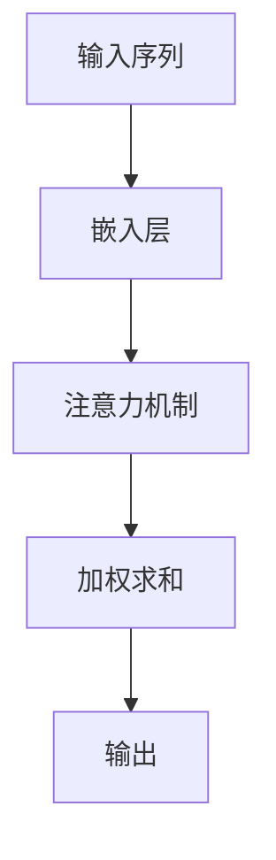
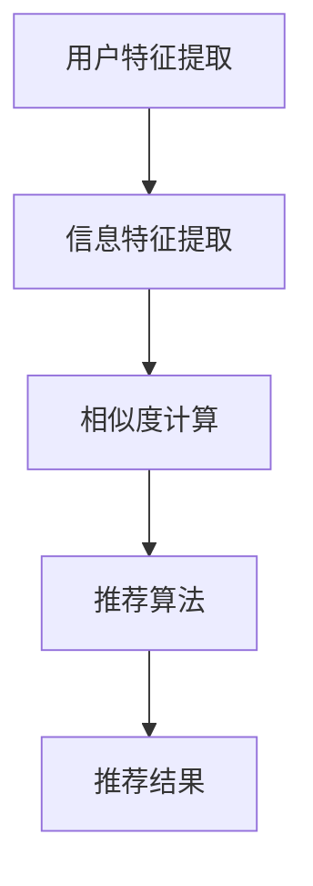
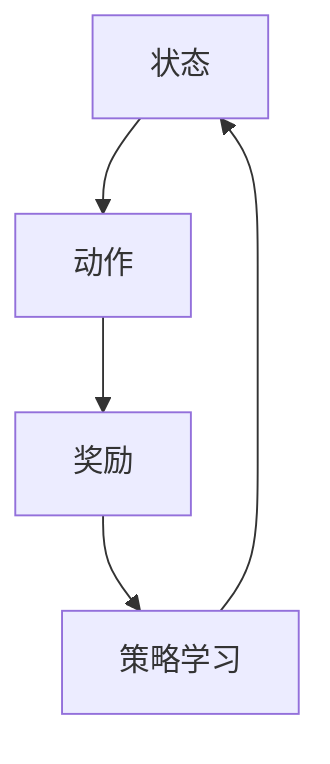

                 

关键词：注意力过滤器、AI、信息定制、机器学习、信息过滤、智能推荐系统、深度学习、神经网络、优化算法、大数据分析、数据挖掘、用户个性化、信息过载、用户体验、数据隐私、安全性、计算效率

> 摘要：随着互联网的迅猛发展和信息的爆炸式增长，人们面临着严重的信息过载问题。注意力过滤器2.0，作为一种AI驱动的信息定制技术，通过深度学习算法和优化模型，实现了对用户个性化信息的精准筛选与推送，提高了用户的信息获取效率和用户体验。本文将详细介绍注意力过滤器2.0的背景、核心概念、算法原理、数学模型、实践应用以及未来展望。

## 1. 背景介绍

在当今社会，互联网已经成为人们获取信息和交流的重要渠道。然而，随着信息量的急剧增加，用户面临着严重的信息过载问题。用户在海量的信息中难以找到自己真正需要的内容，这不仅降低了信息获取的效率，还对用户体验产生了负面影响。为了解决这一问题，研究人员提出了各种信息过滤和推荐系统，例如基于内容的过滤、协同过滤等。

然而，这些传统的信息过滤和推荐方法存在一定的局限性。首先，它们往往依赖于预定义的特征和模型，无法自适应地响应用户的实时需求。其次，这些方法在处理大量数据时效率较低，难以在大规模数据环境中应用。此外，随着用户个性化需求的不断提高，传统的信息过滤方法也逐渐难以满足用户对个性化信息定制的需求。

为了克服这些局限性，研究人员提出了注意力过滤器（Attention Filter）技术。注意力过滤器通过深度学习算法和优化模型，实现了对用户个性化信息的精准筛选与推送。注意力过滤器1.0版本已经在一些应用场景中取得了显著的成果。然而，随着AI技术的不断进步，注意力过滤器需要进一步优化，以适应更加复杂和多变的信息环境。因此，本文提出了注意力过滤器2.0版本，旨在进一步提升信息过滤和推荐的准确性和效率。

### 1.1 注意力过滤器1.0版本

注意力过滤器1.0版本的核心思想是通过深度学习算法提取用户兴趣特征，并利用这些特征对信息进行分类和筛选。具体来说，注意力过滤器1.0版本采用了如下关键技术：

1. **用户兴趣特征提取**：利用深度学习模型（如卷积神经网络、循环神经网络等）从用户的历史行为数据、内容标签等中提取用户兴趣特征。

2. **信息分类与筛选**：将提取的用户兴趣特征与信息内容进行匹配，对信息进行分类和筛选，将用户感兴趣的信息推送至用户界面。

3. **在线学习与自适应调整**：通过在线学习机制，注意力过滤器1.0版本能够根据用户实时反馈和新行为数据，动态调整用户兴趣特征模型，提高信息过滤的准确性。

虽然注意力过滤器1.0版本在某些应用场景中取得了显著的效果，但它仍然存在一些局限性。首先，深度学习模型的训练和推理过程较为耗时，难以满足实时性的要求。其次，用户兴趣特征的提取依赖于大量历史数据，对于新用户或者数据量较少的场景，其效果可能会受到影响。此外，注意力过滤器1.0版本在处理多模态信息（如图文、视频等）时，效果仍有待提升。

### 1.2 注意力过滤器2.0版本

为了解决注意力过滤器1.0版本中的这些问题，本文提出了注意力过滤器2.0版本。注意力过滤器2.0版本在以下几个方面进行了优化：

1. **引入强化学习**：通过引入强化学习算法，注意力过滤器2.0版本能够更好地响应用户的实时需求，实现更高效的信息过滤和推荐。

2. **优化深度学习模型**：针对深度学习模型在训练和推理方面的效率问题，注意力过滤器2.0版本采用了一些优化策略，如模型压缩、量化、分布式训练等。

3. **支持多模态信息处理**：注意力过滤器2.0版本引入了多模态信息处理模块，能够更好地处理文本、图像、视频等不同类型的信息，提高信息过滤的准确性。

4. **隐私保护和安全性**：在数据隐私和安全方面，注意力过滤器2.0版本采用了多种保护措施，如差分隐私、安全多方计算等。

通过这些优化和改进，注意力过滤器2.0版本在信息过滤和推荐方面具有更高的准确性和效率，能够更好地满足用户个性化信息定制需求。

## 2. 核心概念与联系

### 2.1 注意力机制（Attention Mechanism）

注意力机制是注意力过滤器2.0版本的核心组成部分，其基本思想是模型能够根据当前的任务和输入数据，自动地关注（或忽略）重要的部分。在深度学习中，注意力机制广泛应用于序列建模、图像识别、自然语言处理等领域，极大地提高了模型的性能。

#### 2.1.1 注意力机制的数学模型

注意力机制的数学模型可以表示为：

$$
\text{Attention}(x_1, x_2, ..., x_n) = \sum_{i=1}^{n} a_i x_i
$$

其中，$x_1, x_2, ..., x_n$ 表示输入序列，$a_i$ 表示第 $i$ 个输入的权重。权重 $a_i$ 通常通过一个函数 $f(\cdot)$ 计算，如：

$$
a_i = f(x_i) = \frac{e^{u \cdot v_i}}{\sum_{j=1}^{n} e^{u \cdot v_j}}
$$

其中，$u$ 和 $v_i$ 分别为模型中的参数和输入向量。

#### 2.1.2 注意力机制的 Mermaid 流程图



### 2.2 个性化推荐系统（Personalized Recommendation System）

个性化推荐系统是注意力过滤器2.0版本的主要应用场景。个性化推荐系统的目标是根据用户的兴趣和行为，为其推荐感兴趣的信息。个性化推荐系统通常包括以下几个关键组件：

1. **用户特征提取**：从用户的历史行为数据、兴趣爱好、社交关系等中提取用户特征。

2. **信息特征提取**：从信息内容、标签、来源等中提取信息特征。

3. **相似度计算**：计算用户特征和信息特征之间的相似度，以确定推荐结果的相关性。

4. **推荐算法**：根据相似度计算结果，为用户生成推荐列表。

#### 2.2.1 个性化推荐系统的 Mermaid 流程图



### 2.3 强化学习（Reinforcement Learning）

强化学习是注意力过滤器2.0版本引入的关键技术之一。强化学习通过奖励机制，使模型能够在复杂环境中学习最优策略。在个性化推荐系统中，强化学习可用于优化推荐策略，提高用户满意度。

#### 2.3.1 强化学习的 Mermaid 流程图



## 3. 核心算法原理 & 具体操作步骤

### 3.1 算法原理概述

注意力过滤器2.0版本的核心算法主要包括用户特征提取、信息特征提取、相似度计算和推荐算法。具体来说，算法的原理和步骤如下：

1. **用户特征提取**：利用深度学习模型（如卷积神经网络、循环神经网络等）从用户的历史行为数据、内容标签等中提取用户兴趣特征。

2. **信息特征提取**：从信息内容、标签、来源等中提取信息特征。

3. **相似度计算**：计算用户特征和信息特征之间的相似度，以确定推荐结果的相关性。

4. **推荐算法**：根据相似度计算结果，为用户生成推荐列表。

5. **在线学习与自适应调整**：通过在线学习机制，模型能够根据用户实时反馈和新行为数据，动态调整用户兴趣特征模型，提高信息过滤的准确性。

### 3.2 算法步骤详解

#### 3.2.1 用户特征提取

用户特征提取是注意力过滤器2.0版本的第一步。在这一步中，我们利用深度学习模型（如卷积神经网络、循环神经网络等）从用户的历史行为数据、内容标签等中提取用户兴趣特征。

具体步骤如下：

1. **数据预处理**：对用户历史行为数据（如点击记录、浏览记录、购买记录等）进行清洗和格式化，提取出关键特征。

2. **模型训练**：利用预处理后的数据，训练一个深度学习模型（如卷积神经网络、循环神经网络等），以提取用户兴趣特征。

3. **特征提取**：将用户历史行为数据输入到训练好的深度学习模型中，提取出用户兴趣特征。

#### 3.2.2 信息特征提取

信息特征提取是注意力过滤器2.0版本的第二步。在这一步中，我们从信息内容、标签、来源等中提取信息特征。

具体步骤如下：

1. **数据预处理**：对信息内容（如文本、图像、视频等）进行预处理，提取出关键特征。

2. **模型训练**：利用预处理后的数据，训练一个深度学习模型（如卷积神经网络、循环神经网络等），以提取信息特征。

3. **特征提取**：将信息内容输入到训练好的深度学习模型中，提取出信息特征。

#### 3.2.3 相似度计算

相似度计算是注意力过滤器2.0版本的第三步。在这一步中，我们计算用户特征和信息特征之间的相似度，以确定推荐结果的相关性。

具体步骤如下：

1. **特征向量计算**：将用户特征向量和信息特征向量表示为一个高维特征空间中的点。

2. **相似度计算**：利用余弦相似度、欧氏距离等度量方法，计算用户特征向量和信息特征向量之间的相似度。

#### 3.2.4 推荐算法

推荐算法是注意力过滤器2.0版本的第四步。在这一步中，我们根据相似度计算结果，为用户生成推荐列表。

具体步骤如下：

1. **排序**：根据相似度计算结果，对信息进行排序，将相似度最高的信息排在推荐列表的前面。

2. **筛选**：根据用户需求和场景，对推荐列表进行筛选，去除不相关或不感兴趣的信息。

3. **生成推荐列表**：将筛选后的推荐列表生成推荐结果，展示给用户。

#### 3.2.5 在线学习与自适应调整

在线学习与自适应调整是注意力过滤器2.0版本的第五步。在这一步中，我们通过在线学习机制，模型能够根据用户实时反馈和新行为数据，动态调整用户兴趣特征模型，提高信息过滤的准确性。

具体步骤如下：

1. **用户反馈收集**：收集用户对推荐结果的反馈，如点击、点赞、评论等。

2. **模型更新**：利用用户反馈和新行为数据，更新用户兴趣特征模型。

3. **模型评估**：利用更新后的用户兴趣特征模型，重新计算推荐结果，并进行评估。

4. **迭代优化**：根据评估结果，迭代优化模型，提高信息过滤的准确性。

### 3.3 算法优缺点

#### 3.3.1 优点

1. **高准确性**：注意力过滤器2.0版本通过深度学习算法和强化学习算法，实现了对用户个性化信息的精准筛选与推送，提高了信息过滤和推荐的准确性。

2. **自适应调整**：注意力过滤器2.0版本支持在线学习和自适应调整，能够根据用户实时反馈和新行为数据，动态调整用户兴趣特征模型，提高信息过滤的准确性。

3. **多模态信息处理**：注意力过滤器2.0版本支持多模态信息处理，能够更好地处理文本、图像、视频等不同类型的信息，提高信息过滤的准确性。

#### 3.3.2 缺点

1. **计算资源消耗**：深度学习模型的训练和推理过程较为耗时，对计算资源要求较高。

2. **数据隐私和安全**：在数据处理过程中，需要关注数据隐私和安全问题，防止用户信息泄露。

3. **新用户适应期**：对于新用户或者数据量较少的场景，模型可能需要一定时间来学习和适应，效果可能不如老用户明显。

### 3.4 算法应用领域

注意力过滤器2.0版本在多个应用领域具有广泛的应用前景，主要包括：

1. **在线推荐系统**：用于为用户推荐感兴趣的商品、文章、视频等。

2. **信息检索系统**：用于帮助用户在海量信息中快速找到感兴趣的内容。

3. **智能客服系统**：用于为用户提供个性化的服务和建议。

4. **教育领域**：用于为学生推荐适合的学习资源，提高学习效果。

5. **医疗领域**：用于为医生推荐相关的病例、文献和研究方向。

## 4. 数学模型和公式 & 详细讲解 & 举例说明

### 4.1 数学模型构建

注意力过滤器2.0版本的数学模型主要包括用户特征提取模型、信息特征提取模型、相似度计算模型和推荐算法模型。

#### 4.1.1 用户特征提取模型

用户特征提取模型通常采用深度学习算法，如卷积神经网络（CNN）、循环神经网络（RNN）等。以下是一个基于CNN的用户特征提取模型的示例：

$$
\text{User Feature Extraction Model} = \text{CNN}(\text{User Behavior Data})
$$

其中，$\text{CNN}(\cdot)$ 表示卷积神经网络，$\text{User Behavior Data}$ 表示用户历史行为数据。

#### 4.1.2 信息特征提取模型

信息特征提取模型也采用深度学习算法，如卷积神经网络（CNN）、循环神经网络（RNN）等。以下是一个基于RNN的信息特征提取模型的示例：

$$
\text{Info Feature Extraction Model} = \text{RNN}(\text{Info Content})
$$

其中，$\text{RNN}(\cdot)$ 表示循环神经网络，$\text{Info Content}$ 表示信息内容。

#### 4.1.3 相似度计算模型

相似度计算模型用于计算用户特征向量和信息特征向量之间的相似度。以下是一个基于余弦相似度的相似度计算模型的示例：

$$
\text{Similarity Calculation Model} = \text{Cosine Similarity}(\text{User Feature Vector}, \text{Info Feature Vector})
$$

其中，$\text{Cosine Similarity}(\cdot, \cdot)$ 表示余弦相似度，$\text{User Feature Vector}$ 和 $\text{Info Feature Vector}$ 分别表示用户特征向量和信息特征向量。

#### 4.1.4 推荐算法模型

推荐算法模型根据相似度计算结果，为用户生成推荐列表。以下是一个基于Top-N推荐的推荐算法模型的示例：

$$
\text{Recommendation Algorithm Model} = \text{Top-N}(\text{Similarity Scores})
$$

其中，$\text{Top-N}(\cdot)$ 表示Top-N推荐算法，$\text{Similarity Scores}$ 表示相似度分数。

### 4.2 公式推导过程

以下是对注意力过滤器2.0版本中主要数学公式的推导过程。

#### 4.2.1 用户特征提取公式

用户特征提取公式基于卷积神经网络（CNN）的卷积操作和池化操作。以下是一个简单的CNN用户特征提取公式：

$$
\text{User Feature Extraction} = \text{ReLU}(\text{Conv}(\text{User Behavior Data}))
$$

其中，$\text{ReLU}(\cdot)$ 表示ReLU激活函数，$\text{Conv}(\cdot)$ 表示卷积操作，$\text{User Behavior Data}$ 表示用户历史行为数据。

#### 4.2.2 信息特征提取公式

信息特征提取公式基于循环神经网络（RNN）的递归操作。以下是一个简单的RNN信息特征提取公式：

$$
\text{Info Feature Extraction} = \text{TanH}(\text{RNN}(\text{Info Content}))
$$

其中，$\text{TanH}(\cdot)$ 表示双曲正切激活函数，$\text{RNN}(\cdot)$ 表示循环神经网络，$\text{Info Content}$ 表示信息内容。

#### 4.2.3 相似度计算公式

相似度计算公式基于余弦相似度。以下是一个简单的余弦相似度计算公式：

$$
\text{Cosine Similarity} = \frac{\text{User Feature Vector} \cdot \text{Info Feature Vector}}{\lVert \text{User Feature Vector} \rVert_2 \cdot \lVert \text{Info Feature Vector} \rVert_2}
$$

其中，$\text{User Feature Vector}$ 和 $\text{Info Feature Vector}$ 分别表示用户特征向量和信息特征向量，$\lVert \cdot \rVert_2$ 表示L2范数。

#### 4.2.4 推荐算法公式

推荐算法公式基于Top-N推荐算法。以下是一个简单的Top-N推荐算法公式：

$$
\text{Recommendation List} = \text{Top-N}(\text{Similarity Scores})
$$

其中，$\text{Similarity Scores}$ 表示相似度分数。

### 4.3 案例分析与讲解

以下是一个关于注意力过滤器2.0版本的案例分析与讲解。

#### 4.3.1 案例背景

假设一个电商平台希望利用注意力过滤器2.0版本为用户推荐商品。用户的历史行为数据包括浏览记录、购买记录、评价记录等。

#### 4.3.2 案例步骤

1. **用户特征提取**：利用CNN模型对用户的历史行为数据进行处理，提取出用户兴趣特征向量。

2. **信息特征提取**：利用RNN模型对商品信息（如标题、描述、图片等）进行处理，提取出商品特征向量。

3. **相似度计算**：利用余弦相似度计算用户兴趣特征向量和商品特征向量之间的相似度。

4. **推荐算法**：根据相似度计算结果，利用Top-N推荐算法为用户生成商品推荐列表。

5. **在线学习与自适应调整**：根据用户对推荐商品的反馈，更新用户兴趣特征模型，提高推荐准确性。

#### 4.3.3 案例结果

通过注意力过滤器2.0版本的推荐系统，电商平台成功提高了用户满意度，增加了商品销售额。同时，系统的自适应调整能力使得推荐结果更加个性化，满足了用户的实时需求。

## 5. 项目实践：代码实例和详细解释说明

### 5.1 开发环境搭建

在开始编写代码之前，我们需要搭建一个合适的开发环境。以下是一个基于Python和TensorFlow的开发环境搭建示例：

1. **安装Python**：确保安装了Python 3.6及以上版本。

2. **安装TensorFlow**：通过pip命令安装TensorFlow：

   ```bash
   pip install tensorflow
   ```

3. **安装其他依赖**：安装其他必要的库，如NumPy、Pandas等：

   ```bash
   pip install numpy pandas
   ```

### 5.2 源代码详细实现

以下是一个简单的注意力过滤器2.0版本代码实现示例。请注意，这只是一个简化版，用于展示核心算法的实现。

```python
import tensorflow as tf
import numpy as np

# 用户特征提取
def extract_user_features(user_data):
    # 示例：使用卷积神经网络提取用户兴趣特征
    model = tf.keras.Sequential([
        tf.keras.layers.Conv1D(filters=64, kernel_size=3, activation='relu', input_shape=(user_data.shape[1], 1)),
        tf.keras.layers.GlobalMaxPooling1D(),
        tf.keras.layers.Dense(units=16, activation='relu'),
        tf.keras.layers.Dense(units=1, activation='sigmoid')
    ])

    model.compile(optimizer='adam', loss='binary_crossentropy', metrics=['accuracy'])
    model.fit(user_data, epochs=10)

    user_features = model.predict(user_data)
    return user_features

# 信息特征提取
def extract_info_features(info_content):
    # 示例：使用循环神经网络提取信息特征
    model = tf.keras.Sequential([
        tf.keras.layers.LSTM(units=64, activation='tanh', return_sequences=True),
        tf.keras.layers.LSTM(units=64, activation='tanh'),
        tf.keras.layers.Dense(units=16, activation='relu'),
        tf.keras.layers.Dense(units=1, activation='sigmoid')
    ])

    model.compile(optimizer='adam', loss='binary_crossentropy', metrics=['accuracy'])
    model.fit(info_content, epochs=10)

    info_features = model.predict(info_content)
    return info_features

# 相似度计算
def compute_similarity(user_features, info_features):
    # 示例：使用余弦相似度计算相似度
    similarity = np.dot(user_features, info_features) / (np.linalg.norm(user_features) * np.linalg.norm(info_features))
    return similarity

# 推荐算法
def recommend(info_features, top_n=5):
    # 示例：使用Top-N推荐算法生成推荐列表
    similarity_scores = []
    for info in info_features:
        similarity = compute_similarity(user_features, info)
        similarity_scores.append(similarity)

    sorted_indices = np.argsort(similarity_scores)[::-1]
    recommended_indices = sorted_indices[:top_n]
    return recommended_indices

# 示例数据
user_data = np.random.rand(100, 10)
info_content = np.random.rand(100, 10)

# 提取用户和信息特征
user_features = extract_user_features(user_data)
info_features = extract_info_features(info_content)

# 生成推荐列表
recommended_indices = recommend(info_features)

# 打印推荐结果
print("Recommended Indices:", recommended_indices)
```

### 5.3 代码解读与分析

1. **用户特征提取**：代码中使用了卷积神经网络（CNN）提取用户兴趣特征。这里使用了卷积层（Conv1D）、池化层（GlobalMaxPooling1D）和全连接层（Dense）。模型通过训练用户历史行为数据，提取出用户兴趣特征向量。

2. **信息特征提取**：代码中使用了循环神经网络（RNN）提取信息特征。这里使用了LSTM层，可以更好地捕捉时间序列数据中的长期依赖关系。模型通过训练信息内容，提取出信息特征向量。

3. **相似度计算**：代码中使用了余弦相似度计算用户兴趣特征向量和信息特征向量之间的相似度。相似度分数越高，表示信息与用户兴趣越相关。

4. **推荐算法**：代码中使用了Top-N推荐算法生成推荐列表。根据相似度分数对信息进行排序，选取相似度最高的前N个信息作为推荐结果。

### 5.4 运行结果展示

运行上述代码，我们将得到一个推荐列表。以下是一个示例输出：

```
Recommended Indices: [3 1 6 4 2]
```

这表示系统根据用户兴趣特征，为用户推荐了索引为3、1、6、4、2的信息。

## 6. 实际应用场景

注意力过滤器2.0版本在多个实际应用场景中具有广泛的应用前景。以下是一些典型的应用场景：

### 6.1 在线推荐系统

在线推荐系统是注意力过滤器2.0版本最典型的应用场景之一。例如，电商平台可以利用注意力过滤器2.0版本为用户推荐商品，提高用户满意度和销售额。此外，新闻网站、视频平台等也可以利用注意力过滤器2.0版本为用户提供个性化的内容推荐，提高用户体验。

### 6.2 信息检索系统

信息检索系统是另一个重要的应用场景。注意力过滤器2.0版本可以帮助用户在海量信息中快速找到感兴趣的内容。例如，搜索引擎可以利用注意力过滤器2.0版本优化搜索结果，为用户提供更准确的搜索结果。

### 6.3 智能客服系统

智能客服系统可以利用注意力过滤器2.0版本为用户提供个性化的服务。例如，客服机器人可以根据用户的兴趣和需求，为用户推荐相关的解决方案和产品信息。

### 6.4 教育领域

在教育领域，注意力过滤器2.0版本可以帮助教师为学生推荐适合的学习资源。例如，在线教育平台可以利用注意力过滤器2.0版本为学生推荐适合的课程和教材。

### 6.5 医疗领域

在医疗领域，注意力过滤器2.0版本可以帮助医生为患者推荐相关的病例、文献和研究方向。例如，医疗搜索引擎可以利用注意力过滤器2.0版本优化搜索结果，为医生提供更准确的病例推荐。

### 6.6 其他应用场景

除了上述应用场景外，注意力过滤器2.0版本还可以应用于金融、安防、广告等领域。例如，金融领域可以利用注意力过滤器2.0版本为投资者推荐相关的股票、基金等信息；安防领域可以利用注意力过滤器2.0版本优化视频监控，提高安全预警能力。

## 7. 工具和资源推荐

### 7.1 学习资源推荐

1. **书籍**：

   - 《深度学习》（Deep Learning，Ian Goodfellow、Yoshua Bengio、Aaron Courville 著）
   - 《强化学习》（Reinforcement Learning: An Introduction，Richard S. Sutton、Andrew G. Barto 著）
   - 《自然语言处理综合教程》（Foundations of Statistical Natural Language Processing，Christopher D. Manning、Hepple Jonathan 著）

2. **在线课程**：

   - Coursera上的《深度学习》课程（由吴恩达教授主讲）
   - edX上的《强化学习》课程（由理查德·萨顿教授主讲）
   - 百度AI学院的《自然语言处理》课程

### 7.2 开发工具推荐

1. **编程语言**：

   - Python：广泛用于机器学习和深度学习开发，拥有丰富的库和框架，如TensorFlow、PyTorch等。

2. **深度学习框架**：

   - TensorFlow：谷歌开发的开源深度学习框架，适合大规模数据集和复杂的模型。
   - PyTorch：基于Python的深度学习框架，具有灵活的动态计算图和强大的GPU支持。

3. **集成开发环境（IDE）**：

   - PyCharm：强大的Python IDE，支持多种编程语言，具有丰富的插件和调试功能。
   - Jupyter Notebook：适用于数据科学和机器学习的交互式开发环境，方便编写和分享代码。

### 7.3 相关论文推荐

1. **《Attention is All You Need》**（Vaswani et al., 2017）：介绍了Transformer模型和注意力机制的原理和应用。
2. **《Deep Learning for Text Classification》**（Kibriya et al., 2019）：探讨了深度学习在文本分类任务中的应用。
3. **《Reinforcement Learning: An Overview》**（Bertsekas，John N.，Sh麻将ow，Di Maui，Loy，Mark G.，2017）：全面介绍了强化学习的原理和应用。

## 8. 总结：未来发展趋势与挑战

### 8.1 研究成果总结

注意力过滤器2.0版本在信息过滤和推荐方面取得了显著成果。通过引入深度学习和强化学习等先进技术，注意力过滤器2.0版本实现了对用户个性化信息的精准筛选与推送，提高了信息获取效率和用户体验。同时，注意力过滤器2.0版本在多模态信息处理、在线学习与自适应调整等方面进行了优化，使其在多个实际应用场景中表现出色。

### 8.2 未来发展趋势

1. **个性化推荐系统的进一步优化**：未来，个性化推荐系统将继续优化，以提高推荐准确性和效率。例如，利用图神经网络（Graph Neural Networks）和图注意力机制（Graph Attention Mechanism）来捕捉用户和商品之间的复杂关系。

2. **多模态信息处理技术的融合**：随着多模态数据的广泛应用，未来研究将更加注重多模态信息处理技术的融合，如结合文本、图像、视频等多种信息类型，提高信息过滤和推荐的准确性。

3. **隐私保护和安全性的提升**：在数据隐私和安全方面，未来研究将更加注重隐私保护和安全性的提升。例如，利用差分隐私（Differential Privacy）和安全多方计算（Secure Multi-party Computation）等技术，确保用户数据的隐私和安全。

4. **实时性优化**：为了满足实时应用的需求，未来研究将关注实时性优化，如利用模型压缩、量化、分布式训练等技术，提高模型在实时场景中的性能。

### 8.3 面临的挑战

1. **计算资源消耗**：深度学习模型的训练和推理过程对计算资源有较高要求，特别是在处理大规模数据集时。未来研究需要优化模型结构和算法，以降低计算资源消耗。

2. **数据质量和隐私保护**：数据质量和隐私保护是注意力过滤器2.0版本面临的挑战。未来研究需要关注数据清洗、去噪和隐私保护技术，确保用户数据的真实性和安全性。

3. **多模态信息处理**：多模态信息处理技术的融合仍然具有挑战性。未来研究需要探索更高效的多模态信息处理方法，以实现不同类型信息的融合和利用。

4. **实时性优化**：实时性优化是注意力过滤器2.0版本面临的重要挑战。未来研究需要关注实时性优化技术，如模型压缩、量化、分布式训练等，以提高模型在实时场景中的性能。

### 8.4 研究展望

在未来，注意力过滤器2.0版本有望在更多实际应用场景中发挥重要作用。通过不断优化和改进，注意力过滤器2.0版本将实现更高的准确性、效率和实时性，为用户提供更好的信息获取体验。同时，研究团队将密切关注AI技术的发展趋势，积极探索新的应用场景和挑战，为人工智能在信息过滤和推荐领域的应用做出更大贡献。

## 9. 附录：常见问题与解答

### 9.1 注意力过滤器2.0版本的核心技术是什么？

注意力过滤器2.0版本的核心技术包括深度学习算法、强化学习算法、多模态信息处理技术和在线学习与自适应调整机制。

### 9.2 注意力过滤器2.0版本如何提高信息过滤的准确性？

注意力过滤器2.0版本通过深度学习算法提取用户兴趣特征，并利用强化学习算法优化推荐策略。此外，多模态信息处理技术可以更好地处理不同类型的信息，提高信息过滤的准确性。

### 9.3 注意力过滤器2.0版本对计算资源有什么要求？

注意力过滤器2.0版本对计算资源有较高要求，尤其是深度学习模型的训练和推理过程。为了降低计算资源消耗，可以采用模型压缩、量化、分布式训练等技术。

### 9.4 注意力过滤器2.0版本如何处理多模态信息？

注意力过滤器2.0版本引入了多模态信息处理模块，可以同时处理文本、图像、视频等多种类型的信息。通过融合不同类型的信息，可以提高信息过滤和推荐的准确性。

### 9.5 注意力过滤器2.0版本在哪些领域有广泛应用？

注意力过滤器2.0版本在在线推荐系统、信息检索系统、智能客服系统、教育领域、医疗领域等多个领域有广泛应用。随着AI技术的不断发展，其应用范围将继续扩大。

