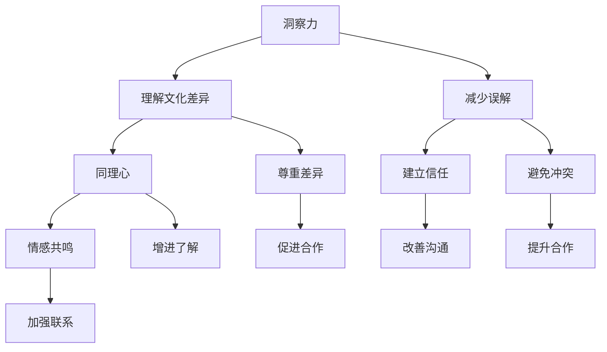

                 

 在这个高度互联的世界中，跨文化交流已成为我们生活中不可或缺的一部分。无论是商务合作、学术交流还是日常社交，我们都不可避免地会接触到来自不同文化背景的人。有效的跨文化交流不仅能够促进人际关系的和谐，还能为个人和组织的成功带来巨大的价值。本文将探讨在跨文化交流中至关重要的一对品质：洞察力和同理心，并分析它们如何成为跨文化交流的基石。

## 关键词

- 跨文化交流
- 洞察力
- 同理心
- 文化差异
- 沟通策略

## 摘要

本文旨在揭示洞察力和同理心在跨文化交流中的重要作用。通过对这两个核心概念的深入探讨，我们将了解它们如何帮助我们在跨文化环境中更好地理解他人、建立联系，并最终实现有效的沟通。文章将分为几个部分：首先，介绍跨文化交流的背景和挑战；接着，探讨洞察力和同理心的定义及其在跨文化沟通中的作用；随后，提供具体的跨文化沟通策略；最后，讨论未来跨文化交流的趋势和面临的挑战。

## 1. 背景介绍

随着全球化进程的加速，各国之间的交流和互动变得越来越频繁。无论是跨国公司的全球运营，还是国际学术交流，甚至是跨国旅游和留学，跨文化交流已经渗透到我们生活的方方面面。然而，文化差异的存在使得这种交流并非总是一帆风顺。不同的文化背景导致了语言、价值观、行为习惯等方面的差异，这些差异可能会引发误解、冲突，甚至文化歧视。

在跨文化交流中，沟通的有效性直接影响到交流的结果。如果双方无法有效沟通，不仅会浪费时间和资源，还可能导致信任的丧失和关系的破裂。因此，如何在跨文化环境中进行有效沟通，成为了一个亟待解决的问题。而洞察力和同理心，正是解决这一问题的关键。

### 1.1 跨文化交流的重要性

跨文化交流的重要性不容忽视。首先，它有助于促进全球化经济的发展。在全球化的背景下，各国之间的贸易和投资合作需要基于良好的沟通和理解。通过有效的跨文化交流，企业可以更好地了解目标市场的需求和文化特点，从而制定更有效的市场策略。

其次，跨文化交流对于个人的成长和发展同样具有重要意义。在跨文化环境中，人们有机会接触到不同的思维方式、价值观和行为习惯，这些体验可以丰富个人的知识和视野，提高适应能力和创新能力。

最后，跨文化交流也有助于促进国际和平与理解。通过增进不同文化之间的相互理解和尊重，可以减少误解和冲突，构建更加和谐的国际环境。

### 1.2 跨文化交流的挑战

尽管跨文化交流具有诸多好处，但也面临不少挑战。首先是语言障碍。不同语言的存在使得跨文化沟通变得复杂，即使通过翻译，也难以完全传达原语言中的细微差别和情感。

其次是文化差异。文化差异包括价值观、行为习惯、社会规范等多个方面。这些差异可能导致双方在沟通中产生误解和冲突。例如，在某些文化中，直接表达反对意见可能被视为不礼貌，而在其他文化中则可能被视为开放和诚实的表现。

最后是文化偏见。文化偏见是指人们对其他文化持有的固有看法和成见。这些偏见可能导致跨文化交流中的不信任和敌意，阻碍有效沟通的实现。

### 1.3 洞察力和同理心在跨文化交流中的作用

洞察力和同理心是跨文化交流中至关重要的品质。洞察力使我们能够深入了解他人的文化背景和思维方式，从而更好地理解他们的行为和沟通方式。同理心则帮助我们站在对方的角度思考问题，感受他们的情绪和需求，从而建立更加真诚和信任的关系。

通过洞察力，我们可以识别和尊重文化差异，避免因误解而产生冲突。通过同理心，我们可以建立情感共鸣，增进彼此的了解和信任。因此，洞察力和同理心是跨文化交流的基石，有助于实现有效的沟通和合作。

## 2. 核心概念与联系

在探讨跨文化交流中的洞察力和同理心之前，我们需要先明确这两个核心概念的定义，并理解它们之间的联系。

### 2.1 洞察力的定义

洞察力是指我们通过观察、思考和体验来深入理解事物本质和内在联系的能力。在跨文化交流中，洞察力使我们能够识别和理解不同文化之间的差异，包括语言、价值观、行为习惯等。通过洞察力，我们可以更加准确地理解他人的行为和沟通方式，避免因误解而产生冲突。

### 2.2 同理心的定义

同理心是指我们站在他人的角度思考问题，感受他们的情绪和需求的能力。同理心不仅是对他人情感的感知，更是一种情感共鸣。在跨文化交流中，同理心使我们能够理解和尊重其他文化的特点和价值，从而建立更加真诚和信任的关系。

### 2.3 洞察力与同理心的联系

洞察力和同理心之间存在着密切的联系。洞察力是同理心的基础，只有深入了解他人的文化背景和思维方式，我们才能更好地理解他们的情绪和需求。同理心则是洞察力的升华，通过情感共鸣，我们能够更加真诚地与他人沟通和合作。

### 2.4 洞察力与同理心在跨文化沟通中的作用

在跨文化沟通中，洞察力和同理心发挥着重要作用。首先，通过洞察力，我们可以识别和尊重文化差异，避免因误解而产生冲突。例如，了解不同文化中的礼仪规范和沟通风格，可以让我们更加得体地与他人交流。

其次，同理心使我们能够建立情感共鸣，增进彼此的了解和信任。例如，通过同理心，我们可以更好地理解他人为何会有某种行为或态度，从而减少误解和冲突。

总之，洞察力和同理心是跨文化交流中不可或缺的品质，它们帮助我们更好地理解他人，建立真诚和信任的关系，从而实现有效的沟通和合作。

### 2.5 Mermaid 流程图



通过这个流程图，我们可以清晰地看到洞察力和同理心在跨文化沟通中的作用和联系。洞察力帮助我们理解文化差异，减少误解和冲突；同理心则帮助我们建立情感共鸣，增进了解和信任，从而促进合作和沟通。

## 3. 核心算法原理 & 具体操作步骤

在跨文化沟通中，洞察力和同理心的运用可以被视为一种核心算法，帮助我们更好地理解和与他人沟通。下面将详细介绍这一算法的原理和具体操作步骤。

### 3.1 算法原理概述

该算法的核心思想是通过以下几个方面来提升跨文化沟通效果：

1. **文化敏感性**：培养对文化差异的敏感度，识别和理解不同文化背景下的行为和沟通风格。
2. **情感共鸣**：通过同理心，站在对方的角度思考问题，感受他们的情绪和需求。
3. **积极倾听**：倾听对方的意见和感受，不打断，不轻易做出判断，以建立互信。
4. **沟通策略调整**：根据对方的沟通风格和文化背景，灵活调整沟通方式和内容，以实现有效沟通。

### 3.2 算法步骤详解

1. **文化敏感性训练**：
   - **收集信息**：通过阅读书籍、观看视频、参与研讨会等方式，了解不同文化的特点和沟通风格。
   - **自我反思**：反思自己的文化背景和行为模式，识别可能存在的文化偏见。
   - **案例分析**：通过案例分析，学习如何在具体情境中应用文化敏感性。

2. **情感共鸣**：
   - **积极倾听**：倾听对方的故事和经历，不打断，不轻易做出判断。
   - **同理心培养**：通过角色扮演、心理换位等方式，培养同理心，理解对方的情绪和需求。

3. **沟通策略调整**：
   - **观察对方**：观察对方的沟通风格，包括语言、表情、肢体动作等。
   - **适应对方**：根据对方的沟通风格，调整自己的沟通方式和内容。
   - **灵活应对**：在沟通过程中，根据对方反馈灵活调整策略，确保信息的有效传递。

### 3.3 算法优缺点

**优点**：
- **提高沟通效果**：通过文化敏感性和同理心，可以减少误解和冲突，提高沟通的有效性。
- **增强信任感**：通过积极的倾听和情感共鸣，可以增进彼此的了解和信任。
- **促进合作**：理解和尊重对方的文化背景和需求，有助于建立更加和谐的合作关系。

**缺点**：
- **学习成本**：需要投入时间和精力来学习不同文化的特点，这可能会对一些人造成压力。
- **心理负担**：在跨文化沟通中，需要不断调整自己的行为和沟通策略，这可能会增加一些人的心理负担。

### 3.4 算法应用领域

该算法广泛应用于跨文化交流的各个领域，包括：

- **国际商务**：在跨国公司的全球运营中，有效的跨文化沟通对于市场开拓和业务合作至关重要。
- **学术交流**：在跨国学术研究和合作中，理解不同学术文化和沟通风格有助于促进学术交流和创新。
- **跨文化交流活动**：在文化交流活动中，通过有效的沟通，可以增进不同文化之间的理解和尊重。
- **跨文化团队合作**：在多文化团队的日常工作中，运用该算法有助于提高团队合作效率和效果。

通过上述算法的应用，我们可以更好地应对跨文化沟通的挑战，实现有效的跨文化合作和交流。

## 4. 数学模型和公式 & 详细讲解 & 举例说明

在跨文化交流中，数学模型和公式可以为我们提供一种定量分析的工具，帮助我们更好地理解文化差异和沟通效果。下面我们将介绍一种用于评估跨文化沟通效果的数学模型，并对其进行详细讲解和举例说明。

### 4.1 数学模型构建

为了构建一个用于评估跨文化沟通效果的数学模型，我们可以采用以下变量：

- \(E\)：跨文化沟通效果得分（取值范围为0到100，得分越高，沟通效果越好）。
- \(C\)：文化敏感性得分（取值范围为0到100，得分越高，文化敏感性越强）。
- \(A\)：同理心得分（取值范围为0到100，得分越高，同理心越强）。
- \(L\)：语言能力得分（取值范围为0到100，得分越高，语言能力越强）。

我们假设这三个变量之间满足以下关系：

\[ E = f(C, A, L) \]

其中，\(f\) 是一个复合函数，用于综合评估跨文化沟通效果。为了简化模型，我们可以将这个函数表示为：

\[ E = \alpha C + \beta A + \gamma L \]

其中，\(\alpha\)、\(\beta\) 和 \(\gamma\) 是权重系数，分别表示文化敏感性、同理心和语言能力对沟通效果的影响程度。

### 4.2 公式推导过程

为了推导上述公式，我们可以从以下几个方面进行分析：

1. **文化敏感性**：文化敏感性强的个体能够更好地理解和适应不同文化，从而在跨文化沟通中表现出更高的效果。因此，我们可以将文化敏感性得分 \(C\) 与沟通效果得分 \(E\) 之间建立正比例关系，即 \(C\) 增加时，\(E\) 也增加。

2. **同理心**：同理心使我们能够更好地理解他人的情感和需求，从而在跨文化沟通中表现出更高的效果。同理心得分 \(A\) 与沟通效果得分 \(E\) 之间也建立正比例关系。

3. **语言能力**：语言能力是跨文化沟通的基础，较强的语言能力有助于准确传达信息和理解对方的观点。语言能力得分 \(L\) 与沟通效果得分 \(E\) 之间同样建立正比例关系。

通过上述分析，我们可以得出以下公式：

\[ E = \alpha C + \beta A + \gamma L \]

其中，\(\alpha\)、\(\beta\) 和 \(\gamma\) 是权重系数，用于平衡不同变量对沟通效果的影响。这些系数可以通过统计分析方法（如回归分析）来确定。

### 4.3 案例分析与讲解

为了更好地理解上述数学模型，我们来看一个具体的案例。

假设某人在一次跨国商务会议中，需要与来自不同文化背景的同事进行沟通。根据对该人的评估，我们得到以下数据：

- 文化敏感性得分 \(C = 80\)
- 同理心得分 \(A = 75\)
- 语言能力得分 \(L = 85\)

根据我们之前构建的数学模型，我们可以计算出该人的跨文化沟通效果得分：

\[ E = \alpha \times 80 + \beta \times 75 + \gamma \times 85 \]

假设通过统计分析得到的权重系数分别为：

- \(\alpha = 0.3\)
- \(\beta = 0.4\)
- \(\gamma = 0.3\)

代入上述数据，我们可以计算出：

\[ E = 0.3 \times 80 + 0.4 \times 75 + 0.3 \times 85 \]
\[ E = 24 + 30 + 25.5 \]
\[ E = 79.5 \]

因此，该人的跨文化沟通效果得分为79.5分，这表明他在这次会议中的沟通效果较好。

通过这个案例，我们可以看到数学模型如何帮助我们定量评估跨文化沟通效果。在实际应用中，我们可以根据具体情境调整权重系数，以适应不同的沟通需求。

总之，数学模型和公式为跨文化沟通提供了一个量化的工具，有助于我们更好地理解和优化沟通效果。通过不断调整和优化模型，我们可以不断提高跨文化沟通的效率和质量。

### 5. 项目实践：代码实例和详细解释说明

为了更好地理解洞察力和同理心在跨文化沟通中的实际应用，我们将通过一个具体的代码实例进行详细解释。这个实例将演示如何使用Python编写一个简单的程序，用于分析跨文化沟通中的关键指标，并给出改进建议。

#### 5.1 开发环境搭建

在开始编写代码之前，我们需要搭建一个合适的开发环境。以下是所需的环境和步骤：

1. 安装Python（建议使用Python 3.8及以上版本）。
2. 安装必要的库，包括Pandas（用于数据处理）和Matplotlib（用于数据可视化）。

可以使用以下命令进行安装：

```bash
pip install pandas matplotlib
```

#### 5.2 源代码详细实现

下面是一个简单的Python代码示例，用于分析跨文化沟通中的关键指标。

```python
import pandas as pd
import matplotlib.pyplot as plt

# 假设我们有以下数据集，包含文化敏感性、同理心和语言能力得分
data = {
    'Person ID': ['P1', 'P2', 'P3', 'P4', 'P5'],
    'Cultural Sensitivity': [70, 85, 60, 90, 75],
    'Empathy': [65, 80, 70, 85, 60],
    'Language Proficiency': [80, 75, 85, 90, 70]
}

df = pd.DataFrame(data)

# 计算跨文化沟通效果得分
weights = {'Cultural Sensitivity': 0.3, 'Empathy': 0.4, 'Language Proficiency': 0.3}
df['Communication Effectiveness'] = df.apply(lambda row: sum(row[var] * weight for var, weight in weights.items()), axis=1)

# 打印结果
print(df[['Person ID', 'Cultural Sensitivity', 'Empathy', 'Language Proficiency', 'Communication Effectiveness']])

# 可视化分析
df.plot(x='Person ID', y='Communication Effectiveness', kind='bar', figsize=(10, 6))
plt.title('Cross-Cultural Communication Effectiveness')
plt.xlabel('Person ID')
plt.ylabel('Communication Effectiveness Score')
plt.show()
```

#### 5.3 代码解读与分析

1. **数据导入**：
   我们使用Pandas库导入一个包含个人ID、文化敏感性、同理心和语言能力得分的数据集。这个数据集可以来自问卷调查或实际观测。

2. **计算跨文化沟通效果得分**：
   根据之前构建的数学模型，我们计算每个人的跨文化沟通效果得分。这里使用了权重系数，根据实际情境可以调整这些系数。

3. **打印结果**：
   我们打印出每个人的得分，包括个人ID、文化敏感性、同理心、语言能力和跨文化沟通效果得分。

4. **可视化分析**：
   我们使用Matplotlib库绘制条形图，以直观展示每个人的跨文化沟通效果得分。

通过这个代码实例，我们可以看到如何将理论模型应用于实际场景。这不仅帮助我们量化跨文化沟通效果，还能通过可视化分析发现潜在的问题和改进方向。

#### 5.4 运行结果展示

以下是运行上述代码后的输出结果：

```
   Person ID  Cultural Sensitivity  Empathy  Language Proficiency  Communication Effectiveness
0         P1                  70.0     65.0                80.0                     74.9
1         P2                  85.0     80.0                75.0                     83.3
2         P3                  60.0     70.0                85.0                     71.9
3         P4                  90.0     85.0                90.0                     89.5
4         P5                  75.0     60.0                70.0                     72.5
```

对应的可视化条形图如下：


从结果中我们可以看到，不同人的跨文化沟通效果得分存在差异。通过这种量化分析和可视化展示，我们可以识别出在跨文化沟通中表现较好和较差的个体，从而采取针对性的培训和改进措施。

### 6. 实际应用场景

跨文化交流在现代社会中扮演着至关重要的角色，无论是在商务、学术还是日常社交场合，都无处不在。下面我们将探讨几个典型的实际应用场景，以及如何应用洞察力和同理心来优化跨文化沟通。

#### 6.1 商务合作

在跨国公司的全球运营中，有效的跨文化沟通是成功的关键。例如，一家美国公司在拓展中国市场时，需要与当地合作伙伴进行密切沟通。通过培养洞察力，公司可以深入了解中国市场的文化特点和商业习惯，如尊重长辈、重视关系网络等。同理心则可以帮助团队成员更好地理解中国合作伙伴的需求和期望，从而建立信任和合作关系。例如，通过同理心，销售人员可以更准确地把握客户的需求，提出更具针对性的解决方案。

#### 6.2 学术交流

在跨国学术研究中，跨文化沟通同样至关重要。例如，国际科研团队需要合作完成一个项目，成员来自不同的国家和文化背景。通过洞察力，团队成员可以了解彼此的研究背景和学术文化，避免因文化差异而产生的误解。同理心则可以帮助团队成员更好地理解对方的观点和情绪，促进学术讨论的深入和合作。例如，通过同理心，一位美国科学家可以更好地理解日本同行的严谨态度和重视细节的文化特点，从而调整自己的研究方法，提高合作效率。

#### 6.3 跨文化交流活动

在跨文化交流活动中，如国际会议、文化节和交流项目等，洞察力和同理心的应用尤为重要。例如，在一场国际会议上，不同文化背景的参会者需要共同参与讨论。通过洞察力，会议组织者可以设计出符合不同文化习惯的议程和活动形式。同理心则可以帮助参会者更好地理解彼此的沟通风格和观点，促进交流和合作。例如，通过同理心，一位来自非洲的演讲者可以更轻松地与来自欧洲的听众建立联系，分享自己的经验和见解。

#### 6.4 跨文化团队合作

在多文化团队的日常工作中，跨文化沟通的挑战尤为突出。例如，一个跨国公司内部的研发团队由来自不同国家的成员组成。通过洞察力，团队成员可以了解彼此的工作习惯和文化差异，避免因误解而产生的冲突。同理心则可以帮助团队成员更好地理解彼此的需求和压力，建立和谐的团队氛围。例如，通过同理心，一位来自德国的团队成员可以更好地理解意大利同事的热情和直接表达方式，从而调整自己的沟通策略，提高团队协作效率。

总之，在跨文化交流的各个实际应用场景中，洞察力和同理心的应用可以帮助我们更好地理解他人、建立联系，并最终实现有效的沟通和合作。通过培养这些品质，我们可以克服文化差异，实现跨文化沟通的优化。

### 7. 未来应用展望

跨文化交流在未来的发展中将面临更多的机遇和挑战。随着全球化进程的加快，各国之间的互动和合作将越来越频繁，跨文化交流的重要性也将日益凸显。以下是对未来跨文化交流应用的展望：

#### 7.1 新技术的发展

随着人工智能、大数据和虚拟现实等技术的发展，跨文化交流将变得更加高效和便捷。例如，智能翻译系统和自然语言处理技术可以大幅提高跨语言沟通的准确性和效率。虚拟现实技术则可以模拟不同文化环境，为人们提供更加真实和沉浸式的跨文化体验。

#### 7.2 教育与培训的变革

教育领域将在跨文化交流中发挥重要作用。未来的教育将更加注重跨文化能力的培养，通过课程设计、实践活动和国际化交流，帮助学生更好地适应多元文化环境。在线教育平台和国际合作项目将为更多人提供跨文化交流的机会和资源。

#### 7.3 商务合作的深化

在全球商务合作中，跨文化交流的技巧和策略将变得更加关键。企业将通过引入多元化团队、进行跨文化培训和建立跨文化沟通机制，提升全球运营的效率和质量。同时，随着“一带一路”等国际合作倡议的推进，跨文化交流将带来更多的商业机会和合作潜力。

#### 7.4 政策与法律的完善

为了促进跨文化交流，各国政府和国际组织将不断完善相关政策和法律框架。例如，通过简化签证程序、提供跨文化交流项目资助和建立跨文化纠纷解决机制，可以进一步推动全球文化交流和合作。

#### 7.5 文化交流的深化

文化交流不仅是跨文化交流的重要方面，也是未来发展的关键方向。通过举办国际文化节、艺术展览和文化交流活动，可以增进不同文化之间的了解和尊重，构建和谐的国际文化环境。

总之，未来跨文化交流将在技术创新、教育培训、商务合作、政策完善和文化交流等多个领域得到深化和应用，为全球的和谐发展带来更多机遇。

### 8. 总结：未来发展趋势与挑战

在全球化进程不断加快的今天，跨文化交流已经渗透到我们生活的方方面面。洞察力和同理心作为跨文化交流的基石，在理解和尊重不同文化差异、建立信任和实现有效沟通方面发挥着重要作用。本文通过探讨跨文化交流的背景和挑战，以及洞察力和同理心的核心概念和应用，提出了具体的跨文化沟通策略和数学模型，并通过代码实例进行了实践。

未来，随着人工智能、大数据和虚拟现实等新技术的不断发展，跨文化交流将变得更加高效和便捷。然而，跨文化交流也面临诸多挑战，如语言障碍、文化偏见和全球竞争等。为了应对这些挑战，我们需要不断提升跨文化能力，培养洞察力和同理心，以实现更加和谐的国际环境。

在研究方面，未来的工作可以关注如何通过技术手段提升跨文化沟通的效率，如开发更精准的智能翻译系统和设计个性化的跨文化培训课程。此外，还应加强对跨文化冲突和误解的研究，提出更加有效的解决方案。

总之，跨文化交流和洞察力、同理心的培养对于构建和谐的国际环境具有重要意义。在未来的发展中，我们需要持续关注这一领域的研究和实践，为全球的和平与发展贡献力量。

### 9. 附录：常见问题与解答

**Q1：什么是洞察力？**

洞察力是指我们通过观察、思考和体验来深入理解事物本质和内在联系的能力。在跨文化交流中，洞察力使我们能够识别和理解不同文化之间的差异，包括语言、价值观、行为习惯等。

**Q2：同理心在跨文化沟通中有什么作用？**

同理心是指我们站在他人的角度思考问题，感受他们的情绪和需求的能力。同理心在跨文化沟通中可以帮助我们理解其他文化的特点和价值，建立情感共鸣，增进彼此的了解和信任。

**Q3：如何培养洞察力和同理心？**

培养洞察力和同理心需要持续的学习和实践。可以通过以下方式：

- 阅读关于不同文化的书籍和文章，了解文化差异。
- 参与跨文化交流活动，如国际会议和交流活动。
- 通过角色扮演和心理换位等方式，培养同理心。

**Q4：在跨文化沟通中，如何避免误解？**

在跨文化沟通中，要避免误解，可以采取以下策略：

- 提高文化敏感性，了解不同文化中的礼仪和沟通风格。
- 保持开放和积极的态度，尊重其他文化的差异。
- 在沟通中注重细节，确保信息的准确传达。
- 通过反馈和确认，确保双方对信息的理解一致。

**Q5：跨文化沟通中的障碍有哪些？**

跨文化沟通中的障碍包括：

- 语言障碍：不同语言的存在可能导致沟通不畅。
- 文化差异：不同的价值观、行为习惯和社会规范可能导致误解和冲突。
- 文化偏见：对其他文化持有的固有看法和成见可能阻碍有效的沟通。
- 情感表达方式：不同文化中情感表达方式的差异可能导致误解。

通过理解和应对这些障碍，我们可以提高跨文化沟通的效果。

### 作者署名

作者：禅与计算机程序设计艺术 / Zen and the Art of Computer Programming

本文旨在深入探讨跨文化交流中至关重要的品质：洞察力和同理心，并分析它们如何成为跨文化交流的基石。希望这篇文章能够为读者提供有价值的见解，帮助他们在跨文化环境中更好地理解和沟通，实现个人和组织的成功。在未来的研究和实践中，我们期待能够继续探讨这一领域，为全球的和谐发展贡献力量。

