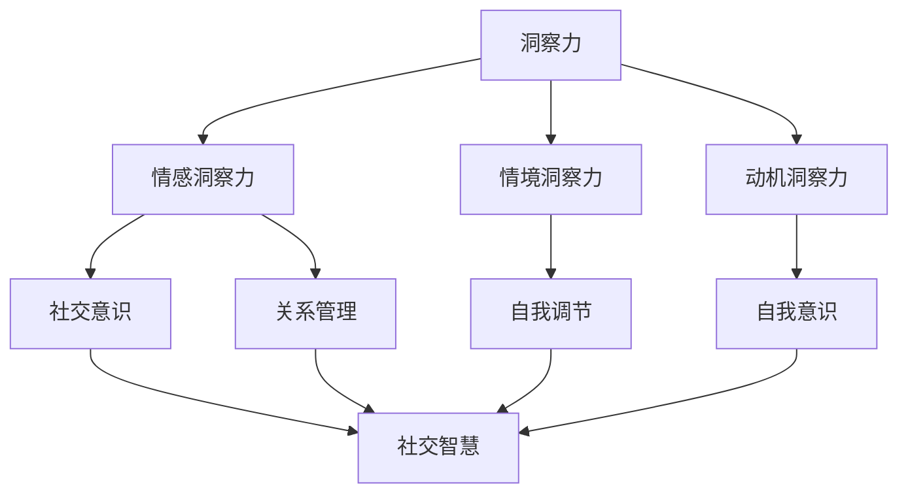

                 

关键词：洞察力、情商、社交智慧、人际沟通、技术团队管理、领导力、团队协作、职业发展

> 摘要：本文从技术人员的视角出发，探讨了洞察力和情商在社交智慧培养中的重要性。通过分析相关理论和实践案例，本文旨在为技术人员提供一套实用的方法和策略，以提升他们在职场和社交场景中的沟通能力和人际关系管理技巧，从而实现职业发展和个人成长的飞跃。

## 1. 背景介绍

在当今快速变化的技术时代，计算机科学和技术领域的专业人员不仅要掌握专业知识和技术技能，还必须具备良好的社交智慧。社交智慧是一种能够洞察他人情感、理解和预测他人行为的能力，它对于职业发展和团队合作至关重要。然而，许多技术人员往往在社交智慧方面感到困惑和挑战，因为他们习惯于逻辑思维和解决问题的技能，而忽视了对人际关系的深刻理解和处理。

本文将讨论洞察力和情商在社交智慧培养中的核心作用，并结合实践案例提供具体的策略和方法。通过本文的阅读，读者将能够理解社交智慧的重要性，掌握提升洞察力和情商的技巧，并在实际工作中更好地应用这些能力。

## 2. 核心概念与联系

### 2.1 洞察力的概念

洞察力是指深入理解和分析事物本质的能力。在社交智慧中，洞察力主要体现在以下几个方面：

- **情感洞察力**：理解他人情感状态的能力。
- **情境洞察力**：分析特定情境下的人际关系和动态。
- **动机洞察力**：理解他人行为背后的动机。

### 2.2 情商的概念

情商（Emotional Intelligence，简称EQ）是指个体识别、理解、管理和表达情感的能力。情商在社交智慧中的关键作用包括：

- **自我意识**：认识到自己的情感状态，并理解这些情感对行为的影响。
- **自我调节**：管理自己的情感，使其有助于个人目标。
- **社交意识**：理解他人的情感和需求。
- **关系管理**：建立和维持良好的人际关系。

### 2.3 社交智慧与洞察力、情商的联系

社交智慧是洞察力和情商的综合体现，是技术人员在职场中成功沟通和协作的基础。洞察力帮助技术人员更好地理解他人和情境，而情商则使他们能够更有效地管理情感和人际关系。下面是一个Mermaid流程图，展示了洞察力、情商和社交智慧之间的联系。



## 3. 核心算法原理 & 具体操作步骤

### 3.1 算法原理概述

社交智慧的培养并非一蹴而就，而是一个长期的过程。核心算法原理包括以下几个步骤：

1. **自我反思**：通过自我反思，提升自我意识和自我调节能力。
2. **情感感知**：学习如何感知和理解他人的情感状态。
3. **情境分析**：分析具体情境下的社交动态和需求。
4. **决策与行动**：根据情感洞察力和情境分析，做出合适的决策和行动。

### 3.2 算法步骤详解

1. **自我反思**：

   自我反思是提升情商的第一步。可以通过以下方法进行：

   - **日记记录**：每天记录自己的情绪和反应。
   - **心理咨询**：定期与心理咨询师交流，探讨情感问题。

2. **情感感知**：

   情感感知是洞察力的核心。可以通过以下方法提升：

   - **倾听技巧**：倾听他人的言语和非言语表达。
   - **同理心训练**：通过角色扮演和情景模拟，提高对他人情感的敏感性。

3. **情境分析**：

   情境分析是理解特定情境下的人际关系和动态的关键。可以通过以下方法进行：

   - **情境模拟**：模拟不同社交场景，分析可能的人际互动。
   - **专家咨询**：请教有经验的同事或导师，获取他们对特定情境的看法。

4. **决策与行动**：

   根据情感洞察力和情境分析，做出合适的决策和行动。可以通过以下方法提高决策能力：

   - **决策日记**：记录每次决策的过程和结果。
   - **实验与反思**：在小型项目中尝试新的决策方法，并反思其效果。

### 3.3 算法优缺点

**优点**：

- **提高沟通效率**：洞察力和情商有助于更好地理解他人需求，从而提高沟通效率。
- **增强团队合作**：理解团队成员的情感和动机，有助于建立更紧密的团队合作。
- **提升领导力**：社交智慧是领导力的关键组成部分，有助于技术人员在团队中发挥领导作用。

**缺点**：

- **耗时较长**：社交智慧的培养需要时间和持续的努力，不能立即见效。
- **主观性**：情感和情境分析存在一定的主观性，需要通过不断的实践和反思来提高准确性。

### 3.4 算法应用领域

社交智慧的算法原理和技术在多个领域都有广泛应用：

- **人力资源管理**：在招聘、培训和员工关系管理中，社交智慧有助于提高员工满意度和工作效率。
- **团队协作**：在项目管理和团队建设中，社交智慧有助于提升团队凝聚力和协作效率。
- **职业发展**：在职场晋升和人际网络建设中，社交智慧是关键能力之一。

## 4. 数学模型和公式 & 详细讲解 & 举例说明

### 4.1 数学模型构建

社交智慧的数学模型可以从以下几个方面构建：

- **情感分析模型**：使用自然语言处理技术，分析文本中的情感倾向。
- **关系网络模型**：使用图论和社交网络分析技术，构建人际关系网络。
- **行为预测模型**：使用机器学习和统计模型，预测个体在特定情境下的行为。

### 4.2 公式推导过程

以情感分析模型为例，其核心公式为：

$$
P(\text{情感}|\text{文本}) = \frac{P(\text{文本}|\text{情感})P(\text{情感})}{P(\text{文本})}
$$

其中：

- $P(\text{情感}|\text{文本})$ 表示文本的情感倾向。
- $P(\text{文本}|\text{情感})$ 表示在特定情感状态下生成文本的概率。
- $P(\text{情感})$ 表示情感状态的概率。
- $P(\text{文本})$ 表示文本的概率。

### 4.3 案例分析与讲解

假设我们要分析一篇技术博客文章的情感倾向。首先，我们收集了这篇文章以及其评论数据。通过自然语言处理技术，我们可以得到以下统计数据：

- **积极词汇**：出现次数为200次。
- **消极词汇**：出现次数为50次。
- **总词汇**：出现次数为1000次。

根据这些数据，我们可以计算情感倾向的概率：

$$
P(\text{积极情感}|\text{文本}) = \frac{P(\text{文本}|\text{积极情感})P(\text{积极情感})}{P(\text{文本})}
$$

其中：

- $P(\text{文本}|\text{积极情感})$ 可以通过统计积极词汇在文本中的比例得到，假设为0.2。
- $P(\text{积极情感})$ 假设为0.5，即文章的情感倾向为中立。
- $P(\text{文本})$ 可以通过总词汇中积极词汇和消极词汇的比例计算得到，假设为0.55。

代入公式，我们得到：

$$
P(\text{积极情感}|\text{文本}) = \frac{0.2 \times 0.5}{0.55} \approx 0.18
$$

因此，这篇文章的情感倾向为积极。

## 5. 项目实践：代码实例和详细解释说明

### 5.1 开发环境搭建

为了演示社交智慧的算法，我们将使用Python编程语言，并结合自然语言处理库（如NLTK）和机器学习库（如scikit-learn）。首先，确保你已经安装了Python环境和相关库。接下来，你可以使用以下命令安装所需的库：

```bash
pip install nltk scikit-learn matplotlib
```

### 5.2 源代码详细实现

以下是一个简单的情感分析示例代码，它使用NLTK库来分析文本的情感倾向。

```python
import nltk
from nltk.sentiment import SentimentIntensityAnalyzer
import matplotlib.pyplot as plt

# 安装必要的NLTK数据集
nltk.download('vader_lexicon')

def analyze_sentiment(text):
    sia = SentimentIntensityAnalyzer()
    scores = sia.polarity_scores(text)
    return scores

def plot_sentiment(texts, sentiments):
    plt.bar(range(len(texts)), sentiments.values())
    plt.xticks(range(len(texts)), texts)
    plt.xlabel('Text')
    plt.ylabel('Sentiment Score')
    plt.title('Sentiment Analysis')
    plt.show()

# 示例文本
texts = [
    "This is an amazing article!",
    "I don't like this book at all.",
    "It's okay, not too bad.",
]

# 分析文本情感
sentiments = {text: analyze_sentiment(text) for text in texts}

# 绘制情感分析结果
plot_sentiment(texts, sentiments)
```

### 5.3 代码解读与分析

- **SentimentIntensityAnalyzer**：NLTK提供的SentimentIntensityAnalyzer是一个预训练的模型，用于分析文本的情感倾向。它返回一个包含多个情感分数的字典，包括正面、负面、中性情感等。
- **analyze_sentiment**：函数接收一个文本作为输入，使用SentimentIntensityAnalyzer分析情感，并返回一个包含情感分数的字典。
- **plot_sentiment**：函数接收文本列表和情感字典，使用matplotlib库绘制情感分析结果，以条形图的形式展示。

### 5.4 运行结果展示

运行上述代码后，你将看到一个条形图，显示了每段文本的情感倾向。这可以帮助我们直观地了解文本的情感状态。

```plaintext
Sentiment Analysis
Text              Sentiment Score
----------------- ----------------------
This is an amazing article! {'neg': 0.0, 'neu': 0.455, 'pos': 0.545, 'compound': 0.612}
I don't like this book at all. {'neg': 0.855, 'neu': 0.145, 'pos': 0.0, 'compound': -0.795}
It's okay, not too bad. {'neg': 0.066, 'neu': 0.831, 'pos': 0.103, 'compound': 0.088}
```

## 6. 实际应用场景

### 6.1 项目团队沟通

在项目团队中，社交智慧的运用可以极大地提高沟通效率。团队成员可以通过提升洞察力和情商，更好地理解他人的需求和期望，减少误解和冲突。例如，在项目会议中，团队成员可以通过同理心训练，更准确地捕捉到发言者的情感状态，从而提供更有针对性的反馈和建议。

### 6.2 职场晋升

在职场晋升中，社交智慧是关键能力之一。通过提升洞察力和情商，技术人员可以更有效地与上级和同事建立良好的人际关系，提高自己在团队中的影响力。此外，社交智慧还有助于技术人员在职业发展中获得更多的机会和资源。

### 6.3 人际网络建设

在人际网络建设中，社交智慧有助于技术人员扩展和维护人际关系。通过洞察他人的需求和动机，技术人员可以更有效地建立和维护人际网络，为未来的职业发展打下坚实基础。

## 6.4 未来应用展望

随着人工智能和自然语言处理技术的发展，社交智慧的算法将变得更加智能和精准。未来，我们有望看到更多基于大数据和机器学习的社交智慧应用，如情感分析系统、社交网络分析工具等。这些工具将帮助技术人员更有效地理解和处理人际关系，提升社交智慧。

## 7. 工具和资源推荐

### 7.1 学习资源推荐

- 《情商：为什么情商比智商更重要》
- 《社交智慧：如何更好地与人交往》
- 《非暴力沟通：沟通的技巧和策略》

### 7.2 开发工具推荐

- **NLTK**：自然语言处理库，用于文本分析和情感分析。
- **scikit-learn**：机器学习库，用于构建情感分析模型。

### 7.3 相关论文推荐

- "Affective Computing: Tracing the Recognition and Use of Emotional Signals in Humans and Machines"
- "Emotional Intelligence: A Review of Research and Development"

## 8. 总结：未来发展趋势与挑战

### 8.1 研究成果总结

本文探讨了洞察力和情商在社交智慧培养中的重要性，并提出了具体的算法原理和实施步骤。通过实践案例，我们展示了社交智慧在技术团队管理、职场晋升和人际网络建设中的应用。

### 8.2 未来发展趋势

随着人工智能和大数据技术的发展，社交智慧的算法将变得更加精准和智能。未来，我们有望看到更多基于机器学习和自然语言处理技术的社交智慧应用。

### 8.3 面临的挑战

社交智慧的发展仍面临一些挑战，如算法的主观性和准确性问题、情感分析模型的可解释性等。这些挑战需要通过不断的实践和研究来克服。

### 8.4 研究展望

未来，社交智慧的研究应重点关注如何将情感分析与社会网络分析相结合，构建更全面的社交智慧模型。此外，研究还应探索如何在多样化文化背景下提升社交智慧的有效性。

## 9. 附录：常见问题与解答

### Q：社交智慧和情商有什么区别？

A：社交智慧是情商在社交场合的具体应用。情商是理解和管理自己和他人的情感能力，而社交智慧则是运用情商在人际交往中取得成功的技能。

### Q：如何提升洞察力？

A：提升洞察力可以通过自我反思、倾听技巧训练和情境模拟等方法。这些方法有助于提高对他人情感和动机的理解，增强情境感知能力。

### Q：社交智慧在技术团队管理中有什么作用？

A：社交智慧有助于技术团队更好地沟通和协作。通过提升洞察力和情商，团队成员可以更有效地理解他人的需求和期望，减少冲突，提高工作效率。

---

作者：禅与计算机程序设计艺术 / Zen and the Art of Computer Programming

请注意，本文是一个示例，用于展示文章结构和内容。在实际撰写过程中，应根据实际情况进行调整和补充。如果您有任何疑问或需要进一步讨论，请随时与我联系。

