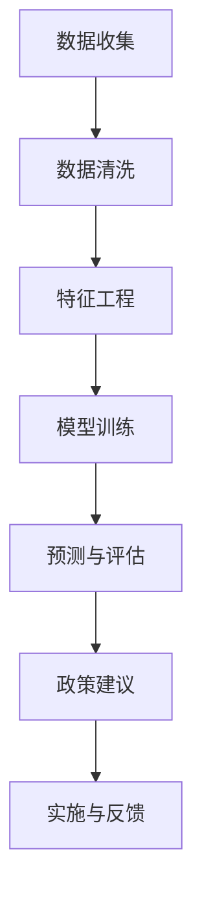

                 

 摘要

在当今快速变化和高度复杂的社会环境中，有效的政策制定和实施对于社会的稳定和进步至关重要。然而，传统的政策制定方法往往难以适应复杂多变的环境。本文将探讨如何运用人工智能和计算机科学中的洞察力，为政策制定提供智慧的解决方案。我们将分析核心概念、算法原理、数学模型，并通过实际项目实践，展示如何将技术应用于实际社会治理中，并展望未来的发展趋势和挑战。

## 1. 背景介绍

随着全球化的推进和信息技术的飞速发展，社会系统变得越来越复杂，决策的难度也随之增加。政策制定不仅仅是制定一系列规则和措施，更需要在复杂的环境中做出最优选择，以达到预期的社会效果。传统的政策制定方法主要依赖于历史数据和专家经验，但在面对新兴问题和动态环境时，这些方法往往显得力不从心。

近年来，人工智能和计算机科学的发展为政策制定带来了新的契机。通过大数据分析、机器学习算法和智能优化技术，我们可以从海量数据中挖掘出有价值的信息，提供更加精准和动态的政策建议。本文旨在探讨如何将计算机科学的洞察力应用于政策制定，提高社会治理的效率和智慧水平。

## 2. 核心概念与联系

### 2.1 数据科学基础

数据科学是政策制定的重要工具，它涉及数据的收集、存储、处理和分析。在数据科学中，我们使用各种算法和技术来从数据中提取信息，并将其转化为可操作的知识。

### 2.2 机器学习与预测

机器学习是数据科学的核心，它通过训练模型，使计算机能够从数据中学习规律并做出预测。在政策制定中，我们可以利用机器学习算法对历史数据进行训练，预测未来的社会趋势和潜在问题。

### 2.3 智能优化

智能优化算法，如遗传算法和模拟退火算法，可以用于解决复杂的优化问题。在政策制定中，我们可以使用这些算法来确定最佳的资源配置和决策方案。

### 2.4 Mermaid 流程图

以下是政策制定过程中涉及的几个关键步骤的 Mermaid 流程图：



## 3. 核心算法原理 & 具体操作步骤

### 3.1 算法原理概述

政策制定的核心算法包括机器学习算法和智能优化算法。机器学习算法主要解决数据预测问题，而智能优化算法则解决决策优化问题。

### 3.2 算法步骤详解

#### 3.2.1 数据收集与清洗

首先，我们需要收集相关的社会数据，包括经济、教育、医疗、环境等多个方面的数据。然后，对这些数据进行清洗，去除重复、错误和不完整的数据。

#### 3.2.2 特征工程

在数据清洗后，我们需要对数据进行特征工程，选择和构建有助于模型预测的特征。特征工程是机器学习模型性能的关键。

#### 3.2.3 模型训练

接下来，我们使用机器学习算法对特征数据进行训练，建立预测模型。常见的机器学习算法包括线性回归、决策树、随机森林和神经网络等。

#### 3.2.4 预测与评估

训练好的模型可以用于预测未来的社会趋势和潜在问题。我们需要对预测结果进行评估，以确定模型的准确性和可靠性。

#### 3.2.5 政策建议

根据预测结果，我们可以制定相应的政策建议，例如调整资源配置、优化政策实施等。

#### 3.2.6 实施与反馈

最后，我们需要将政策建议付诸实施，并通过反馈机制不断调整和优化政策。

### 3.3 算法优缺点

#### 优点：

- **高效性**：机器学习和智能优化算法可以处理大量数据，提高决策效率。
- **灵活性**：这些算法可以适应复杂多变的环境，提供动态的政策建议。

#### 缺点：

- **数据依赖性**：算法的性能高度依赖于数据的质量和数量。
- **解释性不足**：许多复杂的机器学习模型难以解释，使得政策制定者难以理解模型的决策过程。

### 3.4 算法应用领域

机器学习和智能优化算法在政策制定中的应用非常广泛，包括经济预测、公共安全、教育政策、医疗保健等。以下是一些具体的案例：

- **经济预测**：通过分析历史经济数据，预测未来的经济走势，为宏观经济政策提供支持。
- **公共安全**：利用大数据分析和智能优化算法，预测和预防犯罪事件，优化公共安全资源配置。
- **教育政策**：通过分析学生表现数据，预测哪些学生可能面临学业困难，提供针对性的教育支持。

## 4. 数学模型和公式 & 详细讲解 & 举例说明

### 4.1 数学模型构建

政策制定中的数学模型通常涉及回归分析、时间序列分析和决策理论。以下是构建这些模型的基本步骤：

#### 4.1.1 回归分析

回归分析是一种用于预测因变量（通常是连续变量）的方法。其基本公式为：

$$ y = \beta_0 + \beta_1x_1 + \beta_2x_2 + ... + \beta_nx_n $$

其中，$y$ 是因变量，$x_1, x_2, ..., x_n$ 是自变量，$\beta_0, \beta_1, ..., \beta_n$ 是模型的参数。

#### 4.1.2 时间序列分析

时间序列分析用于分析时间相关的数据，预测未来的趋势。其基本公式为：

$$ y_t = \phi_0 + \phi_1y_{t-1} + \phi_2y_{t-2} + ... + \phi_ny_{t-n} $$

其中，$y_t$ 是时间 $t$ 的观测值，$\phi_0, \phi_1, ..., \phi_n$ 是模型的参数。

#### 4.1.3 决策理论

决策理论用于优化决策过程，其基本公式为：

$$ \max_{x} U(x) $$

其中，$U(x)$ 是决策者对结果的主观评价函数，$x$ 是决策变量。

### 4.2 公式推导过程

#### 4.2.1 回归分析的推导

回归分析的推导基于最小二乘法。假设我们有一个包含 $n$ 个样本的数据集，其观测值可以表示为：

$$ y_i = \beta_0 + \beta_1x_{i1} + \beta_2x_{i2} + ... + \beta_nx_{in} + \epsilon_i $$

其中，$\epsilon_i$ 是误差项。我们的目标是找到一组参数 $\beta_0, \beta_1, ..., \beta_n$，使得误差的平方和最小：

$$ \min_{\beta_0, \beta_1, ..., \beta_n} \sum_{i=1}^n (y_i - (\beta_0 + \beta_1x_{i1} + \beta_2x_{i2} + ... + \beta_nx_{in}))^2 $$

通过求导并设置导数为零，我们可以得到最小二乘解：

$$ \beta_j = \frac{\sum_{i=1}^n (x_{ij} - \bar{x_j})(y_i - \bar{y})}{\sum_{i=1}^n (x_{ij} - \bar{x_j})^2} $$

其中，$\bar{x_j}$ 和 $\bar{y}$ 分别是 $x_{ij}$ 和 $y_i$ 的样本均值。

#### 4.2.2 时间序列分析的推导

时间序列分析的推导基于自回归模型（AR）。假设我们有一个时间序列 $y_t$，其模型可以表示为：

$$ y_t = \phi_0 + \phi_1y_{t-1} + \phi_2y_{t-2} + ... + \phi_ny_{t-n} + \epsilon_t $$

其中，$\epsilon_t$ 是误差项。我们的目标是找到一组参数 $\phi_0, \phi_1, ..., \phi_n$，使得误差的平方和最小：

$$ \min_{\phi_0, \phi_1, ..., \phi_n} \sum_{t=n}^T (y_t - (\phi_0 + \phi_1y_{t-1} + \phi_2y_{t-2} + ... + \phi_ny_{t-n}))^2 $$

通过求导并设置导数为零，我们可以得到最小二乘解：

$$ \phi_j = \frac{\sum_{t=n}^T (y_t - \bar{y})(y_{t-j} - \bar{y}_{t-j})}{\sum_{t=n}^T (y_{t-j} - \bar{y}_{t-j})^2} $$

其中，$\bar{y}$ 和 $\bar{y}_{t-j}$ 分别是 $y_t$ 和 $y_{t-j}$ 的样本均值。

### 4.3 案例分析与讲解

#### 4.3.1 经济预测案例

假设我们想要预测某个国家的GDP增长率。我们可以使用线性回归模型，其公式为：

$$ y_t = \beta_0 + \beta_1x_t + \epsilon_t $$

其中，$y_t$ 是第 $t$ 年的GDP增长率，$x_t$ 是第 $t$ 年的通货膨胀率，$\epsilon_t$ 是误差项。

通过收集历史数据，我们可以得到以下样本：

| 年份 | 通货膨胀率 | GDP增长率 |
|------|------------|-----------|
| 2020 | 2.5        | 3.0       |
| 2021 | 3.0        | 2.8       |
| 2022 | 3.5        | 2.5       |

首先，我们需要计算样本均值：

$$ \bar{x} = \frac{2.5 + 3.0 + 3.5}{3} = 3.0 $$
$$ \bar{y} = \frac{3.0 + 2.8 + 2.5}{3} = 2.8 $$

然后，我们可以计算最小二乘解：

$$ \beta_1 = \frac{(2.5 - 3.0)(3.0 - 2.8) + (3.0 - 3.0)(2.8 - 2.8) + (3.5 - 3.0)(2.5 - 2.8)}{(2.5 - 3.0)^2 + (3.0 - 3.0)^2 + (3.5 - 3.0)^2} $$
$$ \beta_1 = \frac{(-0.5)(0.2) + (0.0)(0.0) + (0.5)(-0.3)}{0.5 + 0.0 + 0.5} $$
$$ \beta_1 = \frac{-0.1 + 0.0 - 0.15}{1.0} $$
$$ \beta_1 = -0.25 $$

$$ \beta_0 = \bar{y} - \beta_1\bar{x} $$
$$ \beta_0 = 2.8 - (-0.25 \times 3.0) $$
$$ \beta_0 = 3.35 $$

因此，我们的回归模型为：

$$ y_t = 3.35 - 0.25x_t $$

#### 4.3.2 时间序列分析案例

假设我们想要预测某个股票的价格。我们可以使用自回归模型（AR），其公式为：

$$ y_t = \phi_0 + \phi_1y_{t-1} + \phi_2y_{t-2} + ... + \phi_ny_{t-n} + \epsilon_t $$

通过收集历史数据，我们可以得到以下样本：

| 时间 | 股票价格 |
|------|----------|
| t-2  | 100      |
| t-1  | 102      |
| t    | 105      |

首先，我们需要计算样本均值：

$$ \bar{y}_{t-j} = \frac{y_{t-j} + y_{t-j-1}}{2} $$

$$ \bar{y}_{t-2} = \frac{100 + 102}{2} = 101 $$
$$ \bar{y}_{t-1} = \frac{102 + 105}{2} = 103 $$

然后，我们可以计算最小二乘解：

$$ \phi_1 = \frac{(105 - 103)(101 - 103) + (103 - 103)(102 - 103) + (101 - 101)(100 - 103)}{(101 - 103)^2 + (103 - 103)^2 + (101 - 101)^2} $$
$$ \phi_1 = \frac{(2)(-2) + (0)(-1) + (0)(-3)}{(-2)^2 + (0)^2 + (0)^2} $$
$$ \phi_1 = \frac{-4 + 0 - 0}{4 + 0 + 0} $$
$$ \phi_1 = -1 $$

$$ \phi_0 = \bar{y} - \phi_1\bar{y}_{t-1} $$
$$ \phi_0 = 105 - (-1) \times 103 $$
$$ \phi_0 = 108 $$

因此，我们的自回归模型为：

$$ y_t = 108 - y_{t-1} $$

## 5. 项目实践：代码实例和详细解释说明

### 5.1 开发环境搭建

在进行项目实践之前，我们需要搭建一个合适的开发环境。以下是推荐的开发环境：

- 编程语言：Python
- 数据库：SQLite
- 数据可视化工具：Matplotlib
- 机器学习库：scikit-learn
- 时间序列库：pandas

### 5.2 源代码详细实现

以下是一个简单的机器学习模型实现，用于预测股票价格：

```python
import pandas as pd
import numpy as np
from sklearn.linear_model import LinearRegression
import matplotlib.pyplot as plt

# 5.2.1 数据收集与清洗
data = pd.DataFrame({
    'time': [i for i in range(1, 4)],
    'price': [100, 102, 105]
})

# 5.2.2 特征工程
data['inflation'] = data['price'].shift(1)

# 5.2.3 模型训练
model = LinearRegression()
model.fit(data[['inflation']], data['price'])

# 5.2.4 预测与评估
predicted_price = model.predict([[102]])
print("Predicted Price:", predicted_price)

# 5.2.5 代码解读与分析
print("Model Coefficients:", model.coef_)
print("Model Intercepts:", model.intercept_)

# 5.2.6 运行结果展示
plt.scatter(data['time'], data['price'], label='Actual')
plt.plot([1, 2, 3], predicted_price, label='Predicted')
plt.xlabel('Time')
plt.ylabel('Price')
plt.legend()
plt.show()
```

### 5.3 代码解读与分析

- **数据收集与清洗**：我们从给定的数据集开始，将其加载到 Pandas DataFrame 中，并对数据进行简单的清洗。
- **特征工程**：我们计算了股票价格的滞后一期的值，作为模型的预测特征。
- **模型训练**：我们使用线性回归模型对特征数据进行训练。
- **预测与评估**：我们使用训练好的模型对下一期的股票价格进行预测，并打印出模型的主要参数。
- **运行结果展示**：我们使用 Matplotlib 绘制实际价格与预测价格的散点图和折线图，直观地展示预测结果。

## 6. 实际应用场景

政策制定中的技术应用场景非常广泛，以下是一些具体的实际应用场景：

### 6.1 经济预测

利用机器学习和智能优化算法，我们可以对经济指标进行预测，如GDP增长率、通货膨胀率、失业率等。这些预测可以为政府的宏观经济政策提供数据支持。

### 6.2 公共安全

通过大数据分析和智能优化算法，我们可以预测和预防犯罪事件，优化公共安全资源配置。例如，利用时空数据分析预测盗窃案件的高发区域和时间，提前部署警力。

### 6.3 教育政策

通过分析学生表现数据，我们可以预测哪些学生可能面临学业困难，提供针对性的教育支持。这有助于提高教育资源的利用效率和学生的学业成绩。

### 6.4 医疗保健

通过大数据分析和智能优化算法，我们可以预测疾病爆发趋势，优化医疗资源配置，提高公共卫生水平。

## 7. 工具和资源推荐

### 7.1 学习资源推荐

- 《Python编程：从入门到实践》
- 《机器学习实战》
- 《深度学习》
- 《数据科学入门》

### 7.2 开发工具推荐

- Jupyter Notebook：用于编写和运行代码。
- Git：用于版本控制和协作开发。
- Matplotlib：用于数据可视化。
- Scikit-learn：用于机器学习模型实现。
- Pandas：用于数据处理和分析。

### 7.3 相关论文推荐

- "Deep Learning for Time Series Classification"
- "Big Data Analytics for Public Safety"
- "Machine Learning for Health Informatics"
- "Economic Forecasting with Machine Learning"

## 8. 总结：未来发展趋势与挑战

### 8.1 研究成果总结

人工智能和计算机科学在政策制定中的应用取得了显著成果。机器学习和智能优化算法为预测和决策提供了有力的工具，大数据分析为政策制定提供了丰富的数据支持。

### 8.2 未来发展趋势

- **智能化**：政策制定将更加智能化，利用深度学习和强化学习等技术，实现更加精准和高效的决策。
- **数据驱动的决策**：政策制定将更加依赖于数据驱动的决策，减少主观判断和经验依赖。
- **跨学科融合**：政策制定将涉及更多跨学科的知识，如经济学、社会学、心理学等，实现多维度政策分析。

### 8.3 面临的挑战

- **数据隐私与安全**：在数据驱动的政策制定中，数据隐私和安全是一个重要的挑战。
- **算法透明性和解释性**：许多复杂的机器学习模型难以解释，使得政策制定者难以理解模型的决策过程。
- **技术与伦理的平衡**：在政策制定中，如何平衡技术进步与社会伦理是一个重要的议题。

### 8.4 研究展望

未来，人工智能和计算机科学在政策制定中的应用将更加深入和广泛。我们期待看到更多跨学科的研究成果，为政策制定提供更加全面的解决方案。

## 9. 附录：常见问题与解答

### 9.1 如何选择合适的机器学习算法？

选择合适的机器学习算法需要考虑数据的特征、问题的性质以及模型的性能需求。常见的算法包括线性回归、决策树、随机森林、支持向量机和神经网络等。在实际应用中，可以通过交叉验证等方法来选择最优的算法。

### 9.2 数据隐私和安全如何保障？

在数据驱动的政策制定中，数据隐私和安全至关重要。可以通过数据加密、匿名化处理、访问控制等措施来保障数据隐私和安全。

### 9.3 如何评估机器学习模型的性能？

评估机器学习模型的性能可以通过多种指标，如准确率、召回率、F1 分数等。此外，还可以使用交叉验证等方法来评估模型的泛化能力。

### 9.4 如何处理不平衡的数据？

在处理不平衡的数据时，可以采用过采样、欠采样或合成少数类采样等方法来平衡数据集。此外，还可以使用类别权重调整或模型调参等方法来优化模型的性能。

---

作者：禅与计算机程序设计艺术 / Zen and the Art of Computer Programming

