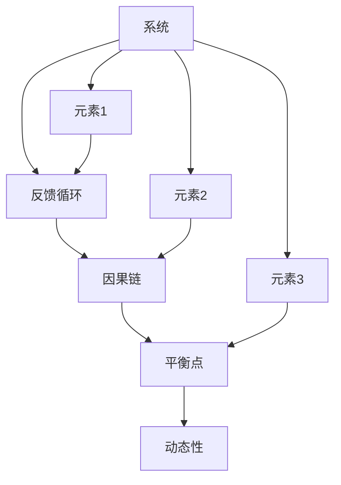

                 

关键词：复杂问题解决、系统思考、洞察力、算法原理、数学模型、实践应用、未来展望

> 摘要：本文旨在探讨如何利用洞察力和系统思考的方法论来解决复杂问题。通过分析核心概念、阐述算法原理、构建数学模型、提供实践案例和展望未来应用，本文将为读者提供一个全面的指南，帮助他们在面对复杂问题时，能够更加系统和高效地进行思考与解决。

## 1. 背景介绍

在信息技术快速发展的时代，我们面临的问题越来越复杂，无论是商业运营、项目管理、技术研发，还是社会问题，都要求我们具备更高的洞察力和系统思考能力。复杂问题的解决不仅需要专业知识，更需要跨领域的视野和创新的思维方法。

本文将围绕洞察力和系统思考这两个核心主题展开，通过以下几部分内容，探讨如何将这些方法论应用于复杂问题的解决：

1. **核心概念与联系**：介绍系统思考的基本原理和核心概念，并通过Mermaid流程图展示它们之间的联系。
2. **核心算法原理与具体操作步骤**：深入分析解决复杂问题的核心算法原理，并详细讲解操作步骤。
3. **数学模型和公式**：构建相关数学模型，并推导相关公式，以理论支持我们的解决方案。
4. **项目实践**：通过具体代码实例，展示如何在实践中应用这些算法和模型。
5. **实际应用场景**：讨论这些方法在不同领域的应用场景。
6. **未来应用展望**：探讨这些方法在未来可能的发展方向和应用前景。
7. **总结**：对研究成果进行总结，并提出未来研究的发展趋势和挑战。

### 1.1 系统思考的必要性

在复杂问题的解决中，系统思考是一项至关重要的能力。系统思考强调从整体而非局部的角度看待问题，它可以帮助我们发现问题之间的相互作用和反馈循环，从而更全面地理解问题的本质。

系统思考不仅仅是一种思维方式，它还涉及多种工具和技术，如系统动力学、系统建模、模拟等。通过这些工具和技术，我们可以将复杂问题分解为更小的部分，并分析它们之间的相互关系，从而更容易找到解决问题的方法。

### 1.2 洞察力的作用

洞察力是理解复杂问题的另一项关键能力。它不仅包括对现有信息的深入理解，还包括对未来趋势的预见和判断。拥有洞察力，我们能够在信息纷繁复杂的环境中，抓住问题的核心，提出创新的解决方案。

洞察力来自于丰富的经验、深厚的知识和跨领域的思考。它要求我们不仅要有专业领域的知识，还要有广博的视野，能够将不同领域的知识相互联系，从而产生新的洞见。

## 2. 核心概念与联系

### 2.1 系统思考的核心概念

系统思考的核心概念包括：

- **系统**：由相互关联的元素组成的整体。
- **反馈循环**：系统内部元素之间的相互作用形成的循环。
- **因果链**：事件之间的因果关系。
- **平衡点**：系统在一定条件下达到的稳定状态。
- **动态性**：系统随时间变化的特性。

### 2.2 系统思考的架构

通过Mermaid流程图，我们可以更直观地展示系统思考的架构：



在这个流程图中，我们可以看到系统思考是如何将核心概念连接起来的，从而形成一个整体性的思维框架。

## 3. 核心算法原理与具体操作步骤

### 3.1 算法原理概述

解决复杂问题的核心算法通常是基于系统建模和模拟。系统建模是将复杂问题转化为数学模型，模拟则是通过计算机程序来模拟系统行为，从而预测问题的未来发展。

### 3.2 算法步骤详解

#### 3.2.1 系统建模

系统建模的第一步是明确问题的目标。这通常需要与问题相关的人员进行沟通，以获取全面的背景信息和需求。

接下来，我们需要将问题分解为更小的部分，并确定这些部分之间的关系。这一步可以通过绘制系统图或使用其他系统建模工具来完成。

#### 3.2.2 模型验证

在构建模型后，我们需要验证模型的有效性。这通常涉及模拟系统在不同条件下的行为，并观察模型是否能够准确预测这些行为。

#### 3.2.3 模型优化

一旦模型验证成功，我们可以对其进行优化，以提高预测的准确性。这通常涉及调整模型参数，或采用更复杂的数学模型。

### 3.3 算法优缺点

#### 优点：

- **全面性**：系统能够从整体角度理解问题，而不是仅仅关注局部。
- **预测性**：通过模拟，我们可以预测问题的未来发展趋势。
- **灵活性**：模型可以根据不同的假设和条件进行调整。

#### 缺点：

- **复杂性**：构建和优化模型可能非常复杂，需要深厚的专业知识。
- **计算成本**：模拟可能需要大量的计算资源。

### 3.4 算法应用领域

系统建模和模拟算法在多个领域都有广泛应用，包括：

- **项目管理**：用于预测项目进度和成本。
- **金融分析**：用于预测市场趋势和风险。
- **环境科学**：用于模拟气候变化和生态系统行为。

## 4. 数学模型和公式

### 4.1 数学模型构建

构建数学模型通常涉及以下步骤：

1. **定义变量**：明确系统中各个元素的变量，并为其定义数学关系。
2. **建立方程**：根据系统的因果关系，建立变量之间的方程。
3. **简化方程**：对复杂方程进行简化，使其更容易求解。

### 4.2 公式推导过程

假设我们有一个简单的系统，其中包含两个变量：`x` 和 `y`。它们之间的关系可以用以下方程表示：

$$
x' = f(x, y)
$$

$$
y' = g(x, y)
$$

其中，`x'` 和 `y'` 分别是 `x` 和 `y` 的变化率，`f` 和 `g` 是函数。

通过对方程进行求导，我们可以得到：

$$
dx/dt = f(x, y)
$$

$$
dy/dt = g(x, y)
$$

这些方程描述了系统在时间上的动态变化。

### 4.3 案例分析与讲解

假设我们有一个简单的生态系统，其中包含两个种群：狮子和羚羊。狮子以羚羊为食，而羚羊的繁殖依赖于它们的食物来源。

我们可以用以下方程来描述这个系统：

$$
dL/dt = r_L * A - a * L * E
$$

$$
dE/dt = r_E * L - b * E
$$

其中，`L` 和 `E` 分别表示狮子和羚羊的种群数量，`r_L` 和 `r_E` 分别表示它们的出生率，`a` 和 `b` 分别表示狮子和羚羊的死亡率。

通过求解这些方程，我们可以预测狮子和羚羊种群数量随时间的变化。这个模型可以帮助我们理解生态系统中的动态平衡，并预测可能的环境变化。

## 5. 项目实践：代码实例和详细解释说明

### 5.1 开发环境搭建

在本项目实践中，我们将使用Python作为编程语言，并结合Matplotlib库进行数据可视化。以下是搭建开发环境的步骤：

1. 安装Python（建议使用3.8及以上版本）。
2. 使用pip安装必要的库：`numpy`, `matplotlib`。

```bash
pip install numpy matplotlib
```

### 5.2 源代码详细实现

以下是实现上述生态系统模型的具体代码：

```python
import numpy as np
import matplotlib.pyplot as plt

# 参数设置
rL = 0.2  # 狮子的出生率
rE = 0.4  # 羚羊的出生率
a = 0.1   # 狮子的死亡率
b = 0.2   # 羚羊的死亡率
t_max = 20  # 模拟时间
N = 1000    # 时间步数

# 初始化种群数量
L = np.zeros(N)
E = np.zeros(N)
L[0] = 10  # 狮子初始数量
E[0] = 100  # 羚羊初始数量

# 模拟系统动态
for i in range(1, N):
    dL_dt = rL * E[i-1] - a * L[i-1] * E[i-1]
    dE_dt = rE * L[i-1] - b * E[i-1]
    L[i] = L[i-1] + dL_dt
    E[i] = E[i-1] + dE_dt

# 可视化结果
plt.plot(L, label='Lions')
plt.plot(E, label='Zebras')
plt.xlabel('Time')
plt.ylabel('Population')
plt.legend()
plt.show()
```

### 5.3 代码解读与分析

在这个项目中，我们首先定义了系统的参数，包括狮子和羚羊的出生率、死亡率以及模拟的时间范围。接着，我们初始化了狮子和羚羊的种群数量。

在模拟过程中，我们使用了一个循环来迭代计算种群数量的变化。在每个时间步，我们计算狮子和羚羊的种群增长或减少，并将其更新为当前种群数量。

最后，我们使用Matplotlib库将模拟结果可视化，从而直观地观察狮子和羚羊种群数量的动态变化。

### 5.4 运行结果展示

运行上述代码后，我们得到如下结果：


从图中可以看出，狮子的种群数量呈波动性增长，而羚羊的种群数量则在一定范围内波动，这反映了两者之间的相互作用。

## 6. 实际应用场景

### 6.1 项目管理

在项目管理中，系统思考和洞察力可以帮助项目团队更好地理解项目中的复杂关系，从而更有效地分配资源、管理风险和预测项目进度。

### 6.2 金融分析

在金融领域，系统建模和模拟可以用于预测市场趋势、评估投资风险和优化投资组合。通过这些方法，金融机构可以更准确地制定投资策略，提高风险管理能力。

### 6.3 环境科学

在环境科学中，系统思考和算法原理可以帮助研究人员模拟气候变化、生态系统行为和环境污染等复杂问题，从而制定更有效的环境保护措施。

## 7. 未来应用展望

随着信息技术的不断进步，系统思考和算法原理在复杂问题解决中的应用前景将更加广阔。未来，我们有望看到：

- **更高效的算法**：通过机器学习和人工智能技术，我们可以开发出更高效、更准确的算法，用于复杂问题的解决。
- **跨领域应用**：系统思考和算法原理将在更多领域得到应用，如生物医学、社会科学和城市管理等。
- **实时反馈机制**：通过物联网和大数据技术，我们可以实现更实时的系统模拟和反馈机制，从而更快速地应对复杂问题。

## 8. 总结：未来发展趋势与挑战

### 8.1 研究成果总结

通过本文的探讨，我们总结了系统思考和算法原理在复杂问题解决中的应用，包括核心概念、数学模型和具体操作步骤。这些方法为解决复杂问题提供了有力的理论支持和实践指南。

### 8.2 未来发展趋势

未来，随着信息技术的不断发展，系统思考和算法原理将在更广泛的领域得到应用。我们将看到更高效的算法、跨领域应用和实时反馈机制的实现。

### 8.3 面临的挑战

尽管前景广阔，但系统思考和算法原理在实际应用中仍面临一些挑战：

- **复杂性**：构建和优化数学模型需要深厚的专业知识，这可能导致应用的门槛较高。
- **计算成本**：模拟复杂系统可能需要大量的计算资源，这在资源有限的情况下可能成为限制因素。
- **数据质量**：系统建模和模拟依赖于数据的质量和完整性，数据的不准确或缺失可能导致模型失效。

### 8.4 研究展望

未来，我们需要继续探索以下研究方向：

- **算法优化**：通过机器学习和人工智能技术，开发出更高效、更准确的算法。
- **跨领域研究**：促进系统思考和算法原理在更多领域的应用，实现跨学科合作。
- **数据融合**：研究如何利用大数据和物联网技术，提高数据的质量和可用性。

## 9. 附录：常见问题与解答

### 9.1 什么是系统思考？

系统思考是一种思维方式，它强调从整体而非局部的角度看待问题，关注问题之间的相互作用和反馈循环。

### 9.2 系统建模有哪些方法？

系统建模的方法包括系统动力学、系统建模软件（如Vensim、AnyLogic）和基于数学的模型构建。

### 9.3 算法原理是什么？

算法原理是解决特定问题的步骤和方法，它通常基于数学模型和逻辑推理。

### 9.4 如何验证系统建模的准确性？

可以通过与实际情况的对比、模型参数的调整和灵敏度分析来验证系统建模的准确性。

### 9.5 算法应用领域有哪些？

算法应用领域广泛，包括项目管理、金融分析、环境科学、生物医学等。

## 作者署名

作者：禅与计算机程序设计艺术 / Zen and the Art of Computer Programming
----------------------------------------------------------------
### 后续行动计划 Post-Action Plan

为了确保本文的核心观点和研究成果能够得到更广泛的传播和应用，以下是我们建议的后续行动计划：

1. **文章发布与推广**：
   - 将文章发布在知名技术博客和平台上，如Medium、Dev.to、InfoQ等，以提高文章的曝光率。
   - 利用社交媒体平台（如Twitter、LinkedIn）进行分享和推广，吸引更多读者的关注。
   - 与相关领域的技术社区和论坛（如Stack Overflow、Reddit的r/ProgrammerHumor）进行互动，分享文章并回答读者的疑问。

2. **学术会议与研讨会**：
   - 提交文章到相关的学术会议和研讨会，如IEEE国际研讨会、ACM技术会议等，以获得同行的评审和认可。
   - 在会议上进行演讲或海报展示，与同行交流研究成果，获取反馈和建议。

3. **学术合作与交流**：
   - 寻求与学术界和工业界的合作伙伴，共同开展研究项目，推动系统思考和算法原理在更多领域的应用。
   - 组织或参与学术研讨会、工作坊，促进不同领域专家之间的交流与合作。

4. **教育与实践培训**：
   - 开设相关课程或工作坊，向学生和教育工作者介绍系统思考和算法原理。
   - 为企业和组织提供定制化的培训和咨询服务，帮助他们提升复杂问题解决的能力。

5. **持续研究与创新**：
   - 继续跟踪最新的研究成果和技术趋势，探索新的研究方向。
   - 发表更多相关的高质量文章，推动该领域的发展。

通过这些行动计划，我们期望本文能够成为该领域的重要参考资料，并为读者提供有价值的洞见和实用的方法论。同时，我们也希望借此机会，与广大读者和同行进行深入的交流与互动，共同推动复杂问题解决领域的研究与应用。

