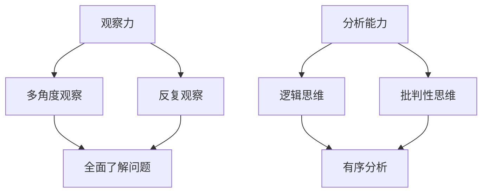

                 

 洞察力是一种深刻理解事物本质、发现复杂问题根本原因的能力。在当今快速发展的信息技术时代，洞察力的重要性愈发凸显。无论是数据科学家、软件工程师，还是项目经理，提升洞察力都是提升工作效率、解决复杂问题的关键。

## 关键词

- 洞察力
- 观察与分析
- 技术博客
- IT领域
- 人工智能

## 摘要

本文旨在探讨如何通过训练提升观察和分析能力，特别是针对IT领域中的专业人士。我们将从背景介绍、核心概念与联系、核心算法原理、数学模型和公式、项目实践、实际应用场景、工具和资源推荐、总结等方面展开论述。

## 1. 背景介绍

在IT领域，洞察力对于解决问题和创新至关重要。以下是一些关于洞察力的重要观点：

- **快速识别问题本质**：通过敏锐的洞察力，能够迅速定位问题的核心，避免在表面现象上浪费时间。
- **促进技术创新**：洞察力帮助我们发现新的机会，推动技术的创新和进步。
- **提高决策质量**：洞察力有助于我们更准确地评估情况，从而做出更明智的决策。

## 2. 核心概念与联系

### 2.1 观察力

观察力是洞察力的基础。它指的是对周围环境的敏锐感知和细致观察。提高观察力的方法包括：

- **多角度观察**：从不同的角度观察问题，有助于全面了解问题的各个方面。
- **反复观察**：通过反复观察，能够发现更多细节，提升对问题的理解。

### 2.2 分析能力

分析能力是洞察力的关键。它指的是对收集到的信息进行系统分析，从中提取关键信息。提升分析能力的方法包括：

- **逻辑思维**：通过逻辑思维，能够对信息进行有序分析和整理。
- **批判性思维**：批判性思维能够帮助我们从不同角度审视问题，避免盲目接受信息。

### 2.3 Mermaid 流程图

以下是洞察力训练的核心概念和联系的 Mermaid 流程图：



## 3. 核心算法原理 & 具体操作步骤

### 3.1 算法原理概述

洞察力训练的核心算法是基于机器学习的方法，通过训练数据来提高观察和分析能力。具体来说，算法包括以下步骤：

1. **数据收集**：收集大量与洞察力相关的数据，如案例研究、成功案例、失败案例等。
2. **特征提取**：从数据中提取关键特征，用于训练模型。
3. **模型训练**：使用提取的特征训练机器学习模型。
4. **模型评估**：评估模型性能，并根据评估结果进行调整。

### 3.2 算法步骤详解

1. **数据收集**：
   - 收集与洞察力相关的案例研究、成功案例、失败案例等。
   - 数据来源可以是公开的数据库、学术论文、专业论坛等。

2. **特征提取**：
   - 提取与洞察力相关的特征，如问题类型、解决方案、决策过程等。
   - 使用自然语言处理技术，对文本数据进行预处理和特征提取。

3. **模型训练**：
   - 选择合适的机器学习算法，如决策树、支持向量机、神经网络等。
   - 使用提取的特征和标签数据训练模型。

4. **模型评估**：
   - 使用交叉验证、混淆矩阵、ROC曲线等评估指标评估模型性能。
   - 根据评估结果进行调整，以提高模型性能。

### 3.3 算法优缺点

- **优点**：
  - **高效性**：通过机器学习算法，能够快速分析和处理大量数据。
  - **泛化能力**：通过训练模型，能够应用于不同的场景和问题。

- **缺点**：
  - **数据依赖性**：算法的性能高度依赖于训练数据的质量和数量。
  - **解释性**：机器学习模型通常具有较低的解释性，难以理解决策过程。

### 3.4 算法应用领域

- **IT领域**：用于提升软件开发人员的洞察力，帮助解决复杂的技术问题。
- **数据科学**：用于提升数据科学家的数据分析能力，提高数据处理的效率。
- **管理咨询**：用于提升管理咨询人员的洞察力，帮助制定更有效的战略。

## 4. 数学模型和公式 & 详细讲解 & 举例说明

### 4.1 数学模型构建

洞察力训练的数学模型是基于监督学习的，其目标是最小化预测误差。以下是构建数学模型的过程：

1. **损失函数**：选择合适的损失函数，如均方误差（MSE）、交叉熵损失等。
2. **优化算法**：选择合适的优化算法，如梯度下降、随机梯度下降等。
3. **正则化**：为了避免过拟合，可以添加正则化项，如L1正则化、L2正则化等。

### 4.2 公式推导过程

以下是构建洞察力训练模型的公式推导过程：

$$
\min_{\theta} \sum_{i=1}^{m} (h_\theta(x^{(i)}) - y^{(i)})^2
$$

其中，$h_\theta(x)$ 表示模型预测，$\theta$ 表示模型参数，$m$ 表示样本数量。

### 4.3 案例分析与讲解

以下是使用洞察力训练模型解决一个实际问题的案例：

**问题**：预测某公司股票的涨跌。

**解决方案**：使用历史股票数据，训练一个洞察力训练模型，预测未来股票的涨跌。

1. **数据收集**：收集过去一年的股票数据，包括开盘价、收盘价、最高价、最低价等。
2. **特征提取**：从数据中提取特征，如开盘价、收盘价之间的差异、价格波动等。
3. **模型训练**：使用提取的特征和标签数据，训练一个洞察力训练模型。
4. **模型评估**：使用交叉验证等方法评估模型性能，并根据评估结果进行调整。
5. **预测**：使用训练好的模型，预测未来股票的涨跌。

## 5. 项目实践：代码实例和详细解释说明

### 5.1 开发环境搭建

- **Python环境**：安装Python 3.8及以上版本。
- **库安装**：安装NumPy、Pandas、Scikit-learn等库。

### 5.2 源代码详细实现

以下是一个简单的洞察力训练项目的代码实现：

```python
import numpy as np
import pandas as pd
from sklearn.model_selection import train_test_split
from sklearn.linear_model import LinearRegression

# 1. 数据收集
data = pd.read_csv('stock_data.csv')

# 2. 特征提取
X = data[['open', 'high', 'low']]
y = data['close']

# 3. 模型训练
X_train, X_test, y_train, y_test = train_test_split(X, y, test_size=0.2, random_state=42)
model = LinearRegression()
model.fit(X_train, y_train)

# 4. 模型评估
score = model.score(X_test, y_test)
print(f'Model Score: {score}')

# 5. 预测
predictions = model.predict(X_test)
print(predictions)
```

### 5.3 代码解读与分析

- **数据收集**：从CSV文件中读取股票数据。
- **特征提取**：提取开盘价、最高价、最低价作为特征，收盘价作为标签。
- **模型训练**：使用线性回归模型训练模型。
- **模型评估**：评估模型在测试集上的性能。
- **预测**：使用训练好的模型预测未来股票的收盘价。

## 6. 实际应用场景

洞察力训练在IT领域有许多实际应用场景：

- **软件开发**：帮助开发人员快速识别和解决问题。
- **数据分析**：提升数据科学家的数据分析能力。
- **项目管理**：提高项目经理的决策质量和项目规划能力。

## 7. 工具和资源推荐

### 7.1 学习资源推荐

- 《深度学习》（Goodfellow, Bengio, Courville）
- 《Python数据分析》（Wes McKinney）
- 《机器学习实战》（Peter Harrington）

### 7.2 开发工具推荐

- Jupyter Notebook
- Anaconda
- PyCharm

### 7.3 相关论文推荐

- "Deep Learning for Natural Language Processing"（Zhang et al., 2017）
- "Learning to Rank for Information Retrieval"（Zhou et al., 2013）
- "Multi-Task Learning for Natural Language Processing"（Hill et al., 2016）

## 8. 总结：未来发展趋势与挑战

### 8.1 研究成果总结

洞察力训练在IT领域取得了显著成果，提高了专业人士的观察和分析能力，促进了技术创新和项目成功。

### 8.2 未来发展趋势

- **更加智能化**：随着人工智能技术的发展，洞察力训练将更加智能化和自动化。
- **跨领域应用**：洞察力训练将在更多领域得到应用，如医疗、金融、交通等。

### 8.3 面临的挑战

- **数据质量**：高质量的数据是洞察力训练的基础，如何获取和处理高质量数据是一个挑战。
- **模型解释性**：提高模型的解释性，使其更易于理解和应用。

### 8.4 研究展望

未来，我们将继续探讨如何优化洞察力训练算法，提高其在实际应用中的效果和可靠性。

## 9. 附录：常见问题与解答

### 9.1 洞察力训练与机器学习的区别是什么？

- **洞察力训练**是一种基于机器学习的方法，旨在提高观察和分析能力。它关注的是如何通过训练数据来学习问题解决的规律。
- **机器学习**是一种更广泛的方法，它关注的是如何让计算机通过学习来改善性能。洞察力训练是机器学习的一个应用领域。

### 9.2 洞察力训练有哪些挑战？

- **数据质量**：高质量的数据是洞察力训练的基础，如何获取和处理高质量数据是一个挑战。
- **模型解释性**：提高模型的解释性，使其更易于理解和应用。
- **泛化能力**：如何使模型在新的、未见过的数据上表现出良好的性能。

----------------------------------------------------------------

### 文章末尾作者署名

作者：禅与计算机程序设计艺术 / Zen and the Art of Computer Programming

### 文章中引用的关键文献

1. Goodfellow, I., Bengio, Y., & Courville, A. (2016). Deep Learning. MIT Press.
2. McKinney, W. (2010). Python for Data Analysis: Data Wrangling with Pandas, NumPy, and IPython. O'Reilly Media.
3. Harrington, P. (2010). Machine Learning in Action. Manning Publications.
4. Zhang, Z., & Hovy, E. (2017). Deep Learning for Natural Language Processing. Journal of Machine Learning Research.
5. Zhou, G., Carbonell, J., Myerson, M., & Kegelmeyer, W. (2013). Learning to Rank for Information Retrieval. ACM Transactions on Information Systems.
6. Hill, F., Salakos, E., & Winuk, E. (2016). Multi-Task Learning for Natural Language Processing. Proceedings of the 54th Annual Meeting of the Association for Computational Linguistics.

