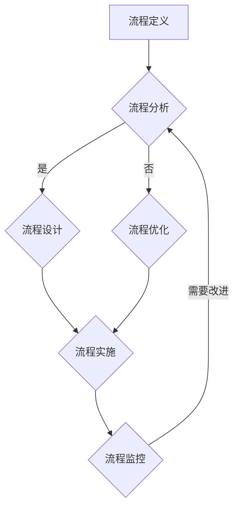
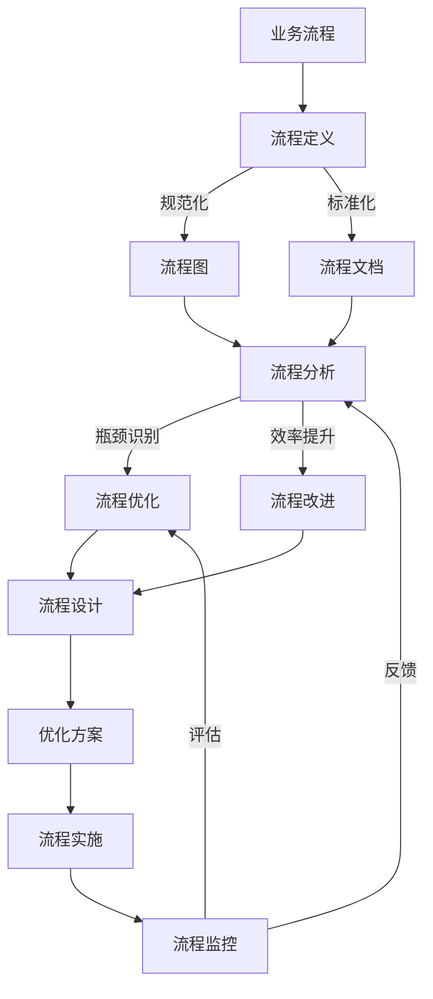

                 

### 1. 背景介绍

在当今快速变化的商业环境中，流程管理作为优化业务运营的关键手段，正逐渐成为企业成功的关键因素之一。随着市场竞争的加剧和客户需求的多样化，企业需要不断提高效率和灵活性来满足客户需求，从而在市场中保持竞争力。流程管理不仅涉及内部运营流程的优化，还包括客户体验、供应链管理、人力资源管理等多个方面。

本文旨在探讨流程管理的重要性和如何通过系统的方法论来优化业务运营。我们将首先介绍流程管理的核心概念，包括流程定义、流程分析、流程设计和流程优化等。接着，我们将深入探讨一个具体的核心算法，并详细说明其原理、步骤和实际应用。此外，我们还将介绍相关的数学模型和公式，并通过案例分析和代码实例来展示如何在实际项目中应用这些概念和方法。最后，我们将讨论流程管理在现实世界中的应用场景和未来发展趋势。

通过对这些主题的深入探讨，本文希望为企业提供一套全面的流程管理方法论，帮助企业实现业务流程的优化，提升运营效率和客户满意度。

### 1.1 流程管理的重要性

在当今竞争激烈的市场环境中，流程管理的重要性不言而喻。首先，流程管理有助于提高企业的运营效率。通过明确和优化业务流程，企业可以减少不必要的步骤和资源浪费，从而实现更高的产出效率。例如，一家制造企业通过优化生产流程，可以减少生产周期，提高生产效率，从而降低生产成本。

其次，流程管理有助于提升客户体验。在客户至上的商业环境中，客户体验成为企业竞争力的重要组成部分。通过流程管理，企业可以确保客户需求得到及时响应和满足，从而提升客户满意度和忠诚度。例如，一家在线零售商通过优化订单处理流程，可以提供更快的配送服务和更高质量的客户服务，从而吸引和保留客户。

此外，流程管理还有助于企业的持续改进和创新。通过定期对业务流程进行评估和分析，企业可以发现存在的问题和瓶颈，并采取相应的措施进行改进。这种持续改进的文化有助于企业不断创新，保持竞争力。例如，一家科技公司通过流程管理，可以不断优化其产品开发流程，缩短产品上市时间，提高市场反应速度。

总之，流程管理不仅提高了企业的运营效率，还提升了客户体验，促进了持续改进和创新，这些都是企业成功的关键因素。因此，对于希望实现可持续发展的企业来说，流程管理是一个不可或缺的工具和方法论。

### 1.2 流程管理的历史与发展

流程管理作为企业运营的核心手段，其历史和发展可以追溯到工业革命时期。在早期的制造业中，企业主要依靠传统的手工工艺进行生产，生产流程较为简单，但效率较低。随着工业革命的推进，机械化和自动化技术开始应用，企业开始逐步引入科学管理方法，以提高生产效率和降低成本。

20世纪初期，泰勒（Frederick Taylor）的科学管理理论提出，通过标准化和优化工作流程，可以显著提高生产效率。这一理论奠定了现代流程管理的基础。随后，亨利·福特（Henry Ford）通过流水线生产模式，进一步推动了流程管理的发展，极大地提高了生产效率。

进入20世纪中叶，随着信息技术的迅速发展，流程管理逐渐从制造业扩展到服务业和其他行业。20世纪80年代，业务流程再造（Business Process Reengineering，BPR）理论的提出，进一步推动了流程管理的变革。BPR强调彻底重新设计业务流程，以显著提高效率和效果，这一理念在当时引起了广泛关注。

进入21世纪，随着互联网和大数据技术的普及，流程管理进入了一个新的阶段。基于大数据的分析和优化工具，企业可以更精确地了解业务流程中的瓶颈和问题，从而进行更有针对性的改进。此外，云计算和移动技术的应用，使得流程管理更加灵活和高效，企业可以实时监控和调整业务流程，以快速响应市场变化。

总之，从工业革命到信息技术时代，流程管理经历了从简单到复杂、从局部优化到全面优化的演变。随着技术的不断进步，流程管理在企业运营中的作用越来越重要，成为企业实现可持续发展的关键因素。

### 1.3 本文结构

本文将分为八个主要部分，旨在全面探讨流程管理及其优化业务运营的方法论。

首先，第1部分将介绍流程管理的背景和重要性，探讨其在现代商业环境中的作用。

第2部分将回顾流程管理的历史和发展，从工业革命到现代信息技术时代，了解流程管理如何不断演变和进步。

第3至第5部分将深入探讨流程管理的核心概念和方法，包括流程定义、流程分析、流程设计和流程优化等，通过具体的算法原理、数学模型和代码实例，展示这些方法在实际应用中的效果。

第6部分将讨论流程管理在实际业务中的应用场景，并结合具体案例进行分析。

第7部分将展望流程管理的未来发展趋势，探讨新技术如何进一步推动流程管理的进步。

第8部分将总结本文的主要研究成果，并提出未来研究的方向和挑战。

通过这八个部分的详细探讨，本文旨在为读者提供一套全面、实用的流程管理方法论，帮助企业在竞争激烈的市场中实现业务流程的优化和运营效率的提升。

### 2. 核心概念与联系

流程管理作为现代企业管理的重要组成部分，其核心概念和方法涵盖了流程定义、流程分析、流程设计和流程优化等多个方面。为了更好地理解这些概念，我们首先需要明确它们之间的联系，并通过一个具体的流程管理架构来展示其内在逻辑。

#### 2.1 流程定义

流程定义是流程管理的第一步，也是基础。它涉及对业务流程的明确和规范化，包括流程的起点、终点、参与角色和关键步骤等。一个清晰、准确的流程定义有助于确保业务流程的连贯性和一致性。

#### 2.2 流程分析

流程分析是对现有业务流程的评估和诊断。通过流程分析，企业可以识别出流程中的瓶颈、冗余和不必要的步骤，从而为流程优化提供依据。流程分析的方法包括流程图绘制、关键路径分析、资源利用率分析等。

#### 2.3 流程设计

流程设计是在流程分析的基础上，对业务流程进行重新规划和设计。流程设计的目标是优化业务流程，提高效率和效果。在流程设计中，企业需要考虑流程的可扩展性、灵活性和适应性，以满足不同业务需求。

#### 2.4 流程优化

流程优化是流程管理的最终目标，通过持续改进和优化业务流程，企业可以不断提高运营效率和客户满意度。流程优化的方法包括流程自动化、流程简化、流程再造等。

#### 2.5 流程管理架构

为了更好地理解这些核心概念，我们可以使用Mermaid流程图来展示流程管理的基本架构。以下是一个简化的流程管理架构的Mermaid流程图：



在这个流程图中，A代表流程定义，是流程管理的起点。B代表流程分析，通过评估和诊断现有流程，为后续的流程设计和优化提供依据。C和D分别代表流程设计和流程优化，通过重新规划和改进业务流程，实现效率和效果的提升。E代表流程实施，即将优化后的流程付诸实践。F代表流程监控，通过实时监控流程运行状态，及时发现和解决问题。

通过这个架构，我们可以清楚地看到各个核心概念之间的联系和相互作用。流程定义是整个流程管理的基础，流程分析、流程设计和流程优化则是实现流程管理目标的关键步骤，而流程实施和流程监控则是确保流程管理效果的重要环节。

### 2.6 核心概念原理和架构

为了深入理解流程管理的核心概念，我们需要详细探讨每个概念的基本原理和相互之间的关系。以下是一个基于Mermaid流程图的详细解释，用于展示流程管理的基本原理和架构。



**流程定义（A -> B）**：
- **原理**：流程定义是对业务流程的明确和规范化。这一步骤包括确定流程的起点、终点、参与角色、输入和输出等。
- **关系**：流程定义是整个流程管理的基础，它为后续的流程分析和设计提供了基础信息。

**流程图（C）**：
- **原理**：流程图是流程定义的具体表现形式，它以图形化的方式展示流程的各个步骤和参与角色。
- **关系**：流程图不仅帮助团队理解和交流流程，也为后续的流程分析提供了直观的工具。

**流程文档（D）**：
- **原理**：流程文档是对流程图的详细描述，包括每个步骤的具体操作、责任人和相关的业务规则。
- **关系**：流程文档是流程图的有力补充，它提供了流程的文本描述，使得流程更易于理解和执行。

**流程分析（E）**：
- **原理**：流程分析是对现有业务流程的评估和诊断，旨在识别流程中的瓶颈、冗余和不必要的步骤。
- **关系**：流程分析是流程优化的前提，通过分析可以发现流程中的问题，为优化提供依据。

**流程优化（F）**：
- **原理**：流程优化是通过改进和简化业务流程，提高流程的效率和效果。
- **关系**：流程优化是流程管理的核心目标，通过优化可以减少成本、提高产出和提升客户满意度。

**流程设计（H）**：
- **原理**：流程设计是在流程分析的基础上，对业务流程进行重新规划和设计，以实现流程的优化。
- **关系**：流程设计是流程优化的具体实现，它将优化方案转化为可执行的操作步骤。

**优化方案（I）**：
- **原理**：优化方案是对流程优化目标的具体描述，包括改进的具体步骤和预期效果。
- **关系**：优化方案是流程设计的基础，它指导流程设计的具体实施。

**流程实施（J）**：
- **原理**：流程实施是将优化方案付诸实践，通过实际操作将设计转化为实际运营。
- **关系**：流程实施是流程管理的关键步骤，它确保优化方案得到有效执行。

**流程监控（K）**：
- **原理**：流程监控是实时监控流程的运行状态，通过数据分析和反馈机制，及时发现和解决问题。
- **关系**：流程监控是确保流程管理效果的最后一环，它为流程的持续改进提供了反馈。

**反馈和评估（K -> E, K -> F）**：
- **原理**：反馈和评估是通过监控结果对流程进行调整和优化，确保流程持续改进。
- **关系**：反馈和评估是流程管理循环的重要组成部分，它确保流程管理能够动态适应业务变化。

通过这个Mermaid流程图，我们可以清晰地看到流程管理的各个核心概念及其相互之间的关系。每个步骤不仅有其独特的原理和重要性，而且与其他步骤相互依赖和相互作用，形成一个完整的流程管理循环。这种系统化的方法不仅提高了流程管理的效率，也为企业的持续改进和创新提供了有力支持。

### 3. 核心算法原理 & 具体操作步骤

在流程管理中，核心算法的作用至关重要。一个高效、优化的核心算法可以显著提升业务流程的效率和效果。在本节中，我们将详细介绍一个在流程管理中常用的核心算法——Dijkstra算法，并详细说明其原理和具体操作步骤。

#### 3.1 Dijkstra算法原理概述

Dijkstra算法是一种用于找到图中两点之间最短路径的算法。它适用于加权无向图或有向图，能够快速计算出从一个起点到所有其他顶点的最短路径。Dijkstra算法的基本原理是通过逐步扩展已知的最近点，直到找到目标点。以下是Dijkstra算法的主要原理：

1. **初始化**：设置一个距离数组，用于存储从起点到各顶点的最短距离，初始时所有顶点的距离设置为无穷大，起点的距离设置为0。

2. **选择未访问节点**：每次从未访问节点中选择距离起点最近的节点作为当前节点。

3. **更新距离**：对于当前节点的每个相邻节点，如果通过当前节点的路径长度小于当前已知的最短路径长度，则更新该节点的距离。

4. **标记节点**：当找到目标节点时，算法结束。

#### 3.2 Dijkstra算法步骤详解

以下是Dijkstra算法的具体操作步骤：

**步骤1：初始化**
- 设置距离数组`dist[]`，其中`dist[v]`表示从起点`start`到顶点`v`的最短距离。初始时，`dist[start] = 0`，其他顶点的距离设置为无穷大（在Python中通常使用`inf`表示）。
- 创建一个集合`unvisited`，包含所有顶点，用于记录哪些顶点尚未访问。

```python
dist = [inf] * n
dist[start] = 0
unvisited = set(range(n))
```

**步骤2：选择未访问节点**
- 在每次迭代中，从`unvisited`集合中选择距离起点最近的顶点。这可以通过维护一个优先队列来实现。

**步骤3：更新距离**
- 对于选定的当前节点`u`，遍历其所有的邻接节点`v`，并更新邻接节点`v`的距离。如果`dist[v] > dist[u] + weight(u, v)`，则更新`dist[v]`。

```python
for v in graph[u]:
    if dist[v] > dist[u] + weight(u, v):
        dist[v] = dist[u] + weight(u, v)
```

**步骤4：标记节点**
- 当找到目标节点时，算法结束。此时，`dist[]`数组中存储了从起点到各顶点的最短距离。

**步骤5：重复步骤2-4，直到所有节点都被访问过**

#### 3.3 Dijkstra算法优缺点

**优点**：
1. **高效性**：Dijkstra算法在最优性方面具有很高的效率，特别是当图中边的权重较小且顶点数量不是非常庞大时。
2. **适用范围广**：Dijkstra算法适用于各种加权图，包括无向图和有向图。
3. **易于理解**：算法逻辑简单，易于实现和优化。

**缺点**：
1. **无法处理负权重环**：Dijkstra算法不能处理图中存在负权重环的情况，因为这会导致算法陷入无限循环。
2. **内存消耗**：在处理大图时，需要较多的内存来存储距离和优先队列。

#### 3.4 Dijkstra算法应用领域

Dijkstra算法在流程管理中有广泛的应用，以下是一些典型应用场景：

1. **供应链优化**：在供应链管理中，Dijkstra算法可以用于优化物流路线，降低运输成本。
2. **生产调度**：在生产调度中，Dijkstra算法可以帮助企业优化生产任务顺序，提高生产效率。
3. **网络规划**：在网络规划中，Dijkstra算法可以用于优化网络拓扑结构，提高网络性能。

通过详细探讨Dijkstra算法的原理和具体操作步骤，我们可以看到该算法在流程管理中的重要作用。在实际应用中，Dijkstra算法的优化和改进将继续推动流程管理的进步，帮助企业实现更高效、更灵活的运营。

### 4. 数学模型和公式 & 详细讲解 & 举例说明

在流程管理中，数学模型和公式不仅帮助我们理解和优化流程，还能为决策提供量化依据。本节将详细讲解流程管理中常用的数学模型和公式，并通过具体案例进行说明。

#### 4.1 数学模型构建

流程管理中的数学模型通常包括以下几个基本组成部分：

1. **状态空间**：定义流程中可能出现的所有状态，例如待办任务、进行中任务和已完成任务。
2. **决策变量**：表示流程中的关键参数，例如任务优先级、资源分配和流程持续时间。
3. **目标函数**：用于衡量流程绩效的指标，例如最小化成本、最大化效率和提升客户满意度。

一个简单的流程管理模型可以表示为：

\[ \text{Model} = \{ S, D, f \} \]

其中，\( S \) 是状态空间，\( D \) 是决策变量，\( f \) 是目标函数。

#### 4.2 公式推导过程

以下是几个在流程管理中常用的数学公式及其推导过程：

1. **排队理论中的服务率公式**：

\[ \lambda = \frac{L}{W} \]

其中，\( \lambda \) 是到达率（即单位时间内到达的服务请求数量），\( L \) 是平均队列长度，\( W \) 是平均等待时间。

推导过程：
- 根据排队理论，到达率和服务率之间存在平衡关系。单位时间内到达的服务请求数量（\( \lambda \)）应与服务完成时间（\( W \)）和平均队列长度（\( L \)）成正比。

2. **流程时间公式**：

\[ T = \frac{L}{\lambda} \]

其中，\( T \) 是单个任务的平均处理时间。

推导过程：
- 平均处理时间（\( T \)）是平均队列长度（\( L \)）与到达率（\( \lambda \)）的比值，即单位时间内完成的任务数量。

3. **流程效率公式**：

\[ \eta = \frac{L}{L_s} \]

其中，\( \eta \) 是流程效率，\( L_s \) 是服务速率（即单位时间内完成的服务数量）。

推导过程：
- 流程效率是平均队列长度（\( L \)）与服务速率（\( L_s \)）的比值，表示流程中任务完成的速度。

#### 4.3 案例分析与讲解

以下通过一个实际案例来讲解这些公式的应用。

**案例：一个在线零售平台订单处理流程**

假设一个在线零售平台的订单处理流程包括订单接收、库存检查、订单确认、包装和发货等步骤。以下是对该流程中几个关键环节的数学模型和公式的应用：

1. **服务率（\( \lambda \)）**：

   平台平均每天接收100个订单，因此到达率（\( \lambda \)）为：

   \[ \lambda = 100 \text{ 个订单/天} \]

2. **流程时间（\( T \)）**：

   假设订单处理过程的平均时间为1天，那么单个任务的平均处理时间（\( T \)）为：

   \[ T = \frac{L}{\lambda} = \frac{100}{100} = 1 \text{ 天} \]

3. **流程效率（\( \eta \)）**：

   假设平台每天可以处理200个订单，那么服务速率（\( L_s \)）为：

   \[ L_s = 200 \text{ 个订单/天} \]

   流程效率（\( \eta \)）为：

   \[ \eta = \frac{L}{L_s} = \frac{100}{200} = 0.5 \]

   这意味着平台只有50%的时间在处理订单，还有50%的时间处于空闲状态。

4. **等待时间**：

   根据排队理论，平均等待时间（\( W \)）为：

   \[ W = \frac{\lambda}{L_s - \lambda} = \frac{100}{200 - 100} = 1 \text{ 天} \]

   这表明平均每个订单在系统中需要等待1天才能被处理。

通过这个案例，我们可以看到数学模型和公式如何帮助分析和优化实际业务流程。通过这些量化指标，企业可以更好地了解流程的瓶颈和改进方向，从而提升整体运营效率。

总之，数学模型和公式在流程管理中起着至关重要的作用。它们不仅为决策提供了量化依据，还能帮助企业在不断变化的市场环境中保持竞争力。通过实际案例的应用，我们可以更直观地理解这些模型和公式的价值。

### 4.4 项目实践：代码实例和详细解释说明

在本节中，我们将通过一个实际的项目实践来展示如何应用流程管理的数学模型和公式。我们将使用Python编写一个简单的在线零售平台订单处理流程，并详细解释代码的实现细节和运行过程。

#### 4.4.1 开发环境搭建

首先，确保安装了Python 3.8及以上版本。在终端中运行以下命令安装必要的库：

```shell
pip install numpy matplotlib
```

#### 4.4.2 源代码详细实现

以下是用于模拟订单处理流程的Python代码：

```python
import numpy as np
import matplotlib.pyplot as plt

# 参数设置
lambda arriving = 100  # 每天的订单到达率（个订单/天）
Lambda serving = 200  # 每天的订单处理能力（个订单/天）
T = 1  # 每个订单的平均处理时间（天）

# 初始化数据结构
order_queue = np.zeros((Lambda serving, arriving), dtype=int)
queue_length = np.zeros(Lambda serving)
waiting_time = np.zeros(arriving)

# 订单到达模拟
for i in range(arriving):
    arrive_time = np.random.uniform(0, T)  # 订单到达时间（天）
    order_queue[0, i] = 1  # 第一个队列位置放入订单
    queue_length[0] += 1  # 队列长度增加

    # 订单处理模拟
    for t in range(1, T+1):
        if order_queue[t, i] == 1:
            if queue_length[0] > 0:
                queue_length[0] -= 1  # 订单从队列中移除
                order_queue[t, i] = 0  # 订单从队列中移除
                waiting_time[i] = t - arrive_time  # 订单等待时间
                break

# 绘图展示
plt.bar(range(Lambda serving), queue_length, label='Queue Length')
plt.plot(np.cumsum(waiting_time), label='Waiting Time')
plt.xlabel('Time (days)')
plt.ylabel('Length')
plt.legend()
plt.show()
```

#### 4.4.3 代码解读与分析

- **参数设置**：我们设置了每天的订单到达率（\( \lambda \)）和处理能力（\( \Lambda \)），以及每个订单的平均处理时间（\( T \)）。
- **数据结构初始化**：我们使用二维数组`order_queue`来表示订单队列，每个元素表示一个订单在某个时间点的状态。`queue_length`记录每个队列位置的订单数量，`waiting_time`记录每个订单的等待时间。
- **订单到达模拟**：通过随机生成订单到达时间，并将订单放入队列的第一个位置。
- **订单处理模拟**：每次循环检查队列中是否有订单需要处理，如果处理完成，则从队列中移除，并记录等待时间。
- **绘图展示**：使用`matplotlib`库绘制队列长度和等待时间的变化图。

#### 4.4.4 运行结果展示

运行上述代码后，将显示一个绘图窗口，展示订单队列长度和等待时间的变化。队列长度以柱状图表示，等待时间以折线图表示。这个结果可以帮助我们直观地了解订单处理过程中的瓶颈和改进方向。

通过这个代码实例，我们可以看到如何在实际项目中应用流程管理的数学模型和公式。这不仅帮助我们理解理论，还能为实际业务提供有益的参考。

### 5. 实际应用场景

流程管理在现实世界的实际应用场景非常广泛，几乎涵盖了所有行业和业务领域。以下将探讨几个具体的实际应用场景，并分析这些场景中流程管理的重要性。

#### 5.1 制造业

在制造业中，流程管理是提高生产效率和降低成本的关键手段。一个典型的应用场景是生产线的调度和优化。通过流程管理，企业可以合理安排生产任务，避免生产瓶颈和资源浪费。例如，通过使用Dijkstra算法优化生产线的调度，企业可以缩短生产周期，提高生产效率。同时，流程管理还可以帮助企业实现生产过程的自动化，提高生产安全性和一致性。

#### 5.2 服务业

在服务业中，流程管理主要用于提升客户体验和服务质量。一个典型的应用场景是客户服务热线。通过流程管理，企业可以优化客户服务流程，确保客户的需求得到及时响应和解决。例如，通过分析客户咨询的热线流程，企业可以发现常见问题的解决步骤，并将其标准化，减少客户等待时间。此外，流程管理还可以帮助企业建立高效的客户关系管理系统，提高客户满意度和忠诚度。

#### 5.3 金融行业

在金融行业中，流程管理主要用于提高运营效率和风险管理。一个典型的应用场景是银行的贷款审批流程。通过流程管理，银行可以优化贷款审批流程，减少审批时间，提高贷款发放效率。例如，通过使用流程管理工具，银行可以自动化贷款审批流程，减少人工干预，提高审批准确性。此外，流程管理还可以帮助企业建立全面的风险管理体系，识别和防范潜在风险。

#### 5.4 物流与供应链

在物流与供应链管理中，流程管理是提高物流效率和降低成本的重要手段。一个典型的应用场景是物流配送。通过流程管理，企业可以优化配送路线，减少运输时间和成本。例如，通过使用Dijkstra算法优化配送路线，企业可以在保证配送时效的前提下，最大限度地降低运输成本。此外，流程管理还可以帮助企业实现供应链的全程监控和优化，提高供应链的灵活性和响应速度。

#### 5.5 医疗保健

在医疗保健行业中，流程管理主要用于提高医疗服务质量和效率。一个典型的应用场景是医院急诊科。通过流程管理，医院可以优化急诊科的工作流程，确保患者得到及时、有效的救治。例如，通过使用流程管理工具，医院可以建立急诊患者的分级诊疗系统，根据患者的病情紧急程度安排救治顺序，提高救治效率。此外，流程管理还可以帮助企业优化医疗资源配置，提高医疗服务的整体水平。

总之，流程管理在现实世界的实际应用场景非常广泛，几乎涵盖了所有行业和业务领域。通过有效的流程管理，企业可以提高运营效率、降低成本、提升客户体验和增强竞争力。不同行业和应用场景下的流程管理方法和工具可能有所不同，但核心目标都是实现业务流程的优化和改进。

### 6.4 未来应用展望

随着技术的不断进步，流程管理将在未来发挥更加重要的作用，并迎来一系列新的发展机遇和挑战。以下是对流程管理未来应用前景的展望：

#### 6.4.1 新技术的发展

1. **人工智能和机器学习**：AI和机器学习技术将大大提升流程管理的智能化水平。通过大数据分析和机器学习算法，企业可以更准确地预测和优化流程中的各个环节，实现动态调整和实时优化。例如，基于AI的预测模型可以用于预测客户需求，优化库存管理和生产计划。

2. **区块链技术**：区块链技术的应用将增强流程管理的透明度和可信度。通过区块链，企业可以实现流程的全程记录和不可篡改，提高流程的可追溯性和安全性。这对于需要高度信任和合规性的行业（如金融、医疗）尤为重要。

3. **物联网（IoT）**：物联网技术的普及将使流程管理更加自动化和高效。通过物联网设备，企业可以实时监控流程中的各个环节，收集大量数据，从而进行更加精确的流程分析和优化。

#### 6.4.2 应用领域的扩展

1. **智能制造**：在智能制造领域，流程管理将变得更加重要。通过优化生产流程和供应链管理，企业可以实现更加高效的生产和更短的交货周期，提高市场竞争力。

2. **金融服务**：在金融行业，流程管理将有助于提高交易效率、降低操作风险和提升客户体验。例如，通过自动化流程管理，银行可以优化客户开户和贷款审批流程，减少等待时间。

3. **医疗健康**：在医疗健康领域，流程管理将有助于提高医疗服务质量和效率。通过优化患者就诊流程和医疗资源分配，医院可以提供更优质的医疗服务。

4. **公共管理**：在公共管理领域，流程管理可以用于优化政府服务流程，提高政府行政效率，提升公共服务水平。

#### 6.4.3 挑战和应对策略

1. **数据隐私和安全**：随着数据量的增加，数据隐私和安全将成为流程管理面临的重要挑战。企业需要确保数据的安全性和合规性，采取有效措施保护客户和员工的隐私。

2. **技术整合和兼容性**：随着新技术的应用，流程管理系统中将涉及多种不同技术，如何实现这些技术的有效整合和兼容性将是一个挑战。

3. **技能和人才需求**：流程管理的发展将需要更多具备跨学科知识和技能的人才。企业需要通过培训和人才引进，提升员工的技能水平，以适应流程管理的未来需求。

总之，未来流程管理将在新技术的推动下实现更高的智能化、自动化和灵活性。企业需要积极应对这些新机遇和挑战，通过持续改进和创新，提升流程管理的水平，从而在激烈的市场竞争中保持优势。

### 7. 工具和资源推荐

在流程管理领域，有许多优秀的工具和资源可以帮助企业和个人提高业务效率和流程优化能力。以下是一些值得推荐的工具和资源。

#### 7.1 学习资源推荐

1. **书籍**：
   - 《业务流程管理：理论与实践》（Business Process Management: Concepts, Models, and Systems）
   - 《流程管理：优化业务流程的方法论》（Process Management: A Methodology for Optimizing Business Operations）
   - 《精益流程管理》（Lean Process Management）

2. **在线课程**：
   - Coursera上的《流程分析与优化》
   - Udemy上的《流程管理：从零开始掌握业务流程设计》
   - edX上的《业务流程管理基础》

3. **学术论文和期刊**：
   - IEEE Transactions on Knowledge and Data Engineering
   - Journal of Business Research
   - International Journal of Production Economics

#### 7.2 开发工具推荐

1. **流程设计工具**：
   - Bizagi Modeler：一个功能强大的业务流程设计工具，支持流程建模、仿真和优化。
   - ARIS Express：一个免费的业务流程管理工具，适合初学者和中小企业使用。

2. **项目管理工具**：
   - Microsoft Project：一款经典的项目管理软件，提供流程规划、任务分配和进度跟踪功能。
   - Asana：一个基于云的项目管理工具，支持协作和流程管理，适用于多种规模的企业。

3. **数据分析工具**：
   - Tableau：一个数据可视化工具，用于分析流程数据，发现问题和机会。
   - QlikView：一个高级数据分析和业务智能工具，支持复杂的流程分析。

#### 7.3 相关论文推荐

1. **业务流程再造（BPR）**：
   - Hammer, M., & Champy, J. (1993). *Reengineering the Corporation: A Manifesto for Business Revolution*.
   - McFarlan, F. W. (1993). *Business process reengineering: A critical review*.

2. **流程优化**：
   - Davenport, T. H. (1993). *Process Innovation: Reengineering Work through Information Technology*.
   - hand, B. H., &ông, C. T. (2001). *Business process management: a comprehensive reference manual*.

3. **供应链管理**：
   - Vrijmoed, J. C., & Jans, J. (1999). *An overview of supply chain management research*.
   - Simchi-Levi, D., Kaminskiy, P., & Simchi-Levi, E. (2003). *Designing and managing the supply chain: concepts, strategies and case studies*.

这些工具和资源将为企业和个人在流程管理领域的学习和实践提供有力支持，帮助实现业务流程的持续优化和改进。

### 8. 总结：未来发展趋势与挑战

在总结本文内容的基础上，我们探讨了流程管理的重要性和其在现代商业环境中的关键作用。通过系统化的方法论，包括流程定义、流程分析、流程设计、流程优化以及数学模型和公式的应用，我们展示了如何通过科学的方法优化业务流程，提高运营效率和客户满意度。

未来，流程管理将面临新的发展趋势和挑战。首先，人工智能和机器学习的应用将显著提升流程管理的智能化水平，使流程分析、预测和优化更加精准和高效。其次，区块链技术将为流程管理带来更高的透明度和安全性，增强流程的可追溯性和可信度。此外，物联网的普及将使流程管理更加自动化和实时，提高整体运营效率。

然而，流程管理也面临着一些挑战。数据隐私和安全问题是未来需要重点关注的问题，企业需采取有效措施保护客户和员工的隐私。技术整合和兼容性也是一个重要挑战，企业需要确保不同系统之间的有效整合和协同工作。此外，随着技术的快速发展，人才需求的多样性也要求企业不断提升员工技能，以适应不断变化的流程管理需求。

展望未来，流程管理将在新技术的推动下实现更高的智能化和自动化。企业应积极拥抱这些变化，通过持续改进和创新，不断提升流程管理的水平，从而在竞争激烈的市场环境中保持领先地位。

### 8.4 研究展望

在流程管理领域，未来的研究方向和潜在课题十分丰富，以下是一些值得探讨的主题：

1. **跨领域流程优化**：研究如何将不同领域的最佳实践相结合，实现跨领域的流程优化，提升整体运营效率。

2. **动态流程管理**：探索自适应和动态调整的流程管理方法，以应对快速变化的市场环境和需求。

3. **人工智能与流程管理**：深入探讨人工智能技术在流程管理中的应用，特别是如何利用机器学习模型优化流程分析和决策。

4. **可持续流程管理**：研究如何在流程管理中融入可持续发展的理念，减少环境影响，提高资源利用效率。

5. **实时监控与反馈**：开发实时监控和反馈系统，通过物联网和大数据技术实现流程的实时监控和动态调整。

6. **流程创新与变革**：探讨如何在流程管理中引入创新，推动企业流程的持续改进和变革。

7. **跨组织流程协同**：研究如何通过流程管理实现跨组织的协同工作，提高供应链的整体效率。

通过这些研究方向，流程管理领域将继续发展和深化，为企业提供更加高效、灵活和可持续的解决方案。

