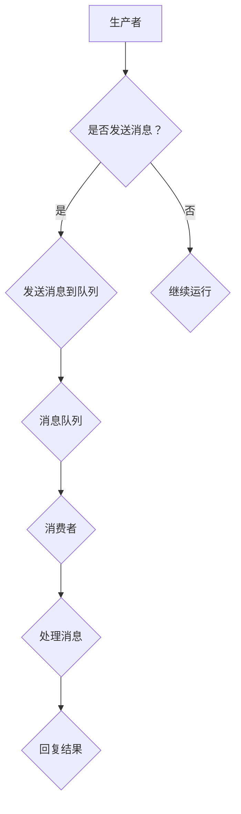

                 

关键词：消息队列、原理、代码实例、消息传递、异步处理、并发控制、分布式系统、微服务架构

> 摘要：本文将深入探讨消息队列的基本原理，通过代码实例详细解释其实现与应用。我们将从核心概念、算法原理、数学模型、项目实践以及实际应用场景等多个角度进行阐述，旨在帮助读者全面理解消息队列的技术内涵和实际应用价值。

## 1. 背景介绍

在现代软件系统架构中，消息队列（Message Queue，MQ）作为一种关键的基础设施，扮演着不可或缺的角色。随着互联网的迅猛发展和分布式系统的广泛应用，消息队列技术的需求日益增长。它能够有效地实现系统中各个模块之间的数据通信，提供异步、分布式和可靠的消息传递机制。

消息队列的起源可以追溯到1970年代，早期的消息队列系统主要基于队列服务器的思想，用于处理远程过程调用（RPC）和系统间的通信。随着计算机技术的进步，消息队列逐渐成为分布式系统、微服务架构以及高并发、高可用性应用场景中的核心组件。

本文将围绕消息队列的核心概念、实现原理、应用场景和代码实例等方面进行详细讲解，旨在为读者提供一个全面、系统的理解。

## 2. 核心概念与联系

### 2.1. 消息队列定义

消息队列是一种用于在分布式系统中传递消息的通信模型，它将生产者（消息发送方）和生产消费者（消息接收方）解耦，提供了一种异步、可靠的消息传递机制。

### 2.2. 消息队列的工作原理

消息队列的工作原理可以简化为以下步骤：

1. **生产者发送消息**：生产者将消息放入消息队列中。
2. **消息队列存储消息**：消息队列将消息存储在内部队列中，等待消费者接收。
3. **消费者消费消息**：消费者从消息队列中取出消息并处理。

### 2.3. 消息队列的架构

消息队列的架构通常包括以下几个部分：

- **生产者**：消息的生产者，负责将消息发送到消息队列。
- **消息队列**：存储和管理消息的中间件，支持高并发和可靠的消息传递。
- **消费者**：消息的消费者，从消息队列中获取消息并处理。

### 2.4. 消息队列与异步处理、并发控制的关系

- **异步处理**：消息队列通过异步方式处理消息，使得生产者和消费者可以独立运行，不需要同步等待。
- **并发控制**：消息队列通过队列机制实现并发控制，保证消息的有序传递和正确处理。

### 2.5. 消息队列在分布式系统和微服务架构中的应用

在分布式系统和微服务架构中，消息队列主要用于实现以下功能：

- **解耦**：通过消息队列实现服务之间的解耦，提高系统的可扩展性和容错性。
- **异步通信**：实现系统间的异步通信，提高系统的响应速度和处理能力。
- **流量控制**：通过消息队列进行流量控制，实现负载均衡和削峰填谷。

### 2.6. Mermaid 流程图

下面是消息队列工作流程的 Mermaid 流程图：



## 3. 核心算法原理 & 具体操作步骤

### 3.1. 算法原理概述

消息队列的核心算法原理主要包括消息的生成、存储、传递和处理等环节。以下将详细解释这些算法步骤。

### 3.2. 算法步骤详解

1. **消息生成**：生产者根据业务需求生成消息，并将消息序列化成字节流。
2. **消息存储**：将消息发送到消息队列的内部队列中进行存储，支持高并发和可靠存储。
3. **消息传递**：消息队列通过轮询或者触发机制将消息传递给消费者。
4. **消息处理**：消费者从消息队列中获取消息，并执行相应的业务处理逻辑。

### 3.3. 算法优缺点

- **优点**：
  - **解耦**：生产者和消费者之间解耦，提高系统的可扩展性和容错性。
  - **异步处理**：支持异步处理，提高系统的响应速度和处理能力。
  - **可靠性**：支持消息的可靠传递和存储，保证消息不丢失。

- **缺点**：
  - **延迟**：消息队列引入了一定的延迟，不适合实时性要求较高的场景。
  - **资源消耗**：消息队列需要一定的系统资源，可能影响其他业务性能。

### 3.4. 算法应用领域

消息队列广泛应用于以下领域：

- **分布式系统**：实现系统间的异步通信和负载均衡。
- **微服务架构**：实现服务之间的解耦和协作。
- **高并发应用**：实现流量的削峰填谷和请求的分发。

## 4. 数学模型和公式 & 详细讲解 & 举例说明

### 4.1. 数学模型构建

消息队列的数学模型可以简化为一个有限状态机，状态包括：

- **空闲状态**：队列中没有消息，等待生产者发送消息。
- **忙状态**：队列中有消息，等待消费者消费消息。

### 4.2. 公式推导过程

设消息队列的容量为 \( C \)，消息生成速率为 \( G \)，消息消费速率为 \( C \)。则消息队列的稳定状态可以表示为：

\[ C = G \times T \]

其中，\( T \) 为消息队列的平均处理时间。

### 4.3. 案例分析与讲解

假设一个消息队列系统，容量为1000条消息，消息生成速率为10条/秒，消息消费速率为5条/秒。则：

\[ T = \frac{C}{G} = \frac{1000}{10} = 100秒 \]

这意味着消息队列的平均处理时间为100秒，即每条消息在队列中的平均等待时间为100秒。

## 5. 项目实践：代码实例和详细解释说明

### 5.1. 开发环境搭建

在本节中，我们将使用 Python 语言和 RabbitMQ 消息队列中间件进行项目实践。

首先，确保已经安装了 Python 3.8 或更高版本，然后通过以下命令安装 RabbitMQ：

```bash
pip install pika
```

### 5.2. 源代码详细实现

下面是消息队列生产者和消费者的源代码实现：

**生产者代码示例：**

```python
import pika

# 创建 RabbitMQ 连接
connection = pika.BlockingConnection(pika.ConnectionParameters('localhost'))
channel = connection.channel()

# 声明队列
channel.queue_declare(queue='task_queue', durable=True)

# 生产消息
for i in range(10):
    message = f'Hello World! {i}'
    channel.basic_publish(
        exchange='',
        routing_key='task_queue',
        body=message,
        properties=pika.BasicProperties(delivery_mode=2)  # 消息持久化
    )
    print(f"[x] Sent {message}")

# 关闭连接
connection.close()
```

**消费者代码示例：**

```python
import pika

# 创建 RabbitMQ 连接
connection = pika.BlockingConnection(pika.ConnectionParameters('localhost'))
channel = connection.channel()

# 声明队列
channel.queue_declare(queue='task_queue', durable=True)

# 消费消息
def callback(ch, method, properties, body):
    print(f"[x] Received {body}")
    # 执行业务处理
    print(f"[x] Doing work {body}")
    # 睡眠模拟处理时间
    time.sleep(body.count(b'.'))
    print(f"[x] Done work {body}")

# 消费消息
channel.basic_consume(
    queue='task_queue',
    on_message_callback=callback,
    auto_ack=True
)

print("[*] Waiting for messages. To exit press CTRL+C")
channel.start_consuming()
```

### 5.3. 代码解读与分析

- **生产者代码解读**：
  - 导入 RabbitMQ 库。
  - 创建 RabbitMQ 连接和通道。
  - 声明队列并设置持久化。
  - 循环生成消息并发送到队列。

- **消费者代码解读**：
  - 导入 RabbitMQ 库。
  - 创建 RabbitMQ 连接和通道。
  - 声明队列并设置持久化。
  - 注册消息处理回调函数。
  - 启动消息消费。

### 5.4. 运行结果展示

运行生产者代码，生产10条消息，运行消费者代码，消费者将逐条消费消息并打印处理结果。

## 6. 实际应用场景

### 6.1. 分布式系统中使用消息队列

在分布式系统中，消息队列主要用于实现系统间的异步通信和解耦。例如，在一个电子商务平台中，订单处理模块和处理库存模块之间可以通过消息队列进行通信，订单模块生成订单消息后发送到消息队列，库存模块从消息队列中获取订单消息并更新库存信息。

### 6.2. 微服务架构中使用消息队列

在微服务架构中，消息队列是实现服务间通信和解耦的关键组件。例如，一个天气预报服务可以发送天气数据消息到消息队列，多个城市的服务从消息队列中获取天气数据并更新各自的天气信息。

### 6.3. 高并发应用中使用消息队列

在高并发应用中，消息队列可以实现流量的削峰填谷和请求的分发。例如，一个在线支付系统可以使用消息队列将支付请求分发到多个处理节点，实现负载均衡和容错。

### 6.4. 未来应用展望

随着云计算和大数据技术的不断发展，消息队列在分布式系统和微服务架构中的应用前景广阔。未来，消息队列将向高并发、高可用、高可靠的方向发展，支持更多复杂场景和更高效的消息处理算法。

## 7. 工具和资源推荐

### 7.1. 学习资源推荐

- 《RabbitMQ 实战》
- 《消息队列：从理论到实践》
- 《分布式系统原理与范型》

### 7.2. 开发工具推荐

- RabbitMQ：开源消息队列中间件，支持多种协议和编程语言。
- Apache Kafka：分布式消息队列系统，适用于大数据场景。
- RocketMQ：阿里巴巴开源的消息队列中间件，支持高并发和可靠消息传递。

### 7.3. 相关论文推荐

- 《Message Queuing for Mobile Applications》
- 《A Survey of Message Queuing Software Systems》
- 《Message Queuing in Distributed Systems》

## 8. 总结：未来发展趋势与挑战

### 8.1. 研究成果总结

近年来，消息队列技术在分布式系统和微服务架构中得到了广泛应用，取得了显著的研究成果。主要成果包括：

- 消息队列中间件的性能优化和可靠性提升。
- 消息队列在复杂场景中的应用和优化策略。
- 新型消息队列协议和算法的研究。

### 8.2. 未来发展趋势

未来，消息队列技术将朝着以下几个方向发展：

- 高并发、高可用、高可靠的消息队列系统。
- 面向复杂场景的新型消息队列算法和协议。
- 集成云计算和大数据技术的消息队列解决方案。

### 8.3. 面临的挑战

尽管消息队列技术已经取得了显著成果，但仍然面临以下几个挑战：

- 高并发下的性能优化和资源消耗。
- 复杂场景下的可靠性和稳定性。
- 与其他技术的融合和互操作。

### 8.4. 研究展望

未来，消息队列技术的研究将聚焦于以下几个方面：

- 深入研究新型消息队列协议和算法，提高系统性能和可靠性。
- 探索消息队列与其他技术的融合，实现更加智能化和高效的消息处理。
- 针对复杂场景进行优化和定制，提高消息队列的应用效果。

## 9. 附录：常见问题与解答

### 9.1. 问题1：什么是消息队列？

**回答**：消息队列是一种用于在分布式系统中传递消息的通信模型，通过异步、可靠的方式实现系统间数据的传递和解耦。

### 9.2. 问题2：消息队列有哪些常用协议？

**回答**：常用的消息队列协议包括 AMQP（高级消息队列协议）、MQTT（消息队列遥测传输协议）、STOMP（简单文本协议）等。

### 9.3. 问题3：消息队列如何保证消息的可靠性？

**回答**：消息队列通过多种机制保证消息的可靠性，包括消息持久化、确认机制、重试机制等。

### 9.4. 问题4：消息队列在微服务架构中有何作用？

**回答**：消息队列在微服务架构中主要用于实现服务间的异步通信、解耦和负载均衡，提高系统的可扩展性和容错性。

### 9.5. 问题5：如何选择合适的消息队列中间件？

**回答**：选择合适的消息队列中间件需要考虑以下几个因素：性能、可靠性、可用性、社区支持、兼容性等。

### 9.6. 问题6：消息队列在高并发应用中有何优势？

**回答**：消息队列在高并发应用中可以实现流量的削峰填谷、负载均衡和请求的分发，提高系统的响应速度和处理能力。

### 9.7. 问题7：消息队列与消息中间件有何区别？

**回答**：消息队列是一种通信模型，而消息中间件是实现消息队列功能的具体软件，例如 RabbitMQ、Kafka 等。

### 9.8. 问题8：如何确保消息队列的安全性？

**回答**：确保消息队列的安全可以从以下几个方面入手：访问控制、数据加密、日志审计等。

### 9.9. 问题9：消息队列在云计算中有何应用场景？

**回答**：消息队列在云计算中广泛应用于分布式存储、大数据处理、实时数据处理等场景，实现系统间数据的异步传递和解耦。

### 9.10. 问题10：消息队列的未来发展趋势是什么？

**回答**：消息队列的未来发展趋势包括高并发、高可用、高可靠的方向，以及与其他技术的融合和互操作。

### 作者署名

作者：禅与计算机程序设计艺术 / Zen and the Art of Computer Programming
```markdown
----------------------------------------------------------------


