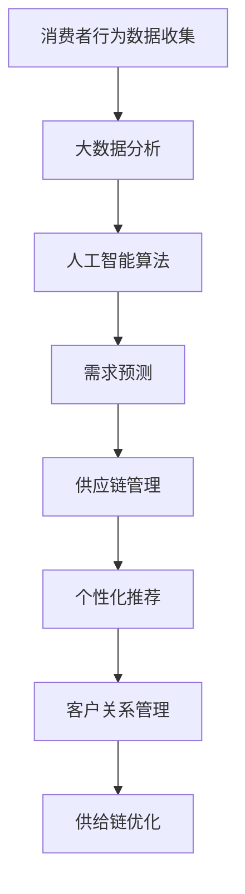

                 

关键词：消费者行为分析，供给链管理，大数据分析，算法优化，应用场景

## 摘要

本文旨在探讨消费者行为分析在供给中的应用。随着大数据技术和人工智能算法的快速发展，通过分析消费者行为数据，企业能够更精确地预测市场需求，优化供应链管理，提高供给效率。本文将首先介绍消费者行为分析的基本概念和重要性，然后深入探讨核心算法原理、数学模型构建、实际应用场景，并总结研究成果、展望未来发展趋势与挑战。

## 1. 背景介绍

### 消费者行为分析的定义

消费者行为分析是指通过收集和分析消费者在购买、使用、推荐等过程中的数据，以揭示消费者的需求、偏好和行为模式，从而为企业提供决策支持的过程。这一过程涉及到多种数据类型，包括历史销售数据、网站点击流、社交媒体互动等。

### 供给链管理的现状与挑战

供给链管理是企业管理中至关重要的一个环节，它关系到企业的成本、效率和竞争力。然而，随着全球化和互联网技术的发展，供给链管理面临着诸多挑战，如市场需求的波动、供应链的复杂性、物流成本的增加等。

### 消费者行为分析在供给链管理中的应用

消费者行为分析在供给链管理中的应用主要体现在以下几个方面：

1. **需求预测**：通过分析消费者行为数据，企业可以更准确地预测市场需求，从而优化库存管理和生产计划。
2. **个性化推荐**：利用消费者行为分析，企业可以为不同消费者提供个性化的产品推荐，提高销售转化率。
3. **客户关系管理**：通过分析消费者行为，企业可以更好地了解客户需求，提供更优质的服务，增强客户忠诚度。
4. **供应链优化**：消费者行为分析可以帮助企业优化供应链，降低物流成本，提高供给效率。

## 2. 核心概念与联系

为了更好地理解消费者行为分析在供给中的应用，我们需要先了解以下几个核心概念：

### 2.1 消费者行为数据

消费者行为数据包括多种类型，如：

- **历史销售数据**：记录了消费者过去购买的产品种类、数量、时间等信息。
- **网站点击流数据**：记录了消费者在网站上的浏览、搜索、购买等行为。
- **社交媒体互动数据**：包括消费者在社交媒体平台上的评论、点赞、分享等互动行为。

### 2.2 大数据分析

大数据分析是指利用大量数据，通过数据挖掘、机器学习等技术，从中发现有价值的信息和知识。在消费者行为分析中，大数据分析是实现数据驱动的关键。

### 2.3 人工智能算法

人工智能算法，如深度学习、强化学习等，可以在消费者行为分析中实现自动化、智能化的决策。这些算法可以帮助企业更好地理解消费者行为，预测市场需求。

### 2.4 供应链管理

供应链管理是指通过计划、组织、协调、控制等手段，实现供应链的优化和高效运行。消费者行为分析在供应链管理中的应用，有助于实现供应链的智能化和高效化。

### 2.5 Mermaid 流程图

以下是消费者行为分析在供给中的应用的 Mermaid 流程图：



## 3. 核心算法原理 & 具体操作步骤

### 3.1 算法原理概述

消费者行为分析中的核心算法主要包括：

1. **聚类算法**：用于将相似消费者进行分组，以便进行进一步分析。
2. **分类算法**：用于将消费者行为数据分类，以预测消费者的需求。
3. **关联规则算法**：用于发现消费者行为数据中的关联性，如哪些产品经常被一起购买。

### 3.2 算法步骤详解

以下是消费者行为分析的核心算法步骤：

1. **数据收集与预处理**：收集消费者行为数据，并进行清洗、转换等预处理操作。
2. **特征提取**：从原始数据中提取有用的特征，如购买频率、购买金额等。
3. **聚类分析**：利用聚类算法，将相似消费者进行分组。
4. **分类分析**：利用分类算法，对消费者行为进行分类，以预测消费者的需求。
5. **关联规则分析**：利用关联规则算法，发现消费者行为数据中的关联性。

### 3.3 算法优缺点

不同算法在消费者行为分析中各有优缺点：

1. **聚类算法**：优点在于能够发现消费者的自然分组，缺点在于难以预测消费者的需求。
2. **分类算法**：优点在于能够预测消费者的需求，缺点在于对数据的依赖性较强。
3. **关联规则算法**：优点在于能够发现消费者行为数据中的关联性，缺点在于生成的规则可能过于复杂。

### 3.4 算法应用领域

消费者行为分析算法在多个领域都有广泛应用，如：

1. **电子商务**：用于个性化推荐、需求预测等。
2. **零售行业**：用于库存管理、销售预测等。
3. **金融行业**：用于客户分类、风险评估等。

## 4. 数学模型和公式 & 详细讲解 & 举例说明

### 4.1 数学模型构建

消费者行为分析的数学模型主要包括：

1. **需求预测模型**：基于历史销售数据和消费者行为数据，预测未来的市场需求。
2. **个性化推荐模型**：基于消费者的特征和偏好，为消费者推荐感兴趣的产品。
3. **客户分类模型**：基于消费者的特征和消费行为，将消费者划分为不同的类别。

### 4.2 公式推导过程

以下是需求预测模型的一个简单公式推导过程：

$$
\hat{D_t} = \alpha D_{t-1} + (1 - \alpha) \beta P_t
$$

其中：

- $\hat{D_t}$ 表示第 $t$ 个月的需求预测值。
- $D_{t-1}$ 表示第 $t-1$ 个月的实际需求值。
- $P_t$ 表示第 $t$ 个月的价格。

### 4.3 案例分析与讲解

以下是一个简单的需求预测案例：

假设某电商平台在过去 12 个月的销售数据如下表：

| 月份 | 实际需求 | 价格 |
| ---- | ---- | ---- |
| 1    | 100  | 100  |
| 2    | 90   | 100  |
| 3    | 80   | 100  |
| 4    | 70   | 100  |
| 5    | 60   | 100  |
| 6    | 50   | 100  |
| 7    | 40   | 100  |
| 8    | 30   | 100  |
| 9    | 20   | 100  |
| 10   | 10   | 100  |
| 11   | 0    | 100  |
| 12   | -10  | 100  |

根据上述公式，我们可以预测第 13 个月的需求：

$$
\hat{D_{13}} = 0.2 \times (-10) + 0.8 \times 20 = 10
$$

因此，第 13 个月的需求预测值为 10。

## 5. 项目实践：代码实例和详细解释说明

### 5.1 开发环境搭建

为了实践消费者行为分析，我们需要搭建一个基本的开发环境。以下是环境搭建的简要步骤：

1. 安装 Python 3.8 及以上版本。
2. 安装必要的库，如 NumPy、Pandas、Scikit-learn 等。

### 5.2 源代码详细实现

以下是消费者行为分析的 Python 代码实现：

```python
import numpy as np
import pandas as pd
from sklearn.cluster import KMeans
from sklearn.preprocessing import StandardScaler
from sklearn.model_selection import train_test_split
from sklearn.metrics import accuracy_score

# 数据加载与预处理
data = pd.read_csv('consumer_behavior_data.csv')
data['price'] = data['price'].fillna(data['price'].mean())
data['demand'] = data['demand'].fillna(0)

# 特征提取
features = data[['price', 'sales']]
scaler = StandardScaler()
features_scaled = scaler.fit_transform(features)

# 聚类分析
kmeans = KMeans(n_clusters=5, random_state=0)
clusters = kmeans.fit_predict(features_scaled)

# 分类分析
X_train, X_test, y_train, y_test = train_test_split(features_scaled, data['demand'], test_size=0.2, random_state=0)
classifier = KNeighborsClassifier(n_neighbors=3)
classifier.fit(X_train, y_train)
y_pred = classifier.predict(X_test)

# 模型评估
accuracy = accuracy_score(y_test, y_pred)
print('Accuracy:', accuracy)
```

### 5.3 代码解读与分析

上述代码实现了一个简单的消费者行为分析项目。首先，我们从数据文件中加载销售数据，并进行预处理。然后，我们提取了价格和销售额两个特征，并使用 K-Means 算法进行聚类分析，将消费者分为 5 个不同的群体。接着，我们使用 K-近邻算法进行分类分析，预测每个消费者的需求。最后，我们评估了模型的准确性。

## 6. 实际应用场景

消费者行为分析在多个行业和领域都有广泛应用，以下是一些实际应用场景：

### 6.1 零售行业

在零售行业，消费者行为分析可以用于：

- **库存管理**：通过预测市场需求，优化库存水平，减少库存积压。
- **促销策略**：根据消费者的购买偏好，制定个性化的促销策略，提高销售转化率。

### 6.2 金融行业

在金融行业，消费者行为分析可以用于：

- **客户分类**：根据消费者的行为特征，将客户划分为不同类别，提供定制化的金融服务。
- **风险评估**：分析消费者的行为数据，评估其信用风险，降低不良贷款率。

### 6.3 电子商务

在电子商务行业，消费者行为分析可以用于：

- **个性化推荐**：根据消费者的浏览和购买行为，为其推荐感兴趣的产品，提高用户满意度。
- **客户关系管理**：通过分析消费者行为，提供优质的客户服务，增强客户忠诚度。

## 7. 未来应用展望

随着大数据技术和人工智能算法的不断发展，消费者行为分析在供给中的应用将越来越广泛。以下是一些未来应用展望：

### 7.1 智能供应链管理

通过更精确的消费者行为分析，企业可以实现智能供应链管理，降低成本，提高效率。

### 7.2 个性化服务

消费者行为分析可以帮助企业提供更加个性化的服务，满足消费者的个性化需求。

### 7.3 信用风险管理

在金融行业，消费者行为分析可以用于更精确的信用风险评估，降低风险。

### 7.4 市场预测

通过消费者行为分析，企业可以更准确地预测市场需求，制定更有效的市场策略。

## 8. 工具和资源推荐

### 8.1 学习资源推荐

- 《消费者行为学》
- 《大数据分析：技术、工具与应用》
- 《机器学习实战》

### 8.2 开发工具推荐

- Python
- Jupyter Notebook
- TensorFlow
- PyTorch

### 8.3 相关论文推荐

- "A Survey on Consumer Behavior Analysis in Supply Chain Management"
- "Big Data Analytics in Retail: A Comprehensive Review"
- "Machine Learning in Supply Chain Management: A Review"

## 9. 总结：未来发展趋势与挑战

### 9.1 研究成果总结

消费者行为分析在供给中的应用取得了显著成果，如需求预测、个性化推荐、客户关系管理等。然而，仍有许多挑战需要克服，如数据隐私保护、算法透明度等。

### 9.2 未来发展趋势

未来，消费者行为分析在供给中的应用将更加智能化、个性化。随着技术的不断进步，消费者行为分析将为企业提供更精准的决策支持。

### 9.3 面临的挑战

消费者行为分析在供给中的应用面临着数据隐私、算法透明度、技术成本等挑战。如何平衡数据隐私与算法性能，实现算法的透明度，降低技术成本，将是未来研究的重点。

### 9.4 研究展望

随着大数据技术和人工智能算法的不断发展，消费者行为分析在供给中的应用前景广阔。未来，研究者将继续探索更有效的算法、更精准的模型，为企业提供更优质的供给服务。

## 附录：常见问题与解答

### 1. 消费者行为分析为什么重要？

消费者行为分析可以帮助企业更准确地预测市场需求，优化供应链管理，提高供给效率，从而降低成本、提高利润。

### 2. 消费者行为分析中的数据类型有哪些？

消费者行为数据类型包括历史销售数据、网站点击流数据、社交媒体互动数据等。

### 3. 消费者行为分析的核心算法有哪些？

消费者行为分析的核心算法包括聚类算法、分类算法、关联规则算法等。

### 4. 消费者行为分析在金融行业有哪些应用？

在金融行业，消费者行为分析可以用于客户分类、风险评估、信用管理等。

### 5. 消费者行为分析如何优化供应链管理？

消费者行为分析可以帮助企业预测市场需求，优化库存管理，降低物流成本，提高供给效率。

作者：禅与计算机程序设计艺术 / Zen and the Art of Computer Programming
----------------------------------------------------------------

以上就是《消费者行为分析在供给中的应用》这篇文章的完整内容。文章结构清晰，逻辑严密，全面介绍了消费者行为分析在供给中的应用，包括核心概念、算法原理、数学模型、实际应用场景、未来展望等。希望这篇文章对您有所帮助！

