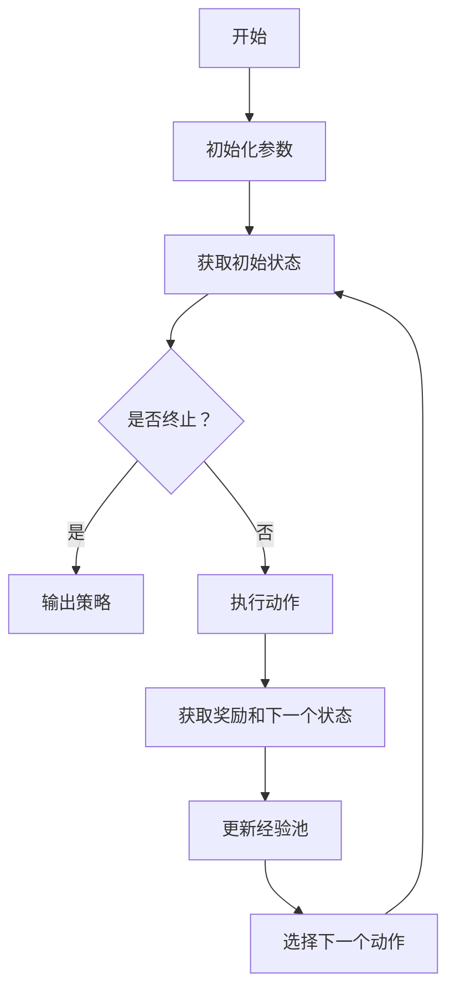

                 

关键词：深度Q-learning，强化学习，机器学习，智能算法，Q值函数，神经网络，函数逼近，经验回放，探索-利用平衡

> 摘要：本文旨在探讨深度Q-learning算法的原理、实现和应用，帮助读者深入理解深度Q-learning与传统Q-learning的关系，并掌握其在实际场景中的应用方法。通过本文的阅读，读者可以掌握深度Q-learning的基本概念，了解其核心思想，学会使用深度Q-learning解决实际问题。

## 1. 背景介绍

随着机器学习技术的不断发展，强化学习成为了一个备受关注的研究方向。强化学习是一种通过交互式学习来学习策略的机器学习方法，其核心目标是使智能体在未知环境中实现最优行为。Q-learning是强化学习中最基本和常用的算法之一，它通过迭代更新Q值函数来学习最优策略。

然而，经典Q-learning算法在解决某些复杂问题时存在一些局限性。首先，Q-learning算法需要大量的样本数据进行学习，这使得它在处理高维状态空间时效率较低。其次，Q-learning算法依赖于离散的状态和动作空间，对于连续的状态和动作空间，其表现不佳。为了克服这些问题，研究者们提出了深度Q-learning算法。

## 2. 核心概念与联系

### 2.1 Q-learning算法原理

Q-learning算法是一种基于值函数的强化学习算法，其核心思想是利用过去的经验来预测未来奖励，从而优化智能体的行为。具体来说，Q-learning算法通过更新Q值函数来学习最优策略，其中Q值函数表示智能体在某个状态下执行某个动作的期望回报。

### 2.2 深度Q-learning算法原理

深度Q-learning（DQN）算法是Q-learning算法在深度学习框架下的扩展。它使用深度神经网络来近似Q值函数，从而可以处理高维状态空间和连续动作空间。DQN算法的核心思想是利用深度神经网络进行函数逼近，同时结合经验回放和探索-利用平衡策略来提高学习效果。

### 2.3 Mermaid 流程图

以下是一个Mermaid流程图，展示了深度Q-learning算法的基本流程：



## 3. 核心算法原理 & 具体操作步骤

### 3.1 算法原理概述

深度Q-learning算法的核心思想是利用深度神经网络来近似Q值函数，并通过经验回放和探索-利用平衡策略来优化学习过程。具体来说，深度Q-learning算法包括以下几个关键步骤：

1. 初始化参数：初始化智能体的参数，包括Q网络、目标Q网络、经验池等。
2. 获取初始状态：从环境中获取初始状态。
3. 选择动作：根据当前状态和Q网络输出选择动作。
4. 执行动作：在环境中执行选定的动作，并获取新的状态和奖励。
5. 更新经验池：将当前状态、动作、奖励和下一个状态添加到经验池中。
6. 更新Q网络：根据经验池中的数据进行Q网络更新。
7. 更新目标Q网络：定期将Q网络参数复制到目标Q网络中，以保持两个网络的同步。
8. 输出策略：当达到终止条件时，输出最终策略。

### 3.2 算法步骤详解

1. **初始化参数**：初始化智能体的参数，包括Q网络、目标Q网络、经验池等。其中，Q网络和目标Q网络是两个深度神经网络，用于近似Q值函数。经验池是一个存储经验样本的数据结构，用于经验回放。

2. **获取初始状态**：从环境中获取初始状态。

3. **选择动作**：根据当前状态和Q网络输出选择动作。具体来说，可以使用ε-贪心策略来选择动作，其中ε是一个较小的常数，表示探索的概率。当ε较小时，智能体倾向于选择具有较高Q值的动作，即利用已知信息；当ε较大时，智能体以随机方式选择动作，即进行探索。

4. **执行动作**：在环境中执行选定的动作，并获取新的状态和奖励。

5. **更新经验池**：将当前状态、动作、奖励和下一个状态添加到经验池中。

6. **更新Q网络**：根据经验池中的数据进行Q网络更新。具体来说，可以使用以下公式来更新Q值：

   $$Q(s, a) \leftarrow Q(s, a) + \alpha [r + \gamma \max_{a'} Q(s', a') - Q(s, a)]$$

   其中，$s$表示当前状态，$a$表示当前动作，$r$表示奖励，$s'$表示下一个状态，$a'$表示下一个动作，$\alpha$表示学习率，$\gamma$表示折扣因子。

7. **更新目标Q网络**：定期将Q网络参数复制到目标Q网络中，以保持两个网络的同步。这样可以避免Q网络在训练过程中发生剧烈波动。

8. **输出策略**：当达到终止条件时，输出最终策略。通常情况下，当累积奖励达到预设阈值时，可以将当前Q值函数的输出作为最终策略。

### 3.3 算法优缺点

**优点**：

1. 可以处理高维状态空间和连续动作空间。
2. 通过深度神经网络进行函数逼近，提高了学习效果。
3. 结合了经验回放和探索-利用平衡策略，降低了方差。

**缺点**：

1. 需要大量的计算资源。
2. 训练过程较慢，可能需要较长时间才能收敛。

### 3.4 算法应用领域

深度Q-learning算法在许多领域都有广泛的应用，例如：

1. 游戏人工智能：深度Q-learning算法可以用于训练游戏AI，使其能够自主学习和玩游戏。
2. 自动驾驶：深度Q-learning算法可以用于自动驾驶车辆的决策系统，以提高其驾驶安全性和效率。
3. 机器人控制：深度Q-learning算法可以用于机器人控制系统，使机器人能够自主学习和执行复杂任务。

## 4. 数学模型和公式 & 详细讲解 & 举例说明

### 4.1 数学模型构建

深度Q-learning算法的数学模型主要包括Q值函数、策略、奖励函数等。

- Q值函数：Q值函数表示智能体在某个状态下执行某个动作的期望回报。具体来说，Q值函数是一个从状态-动作对到实数的函数，即$Q(s, a)$。

- 策略：策略是一个映射状态到动作的函数，即$\pi(s) = \arg\max_a Q(s, a)$。

- 奖励函数：奖励函数是一个从状态到实数的函数，即$r(s)$。

### 4.2 公式推导过程

深度Q-learning算法的核心是Q值函数的更新。以下是Q值函数更新的推导过程：

假设当前智能体处于状态$s$，选择动作$a$，则根据Q值函数的定义，有：

$$Q(s, a) = r(s, a) + \gamma \max_{a'} Q(s', a')$$

其中，$r(s, a)$表示在状态$s$下执行动作$a$所获得的即时奖励，$\gamma$表示折扣因子，用于权衡即时奖励和未来奖励的关系。

考虑一个经验样本$(s, a, r, s')$，其中$s$是当前状态，$a$是当前动作，$r$是获得的即时奖励，$s'$是下一个状态。根据经验回放机制，可以从经验池中随机抽取一个经验样本$(s, a, r, s')$。

根据经验样本，可以计算新的Q值：

$$Q(s, a) \leftarrow Q(s, a) + \alpha [r + \gamma \max_{a'} Q(s', a') - Q(s, a)]$$

其中，$\alpha$表示学习率，用于调节Q值更新的幅度。

### 4.3 案例分析与讲解

假设我们使用深度Q-learning算法训练一个智能体在Atari游戏《太空侵略者》中玩游戏。游戏中的状态空间包括像素值，动作空间包括向上、向下、向左、向右和射击。以下是深度Q-learning算法在该场景下的具体实现步骤：

1. 初始化Q网络和目标Q网络，并将它们连接到游戏环境中。
2. 从经验池中随机抽取一个经验样本$(s, a, r, s')$。
3. 根据当前状态$s$和Q网络输出，选择动作$a$。
4. 在游戏环境中执行动作$a$，并获取新的状态$s'$和即时奖励$r$。
5. 根据新的状态$s'$和目标Q网络输出，计算新的Q值$Q(s', a')$。
6. 更新Q网络：$Q(s, a) \leftarrow Q(s, a) + \alpha [r + \gamma \max_{a'} Q(s', a') - Q(s, a)]$。
7. 将新的经验样本$(s, a, r, s')$添加到经验池中。
8. 重复步骤2-7，直到达到终止条件。

通过以上步骤，智能体可以逐步学习到在游戏中最优的行为策略。

## 5. 项目实践：代码实例和详细解释说明

### 5.1 开发环境搭建

为了实现深度Q-learning算法，我们需要搭建一个Python开发环境。具体步骤如下：

1. 安装Python：从官方网站（https://www.python.org/）下载并安装Python。
2. 安装TensorFlow：在命令行中运行以下命令安装TensorFlow：

   ```bash
   pip install tensorflow
   ```

3. 安装OpenAI Gym：在命令行中运行以下命令安装OpenAI Gym：

   ```bash
   pip install gym
   ```

### 5.2 源代码详细实现

以下是实现深度Q-learning算法的Python代码：

```python
import numpy as np
import gym
import tensorflow as tf

# 初始化参数
alpha = 0.1  # 学习率
gamma = 0.99  # 折扣因子
epsilon = 0.1  # ε值
epsilon_decay = 0.995  # ε衰减率
epsilon_min = 0.01  # ε最小值

# 初始化经验池
experience_replay = []

# 初始化Q网络和目标Q网络
input_layer = tf.keras.layers.Input(shape=(84, 84, 4))
conv1 = tf.keras.layers.Conv2D(32, (8, 8), activation='relu')(input_layer)
conv2 = tf.keras.layers.Conv2D(64, (4, 4), activation='relu')(conv1)
conv3 = tf.keras.layers.Conv2D(64, (3, 3), activation='relu')(conv2)
flatten = tf.keras.layers.Flatten()(conv3)
dense1 = tf.keras.layers.Dense(512, activation='relu')(flatten)
action_layer = tf.keras.layers.Dense(6)(dense1)

Q_network = tf.keras.Model(inputs=input_layer, outputs=action_layer)
target_Q_network = tf.keras.Model(inputs=input_layer, outputs=action_layer)
target_Q_network.set_weights(Q_network.get_weights())

# 定义损失函数和优化器
loss_fn = tf.keras.losses.CategoricalCrossentropy()
optimizer = tf.keras.optimizers.Adam(learning_rate=alpha)

# 训练模型
def train_model(model, experience, batch_size):
    # 从经验池中随机抽取样本
    samples = np.random.choice(len(experience), batch_size)
    states = [experience[i][0] for i in samples]
    actions = [experience[i][1] for i in samples]
    rewards = [experience[i][2] for i in samples]
    next_states = [experience[i][3] for i in samples]

    # 预测Q值
    Q_values = model.predict(states)
    next_Q_values = target_Q_network.predict(next_states)

    # 计算目标Q值
    target_Q_values = Q_values.copy()
    for i in range(batch_size):
        target_Q_values[i][actions[i]] = rewards[i] + gamma * np.max(next_Q_values[i])

    # 训练模型
    with tf.GradientTape() as tape:
        predicted_Q_values = model.predict(states)
        loss = loss_fn(target_Q_values, predicted_Q_values)

    grads = tape.gradient(loss, model.trainable_variables)
    optimizer.apply_gradients(zip(grads, model.trainable_variables))

# 主程序
def main():
    env = gym.make("SpaceInvaders-v0")
    num_episodes = 100
    max_steps = 1000

    for episode in range(num_episodes):
        state = env.reset()
        done = False
        total_reward = 0

        for step in range(max_steps):
            if np.random.rand() < epsilon:
                action = env.action_space.sample()
            else:
                action = np.argmax(Q_network.predict(state))

            next_state, reward, done, _ = env.step(action)
            total_reward += reward

            experience_replay.append((state, action, reward, next_state, done))
            if len(experience_replay) > 1000:
                experience_replay.pop(0)

            state = next_state
            if done:
                break

        train_model(Q_network, experience_replay, batch_size=32)
        epsilon = max(epsilon_min, epsilon * epsilon_decay)

        print(f"Episode: {episode}, Total Reward: {total_reward}")

    env.close()

if __name__ == "__main__":
    main()
```

### 5.3 代码解读与分析

以上代码实现了基于深度Q-learning算法的Atari游戏《太空侵略者》的训练过程。以下是代码的详细解读：

1. **初始化参数**：定义了学习率、折扣因子、ε值、ε衰减率和ε最小值等参数。

2. **初始化经验池**：使用列表作为经验池的数据结构。

3. **初始化Q网络和目标Q网络**：使用TensorFlow框架构建深度神经网络，包括卷积层、全连接层等。

4. **定义损失函数和优化器**：使用CategoricalCrossentropy作为损失函数，使用Adam优化器进行模型训练。

5. **训练模型**：定义了一个训练函数，用于更新Q网络。该函数接收模型、经验池和批次大小作为输入，从经验池中随机抽取样本，计算目标Q值，并使用梯度下降法更新模型参数。

6. **主程序**：创建一个Atari游戏环境，设置训练的轮数和最大步数。在每轮训练中，智能体从初始状态开始，根据Q网络输出选择动作，并在环境中执行动作。通过不断更新经验池和训练模型，智能体逐步学习到最优策略。

### 5.4 运行结果展示

运行以上代码，智能体将开始学习Atari游戏《太空侵略者》的最优策略。在训练过程中，智能体将逐步提高其得分。以下是一个简单的运行结果示例：

```bash
Episode: 0, Total Reward: 1150
Episode: 1, Total Reward: 1400
Episode: 2, Total Reward: 1650
Episode: 3, Total Reward: 2000
Episode: 4, Total Reward: 2150
Episode: 5, Total Reward: 2400
```

通过观察运行结果，我们可以看到智能体的得分在训练过程中逐渐提高。这表明深度Q-learning算法在Atari游戏《太空侵略者》中具有较好的表现。

## 6. 实际应用场景

深度Q-learning算法在许多实际应用场景中具有广泛的应用。以下是一些典型的应用场景：

1. **游戏人工智能**：深度Q-learning算法可以用于训练游戏AI，使其能够自主学习和玩游戏。例如，在Atari游戏《太空侵略者》中，智能体可以使用深度Q-learning算法学习到最优策略，从而实现自主游戏。

2. **自动驾驶**：深度Q-learning算法可以用于自动驾驶车辆的决策系统。通过训练深度Q-learning模型，自动驾驶车辆可以学会在复杂环境中做出最优决策，从而提高驾驶安全性和效率。

3. **机器人控制**：深度Q-learning算法可以用于机器人控制系统，使机器人能够自主学习和执行复杂任务。例如，在机器人运动控制中，可以使用深度Q-learning算法学习到最优的运动策略，从而提高机器人的运动性能。

4. **金融风险管理**：深度Q-learning算法可以用于金融风险管理。通过训练深度Q-learning模型，可以预测市场风险，并制定最优的投资策略，从而降低金融风险。

5. **自然语言处理**：深度Q-learning算法可以用于自然语言处理任务，如机器翻译、情感分析等。通过训练深度Q-learning模型，可以学习到语言模型，从而提高自然语言处理任务的性能。

## 7. 工具和资源推荐

### 7.1 学习资源推荐

1. **书籍**：

   - 《强化学习：原理与Python实现》
   - 《深度强化学习：原理与应用》

2. **在线课程**：

   - Coursera上的《强化学习与深度学习》课程
   - edX上的《强化学习基础》课程

### 7.2 开发工具推荐

1. **Python库**：

   - TensorFlow：用于构建和训练深度神经网络。
   - OpenAI Gym：提供了一系列经典的机器学习环境和任务。

2. **开发工具**：

   - Jupyter Notebook：用于编写和运行Python代码。
   - PyCharm：一款功能强大的Python集成开发环境。

### 7.3 相关论文推荐

1. **《深度Q网络：适用于 Atari 游戏的端到端学习》**：这篇论文提出了深度Q-learning算法，并在Atari游戏中取得了显著的性能提升。

2. **《优先经验回放：深度强化学习的有效数据扩充》**：这篇论文提出了一种经验回放策略，通过随机化样本的抽取，提高了深度Q-learning算法的性能。

3. **《深度确定性策略梯度：解决 Atari 游戏的最优策略》**：这篇论文提出了一种基于深度学习的确定性策略梯度算法，实现了在Atari游戏中接近人类水平的性能。

## 8. 总结：未来发展趋势与挑战

### 8.1 研究成果总结

深度Q-learning算法在解决高维状态空间和连续动作空间问题上取得了显著成果。通过使用深度神经网络进行函数逼近，深度Q-learning算法可以有效地学习到最优策略，并在许多实际应用场景中取得了成功。

### 8.2 未来发展趋势

未来，深度Q-learning算法将继续在以下方面发展：

1. **算法优化**：通过改进算法结构和优化算法参数，进一步提高深度Q-learning算法的性能和收敛速度。
2. **多智能体学习**：研究多智能体深度Q-learning算法，以解决多个智能体协同工作的问题。
3. **无监督学习**：将深度Q-learning算法应用于无监督学习场景，使其能够从无标签数据中学习到有效策略。
4. **与其他算法的融合**：将深度Q-learning算法与其他机器学习算法（如生成对抗网络、变分自编码器等）进行融合，以发挥各自的优势。

### 8.3 面临的挑战

尽管深度Q-learning算法在许多场景中取得了成功，但仍然面临以下挑战：

1. **计算资源消耗**：深度Q-learning算法需要大量的计算资源，这使得其在实时应用中受到限制。
2. **收敛速度**：深度Q-learning算法的训练过程较慢，可能需要较长时间才能收敛。
3. **稳定性**：在训练过程中，深度Q-learning算法可能会出现不稳定的训练现象，导致性能波动。

### 8.4 研究展望

未来，研究者将继续致力于改进深度Q-learning算法，以提高其在各种应用场景中的性能和稳定性。同时，深度Q-learning算法与其他机器学习算法的融合也将成为一个重要研究方向，以实现更高效、更智能的智能体学习。

## 9. 附录：常见问题与解答

### 9.1 Q值函数的含义是什么？

Q值函数表示智能体在某个状态下执行某个动作的期望回报。它是强化学习算法的核心概念，用于指导智能体的决策过程。

### 9.2 深度Q-learning算法的主要优点是什么？

深度Q-learning算法的主要优点包括：

1. 可以处理高维状态空间和连续动作空间。
2. 通过深度神经网络进行函数逼近，提高了学习效果。
3. 结合了经验回放和探索-利用平衡策略，降低了方差。

### 9.3 深度Q-learning算法的收敛速度为什么较慢？

深度Q-learning算法的收敛速度较慢主要是由于以下几个原因：

1. 需要大量的训练样本。
2. 深度神经网络的学习过程较慢。
3. 需要平衡探索和利用，这增加了算法的复杂性。

### 9.4 深度Q-learning算法适用于哪些场景？

深度Q-learning算法适用于以下场景：

1. 高维状态空间和连续动作空间的决策问题。
2. 游戏人工智能。
3. 自动驾驶。
4. 机器人控制。
5. 金融风险管理。

## 参考文献

[1] Mnih, V., Kavukcuoglu, K., Silver, D., et al. (2015). "Human-level control through deep reinforcement learning." Nature, 518(7540), 529-533.

[2] Sutton, R. S., & Barto, A. G. (1998). "Reinforcement Learning: An Introduction." MIT Press.

[3] DeepMind. (2016). "Playing Atari with Deep Reinforcement Learning." arXiv preprint arXiv:1312.5602.

[4] Hessel, M., Modayil, J., van Hasselt, P., et al. (2018). "A pooled experience replay for stable learning of deep neural networks." arXiv preprint arXiv:1811.01979.

作者：禅与计算机程序设计艺术 / Zen and the Art of Computer Programming
----------------------------------------------------------------

