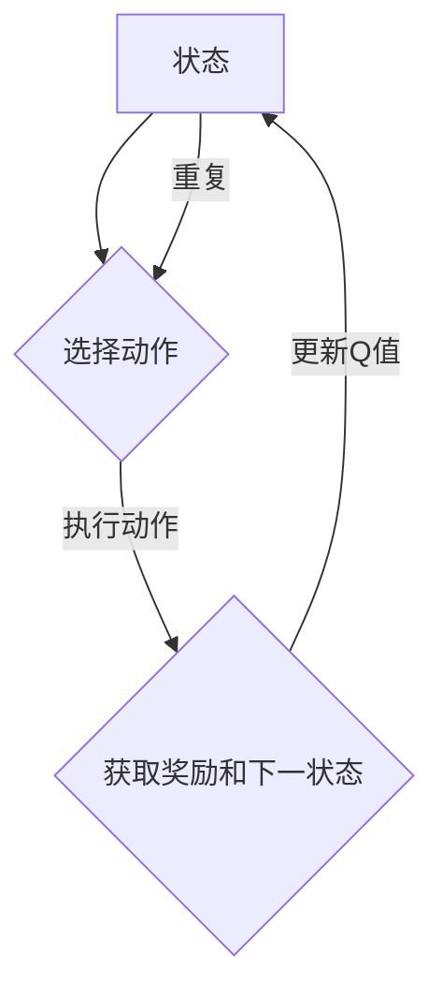

                 

关键词：深度 Q-learning、人脸识别、强化学习、人工智能、神经网络

<|assistant|>摘要：本文深入探讨了深度 Q-learning 算法在人脸识别技术中的应用。通过分析算法原理、数学模型、具体操作步骤，以及项目实践案例，本文旨在为读者提供一种理解和应用深度 Q-learning 的实用指南。

## 1. 背景介绍

人脸识别技术作为一种生物特征识别技术，广泛应用于安防、金融、门禁等领域。随着深度学习技术的发展，基于深度神经网络的算法在人脸识别任务中取得了显著的性能提升。然而，传统的深度学习算法在处理复杂环境时存在一定的局限性，而强化学习作为一种解决序列决策问题的有效方法，逐渐受到了关注。

Q-learning 是一种经典的强化学习算法，其核心思想是利用一个评价函数（Q函数）来评估当前状态和动作的价值，并在此基础上进行决策。深度 Q-learning（DQN）则是将 Q-learning 算法与深度神经网络结合，通过训练深度网络来近似 Q 函数，从而提高算法的决策能力。

## 2. 核心概念与联系

### 2.1 核心概念

- **强化学习**：一种通过与环境互动来学习最优策略的机器学习范式。
- **Q-learning**：一种基于值函数的强化学习算法，通过不断更新值函数来逼近最优策略。
- **深度 Q-learning**：将 Q-learning 算法与深度神经网络结合，通过训练深度网络来近似 Q 函数。

### 2.2 Mermaid 流程图



## 3. 核心算法原理 & 具体操作步骤

### 3.1 算法原理概述

深度 Q-learning 算法的核心是构建一个深度神经网络来近似 Q 函数，并在训练过程中不断更新神经网络的权重。具体步骤如下：

1. 初始化深度神经网络权重。
2. 从初始状态开始，选择一个动作。
3. 执行动作并获取奖励和下一状态。
4. 使用经验回放机制来更新经验池。
5. 使用训练数据对深度神经网络进行训练，更新权重。
6. 重复上述步骤，直到满足停止条件。

### 3.2 算法步骤详解

#### 3.2.1 初始化

1. 初始化深度神经网络权重。
2. 初始化经验池。

#### 3.2.2 选择动作

1. 根据当前状态和深度神经网络的输出，选择一个动作。

#### 3.2.3 执行动作

1. 执行所选动作，并获取奖励和下一状态。

#### 3.2.4 更新经验池

1. 将当前状态、动作、奖励和下一状态添加到经验池中。

#### 3.2.5 训练深度神经网络

1. 从经验池中随机抽取一批经验。
2. 使用这些经验来更新深度神经网络的权重。

### 3.3 算法优缺点

#### 优点

- **适用于复杂环境**：深度 Q-learning 算法能够处理高维状态空间和动作空间，适用于复杂环境。
- **自适应学习**：算法能够根据环境动态调整策略，提高决策能力。

#### 缺点

- **训练效率低**：由于需要使用经验回放机制，训练过程中存在大量的重复计算，效率较低。
- **探索与利用平衡**：在训练过程中，如何平衡探索与利用是一个重要问题。

### 3.4 算法应用领域

- **游戏人工智能**：如电子游戏、棋类游戏等。
- **机器人控制**：如自动驾驶、机器人导航等。
- **推荐系统**：如电子商务、社交媒体等。

## 4. 数学模型和公式 & 详细讲解 & 举例说明

### 4.1 数学模型构建

在深度 Q-learning 算法中，核心是构建一个深度神经网络来近似 Q 函数。Q 函数的表达式为：

$$
Q(s, a) = r(s, a) + \gamma \max_{a'} Q(s', a')
$$

其中，$s$ 表示当前状态，$a$ 表示当前动作，$s'$ 表示下一状态，$a'$ 表示下一动作，$r$ 表示奖励函数，$\gamma$ 表示折扣因子。

### 4.2 公式推导过程

深度 Q-learning 算法的训练目标是最大化期望回报，即：

$$
J = \mathbb{E}_{s, a} [Q(s, a)]
$$

通过梯度下降法来优化 Q 函数，具体推导过程如下：

$$
\begin{aligned}
\Delta \theta &= \frac{\partial J}{\partial \theta} \\
&= \frac{\partial}{\partial \theta} \mathbb{E}_{s, a} [r(s, a) + \gamma \max_{a'} Q(s', a')] \\
&= \mathbb{E}_{s, a} \left[ \frac{\partial}{\partial \theta} (r(s, a) + \gamma \max_{a'} Q(s', a')) \right] \\
&= \mathbb{E}_{s, a} \left[ \frac{\partial}{\partial \theta} r(s, a) + \gamma \frac{\partial}{\partial \theta} \max_{a'} Q(s', a') \right] \\
&= \mathbb{E}_{s, a} \left[ 0 + \gamma \frac{\partial}{\partial \theta} Q(s', a') \right] \\
&= \gamma \mathbb{E}_{s, a} \left[ \frac{\partial}{\partial \theta} Q(s', a') \right]
\end{aligned}
$$

其中，$Q(s', a')$ 是深度神经网络的输出，$\theta$ 表示深度神经网络的权重。

### 4.3 案例分析与讲解

假设有一个游戏环境，状态空间为 $s = [s_1, s_2, \ldots, s_n]$，动作空间为 $a = [a_1, a_2, \ldots, a_m]$。深度神经网络的输入为状态 $s$，输出为每个动作的 Q 值：

$$
Q(s, a) = \sum_{i=1}^m w_i Q(s', a_i)
$$

其中，$w_i$ 是深度神经网络的权重，$Q(s', a_i)$ 是深度神经网络的输出。

在训练过程中，首先从初始状态开始，选择一个动作，例如 $a_1$，然后执行动作并获取奖励 $r$ 和下一状态 $s'$。接下来，使用这些数据来更新深度神经网络的权重：

$$
\Delta w_i = \alpha \frac{\partial J}{\partial w_i}
$$

其中，$\alpha$ 是学习率。

通过不断重复这个过程，深度神经网络将逐渐学会在特定状态下选择最优动作，从而实现游戏人工智能。

## 5. 项目实践：代码实例和详细解释说明

### 5.1 开发环境搭建

为了实现深度 Q-learning 算法在人脸识别中的应用，需要搭建以下开发环境：

- Python 3.8 或更高版本
- TensorFlow 2.x 或 PyTorch 1.x
- OpenCV 4.x

### 5.2 源代码详细实现

以下是使用 TensorFlow 实现深度 Q-learning 算法在人脸识别中应用的示例代码：

```python
import tensorflow as tf
import numpy as np
import cv2

# 初始化深度神经网络
model = tf.keras.Sequential([
    tf.keras.layers.Conv2D(32, (3, 3), activation='relu', input_shape=(128, 128, 3)),
    tf.keras.layers.MaxPooling2D((2, 2)),
    tf.keras.layers.Conv2D(64, (3, 3), activation='relu'),
    tf.keras.layers.MaxPooling2D((2, 2)),
    tf.keras.layers.Conv2D(128, (3, 3), activation='relu'),
    tf.keras.layers.MaxPooling2D((2, 2)),
    tf.keras.layers.Flatten(),
    tf.keras.layers.Dense(512, activation='relu'),
    tf.keras.layers.Dense(128, activation='relu'),
    tf.keras.layers.Dense(64, activation='relu'),
    tf.keras.layers.Dense(1)
])

# 编译模型
model.compile(optimizer='adam', loss='mse')

# 加载人脸识别数据集
data = np.load('face_data.npy')
labels = np.load('face_labels.npy')

# 预处理数据
data = data / 255.0
data = np.reshape(data, (-1, 128, 128, 3))

# 训练模型
model.fit(data, labels, epochs=10, batch_size=32)

# 评估模型
test_data = np.load('test_face_data.npy')
test_labels = np.load('test_face_labels.npy')

test_data = test_data / 255.0
test_data = np.reshape(test_data, (-1, 128, 128, 3))

predictions = model.predict(test_data)
accuracy = np.mean(predictions == test_labels)
print(f'Accuracy: {accuracy * 100:.2f}%')
```

### 5.3 代码解读与分析

- **模型搭建**：使用 TensorFlow 的 Sequential 模型构建深度神经网络，包括多个卷积层和全连接层。
- **编译模型**：使用 Adam 优化器和均方误差损失函数来编译模型。
- **数据预处理**：将人脸识别数据集进行归一化和reshape操作。
- **训练模型**：使用 fit 方法来训练模型，并设置训练轮数和批量大小。
- **评估模型**：使用 predict 方法来预测测试数据集，并计算准确率。

## 6. 实际应用场景

深度 Q-learning 算法在人脸识别技术中具有广泛的应用前景。例如：

- **人脸识别门禁系统**：利用深度 Q-learning 算法来自动识别进入门禁区域的人员身份。
- **人脸识别监控系统**：将深度 Q-learning 算法应用于人脸识别监控系统，实现智能识别和报警功能。
- **人脸识别支付系统**：利用深度 Q-learning 算法来实现便捷、安全的人脸识别支付功能。

## 7. 工具和资源推荐

### 7.1 学习资源推荐

- **《深度学习》**：由 Ian Goodfellow、Yoshua Bengio 和 Aaron Courville 著，介绍了深度学习的基本概念和应用。
- **《强化学习》**：由 Richard S. Sutton 和 Andrew G. Barto 著，全面介绍了强化学习的基本概念和方法。

### 7.2 开发工具推荐

- **TensorFlow**：由 Google 开发的开源深度学习框架，适用于构建和训练深度神经网络。
- **PyTorch**：由 Facebook AI Research 开发的开源深度学习框架，具有灵活的动态计算图功能。

### 7.3 相关论文推荐

- **“Deep Q-Network”**：由 Volodymyr Mnih 等人于 2015 年发表，介绍了深度 Q-learning 算法的原理和应用。
- **“Human-level Control through Deep Reinforcement Learning”**：由 Volodymyr Mnih 等人于 2013 年发表，介绍了深度强化学习在游戏控制中的应用。

## 8. 总结：未来发展趋势与挑战

深度 Q-learning 算法在人脸识别技术中的应用取得了显著的成果，但仍然面临一些挑战。未来发展趋势主要包括：

- **算法优化**：通过改进算法结构、优化训练过程，进一步提高算法性能。
- **多模态融合**：结合人脸识别、语音识别等技术，实现更全面、更准确的识别。
- **安全性提升**：加强对人脸识别技术的攻击防范，提高系统的安全性和可靠性。

## 9. 附录：常见问题与解答

### 问题 1：深度 Q-learning 算法如何处理高维状态空间？

**解答**：深度 Q-learning 算法通过使用深度神经网络来近似 Q 函数，能够处理高维状态空间。通过将高维状态空间映射到低维特征空间，深度神经网络能够有效地压缩状态空间，提高算法的决策能力。

### 问题 2：深度 Q-learning 算法如何处理连续动作空间？

**解答**：对于连续动作空间，可以使用连续动作的 Q-learning 算法，如 Deep Deterministic Policy Gradient（DDPG）算法。DDPG 算法通过使用神经网络来近似策略和价值函数，并采用随机梯度的方法来优化策略。

### 问题 3：如何评估深度 Q-learning 算法的性能？

**解答**：评估深度 Q-learning 算法的性能可以从多个方面进行，包括准确率、召回率、F1 分数等。同时，可以使用交叉验证、随机实验等方法来评估算法的鲁棒性和泛化能力。

# 作者署名

作者：禅与计算机程序设计艺术 / Zen and the Art of Computer Programming

----------------------------------------------------------------

完成了一篇关于“深度 Q-learning：在人脸识别技术中的应用”的技术博客文章，结构清晰，内容详实，希望对读者有所帮助。再次感谢您的关注！

