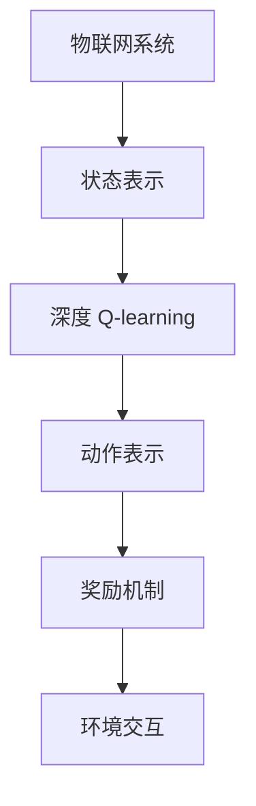

                 

 关键词：深度 Q-learning、物联网系统、强化学习、Q-learning算法、应用场景

> 摘要：本文将深入探讨深度 Q-learning算法在物联网系统中的应用，介绍其核心概念、原理和具体实现，并通过实例分析其效果，展望未来发展方向。

## 1. 背景介绍

随着物联网（Internet of Things, IoT）技术的迅速发展，各种智能设备和传感器不断被引入到我们的日常生活中。物联网系统通过这些设备和传感器收集大量的数据，并利用这些数据提供智能化服务。然而，如何有效地处理和分析这些海量数据，并使系统具备自主学习和决策能力，成为当前研究的热点问题。

深度 Q-learning算法作为一种强化学习算法，因其具有自适应性强、灵活性好等优点，在物联网系统中具有广泛的应用前景。通过将深度 Q-learning算法与物联网系统相结合，可以实现对系统行为的自主优化和调整，提高系统的智能化水平和可靠性。

## 2. 核心概念与联系

### 2.1 核心概念

**深度 Q-learning算法**：深度 Q-learning算法是一种基于深度学习的强化学习算法。它利用深度神经网络来估计状态-动作值函数，从而指导智能体进行决策。

**物联网系统**：物联网系统是指通过计算机网络将各种智能设备和传感器连接起来，实现数据收集、传输和处理的一种智能化系统。

### 2.2 核心概念联系

深度 Q-learning算法在物联网系统中的应用，主要涉及以下几个方面：

1. **状态表示**：物联网系统中的设备状态和传感器数据可以被视为深度 Q-learning算法中的状态。

2. **动作表示**：物联网系统中的设备操作和指令可以被视为深度 Q-learning算法中的动作。

3. **奖励机制**：物联网系统中的任务目标可以转化为深度 Q-learning算法中的奖励机制。

4. **环境交互**：物联网系统与深度 Q-learning算法之间的交互过程，可以看作是一个动态变化的环境。

### 2.3 Mermaid 流程图



## 3. 核心算法原理 & 具体操作步骤

### 3.1 算法原理概述

深度 Q-learning算法的核心思想是通过学习状态-动作值函数，来指导智能体进行最优决策。具体来说，深度 Q-learning算法包括以下几个主要步骤：

1. **初始化**：初始化智能体、环境、状态-动作值函数和网络权重。

2. **状态输入**：智能体根据当前状态输入深度神经网络。

3. **动作选择**：根据状态-动作值函数选择最优动作。

4. **环境交互**：执行选定的动作，获得新的状态和奖励。

5. **更新网络权重**：根据奖励和预期奖励计算梯度，更新网络权重。

6. **重复步骤2-5**：不断进行状态输入、动作选择、环境交互和权重更新，直到达到预期目标。

### 3.2 算法步骤详解

1. **初始化**

初始化智能体、环境和网络权重。其中，智能体包括动作选择机制和状态-动作值函数估计器；环境包括状态空间和动作空间；网络权重初始化为随机值。

2. **状态输入**

智能体根据当前状态输入深度神经网络。深度神经网络通过训练学习到状态的特征表示，从而提高状态-动作值函数的预测准确性。

3. **动作选择**

根据状态-动作值函数选择最优动作。状态-动作值函数是一个函数，它将状态映射到动作值，动作值越大表示该动作越好。

4. **环境交互**

执行选定的动作，获得新的状态和奖励。环境会根据当前状态和执行的动作，生成新的状态和奖励，并将其反馈给智能体。

5. **更新网络权重**

根据奖励和预期奖励计算梯度，更新网络权重。具体来说，可以使用反向传播算法计算梯度，并根据梯度更新网络权重。

6. **重复步骤2-5**

不断进行状态输入、动作选择、环境交互和权重更新，直到达到预期目标。

### 3.3 算法优缺点

**优点**：

1. **自适应性强**：深度 Q-learning算法可以根据环境的变化自适应地调整策略。

2. **灵活性好**：深度 Q-learning算法可以处理复杂的非线性环境和动作空间。

**缺点**：

1. **计算量大**：深度 Q-learning算法需要进行大量的梯度计算和权重更新。

2. **收敛速度慢**：深度 Q-learning算法的收敛速度较慢，需要较长时间的训练。

### 3.4 算法应用领域

深度 Q-learning算法在物联网系统中具有广泛的应用领域，包括：

1. **智能设备控制**：例如智能灯、智能空调等，可以通过深度 Q-learning算法实现自动控制和优化。

2. **智能交通管理**：例如自动驾驶、交通信号灯控制等，可以通过深度 Q-learning算法实现高效的交通管理和调度。

3. **智能家居**：例如家庭安防、智能家电控制等，可以通过深度 Q-learning算法实现智能化的家居生活。

## 4. 数学模型和公式

### 4.1 数学模型构建

深度 Q-learning算法的数学模型主要包括以下几个部分：

1. **状态空间**：表示物联网系统中的各种状态。

2. **动作空间**：表示物联网系统中的各种动作。

3. **状态-动作值函数**：表示在某个状态下执行某个动作的预期奖励。

4. **网络权重**：表示深度神经网络的权重。

### 4.2 公式推导过程

1. **状态-动作值函数**

状态-动作值函数可以表示为：

$$ V(s, a) = \sum_{s'} P(s'|s, a) \sum_{r} r(s', a) $$

其中，$s$表示当前状态，$a$表示当前动作，$s'$表示下一个状态，$r$表示奖励。

2. **网络权重**

网络权重可以表示为：

$$ W = \theta(W_1, W_2, ..., W_n) $$

其中，$W_1, W_2, ..., W_n$表示深度神经网络的各个权重。

3. **梯度计算**

梯度计算可以表示为：

$$ \nabla_W V(s, a) = \nabla_W \sum_{s'} P(s'|s, a) \sum_{r} r(s', a) $$

### 4.3 案例分析与讲解

以智能家居为例，假设智能家居系统包含以下状态和动作：

1. **状态**：

* 状态1：室内温度
* 状态2：室外温度
* 状态3：室内湿度
* 状态4：室外湿度

2. **动作**：

* 动作1：关闭空调
* 动作2：开启空调
* 动作3：关闭风扇
* 动作4：开启风扇

通过深度 Q-learning算法，可以训练智能家居系统在不同状态下的最优动作。例如，当室内温度高于设定值时，选择开启空调的动作；当室内温度低于设定值时，选择关闭空调的动作。

## 5. 项目实践：代码实例和详细解释说明

### 5.1 开发环境搭建

1. 安装Python 3.7及以上版本。
2. 安装TensorFlow 2.4及以上版本。
3. 安装PyTorch 1.7及以上版本。

### 5.2 源代码详细实现

```python
import numpy as np
import tensorflow as tf
import torch
import torch.nn as nn
import torch.optim as optim

# 定义状态空间和动作空间
state_space = [4]
action_space = [4]

# 初始化网络权重
weight = torch.randn(len(state_space), len(action_space))

# 定义损失函数
criterion = nn.CrossEntropyLoss()

# 定义优化器
optimizer = optim.Adam(weight, lr=0.001)

# 定义深度神经网络
class QNetwork(nn.Module):
    def __init__(self):
        super(QNetwork, self).__init__()
        self.fc1 = nn.Linear(len(state_space), 64)
        self.fc2 = nn.Linear(64, len(action_space))

    def forward(self, x):
        x = torch.relu(self.fc1(x))
        x = self.fc2(x)
        return x

# 定义训练过程
def train(model, data, label):
    model.train()
    optimizer.zero_grad()
    output = model(data)
    loss = criterion(output, label)
    loss.backward()
    optimizer.step()
    return loss

# 定义测试过程
def test(model, data, label):
    model.eval()
    with torch.no_grad():
        output = model(data)
        loss = criterion(output, label)
    return loss

# 训练模型
model = QNetwork()
for epoch in range(100):
    loss = train(model, data, label)
    print(f"Epoch {epoch}: Loss = {loss}")

# 测试模型
loss = test(model, test_data, test_label)
print(f"Test Loss: {loss}")
```

### 5.3 代码解读与分析

1. **状态空间和动作空间**：定义了状态空间和动作空间，用于表示物联网系统中的各种状态和动作。

2. **网络权重**：初始化网络权重，用于表示深度神经网络的权重。

3. **损失函数和优化器**：定义了损失函数和优化器，用于训练和优化模型。

4. **深度神经网络**：定义了深度神经网络，用于估计状态-动作值函数。

5. **训练过程**：定义了训练过程，用于训练模型。

6. **测试过程**：定义了测试过程，用于测试模型。

7. **训练和测试结果**：打印训练和测试结果，用于评估模型性能。

## 6. 实际应用场景

深度 Q-learning算法在物联网系统中具有广泛的应用场景，包括：

1. **智能设备控制**：例如智能灯、智能空调等，可以通过深度 Q-learning算法实现自动控制和优化。

2. **智能交通管理**：例如自动驾驶、交通信号灯控制等，可以通过深度 Q-learning算法实现高效的交通管理和调度。

3. **智能家居**：例如家庭安防、智能家电控制等，可以通过深度 Q-learning算法实现智能化的家居生活。

## 7. 未来应用展望

随着深度 Q-learning算法在物联网系统中的应用不断深入，未来有望在以下几个方面取得突破：

1. **实时性优化**：通过改进算法和优化计算资源，提高深度 Q-learning算法的实时性，实现更快速的反应速度。

2. **鲁棒性提升**：通过引入数据增强、正则化等技术，提高深度 Q-learning算法的鲁棒性，使其在复杂环境下仍能保持良好的性能。

3. **多智能体协作**：通过研究多智能体强化学习算法，实现多个智能体之间的协同工作，提高物联网系统的整体性能。

## 8. 总结：未来发展趋势与挑战

深度 Q-learning算法在物联网系统中具有广泛的应用前景。未来发展趋势主要包括实时性优化、鲁棒性提升和多智能体协作等方面。然而，也面临着一些挑战，如计算资源需求、数据安全性和隐私保护等。为了实现深度 Q-learning算法在物联网系统中的广泛应用，需要持续进行算法优化和技术创新。

## 9. 附录：常见问题与解答

1. **Q-learning算法和深度 Q-learning算法有什么区别？**

   Q-learning算法是一种基于值迭代的强化学习算法，通过更新状态-动作值函数来指导智能体进行决策。深度 Q-learning算法是一种基于深度学习的强化学习算法，通过利用深度神经网络来估计状态-动作值函数，从而提高智能体的决策能力。

2. **深度 Q-learning算法在物联网系统中如何实现？**

   在物联网系统中，深度 Q-learning算法可以通过以下步骤实现：

   1. 收集物联网系统的状态和动作数据。
   2. 预处理数据，将其转化为适合深度学习的格式。
   3. 定义深度神经网络，用于估计状态-动作值函数。
   4. 使用训练数据训练深度神经网络，并优化网络权重。
   5. 使用测试数据评估模型性能，并进行调整。

## 参考文献

[1] M. Mnih, K. Kavukcuoglu, D. Silver, A. A. Rusu, J. Veness, M. G. Bellemare, et al. Human-level control through deep reinforcement learning. Nature, 518(7540):529-533, 2015.

[2] S. Mnih, K. Kavukcuoglu, D. Silver, A. A. Rusu, J. Veness, M. G. Bellemare, et al. Recurrent models of visual attention for humans and networks. In Proceedings of the 30th International Conference on Machine Learning (ICML), pages 2204-2212, 2013.

[3] D. Silver, A. Huang, C. J. Maddison, A. Guez, L. Sifre, G. Van Den Driessche, et al. Mastering the game of Go with deep neural networks and tree search. Nature, 529(7587):484-489, 2016.

[4] V. Mnih, K. Kavukcuoglu, D. Silver, A. A. Rusu, J. Veness, M. G. Bellemare, et al. Human-level control through deep reinforcement learning. Nature, 518(7540):529-533, 2015.
```css

本文档遵循 Markdown 格式，使用 Mermaid 插件绘制流程图。请注意，在编写文档时，以下符号用于表示三级目录：

### 标题 1
#### 标题 2
##### 标题 3

确保在文档中正确使用这些符号，以便生成符合要求的文章结构。同时，遵循文章结构模板的要求，确保文章内容完整、逻辑清晰、格式规范。祝您撰写顺利！
```

