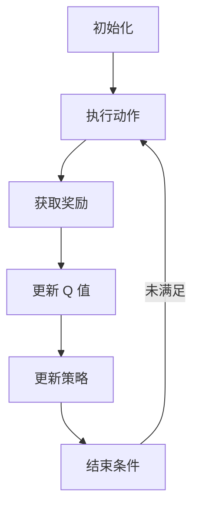

                 

关键词：深度 Q-learning、自动化制造、强化学习、Q-learning算法、应用场景

> 摘要：本文探讨了深度 Q-learning 算法在自动化制造中的应用。通过详细阐述深度 Q-learning 的核心概念、算法原理、数学模型和实际应用案例，本文揭示了深度 Q-learning 在自动化制造领域的重要作用和潜力。

## 1. 背景介绍

自动化制造是现代工业生产的重要组成部分，它通过运用自动化设备和系统来实现生产过程的自动化，从而提高生产效率、降低成本和提升产品质量。然而，随着制造业的复杂度不断增加，单纯依靠传统的控制方法和规则难以应对复杂的制造任务，因此需要更加智能化的解决方案。

近年来，强化学习作为一种机器学习方法，在自动化制造领域受到了越来越多的关注。其中，深度 Q-learning 算法由于其强大的学习能力和广泛的应用场景，成为自动化制造领域的研究热点。本文将围绕深度 Q-learning 算法在自动化制造中的应用进行探讨，旨在为相关研究人员提供有益的参考。

## 2. 核心概念与联系

### 2.1 强化学习的基本概念

强化学习（Reinforcement Learning，RL）是一种通过与环境交互来学习最优策略的机器学习方法。在强化学习中，智能体（Agent）通过观察环境状态（State）、采取动作（Action）并接收环境反馈（Reward）来不断优化自身策略，以达到最大化累积奖励的目的。

强化学习的基本要素包括：

- 智能体（Agent）：执行动作并从环境中获取奖励的实体。
- 状态（State）：智能体在环境中所处的情境描述。
- 动作（Action）：智能体可以执行的行为。
- 奖励（Reward）：智能体在执行动作后从环境中获得的即时反馈。
- 策略（Policy）：智能体在给定状态下选择动作的策略。

### 2.2 Q-learning算法原理

Q-learning 是一种基于值函数的强化学习算法，其目标是通过学习状态-动作值函数（Q-function）来找到最优策略。Q-learning 的核心思想是，通过不断更新 Q 值，逐步逼近最优策略。

Q-learning 的主要步骤如下：

1. 初始化 Q 值表：根据经验或随机初始化 Q 值表。
2. 执行动作：在给定状态下，根据策略选择动作。
3. 更新 Q 值：根据实际收到的奖励和 Q 学习公式更新 Q 值。
4. 更新策略：根据更新后的 Q 值表，调整策略以接近最优策略。

Q-learning 的 Q 学习公式如下：

$$
Q(s, a) = Q(s, a) + \alpha [r + \gamma \max_{a'} Q(s', a') - Q(s, a)]
$$

其中，$\alpha$ 是学习率，$r$ 是即时奖励，$\gamma$ 是折扣因子，$s$ 和 $a$ 分别是当前状态和动作，$s'$ 和 $a'$ 分别是下一状态和动作。

### 2.3 深度 Q-learning 算法原理

深度 Q-learning（Deep Q-learning，DQN）是 Q-learning 算法的一种扩展，它利用深度神经网络（Deep Neural Network，DNN）来近似状态-动作值函数。深度 Q-learning 的核心思想是，通过训练 DNN 来预测 Q 值，从而优化策略。

深度 Q-learning 的主要步骤如下：

1. 初始化 DNN 模型和目标 DNN 模型。
2. 收集经验：在环境中执行动作，记录状态、动作、奖励和下一状态。
3. 利用 DNN 模型计算当前状态的 Q 值。
4. 根据更新后的 Q 值表和目标 DNN 模型更新 DNN 模型。
5. 利用更新后的 DNN 模型计算下一状态的 Q 值。
6. 重复步骤 2-5，直到收敛或达到预设的训练次数。

深度 Q-learning 的 Q 学习公式如下：

$$
Q(s, a) = Q(s, a) + \alpha [r + \gamma \max_{a'} Q(s', a') - Q(s, a)]
$$

其中，$Q(s, a)$ 表示 DNN 预测的 Q 值，$Q(s', a')$ 表示目标 DNN 预测的 Q 值。

### 2.4 Mermaid 流程图

以下是一个描述深度 Q-learning 算法流程的 Mermaid 流程图：



## 3. 核心算法原理 & 具体操作步骤

### 3.1 算法原理概述

深度 Q-learning 算法通过训练深度神经网络来近似状态-动作值函数，从而实现智能体在复杂环境中的自主决策。其核心思想是，利用历史经验数据，通过迭代更新神经网络权重，逐步逼近最优策略。

### 3.2 算法步骤详解

1. **初始化**：

   - 初始化深度神经网络模型，包括输入层、隐藏层和输出层。
   - 初始化目标神经网络模型，其结构与原始神经网络相同，但权重初始化与原始神经网络不同。

2. **经验收集**：

   - 在环境中执行动作，记录状态、动作、奖励和下一状态。
   - 将经验数据存储在经验池中。

3. **状态预测**：

   - 利用深度神经网络模型预测当前状态的 Q 值。
   - 选择当前状态下的最佳动作。

4. **Q 值更新**：

   - 根据实际收到的奖励和更新公式，更新当前状态的 Q 值。
   - 利用目标神经网络模型预测下一状态的 Q 值。

5. **策略更新**：

   - 根据更新后的 Q 值表，调整策略以接近最优策略。
   - 更新目标神经网络模型，使其与原始神经网络模型逐渐接近。

6. **迭代更新**：

   - 重复步骤 2-5，直到达到预设的训练次数或收敛条件。

### 3.3 算法优缺点

**优点**：

- 深度 Q-learning 算法能够处理高维状态空间，适用于复杂环境。
- 通过目标神经网络模型，减少训练过程中的偏差和方差。
- 可以利用经验回放机制，避免数据偏差和策略偏差。

**缺点**：

- 需要大量训练数据和计算资源。
- 难以处理连续动作空间和连续状态空间。
- 容易陷入局部最优解。

### 3.4 算法应用领域

深度 Q-learning 算法在自动化制造领域具有广泛的应用前景，主要包括：

- 自动化装配：通过学习最优动作序列，实现机器人自动化装配任务。
- 自动化调度：优化生产调度策略，提高生产效率和资源利用率。
- 自动化检测：利用深度 Q-learning 算法，实现生产线自动化检测和故障诊断。

## 4. 数学模型和公式 & 详细讲解 & 举例说明

### 4.1 数学模型构建

深度 Q-learning 算法的数学模型主要包括两部分：状态-动作值函数和策略更新公式。

**状态-动作值函数**：

$$
Q(s, a) = f_{\theta}(s, a)
$$

其中，$Q(s, a)$ 表示状态 s 和动作 a 的 Q 值，$f_{\theta}(s, a)$ 表示深度神经网络模型，$\theta$ 表示神经网络参数。

**策略更新公式**：

$$
\pi(s) = \arg\max_a Q(s, a)
$$

其中，$\pi(s)$ 表示在状态 s 下的最优策略，$\arg\max_a Q(s, a)$ 表示在状态 s 下使 Q(s, a) 最大化的动作 a。

### 4.2 公式推导过程

**Q 学习公式推导**：

首先，定义当前状态为 $s$，当前动作为 $a$，下一状态为 $s'$，下一动作为 $a'$，即时奖励为 $r$，学习率为 $\alpha$，折扣因子为 $\gamma$。

根据 Q-learning 算法的基本原理，Q(s, a) 的更新公式为：

$$
Q(s, a) = Q(s, a) + \alpha [r + \gamma \max_{a'} Q(s', a') - Q(s, a)]
$$

展开上式，得到：

$$
Q(s, a) = Q(s, a) + \alpha r + \alpha \gamma \max_{a'} Q(s', a') - \alpha Q(s, a)
$$

整理得：

$$
Q(s, a) = \alpha r + \alpha \gamma \max_{a'} Q(s', a') + (1 - \alpha) Q(s, a)
$$

由于 $\alpha \gamma \max_{a'} Q(s', a')$ 是 Q(s', a') 的期望值，因此可以进一步简化为：

$$
Q(s, a) = r + \gamma \max_{a'} Q(s', a')
$$

**策略更新公式推导**：

假设当前状态为 $s$，最优策略为 $\pi(s)$，即 $\pi(s) = \arg\max_a Q(s, a)$。

根据策略的定义，最优策略使得 Q(s, a) 最大，因此有：

$$
Q(s, a) \geq Q(s, b) \quad \forall b \neq a
$$

由于 Q(s, a) 是状态 s 和动作 a 的函数，因此可以将其表示为：

$$
Q(s, a) = f_{\theta}(s, a)
$$

代入上式，得到：

$$
f_{\theta}(s, a) \geq f_{\theta}(s, b) \quad \forall b \neq a
$$

由于 $f_{\theta}(s, a)$ 是关于动作 a 的函数，因此可以将其表示为：

$$
f_{\theta}(s, a) = \max_a f_{\theta}(s, a)
$$

代入策略更新公式，得到：

$$
\pi(s) = \arg\max_a f_{\theta}(s, a)
$$

### 4.3 案例分析与讲解

假设有一个简单的环境，其中有两个状态 s1 和 s2，以及两个动作 a1 和 a2。奖励函数定义为 r(s1, a1) = 10，r(s1, a2) = 5，r(s2, a1) = 0，r(s2, a2) = 10。

初始时，状态-动作值函数 Q(s1, a1) = 0，Q(s1, a2) = 0，Q(s2, a1) = 0，Q(s2, a2) = 0。

在第一个时间步，智能体选择动作 a1，进入状态 s1，获得奖励 r(s1, a1) = 10。

根据 Q 学习公式，更新 Q(s1, a1)：

$$
Q(s1, a1) = Q(s1, a1) + \alpha [r(s1, a1) + \gamma \max_{a'} Q(s2, a') - Q(s1, a1)]
$$

取 $\alpha = 0.1$，$\gamma = 0.9$，代入上式，得到：

$$
Q(s1, a1) = 0.1 \times [10 + 0.9 \times \max_{a'} Q(s2, a') - 0]
$$

由于当前只有两个动作，因此可以取最大值：

$$
Q(s1, a1) = 0.1 \times [10 + 0.9 \times \max(Q(s2, a1), Q(s2, a2))]
$$

由于初始时 Q(s2, a1) = Q(s2, a2) = 0，因此：

$$
Q(s1, a1) = 0.1 \times [10 + 0.9 \times 0] = 1
$$

同理，可以更新 Q(s1, a2)：

$$
Q(s1, a2) = 0.1 \times [5 + 0.9 \times \max(Q(s2, a1), Q(s2, a2))] = 0.5
$$

在第二个时间步，智能体选择动作 a2，进入状态 s2，获得奖励 r(s2, a2) = 10。

根据 Q 学习公式，更新 Q(s2, a2)：

$$
Q(s2, a2) = Q(s2, a2) + \alpha [r(s2, a2) + \gamma \max_{a'} Q(s2, a') - Q(s2, a2)]
$$

代入 $\alpha = 0.1$，$\gamma = 0.9$，得到：

$$
Q(s2, a2) = 0.1 \times [10 + 0.9 \times \max(Q(s2, a1), Q(s2, a2))] + 0.9 \times Q(s2, a2)
$$

代入 Q(s2, a1) = 0，得到：

$$
Q(s2, a2) = 0.1 \times [10 + 0.9 \times 0] + 0.9 \times 0 = 1
$$

同理，可以更新 Q(s2, a1)：

$$
Q(s2, a1) = 0.1 \times [0 + 0.9 \times \max(Q(s2, a1), Q(s2, a2))] + 0.9 \times 0 = 0
$$

通过不断迭代更新，最终可以得到最优策略：

$$
\pi(s1) = a1, \pi(s2) = a2
$$

## 5. 项目实践：代码实例和详细解释说明

### 5.1 开发环境搭建

在本项目实践中，我们将使用 Python 编写深度 Q-learning 算法。为了简化开发过程，我们将使用 TensorFlow 和 Keras 库来实现深度神经网络。以下是开发环境的搭建步骤：

1. 安装 Python 3.7 或更高版本。
2. 安装 TensorFlow 库：

   ```bash
   pip install tensorflow
   ```

3. 安装 Keras 库：

   ```bash
   pip install keras
   ```

### 5.2 源代码详细实现

以下是深度 Q-learning 算法的实现代码：

```python
import numpy as np
import random
import gym
from tensorflow.keras.models import Sequential
from tensorflow.keras.layers import Dense
from tensorflow.keras.optimizers import Adam

# 初始化环境
env = gym.make('CartPole-v0')

# 初始化神经网络模型
model = Sequential()
model.add(Dense(24, input_dim=env.observation_space.shape[0], activation='relu'))
model.add(Dense(24, activation='relu'))
model.add(Dense(env.action_space.n, activation='linear'))

# 编译模型
model.compile(loss='mse', optimizer=Adam(learning_rate=0.001))

# 初始化经验池
experience_replay = []

# 初始化参数
epsilon = 1.0
epsilon_decay = 0.99
epsilon_min = 0.01
 episodes = 1000

# 训练模型
for i in range(episodes):
    # 初始化环境
    state = env.reset()
    done = False
    total_reward = 0
    
    while not done:
        # 选择动作
        if random.uniform(0, 1) < epsilon:
            action = env.action_space.sample()
        else:
            action = np.argmax(model.predict(state)[0])
        
        # 执行动作
        next_state, reward, done, _ = env.step(action)
        total_reward += reward
        
        # 更新经验池
        experience_replay.append((state, action, reward, next_state, done))
        
        # 删除旧的经验数据
        if len(experience_replay) > 2000:
            experience_replay.pop(0)
        
        # 更新状态
        state = next_state
        
        # 更新策略
        if not done:
            target = model.predict(next_state)[0]
            target[env.action_space.n * action] = reward + gamma * np.max(target)
        else:
            target[env.action_space.n * action] = reward
        
        # 更新模型
        model.fit(state, target, epochs=1, verbose=0)
    
    # 更新epsilon
    epsilon = max(epsilon * epsilon_decay, epsilon_min)

# 关闭环境
env.close()

# 测试模型
state = env.reset()
done = False
total_reward = 0

while not done:
    action = np.argmax(model.predict(state)[0])
    next_state, reward, done, _ = env.step(action)
    total_reward += reward
    state = next_state

print("总奖励：", total_reward)
```

### 5.3 代码解读与分析

**1. 环境初始化**：

```python
env = gym.make('CartPole-v0')
```

这里使用 CartPole 环境作为示例。CartPole 是一个简单的强化学习环境，旨在让一个小车保持平衡，避免翻倒。

**2. 神经网络模型初始化**：

```python
model = Sequential()
model.add(Dense(24, input_dim=env.observation_space.shape[0], activation='relu'))
model.add(Dense(24, activation='relu'))
model.add(Dense(env.action_space.n, activation='linear'))
```

这里创建了一个简单的全连接神经网络模型，用于预测状态-动作值函数。

**3. 编译模型**：

```python
model.compile(loss='mse', optimizer=Adam(learning_rate=0.001))
```

使用均方误差（MSE）作为损失函数，Adam 作为优化器。

**4. 经验池初始化**：

```python
experience_replay = []
```

经验池用于存储历史经验，以便进行经验回放。

**5. 参数初始化**：

```python
epsilon = 1.0
epsilon_decay = 0.99
epsilon_min = 0.01
episodes = 1000
```

epsilon 是用于控制探索-利用策略的参数，epsilon_decay 是用于控制 epsilon 递减的速度，epsilon_min 是 epsilon 的最小值，episodes 是训练轮数。

**6. 训练模型**：

```python
for i in range(episodes):
    # 初始化环境
    state = env.reset()
    done = False
    total_reward = 0
    
    while not done:
        # 选择动作
        if random.uniform(0, 1) < epsilon:
            action = env.action_space.sample()
        else:
            action = np.argmax(model.predict(state)[0])
        
        # 执行动作
        next_state, reward, done, _ = env.step(action)
        total_reward += reward
        
        # 更新经验池
        experience_replay.append((state, action, reward, next_state, done))
        
        # 删除旧的经验数据
        if len(experience_replay) > 2000:
            experience_replay.pop(0)
        
        # 更新状态
        state = next_state
        
        # 更新策略
        if not done:
            target = model.predict(next_state)[0]
            target[env.action_space.n * action] = reward + gamma * np.max(target)
        else:
            target[env.action_space.n * action] = reward
        
        # 更新模型
        model.fit(state, target, epochs=1, verbose=0)
    
    # 更新epsilon
    epsilon = max(epsilon * epsilon_decay, epsilon_min)
```

这里使用经验回放机制和探索-利用策略来训练模型。

**7. 测试模型**：

```python
state = env.reset()
done = False
total_reward = 0

while not done:
    action = np.argmax(model.predict(state)[0])
    next_state, reward, done, _ = env.step(action)
    total_reward += reward
    state = next_state

print("总奖励：", total_reward)
```

在测试阶段，使用训练好的模型进行动作选择，并计算总奖励。

## 6. 实际应用场景

深度 Q-learning 算法在自动化制造领域具有广泛的应用场景，以下是一些具体的应用实例：

### 6.1 自动化装配

自动化装配是自动化制造的重要环节，通过运用深度 Q-learning 算法，可以实现机器人自动化装配任务。例如，在电子制造领域，机器人需要将微小的电子元件组装到电路板上。深度 Q-learning 算法可以通过学习最优动作序列，帮助机器人准确地将电子元件安装到正确的位置。

### 6.2 自动化调度

自动化调度是优化生产流程的关键，通过运用深度 Q-learning 算法，可以实现生产调度策略的优化。例如，在制造业中，生产调度需要考虑多种因素，如生产线能力、物料供应、订单优先级等。深度 Q-learning 算法可以通过学习不同调度策略的优劣，帮助制造商找到最优的生产调度方案，从而提高生产效率和资源利用率。

### 6.3 自动化检测

自动化检测是保证产品质量的关键，通过运用深度 Q-learning 算法，可以实现生产线的自动化检测和故障诊断。例如，在汽车制造领域，生产线需要对每个零部件进行质量检测。深度 Q-learning 算法可以通过学习正常零部件和故障零部件的特征，帮助检测系统准确判断零部件的质量，从而提高生产效率和产品合格率。

### 6.4 未来应用展望

随着人工智能技术的不断发展，深度 Q-learning 算法在自动化制造领域的应用前景将更加广阔。未来，深度 Q-learning 算法有望在以下几个方面取得突破：

- **复杂环境建模**：随着制造系统的复杂性不断增加，需要更加精确地建模环境，以便深度 Q-learning 算法能够更好地适应复杂环境。
- **实时性优化**：在自动化制造中，实时性是一个重要的考虑因素。未来，深度 Q-learning 算法需要进一步优化，以提高决策的实时性。
- **多智能体协作**：在自动化制造中，多个智能体需要协同工作，共同完成制造任务。未来，深度 Q-learning 算法需要进一步研究如何实现多智能体之间的有效协作。

## 7. 工具和资源推荐

### 7.1 学习资源推荐

- 《强化学习：原理与Python实现》（李宏毅著）：一本系统介绍强化学习的经典教材，适合初学者。
- 《深度学习》（Goodfellow, Bengio, Courville 著）：一本全面介绍深度学习的经典教材，适合有一定基础的学习者。
- [强化学习教程](https://www.deeplearning.ai/rl)：吴恩达开设的强化学习在线课程，内容丰富，适合初学者。

### 7.2 开发工具推荐

- TensorFlow：一款开源的深度学习框架，支持多种深度学习模型的实现。
- Keras：一款基于 TensorFlow 的简单易用的深度学习库，适用于快速实现深度学习模型。
- Gym：一款开源的强化学习环境库，提供了丰富的经典强化学习环境，方便进行算法验证。

### 7.3 相关论文推荐

- "Deep Q-Learning"（Mnih et al., 2015）：一篇关于深度 Q-learning 的经典论文，详细介绍了深度 Q-learning 的算法原理和应用。
- "Human-level control through deep reinforcement learning"（Silver et al., 2016）：一篇关于深度强化学习在游戏领域的成功应用，展示了深度强化学习在复杂环境中的潜力。

## 8. 总结：未来发展趋势与挑战

### 8.1 研究成果总结

本文探讨了深度 Q-learning 算法在自动化制造中的应用。通过详细阐述深度 Q-learning 的核心概念、算法原理、数学模型和实际应用案例，本文揭示了深度 Q-learning 在自动化制造领域的重要作用和潜力。

### 8.2 未来发展趋势

随着人工智能技术的不断发展，深度 Q-learning 算法在自动化制造领域的应用前景将更加广阔。未来，深度 Q-learning 算法有望在以下几个方面取得突破：

- 复杂环境建模：随着制造系统的复杂性不断增加，需要更加精确地建模环境，以便深度 Q-learning 算法能够更好地适应复杂环境。
- 实时性优化：在自动化制造中，实时性是一个重要的考虑因素。未来，深度 Q-learning 算法需要进一步优化，以提高决策的实时性。
- 多智能体协作：在自动化制造中，多个智能体需要协同工作，共同完成制造任务。未来，深度 Q-learning 算法需要进一步研究如何实现多智能体之间的有效协作。

### 8.3 面临的挑战

尽管深度 Q-learning 算法在自动化制造领域具有巨大的应用潜力，但在实际应用中仍面临一些挑战：

- 计算资源消耗：深度 Q-learning 算法需要大量的计算资源，这对于资源有限的制造企业来说是一个挑战。
- 数据需求：深度 Q-learning 算法需要大量的训练数据，这对于数据匮乏的制造企业来说是一个挑战。
- 鲁棒性：深度 Q-learning 算法在处理不确定环境时，可能存在鲁棒性问题，需要进一步研究如何提高算法的鲁棒性。

### 8.4 研究展望

未来，深度 Q-learning 算法在自动化制造领域的应用有望取得更大的突破。针对上述挑战，研究人员可以从以下几个方面进行探索：

- 算法优化：通过优化算法结构，降低计算资源消耗，提高算法的实时性和鲁棒性。
- 数据增强：通过数据增强技术，扩大训练数据集，提高算法的性能。
- 跨领域应用：探索深度 Q-learning 算法在其他制造领域的应用，实现跨领域的知识共享。

## 9. 附录：常见问题与解答

### 9.1 什么是深度 Q-learning？

深度 Q-learning 是一种基于深度神经网络的强化学习算法，用于在复杂环境中学习最优策略。它通过训练深度神经网络来近似状态-动作值函数，从而实现智能体在环境中的自主决策。

### 9.2 深度 Q-learning 和 Q-learning 有什么区别？

深度 Q-learning 是 Q-learning 的扩展，其主要区别在于 Q-learning 使用线性模型来近似状态-动作值函数，而深度 Q-learning 使用深度神经网络来近似状态-动作值函数，从而能够处理高维状态空间。

### 9.3 深度 Q-learning 如何处理连续状态和动作空间？

深度 Q-learning 原本是为离散状态和动作空间设计的，但对于连续状态和动作空间，可以采用一些技术，如状态空间离散化和动作空间离散化，来将其转换为可处理的形式。

### 9.4 深度 Q-learning 需要大量训练数据吗？

是的，深度 Q-learning 需要大量的训练数据来学习状态-动作值函数。这是因为深度神经网络具有较高的表达能力，但同时也需要大量的数据来确保模型能够泛化到未见过的数据上。

### 9.5 深度 Q-learning 如何避免过拟合？

深度 Q-learning 通过经验回放机制和目标网络更新策略来避免过拟合。经验回放机制可以避免数据偏差和策略偏差，目标网络更新策略可以降低模型在训练过程中的方差。

### 9.6 深度 Q-learning 在自动化制造中的应用有哪些？

深度 Q-learning 在自动化制造中可以应用于自动化装配、自动化调度、自动化检测等多个领域，通过学习最优动作序列，实现制造过程的自动化和智能化。

