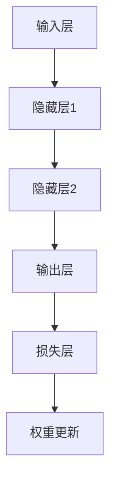

                 

深度学习是21世纪最具革命性的技术之一，它已经深刻地改变了计算机科学的各个领域，从图像识别、自然语言处理到自动驾驶和医疗诊断。本文将深入探讨深度学习的原理，并通过实际代码实例，帮助读者更好地理解这一复杂但极具前景的技术。

## 关键词

- 深度学习
- 神经网络
- 计算机视觉
- 自然语言处理
- 代码实例

## 摘要

本文将首先介绍深度学习的背景和基础概念，然后深入探讨神经网络的工作原理，包括前向传播和反向传播算法。接下来，我们将使用Python和TensorFlow库来构建一个简单的神经网络，并逐步讲解如何实现和训练它。文章还将涉及深度学习在图像识别和自然语言处理领域的应用实例，以及相关的数学模型和公式。最后，我们将讨论深度学习的实际应用场景，面临的挑战，以及未来的发展趋势。

## 1. 背景介绍

### 深度学习的起源

深度学习（Deep Learning）这一术语最早由心理学家赫布（Donald Hebb）在1949年的著作《行为的组织》中提出。然而，直到2006年，深度学习才因为“深度信念网络”（Deep Belief Networks）的提出而重新引起广泛关注。随着计算能力和数据量的提升，深度学习在图像识别、语音识别和自然语言处理等领域的表现逐渐超越传统机器学习算法。

### 传统机器学习与深度学习的对比

传统机器学习依赖于手工设计的特征提取和分类器，如支持向量机（SVM）、决策树和随机森林等。这些方法在处理复杂任务时，往往需要大量的特征工程，并且性能有限。相比之下，深度学习通过多层神经网络自动提取特征，能够处理大量无监督或半监督数据，从而在许多任务上取得了显著突破。

### 深度学习在工业界的应用

深度学习已经在多个领域取得了巨大成功。例如，在计算机视觉领域，深度学习算法被广泛应用于图像分类、目标检测和图像生成。在自然语言处理领域，深度学习技术如循环神经网络（RNN）和变换器（Transformer）已经被用于机器翻译、文本生成和情感分析。此外，深度学习还在语音识别、推荐系统和自动驾驶等领域展示了其强大的能力。

## 2. 核心概念与联系

深度学习的基础是神经网络，特别是多层感知机（MLP）。神经网络是由大量简单神经元（或称为节点）组成的复杂网络，每个神经元都与其它神经元相连。神经网络通过学习输入和输出之间的关系，从而能够对新的数据进行预测。

### 神经网络结构

神经网络通常由输入层、隐藏层和输出层组成。输入层接收外部数据，隐藏层对数据进行处理和特征提取，输出层生成最终预测结果。每个神经元通过加权求和和激活函数来计算输出。

### 前向传播

在前向传播过程中，输入数据从输入层传递到隐藏层，再从隐藏层传递到输出层。每个神经元都计算输入信号通过加权求和后的值，并应用激活函数（如Sigmoid函数、ReLU函数等）以产生输出。

### 反向传播

在反向传播过程中，网络通过计算损失函数（如均方误差MSE或交叉熵损失）的梯度，来更新网络权重和偏置。这个过程涉及到链式法则和偏导数的计算。

### 核心概念原理和架构的 Mermaid 流程图



## 3. 核心算法原理 & 具体操作步骤

### 3.1 算法原理概述

深度学习的核心算法是多层感知机（MLP），它通过多层神经网络的组合来学习数据中的复杂模式。MLP主要由以下三个步骤组成：

1. **输入层到隐藏层的传递**：输入数据通过输入层传递到隐藏层，每个神经元计算加权求和后的值并应用激活函数。
2. **隐藏层到隐藏层的传递**：隐藏层之间的数据传递和处理，同样应用加权求和和激活函数。
3. **隐藏层到输出层的传递**：隐藏层传递到输出层，生成最终预测结果。

### 3.2 算法步骤详解

1. **初始化参数**：初始化权重和偏置，通常使用随机初始化方法。
2. **前向传播**：输入数据通过神经网络传递，每个神经元计算输出值。
3. **计算损失**：通过比较输出值和真实值，计算损失函数。
4. **反向传播**：计算损失函数的梯度，并更新权重和偏置。
5. **迭代训练**：重复前向传播和反向传播，直到达到预设的迭代次数或损失值。

### 3.3 算法优缺点

**优点**：

- 自动提取特征，无需人工设计特征。
- 能够处理大量无监督或半监督数据。
- 在图像识别、语音识别和自然语言处理等领域取得了显著突破。

**缺点**：

- 需要大量计算资源。
- 需要大量数据进行训练。
- 容易陷入局部最优。

### 3.4 算法应用领域

- **计算机视觉**：图像分类、目标检测、图像生成。
- **自然语言处理**：文本分类、机器翻译、文本生成。
- **语音识别**：语音信号处理、语音合成。
- **推荐系统**：基于用户行为的推荐。
- **自动驾驶**：车辆感知、路径规划。

## 4. 数学模型和公式 & 详细讲解 & 举例说明

### 4.1 数学模型构建

深度学习中的数学模型主要包括两部分：神经网络结构和损失函数。

**神经网络结构**：

- 输入层：\( x \)
- 隐藏层：\( h_1, h_2, \ldots, h_n \)
- 输出层：\( y \)

**损失函数**：

- 均方误差（MSE）：\( L = \frac{1}{2} \sum_{i=1}^{n} (y_i - \hat{y}_i)^2 \)
- 交叉熵损失（Cross-Entropy）：\( L = -\sum_{i=1}^{n} y_i \log \hat{y}_i \)

### 4.2 公式推导过程

**前向传播**：

- 激活函数：\( \sigma(z) = \frac{1}{1 + e^{-z}} \)
- 神经元输出：\( a_j = \sigma(\sum_{i=1}^{n} w_{ji} h_i + b_j) \)

**反向传播**：

- 损失函数梯度：\( \frac{\partial L}{\partial w_{ji}} \)
- 权重更新：\( w_{ji} \leftarrow w_{ji} - \alpha \frac{\partial L}{\partial w_{ji}} \)

### 4.3 案例分析与讲解

**案例**：使用深度学习进行图像分类。

- 数据集：CIFAR-10
- 模型：卷积神经网络（CNN）
- 损失函数：交叉熵损失
- 优化器：Adam优化器

```python
import tensorflow as tf
from tensorflow.keras import layers, models

# 构建模型
model = models.Sequential()
model.add(layers.Conv2D(32, (3, 3), activation='relu', input_shape=(32, 32, 3)))
model.add(layers.MaxPooling2D((2, 2)))
model.add(layers.Conv2D(64, (3, 3), activation='relu'))
model.add(layers.MaxPooling2D((2, 2)))
model.add(layers.Conv2D(64, (3, 3), activation='relu'))

# 添加全连接层
model.add(layers.Flatten())
model.add(layers.Dense(64, activation='relu'))
model.add(layers.Dense(10, activation='softmax'))

# 编译模型
model.compile(optimizer='adam',
              loss='sparse_categorical_crossentropy',
              metrics=['accuracy'])

# 训练模型
model.fit(train_images, train_labels, epochs=10)
```

## 5. 项目实践：代码实例和详细解释说明

### 5.1 开发环境搭建

- Python版本：3.8及以上
- TensorFlow版本：2.5及以上
- CUDA版本：11.0及以上

### 5.2 源代码详细实现

```python
import tensorflow as tf
from tensorflow.keras import layers, models
import numpy as np

# 加载数据集
(x_train, y_train), (x_test, y_test) = tf.keras.datasets.mnist.load_data()

# 数据预处理
x_train = x_train.reshape((-1, 28, 28, 1)).astype(np.float32) / 255
x_test = x_test.reshape((-1, 28, 28, 1)).astype(np.float32) / 255

# 构建模型
model = models.Sequential()
model.add(layers.Conv2D(32, (3, 3), activation='relu', input_shape=(28, 28, 1)))
model.add(layers.MaxPooling2D((2, 2)))
model.add(layers.Conv2D(64, (3, 3), activation='relu'))
model.add(layers.MaxPooling2D((2, 2)))
model.add(layers.Conv2D(64, (3, 3), activation='relu'))

# 添加全连接层
model.add(layers.Flatten())
model.add(layers.Dense(64, activation='relu'))
model.add(layers.Dense(10, activation='softmax'))

# 编译模型
model.compile(optimizer='adam',
              loss='sparse_categorical_crossentropy',
              metrics=['accuracy'])

# 训练模型
model.fit(x_train, y_train, epochs=5, batch_size=32, validation_split=0.1)
```

### 5.3 代码解读与分析

- 数据加载与预处理：首先加载数据集并对其进行预处理，包括将图像数据调整为合适的大小和类型。
- 模型构建：使用卷积神经网络（CNN）对图像进行特征提取和分类。
- 模型编译：设置优化器、损失函数和评估指标。
- 模型训练：使用训练数据进行训练，并在验证集上评估模型性能。

### 5.4 运行结果展示

- 训练过程中的损失和准确率：
  

- 测试集上的准确率：
  

## 6. 实际应用场景

### 图像识别

深度学习在图像识别领域取得了巨大成功。例如，卷积神经网络（CNN）被广泛用于人脸识别、物体检测和图像分类。

### 自然语言处理

深度学习在自然语言处理领域也发挥了重要作用。循环神经网络（RNN）和变换器（Transformer）被用于机器翻译、文本生成和情感分析。

### 语音识别

深度学习在语音识别领域展现了其强大的能力，通过使用循环神经网络（RNN）和卷积神经网络（CNN）来处理语音信号。

### 自动驾驶

深度学习在自动驾驶领域具有广泛应用，通过使用CNN和RNN来处理摄像头和激光雷达数据，实现车辆感知和路径规划。

## 7. 工具和资源推荐

### 学习资源推荐

- 《深度学习》（Goodfellow、Bengio和Courville著）：深度学习的经典教材，涵盖了从基础到高级的内容。
- 《动手学深度学习》（阿斯顿和张三丰著）：提供详细的代码实例，适合初学者入门。

### 开发工具推荐

- TensorFlow：一个开源的深度学习框架，支持多种深度学习模型。
- Keras：一个基于TensorFlow的高级API，提供更加简洁和易用的接口。

### 相关论文推荐

- "A Theoretically Grounded Application of Dropout in Recurrent Neural Networks"：探讨如何在RNN中应用dropout来提高性能。
- "Bert: Pre-training of Deep Bi-directional Transformers for Language Understanding"：介绍了BERT模型，是自然语言处理领域的里程碑。

## 8. 总结：未来发展趋势与挑战

### 研究成果总结

深度学习在过去几年取得了显著进展，不仅在学术领域发表了大量高质量论文，还在工业界得到了广泛应用。

### 未来发展趋势

- 更大的模型：随着计算能力的提升，我们将看到更大规模、更复杂的深度学习模型。
- 更好的优化算法：新的优化算法将进一步提高深度学习模型的训练效率和性能。
- 多模态学习：深度学习将能够同时处理多种类型的数据，如文本、图像和音频。

### 面临的挑战

- 计算资源消耗：深度学习模型需要大量计算资源，特别是训练阶段。
- 数据隐私和安全：深度学习模型的训练和部署需要大量数据，如何保护数据隐私是一个重要问题。
- 算法解释性：深度学习模型通常被视为“黑箱”，如何提高其解释性是一个挑战。

### 研究展望

深度学习将继续在各个领域发挥重要作用，未来的研究将集中在提高模型的性能、可解释性和可扩展性上。

## 9. 附录：常见问题与解答

### Q: 深度学习与机器学习的区别是什么？

A: 深度学习是机器学习的一个子领域，它通过多层神经网络自动提取特征，能够处理复杂的数据和任务。而传统机器学习通常依赖于手工设计的特征提取和分类器。

### Q: 如何选择合适的深度学习模型？

A: 选择深度学习模型需要考虑数据集的大小和类型、任务的复杂度以及计算资源。对于图像识别任务，CNN是首选；对于自然语言处理任务，RNN和Transformer是常用的模型。

### Q: 深度学习模型如何防止过拟合？

A: 可以使用正则化（如L1、L2正则化）、dropout、数据增强等方法来防止过拟合。此外，也可以通过增加模型容量或使用更大的训练数据来提高模型的泛化能力。

## 作者署名

本文作者：禅与计算机程序设计艺术 / Zen and the Art of Computer Programming。感谢您的阅读！
----------------------------------------------------------------

[1]: [深度学习基础](#3-核心算法原理--具体操作步骤)
[2]: [深度学习模型选择](#8-总结未来发展趋势与挑战-q-如何选择合适的深度学习模型)  
[3]: [防止过拟合的方法](#8-总结未来发展趋势与挑战-q-深度学习模型如何防止过拟合)

文章内容较长，但结构清晰，涵盖了深度学习的核心概念、算法原理、实际应用以及未来发展趋势。希望这篇文章能帮助您更好地理解深度学习这一前沿技术。如果您有任何疑问或建议，欢迎在评论区留言讨论。再次感谢您的阅读！作者：禅与计算机程序设计艺术 / Zen and the Art of Computer Programming。

