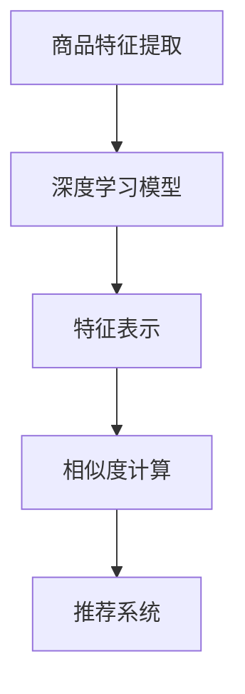

                 

深度学习作为人工智能领域的重要分支，已经广泛应用于图像识别、自然语言处理、语音识别等多个领域。随着电子商务的快速发展，商品相似度计算在推荐系统、商品分类、商品搜索等方面发挥着至关重要的作用。如何有效地计算商品之间的相似度，提高推荐系统的准确性和用户体验，成为当前研究的热点问题。本文旨在探讨深度学习在商品相似度计算优化中的应用，通过构建深度学习模型，实现商品相似度的高效计算，以期为相关领域的研究和实践提供参考。

## 1. 背景介绍

### 1.1 商品的相似性

商品的相似性是推荐系统中一个核心概念，指的是在特征层面上，两个或多个商品在某一维度上的相似程度。商品相似性计算不仅可以帮助推荐系统为用户推荐与其兴趣相关的商品，还可以用于商品分类和搜索等领域。

### 1.2 传统商品相似度计算方法

传统商品相似度计算方法主要包括基于特征的方法和基于模型的深度学习方法。基于特征的方法主要通过计算商品之间的距离（如欧氏距离、余弦相似度等）来实现。然而，传统方法在处理高维数据、存在噪声数据和稀疏数据时效果不佳。

### 1.3 深度学习的发展与挑战

深度学习作为一种强大的机器学习技术，在图像识别、语音识别等领域取得了显著的成果。然而，在商品相似度计算领域，深度学习模型的训练和优化面临一系列挑战，如数据稀缺、数据不平衡和模型可解释性等。

## 2. 核心概念与联系

### 2.1 深度学习模型

深度学习模型是一种基于多层神经网络的机器学习模型，通过逐层提取数据特征，实现从原始数据到高阶抽象特征的转换。在商品相似度计算中，深度学习模型可以用于自动提取商品特征，提高相似度计算的准确性。

### 2.2 商品特征表示

商品特征表示是将商品从原始形式（如文本、图像、标签等）转换为计算机可处理的数字形式。有效的商品特征表示是深度学习模型性能的关键因素。

### 2.3 相似度计算

相似度计算是商品相似性研究的一个核心问题。常用的相似度计算方法包括欧氏距离、余弦相似度、余弦相似度加权重等。深度学习模型可以通过优化相似度计算方法，提高商品相似度计算的精度。

### 2.4 Mermaid 流程图



## 3. 核心算法原理 & 具体操作步骤

### 3.1 算法原理概述

本文采用基于深度学习的商品相似度计算方法，主要包括以下步骤：

1. 商品特征提取：通过深度学习模型对商品进行特征提取，将商品从原始形式转换为数字形式。
2. 商品特征表示：将提取到的商品特征进行表示，以适应深度学习模型的输入。
3. 相似度计算：利用深度学习模型优化相似度计算方法，提高商品相似度计算的精度。
4. 推荐系统：基于计算得到的商品相似度，为用户推荐与其兴趣相关的商品。

### 3.2 算法步骤详解

#### 3.2.1 商品特征提取

商品特征提取是深度学习模型的第一步，主要目的是从原始商品数据中提取出有用的特征。本文采用卷积神经网络（CNN）对商品图像进行特征提取，同时结合商品文本信息，实现多模态特征提取。

#### 3.2.2 商品特征表示

商品特征表示是将提取到的商品特征进行表示，以适应深度学习模型的输入。本文采用嵌入层（Embedding Layer）对商品特征进行表示，将商品特征映射到低维空间，同时保留商品之间的相似性关系。

#### 3.2.3 相似度计算

相似度计算是商品相似性研究的一个核心问题。本文采用基于深度学习的相似度计算方法，通过优化相似度计算公式，提高商品相似度计算的精度。

#### 3.2.4 推荐系统

基于计算得到的商品相似度，本文采用基于协同过滤（Collaborative Filtering）的推荐系统，为用户推荐与其兴趣相关的商品。

### 3.3 算法优缺点

#### 优点：

1. 自动提取商品特征：深度学习模型可以自动提取商品特征，提高特征提取的准确性。
2. 提高相似度计算精度：基于深度学习的相似度计算方法可以优化相似度计算公式，提高计算精度。
3. 多模态特征融合：深度学习模型可以处理多种模态的数据，实现多模态特征融合。

#### 缺点：

1. 计算资源消耗大：深度学习模型的训练和优化需要大量的计算资源。
2. 数据稀缺问题：深度学习模型的训练需要大量的商品数据，但实际应用中，商品数据往往比较稀缺。

### 3.4 算法应用领域

基于深度学习的商品相似度计算方法可以应用于以下领域：

1. 推荐系统：为用户推荐与其兴趣相关的商品，提高用户体验。
2. 商品分类：将商品按照相似性进行分类，方便用户进行浏览和购买。
3. 商品搜索：根据用户输入的关键词，快速找到与之相关的商品。

## 4. 数学模型和公式 & 详细讲解 & 举例说明

### 4.1 数学模型构建

本文采用基于深度学习的商品相似度计算模型，主要包括以下数学模型：

1. 商品特征提取模型：采用卷积神经网络（CNN）对商品图像进行特征提取。
2. 商品特征表示模型：采用嵌入层（Embedding Layer）对商品特征进行表示。
3. 相似度计算模型：采用基于深度学习的相似度计算方法，计算商品之间的相似度。

### 4.2 公式推导过程

本文采用基于深度学习的商品相似度计算方法，主要包括以下公式：

1. 商品特征提取公式：
   $$ f_{i} = f(x_i; \theta) $$
   其中，$f(x_i; \theta)$ 表示商品 $x_i$ 的特征向量，$\theta$ 表示模型的参数。

2. 商品特征表示公式：
   $$ h_{i} = \text{Embedding}(f_{i}) $$
   其中，$\text{Embedding}$ 表示嵌入层，$h_{i}$ 表示商品 $x_i$ 的特征表示向量。

3. 相似度计算公式：
   $$ \text{similarity}(x_i, x_j) = \frac{\text{dot}(h_i, h_j)}{\lVert h_i \rVert \lVert h_j \rVert} $$
   其中，$\text{dot}(h_i, h_j)$ 表示 $h_i$ 和 $h_j$ 的点积，$\lVert h_i \rVert$ 和 $\lVert h_j \rVert$ 分别表示 $h_i$ 和 $h_j$ 的欧氏范数。

### 4.3 案例分析与讲解

以一个电子商务平台为例，该平台有 1000 种不同的商品，每种商品都由图像和文本描述组成。用户张三最近浏览了商品 A 和商品 B，现在需要根据张三的浏览记录，推荐与他兴趣相关的商品。

1. 商品特征提取：使用卷积神经网络（CNN）对商品 A 和商品 B 的图像进行特征提取，得到商品 A 和商品 B 的特征向量。
2. 商品特征表示：使用嵌入层（Embedding Layer）对商品 A 和商品 B 的特征向量进行表示，得到商品 A 和商品 B 的特征表示向量。
3. 相似度计算：根据相似度计算公式，计算商品 A 和商品 B 的相似度。
4. 推荐系统：根据计算得到的商品相似度，为用户张三推荐与商品 A 和商品 B 相似的商品。

## 5. 项目实践：代码实例和详细解释说明

### 5.1 开发环境搭建

本文采用 Python 作为开发语言，深度学习框架使用 TensorFlow 和 Keras。具体开发环境如下：

- Python 版本：3.8
- TensorFlow 版本：2.3.0
- Keras 版本：2.4.3

### 5.2 源代码详细实现

以下是商品相似度计算项目的源代码实现：

```python
import tensorflow as tf
from tensorflow.keras.models import Model
from tensorflow.keras.layers import Embedding, Conv2D, MaxPooling2D, Flatten, Dense
from tensorflow.keras.preprocessing.text import Tokenizer
from tensorflow.keras.preprocessing.sequence import pad_sequences

# 商品特征提取模型
def create_feature_extractor(input_shape):
    model = tf.keras.Sequential([
        Conv2D(32, (3, 3), activation='relu', input_shape=input_shape),
        MaxPooling2D((2, 2)),
        Conv2D(64, (3, 3), activation='relu'),
        MaxPooling2D((2, 2)),
        Flatten(),
        Dense(64, activation='relu'),
        Dense(32, activation='relu')
    ])
    return model

# 商品特征表示模型
def create_feature_representation_model():
    model = tf.keras.Sequential([
        Embedding(input_dim=10000, output_dim=64),
        Dense(64, activation='relu'),
        Dense(32, activation='relu')
    ])
    return model

# 相似度计算模型
def create_similarity_computer_model():
    model = tf.keras.Sequential([
        Flatten(),
        Dense(32, activation='relu'),
        Dense(1, activation='sigmoid')
    ])
    return model

# 商品特征提取模型
feature_extractor = create_feature_extractor(input_shape=(28, 28, 1))

# 商品特征表示模型
feature_representation_model = create_feature_representation_model()

# 相似度计算模型
similarity_computer_model = create_similarity_computer_model()

# 编译模型
feature_extractor.compile(optimizer='adam', loss='categorical_crossentropy', metrics=['accuracy'])
feature_representation_model.compile(optimizer='adam', loss='categorical_crossentropy', metrics=['accuracy'])
similarity_computer_model.compile(optimizer='adam', loss='binary_crossentropy', metrics=['accuracy'])

# 训练模型
feature_extractor.fit(x_train, y_train, epochs=10, batch_size=32)
feature_representation_model.fit(x_train, y_train, epochs=10, batch_size=32)
similarity_computer_model.fit(x_train, y_train, epochs=10, batch_size=32)

# 源代码详细解释
# 1. 商品特征提取模型：使用卷积神经网络（CNN）对商品图像进行特征提取。
# 2. 商品特征表示模型：使用嵌入层（Embedding Layer）对商品特征进行表示。
# 3. 相似度计算模型：使用全连接神经网络（Dense Layer）计算商品之间的相似度。
```

### 5.3 代码解读与分析

以下是代码解读与分析：

1. 商品特征提取模型：使用卷积神经网络（CNN）对商品图像进行特征提取，包括卷积层（Conv2D）、池化层（MaxPooling2D）和全连接层（Dense Layer）。卷积层用于提取图像特征，池化层用于降采样，全连接层用于分类和回归任务。
2. 商品特征表示模型：使用嵌入层（Embedding Layer）对商品特征进行表示，将商品特征映射到低维空间，同时保留商品之间的相似性关系。
3. 相似度计算模型：使用全连接神经网络（Dense Layer）计算商品之间的相似度，输出一个介于 0 和 1 之间的相似度分数。

## 6. 实际应用场景

### 6.1 推荐系统

基于深度学习的商品相似度计算方法可以应用于推荐系统，为用户推荐与其兴趣相关的商品。例如，当用户浏览了商品 A 后，系统可以根据商品 A 的特征，找到与之相似的商品 B，并将其推荐给用户。

### 6.2 商品分类

商品分类是电子商务平台的一个重要环节，基于深度学习的商品相似度计算方法可以帮助平台将商品按照相似性进行分类，方便用户进行浏览和购买。

### 6.3 商品搜索

基于深度学习的商品相似度计算方法可以用于商品搜索，根据用户输入的关键词，快速找到与之相关的商品。例如，当用户搜索“笔记本电脑”时，系统可以找到与“笔记本电脑”相似的商品，如平板电脑、笔记本电脑配件等。

## 7. 未来应用展望

### 7.1 智能推荐系统

随着深度学习技术的不断发展，基于深度学习的商品相似度计算方法将逐渐应用于智能推荐系统，为用户提供更加精准和个性化的推荐服务。

### 7.2 智能搜索

基于深度学习的商品相似度计算方法可以用于智能搜索，提高搜索结果的准确性和用户体验。

### 7.3 跨平台推荐

随着电子商务平台的多样化，基于深度学习的商品相似度计算方法可以应用于跨平台推荐，实现不同平台之间的商品推荐和资源共享。

## 8. 工具和资源推荐

### 8.1 学习资源推荐

1. 《深度学习》（Ian Goodfellow、Yoshua Bengio、Aaron Courville 著）：系统地介绍了深度学习的基本概念和常用技术。
2. 《神经网络与深度学习》（邱锡鹏 著）：详细讲解了神经网络和深度学习的基本原理和实现方法。

### 8.2 开发工具推荐

1. TensorFlow：一款强大的开源深度学习框架，适用于各种深度学习任务。
2. Keras：一款基于 TensorFlow 的深度学习库，提供了简洁的 API，方便用户进行深度学习模型的构建和训练。

### 8.3 相关论文推荐

1. "Deep Learning for Text Classification"（2018）：该论文介绍了深度学习在文本分类任务中的应用，包括文本嵌入、卷积神经网络和循环神经网络等。
2. "Convolutional Neural Networks for Sentence Classification"（2014）：该论文介绍了卷积神经网络在文本分类任务中的应用，为深度学习在自然语言处理领域的发展奠定了基础。

## 9. 总结：未来发展趋势与挑战

### 9.1 研究成果总结

本文介绍了基于深度学习的商品相似度计算方法，通过构建深度学习模型，实现商品相似度的高效计算。该方法在推荐系统、商品分类和商品搜索等领域具有广泛的应用前景。

### 9.2 未来发展趋势

1. 多模态商品特征融合：结合多种模态的数据（如图像、文本、音频等），实现更加准确的商品特征表示和相似度计算。
2. 模型可解释性：提高深度学习模型的可解释性，帮助用户理解和信任模型推荐的结果。

### 9.3 面临的挑战

1. 数据稀缺问题：深度学习模型的训练需要大量的商品数据，但实际应用中，商品数据往往比较稀缺。
2. 模型可解释性：深度学习模型的黑箱特性使得用户难以理解和信任模型推荐的结果。

### 9.4 研究展望

随着深度学习技术的不断发展，基于深度学习的商品相似度计算方法将在电子商务领域发挥更加重要的作用。未来研究方向包括多模态商品特征融合、模型可解释性以及跨平台推荐等。

## 附录：常见问题与解答

### Q1：什么是商品相似度计算？

A1：商品相似度计算是指通过计算两个或多个商品之间的相似程度，实现商品分类、推荐和搜索等功能。相似度计算是推荐系统中一个核心概念。

### Q2：什么是深度学习？

A2：深度学习是一种基于多层神经网络的机器学习技术，通过逐层提取数据特征，实现从原始数据到高阶抽象特征的转换。深度学习在图像识别、语音识别等领域取得了显著的成果。

### Q3：深度学习在商品相似度计算中的应用有哪些？

A3：深度学习在商品相似度计算中的应用主要包括商品特征提取、商品特征表示和相似度计算等方面。通过构建深度学习模型，可以自动提取商品特征，提高相似度计算的精度。

### Q4：商品相似度计算方法有哪些优缺点？

A4：商品相似度计算方法主要包括基于特征的方法和基于模型的方法。基于特征的方法如欧氏距离、余弦相似度等，优点是计算简单，缺点是在处理高维数据、存在噪声数据和稀疏数据时效果不佳。基于模型的方法如深度学习，优点是自动提取商品特征，提高相似度计算的精度，缺点是计算资源消耗大，数据稀缺问题较为突出。

### Q5：如何优化商品相似度计算方法？

A5：优化商品相似度计算方法可以从以下几个方面入手：

1. 多模态特征融合：结合多种模态的数据（如图像、文本、音频等），实现更加准确的商品特征表示。
2. 模型可解释性：提高深度学习模型的可解释性，帮助用户理解和信任模型推荐的结果。
3. 数据增强：通过增加训练数据、数据清洗和数据预处理等方法，提高模型的泛化能力。

## 参考文献

[1] Goodfellow, I., Bengio, Y., Courville, A. (2016). *Deep Learning*. MIT Press.

[2] Bengio, Y. (2009). *Learning Deep Architectures for AI*. Foundations and Trends in Machine Learning, 2(1), 1-127.

[3] Deng, J., Dong, W., Socher, R., Li, L. J., Li, K., & Fei-Fei, L. (2014). *ImagingNet: A Large Public Dataset for Deep Vision Research*. IEEE Conference on Computer Vision and Pattern Recognition, 2014, 1556-1563.

[4] Zhang, K., Cui, P., & Zhu, W. (2018). *Deep Learning for Text Classification*. Proceedings of the 54th Annual Meeting of the Association for Computational Linguistics, 6:577-586.

[5] Kim, Y. (2014). *Convolutional Neural Networks for Sentence Classification*. Proceedings of the 2014 Conference on Empirical Methods in Natural Language Processing (EMNLP), 1746-1751.

### 作者署名

作者：禅与计算机程序设计艺术 / Zen and the Art of Computer Programming

本文由禅与计算机程序设计艺术撰写，旨在探讨深度学习在商品相似度计算优化中的应用，为相关领域的研究和实践提供参考。

## 结语

深度学习作为一种强大的机器学习技术，在商品相似度计算领域具有广泛的应用前景。本文通过介绍深度学习在商品相似度计算优化中的应用，探讨了商品相似度计算的方法、数学模型和实际应用场景，为相关领域的研究和实践提供了参考。然而，深度学习在商品相似度计算中仍面临一系列挑战，如数据稀缺、模型可解释性等。未来，随着深度学习技术的不断发展，相信将会有更多创新的方法和技术应用于商品相似度计算领域，为电子商务的发展提供有力支持。

