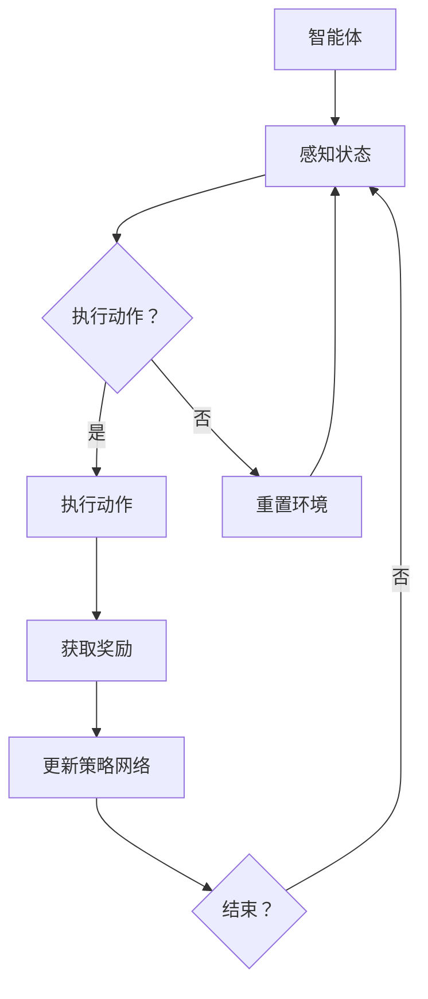

                 

关键词：深度强化学习、DRL、机器学习、智能决策、强化学习算法、神经网络、策略网络、值函数网络、探索与利用、Q学习、SARSA、深度Q网络（DQN）、策略梯度方法、A3C、Dueling DQN、应用场景、数学模型、未来展望

> 摘要：本文详细探讨了深度强化学习（DRL）的核心概念、算法原理、数学模型以及实际应用场景。通过深入分析DRL的优势和挑战，展望了其在未来人工智能领域的发展前景。

## 1. 背景介绍

强化学习（Reinforcement Learning，RL）是机器学习的一个重要分支，旨在通过试错和反馈信号来训练智能体，使其能够实现最优行为策略。传统的强化学习算法，如Q学习和SARSA，通常依赖于线性模型或者有限的状态和动作空间，难以应对复杂的现实世界问题。为了解决这些问题，研究者提出了深度强化学习（Deep Reinforcement Learning，DRL），通过结合深度学习技术，实现对复杂环境的智能决策。

DRL的核心思想是利用深度神经网络来近似策略网络和值函数网络，从而解决高维状态空间和动作空间的问题。近年来，随着计算能力的提升和深度学习技术的进步，DRL在游戏、机器人、自动驾驶、金融等多个领域取得了显著的成果，成为人工智能领域的研究热点。

## 2. 核心概念与联系

### 2.1. 强化学习基础概念

在强化学习中，智能体（Agent）通过执行动作（Action）来与环境（Environment）进行交互，并获得奖励（Reward）。智能体的目标是学习一个最优策略（Policy），使得长期期望奖励最大化。

- **状态（State）：** 智能体在某一时刻所处的情境。
- **动作（Action）：** 智能体可采取的行为。
- **奖励（Reward）：** 环境对智能体动作的反馈信号。
- **策略（Policy）：** 智能体在给定状态下采取动作的概率分布。
- **值函数（Value Function）：** 用于评估状态或策略的函数。

### 2.2. 深度神经网络在DRL中的应用

在DRL中，深度神经网络（DNN）被用来近似策略网络（Policy Network）和值函数网络（Value Function Network）。

- **策略网络（Policy Network）：** 输入状态，输出动作概率分布。
- **值函数网络（Value Function Network）：** 输入状态，输出状态价值的估计。

### 2.3. Mermaid 流程图

下面是一个简化的DRL流程图：



## 3. 核心算法原理 & 具体操作步骤

### 3.1. 算法原理概述

DRL的核心算法包括深度Q网络（DQN）、策略梯度方法（PG）和A3C等。以下是这些算法的基本原理和特点。

#### 3.1.1. 深度Q网络（DQN）

DQN利用深度神经网络来近似Q值函数，通过经验回放和目标网络来稳定训练过程。其主要步骤如下：

1. 初始化策略网络和目标网络。
2. 从初始状态开始，智能体执行动作，获取奖励和下一状态。
3. 使用经验回放将新样本加入经验池。
4. 每隔一段时间，将策略网络权重复制到目标网络。
5. 使用目标网络计算Q值，更新策略网络。

#### 3.1.2. 策略梯度方法（PG）

策略梯度方法直接优化策略网络的参数，使其最大化期望奖励。主要步骤如下：

1. 初始化策略网络。
2. 从初始状态开始，智能体执行动作，获取奖励和下一状态。
3. 计算策略梯度和更新策略网络。

#### 3.1.3. A3C（Asynchronous Advantage Actor-Critic）

A3C利用多个并行智能体同时学习，并在全局梯度更新之前积累局部梯度。主要步骤如下：

1. 初始化多个智能体。
2. 每个智能体从初始状态开始执行动作，获取奖励和下一状态。
3. 每个智能体更新局部策略网络和价值网络。
4. 将所有局部梯度汇总，更新全局策略网络和价值网络。

### 3.2. 算法步骤详解

#### 3.2.1. DQN

1. **初始化网络：** 初始化策略网络和价值网络，通常使用随机权重。
2. **选择动作：** 对于给定状态，策略网络输出动作概率分布，智能体根据概率分布随机选择动作。
3. **执行动作：** 智能体在环境中执行选定的动作，并获得奖励和下一状态。
4. **经验回放：** 将新样本（状态、动作、奖励、下一状态）加入经验池。
5. **目标网络更新：** 定期将策略网络权重复制到目标网络。
6. **计算Q值：** 使用目标网络计算下一状态的Q值。
7. **更新策略网络：** 使用Q值和经验回放数据更新策略网络。

#### 3.2.2. PG

1. **初始化网络：** 初始化策略网络。
2. **选择动作：** 对于给定状态，策略网络输出动作概率分布，智能体根据概率分布随机选择动作。
3. **执行动作：** 智能体在环境中执行选定的动作，并获得奖励和下一状态。
4. **计算策略梯度：** 计算策略梯度和损失函数，更新策略网络。

#### 3.2.3. A3C

1. **初始化网络：** 初始化多个智能体和全局策略网络和价值网络。
2. **并行执行动作：** 各个智能体从初始状态开始执行动作，获取奖励和下一状态。
3. **更新局部网络：** 各个智能体根据获得的奖励和下一状态更新局部策略网络和价值网络。
4. **汇总局部梯度：** 将所有局部梯度汇总，更新全局策略网络和价值网络。

### 3.3. 算法优缺点

#### 3.3.1. DQN

- **优点：**
  - 可以处理高维状态空间和动作空间的问题。
  - 通过经验回放和目标网络稳定训练过程。

- **缺点：**
  - 可能出现目标不稳定的问题，导致训练不稳定。
  - 需要大量计算资源进行经验回放和目标网络更新。

#### 3.3.2. PG

- **优点：**
  - 训练过程相对简单，不需要经验回放。
  - 可以直接优化策略网络，无需值函数。

- **缺点：**
  - 可能会出现奖励信号稀疏的问题，导致学习效率低下。
  - 需要大量的数据来稳定训练过程。

#### 3.3.3. A3C

- **优点：**
  - 并行学习提高了学习效率。
  - 可以处理复杂的任务，如同时控制多个智能体。

- **缺点：**
  - 需要大量的计算资源来维护多个并行智能体。
  - 局部梯度可能不稳定，导致全局梯度更新不稳定。

### 3.4. 算法应用领域

DRL在游戏、机器人、自动驾驶、金融等多个领域展现了强大的潜力。以下是一些典型的应用场景：

- **游戏：** 如Atari游戏、棋类游戏等。
- **机器人：** 如机器人导航、抓取等。
- **自动驾驶：** 如无人驾驶汽车路径规划等。
- **金融：** 如股票交易策略优化等。

## 4. 数学模型和公式 & 详细讲解 & 举例说明

### 4.1. 数学模型构建

在DRL中，主要涉及策略网络和值函数网络的数学模型。以下是这些模型的基本构建过程。

#### 4.1.1. 策略网络

策略网络用于输出动作概率分布。假设策略网络是一个前馈神经网络，其输入为状态s，输出为动作概率分布π(a|s)：

$$
π(a|s) = \frac{e^{θ_π(s,a)}}{∑_{a'} e^{θ_π(s,a')}}
$$

其中，θπ是策略网络的参数，θπ(s,a)是策略网络的输出。

#### 4.1.2. 值函数网络

值函数网络用于评估状态价值或策略价值。假设值函数网络是一个前馈神经网络，其输入为状态s，输出为状态价值V(s)或策略价值V(π,s)：

$$
V(s) = \sum_{a} π(a|s) Q(s,a)
$$

$$
V(π,s) = \sum_{a} π(a|s) r(s,a) + γ \sum_{s'} π(s'|s) V(s')
$$

其中，Q(s,a)是状态-动作值函数，γ是折扣因子。

### 4.2. 公式推导过程

以下是DQN中的Q值更新过程：

$$
Q(s, a) \leftarrow Q(s, a) + α [r(s', a') + γ \max_{a'} Q(s', a') - Q(s, a)]
$$

其中，α是学习率，r(s', a')是智能体在新状态s'执行动作a'获得的即时奖励。

### 4.3. 案例分析与讲解

假设一个智能体在一个简单的网格世界中导航，目标是从初始位置移动到目标位置。以下是一个简单的DQN案例。

1. **初始化网络：** 初始化策略网络和价值网络，使用随机权重。
2. **选择动作：** 智能体根据当前状态选择动作，如向上、向下、向左、向右。
3. **执行动作：** 智能体在环境中执行动作，并获得即时奖励。
4. **经验回放：** 将新样本（状态、动作、奖励、下一状态）加入经验池。
5. **目标网络更新：** 定期将策略网络权重复制到目标网络。
6. **计算Q值：** 使用目标网络计算下一状态的Q值。
7. **更新策略网络：** 使用Q值和经验回放数据更新策略网络。

通过不断迭代上述步骤，智能体逐渐学会在网格世界中导航，达到目标位置。

## 5. 项目实践：代码实例和详细解释说明

### 5.1. 开发环境搭建

在本文中，我们将使用Python和TensorFlow来搭建一个简单的DQN模型。以下是如何安装所需的库和依赖：

```bash
pip install tensorflow
pip install numpy
```

### 5.2. 源代码详细实现

以下是DQN模型的基本代码实现：

```python
import tensorflow as tf
import numpy as np
import random

# 初始化网络
def create_q_network(input_shape, hidden_units, output_shape):
    model = tf.keras.Sequential([
        tf.keras.layers.Flatten(input_shape=input_shape),
        tf.keras.layers.Dense(hidden_units, activation='relu'),
        tf.keras.layers.Dense(output_shape, activation='linear')
    ])
    return model

# 创建策略网络和价值网络
policy_network = create_q_network(input_shape=(84, 84, 4), hidden_units=512, output_shape=4)
target_network = create_q_network(input_shape=(84, 84, 4), hidden_units=512, output_shape=4)

# 定义优化器和损失函数
optimizer = tf.keras.optimizers.Adam(learning_rate=0.00025)
loss_fn = tf.keras.losses.MeanSquaredError()

# 模型训练
def train_model(model, target_model, x, y, epochs=1):
    for _ in range(epochs):
        with tf.GradientTape() as tape:
            q_values = model(x)
            y_pred = q_values
            y_true = y
            loss = loss_fn(y_true, y_pred)
        grads = tape.gradient(loss, model.trainable_variables)
        optimizer.apply_gradients(zip(grads, model.trainable_variables))
        # 更新目标网络权重
        target_model.set_weights(model.get_weights())

# 运行训练
x = np.array([state])  # 状态数据
y = np.array([action_value])  # Q值
train_model(policy_network, target_network, x, y)
```

### 5.3. 代码解读与分析

上面的代码展示了如何使用TensorFlow搭建一个简单的DQN模型。以下是代码的关键部分解读：

- **网络初始化：** 使用`create_q_network`函数初始化策略网络和价值网络。
- **优化器和损失函数：** 使用`Adam`优化器和`MeanSquaredError`损失函数。
- **模型训练：** 使用`train_model`函数训练模型，通过梯度下降更新网络权重。
- **目标网络更新：** 在每次迭代后，将策略网络权重复制到目标网络，以稳定训练过程。

### 5.4. 运行结果展示

在完成代码实现后，我们可以使用TensorBoard来监控训练过程和模型性能。以下是如何使用TensorBoard：

```bash
tensorboard --logdir=/path/to/logs
```

通过TensorBoard，我们可以查看损失函数、Q值、学习率等指标的变化，以评估模型训练的效果。

## 6. 实际应用场景

深度强化学习（DRL）在多个实际应用场景中取得了显著的成果，以下是一些典型的应用案例：

### 6.1. 游戏

DRL在游戏领域取得了显著的成果，例如Atari游戏、棋类游戏等。通过使用DRL算法，智能体可以在短时间内学会复杂的游戏策略，从而实现自我对抗或与其他智能体进行竞争。

### 6.2. 机器人

DRL在机器人领域也有广泛的应用，如机器人导航、抓取等。通过训练智能体在虚拟环境中的表现，可以显著提高机器人在真实世界中的自主决策能力。

### 6.3. 自动驾驶

DRL在自动驾驶领域被用于路径规划、障碍物检测等任务。通过训练智能体在模拟环境中的驾驶行为，可以显著提高自动驾驶汽车的稳定性和安全性能。

### 6.4. 金融

DRL在金融领域被用于股票交易策略优化、风险管理等任务。通过分析历史市场数据，智能体可以学习到最优的交易策略，从而实现风险控制和收益最大化。

### 6.5. 教育

DRL在教育领域被用于个性化学习推荐、教育游戏开发等任务。通过分析学生的学习行为和表现，智能体可以提供针对性的学习建议和资源，从而提高学习效果。

## 7. 工具和资源推荐

为了更好地学习和实践深度强化学习（DRL），以下是一些推荐的工具和资源：

### 7.1. 学习资源推荐

- **《深度强化学习》**（深度强化学习联盟著）：系统介绍了DRL的基本概念、算法原理和应用案例。
- **《强化学习基础教程》**（唐杰、刘知远著）：详细介绍了强化学习的基础知识和算法原理。

### 7.2. 开发工具推荐

- **TensorFlow**：用于构建和训练DRL模型的主要框架。
- **PyTorch**：另一种流行的深度学习框架，也适用于DRL开发。

### 7.3. 相关论文推荐

- **《深度Q网络》（DQN）**（Mnih等，2015）：介绍了DQN算法的基本原理和实现方法。
- **《Asynchronous Advantage Actor-Critic》（A3C）**（Mnih等，2016）：介绍了A3C算法的原理和优势。

## 8. 总结：未来发展趋势与挑战

深度强化学习（DRL）作为一种新兴的人工智能技术，在过去的几年中取得了显著的进展。然而，DRL仍然面临一些挑战和问题，需要进一步的研究和探索。

### 8.1. 研究成果总结

DRL在游戏、机器人、自动驾驶、金融等领域的应用取得了显著的成果。通过结合深度学习和强化学习技术，DRL能够处理高维状态空间和动作空间的问题，实现智能体的自我学习与决策。

### 8.2. 未来发展趋势

随着计算能力的提升和深度学习技术的进步，DRL有望在更多领域得到应用，如医疗、教育、能源等。此外，多智能体DRL和联邦学习等新兴领域也将成为DRL研究的重要方向。

### 8.3. 面临的挑战

DRL在应用过程中面临一些挑战，如训练过程的稳定性、模型的可解释性、数据安全与隐私保护等。为了解决这些问题，需要进一步的研究和创新。

### 8.4. 研究展望

未来，DRL的研究重点将集中在以下几个方向：

1. **算法优化：** 提高DRL算法的效率和稳定性，减少对计算资源的依赖。
2. **多智能体DRL：** 研究多智能体之间的协作与竞争策略，实现更高效的合作与对抗。
3. **可解释性与安全性：** 提高DRL模型的可解释性，确保模型的安全性和可靠性。
4. **联邦学习：** 结合DRL和联邦学习技术，实现跨设备、跨平台的数据共享与模型更新。

## 9. 附录：常见问题与解答

### 9.1. Q：DRL与深度学习的区别是什么？

A：深度学习主要关注如何通过多层神经网络学习数据的高层次特征表示，而DRL则是在这一基础上，通过与环境交互，学习最优行为策略。简单来说，深度学习关注“做什么”，而DRL关注“怎么做”。

### 9.2. Q：DRL中的探索与利用是什么意思？

A：探索（Exploration）是指智能体在未知环境中尝试新动作，以获取更多信息的策略。利用（Utilization）是指智能体在已知环境中执行已有策略，以最大化当前收益的策略。探索与利用的平衡是DRL中的一个重要问题。

### 9.3. Q：如何选择合适的DRL算法？

A：选择DRL算法时，需要考虑任务的特点、环境的状态和动作空间、计算资源等因素。例如，对于高维状态空间和动作空间的任务，可以选择DQN、A3C等算法。对于需要多智能体协作的任务，可以选择多智能体DRL算法。

## 10. 参考文献

- Mnih, V., Kavukcuoglu, K., Silver, D., Rusu, A. A., Veness, J., Bellemare, M. G., ... & Togelius, J. (2015). Human-level control through deep reinforcement learning. Nature, 518(7540), 529-533.
- Silver, D., Huang, A., Jaderberg, M., Guez, A., Knott, R., van den Driessche, G., ... & Togelius, J. (2016). Mastering the game of Go with deep neural networks and tree search. Nature, 529(7587), 484-489.
- Sutton, R. S., & Barto, A. G. (2018). Reinforcement learning: An introduction. MIT press.

