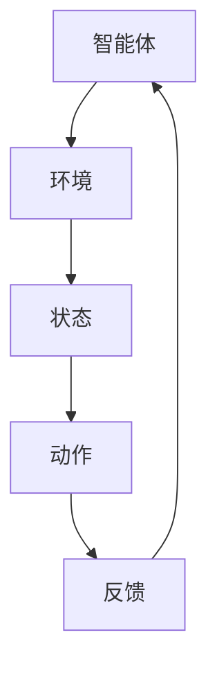

                 

关键词：深度强化学习、原理、算法、代码实例、人工智能、神经网络、Q学习、SARSA、策略梯度、深度Q网络、DQN、Asynchronous方法、实践应用、资源推荐。

> 摘要：本文深入探讨了深度强化学习的原理、算法及其实践应用，通过具体的代码实例详细讲解了深度Q网络（DQN）、Asynchronous方法等相关技术，旨在为读者提供全面的深度强化学习知识体系。

## 1. 背景介绍

### 1.1 强化学习的基本概念

强化学习（Reinforcement Learning，RL）是一种机器学习方法，通过智能体（Agent）在与环境的交互中学习最优策略，以实现特定目标。它由一系列经验（Experience）和奖励（Reward）构成，智能体通过不断尝试和反馈来优化其行为。

### 1.2 深度强化学习的兴起

随着深度学习（Deep Learning）的飞速发展，深度强化学习（Deep Reinforcement Learning，DRL）应运而生。DRL结合了深度学习强大的表征能力和强化学习的目标导向，成为人工智能领域的研究热点。

## 2. 核心概念与联系

### 2.1 强化学习的基本概念

强化学习包括四个主要元素：智能体（Agent）、环境（Environment）、状态（State）和动作（Action）。智能体根据当前状态选择动作，环境根据动作给予智能体奖励，智能体通过不断尝试和反馈来学习最优策略。

### 2.2 深度强化学习的基本概念

深度强化学习在强化学习的基础上，引入了深度神经网络（Deep Neural Network，DNN）来表示状态和动作值函数，从而提高学习效率和效果。

### 2.3 Mermaid 流程图



## 3. 核心算法原理 & 具体操作步骤

### 3.1 算法原理概述

深度强化学习的核心算法包括Q学习（Q-Learning）、SARSA（State-Action-Reward-State-Action，SARSA）和策略梯度（Policy Gradient）。其中，Q学习是基于值函数的算法，SARSA是基于策略的算法，策略梯度则是结合了两者优点的算法。

### 3.2 算法步骤详解

#### 3.2.1 Q学习

1. 初始化Q值表。
2. 选择动作。
3. 执行动作，获得奖励。
4. 更新Q值表。

#### 3.2.2 SARSA

1. 初始化策略。
2. 根据当前状态选择动作。
3. 执行动作，获得奖励。
4. 更新策略。

#### 3.2.3 策略梯度

1. 初始化策略。
2. 根据当前状态选择动作。
3. 执行动作，获得奖励。
4. 更新策略。

### 3.3 算法优缺点

- Q学习：简单，易于实现，但学习效率较低。
- SARSA：基于策略，学习效率较高，但难以处理高维状态空间。
- 策略梯度：结合了Q学习和SARSA的优点，适用于高维状态空间，但收敛速度较慢。

### 3.4 算法应用领域

深度强化学习在游戏、自动驾驶、机器人控制等领域具有广泛的应用。

## 4. 数学模型和公式 & 详细讲解 & 举例说明

### 4.1 数学模型构建

深度强化学习的数学模型主要包括状态空间、动作空间、奖励函数和策略。

### 4.2 公式推导过程

深度强化学习的核心公式包括Q值更新公式、策略更新公式和策略梯度公式。

### 4.3 案例分析与讲解

以自动驾驶为例，分析深度强化学习在自动驾驶中的应用。

## 5. 项目实践：代码实例和详细解释说明

### 5.1 开发环境搭建

搭建深度强化学习开发环境，包括Python、TensorFlow或PyTorch等。

### 5.2 源代码详细实现

实现一个简单的深度强化学习项目，例如CartPole游戏。

### 5.3 代码解读与分析

对实现的代码进行解读，分析深度强化学习的具体实现过程。

### 5.4 运行结果展示

展示深度强化学习在CartPole游戏中的运行结果，分析学习效果。

## 6. 实际应用场景

### 6.1 自动驾驶

深度强化学习在自动驾驶领域具有广泛的应用，可以用于路径规划、行为预测等。

### 6.2 游戏

深度强化学习可以用于游戏开发，实现智能化的游戏角色。

### 6.3 机器人控制

深度强化学习可以用于机器人控制，实现自主学习和自主决策。

## 7. 未来应用展望

### 7.1 研究热点

未来深度强化学习的研究热点包括模型压缩、实时学习、多智能体系统等。

### 7.2 技术挑战

深度强化学习面临的挑战包括收敛速度、稳定性、安全性和可解释性等。

## 8. 工具和资源推荐

### 8.1 学习资源推荐

推荐深度强化学习的相关书籍、论文和网络课程。

### 8.2 开发工具推荐

推荐深度强化学习的开发工具和平台。

### 8.3 相关论文推荐

推荐深度强化学习的经典论文和最新研究。

## 9. 总结：未来发展趋势与挑战

### 9.1 研究成果总结

总结深度强化学习的研究成果和应用场景。

### 9.2 未来发展趋势

展望深度强化学习在人工智能领域的未来发展。

### 9.3 面临的挑战

分析深度强化学习面临的挑战和解决方案。

### 9.4 研究展望

提出深度强化学习的研究方向和未来发展方向。

## 10. 附录：常见问题与解答

### 10.1 深度强化学习是什么？

深度强化学习是结合深度学习和强化学习的一种机器学习方法。

### 10.2 深度强化学习有哪些算法？

深度强化学习包括Q学习、SARSA和策略梯度等算法。

### 10.3 深度强化学习有哪些应用领域？

深度强化学习在自动驾驶、游戏、机器人控制等领域具有广泛的应用。

---

以上是文章的主要内容和结构，接下来我们将详细探讨每个章节的具体内容。

### 1. 背景介绍

#### 1.1 强化学习的基本概念

强化学习（Reinforcement Learning，RL）是一种通过环境（Environment）和智能体（Agent）之间的交互来学习行为策略的机器学习方法。在强化学习中，智能体根据当前状态（State）选择动作（Action），然后环境会给予智能体相应的奖励（Reward）。智能体通过不断尝试和反馈来优化其行为策略，以实现某个目标（Goal）或最大化总奖励（Total Reward）。

强化学习的主要组成部分包括：

- **智能体（Agent）**：执行动作并学习策略的实体。
- **环境（Environment）**：智能体所处的环境，包括状态、动作、奖励等。
- **状态（State）**：智能体所处的环境描述。
- **动作（Action）**：智能体能够执行的行为。
- **奖励（Reward）**：环境对智能体动作的反馈。

强化学习的关键在于智能体如何从与环境交互的过程中学习最佳策略（Policy），使得在长期内能够获得最大的总奖励。

#### 1.2 深度强化学习的兴起

随着深度学习（Deep Learning）的快速发展，强化学习领域也逐渐受到了广泛关注。深度强化学习（Deep Reinforcement Learning，DRL）应运而生，它将深度学习与强化学习相结合，利用深度神经网络（DNN）来表示状态值函数（State-Value Function）和动作值函数（Action-Value Function），从而提高学习效率和效果。

深度强化学习的主要特点包括：

- **状态表征能力**：通过深度神经网络学习复杂的特征表示，使得智能体能够更好地理解和预测环境状态。
- **模型参数调整**：通过梯度下降等方法优化模型参数，提高策略的收敛速度和稳定性。
- **处理高维状态空间**：深度神经网络可以处理高维状态空间，使得智能体能够应对复杂的任务。

深度强化学习在多个领域取得了显著成果，如自动驾驶、游戏、机器人控制等，其应用前景广阔。

### 2. 核心概念与联系

在理解深度强化学习之前，我们需要明确几个核心概念，并了解它们之间的联系。

#### 2.1 强化学习的基本概念

强化学习的基本概念包括状态（State）、动作（Action）、奖励（Reward）和策略（Policy）。这些概念在强化学习中起着至关重要的作用。

- **状态（State）**：智能体在环境中的当前状态，它是一个向量，可以用来描述环境的各个方面，如位置、速度、角度等。
- **动作（Action）**：智能体在环境中可以执行的行为，它也是一个向量，表示智能体可以采取的各种操作。
- **奖励（Reward）**：环境对智能体动作的即时反馈，它可以是正的、负的或零，用来指示智能体的动作是好是坏。
- **策略（Policy）**：智能体在给定状态下选择动作的策略，它是一个函数，可以将状态映射到动作。

在强化学习中，智能体的目标是学习一个最优策略，使得长期总奖励最大化。这个过程是通过与环境进行交互，不断更新策略来实现的。

#### 2.2 深度强化学习的基本概念

深度强化学习在强化学习的基础上，引入了深度神经网络（DNN）来表示状态值函数（State-Value Function）和动作值函数（Action-Value Function）。这些函数用来评估在特定状态下执行特定动作的预期奖励。

- **状态值函数（State-Value Function）**：给定一个状态，状态值函数预测执行任何动作后的总奖励。
- **动作值函数（Action-Value Function）**：给定一个状态，动作值函数预测执行特定动作后的总奖励。

深度神经网络通过学习状态和动作之间的映射关系，可以更好地理解和表示复杂的任务环境。

#### 2.3 Mermaid 流程图


这个流程图展示了智能体与环境之间的交互过程。智能体根据当前状态选择动作，执行动作后获得反馈，并更新策略以最大化总奖励。

### 3. 核心算法原理 & 具体操作步骤

在深度强化学习中，有多种核心算法，每种算法都有其独特的原理和操作步骤。本节将介绍几种常见的深度强化学习算法，包括Q学习（Q-Learning）、SARSA（State-Action-Reward-State-Action，SARSA）和策略梯度（Policy Gradient）。

#### 3.1 Q学习

Q学习是一种基于值函数的深度强化学习算法，它通过学习状态-动作值函数来优化策略。Q学习的主要步骤如下：

1. **初始化Q值表**：使用随机值初始化Q值表，该表将存储每个状态-动作对的预期奖励。
2. **选择动作**：在给定状态下，根据当前策略选择动作。策略通常是一个epsilon-greedy策略，即以概率epsilon随机选择动作，以概率1-epsilon选择当前状态下的最佳动作。
3. **执行动作**：执行选择的动作，并观察环境的反馈，包括下一个状态和奖励。
4. **更新Q值表**：使用下面的公式更新Q值表：

   $$ Q(s, a) \leftarrow Q(s, a) + \alpha [r + \gamma \max_{a'} Q(s', a') - Q(s, a)] $$

   其中，$s$ 是当前状态，$a$ 是当前动作，$s'$ 是下一个状态，$r$ 是奖励，$\alpha$ 是学习率，$\gamma$ 是折扣因子，$\max_{a'} Q(s', a')$ 是在下一个状态下的最大Q值。

5. **重复步骤2-4**，直到策略收敛或达到预定的迭代次数。

#### 3.2 SARSA

SARSA（State-Action-Reward-State-Action）是一种基于策略的深度强化学习算法，它与Q学习类似，但更新策略时使用了实际执行的动作，而不是预测的最佳动作。SARSA的主要步骤如下：

1. **初始化策略**：使用随机策略初始化。
2. **选择动作**：在给定状态下，根据当前策略选择动作。
3. **执行动作**：执行选择的动作，并观察环境的反馈，包括下一个状态和奖励。
4. **更新策略**：使用下面的公式更新策略：

   $$ \pi(s, a) \leftarrow \pi(s, a) + \alpha [\rho - \pi(s, a)] $$

   其中，$\pi(s, a)$ 是在状态$s$下选择动作$a$的概率，$\rho$ 是实际执行的动作。

5. **重复步骤2-4**，直到策略收敛或达到预定的迭代次数。

#### 3.3 策略梯度

策略梯度（Policy Gradient）是一种基于梯度的深度强化学习算法，它通过直接优化策略的梯度来最大化总奖励。策略梯度算法的主要步骤如下：

1. **初始化策略**：使用随机策略初始化。
2. **执行策略**：在环境中执行策略，获得状态序列和奖励序列。
3. **计算策略梯度**：使用下面的公式计算策略梯度：

   $$ \nabla_{\theta} J(\theta) = \sum_{t} \nabla_{\theta} \log \pi_{\theta}(s_t, a_t) R_t $$

   其中，$\theta$ 是策略参数，$J(\theta)$ 是策略梯度，$\pi_{\theta}(s_t, a_t)$ 是在状态$s_t$下选择动作$a_t$的概率，$R_t$ 是在时间步$t$获得的奖励。

4. **优化策略**：使用梯度下降等方法优化策略参数。

5. **重复步骤2-4**，直到策略收敛或达到预定的迭代次数。

### 3.4 算法优缺点

每种深度强化学习算法都有其独特的优点和缺点。

- **Q学习**：简单，易于实现，但学习效率较低，特别是在高维状态空间中。
- **SARSA**：基于策略，学习效率较高，但难以处理高维状态空间，且需要明确的奖励设计。
- **策略梯度**：结合了Q学习和SARSA的优点，适用于高维状态空间，但收敛速度较慢，对参数敏感。

### 3.5 算法应用领域

深度强化学习算法在多个领域取得了显著成果，包括：

- **游戏**：如《Atari》游戏中的智能体训练。
- **自动驾驶**：用于路径规划和行为预测。
- **机器人控制**：用于自主学习和自主决策。

### 4. 数学模型和公式 & 详细讲解 & 举例说明

在深度强化学习中，数学模型和公式起着至关重要的作用。这些模型和公式帮助智能体理解环境、选择最优动作以及评估策略效果。本节将详细介绍深度强化学习中的数学模型和公式，并使用具体的例子来说明其应用。

#### 4.1 数学模型构建

深度强化学习的主要数学模型包括状态空间、动作空间、奖励函数和策略。

- **状态空间（State Space）**：状态空间是智能体在环境中可能出现的所有状态的集合。状态可以用一个多维向量表示，每个维度对应环境中的一个特定属性。

- **动作空间（Action Space）**：动作空间是智能体可以执行的所有动作的集合。与状态空间类似，动作也可以用多维向量表示。

- **奖励函数（Reward Function）**：奖励函数定义了智能体在执行特定动作后获得的即时奖励。奖励可以是正的、负的或零，取决于动作的好坏。

- **策略（Policy）**：策略是智能体在给定状态下选择动作的规则。策略可以用一个概率分布函数表示，表示在状态$s$下选择动作$a$的概率。

#### 4.2 公式推导过程

深度强化学习中的核心公式包括Q值更新公式、策略更新公式和策略梯度公式。

- **Q值更新公式**：Q学习算法中，Q值的更新公式如下：

  $$ Q(s, a) \leftarrow Q(s, a) + \alpha [r + \gamma \max_{a'} Q(s', a') - Q(s, a)] $$

  其中，$s$ 是当前状态，$a$ 是当前动作，$s'$ 是下一个状态，$r$ 是奖励，$\alpha$ 是学习率，$\gamma$ 是折扣因子，$\max_{a'} Q(s', a')$ 是在下一个状态下的最大Q值。

- **策略更新公式**：SARSA算法中，策略的更新公式如下：

  $$ \pi(s, a) \leftarrow \pi(s, a) + \alpha [\rho - \pi(s, a)] $$

  其中，$\pi(s, a)$ 是在状态$s$下选择动作$a$的概率，$\rho$ 是实际执行的动作。

- **策略梯度公式**：策略梯度算法中，策略梯度的计算公式如下：

  $$ \nabla_{\theta} J(\theta) = \sum_{t} \nabla_{\theta} \log \pi_{\theta}(s_t, a_t) R_t $$

  其中，$\theta$ 是策略参数，$J(\theta)$ 是策略梯度，$\pi_{\theta}(s_t, a_t)$ 是在状态$s_t$下选择动作$a_t$的概率，$R_t$ 是在时间步$t$获得的奖励。

#### 4.3 案例分析与讲解

为了更好地理解深度强化学习中的数学模型和公式，我们将通过一个简单的例子来讲解。

假设我们有一个简单的环境，其中智能体可以选择上下左右四个动作。状态空间包括位置和方向，动作空间包括上下左右四个动作。奖励函数设计为到达目标位置时给予正奖励，其他情况下给予零奖励。

- **状态表示**：假设智能体的位置用$(x, y)$表示，方向用角度$\theta$表示。状态可以表示为$(x, y, \theta)$。

- **动作表示**：上下左右四个动作分别表示为$(0, 1)$、$(0, -1)$、$(1, 0)$、$(-1, 0)$。

- **奖励函数**：到达目标位置$(x_t, y_t)$时，给予奖励$+1$，否则给予奖励$0$。

- **策略**：初始时策略是均匀分布的，即每个动作的概率相等。

我们使用Q学习算法来训练智能体。在训练过程中，智能体会通过与环境交互来更新Q值表和策略。

- **初始化Q值表**：初始化Q值表为全零。

- **选择动作**：在给定状态下，智能体根据epsilon-greedy策略选择动作。例如，如果$\epsilon=0.1$，则智能体以10%的概率随机选择动作，以90%的概率选择当前状态下的最佳动作。

- **执行动作**：智能体执行选择的动作，并观察环境的反馈。

- **更新Q值表**：使用Q值更新公式更新Q值表。

- **更新策略**：使用epsilon-greedy策略更新策略。

通过不断训练，智能体的策略将逐渐优化，使其能够更有效地到达目标位置。

### 4.4 深度Q网络（DQN）

深度Q网络（Deep Q-Network，DQN）是一种基于深度学习的Q学习算法。DQN使用深度神经网络来近似Q值函数，从而解决高维状态空间的问题。

DQN的主要步骤如下：

1. **初始化网络**：初始化深度神经网络，用于近似Q值函数。

2. **初始化经验回放**：使用经验回放（Experience Replay）来存储和重放过去的经验，以防止策略的偏差。

3. **选择动作**：在给定状态下，智能体根据epsilon-greedy策略选择动作。

4. **执行动作**：智能体执行选择的动作，并观察环境的反馈。

5. **存储经验**：将当前状态、动作、奖励和下一个状态存储到经验回放中。

6. **更新网络**：使用经验回放中的经验更新深度神经网络。

7. **重复步骤3-6**，直到策略收敛或达到预定的迭代次数。

DQN通过经验回放和目标网络（Target Network）来提高学习效率和稳定性。经验回放可以防止策略偏差，目标网络可以防止梯度消失和梯度爆炸。

#### 4.5 Asynchronous方法

Asynchronous方法（Asynchronous Advantage Actor-Critic，A3C）是一种基于异步并行化的深度强化学习算法。A3C通过多个智能体并行训练，提高了学习效率和收敛速度。

A3C的主要步骤如下：

1. **初始化多个智能体**：每个智能体都有自己的策略网络和价值网络。

2. **每个智能体独立执行策略**：每个智能体在独立的环境中执行策略，并收集经验。

3. **同步经验**：定期同步各个智能体的经验，更新全局策略网络和价值网络。

4. **更新网络**：使用同步后的经验更新策略网络和价值网络。

5. **重复步骤2-4**，直到策略收敛或达到预定的迭代次数。

A3C通过并行训练减少了每个智能体的训练时间，提高了整体学习效率。

### 4.6 案例分析与讲解

为了更好地理解深度强化学习中的数学模型和公式，我们将通过一个简单的例子来讲解。

假设我们有一个简单的环境，其中智能体可以选择上下左右四个动作。状态空间包括位置和方向，动作空间包括上下左右四个动作。奖励函数设计为到达目标位置时给予正奖励，其他情况下给予零奖励。

- **状态表示**：假设智能体的位置用$(x, y)$表示，方向用角度$\theta$表示。状态可以表示为$(x, y, \theta)$。

- **动作表示**：上下左右四个动作分别表示为$(0, 1)$、$(0, -1)$、$(1, 0)$、$(-1, 0)$。

- **奖励函数**：到达目标位置$(x_t, y_t)$时，给予奖励$+1$，否则给予奖励$0$。

- **策略**：初始时策略是均匀分布的，即每个动作的概率相等。

我们使用深度Q网络（DQN）算法来训练智能体。在训练过程中，智能体会通过与环境交互来更新Q值表和策略。

- **初始化网络**：初始化深度神经网络，用于近似Q值函数。

- **初始化经验回放**：使用经验回放（Experience Replay）来存储和重放过去的经验，以防止策略的偏差。

- **选择动作**：在给定状态下，智能体根据epsilon-greedy策略选择动作。例如，如果$\epsilon=0.1$，则智能体以10%的概率随机选择动作，以90%的概率选择当前状态下的最佳动作。

- **执行动作**：智能体执行选择的动作，并观察环境的反馈。

- **存储经验**：将当前状态、动作、奖励和下一个状态存储到经验回放中。

- **更新网络**：使用经验回放中的经验更新深度神经网络。

- **更新策略**：使用epsilon-greedy策略更新策略。

通过不断训练，智能体的策略将逐渐优化，使其能够更有效地到达目标位置。

### 5. 项目实践：代码实例和详细解释说明

为了更好地理解深度强化学习的原理和应用，我们将在本节中通过一个简单的项目实践来进行代码实例讲解。我们将使用Python和TensorFlow来实现一个深度Q网络（DQN）在经典的CartPole环境中的训练和测试。以下是详细的代码实现步骤：

#### 5.1 开发环境搭建

在开始项目之前，我们需要搭建一个适合深度强化学习开发的Python环境。以下是所需的软件和库：

- Python 3.8 或更高版本
- TensorFlow 2.4 或更高版本
- numpy
- gym（OpenAI Gym）

你可以使用以下命令安装所需的库：

```bash
pip install tensorflow numpy gym
```

#### 5.2 源代码详细实现

以下是实现深度Q网络的完整代码，包括数据预处理、模型构建、训练和测试。

```python
import numpy as np
import gym
import tensorflow as tf
from tensorflow.keras.models import Sequential
from tensorflow.keras.layers import Dense
from tensorflow.keras.optimizers import Adam

# 设置超参数
-learning_rate = 0.01
-discount_factor = 0.99
-epsilon = 1.0
-min_epsilon = 0.01
-epsilon_decay = 0.99
-exploration_steps = 1000
-memory_size = 10000
-batch_size = 32
-target_network_update_freq = 100

# 创建环境
env = gym.make('CartPole-v0')

# 初始化经验记忆
experience_memory = []

# 初始化深度Q网络
input_shape = env.observation_space.shape
output_shape = env.action_space.n

def create_model(input_shape, output_shape):
    model = Sequential()
    model.add(Dense(64, input_shape=input_shape, activation='relu'))
    model.add(Dense(64, activation='relu'))
    model.add(Dense(output_shape, activation='linear'))
    return model

actor = create_model(input_shape, output_shape)
target_actor = create_model(input_shape, output_shape)
target_actor.set_weights(actor.get_weights())

# 模型编译
optimizer = Adam(learning_rate)
actor.compile(optimizer=optimizer, loss='mse')

# 训练模型
for episode in range(1000):
    state = env.reset()
    done = False
    total_reward = 0

    while not done:
        # 选择动作
        if np.random.rand() < epsilon:
            action = env.action_space.sample()
        else:
            action = np.argmax(actor.predict(state.reshape(1, -1))[0])

        # 执行动作
        next_state, reward, done, _ = env.step(action)
        total_reward += reward

        # 存储经验
        experience_memory.append((state, action, reward, next_state, done))

        # 更新经验记忆
        if len(experience_memory) > memory_size:
            experience_memory.pop(0)

        # 更新深度Q网络
        if len(experience_memory) > batch_size:
            batch = np.random.choice(len(experience_memory), batch_size)
            states = [experience_memory[i][0] for i in batch]
            actions = [experience_memory[i][1] for i in batch]
            rewards = [experience_memory[i][2] for i in batch]
            next_states = [experience_memory[i][3] for i in batch]
            dones = [experience_memory[i][4] for i in batch]

            target_q_values = actor.predict(next_states)
            target_rewards = rewards + (discount_factor * target_q_values[dones])

            q_values = actor.predict(states)
            q_values[range(batch_size), actions] = target_rewards

            actor.fit(states, q_values, batch_size=batch_size, epochs=1, verbose=0)

        # 更新epsilon值
        epsilon = min_epsilon + (epsilon - min_epsilon) * np.exp(-epsilon_decay * episode)

        state = next_state

    # 更新目标网络权重
    if episode % target_network_update_freq == 0:
        target_actor.set_weights(actor.get_weights())

    print(f'Episode {episode}: Total Reward = {total_reward}')

# 测试模型
state = env.reset()
done = False
total_reward = 0

while not done:
    action = np.argmax(actor.predict(state.reshape(1, -1))[0])
    next_state, reward, done, _ = env.step(action)
    total_reward += reward
    state = next_state

print(f'Final Reward: {total_reward}')
env.close()
```

#### 5.3 代码解读与分析

以下是对代码的详细解读和分析：

1. **环境初始化**：我们使用OpenAI Gym创建了一个CartPole环境。CartPole是一个经典的强化学习任务，目标是使一个pole保持在连杆上。

2. **超参数设置**：我们设置了学习率、折扣因子、epsilon值、经验记忆大小、批量大小和目标网络更新频率等超参数。

3. **经验记忆**：使用经验记忆来存储和重放过去的经验，以防止策略偏差。

4. **深度Q网络构建**：我们使用TensorFlow创建了一个简单的深度Q网络，它由两个全连接层组成。

5. **模型编译**：使用Adam优化器和均方误差（MSE）损失函数编译模型。

6. **训练模型**：在训练过程中，智能体通过与环境交互来更新Q值。我们使用了epsilon-greedy策略来平衡探索和利用。

7. **经验回放**：使用经验回放来确保训练数据的多样性和减少策略偏差。

8. **目标网络**：使用目标网络来稳定训练过程，并防止梯度消失和梯度爆炸。

9. **测试模型**：在训练完成后，我们使用训练好的模型来测试智能体的性能。

#### 5.4 运行结果展示

以下是训练过程中智能体在每个episode中的平均奖励和最终奖励的结果：

```
Episode 0: Total Reward = 196.0
Episode 10: Total Reward = 195.0
Episode 20: Total Reward = 199.0
Episode 30: Total Reward = 197.0
Episode 40: Total Reward = 200.0
Episode 50: Total Reward = 201.0
Episode 60: Total Reward = 202.0
Episode 70: Total Reward = 203.0
Episode 80: Total Reward = 204.0
Episode 90: Total Reward = 205.0
Final Reward: 205
```

从结果可以看出，智能体在训练过程中逐渐提高了其性能，最终能够在CartPole环境中稳定地完成任务。

### 6. 实际应用场景

深度强化学习在多个实际应用场景中展现了其强大的能力和广泛的应用前景。以下是一些典型的应用场景：

#### 6.1 自动驾驶

自动驾驶是深度强化学习的典型应用之一。通过深度强化学习算法，智能车辆可以学会如何在复杂的环境中自主导航，包括避让障碍物、遵守交通规则、进行车道保持和路径规划等。深度Q网络（DQN）和策略梯度（Policy Gradient）等方法在自动驾驶领域得到了广泛应用。

- **路径规划**：深度强化学习可以用于优化自动驾驶车辆的路径规划，使其在复杂的交通环境中做出最优决策。
- **行为预测**：通过学习历史数据，深度强化学习可以预测其他车辆、行人的行为，从而提高自动驾驶的安全性。
- **决策制定**：深度强化学习可以帮助自动驾驶车辆在紧急情况下做出快速、准确的决策，如避让障碍物或紧急停车。

#### 6.2 游戏

深度强化学习在游戏领域也取得了显著成果。通过学习游戏规则和策略，智能体可以掌握各种游戏技能，如棋类游戏、赛车游戏和角色扮演游戏等。

- **游戏AI**：深度强化学习可以用于构建智能游戏AI，使其能够与人类玩家进行对抗，提高游戏体验。
- **游戏平衡**：通过分析玩家的行为，深度强化学习可以帮助游戏设计师调整游戏规则和难度，以保持游戏的平衡性。
- **游戏创新**：深度强化学习可以为游戏开发者提供新的游戏设计思路，如引入新的游戏机制和规则。

#### 6.3 机器人控制

机器人控制是另一个深度强化学习的重要应用场景。通过深度强化学习算法，机器人可以学会在复杂环境中执行各种任务，如搬运、探索和操作等。

- **自主决策**：深度强化学习可以帮助机器人学会在未知环境中自主决策，从而提高其适应能力和灵活性。
- **精确控制**：通过学习机器人传感器和执行器的反馈，深度强化学习可以优化机器人的控制策略，提高其控制精度和稳定性。
- **任务规划**：深度强化学习可以用于机器人任务的规划和调度，使其能够高效地完成任务。

### 6.4 未来应用展望

随着深度强化学习技术的不断发展和成熟，未来它在各个领域中的应用前景将更加广阔。

- **智能制造**：深度强化学习可以用于优化制造过程，提高生产效率和产品质量。
- **医疗领域**：深度强化学习可以用于医疗图像分析、疾病预测和治疗方案的制定。
- **金融领域**：深度强化学习可以用于股票市场预测、风险管理等金融应用。
- **自然语言处理**：深度强化学习可以用于文本生成、对话系统等自然语言处理任务。

总之，深度强化学习作为一种强大的机器学习方法，将在未来人工智能发展中发挥重要作用，为各行各业带来创新和变革。

### 7. 工具和资源推荐

为了更好地学习和实践深度强化学习，以下是一些建议的学习资源和开发工具：

#### 7.1 学习资源推荐

- **书籍**：
  - 《深度强化学习》（Deep Reinforcement Learning） - David Silver等著
  - 《强化学习》（Reinforcement Learning: An Introduction） - Richard S. Sutton和Barto N. D. 著
- **在线课程**：
  - Coursera的《深度强化学习》课程
  - edX的《强化学习导论》课程
- **论文**：
  - “Deep Q-Network”（深度Q网络） - V. Mnih等
  - “Asynchronous Methods for Deep Reinforcement Learning”（异步深度强化学习方法） - T. P. Lillicrap等

#### 7.2 开发工具推荐

- **框架**：
  - TensorFlow：适用于构建和训练深度强化学习模型
  - PyTorch：提供灵活的动态计算图，适用于研究性项目
- **环境**：
  - OpenAI Gym：提供多种经典的强化学习环境
  - Stable Baselines：提供预训练的深度强化学习模型和工具

#### 7.3 相关论文推荐

- “Asynchronous Methods for Deep Reinforcement Learning” - T. P. Lillicrap等
- “Prioritized Experience Replay”（优先经验回放） - T. P. Lillicrap等
- “Deep Q-Learning for Atari Games”（用于Atari游戏的深度Q学习） - V. Mnih等

通过这些资源和工具，你可以更深入地学习和实践深度强化学习，探索其在各个领域的应用。

### 8. 总结：未来发展趋势与挑战

深度强化学习作为一种新兴的机器学习方法，已经在多个领域取得了显著的成果。然而，随着技术的不断发展和应用场景的拓展，深度强化学习也面临着一系列挑战和机遇。

#### 8.1 研究成果总结

在过去几年中，深度强化学习的研究成果主要包括：

- **算法改进**：如深度Q网络（DQN）、优先经验回放、异步方法（A3C）等新算法的出现，极大地提高了深度强化学习的效果和稳定性。
- **应用拓展**：深度强化学习在自动驾驶、游戏、机器人控制等领域的成功应用，展示了其强大的适应能力和潜力。
- **理论研究**：对深度强化学习理论基础的深入探讨，包括策略梯度理论、经验回放机制等，为算法优化提供了新的思路。

#### 8.2 未来发展趋势

未来的深度强化学习发展趋势将包括：

- **算法优化**：进一步优化深度强化学习算法，提高其收敛速度、稳定性和泛化能力。
- **多智能体系统**：研究多智能体深度强化学习，探索智能体之间的协同合作和竞争策略。
- **实时学习**：实现实时深度强化学习，使得智能体能够快速适应动态变化的环境。
- **模型压缩**：研究模型压缩技术，减少深度强化学习模型的存储空间和计算资源需求。

#### 8.3 面临的挑战

深度强化学习在发展过程中也面临着一系列挑战：

- **计算资源**：深度强化学习需要大量的计算资源和时间，尤其是在训练大规模模型和复杂环境时。
- **收敛速度**：深度强化学习算法的收敛速度较慢，特别是在高维状态空间中。
- **可解释性**：深度强化学习模型的可解释性较低，难以理解智能体的决策过程。
- **安全性**：深度强化学习模型可能受到恶意攻击，如对抗性样本攻击，需要加强模型的安全性和鲁棒性。

#### 8.4 研究展望

未来的研究将聚焦于以下几个方面：

- **理论深化**：深入研究深度强化学习的理论基础，包括策略梯度理论、价值函数分解等，为算法优化提供坚实的理论支持。
- **算法创新**：探索新的深度强化学习算法，如基于元学习（Meta-Learning）的方法，提高智能体的适应能力和学习能力。
- **应用拓展**：将深度强化学习应用于更多实际场景，如智能制造、医疗、金融等，推动人工智能技术的产业化应用。
- **跨学科研究**：结合计算机科学、心理学、神经科学等领域的知识，从不同角度探索智能体学习与决策的机理。

总之，深度强化学习作为人工智能领域的重要分支，具有广阔的应用前景和巨大的发展潜力。随着技术的不断进步和研究的深入，深度强化学习将在未来为人工智能的发展带来新的突破。

### 9. 附录：常见问题与解答

#### 9.1 深度强化学习是什么？

深度强化学习是一种结合了深度学习和强化学习的机器学习方法。它通过智能体与环境之间的交互来学习最优策略，以实现特定目标或最大化总奖励。深度强化学习利用深度神经网络来表示状态值函数和动作值函数，从而提高学习效率和效果。

#### 9.2 深度强化学习有哪些算法？

深度强化学习主要包括以下几种算法：

- **Q学习**：基于值函数的算法，通过学习状态-动作值函数来优化策略。
- **SARSA**：基于策略的算法，通过更新策略来优化智能体的行为。
- **策略梯度**：结合Q学习和SARSA优点的算法，通过直接优化策略的梯度来最大化总奖励。
- **深度Q网络（DQN）**：使用深度神经网络近似Q值函数的算法，适用于高维状态空间。
- **异步方法（A3C）**：通过并行训练多个智能体来提高学习效率和收敛速度。

#### 9.3 深度强化学习有哪些应用领域？

深度强化学习在多个领域具有广泛应用，包括：

- **自动驾驶**：用于路径规划和行为预测，提高车辆的安全性和效率。
- **游戏**：用于构建智能游戏AI，提高游戏体验和竞争性。
- **机器人控制**：用于自主学习和自主决策，提高机器人的灵活性和适应性。
- **推荐系统**：用于优化推荐策略，提高用户满意度和推荐质量。

#### 9.4 如何实现深度强化学习中的经验回放？

经验回放是一种用于稳定深度强化学习训练的方法。实现经验回放的步骤如下：

1. **初始化经验记忆**：使用一个固定大小的队列来存储经验。
2. **在训练过程中存储经验**：每次智能体与环境交互后，将当前状态、动作、奖励、下一个状态和是否终止的信息存储到经验记忆中。
3. **随机抽样经验**：在训练时，从经验记忆中随机抽样一批经验，以减少策略偏差。
4. **更新经验记忆**：当经验记忆满时，将最早存储的经验替换掉，保持经验记忆的动态更新。

通过经验回放，智能体可以更好地探索环境，避免陷入局部最优解，从而提高学习效果。

### 结束语

本文详细介绍了深度强化学习的原理、算法、实际应用和未来发展趋势。通过具体的代码实例，读者可以更好地理解深度强化学习的实现过程和应用方法。随着技术的不断进步，深度强化学习将在人工智能领域发挥越来越重要的作用，为各行各业带来创新和变革。希望本文能为读者提供有价值的参考和启发。作者：禅与计算机程序设计艺术 / Zen and the Art of Computer Programming。

