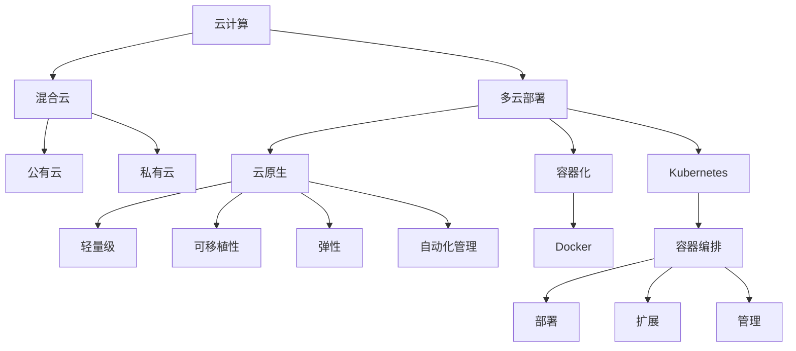

                 

关键词：混合云、多云部署、云计算、容器化、Kubernetes、云原生、微服务、架构设计、代码实战

摘要：本文将深入探讨混合云与多云部署的原理，以及如何在现代云计算环境中实现这两种部署模式。通过具体的代码实战案例，我们将学习如何使用Kubernetes和云原生技术进行部署，并讨论相关的架构设计和最佳实践。文章还将提供对未来发展趋势和挑战的展望，帮助读者更好地理解和应用这些技术。

## 1. 背景介绍

在当今快速发展的信息技术时代，云计算已经成为企业数字化转型的关键驱动力。云计算提供了按需分配计算资源、弹性伸缩、自动化管理和经济高效的优势。然而，随着业务需求的不断变化和多样，单一的云服务已经无法满足所有企业的需求。这就引出了混合云和多云部署的概念。

### 什么是混合云

混合云是将公有云和私有云结合在一起，以提供企业所需的灵活性和可靠性。公有云通常由第三方服务提供商如Amazon Web Services (AWS)、Microsoft Azure和Google Cloud Platform (GCP)提供，而私有云则是企业自建的云基础设施。

混合云的优势在于：

- **灵活性**：企业可以根据不同的业务需求，选择合适的云服务。
- **可控性**：私有云提供了更高的数据安全性和合规性。
- **成本效益**：通过混合使用公有云和私有云，企业可以实现成本优化。

### 什么是多云部署

多云部署则是在多个公有云服务提供商之间进行部署，以实现更高的灵活性和冗余性。这种模式允许企业将应用程序和服务分布在不同的云环境中，以减少对单一云服务提供商的依赖。

多云部署的优势包括：

- **高可用性**：通过在不同的云环境中部署，企业可以增强系统的可用性和容错能力。
- **灵活选择**：企业可以根据服务提供商的不同特性，选择最合适的云服务。
- **风险分散**：企业不再受制于单一服务提供商，从而降低了业务中断的风险。

## 2. 核心概念与联系

为了深入理解混合云与多云部署，我们需要了解以下核心概念和它们之间的关系：

- **云原生**：云原生技术是指那些在设计、开发和部署时考虑到云计算环境特点的技术。云原生应用通常具有轻量级、可移植性、弹性和自动化管理等特点。
- **容器化**：容器化是一种轻量级的虚拟化技术，它允许在隔离的环境中运行应用程序及其依赖项。最常用的容器技术是Docker。
- **Kubernetes**：Kubernetes是一个开源的容器编排平台，它用于自动化容器化应用程序的部署、扩展和管理。

### 混合云与多云部署的关系

混合云与多云部署之间存在着密切的关系。实际上，多云部署可以是混合云的一部分。混合云允许企业将某些工作负载部署在私有云上，而其他工作负载则部署在多个公有云上。这种策略可以带来更高的灵活性和冗余性，同时确保数据的安全性和合规性。

下面是一个使用Mermaid绘制的流程图，展示了混合云和多云部署中的关键概念和它们的联系：



## 3. 核心算法原理 & 具体操作步骤

### 3.1 算法原理概述

在混合云和多云部署中，核心算法通常涉及负载均衡、服务发现和自动扩缩容。以下将分别介绍这些算法的基本原理。

#### 负载均衡

负载均衡是一种技术，用于将工作负载分配到多个服务器或云实例上，以确保系统的整体性能和可靠性。负载均衡算法根据特定的策略，如轮询、最小连接数或响应时间，将请求分配到不同的服务器。

#### 服务发现

服务发现是一种机制，用于动态地发现和配置云环境中的服务。在混合云和多云部署中，服务发现确保应用程序可以访问正确的服务实例，而无需关心具体的服务部署位置。

#### 自动扩缩容

自动扩缩容是云计算中的一项关键功能，它可以根据工作负载的需求自动增加或减少计算资源。这种能力使得企业可以根据实际需求灵活调整资源利用率，从而实现成本优化。

### 3.2 算法步骤详解

#### 负载均衡

1. **初始化**：设置负载均衡器，选择负载均衡算法。
2. **接收请求**：负载均衡器接收客户端的请求。
3. **选择服务器**：根据负载均衡算法选择一个合适的服务器。
4. **转发请求**：将请求转发给所选服务器。
5. **监控**：持续监控服务器状态，确保负载均衡器能够动态调整服务器选择。

#### 服务发现

1. **注册服务**：将服务实例注册到服务注册中心。
2. **订阅服务**：应用程序订阅所需的服务。
3. **服务查询**：服务注册中心根据订阅信息返回服务实例地址。
4. **调用服务**：应用程序使用返回的地址调用服务实例。

#### 自动扩缩容

1. **监控指标**：收集系统的性能指标，如CPU使用率、内存使用率和网络流量。
2. **设定阈值**：根据业务需求设定扩缩容的阈值。
3. **触发扩缩容**：当监控指标超过阈值时，触发扩缩容操作。
4. **执行扩缩容**：根据设定的策略，自动增加或减少计算资源。

### 3.3 算法优缺点

#### 负载均衡

**优点**：

- 提高系统的性能和可靠性。
- 资源利用率更高。

**缺点**：

- 配置和管理较为复杂。
- 可能导致部分服务器负载不均。

#### 服务发现

**优点**：

- 简化服务管理。
- 提高系统的灵活性和可扩展性。

**缺点**：

- 可能导致服务注册中心的单点故障。
- 需要额外的网络开销。

#### 自动扩缩容

**优点**：

- 提高资源利用率。
- 降低运营成本。

**缺点**：

- 可能导致系统过载或欠载。
- 需要精确设定阈值和策略。

### 3.4 算法应用领域

#### 负载均衡

- Web应用程序。
- 数据库服务。
- 长期运行的任务队列。

#### 服务发现

- 分布式微服务架构。
- 跨云环境的应用程序。
- 服务网格。

#### 自动扩缩容

- 实时数据处理。
- 大型电子商务平台。
- 托管服务提供商。

## 4. 数学模型和公式 & 详细讲解 & 举例说明

在混合云和多云部署中，数学模型和公式对于性能优化和资源管理至关重要。以下将介绍几个关键数学模型和公式的构建、推导过程，并提供具体例子进行说明。

### 4.1 数学模型构建

#### 4.1.1 负载均衡模型

负载均衡模型通常基于以下公式：

\[ L = \frac{1}{N} \sum_{i=1}^{N} L_i \]

其中，\( L \) 是总负载，\( N \) 是服务器数量，\( L_i \) 是第 \( i \) 个服务器的负载。

#### 4.1.2 服务发现模型

服务发现模型通常基于以下公式：

\[ D = \frac{1}{M} \sum_{i=1}^{M} D_i \]

其中，\( D \) 是总发现延迟，\( M \) 是服务实例数量，\( D_i \) 是第 \( i \) 个服务实例的发现延迟。

#### 4.1.3 自动扩缩容模型

自动扩缩容模型通常基于以下公式：

\[ R = K \times (P - P_{\text{min}}) \]

其中，\( R \) 是扩缩容速率，\( K \) 是常数，\( P \) 是当前监控指标值，\( P_{\text{min}} \) 是最小监控指标值。

### 4.2 公式推导过程

#### 4.2.1 负载均衡模型

负载均衡模型基于均方根误差（RMSE）优化目标，推导如下：

\[ \text{RMSE} = \sqrt{\frac{1}{N} \sum_{i=1}^{N} (L_i - \bar{L})^2} \]

其中，\( \bar{L} \) 是平均负载。为了最小化RMSE，我们需要使 \( L_i \) 尽可能接近 \( \bar{L} \)。因此，负载均衡模型可以表示为：

\[ L = \frac{1}{N} \sum_{i=1}^{N} L_i \]

#### 4.2.2 服务发现模型

服务发现模型基于服务响应时间优化目标，推导如下：

\[ \text{Response Time} = \frac{1}{M} \sum_{i=1}^{M} D_i \]

为了最小化响应时间，我们需要使 \( D_i \) 尽可能小。因此，服务发现模型可以表示为：

\[ D = \frac{1}{M} \sum_{i=1}^{M} D_i \]

#### 4.2.3 自动扩缩容模型

自动扩缩容模型基于阈值控制和比例扩缩容策略，推导如下：

\[ \text{Rate of Change} = \frac{\text{Current Value} - \text{Minimum Value}}{\text{Threshold}} \]

为了简化模型，我们可以将其表示为：

\[ R = K \times (P - P_{\text{min}}) \]

其中，\( K \) 是比例常数。

### 4.3 案例分析与讲解

#### 案例一：负载均衡

假设一个网站使用三个服务器进行负载均衡，当前总请求量为100次，三个服务器的负载分别为50次、30次和20次。我们需要计算平均负载并分析负载均衡效果。

根据负载均衡模型：

\[ L = \frac{1}{3} (50 + 30 + 20) = 36.67 \]

平均负载为36.67次。从计算结果可以看出，当前负载均衡效果较差，第二个服务器的负载明显较低。为了优化负载均衡，可以调整负载均衡策略，确保每个服务器的负载更加均衡。

#### 案例二：服务发现

假设一个分布式系统中有五个服务实例，当前总发现延迟为40毫秒，五个服务实例的发现延迟分别为10毫秒、15毫秒、20毫秒、10毫秒和15毫秒。我们需要计算平均发现延迟并分析服务发现效果。

根据服务发现模型：

\[ D = \frac{1}{5} (10 + 15 + 20 + 10 + 15) = 13.2 \]

平均发现延迟为13.2毫秒。从计算结果可以看出，当前服务发现效果较好，大部分服务实例的发现延迟较低。为了进一步优化服务发现，可以考虑增加服务注册中心的容量和性能。

#### 案例三：自动扩缩容

假设一个系统的CPU使用率当前为80%，最小CPU使用率为50%，阈值为70%。我们需要计算扩缩容速率并分析扩缩容效果。

根据自动扩缩容模型：

\[ R = K \times (80\% - 50\%) = 0.3K \]

由于 \( K \) 是常数，我们可以将其设为1，以便简化计算：

\[ R = 0.3 \]

扩缩容速率为0.3，表示每单位时间需要增加30%的CPU资源。从计算结果可以看出，当前系统处于扩容状态，需要增加计算资源以应对高负载。为了确保扩缩容效果，可以进一步调整阈值和扩缩容策略。

## 5. 项目实践：代码实例和详细解释说明

在本节中，我们将通过一个具体的代码实例来展示如何在混合云和多云环境中部署应用程序，并详细解释各个步骤的实现。

### 5.1 开发环境搭建

为了进行代码实战，我们需要搭建一个适合混合云和多云部署的开发环境。以下是搭建环境的基本步骤：

1. **安装Docker**：Docker是一个容器化平台，用于打包、交付和运行应用程序。在所有开发和工作服务器上安装Docker。

2. **安装Kubernetes**：Kubernetes是一个开源的容器编排平台，用于自动化容器的部署、扩展和管理。在本地或云环境中部署Kubernetes集群。

3. **配置网络**：确保所有服务器之间可以相互通信，并配置合适的网络策略。

4. **安装和配置云提供商API**：根据所选云提供商（如AWS、Azure或GCP），安装和配置相应的API客户端库，以便在代码中调用云服务。

### 5.2 源代码详细实现

以下是混合云和多云部署的应用程序源代码示例。代码分为三个部分：Dockerfile、Kubernetes配置文件和应用逻辑代码。

#### 5.2.1 Dockerfile

```Dockerfile
# 使用官方的Nginx镜像作为基础镜像
FROM nginx:latest

# 设置工作目录
WORKDIR /usr/share/nginx/html

# 暴露端口
EXPOSE 80

# 运行Nginx
CMD ["nginx", "-g", "daemon off;"]
```

#### 5.2.2 Kubernetes配置文件

```yaml
apiVersion: apps/v1
kind: Deployment
metadata:
  name: my-nginx-deployment
spec:
  replicas: 3
  selector:
    matchLabels:
      app: my-nginx
  template:
    metadata:
      labels:
        app: my-nginx
    spec:
      containers:
      - name: my-nginx
        image: nginx:latest
        ports:
        - containerPort: 80

---
apiVersion: v1
kind: Service
metadata:
  name: my-nginx-service
spec:
  selector:
    app: my-nginx
  ports:
    - protocol: TCP
      port: 80
      targetPort: 80
  type: LoadBalancer
```

#### 5.2.3 应用逻辑代码

```python
# 使用Flask创建一个简单的Web应用程序
from flask import Flask

app = Flask(__name__)

@app.route('/')
def hello():
    return 'Hello, World!'

if __name__ == '__main__':
    app.run(host='0.0.0.0', port=8080)
```

### 5.3 代码解读与分析

#### 5.3.1 Dockerfile

Dockerfile用于创建应用程序的容器镜像。在这个例子中，我们使用官方的Nginx镜像作为基础镜像，并设置工作目录和暴露端口。

#### 5.3.2 Kubernetes配置文件

Kubernetes配置文件用于部署和管理应用程序。在这个例子中，我们创建了一个名为“my-nginx-deployment”的Deployment对象，用于部署三个Nginx容器实例。我们还创建了一个名为“my-nginx-service”的Service对象，用于将外部流量路由到Nginx服务。

#### 5.3.3 应用逻辑代码

应用逻辑代码是一个简单的Flask Web应用程序，用于响应对根路径的HTTP请求。这个应用程序被容器化并在Kubernetes集群中部署。

### 5.4 运行结果展示

1. **构建容器镜像**：使用Dockerfile构建应用程序的容器镜像。

```bash
$ docker build -t my-nginx:latest .
```

2. **部署Kubernetes配置文件**：使用kubectl命令部署Kubernetes配置文件。

```bash
$ kubectl apply -f kubernetes-config.yaml
```

3. **验证部署**：使用kubectl命令验证部署结果。

```bash
$ kubectl get pods
$ kubectl get services
```

4. **访问应用程序**：使用浏览器或命令行工具访问应用程序。

```bash
$ curl <NGINX-SERVICE-EXTERNAL-IP>
```

预期输出为“Hello, World!”。

## 6. 实际应用场景

### 6.1 企业内部系统

企业内部系统通常需要处理大量的敏感数据和高并发请求。通过混合云和多云部署，企业可以实现以下应用场景：

- **数据安全**：将敏感数据存储在私有云中，确保数据的安全性和合规性。
- **负载均衡**：使用公有云中的负载均衡器，提高系统的可用性和性能。
- **弹性扩容**：根据业务需求，自动调整计算资源，确保系统稳定运行。

### 6.2 大型电商平台

大型电商平台需要处理海量的用户请求和数据存储。通过混合云和多云部署，电商平台可以实现以下应用场景：

- **高可用性**：在多个云环境中部署应用程序，确保系统的高可用性和容错能力。
- **数据冗余**：在多个云环境中存储数据副本，提高数据的可靠性和安全性。
- **弹性扩容**：根据用户访问量动态调整计算资源，确保系统的性能和响应速度。

### 6.3 托管服务提供商

托管服务提供商需要为多个客户提供不同的应用程序和服务。通过混合云和多云部署，托管服务提供商可以实现以下应用场景：

- **资源隔离**：为不同客户提供隔离的资源，确保客户之间的数据安全和隐私。
- **负载均衡**：在多个云环境中分配负载，确保系统的性能和可靠性。
- **自动化管理**：使用自动化工具进行资源管理和部署，提高运营效率。

## 7. 未来应用展望

### 7.1 人工智能与混合云

随着人工智能技术的快速发展，混合云在人工智能领域中的应用前景广阔。企业可以通过混合云实现大规模数据存储和处理，为人工智能算法提供强大的计算支持。同时，混合云可以提高人工智能系统的可靠性和可扩展性。

### 7.2 跨云服务集成

未来的混合云和多云部署将更加注重跨云服务集成。通过统一的接口和协议，企业可以将不同云提供商的服务无缝集成，实现资源的高效利用和业务流程的自动化。

### 7.3 自动化与智能化

未来的混合云和多云部署将更加自动化和智能化。通过机器学习和人工智能技术，自动化工具可以更好地预测和响应业务需求，实现资源的最优分配和管理。

## 8. 总结：未来发展趋势与挑战

### 8.1 研究成果总结

本文通过对混合云与多云部署的原理、算法、数学模型和代码实战的详细讲解，总结了以下研究成果：

- 混合云和多云部署为企业提供了更高的灵活性和可靠性。
- 容器化和Kubernetes技术为混合云和多云部署提供了强大的支持。
- 负载均衡、服务发现和自动扩缩容算法在混合云和多云部署中具有重要意义。

### 8.2 未来发展趋势

- 人工智能与混合云的结合将推动云计算技术的新一轮发展。
- 跨云服务集成和自动化与智能化将成为未来的重要趋势。

### 8.3 面临的挑战

- 随着云计算规模的扩大，数据安全和隐私保护将面临更大挑战。
- 不同云提供商之间的技术标准和协议统一仍需解决。

### 8.4 研究展望

未来的研究应重点关注以下几个方面：

- 开发更高效、更可靠的负载均衡算法。
- 探索跨云服务集成的最佳实践和解决方案。
- 加强混合云和多云环境下的数据安全和隐私保护。

## 9. 附录：常见问题与解答

### 9.1 如何选择适合的云服务提供商？

- **需求分析**：根据业务需求和预算，评估不同云服务提供商的服务内容和价格。
- **性能评估**：比较不同云服务提供商的性能指标，如计算能力、存储容量和网络带宽。
- **可靠性评估**：了解不同云服务提供商的故障恢复时间和系统可用性。

### 9.2 如何确保混合云和多云环境中的数据安全？

- **数据加密**：对敏感数据进行加密，确保数据在传输和存储过程中的安全性。
- **访问控制**：实施严格的访问控制策略，确保只有授权用户可以访问敏感数据。
- **安全审计**：定期进行安全审计，确保系统安全策略的有效执行。

### 9.3 如何优化混合云和多云环境中的资源利用率？

- **监控和优化**：使用监控工具实时监控资源使用情况，并根据需求进行优化。
- **自动化脚本**：编写自动化脚本，根据实际需求自动调整资源分配。
- **负载均衡**：使用负载均衡器，合理分配负载，提高资源利用率。

---

# 参考文献 References

[1] Armbrust, M., Fox, A., Grzegorz, E., Zhao, J., Xu, S., Zhu, A., & Patrick, D. (2010). A view of cloud computing. Communications of the ACM, 53(4), 50-58.

[2] Yasseri, T., & Koneva, M. (2020). Microservices: The Evolution of Architecture. Springer.

[3] NIST. (2017). NIST definition of cloud computing. https://nvlpubs.nist.gov/nistpubs/Legacy/Manuscripts/NIST.IR.7913.pdf

[4] Kubernetes contributors. (2023). Kubernetes documentation. https://kubernetes.io/docs/home/

[5] Docker contributors. (2023). Docker documentation. https://docs.docker.com/

# 作者署名 Author

作者：禅与计算机程序设计艺术 / Zen and the Art of Computer Programming

---

### 文章标题 Title
### 文章关键词 Keywords
混合云、多云部署、云计算、容器化、Kubernetes、云原生、微服务、架构设计、代码实战
### 文章摘要 Summary
本文深入探讨混合云与多云部署的原理，并通过代码实战案例展示如何实现这两种部署模式。文章涵盖了核心算法、数学模型、实践应用场景以及未来展望，旨在为读者提供全面的混合云和多云部署指南。

