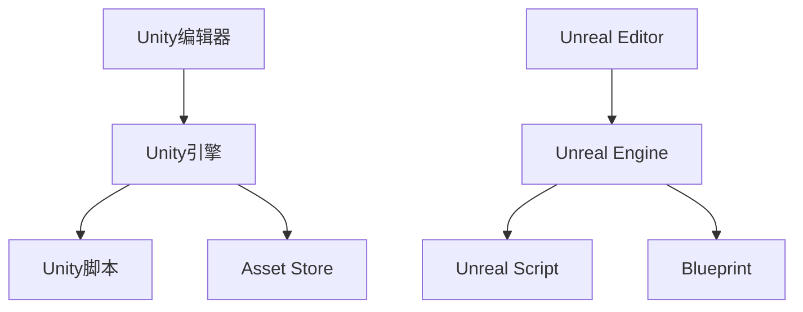

                 

关键词：Unity、Unreal Engine、游戏开发、框架、对比

> 摘要：本文将深入探讨Unity与Unreal Engine这两个在游戏开发领域中广泛使用的框架，通过详细对比它们在功能、性能、学习曲线等方面的差异，为开发者提供选择合适游戏开发框架的参考。本文不仅会分析两者的核心优势与劣势，还会讨论它们在不同类型游戏开发中的应用场景，帮助读者更全面地理解这两个框架。

## 1. 背景介绍

游戏开发是一个复杂且多样化的过程，涉及多个技术领域，如图形学、物理模拟、人工智能、音频处理等。为了提高开发效率和产出质量，开发者通常会依赖一些成熟的开发框架。其中，Unity和Unreal Engine是两款在业界享有盛誉的游戏开发框架。

Unity由Unity Technologies公司开发，于2005年首次发布。Unity以其易用性和强大的功能受到广大开发者的喜爱，广泛应用于移动、PC、游戏机等多个平台。Unity引擎不仅支持2D和3D游戏开发，还提供了丰富的插件和资源，使得开发者可以快速搭建游戏项目。

Unreal Engine由Epic Games公司开发，首次发布于1998年。Unreal Engine以其强大的图形渲染能力和逼真的物理模拟效果而著称，广泛应用于大型游戏、电影、VR/AR等领域。随着版本迭代，Unreal Engine逐渐成为游戏开发中的领先框架之一。

## 2. 核心概念与联系

为了更好地理解Unity与Unreal Engine的差异，我们需要先了解它们的核心概念和架构。以下是两者的简要对比：

### 2.1 Unity

Unity采用组件化开发模式，将游戏逻辑、视觉效果、音频处理等功能封装为组件，开发者可以通过拖拽组件来构建游戏。Unity的核心架构包括：

- **Unity编辑器**：提供直观的界面和功能，用于构建和编辑游戏场景。
- **Unity引擎**：负责游戏运行时的渲染、物理计算、AI模拟等核心功能。
- **Unity脚本**：使用C#语言进行游戏逻辑编程，可以与组件进行交互。
- **Asset Store**：一个庞大的资源库，提供各种插件、素材和工具，方便开发者快速搭建项目。

### 2.2 Unreal Engine

Unreal Engine采用场景图（Scene Graph）模式，通过节点和边来表示场景中的各种元素和关系。Unreal Engine的核心架构包括：

- **Unreal Editor**：提供强大的可视化工具，用于设计和编辑游戏场景。
- **Unreal Engine**：负责渲染、物理、动画等核心功能，具有高度的可扩展性。
- **Unreal Script**：使用Unreal Engine自己的脚本语言进行编程，具有更高的性能。
- **Blueprint**：一个可视化的编程工具，无需编写代码即可实现游戏逻辑。

为了更直观地展示两者的架构，以下是两个框架的Mermaid流程图：



### 2.3 关联性

Unity和Unreal Engine在游戏开发中都扮演着重要角色，它们既有相似之处也有不同之处。相似之处在于：

- **平台兼容性**：两者都支持多个平台，包括PC、移动设备、游戏机等。
- **3D渲染**：两者都具备强大的3D渲染能力，支持高质量的图像效果。
- **游戏逻辑**：两者都提供编程语言（C#和Unreal Script）用于实现游戏逻辑。

不同之处在于：

- **开发模式**：Unity更侧重于组件化开发，Unreal Engine更侧重于场景图模式。
- **性能**：Unreal Engine在图形渲染和物理计算方面性能更强。
- **学习曲线**：Unity的学习曲线相对平缓，适合初学者；Unreal Engine的学习曲线较陡，但功能更强大。

## 3. 核心算法原理 & 具体操作步骤

### 3.1 算法原理概述

在游戏开发中，核心算法的原理是构建游戏逻辑和物理模拟的基础。以下是Unity和Unreal Engine在核心算法方面的基本原理：

### 3.2 算法步骤详解

#### 3.2.1 Unity

1. **组件化开发**：开发者可以通过拖拽组件来构建游戏场景，每个组件都代表游戏中的一个功能模块，如碰撞体、动画控制器等。
2. **游戏循环**：Unity通过游戏循环来驱动游戏运行，游戏循环包括更新（Update）和渲染（Render）两个阶段。在更新阶段，游戏逻辑和物理模拟会进行计算；在渲染阶段，游戏画面会被绘制到屏幕上。
3. **脚本编程**：使用C#语言进行游戏逻辑编程，可以与Unity的组件进行交互。

#### 3.2.2 Unreal Engine

1. **场景图模式**：开发者通过创建节点和设置边来构建游戏场景，每个节点都代表场景中的一个元素，如角色、灯光等。
2. **游戏循环**：Unreal Engine的游戏循环包括预渲染（Pre-Render）、渲染（Render）和后渲染（Post-Render）三个阶段。在预渲染阶段，场景会被预处理；在渲染阶段，场景会被绘制到屏幕上；在后渲染阶段，游戏逻辑和物理计算会进行计算。
3. **可视化编程**：使用Blueprint进行游戏逻辑编程，无需编写代码即可实现游戏功能。

### 3.3 算法优缺点

#### Unity

- **优点**：
  - **易用性**：组件化开发模式使得游戏开发更加直观和便捷。
  - **跨平台**：支持多个平台，适合开发跨平台游戏。
  - **社区支持**：拥有庞大的开发者社区，资源丰富。

- **缺点**：
  - **性能**：在图形渲染和物理计算方面性能相对较弱。
  - **学习曲线**：对于初学者来说，学习曲线相对平缓，但功能可能不够强大。

#### Unreal Engine

- **优点**：
  - **性能**：在图形渲染和物理计算方面性能更强，适合开发大型游戏。
  - **功能强大**：支持多种高级功能，如光追踪、动态天气等。
  - **可视化编程**：Blueprint使得游戏逻辑编程更加直观。

- **缺点**：
  - **学习曲线**：学习曲线较陡，需要更多时间来掌握。
  - **资源消耗**：相对于Unity，Unreal Engine的资源消耗更大。

### 3.4 算法应用领域

#### Unity

- **适合类型**：适合开发2D和3D游戏，尤其是移动平台和Web游戏。
- **案例**：《纪念碑谷》、《Cuphead》等。

#### Unreal Engine

- **适合类型**：适合开发大型3D游戏、VR/AR应用、电影级游戏。
- **案例**：《绝地求生》、《堡垒之夜》、《星球大战：战棋》等。

## 4. 数学模型和公式 & 详细讲解 & 举例说明

在游戏开发中，数学模型和公式用于实现游戏逻辑、物理模拟和图形渲染等功能。以下是Unity和Unreal Engine在数学模型方面的一些基本概念和公式。

### 4.1 数学模型构建

#### Unity

- **向量**：用于表示空间中的位置、速度、加速度等。
- **矩阵**：用于表示变换、投影等操作。
- **几何图形**：用于表示游戏场景中的各种元素，如立方体、球体、多边形等。

#### Unreal Engine

- **向量**：与Unity类似，用于表示空间中的位置、速度、加速度等。
- **矩阵**：与Unity类似，用于表示变换、投影等操作。
- **光线追踪**：用于实现高质量的光照效果和反射效果。

### 4.2 公式推导过程

#### Unity

- **碰撞检测**：计算两个几何图形是否相交，常用的算法有AABB（轴对齐包围盒）和OBB（导向包围盒）。
- **物理模拟**：使用牛顿第二定律计算物体的加速度、速度和位置。

#### Unreal Engine

- **光线追踪**：使用光线追踪算法计算场景中的光照效果和反射效果。
- **物理模拟**：使用弹簧、阻尼、重力等物理定律计算物体的运动。

### 4.3 案例分析与讲解

#### Unity案例

假设我们有一个简单的2D平台游戏，其中角色可以在水平方向上移动，并可以跳跃。

1. **碰撞检测**：
   - 公式：AABB相交检测
     \[if (left\_of\_A \le right\_of\_B \&& right\_of\_A \ge left\_of\_B \&& bottom\_of\_A \le top\_of\_B \&& top\_of\_A \ge bottom\_of\_B) {\text{碰撞发生}}\]
   - 实现步骤：
     - 计算角色和障碍物的AABB包围盒。
     - 检查AABB是否相交。

2. **物理模拟**：
   - 公式：牛顿第二定律
     \[F = m \cdot a\]
   - 实现步骤：
     - 计算角色的加速度。
     - 更新角色的速度和位置。

#### Unreal Engine案例

假设我们有一个3D游戏，其中角色可以在室内进行移动，并可以与现实世界中的物理环境进行交互。

1. **光线追踪**：
   - 公式：光线追踪方程
     \[L_o(p) = L_e(p) + \int_F L_i(f(p', \omega')) \cdot f(p, \omega') \cdot cos(\theta) \cdot dp'\]
   - 实现步骤：
     - 发射光线。
     - 与场景中的物体进行碰撞检测。
     - 计算光照强度。

2. **物理模拟**：
   - 公式：弹簧-阻尼模型
     \[m \cdot a = -k \cdot x - c \cdot v\]
   - 实现步骤：
     - 计算弹簧的拉伸量和阻尼力。
     - 更新角色的速度和位置。

## 5. 项目实践：代码实例和详细解释说明

### 5.1 开发环境搭建

#### Unity

1. 访问Unity官方网站，下载并安装Unity Hub。
2. 在Unity Hub中创建一个新项目，选择适合的模板（如2D游戏或3D游戏）。
3. 安装必要的插件，如Unity Ads、Unity Analytics等。

#### Unreal Engine

1. 访问Epic Games官方网站，下载并安装Unreal Engine。
2. 启动Unreal Engine，创建一个新项目。
3. 选择合适的模板（如3D游戏或VR游戏）。
4. 安装必要的插件，如Unreal Audio、Unreal Motion Graphics等。

### 5.2 源代码详细实现

#### Unity案例

以下是一个简单的Unity 2D平台游戏的代码示例：

```csharp
using UnityEngine;

public class PlayerMovement : MonoBehaviour
{
    public float moveSpeed = 5f;
    public float jumpHeight = 7f;

    private Rigidbody2D rigidbody;
    private bool isGrounded;
    private float groundCheckRadius = 0.2f;
    private LayerMask whatIsGround;

    private void Start()
    {
        rigidbody = GetComponent<Rigidbody2D>();
        whatIsGround = LayerMask.GetMask("Ground");
    }

    private void Update()
    {
        isGrounded = Physics2D.OverlapCircle(groundCheckPosition, groundCheckRadius, whatIsGround);

        if (Input.GetKeyDown(KeyCode.Space) && isGrounded)
        {
            rigidbody.AddForce(new Vector2(0, jumpHeight));
        }

        if (Input.GetKey(KeyCode.RightArrow))
        {
            rigidbody.AddForce(new Vector2(moveSpeed, 0));
        }

        if (Input.GetKey(KeyCode.LeftArrow))
        {
            rigidbody.AddForce(new Vector2(-moveSpeed, 0));
        }
    }
}
```

#### Unreal Engine案例

以下是一个简单的Unreal Engine 3D游戏的代码示例：

```unreal
class APlayerMovement : public ACharacter
{
public:
    APlayerMovement();

    UPROPERTY(EditDefaultsOnly, Category = "Movement")
    float MoveSpeed = 250.0f;

    UPROPERTY(EditDefaultsOnly, Category = "Jump")
    float JumpHeight = 800.0f;

    UPROPERTY(EditDefaultsOnly, Category = "Physics")
    UPhysicsAsset PhysicsAsset;

protected:
    virtual void OnMovementUpdated(float DeltaSeconds, const FVector& OldLocation) override;

private:
    FVector MovementVector;
};

APlayerMovement::APlayerMovement()
{
    bUseControllerRotationYaw = true;
}

void APlayerMovement::OnMovementUpdated(float DeltaSeconds, const FVector& OldLocation)
{
    if (IsMovingOnGround())
    {
        MovementVector = FVector::ZeroVector;

        if (InputComponent->IsKeyDown(EKeys::SpaceBar) && IsGrounded())
        {
            FVector JumpImpulse = FVector(0.0f, 0.0f, 1.0f) * JumpHeight;
            AddMovementInput(JumpImpulse, 1.0f, false);
        }

        if (InputComponent->IsKeyDown(EKeys::RightShift))
        {
            MovementVector += GetActorForwardVector() * MoveSpeed;
        }

        if (InputComponent->IsKeyDown(EKeys::LeftShift))
        {
            MovementVector -= GetActorForwardVector() * MoveSpeed;
        }
    }

    AddMovementInput(MovementVector.GetSafeNormal(), 1.0f, false);
}
```

### 5.3 代码解读与分析

以上代码示例展示了Unity和Unreal Engine在游戏开发中的基本操作。在Unity中，我们使用C#语言实现游戏逻辑，通过Rigidbody2D组件控制角色的移动和跳跃。在Unreal Engine中，我们使用Unreal Script实现类似的功能，通过ACharacter类和APlayerMovement类进行编程。

### 5.4 运行结果展示

通过以上代码，我们可以实现一个简单的2D平台游戏和一个3D游戏。在Unity中，角色可以在水平方向上移动和跳跃，与地面进行碰撞检测。在Unreal Engine中，角色可以在3D空间中移动和跳跃，与现实世界中的物理环境进行交互。

## 6. 实际应用场景

### 6.1 Unity应用场景

- **2D游戏开发**：Unity非常适合开发2D游戏，如《超级马里奥》、《愤怒的小鸟》等。
- **Web游戏开发**：Unity支持Web平台，可以轻松实现Web游戏。
- **教育应用**：Unity在教育领域有广泛的应用，如虚拟实验室、交互式学习工具等。

### 6.2 Unreal Engine应用场景

- **大型游戏开发**：Unreal Engine非常适合开发大型游戏，如《绝地求生》、《堡垒之夜》等。
- **电影级游戏**：Unreal Engine在图形渲染和物理模拟方面具有强大的能力，可以制作电影级游戏。
- **VR/AR应用**：Unreal Engine支持VR/AR应用开发，如虚拟现实游戏、增强现实应用等。

## 7. 工具和资源推荐

### 7.1 学习资源推荐

- **Unity官方文档**：Unity官方文档提供了详尽的教程和参考，是学习Unity的必备资源。
- **Unreal Engine官方文档**：Unreal Engine官方文档提供了丰富的教程和示例，可以帮助开发者快速上手。
- **在线教程和课程**：在Coursera、Udemy等在线教育平台上有许多关于Unity和Unreal Engine的课程，适合不同水平的开发者。

### 7.2 开发工具推荐

- **Visual Studio**：Visual Studio是Unity和Unreal Engine的首选开发环境，提供了强大的代码编辑器和调试工具。
- **Sublime Text**：Sublime Text是一款轻量级的代码编辑器，适用于Unity和Unreal Engine的开发。
- **GitHub**：GitHub是一个版本控制工具，可以帮助开发者管理代码、协同工作和分享资源。

### 7.3 相关论文推荐

- **“Unity：A Game Engine for Mobile Platforms”**：这篇文章详细介绍了Unity的开发背景、技术特点和优势。
- **“Unreal Engine 4：Real-Time Rendering”**：这本书涵盖了Unreal Engine 4在实时渲染方面的核心技术，如光线追踪、阴影等。

## 8. 总结：未来发展趋势与挑战

### 8.1 研究成果总结

Unity和Unreal Engine作为游戏开发领域的两大框架，各自具有独特的优势和应用场景。Unity以其易用性和跨平台能力受到广泛欢迎，适用于小型游戏和Web游戏开发。Unreal Engine则以其强大的图形渲染能力和物理模拟效果，成为大型游戏和电影级游戏开发的首选。

### 8.2 未来发展趋势

- **云计算**：随着云计算技术的发展，游戏开发框架将更加依赖云服务，提高开发效率和资源利用率。
- **人工智能**：人工智能技术在游戏开发中的应用将越来越广泛，如智能NPC、自动化测试等。
- **VR/AR**：随着VR/AR技术的普及，游戏开发框架将在这些领域发挥更大作用，提供更丰富的交互体验。

### 8.3 面临的挑战

- **性能优化**：随着游戏复杂度的增加，游戏开发框架需要在性能方面进行不断优化，以满足更高质量的游戏体验。
- **学习曲线**：游戏开发框架的学习曲线对初学者来说可能较陡，如何降低学习难度是一个挑战。
- **生态建设**：游戏开发框架需要建立一个健康的生态，包括开发者社区、资源库、技术支持等。

### 8.4 研究展望

未来，Unity和Unreal Engine将继续在游戏开发领域发挥重要作用。随着技术的不断进步，它们将不断引入新的功能和技术，提高开发效率和游戏质量。同时，随着VR/AR等新兴技术的发展，游戏开发框架将在这些领域迎来新的机遇和挑战。

## 9. 附录：常见问题与解答

### 9.1 Unity与Unreal Engine的区别

- **开发模式**：Unity采用组件化开发模式，Unreal Engine采用场景图模式。
- **性能**：Unreal Engine在图形渲染和物理计算方面性能更强。
- **学习曲线**：Unity的学习曲线相对平缓，Unreal Engine的学习曲线较陡。

### 9.2 如何选择合适的游戏开发框架

- **项目规模**：大型游戏选择Unreal Engine，小型游戏选择Unity。
- **平台兼容性**：考虑游戏需要在哪些平台发布，选择支持这些平台的框架。
- **开发者技能**：根据开发者的技能水平和熟悉程度选择合适的框架。

### 9.3 如何优化游戏性能

- **减少渲染物体**：关闭不必要的渲染物体，减少GPU负担。
- **优化代码**：优化游戏逻辑和物理模拟代码，提高执行效率。
- **使用异步处理**：使用异步处理技术，提高游戏运行速度。

### 9.4 如何获取学习资源

- **官方文档**：访问Unity和Unreal Engine的官方网站，获取官方文档和教程。
- **在线课程**：在Coursera、Udemy等在线教育平台查找相关课程。
- **开发者社区**：加入Unity和Unreal Engine的开发者社区，与其他开发者交流经验。

---

作者：禅与计算机程序设计艺术 / Zen and the Art of Computer Programming

---

以上便是关于“游戏开发框架：Unity与Unreal Engine对比”的完整文章。希望本文能帮助您更好地了解这两个框架，并在选择合适的游戏开发框架时提供参考。在游戏开发领域，选择合适的工具和框架是成功的关键，祝您在游戏开发道路上一切顺利！

