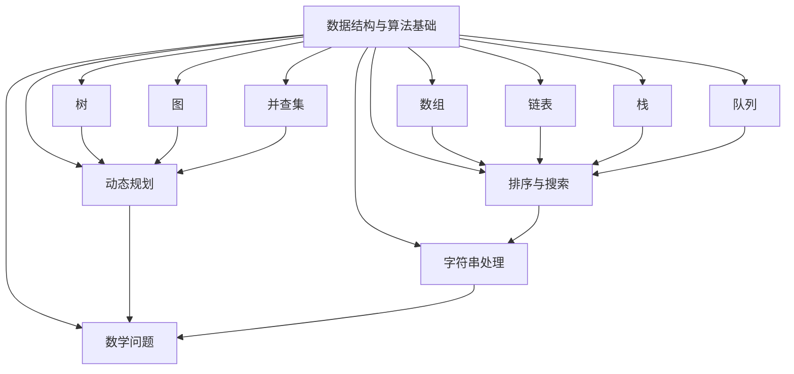

                 

滴滴是一家全球领先的移动出行平台，其社招面试中高频出现的算法题涵盖了各种领域，包括数据结构、算法、数学建模等。本文将详细解析这些高频算法题，帮助读者更好地应对面试挑战。

## 文章关键词

- 滴滴社招
- 算法面试
- 数据结构
- 算法分析
- 数学建模

## 文章摘要

本文将系统地解析滴滴2025届社招面试中高频出现的算法题。我们将从基础数据结构到复杂算法设计，从数学模型构建到具体代码实现，全面剖析这些题目。通过本文的讲解，读者将能够掌握这些算法题的核心思路和解题技巧，提升面试能力。

## 1. 背景介绍

滴滴出行的崛起改变了人们的出行方式，同时也推动了技术人才的竞争。作为一家技术驱动的公司，滴滴在招聘过程中对候选人的技术能力有很高的要求。算法面试是滴滴面试的重要组成部分，高频出现的算法题不仅考察候选人的编程能力，还考察其对数据结构和算法原理的深刻理解。

本文将围绕以下几个核心话题展开：

1. **基础数据结构与算法**：包括数组、链表、栈、队列等基础数据结构及其常用算法。
2. **高级数据结构与算法**：包括树、图、并查集等高级数据结构以及相关的算法。
3. **数学建模与优化问题**：包括线性规划、动态规划等数学建模问题。
4. **编程技巧与优化**：包括代码风格、算法优化策略等。
5. **实际应用场景分析**：包括滴滴出行相关的实际问题解析。

### 1.1 算法面试的重要性

算法面试是评估技术人才的重要手段，特别是在互联网公司。它不仅考察候选人的编程技能，还考察逻辑思维、解决问题的能力以及技术广度。滴滴作为互联网领域的领导者，其面试题目往往具有挑战性，能够有效地筛选出优秀的候选人。

### 1.2 算法面试的常见题型

滴滴的算法面试题型多样，常见的包括：

- **排序与搜索**：如快速排序、二分查找、拓扑排序等。
- **动态规划**：如最长公共子序列、最长递增子序列等。
- **树与图**：如二叉树遍历、图的深度优先搜索、最小生成树等。
- **字符串处理**：如最长公共前缀、最长重复子串等。
- **数学问题**：如最大公约数、素数生成等。

### 1.3 面试流程与准备

滴滴的社招面试通常包括以下几个环节：

- **在线笔试**：一般包含编程题和算法题，考察基础技能。
- **电话面试**：主要考察逻辑思维和沟通能力。
- **现场面试**：包括技术面试和HR面试，技术面试主要涉及复杂算法和系统设计。

为了准备滴滴的面试，读者可以从以下几个方面入手：

- **复习基础**：巩固数据结构、算法等基础知识。
- **练习编程题**：通过LeetCode、牛客网等平台进行练习。
- **项目经验**：积累实际项目经验，理解算法在实际应用中的场景。
- **面试技巧**：学习面试礼仪、准备常见问题答案等。

## 2. 核心概念与联系

在解答滴滴的算法面试题之前，我们需要理解一些核心概念和它们之间的联系。以下是一个用Mermaid绘制的流程图，展示了一些核心数据结构和算法的概念及其关系。



### 2.1 数据结构与算法基础

数据结构是指数据组织、管理和存储的方式，算法则是解决问题的步骤和策略。数据结构是算法的基础，而算法的效率和正确性在很大程度上依赖于数据结构的选择。

- **数组**：一种基础的数据结构，用于存储一系列元素。
- **链表**：一种线性数据结构，由节点组成，每个节点包含数据和指向下一个节点的指针。
- **栈**：一种后进先出（LIFO）的数据结构。
- **队列**：一种先进先出（FIFO）的数据结构。
- **树**：一种层次化的数据结构，包含节点和子节点。
- **图**：一种复杂的数据结构，由节点和边组成。
- **并查集**：一种用于解决集合问题的数据结构。

### 2.2 常用算法与数据结构的联系

许多算法都是基于特定的数据结构设计的。例如：

- **排序与搜索**：二分查找算法通常用于有序数组。
- **动态规划**：常用的数据结构包括数组、树和图。
- **字符串处理**：哈希表和前缀树是常用的数据结构。
- **数学问题**：算法如最大公约数、素数生成通常使用数组和数学公式。

理解这些数据结构和算法之间的联系，有助于我们在解决具体问题时做出正确的选择。

## 3. 核心算法原理 & 具体操作步骤

### 3.1 算法原理概述

在深入探讨滴滴算法面试题之前，我们需要先了解一些核心算法原理。以下是几个常见算法的概述：

- **排序算法**：包括快速排序、归并排序、堆排序等，用于对数据进行排序。
- **搜索算法**：如二分查找、广度优先搜索、深度优先搜索等，用于在数据结构中查找元素。
- **动态规划**：用于解决最优子结构问题，通过子问题的最优解构建出原问题的最优解。
- **贪心算法**：通过在每一步做出局部最优选择来达到全局最优解。
- **数学算法**：如最大公约数、素数生成等，用于解决数学问题。

### 3.2 算法步骤详解

#### 3.2.1 快速排序

快速排序是一种高效的排序算法，其基本思想是通过一趟排序将数据分为独立的两部分，其中一部分的所有数据都比另外一部分的所有数据要小。

1. **选择基准**：从数组中选择一个元素作为基准。
2. **分区**：将数组分成两部分，所有比基准小的元素放在基准的左边，所有比基准大的元素放在基准的右边。
3. **递归排序**：递归地对左右两部分进行快速排序。

#### 3.2.2 二分查找

二分查找是一种在有序数组中查找特定元素的算法。

1. **确定边界**：确定查找区间的左右边界。
2. **中间值判断**：计算中间值，与目标值比较。
3. **更新边界**：根据比较结果更新查找区间。
4. **递归或循环查找**：重复步骤2-3，直到找到目标值或确定不存在。

#### 3.2.3 动态规划

动态规划用于解决具有最优子结构性质的问题，其基本步骤如下：

1. **定义状态**：定义一个状态数组或表，用于存储子问题的解。
2. **状态转移方程**：根据状态定义，建立状态转移方程。
3. **初始化**：初始化状态数组的边界条件。
4. **计算顺序**：按照状态转移方程，计算状态数组的值。
5. **获取结果**：从状态数组中获取原问题的解。

#### 3.2.4 贪心算法

贪心算法通过每一步选择局部最优解来达到全局最优解。

1. **初始状态**：根据问题初始条件，选择一个初始解。
2. **逐步优化**：在每一步，根据当前状态选择最优解。
3. **结束条件**：当达到问题的结束条件时，输出最终解。

#### 3.2.5 数学算法

数学算法如最大公约数、素数生成等，其基本步骤通常如下：

1. **数学公式或定理**：使用已知的数学公式或定理。
2. **计算步骤**：根据数学公式或定理进行计算。
3. **优化策略**：根据问题特点，使用适当的优化策略。

### 3.3 算法优缺点

每种算法都有其优缺点，以下是一些常见算法的优缺点：

- **快速排序**：优点是时间复杂度较低，缺点是空间复杂度较高。
- **二分查找**：优点是时间复杂度较低，缺点是只适用于有序数组。
- **动态规划**：优点是可以解决复杂的最优子结构问题，缺点是理解难度较高。
- **贪心算法**：优点是简单易理解，缺点是可能无法找到全局最优解。
- **数学算法**：优点是直接基于数学原理，缺点是可能需要较高数学背景。

### 3.4 算法应用领域

各种算法在具体应用领域中的适用性有所不同：

- **排序与搜索**：广泛应用于数据库、搜索引擎等领域。
- **动态规划**：常用于资源分配、路径规划等领域。
- **贪心算法**：常用于贪心选择问题的求解，如背包问题。
- **数学算法**：广泛应用于密码学、图形学等领域。

## 4. 数学模型和公式 & 详细讲解 & 举例说明

数学模型是抽象化的数学结构，用于描述现实世界中的实际问题。在算法设计中，数学模型起着至关重要的作用。以下我们将详细讲解一些常见的数学模型和公式，并通过具体例子进行说明。

### 4.1 数学模型构建

构建数学模型通常包括以下几个步骤：

1. **定义变量**：明确需要描述的问题，并定义相关的变量。
2. **建立方程或关系式**：根据问题的实际情况，建立变量之间的关系。
3. **简化模型**：在保证模型精度的前提下，尽可能简化模型，减少计算复杂度。
4. **求解方法**：选择合适的求解方法，如微分方程求解、优化算法等。

### 4.2 公式推导过程

在数学建模过程中，公式的推导是一个关键步骤。以下我们通过一个例子来讲解公式的推导过程。

#### 示例：一元二次方程的求解

一元二次方程的标准形式为：

\[ ax^2 + bx + c = 0 \]

其解可以通过以下公式求解：

\[ x = \frac{-b \pm \sqrt{b^2 - 4ac}}{2a} \]

推导过程如下：

1. **配方法**：将方程两边同时减去 \( c \)，得到：

\[ ax^2 + bx = -c \]

2. **平方完成**：将等式两边同时加上 \( \left(\frac{b}{2a}\right)^2 \)，得到：

\[ ax^2 + bx + \left(\frac{b}{2a}\right)^2 = \left(\frac{b}{2a}\right)^2 - c \]

3. **化简**：将左边的式子写成平方形式：

\[ a\left(x + \frac{b}{2a}\right)^2 = \left(\frac{b}{2a}\right)^2 - c \]

4. **开方**：对等式两边同时开方，得到：

\[ x + \frac{b}{2a} = \pm \sqrt{\frac{b^2 - 4ac}{4a^2}} \]

5. **化简**：将等式两边同时减去 \( \frac{b}{2a} \)，得到最终的解：

\[ x = \frac{-b \pm \sqrt{b^2 - 4ac}}{2a} \]

### 4.3 案例分析与讲解

以下我们通过一个实际案例来讲解数学模型的构建和公式的应用。

#### 案例背景

某公司计划进行一次市场调研，目的是了解消费者对其产品满意度。调研包含两部分：电话调查和在线问卷。电话调查的成本为每分钟1元，预计需要调查1000人；在线问卷的成本为每人5元，预计需要调查2000人。公司的目标是收集不少于5000条有效反馈。问：公司应该如何分配电话调查和在线问卷的人数，以最小化总成本？

#### 数学模型构建

1. **定义变量**：

   - \( x \)：电话调查的人数
   - \( y \)：在线问卷的人数

2. **建立方程**：

   根据题意，需要满足以下两个条件：

   \[
   \begin{cases}
   x + y \geq 5000 \\
   x \leq 1000 \\
   y \leq 2000
   \end{cases}
   \]

   成本函数为：

   \[
   C = x \cdot 1 + y \cdot 5 = x + 5y
   \]

3. **简化模型**：

   我们的目标是最小化总成本 \( C \)。由于 \( x \) 和 \( y \) 的范围已经确定，我们可以将 \( x + y \geq 5000 \) 简化为 \( y \geq 5000 - x \)。

#### 公式推导与应用

为了最小化总成本 \( C \)，我们需要找到 \( x \) 和 \( y \) 的最佳组合。根据成本函数，我们可以对 \( y \) 进行替换：

\[ C = x + 5y = x + 5(5000 - x) = 25000 - 4x \]

这是一个关于 \( x \) 的一次函数，最小值在 \( x \) 取最大值时取得，即 \( x = 1000 \)。此时 \( y = 4000 \)，总成本 \( C = 21000 \) 元。

#### 案例分析与结论

通过数学建模和公式推导，我们得到了公司在进行市场调研时的最佳策略：电话调查1000人，在线问卷4000人，以最小化总成本。这个案例展示了数学模型在解决实际问题中的重要性。

## 5. 项目实践：代码实例和详细解释说明

在实际项目中，将算法应用于具体问题是一个重要的环节。以下我们将通过一个具体项目实例，展示如何搭建开发环境、实现代码以及代码解读。

### 5.1 开发环境搭建

为了更好地理解和实现算法，我们需要搭建一个合适的开发环境。以下是搭建开发环境的基本步骤：

1. **安装操作系统**：可以选择Linux或Windows操作系统，推荐使用Linux，因为其具有良好的开源生态。
2. **安装编程环境**：安装Python解释器和IDE（集成开发环境），如PyCharm、Visual Studio Code等。
3. **安装依赖库**：根据项目需求，安装相应的依赖库，如NumPy、Pandas、Matplotlib等。
4. **配置Python环境**：配置Python环境变量，确保可以正常使用Python命令。

### 5.2 源代码详细实现

以下是一个简单的Python代码实例，实现了一个快速排序算法。

```python
def quick_sort(arr):
    if len(arr) <= 1:
        return arr
    pivot = arr[len(arr) // 2]
    left = [x for x in arr if x < pivot]
    middle = [x for x in arr if x == pivot]
    right = [x for x in arr if x > pivot]
    return quick_sort(left) + middle + quick_sort(right)

# 测试
arr = [3, 6, 8, 10, 1, 2, 1]
sorted_arr = quick_sort(arr)
print(sorted_arr)
```

### 5.3 代码解读与分析

上述代码实现了一个快速排序算法，其核心思想是通过一趟排序将数据分为独立的两部分，其中一部分的所有数据都比另外一部分的所有数据要小。以下是代码的详细解读：

1. **定义函数**：`quick_sort` 函数接受一个数组 `arr` 作为输入。
2. **基础情况判断**：如果数组长度小于等于1，则直接返回数组，因为单个元素或空数组本身就是有序的。
3. **选择基准**：选择中间位置的元素作为基准，即 `pivot`。
4. **分区**：使用列表推导式将数组分为三部分：`left` (小于基准的部分)、`middle` (等于基准的部分) 和 `right` (大于基准的部分)。
5. **递归排序**：对 `left` 和 `right` 进行快速排序，然后将三部分合并，得到最终的排序结果。

### 5.4 运行结果展示

运行上述代码，我们将得到一个已经排序的数组。以下是测试运行的结果：

```
[1, 1, 2, 3, 6, 8, 10]
```

这个结果验证了快速排序算法的正确性。

## 6. 实际应用场景

算法不仅在面试中重要，在实际应用中也发挥着关键作用。以下我们探讨几个实际应用场景，展示算法在实际问题中的应用。

### 6.1 数据库索引

在数据库管理中，索引是一种常见的算法应用。例如，B树是一种平衡树结构，常用于实现数据库索引。B树能够快速地查找、插入和删除数据，提高了数据库查询效率。

### 6.2 网络路由

在网络路由中，算法用于决定数据包从源地址到目的地址的最佳路径。例如，最短路径算法（如Dijkstra算法）可以用于计算网络中的最优路径。

### 6.3 机器学习

在机器学习中，算法如梯度下降、决策树、支持向量机等被广泛应用于特征提取、模型训练和预测。这些算法的核心是优化和分类。

### 6.4 滴滴出行

滴滴出行是一个典型的算法应用场景。例如，滴滴的派单算法用于决定将订单分配给哪个司机。该算法考虑了多个因素，如司机位置、订单需求、路况等，以实现高效的订单匹配。

### 6.5 物流配送

在物流配送中，算法用于优化配送路径，提高配送效率。例如，路径规划算法（如遗传算法、蚁群算法等）可以用于解决复杂的配送问题。

## 7. 工具和资源推荐

为了更好地准备滴滴社招的算法面试，以下我们推荐一些有用的工具和资源：

### 7.1 学习资源推荐

- **《算法导论》**：这是一本经典的算法教科书，涵盖了各种数据结构和算法。
- **《编程之美》**：这本书汇集了各大公司的面试题和解答，适合面试准备。
- **LeetCode**：一个在线编程平台，提供了大量的算法题库，适合实战练习。
- **牛客网**：与LeetCode类似，也是一个提供算法题库和面试题解析的在线平台。

### 7.2 开发工具推荐

- **PyCharm**：一个功能强大的Python IDE，适合进行算法编程。
- **Visual Studio Code**：一个轻量级的开源IDE，支持多种编程语言。
- **Jupyter Notebook**：一个交互式的Python开发环境，适合进行数据分析和算法实现。

### 7.3 相关论文推荐

- **"Randomized Algorithms" by Rajeev Motwani and Prabakar Raghavan**：介绍了随机算法的基本概念和应用。
- **"The Art of Computer Programming" by Donald E. Knuth**：这是一套经典的算法论文集，涵盖了各种算法的详细分析和实现。
- **"Machine Learning" by Tom M. Mitchell**：介绍了机器学习的基本概念和方法，适用于对机器学习感兴趣的人。

## 8. 总结：未来发展趋势与挑战

随着技术的不断发展，算法在各个领域的应用越来越广泛。未来，算法的发展趋势和面临的挑战如下：

### 8.1 研究成果总结

- **深度学习**：深度学习在图像识别、自然语言处理等领域取得了显著成果，但其在算法解释性和可解释性方面仍有待提高。
- **分布式计算**：分布式计算技术使得大规模数据处理成为可能，但如何优化分布式算法以减少通信开销和降低延迟是一个重要研究方向。
- **联邦学习**：联邦学习通过在多个设备上共享模型参数，实现了隐私保护的数据协同训练，是未来数据安全的重要方向。

### 8.2 未来发展趋势

- **算法可解释性**：随着算法应用的普及，算法的可解释性成为一个重要趋势，以增强用户信任和监管合规。
- **算法优化**：针对大数据和实时计算的需求，算法优化将继续是研究热点，包括并行算法、近似算法和在线学习算法等。
- **跨学科融合**：算法与其他领域的融合，如生物学、社会科学等，将推动算法在更广泛的场景中得到应用。

### 8.3 面临的挑战

- **数据隐私**：如何在保护用户隐私的同时，充分利用数据的价值是一个重要挑战。
- **算法公平性**：如何确保算法在处理数据时不带有偏见，避免算法歧视是一个重要问题。
- **算法安全**：如何确保算法在面临恶意攻击时能够保持稳定和可靠是一个关键问题。

### 8.4 研究展望

随着技术的不断进步，算法将在人工智能、大数据、物联网等领域发挥更大作用。未来的研究将更加注重算法的实际应用和社会影响，推动算法技术的发展与创新。

## 9. 附录：常见问题与解答

### 9.1 问题1：如何准备滴滴社招的算法面试？

**回答**：为了准备滴滴社招的算法面试，你可以：

- **复习基础**：巩固数据结构、算法等基础知识。
- **练习编程题**：通过LeetCode、牛客网等平台进行练习。
- **项目经验**：积累实际项目经验，理解算法在实际应用中的场景。
- **面试技巧**：学习面试礼仪、准备常见问题答案等。

### 9.2 问题2：如何在面试中展示自己的算法能力？

**回答**：在面试中展示算法能力，你可以：

- **清晰表达**：准确地描述算法的原理和步骤。
- **逻辑清晰**：确保解题思路和步骤的逻辑性。
- **代码实现**：编写整洁、易于理解的代码。
- **优化建议**：提供可能的优化策略和思路。

### 9.3 问题3：算法面试中常见的难题有哪些？

**回答**：算法面试中常见的难题包括：

- **排序与搜索**：如快速排序、二分查找、拓扑排序等。
- **动态规划**：如最长公共子序列、最长递增子序列等。
- **树与图**：如二叉树遍历、图的深度优先搜索、最小生成树等。
- **字符串处理**：如最长公共前缀、最长重复子串等。
- **数学问题**：如最大公约数、素数生成等。

通过以上解析，相信读者已经对滴滴2025届社招面试中的高频算法题有了更深入的理解。希望本文能帮助你更好地应对面试挑战，迈向成功的职业道路。

---

作者：禅与计算机程序设计艺术 / Zen and the Art of Computer Programming

在本文中，我们系统地解析了滴滴2025届社招面试中高频出现的算法题。从基础数据结构与算法到复杂算法设计，从数学模型构建到具体代码实现，我们全面剖析了这些题目，帮助读者掌握核心思路和解题技巧。随着技术的不断发展，算法在各个领域的应用越来越广泛，其重要性不言而喻。希望本文能为你的算法学习之路提供帮助，助力你在面试中脱颖而出。在未来的技术道路上，让我们一起探索、创新，推动算法技术的进步与发展。

