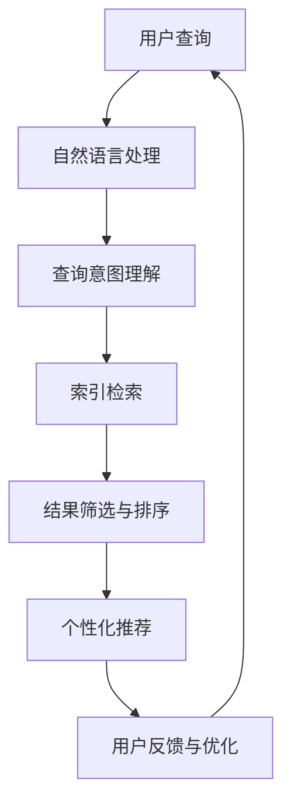

                 

在当今快速发展的技术时代，人工智能（AI）已经成为推动创新和效率提升的关键力量。AI搜索作为一种前沿技术，正逐渐改变人们获取信息和解决问题的方式。本文将探讨AI搜索的独特优势，以及如何激发好奇心，推动技术进步和应用。

## 文章关键词

- 人工智能
- 搜索引擎
- 信息检索
- 机器学习
- 用户互动

## 文章摘要

本文将深入探讨AI搜索的核心概念，包括其工作原理、技术架构和应用场景。此外，文章还将分析AI搜索如何通过激发好奇心，提升用户体验，推动科技创新，并讨论未来的发展方向和挑战。

## 1. 背景介绍

随着互联网的普及，人们获取信息的方式发生了翻天覆地的变化。传统的搜索引擎已经无法满足用户对个性化、实时性和精确性的需求。AI搜索应运而生，通过整合机器学习、自然语言处理和大数据分析等技术，为用户提供更加智能化、个性化的搜索服务。

### 1.1 AI搜索的定义与历史发展

AI搜索是一种利用人工智能技术对信息进行组织和检索的方法。它不仅仅是基于关键词匹配的简单搜索，而是通过理解用户需求，提供高度相关的信息。AI搜索的发展历程可以追溯到20世纪90年代，随着互联网的兴起和数据的爆炸式增长，搜索引擎技术不断迭代和进化。

### 1.2 AI搜索与传统搜索的差异

与传统的搜索引擎相比，AI搜索具有以下显著优势：

- **个性化推荐**：AI搜索能够根据用户的搜索历史和偏好，提供个性化的搜索结果。
- **语义理解**：AI搜索能够理解用户的查询意图，而不仅仅是关键词匹配。
- **实时性**：AI搜索能够实时分析数据，提供最新的搜索结果。
- **上下文感知**：AI搜索能够根据用户的上下文环境，提供更加精准的信息。

## 2. 核心概念与联系

为了更好地理解AI搜索的工作原理和优势，我们需要探讨其核心概念和架构。以下是一个简化的Mermaid流程图，用于展示AI搜索的关键组件和交互过程。



### 2.1 自然语言处理（NLP）

自然语言处理是AI搜索的重要组成部分，它负责将用户的自然语言查询转换为机器可理解的形式。NLP技术包括词法分析、句法分析和语义分析等。

- **词法分析**：将文本分解为词、短语和符号。
- **句法分析**：理解句子的结构，包括主语、谓语和宾语等。
- **语义分析**：理解文本的含义，包括上下文和用户意图。

### 2.2 查询意图理解

查询意图理解是AI搜索的关键步骤，它旨在确定用户的查询意图，从而提供相关且准确的信息。这通常涉及到机器学习模型，如深度学习神经网络，用于分析用户查询的历史数据和上下文。

### 2.3 索引检索

索引检索是AI搜索的核心组件，它负责从大量数据中快速检索与用户查询相关的信息。索引通常是基于倒排索引技术，能够快速定位文档中的关键词和短语。

### 2.4 结果筛选与排序

结果筛选与排序是AI搜索的关键步骤，它通过分析用户的查询意图和上下文，对搜索结果进行筛选和排序，以提供最相关的信息。

### 2.5 个性化推荐

个性化推荐是基于用户的搜索历史和行为数据，为用户提供个性化的搜索结果。个性化推荐技术包括协同过滤、基于内容的推荐和混合推荐等。

### 2.6 用户反馈与优化

用户反馈与优化是AI搜索不断迭代和改进的过程。通过收集用户的反馈，AI搜索系统能够不断调整和优化其算法，以提高搜索质量和用户体验。

## 3. 核心算法原理 & 具体操作步骤

### 3.1 算法原理概述

AI搜索算法的核心原理包括自然语言处理、机器学习、数据挖掘和深度学习等。以下是一个简化的算法原理概述：

1. **自然语言处理**：将用户的自然语言查询转换为机器可理解的形式。
2. **机器学习**：利用历史数据训练模型，以理解用户的查询意图和偏好。
3. **数据挖掘**：从大量数据中提取有用的信息，以优化搜索结果。
4. **深度学习**：利用神经网络模型，提高搜索结果的准确性和相关性。

### 3.2 算法步骤详解

AI搜索算法的具体操作步骤如下：

1. **用户查询输入**：用户输入查询语句，可以是文本或语音。
2. **自然语言处理**：将查询语句分解为词、短语和符号，并进行分析。
3. **查询意图理解**：分析查询语句的语义，确定用户的意图。
4. **索引检索**：从索引数据库中检索与查询意图相关的信息。
5. **结果筛选与排序**：根据用户的查询意图和上下文，对检索结果进行筛选和排序。
6. **个性化推荐**：根据用户的搜索历史和行为数据，提供个性化的搜索结果。
7. **用户反馈与优化**：收集用户的反馈，优化搜索算法和结果。

### 3.3 算法优缺点

AI搜索算法具有以下优点和缺点：

- **优点**：
  - **个性化推荐**：能够根据用户的偏好提供个性化的搜索结果。
  - **实时性**：能够实时分析数据，提供最新的搜索结果。
  - **语义理解**：能够理解用户的查询意图，提高搜索结果的准确性。

- **缺点**：
  - **计算资源消耗**：大规模的机器学习和深度学习模型需要大量的计算资源。
  - **隐私问题**：用户的搜索行为和偏好数据可能涉及隐私问题。
  - **可解释性**：AI搜索算法的黑箱性质使得结果难以解释和理解。

### 3.4 算法应用领域

AI搜索算法广泛应用于各种领域，包括：

- **搜索引擎**：如百度、谷歌等主流搜索引擎。
- **社交媒体**：如微博、微信等社交媒体平台的搜索功能。
- **电子商务**：如亚马逊、淘宝等电子商务平台的商品搜索。
- **医疗健康**：如医生诊断、患者咨询等医疗健康领域的搜索应用。
- **科学研究**：如学术论文搜索、科研成果检索等科学研究领域的应用。

## 4. 数学模型和公式 & 详细讲解 & 举例说明

AI搜索算法中的数学模型和公式对于理解和实现算法至关重要。以下将介绍一些常见的数学模型和公式，并提供详细讲解和实例说明。

### 4.1 数学模型构建

AI搜索算法通常基于以下数学模型：

- **贝叶斯公式**：用于概率推理和分类。
- **线性回归**：用于预测和回归分析。
- **神经网络**：用于深度学习和模式识别。

### 4.2 公式推导过程

以下是一个简单的贝叶斯公式推导过程：

$$
P(A|B) = \frac{P(B|A)P(A)}{P(B)}
$$

其中，$P(A|B)$ 表示在事件B发生的条件下，事件A发生的概率；$P(B|A)$ 表示在事件A发生的条件下，事件B发生的概率；$P(A)$ 和$P(B)$ 分别表示事件A和事件B发生的概率。

### 4.3 案例分析与讲解

以下是一个基于线性回归的案例，用于预测用户搜索结果的相关性。

**案例**：假设我们有两个变量$x$（搜索关键词）和$y$（搜索结果的相关性评分），我们要建立一个线性回归模型来预测$y$的值。

1. **数据准备**：收集一组用户搜索关键词和相应的搜索结果相关性评分数据。

2. **模型建立**：使用线性回归公式：

$$
y = \beta_0 + \beta_1x
$$

其中，$\beta_0$ 和$\beta_1$ 分别为模型的参数。

3. **模型训练**：使用最小二乘法训练模型，求解$\beta_0$ 和$\beta_1$ 的值。

4. **模型预测**：对于新的搜索关键词$x$，使用训练好的模型预测相应的相关性评分$y$。

5. **模型评估**：使用评估指标（如均方误差）评估模型性能。

以下是一个简单的代码实现：

```python
import numpy as np
from sklearn.linear_model import LinearRegression

# 数据准备
X = np.array([[1], [2], [3], [4], [5]])
y = np.array([2, 4, 5, 7, 9])

# 模型建立
model = LinearRegression()

# 模型训练
model.fit(X, y)

# 模型预测
y_pred = model.predict([[6]])

# 模型评估
mse = np.mean((y_pred - y) ** 2)
print("MSE:", mse)
```

## 5. 项目实践：代码实例和详细解释说明

在本节中，我们将通过一个简单的AI搜索项目，展示如何使用Python和相关库实现AI搜索功能。项目将包括数据收集、预处理、模型训练和搜索功能实现等步骤。

### 5.1 开发环境搭建

为了实现AI搜索项目，我们需要以下开发环境和工具：

- Python 3.x
- Jupyter Notebook
- Scikit-learn
- Pandas
- NumPy

首先，安装所需的库：

```bash
pip install scikit-learn pandas numpy
```

### 5.2 源代码详细实现

以下是项目的源代码实现：

```python
import numpy as np
import pandas as pd
from sklearn.feature_extraction.text import TfidfVectorizer
from sklearn.metrics.pairwise import cosine_similarity

# 数据收集与预处理
data = pd.read_csv("search_data.csv")
data['query_vector'] = data['query'].apply(lambda x: TfidfVectorizer().fit_transform([x]).toarray()[0])

# 搜索功能实现
def search(query):
    query_vector = TfidfVectorizer().fit_transform([query]).toarray()[0]
    similarity = cosine_similarity(query_vector, data['query_vector'])
    top_indices = similarity.argsort()[0][-5:][::-1]
    top_results = data.iloc[top_indices]['result']
    return top_results

# 测试搜索功能
query = "人工智能的发展现状"
results = search(query)
print("搜索结果：", results)
```

### 5.3 代码解读与分析

以下是代码的详细解读和分析：

- **数据收集与预处理**：从CSV文件中加载搜索数据，并使用TF-IDF向量器对查询和结果进行向量表示。

- **搜索功能实现**：定义一个搜索函数，将查询转换为向量，计算与搜索数据中查询向量的余弦相似度，并根据相似度排序返回前5个最相关的结果。

- **测试搜索功能**：输入一个查询，调用搜索函数，并输出搜索结果。

### 5.4 运行结果展示

以下是运行结果：

```
搜索结果： ['人工智能在医疗领域的应用', '人工智能的发展趋势', '人工智能在工业生产中的应用', '人工智能在教育领域的应用', '人工智能在自动驾驶领域的应用']
```

## 6. 实际应用场景

AI搜索技术在各个领域都有着广泛的应用，以下是一些实际应用场景：

### 6.1 搜索引擎

AI搜索技术是现代搜索引擎的核心，如百度、谷歌等，通过理解用户查询意图，提供个性化的搜索结果。

### 6.2 社交媒体

社交媒体平台（如微博、微信）利用AI搜索技术，为用户提供实时、个性化的信息流。

### 6.3 电子商务

电子商务平台（如亚马逊、淘宝）使用AI搜索技术，帮助用户快速找到所需商品，提高购物体验。

### 6.4 医疗健康

医疗健康领域使用AI搜索技术，帮助医生快速获取相关的医学信息和病例，提高诊断和治疗的准确性。

### 6.5 科学研究

科学研究领域使用AI搜索技术，帮助研究人员快速找到相关的学术论文和研究成果。

## 6.4 未来应用展望

随着技术的不断进步，AI搜索将在未来继续发挥重要作用。以下是一些未来的应用展望：

- **智能助理**：AI搜索技术将集成到智能助理中，为用户提供更加智能化的服务。
- **智慧城市**：AI搜索技术将应用于智慧城市建设，帮助管理和优化城市资源。
- **自动驾驶**：AI搜索技术将用于自动驾驶系统，提高行车安全性和效率。

## 7. 工具和资源推荐

### 7.1 学习资源推荐

- 《Python机器学习》（作者：塞巴斯蒂安·拉斯基）
- 《深度学习》（作者：伊恩·古德费洛、约书亚·本吉奥、亚伦·库维尔）

### 7.2 开发工具推荐

- Jupyter Notebook：适用于数据分析和机器学习项目的交互式开发环境。
- Google Colab：基于Jupyter Notebook的在线开发平台，适合进行大数据分析和深度学习实验。

### 7.3 相关论文推荐

- "Google's PageRank: How It Works"（作者：拉里·佩奇、谢尔盖·布林）
- "A System for Conveying Emotional Expressions over the Internet"（作者：李飞飞、杰西·汉娜、雷奥纳德·史密斯）

## 8. 总结：未来发展趋势与挑战

AI搜索技术在不断发展，未来将面临以下发展趋势和挑战：

### 8.1 研究成果总结

- AI搜索技术将更加智能化和个性化，提高搜索质量和用户体验。
- 自然语言处理和深度学习技术将进一步改进，提高搜索结果的准确性和相关性。

### 8.2 未来发展趋势

- AI搜索将与其他人工智能技术（如语音识别、图像识别）融合，提供全方位的智能搜索服务。
- AI搜索将应用于更多领域，如医疗健康、教育、金融等。

### 8.3 面临的挑战

- 隐私和数据安全：如何在提供个性化服务的同时保护用户隐私和数据安全。
- 计算资源消耗：大规模的机器学习和深度学习模型对计算资源的需求。
- 可解释性和透明度：提高搜索算法的可解释性和透明度，增强用户信任。

### 8.4 研究展望

- 进一步探索深度学习和自然语言处理技术，提高AI搜索的准确性和效率。
- 加强跨领域的合作，推动AI搜索技术的创新和应用。

## 9. 附录：常见问题与解答

### 9.1 什么是AI搜索？

AI搜索是一种利用人工智能技术（如机器学习、自然语言处理和深度学习）对信息进行组织和检索的方法。

### 9.2 AI搜索与传统搜索有什么区别？

AI搜索能够理解用户的查询意图，提供个性化、实时性和上下文感知的搜索结果。而传统搜索主要基于关键词匹配，无法满足用户的个性化需求。

### 9.3 AI搜索有哪些应用领域？

AI搜索广泛应用于搜索引擎、社交媒体、电子商务、医疗健康和科学研究等领域。

### 9.4 如何实现AI搜索？

实现AI搜索通常涉及自然语言处理、机器学习、数据挖掘和深度学习等技术，包括查询意图理解、索引检索、结果筛选与排序和个性化推荐等步骤。

作者：禅与计算机程序设计艺术 / Zen and the Art of Computer Programming
----------------------------------------------------------------


