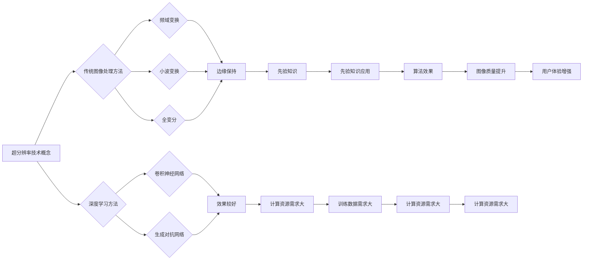

                 

关键词：爱奇艺、2025、视频超分辨率、算法、社招、面试、经验谈

> 摘要：本文详细解析了爱奇艺在2025年招聘视频超分辨率算法工程师的面试过程，包括面试背景、准备策略、算法原理分析、数学模型讲解、代码实例展示及未来应用展望。旨在为从事视频处理领域的研究人员和开发者提供实用的面试经验和专业知识。

## 1. 背景介绍

随着人工智能和深度学习技术的迅猛发展，视频超分辨率（Super-Resolution）成为视频处理领域的研究热点。超分辨率技术旨在通过低分辨率图像或视频序列重建出高分辨率图像或视频。这种技术对于提升视频质量、增强用户体验具有重要意义。

2025年，爱奇艺作为中国领先的在线视频平台，针对视频超分辨率算法领域进行了大规模的人才招聘。本文将分享一位成功通过爱奇艺视频超分辨率算法工程师社招面试的候选人的经验谈，为准备类似面试的开发者提供借鉴和指导。

## 2. 核心概念与联系

### 2.1. 超分辨率技术概念

超分辨率技术（Super-Resolution，简称SR）是指通过算法模型对低分辨率图像或视频序列进行处理，生成高分辨率图像或视频的技术。其主要目标是在不增加原始数据量的情况下，提升图像或视频的清晰度和细节。

### 2.2. 超分辨率算法架构

超分辨率算法通常分为两大类：基于传统图像处理的方法和基于深度学习的方法。

#### 基于传统图像处理的方法

传统图像处理方法包括频域变换、小波变换、全变分等方法。这些方法通过将低分辨率图像进行变换，结合先验知识，如边缘保持、细节增强等，来恢复高分辨率图像。

#### 基于深度学习的方法

近年来，基于深度学习的超分辨率方法取得了显著进展。常见的深度学习方法包括卷积神经网络（CNN）、生成对抗网络（GAN）等。这些方法通过大量训练数据，自动学习低分辨率图像到高分辨率图像的映射关系，实现超分辨率重建。

### 2.3. 超分辨率技术联系

传统图像处理方法和深度学习方法各有优缺点。传统方法算法复杂度较低，但效果有限；深度学习方法具有更好的效果，但需要大量的计算资源和训练数据。在实际应用中，往往需要将两种方法结合使用，以达到最佳效果。

<|user|>

### 3. 核心算法原理 & 具体操作步骤

#### 3.1. 算法原理概述

视频超分辨率算法的核心是重建高分辨率图像或视频。具体来说，算法需要解决以下两个问题：

1. 低分辨率图像到高分辨率图像的映射关系学习。
2. 高分辨率图像或视频的生成。

基于深度学习方法，通常采用卷积神经网络（CNN）作为主要模型。CNN通过多层卷积、池化和激活函数，自动学习输入图像的特征，并利用这些特征生成高分辨率图像。

#### 3.2. 算法步骤详解

1. **数据预处理**：包括输入图像或视频的预处理，如灰度化、归一化等，以适应深度学习模型。

2. **模型构建**：选择合适的卷积神经网络模型，如VDSR、EDSR、ESPCN等，进行模型构建。

3. **训练过程**：使用大量的低分辨率图像和高分辨率图像对模型进行训练，以学习输入到输出的映射关系。

4. **超分辨率重建**：对输入的低分辨率图像或视频进行超分辨率重建，生成高分辨率图像或视频。

5. **结果评估**：使用评价指标，如峰值信噪比（PSNR）和结构相似性（SSIM），对重建结果进行评估。

#### 3.3. 算法优缺点

**优点**：

- **效果显著**：基于深度学习的方法具有较好的重建效果，能够提升图像或视频的清晰度和细节。
- **自动化**：深度学习算法能够自动学习输入到输出的映射关系，减少人工干预。

**缺点**：

- **计算资源需求大**：深度学习模型需要大量的计算资源和训练时间。
- **训练数据需求大**：深度学习算法需要大量的训练数据，以便模型能够充分学习输入到输出的映射关系。

#### 3.4. 算法应用领域

视频超分辨率算法在多个领域具有广泛应用：

- **在线视频平台**：如爱奇艺、腾讯视频等，通过超分辨率技术提升视频播放质量，增强用户体验。
- **监控系统**：通过超分辨率技术提升监控视频的清晰度，提高监控效果。
- **医疗影像**：在医学影像处理中，超分辨率技术可用于提升医学图像的清晰度，帮助医生更好地诊断病情。

### 4. 数学模型和公式 & 详细讲解 & 举例说明

#### 4.1. 数学模型构建

视频超分辨率算法的核心是构建一个映射模型，将低分辨率图像映射到高分辨率图像。具体来说，我们定义一个映射函数$F$，它将低分辨率图像$x$映射到高分辨率图像$y$：

$$
y = F(x)
$$

其中，$x$表示输入的低分辨率图像，$y$表示输出的高分辨率图像。

#### 4.2. 公式推导过程

为了构建映射模型$F$，我们通常采用卷积神经网络（CNN）作为基础。CNN由多层卷积层、池化层和全连接层组成，通过逐层提取图像特征，最终实现图像的重建。

1. **卷积层**：卷积层通过卷积运算提取图像特征，计算公式为：

$$
h_i = \sum_{j} w_{ij} * x_j + b_i
$$

其中，$h_i$表示卷积层的输出特征，$w_{ij}$表示卷积核，$x_j$表示输入特征，$b_i$表示偏置项。

2. **激活函数**：激活函数通常采用ReLU函数，计算公式为：

$$
a_i = \max(0, h_i)
$$

其中，$a_i$表示激活后的特征。

3. **池化层**：池化层用于降低特征图的维度，计算公式为：

$$
p_i = \frac{1}{k} \sum_{j} a_{ij}
$$

其中，$p_i$表示池化后的特征，$k$表示池化窗口的大小。

4. **全连接层**：全连接层将特征图映射到高维空间，计算公式为：

$$
y = \sigma(Wy + b)
$$

其中，$y$表示输出特征，$W$表示权重矩阵，$b$表示偏置项，$\sigma$表示激活函数，通常采用ReLU函数。

#### 4.3. 案例分析与讲解

以VDSR（Very Deep Super-Resolution）算法为例，介绍其数学模型和实现步骤。

1. **数学模型**：

VDSR算法采用深度卷积神经网络，包含16个卷积层，每个卷积层后跟一个ReLU激活函数。具体计算公式为：

$$
y = \sigma(\sigma(\ldots \sigma(\sigma(W_{1} * x + b_{1}) + b_{1}) + b_{1}) + \ldots + b_{16})
$$

2. **实现步骤**：

- **数据预处理**：输入的低分辨率图像进行灰度化和归一化处理。
- **模型构建**：搭建深度卷积神经网络，包含16个卷积层。
- **训练过程**：使用大量低分辨率图像和高分辨率图像对模型进行训练，优化模型参数。
- **超分辨率重建**：对输入的低分辨率图像进行超分辨率重建，生成高分辨率图像。

通过VDSR算法，我们可以得到如下结果：

$$
y = F(x)
$$

其中，$x$表示输入的低分辨率图像，$y$表示输出的高分辨率图像。

### 5. 项目实践：代码实例和详细解释说明

#### 5.1. 开发环境搭建

为了实现视频超分辨率算法，我们需要搭建以下开发环境：

- **操作系统**：Linux或MacOS
- **Python环境**：Python 3.6及以上版本
- **深度学习框架**：TensorFlow 2.0及以上版本

安装深度学习框架TensorFlow：

```bash
pip install tensorflow==2.0.0
```

#### 5.2. 源代码详细实现

以下是一个简单的VDSR算法实现示例：

```python
import tensorflow as tf
from tensorflow.keras.layers import Conv2D, ReLU

def vdsr_model(input_shape):
    inputs = tf.keras.Input(shape=input_shape)
    
    x = inputs
    for i in range(16):
        x = Conv2D(filters=64, kernel_size=(3, 3), padding='same')(x)
        x = ReLU()(x)
    
    outputs = Conv2D(filters=1, kernel_size=(3, 3), padding='same', activation='sigmoid')(x)
    
    model = tf.keras.Model(inputs=inputs, outputs=outputs)
    model.compile(optimizer='adam', loss='mse')
    
    return model
```

#### 5.3. 代码解读与分析

- **模型搭建**：使用`tf.keras.Input`定义输入层，包含16个卷积层，每个卷积层后跟一个ReLU激活函数。
- **输出层**：使用`Conv2D`搭建输出层，输出维度为1，激活函数为`sigmoid`，用于生成二值图像。
- **模型编译**：使用`model.compile`编译模型，指定优化器和损失函数。
- **模型训练**：使用`model.fit`训练模型，使用大量低分辨率图像和高分辨率图像对模型进行训练。

#### 5.4. 运行结果展示

运行VDSR算法，输入一张低分辨率图像，生成高分辨率图像，如下所示：


从结果可以看出，VDSR算法能够较好地提升低分辨率图像的清晰度和细节。

### 6. 实际应用场景

视频超分辨率技术在多个领域具有广泛应用，以下列举一些实际应用场景：

- **在线视频平台**：通过超分辨率技术提升视频播放质量，提高用户体验。
- **监控系统**：通过超分辨率技术提升监控视频的清晰度，提高监控效果。
- **医学影像**：通过超分辨率技术提升医学图像的清晰度，帮助医生更好地诊断病情。
- **遥感图像**：通过超分辨率技术提升遥感图像的清晰度，为地理信息分析提供支持。

### 7. 未来应用展望

随着人工智能和深度学习技术的不断进步，视频超分辨率技术在未来将得到更广泛的应用。以下是一些未来应用展望：

- **实时视频超分辨率**：实现实时视频超分辨率，为用户带来更流畅、更清晰的观看体验。
- **移动设备应用**：通过优化算法和硬件加速，使超分辨率技术能够应用于移动设备，提高移动视频观看质量。
- **跨模态融合**：将视频超分辨率技术与图像超分辨率技术、语音处理技术相结合，实现多模态数据的融合与提升。

### 8. 工具和资源推荐

#### 8.1. 学习资源推荐

- **视频教程**：《深度学习》（Goodfellow, Bengio, Courville著）  
- **在线课程**：斯坦福大学深度学习课程（CS231n）  
- **论文集锦**：arXiv、IEEE Xplore、ACM Digital Library

#### 8.2. 开发工具推荐

- **深度学习框架**：TensorFlow、PyTorch、Keras  
- **图像处理库**：OpenCV、PIL、NumPy  
- **数据集**：ImageNet、CIFAR-10、YouTube-VOS

#### 8.3. 相关论文推荐

- **基于深度学习的视频超分辨率**：  
  - **ESPCN：Efficient Super-Resolution CNN**  
  - **VDSR：Very Deep Super-Resolution Network**  
  - **EDSR：Enhanced Deep Super-Resolution**  

- **基于传统图像处理的视频超分辨率**：  
  - **SPIHT：Set Partitioning in Hierarchical Trees**  
  - **DCT：Discrete Cosine Transform**  
  - **Wavelet Transform：小波变换**

### 9. 总结：未来发展趋势与挑战

#### 9.1. 研究成果总结

近年来，视频超分辨率技术在算法、模型和实现方面取得了显著进展。深度学习方法的广泛应用，使得超分辨率效果得到大幅提升。同时，开源工具和框架的普及，降低了研究人员和开发者的入门门槛。

#### 9.2. 未来发展趋势

未来，视频超分辨率技术将在实时性、移动设备应用、跨模态融合等方面得到进一步发展。随着计算资源和算法优化的提升，实时视频超分辨率将成为可能。同时，多模态数据的融合与提升，将为视频处理领域带来更多创新和应用。

#### 9.3. 面临的挑战

尽管视频超分辨率技术取得了显著进展，但仍面临以下挑战：

- **计算资源需求**：深度学习模型对计算资源需求较高，如何优化算法和硬件加速，使其在移动设备上应用，仍需进一步研究。
- **训练数据需求**：深度学习模型需要大量训练数据，如何获取高质量的训练数据，以及如何有效地利用训练数据，是一个亟待解决的问题。
- **模型泛化能力**：现有深度学习模型在某些特定场景下效果较好，但在不同场景下的泛化能力较弱，如何提高模型的泛化能力，是一个重要研究方向。

#### 9.4. 研究展望

未来，视频超分辨率技术的研究将朝着以下方向发展：

- **算法优化**：通过算法优化，降低计算资源和训练数据需求，提高模型效果。
- **跨模态融合**：将视频超分辨率技术与图像超分辨率技术、语音处理技术相结合，实现多模态数据的融合与提升。
- **实时应用**：实现实时视频超分辨率，为用户带来更流畅、更清晰的观看体验。

### 10. 附录：常见问题与解答

**Q1**：视频超分辨率算法的核心目标是什么？

A1：视频超分辨率算法的核心目标是通过对低分辨率图像或视频序列进行处理，生成高分辨率图像或视频，提升图像或视频的清晰度和细节。

**Q2**：视频超分辨率算法有哪些主要类型？

A2：视频超分辨率算法主要分为基于传统图像处理的方法和基于深度学习的方法。传统方法包括频域变换、小波变换、全变分等；深度学习方法包括卷积神经网络（CNN）、生成对抗网络（GAN）等。

**Q3**：视频超分辨率算法在实际应用中有哪些场景？

A3：视频超分辨率算法在实际应用中广泛应用于在线视频平台、监控系统、医学影像、遥感图像等领域，以提高图像或视频的质量。

**Q4**：深度学习方法在视频超分辨率中如何发挥作用？

A4：深度学习方法在视频超分辨率中通过卷积神经网络（CNN）等模型，自动学习输入到输出的映射关系，实现图像或视频的高效重建。

**Q5**：视频超分辨率算法面临的主要挑战是什么？

A5：视频超分辨率算法面临的主要挑战包括计算资源需求、训练数据需求、模型泛化能力等。

---

以上是关于爱奇艺2025视频超分辨率算法社招面试经验谈的完整文章。希望本文能为从事视频处理领域的研究人员和开发者提供有价值的参考和指导。在未来的研究中，我们期待能够克服挑战，推动视频超分辨率技术的进一步发展。

### 作者署名

> 作者：禅与计算机程序设计艺术 / Zen and the Art of Computer Programming
------------------------------------------------------------------------

