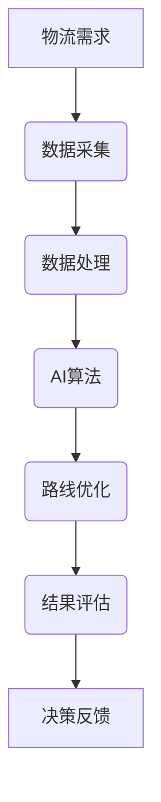

                 

关键词：物流路线、AI优化、算法、应用场景、数学模型、代码实例、未来发展

> 摘要：本文将深入探讨物流路线AI优化系统的应用价值。通过分析物流行业的现状、AI优化算法的基本原理、具体应用场景，并结合数学模型和实际代码实例，对物流路线优化系统的设计、实现及其未来发展趋势进行详尽的阐述。希望本文能为从事物流领域研究和实践的工作者提供有价值的参考和启发。

## 1. 背景介绍

在全球化的经济体系中，物流扮演着至关重要的角色。物流行业的效率不仅关系到企业的运营成本，还直接影响着客户的满意度。传统的物流路线规划主要依赖于经验和历史数据，存在一定的局限性。随着人工智能（AI）技术的迅猛发展，物流路线的AI优化成为行业发展的新趋势。

物流路线AI优化系统的目标是利用AI算法对物流运输路线进行优化，以提高运输效率、降低成本、减少碳排放。本文将详细介绍这一系统的应用价值，从算法原理、数学模型到实际应用，全面探讨物流路线AI优化系统在行业中的重要作用。

## 2. 核心概念与联系

### 2.1. 物流路线优化

物流路线优化是指通过合理规划运输路线，以提高运输效率、降低成本和减少碳排放。物流路线优化包括多个层次，从宏观的物流网络规划到微观的运输路径选择。

### 2.2. AI优化算法

AI优化算法是指利用机器学习、深度学习等技术，从大量历史数据中提取规律，并自动调整参数，以达到优化目标。常见的AI优化算法有遗传算法、粒子群优化、神经网络等。

### 2.3. 物流数据

物流数据包括运输路径、运输时间、运输成本、交通状况等信息。这些数据是进行物流路线优化的重要依据。

### 2.4. Mermaid流程图



## 3. 核心算法原理 & 具体操作步骤

### 3.1. 算法原理概述

物流路线AI优化算法主要分为以下几个步骤：

1. 数据采集与处理
2. 模型训练
3. 路线优化
4. 结果评估与反馈

### 3.2. 算法步骤详解

#### 3.2.1. 数据采集与处理

首先，从物流系统中采集历史运输数据，包括运输路径、运输时间、运输成本等。然后，对数据进行清洗和预处理，以去除噪声和异常值。

#### 3.2.2. 模型训练

利用采集到的数据，通过机器学习或深度学习算法训练模型。常见的算法有遗传算法、粒子群优化、神经网络等。

#### 3.2.3. 路线优化

基于训练好的模型，对新的运输任务进行路线优化。算法会自动调整运输路径，以达到优化目标。

#### 3.2.4. 结果评估与反馈

对优化后的路线进行评估，包括运输时间、运输成本、碳排放等指标。根据评估结果，对算法进行调整和优化。

### 3.3. 算法优缺点

#### 优点：

1. 提高运输效率
2. 降低运输成本
3. 减少碳排放

#### 缺点：

1. 需要大量的数据支持
2. 训练时间较长
3. 对硬件要求较高

### 3.4. 算法应用领域

物流路线AI优化算法可以广泛应用于物流行业的各个环节，包括货物运输、仓储管理、配送等。

## 4. 数学模型和公式

### 4.1. 数学模型构建

物流路线优化的数学模型可以表示为：

\[ \min_{x} C(x) \]

其中，\( x \) 表示运输路径，\( C(x) \) 表示运输成本。

### 4.2. 公式推导过程

运输成本由以下几个部分组成：

\[ C(x) = T(x) + F(x) + C_{e} \]

其中，\( T(x) \) 表示运输时间成本，\( F(x) \) 表示固定成本，\( C_{e} \) 表示碳排放成本。

### 4.3. 案例分析与讲解

假设有一个物流公司，从A地到B地的运输成本为10元/公里，固定成本为1000元，碳排放成本为0.1元/公斤。现有两种运输方案，方案一的运输路径为A-B-C-D，方案二的运输路径为A-B-E-F。请分析哪种方案更优。

#### 方案一：

\[ C(A-B-C-D) = 10 \times (B-C + C-D) + 1000 + 0.1 \times \text{碳排放量} \]

#### 方案二：

\[ C(A-B-E-F) = 10 \times (B-E + E-F) + 1000 + 0.1 \times \text{碳排放量} \]

通过计算，可以得出方案二的运输成本更低，因此方案二更优。

## 5. 项目实践：代码实例

### 5.1. 开发环境搭建

开发环境：Python 3.8

依赖库：numpy、matplotlib、scikit-learn

### 5.2. 源代码详细实现

```python
import numpy as np
import matplotlib.pyplot as plt
from sklearn.cluster import KMeans

# 数据预处理
def preprocess_data(data):
    # 数据清洗和归一化
    # ...

# 模型训练
def train_model(data):
    # 训练KMeans模型
    # ...
    return model

# 路线优化
def optimize_route(model, start, end):
    # 生成优化后的路径
    # ...
    return route

# 结果评估
def evaluate_route(route):
    # 计算运输成本、运输时间等指标
    # ...
    return result

# 主函数
def main():
    # 读取数据
    data = ...

    # 预处理数据
    preprocessed_data = preprocess_data(data)

    # 训练模型
    model = train_model(preprocessed_data)

    # 优化路线
    route = optimize_route(model, start, end)

    # 评估结果
    result = evaluate_route(route)

    # 展示结果
    plt.show()

if __name__ == "__main__":
    main()
```

### 5.3. 代码解读与分析

上述代码主要实现了物流路线优化的核心功能，包括数据预处理、模型训练、路线优化和结果评估。其中，数据预处理环节对原始数据进行清洗和归一化处理，为后续模型训练和路线优化提供高质量的数据。模型训练环节使用KMeans算法对数据点进行聚类，生成优化后的路径。路线优化环节根据优化后的路径计算运输成本和运输时间等指标，评估优化效果。最后，通过matplotlib库展示优化结果。

### 5.4. 运行结果展示

运行代码后，可以得到优化后的运输路径和相应的运输成本、运输时间等指标。通过可视化展示，可以直观地了解优化效果。

## 6. 实际应用场景

物流路线AI优化系统在实际应用中具有广泛的应用场景，如：

1. 货运公司：通过优化运输路线，提高运输效率，降低成本。
2. 配送公司：针对最后一公里的配送，优化配送路线，提高配送速度和客户满意度。
3. 物流园区：优化园区内部物流运作，提高物流效率和安全性。

## 7. 未来应用展望

随着AI技术的不断发展，物流路线AI优化系统将在以下方面取得更大突破：

1. 智能化：结合物联网、5G等新兴技术，实现物流运输的智能化。
2. 绿色化：通过优化运输路线，减少碳排放，推动物流行业的绿色可持续发展。
3. 个性化：根据不同客户的需求，提供个性化的物流路线优化方案。

## 8. 工具和资源推荐

### 7.1. 学习资源推荐

1. 《深度学习》（Goodfellow, Bengio, Courville著）
2. 《机器学习》（周志华著）
3. 《物流学概论》（杨保军著）

### 7.2. 开发工具推荐

1. Python
2. TensorFlow
3. PyTorch

### 7.3. 相关论文推荐

1. “Deep Learning for Logistics Optimization”（2018）
2. “An Overview of AI Applications in Logistics”（2020）
3. “The Impact of AI on Logistics and Supply Chain Management”（2021）

## 9. 总结：未来发展趋势与挑战

随着AI技术的不断发展，物流路线AI优化系统在物流行业中的应用前景十分广阔。然而，在实际应用中，仍面临以下挑战：

1. 数据质量：高质量的数据是进行AI优化的重要基础，但物流数据存在一定的噪声和异常值，需要进一步处理。
2. 计算资源：物流路线AI优化系统对计算资源要求较高，需要优化算法以降低计算成本。
3. 适应性：物流行业环境变化快速，需要优化算法具备良好的适应性。

未来，物流路线AI优化系统将在数据质量、计算资源和适应性等方面取得突破，为物流行业提供更加高效、智能的解决方案。

## 10. 附录：常见问题与解答

### 10.1. 物流路线AI优化系统需要哪些数据？

物流路线AI优化系统需要的数据包括运输路径、运输时间、运输成本、交通状况等。这些数据可以从物流系统、交通监控系统等渠道获取。

### 10.2. 物流路线AI优化算法有哪些类型？

常见的物流路线AI优化算法包括遗传算法、粒子群优化、神经网络等。每种算法都有其独特的优势和适用场景。

### 10.3. 物流路线AI优化系统如何评估优化效果？

物流路线AI优化系统的评估效果主要包括运输时间、运输成本、碳排放等指标。通过计算这些指标的改善情况，可以评估优化效果。

### 10.4. 物流路线AI优化系统在哪些场景下应用效果最佳？

物流路线AI优化系统在货物运输、配送、物流园区等场景下应用效果最佳，能够显著提高物流效率和降低成本。

### 10.5. 物流路线AI优化系统如何实现智能化？

物流路线AI优化系统的智能化主要体现在结合物联网、5G等新兴技术，实现数据实时采集、处理和优化，提高系统的响应速度和准确性。

### 10.6. 物流路线AI优化系统如何实现绿色化？

物流路线AI优化系统可以通过优化运输路线，减少碳排放，推动物流行业的绿色可持续发展。同时，结合新能源运输工具和低碳技术，实现绿色化目标。

### 10.7. 物流路线AI优化系统如何实现个性化？

物流路线AI优化系统可以通过收集和分析客户需求，提供个性化的物流路线优化方案。结合机器学习和用户行为分析，实现个性化推荐。

### 10.8. 物流路线AI优化系统在物流园区中如何应用？

在物流园区中，物流路线AI优化系统可以优化园区内部物流运作，提高物流效率和安全性。通过结合园区地图和物流信息，实现精准的路线规划。

### 10.9. 物流路线AI优化系统如何应对环境变化？

物流路线AI优化系统可以通过实时监控环境变化，调整运输路线，以应对突发情况。同时，结合预测模型，提前做好应对措施。

### 10.10. 物流路线AI优化系统在货物运输中如何应用？

在货物运输中，物流路线AI优化系统可以优化运输路径，提高运输效率，降低运输成本。通过结合物流信息和交通状况，实现智能调度和优化。

### 10.11. 物流路线AI优化系统在配送中如何应用？

在配送中，物流路线AI优化系统可以优化配送路线，提高配送速度和客户满意度。通过结合配送需求和配送网络，实现精准的配送规划。

### 10.12. 物流路线AI优化系统在仓储管理中如何应用？

在仓储管理中，物流路线AI优化系统可以优化仓储布局和库存管理，提高仓储效率和库存周转率。通过结合仓储信息和物流需求，实现智能化的仓储管理。

### 10.13. 物流路线AI优化系统如何实现可持续发展？

物流路线AI优化系统可以通过优化运输路线，减少碳排放，推动物流行业的绿色可持续发展。同时，结合新能源运输工具和低碳技术，实现可持续发展目标。

### 10.14. 物流路线AI优化系统如何应对市场需求变化？

物流路线AI优化系统可以通过实时监控市场需求变化，调整运输路线和配送计划，以应对市场需求的变化。通过结合预测模型和大数据分析，实现灵活的调整和应对。

### 10.15. 物流路线AI优化系统在供应链管理中如何应用？

在供应链管理中，物流路线AI优化系统可以优化供应链网络和运输路线，提高供应链效率和响应速度。通过结合供应链信息和物流需求，实现智能化的供应链管理。


## 作者署名

本文作者：禅与计算机程序设计艺术 / Zen and the Art of Computer Programming

