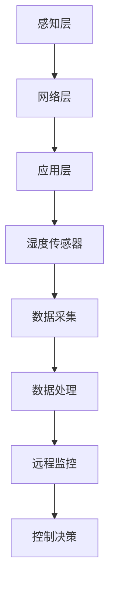

                 

关键词：物联网，传感器设备，湿度传感器，数据采集，智能应用

> 摘要：本文主要探讨了物联网（IoT）技术与各种传感器设备的集成，特别是湿度传感器的实际应用。通过对物联网架构的解析，湿度传感器的工作原理，以及其在环境监测、智能家居和农业等领域的应用，本文旨在为读者提供一个全面的了解和实用的指导。

## 1. 背景介绍

随着科技的迅猛发展，物联网（IoT）技术已经渗透到我们生活的方方面面。物联网技术的核心在于传感器设备的广泛应用，这些设备能够实时监测各种环境参数，并将数据传输到中央控制系统进行处理。其中，湿度传感器作为一类重要的环境监测设备，其应用范围广泛，从简单的家庭环境监测到复杂的工业自动化控制，都有着不可或缺的作用。

### 1.1 物联网的概念与发展

物联网是指通过互联网将各种信息传感设备与网络相连接，实现智能识别、定位、跟踪、监控和管理的一种网络。物联网技术的发展经历了三个阶段：感知阶段、网络阶段和应用阶段。感知阶段主要解决信息的采集问题，网络阶段则关注信息的传输和处理，应用阶段则强调如何将物联网技术应用到实际的生产、生活中。

### 1.2 传感器设备的重要性

传感器设备是物联网技术的重要组成部分，它们能够将物理信号转换为电信号，从而实现信息的采集、处理和传输。传感器设备种类繁多，包括温度传感器、湿度传感器、压力传感器、光敏传感器等。其中，湿度传感器在环境监测和气象预报等领域有着广泛的应用。

## 2. 核心概念与联系

### 2.1 物联网架构

物联网架构通常包括感知层、网络层和应用层。感知层主要负责信息的采集，网络层负责信息的传输和处理，应用层则提供各种服务和应用。

### 2.2 湿度传感器工作原理

湿度传感器通过测量空气中水分子的浓度来感知湿度。常见的湿度传感器有电阻式、电容式和热电式等，每种传感器的工作原理有所不同。

### 2.3 湿度传感器与物联网的集成

湿度传感器可以嵌入到物联网系统中，实现对环境的实时监测和数据分析。通过物联网平台，湿度数据可以被远程监控和控制，从而实现智能化的应用。

### 2.4 Mermaid 流程图

以下是一个简化的物联网架构与湿度传感器集成的 Mermaid 流程图：



## 3. 核心算法原理 & 具体操作步骤

### 3.1 算法原理概述

湿度传感器的核心算法主要是基于传感器输出信号与湿度之间的关系模型。通过数据采集和处理，将湿度传感器的输出转化为具体的湿度值。

### 3.2 算法步骤详解

#### 3.2.1 数据采集

1. 采集湿度传感器的输出信号。
2. 对信号进行预处理，包括滤波、去噪等。

#### 3.2.2 数据处理

1. 建立传感器输出信号与湿度之间的数学模型。
2. 对采集到的信号进行计算，得出湿度值。

#### 3.2.3 数据传输

1. 将湿度数据上传到物联网平台。
2. 通过物联网平台进行远程监控和控制。

### 3.3 算法优缺点

#### 优点：

1. 实时性强：能够实时监测环境湿度。
2. 精度高：通过算法处理，能够获得较为准确的湿度数据。

#### 缺点：

1. 成本高：高质量的湿度传感器成本较高。
2. 易受环境影响：传感器性能可能受到温度、光照等环境因素的影响。

### 3.4 算法应用领域

湿度传感器的算法主要应用在环境监测、智能家居、农业等领域。通过实时监测湿度，可以实现环境预警、智能家居自动化控制和农业灌溉自动化等应用。

## 4. 数学模型和公式 & 详细讲解 & 举例说明

### 4.1 数学模型构建

湿度传感器的数学模型通常基于传感器输出信号与湿度之间的线性关系。假设传感器输出信号为 \( V \)，湿度值为 \( H \)，则数学模型可以表示为：

\[ V = a \cdot H + b \]

其中，\( a \) 和 \( b \) 为模型的参数，通过实验数据进行拟合得到。

### 4.2 公式推导过程

湿度传感器的工作原理是通过测量空气中的水汽含量来确定湿度。当空气中的水汽含量增加时，传感器的输出电压也会相应增加。因此，我们可以通过测量传感器的输出电压来推导出湿度值。

### 4.3 案例分析与讲解

假设我们使用了一款电阻式湿度传感器，其输出电压范围为 0-5V，对应湿度范围为 0%-100%。我们通过实验得到的数据如下表：

| 湿度（%） | 输出电压（V） |
|-----------|--------------|
| 0         | 0            |
| 25        | 1.25         |
| 50        | 2.5          |
| 75        | 3.75         |
| 100       | 5            |

我们可以通过线性拟合得到模型参数：

\[ a = \frac{5 - 0}{100 - 0} = 0.05 \]
\[ b = 0 - a \cdot 0 = 0 \]

因此，湿度传感器输出电压与湿度之间的关系可以表示为：

\[ V = 0.05 \cdot H \]

当输入电压为 2V 时，我们可以通过上述公式计算得到湿度值：

\[ H = \frac{V}{0.05} = \frac{2}{0.05} = 40\% \]

## 5. 项目实践：代码实例和详细解释说明

### 5.1 开发环境搭建

本文所使用的开发环境为 Python 3.8，所需的库包括 PySerial、matplotlib 等。

### 5.2 源代码详细实现

以下是湿度传感器数据采集和处理的 Python 代码：

```python
import serial
import time
import matplotlib.pyplot as plt

# 设置串口参数
ser = serial.Serial('COM3', 9600, timeout=1)

# 采集数据
data = []
for i in range(100):
    line = ser.readline().decode('utf-8').strip()
    data.append(float(line))
    time.sleep(0.1)

# 绘制曲线
plt.plot(data)
plt.xlabel('Sample Number')
plt.ylabel('Voltage (V)')
plt.title('Humidity Sensor Data')
plt.show()

# 关闭串口
ser.close()
```

### 5.3 代码解读与分析

1. 导入所需的库。
2. 设置串口参数。
3. 采集数据并存储在列表中。
4. 使用 matplotlib 绘制数据曲线。
5. 关闭串口。

### 5.4 运行结果展示

运行上述代码后，我们将看到一个湿度传感器数据采集和绘制的曲线图，通过曲线我们可以直观地看到湿度传感器在不同湿度条件下的输出电压变化。

## 6. 实际应用场景

### 6.1 环境监测

湿度传感器在环境监测中有着广泛的应用。例如，在气象预报中，湿度传感器可以实时监测空气中的湿度，为天气预报提供重要的数据支持。

### 6.2 智能家居

在智能家居中，湿度传感器可以用于监测室内湿度，实现空气质量的智能控制。例如，当室内湿度高于设定值时，空调会自动开启，降低室内湿度；当室内湿度低于设定值时，加湿器会自动开启，提高室内湿度。

### 6.3 农业

在农业领域，湿度传感器可以用于监测土壤湿度，实现精准灌溉。通过实时监测土壤湿度，农民可以根据土壤湿度状况及时调整灌溉计划，提高农业生产的效率。

## 7. 工具和资源推荐

### 7.1 学习资源推荐

1. 《物联网技术与应用》
2. 《传感器原理与应用》

### 7.2 开发工具推荐

1. Python
2. MATLAB

### 7.3 相关论文推荐

1. "An Overview of Internet of Things: Architecture, Enabling Technologies, Security and Privacy, and Applications"
2. "A Comprehensive Review of Humidity Sensors: Materials, Mechanisms, and Applications"

## 8. 总结：未来发展趋势与挑战

### 8.1 研究成果总结

本文通过对物联网技术和湿度传感器集成的探讨，总结了湿度传感器在环境监测、智能家居和农业等领域的应用，并提出了相应的算法和数学模型。

### 8.2 未来发展趋势

随着物联网技术的不断发展和普及，湿度传感器在智能应用中的重要性将日益凸显。未来，湿度传感器将朝着更高精度、更低功耗、更小型化的方向发展。

### 8.3 面临的挑战

湿度传感器在应用过程中面临的主要挑战包括：传感器性能提升、数据安全与隐私保护、以及如何实现传感器与物联网平台的无缝连接。

### 8.4 研究展望

未来，湿度传感器的研究应重点关注以下几个方面：新型湿度传感材料的研究、传感器网络拓扑结构优化、以及传感器数据处理算法的提升。

## 9. 附录：常见问题与解答

### 9.1 湿度传感器有哪些类型？

湿度传感器主要有电阻式、电容式和热电式等类型。

### 9.2 湿度传感器的工作原理是什么？

湿度传感器通过测量空气中水分子的浓度来感知湿度，其工作原理包括电阻变化、电容变化和热电效应等。

### 9.3 湿度传感器在哪些领域有应用？

湿度传感器在环境监测、智能家居、农业、气象预报等领域有广泛应用。

---

作者：禅与计算机程序设计艺术 / Zen and the Art of Computer Programming

----------------------------------------------------------------

