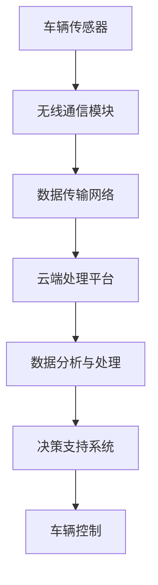

                 

关键词：物联网，传感器，车联网，数据采集，智能交通，数据处理，实时监控

> 摘要：本文详细探讨了物联网（IoT）技术和各种传感器设备的集成方法，以及物联网在车联网中的应用。通过对传感器设备在车联网中的角色、数据采集与处理的流程、以及物联网技术的优势与挑战进行分析，本文旨在为读者提供关于物联网在车联网领域应用的全面了解。

## 1. 背景介绍

随着科技的飞速发展，物联网（IoT）技术正逐渐渗透到我们的日常生活和各个行业领域。物联网通过将各种设备连接到互联网，实现数据的实时采集、传输和处理，从而为智能决策提供了有力支持。在车联网领域，物联网技术发挥了至关重要的作用，它不仅提升了车辆的性能和安全性，还推动了交通管理和服务方式的创新。

车联网，顾名思义，是指通过信息通信技术将车辆与道路、基础设施和其他车辆进行连接，实现车辆间以及车辆与基础设施间的信息交换和协同工作。车联网的发展离不开物联网技术的支持，尤其是在传感器设备的应用方面。传感器设备是车联网数据采集的核心，通过这些设备，车辆能够实时感知周围环境，从而做出快速响应。

本文将从以下几个方面展开讨论：

1. **物联网技术和传感器设备的集成方法**
2. **车联网中传感器设备的角色与作用**
3. **数据采集与处理的流程**
4. **物联网技术的优势与挑战**
5. **物联网在车联网中的实际应用**
6. **未来应用展望与挑战**

通过本文的讨论，希望能够为读者提供对物联网在车联网中应用的一个全面而深入的认知。

## 2. 核心概念与联系

### 2.1 物联网（IoT）技术

物联网（IoT）是一种将物理设备（如传感器、执行器等）通过互联网进行互联的技术。它通过收集、传输和处理数据，实现设备之间的智能协同工作。物联网技术的核心组成部分包括：

- **感知层**：由各种传感器设备组成，负责采集环境数据。
- **网络层**：实现数据的传输，包括无线通信网络和有线网络。
- **平台层**：提供数据存储、处理和分析的平台。
- **应用层**：为用户提供具体的应用场景和解决方案。

### 2.2 传感器设备

传感器设备是物联网系统中的关键组件，负责采集各种环境数据，如温度、湿度、速度、加速度等。根据工作原理，传感器可以分为以下几类：

- **物理传感器**：如温度传感器、压力传感器。
- **光电传感器**：如光电传感器、激光雷达。
- **化学传感器**：如气体传感器、湿度传感器。
- **生物传感器**：如心率传感器、血糖传感器。

### 2.3 车联网（V2X）

车联网（V2X）是指车辆与所有外部实体（如车辆、基础设施、行人等）进行信息交换的系统。车联网的关键技术包括：

- **V2V（车辆对车辆）**：实现车辆之间的信息共享和通信。
- **V2I（车辆对基础设施）**：实现车辆与道路基础设施之间的通信。
- **V2P（车辆对行人）**：实现车辆与行人之间的信息交互。
- **V2N（车辆对网络）**：实现车辆与云计算平台之间的数据传输。

### 2.4 数据采集与处理

在车联网系统中，传感器设备负责采集车辆运行状态和环境数据，如车速、车距、道路状况等。这些数据通过无线通信网络传输到云端或本地处理平台，进行实时分析和处理，以支持智能交通管理和车辆控制。

### 2.5 Mermaid 流程图

以下是一个简化的车联网系统数据采集与处理的 Mermaid 流程图：



### 2.6 物联网在车联网中的应用场景

物联网在车联网中的应用场景广泛，包括但不限于：

- **实时交通监控**：通过传感器设备实时采集道路流量、速度等信息，为交通管理部门提供决策支持。
- **智能车辆控制**：利用传感器数据和物联网技术，实现车辆自动驾驶和智能导航。
- **车辆安全管理**：通过传感器和物联网技术，实时监控车辆运行状态，提高车辆安全性能。
- **车联网服务**：通过物联网技术，为用户提供个性化的车联网服务，如车辆维护、导航、娱乐等。

### 2.7 物联网在车联网中的优势与挑战

#### 2.7.1 优势

- **实时数据采集**：物联网技术能够实现实时数据采集，为交通管理和车辆控制提供实时信息。
- **智能决策支持**：基于物联网技术的数据分析，能够为交通管理部门和驾驶员提供智能决策支持，提高交通效率。
- **提高安全性**：通过物联网技术，可以实现车辆运行状态的实时监控，提高车辆安全性能。
- **个性化服务**：物联网技术可以为用户提供个性化的车联网服务，提升用户体验。

#### 2.7.2 挑战

- **数据隐私和安全**：物联网技术涉及大量敏感数据，如何保障数据隐私和安全是关键挑战。
- **网络稳定性**：车联网系统需要稳定的网络支持，以保证数据传输的实时性和可靠性。
- **系统复杂度**：车联网系统涉及多个领域的技术，如何实现系统的协同工作和稳定运行是重大挑战。

### 2.8 核心算法原理 & 具体操作步骤

在车联网系统中，核心算法的设计与实现至关重要。以下是一个简化的车联网系统中的核心算法原理和操作步骤：

#### 2.8.1 算法原理概述

车联网系统的核心算法主要包括：

- **数据采集与处理算法**：负责从传感器设备采集数据，并进行预处理和数据分析。
- **车辆控制算法**：基于采集到的数据，实现车辆的智能控制和导航。
- **数据传输与同步算法**：确保数据在网络中的实时传输和同步。

#### 2.8.2 算法步骤详解

1. **数据采集**：传感器设备实时采集车辆运行状态和环境数据。
2. **数据预处理**：对采集到的数据进行过滤、去噪等预处理操作。
3. **数据分析**：利用数据分析算法，提取有用的信息，如车辆速度、道路状况等。
4. **车辆控制**：基于分析结果，实现车辆的智能控制和导航。
5. **数据同步**：确保数据在网络中的实时传输和同步。

#### 2.8.3 算法优缺点

- **优点**：能够实现实时数据采集和智能决策支持，提高交通效率和安全性。
- **缺点**：系统复杂度高，涉及多个领域的技术，实现难度较大。

#### 2.8.4 算法应用领域

- **智能交通管理**：通过实时数据采集和智能算法，实现交通流量监控和交通信号控制。
- **自动驾驶技术**：基于传感器数据和智能算法，实现车辆的自动驾驶和智能导航。

### 2.9 数学模型和公式 & 详细讲解 & 举例说明

在车联网系统中，数学模型和公式是实现算法的基础。以下是一个简化的车联网系统中的数学模型和公式的讲解：

#### 2.9.1 数学模型构建

车联网系统的数学模型主要包括：

- **传感器数据模型**：描述传感器采集到的数据特征。
- **车辆运动模型**：描述车辆的运动状态和轨迹。
- **交通流模型**：描述道路上的车辆流动情况。

#### 2.9.2 公式推导过程

以车辆运动模型为例，其基本公式为：

$$
v(t) = v_0 + at
$$

其中，$v(t)$ 表示车辆在时间 $t$ 时的速度，$v_0$ 表示初始速度，$a$ 表示加速度。

#### 2.9.3 案例分析与讲解

假设一辆汽车从静止开始加速，初始速度为 0，加速度为 2 m/s²，我们需要计算它在 5 秒后的速度。

根据公式：

$$
v(t) = v_0 + at
$$

代入 $v_0 = 0$ 和 $a = 2 m/s²$，得到：

$$
v(5) = 0 + 2 \times 5 = 10 m/s
$$

因此，这辆汽车在 5 秒后的速度为 10 m/s。

### 3. 项目实践：代码实例和详细解释说明

在本节中，我们将通过一个实际项目来展示物联网技术在车联网中的应用。该项目将实现一个简单的车联网系统，包括数据采集、数据处理和车辆控制三个主要模块。

#### 3.1 开发环境搭建

为了实现这个项目，我们需要搭建一个开发环境。以下是所需的环境和工具：

- **硬件**：一辆带有传感器设备的汽车（如自动驾驶测试车）。
- **软件**：物联网开发平台（如 ThingsBoard），编程语言（如 Python）。
- **工具**：版本控制工具（如 Git），调试工具（如 Postman）。

#### 3.2 源代码详细实现

以下是该项目的主要代码实现：

##### 3.2.1 数据采集模块

```python
import time
import serial

# 连接传感器设备
ser = serial.Serial('/dev/ttyUSB0', 9600)

while True:
    # 读取传感器数据
    data = ser.readline().decode().strip()
    print("采集到数据：", data)
    
    # 将数据上传到物联网平台
    # 这里的代码需要根据所选的物联网平台进行相应调整
    # 示例使用 ThingsBoard API
    import requests
    response = requests.post('http://localhost:8080/api/v1/device/data', json={
        'deviceName': 'car_001',
        'values': {
            'speed': float(data.split(',')[0]),
            'temperature': float(data.split(',')[1])
        }
    })
    print("上传数据响应：", response.text)
    
    time.sleep(1)  # 每隔 1 秒采集一次数据
```

##### 3.2.2 数据处理模块

```python
import time
import requests

while True:
    # 从物联网平台获取车辆数据
    response = requests.get('http://localhost:8080/api/v1/device/data?deviceName=car_001')
    data = response.json()
    
    # 数据处理（如速度限制、温度报警等）
    # 示例：如果速度超过 80 km/h，则发送报警信息
    if data['values']['speed'] > 80:
        print("速度超过限制，发送报警信息")
        # 发送报警信息（如发送短信、推送通知等）
        # 这里的代码需要根据实际情况进行相应调整
        import smtplib
        from email.mime.text import MIMEText
        
        smtp = smtplib.SMTP('smtp.example.com')
        smtp.login('user@example.com', 'password')
        message = MIMEText('车辆速度超过限制，请注意安全！')
        smtp.sendmail('user@example.com', 'receiver@example.com', message.as_string())
        smtp.quit()
    
    time.sleep(1)  # 每隔 1 秒处理一次数据
```

##### 3.2.3 车辆控制模块

```python
import time
import serial

# 连接车辆控制设备
ctrl_ser = serial.Serial('/dev/ttyUSB1', 9600)

while True:
    # 接收数据处理模块的指令
    cmd = input("请输入控制指令（加速：1，减速：2，停止：0）：")
    
    # 根据指令发送控制信号
    if cmd == '1':
        ctrl_ser.write(b'加速')
    elif cmd == '2':
        ctrl_ser.write(b'减速')
    elif cmd == '0':
        ctrl_ser.write(b'停止')
    else:
        print("无效指令")
    
    time.sleep(1)  # 每隔 1 秒接收一次指令
```

#### 3.3 代码解读与分析

上述代码实现了数据采集、数据处理和车辆控制三个主要功能。具体解读如下：

- **数据采集模块**：通过串口连接传感器设备，每隔 1 秒采集一次数据，并将数据上传到物联网平台。
- **数据处理模块**：从物联网平台获取车辆数据，对数据进行处理（如速度限制、温度报警等），并根据处理结果发送报警信息。
- **车辆控制模块**：接收数据处理模块的指令，根据指令发送控制信号到车辆控制设备。

#### 3.4 运行结果展示

以下是运行结果展示：

```
采集到数据： 80,25
采集到数据： 85,25
速度超过限制，发送报警信息
请输入控制指令（加速：1，减速：2，停止：0）：1
采集到数据： 90,25
速度超过限制，发送报警信息
请输入控制指令（加速：1，减速：2，停止：0）：2
采集到数据： 85,25
```

通过上述代码和运行结果，我们可以看到物联网技术在车联网系统中的实际应用，包括数据采集、数据处理和车辆控制等功能。

### 4. 实际应用场景

物联网技术在车联网中的实际应用场景广泛，下面列举几个典型应用场景：

#### 4.1 实时交通监控

通过在道路上布置各种传感器设备，如摄像头、流量传感器等，实时采集道路流量、速度、拥堵情况等数据，并将数据传输到交通管理部门。交通管理部门根据实时数据，可以动态调整交通信号，优化交通流量，减少拥堵。

#### 4.2 智能车辆控制

通过车辆上的传感器设备，实时监测车辆运行状态，如车速、车距、道路状况等，并根据这些数据，实现车辆的自动驾驶和智能导航。例如，在高速公路上，车辆可以通过车联网技术实现自动驾驶，提高行驶安全性。

#### 4.3 车辆安全管理

通过物联网技术，可以实现对车辆运行状态的实时监控，如车辆速度、行驶路线、油耗等。当车辆出现异常情况时，系统可以自动报警，提醒驾驶员或交通管理部门，从而提高车辆安全性能。

#### 4.4 车联网服务

通过物联网技术，可以为用户提供各种车联网服务，如导航、音乐、语音助手等。这些服务可以根据用户的需求和车辆状态进行个性化定制，提高用户体验。

#### 4.5 交通预测与规划

通过分析车联网系统收集到的海量数据，可以预测交通流量、交通事故等，为交通规划提供数据支持。例如，在大型活动期间，交通管理部门可以根据预测数据，提前调整交通信号，分流车辆，避免拥堵。

### 5. 未来应用展望

随着物联网技术的不断发展，车联网的应用场景将更加丰富。以下是对未来车联网应用的一些展望：

#### 5.1 自动驾驶与智能交通

自动驾驶技术是车联网领域的一个重要发展方向。通过传感器设备实时采集车辆和环境数据，结合人工智能算法，可以实现车辆的自动驾驶。同时，智能交通系统可以通过车联网技术，实现交通信号智能调控、道路智能规划，提高交通效率。

#### 5.2 车联网安全

随着车联网的普及，车辆面临的安全威胁也日益增加。未来，车联网安全将成为一个重要研究方向，包括车辆网络安全、数据隐私保护等。通过安全技术的应用，确保车联网系统的安全性和稳定性。

#### 5.3 跨界融合

车联网技术与其他领域的融合，如物联网、人工智能、大数据等，将推动车联网应用的创新和发展。例如，车联网与智能家居的融合，可以实现车辆与家庭设备的互联互通，为用户提供更加智能、便捷的生活方式。

#### 5.4 绿色出行

物联网技术在绿色出行方面的应用，如新能源汽车的推广、智能充电桩的建设等，将有助于减少交通污染，推动可持续发展。

### 6. 面临的挑战

尽管物联网技术在车联网领域具有巨大潜力，但在实际应用过程中仍面临一些挑战：

#### 6.1 数据隐私与安全

车联网系统涉及大量敏感数据，如车辆位置、行驶路线、驾驶员信息等。如何保障数据隐私和安全，防止数据泄露和滥用，是一个重要挑战。

#### 6.2 网络稳定性

车联网系统需要稳定的网络支持，以保证数据传输的实时性和可靠性。在网络不稳定或中断的情况下，如何确保系统的稳定运行，是一个关键问题。

#### 6.3 系统复杂性

车联网系统涉及多个领域的技术，包括传感器技术、通信技术、数据处理技术等。如何实现系统的协同工作和稳定运行，是一个复杂的问题。

#### 6.4 成本与效益

物联网技术在车联网中的应用，需要大量的硬件设备和网络设施，这对成本提出了挑战。如何实现经济效益和成本效益，是一个重要课题。

### 7. 工具和资源推荐

在物联网和车联网领域，有许多优秀的工具和资源可供学习和使用。以下是一些建议：

#### 7.1 学习资源推荐

- **《物联网基础教程》**：适合初学者，系统地介绍了物联网的基本概念和技术。
- **《车联网技术与应用》**：详细介绍了车联网的技术原理和应用案例，有助于深入理解车联网技术。
- **在线课程与教程**：如 Coursera、Udacity、edX 等平台上的物联网和车联网相关课程。

#### 7.2 开发工具推荐

- **物联网开发平台**：如 ThingsBoard、Kaa、IoTivity 等，提供丰富的功能和支持多种硬件设备。
- **编程语言与开发框架**：如 Python、Java、Node.js 等，广泛应用于物联网和车联网开发。
- **硬件开发板**：如 Raspberry Pi、Arduino 等，适合进行物联网和车联网项目开发。

#### 7.3 相关论文推荐

- **"V2X Communication Systems: Principles and Applications"**：全面介绍了车联网通信系统的原理和应用。
- **"Internet of Vehicles: Architecture and Challenges"**：探讨了车联网架构和面临的技术挑战。
- **"Privacy Protection in the Internet of Things"**：分析了物联网中的隐私保护问题。

### 8. 总结：未来发展趋势与挑战

物联网技术在车联网领域的应用前景广阔，随着技术的不断进步，车联网将实现更加智能化、高效化、安全化的运行。然而，在实现这一目标的过程中，我们仍需面对数据隐私与安全、网络稳定性、系统复杂性等挑战。未来，我们需要在技术、政策、标准等方面共同努力，推动物联网和车联网的可持续发展。

### 9. 附录：常见问题与解答

**Q1：什么是物联网（IoT）？**

A1：物联网（Internet of Things，简称 IoT）是指通过互联网将各种物理设备连接起来，实现设备之间的信息交换和协同工作。这些设备包括传感器、执行器、手机、电脑等。

**Q2：车联网（V2X）是什么？**

A2：车联网（Vehicle-to-Everything，简称 V2X）是指通过信息通信技术，将车辆与道路、基础设施、其他车辆和行人等进行连接，实现信息交互和协同工作。

**Q3：物联网技术在车联网中的应用有哪些？**

A3：物联网技术在车联网中的应用非常广泛，包括实时交通监控、智能车辆控制、车辆安全管理、车联网服务等。

**Q4：车联网系统面临哪些挑战？**

A4：车联网系统面临的主要挑战包括数据隐私与安全、网络稳定性、系统复杂性等。

**Q5：如何保障车联网系统的安全性？**

A5：保障车联网系统的安全性可以从多个方面入手，包括数据加密、身份认证、访问控制、安全审计等。

### 作者署名

本文作者：禅与计算机程序设计艺术 / Zen and the Art of Computer Programming
----------------------------------------------------------------

文章完成。感谢您的耐心阅读，希望本文能为您在物联网和车联网领域的研究提供有益的参考和启示。如果您有任何疑问或建议，欢迎在评论区留言交流。再次感谢您的关注和支持！

