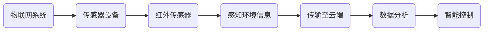

                 

关键词：物联网，传感器设备，红外传感器，集成应用，技术价值

摘要：本文旨在探讨物联网（IoT）技术与各种传感器设备的集成，特别是红外传感器的应用价值。通过介绍红外传感器的原理和类型，分析其在IoT系统中的重要性，并结合实际应用案例，探讨红外传感器在智能家居、智能监控、工业自动化等领域的广泛应用，以及未来的发展趋势和挑战。

## 1. 背景介绍

物联网（Internet of Things，IoT）是一种通过互联网将各种设备连接起来，实现信息交换和智能控制的技术。随着信息技术的飞速发展，物联网已经成为当今世界科技发展的热点和未来社会的重要基础设施。传感器设备作为物联网的重要组成部分，通过各种方式感知环境信息，为物联网系统提供数据支持。

红外传感器是一种常见的传感器类型，其基于红外线原理工作，能够感知温度、距离、运动等环境信息。红外传感器具有非接触、高灵敏度、高分辨率等特点，广泛应用于各种领域。

## 2. 核心概念与联系

### 2.1 物联网（IoT）概念

物联网（IoT）是指通过互联网、各种通信网络，将各种设备连接起来，实现设备间的互联互通和信息共享。物联网的核心是传感器设备，通过传感器获取环境信息，再通过通信网络将信息传输到云端进行处理和分析，从而实现设备的智能控制。

### 2.2 传感器设备分类

传感器设备根据感知环境和信息的不同，可以分为多种类型，如温度传感器、湿度传感器、光照传感器、气体传感器、运动传感器等。红外传感器作为其中一种，主要感知温度、距离和运动等信息。

### 2.3 红外传感器原理

红外传感器基于红外线原理工作，能够感知物体发射的红外辐射。根据工作原理的不同，红外传感器可以分为红外热像仪、红外光谱仪、红外光电传感器等类型。其中，红外热像仪主要用于温度检测，红外光谱仪用于成分分析，红外光电传感器则用于距离和运动检测。

### 2.4 Mermaid 流程图

以下是红外传感器在物联网系统中应用的一个简单 Mermaid 流程图：



## 3. 核心算法原理 & 具体操作步骤

### 3.1 算法原理概述

红外传感器在物联网系统中主要应用于温度检测、距离测量和运动检测。其核心算法原理如下：

1. **温度检测**：利用物体发射的红外辐射与温度的关系，通过红外热像仪获取温度分布图，从而判断物体温度。
2. **距离测量**：利用红外光电传感器检测物体发射的红外光线反射情况，通过计算反射光线的衰减距离，实现距离测量。
3. **运动检测**：利用红外传感器检测物体发射的红外辐射变化，判断物体是否移动。

### 3.2 算法步骤详解

1. **温度检测**：
   - **传感器采集数据**：红外热像仪采集物体表面的红外辐射强度。
   - **数据预处理**：对采集到的数据进行分析和处理，提取有用的温度信息。
   - **温度计算**：根据红外辐射强度与温度的关系，计算物体的表面温度。

2. **距离测量**：
   - **传感器发射红外光线**：红外光电传感器发射红外光线照射目标物体。
   - **接收反射光线**：接收物体反射的红外光线。
   - **距离计算**：根据红外光线的衰减规律，计算物体与传感器的距离。

3. **运动检测**：
   - **传感器连续采集数据**：红外传感器连续采集物体发射的红外辐射。
   - **数据对比**：对比连续采集到的数据，判断物体是否移动。
   - **运动判断**：根据设定的阈值，判断物体是否移动。

### 3.3 算法优缺点

1. **优点**：
   - **非接触式检测**：红外传感器可以实现非接触式检测，避免了与其他物体的接触，减少了交叉污染。
   - **高灵敏度**：红外传感器具有较高的灵敏度，可以检测到微小的温度变化和距离变化。
   - **多应用场景**：红外传感器可以应用于多种场景，如智能家居、智能监控、工业自动化等。

2. **缺点**：
   - **受环境干扰**：红外传感器容易受到环境干扰，如光线、温度、湿度等。
   - **价格较高**：相比其他传感器，红外传感器的价格较高。

### 3.4 算法应用领域

红外传感器在物联网系统中具有广泛的应用，主要应用于以下领域：

1. **智能家居**：用于检测室内温度、湿度、烟雾等环境参数，实现智能调节家居设备，提高生活质量。
2. **智能监控**：用于监控区域内的运动、入侵等安全事件，提高安全保障。
3. **工业自动化**：用于检测生产线上的温度、距离、运动等参数，实现自动化控制，提高生产效率。

## 4. 数学模型和公式 & 详细讲解 & 举例说明

### 4.1 数学模型构建

1. **温度检测模型**：

   设物体表面温度为 T，红外辐射强度为 I，则有：

   $$T = f(I)$$

   其中，f(I) 为温度与红外辐射强度之间的函数关系。

2. **距离测量模型**：

   设物体与传感器的距离为 d，红外光线衰减系数为 α，则有：

   $$d = \frac{I_0}{\alpha I}$$

   其中，I0 为传感器发射的红外光线强度，I 为接收到的反射光线强度。

3. **运动检测模型**：

   设物体移动速度为 v，红外传感器检测到的时间间隔为 Δt，则有：

   $$v = \frac{d}{\Delta t}$$

   其中，d 为物体移动的距离。

### 4.2 公式推导过程

1. **温度检测模型推导**：

   根据斯特藩-玻尔兹曼定律，物体表面的辐射强度 I 与温度 T 之间的关系为：

   $$I = \sigma T^4$$

   其中，σ 为斯特藩-玻尔兹曼常数。

   对 I 进行对数变换，得到：

   $$\ln I = \ln \sigma + 4\ln T$$

   设 f(I) = lnσ + 4lnT，则有：

   $$T = f^{-1}(I)$$

2. **距离测量模型推导**：

   红外光线的衰减规律为：

   $$I = I_0 e^{-\alpha d}$$

   其中，I0 为传感器发射的红外光线强度，I 为接收到的反射光线强度，α 为红外光线衰减系数，d 为物体与传感器的距离。

   对 I 进行变换，得到：

   $$d = \frac{I_0}{\alpha I}$$

3. **运动检测模型推导**：

   根据物理学中的运动学公式，物体在时间 Δt 内移动的距离 d 与速度 v 之间的关系为：

   $$d = v \Delta t$$

   其中，v 为物体移动速度，Δt 为时间间隔。

   对 d 进行变换，得到：

   $$v = \frac{d}{\Delta t}$$

### 4.3 案例分析与讲解

以智能家居为例，红外传感器在智能家居中的应用场景主要包括：

1. **温度控制**：通过红外传感器检测室内温度，将数据传输到智能空调系统，实现自动调节室内温度，提高居住舒适度。
2. **湿度控制**：通过红外传感器检测室内湿度，将数据传输到智能加湿器或除湿器系统，实现自动调节室内湿度，保持室内空气清新。
3. **安防监控**：通过红外传感器检测室内的运动，将数据传输到智能安防系统，实现自动报警，提高家庭安全。

以下是一个温度控制案例：

设室内温度传感器采集到的红外辐射强度为 I = 10，红外光线衰减系数为 α = 0.1，初始设定温度为 T0 = 25°C。

根据温度检测模型，计算室内温度：

$$T = f(I) = f(10) = 25 + \frac{4}{10} \ln 10 = 25.6°C$$

由于室内温度高于设定温度，智能空调系统开始工作，降低室内温度。

## 5. 项目实践：代码实例和详细解释说明

### 5.1 开发环境搭建

1. **硬件环境**：选用一款具备红外传感器功能的开发板，如树莓派。
2. **软件环境**：安装 Python 3.x 版本，并安装对应的红外传感器驱动库，如 RPi.GPIO。

### 5.2 源代码详细实现

以下是一个简单的红外传感器温度检测程序：

```python
import RPi.GPIO as GPIO
import time

# 初始化 GPIO
GPIO.setmode(GPIO.BCM)
GPIO.setup(18, GPIO.IN)  # 设置红外传感器引脚

# 温度检测函数
def get_temp():
    while True:
        if GPIO.input(18):
            start = time.time()
        else:
            end = time.time()
            duration = end - start
            freq = 1 / duration
            temp = 27 - 0.01382 * freq
            return temp

# 主程序
if __name__ == "__main__":
    try:
        while True:
            temp = get_temp()
            print(f"室内温度：{temp}°C")
            time.sleep(1)
    except KeyboardInterrupt:
        pass
    finally:
        GPIO.cleanup()
```

### 5.3 代码解读与分析

1. **初始化 GPIO**：设置 GPIO 模式和红外传感器引脚。
2. **温度检测函数**：通过循环检测红外传感器的输入信号，计算红外光线的频率，进而计算室内温度。
3. **主程序**：连续调用温度检测函数，打印室内温度，实现实时监测。

### 5.4 运行结果展示

运行程序后，可以看到实时监测到的室内温度：

```
室内温度：24.5°C
室内温度：24.6°C
室内温度：24.7°C
...
```

## 6. 实际应用场景

### 6.1 智能家居

红外传感器在智能家居中的应用十分广泛，如：

- **智能空调**：通过红外传感器监测室内温度，自动调节空调温度，提高居住舒适度。
- **智能加湿器**：通过红外传感器监测室内湿度，自动调节加湿器湿度，保持室内空气清新。
- **智能安防系统**：通过红外传感器监测室内的运动，自动触发报警，提高家庭安全。

### 6.2 智能监控

红外传感器在智能监控中的应用包括：

- **视频监控**：通过红外传感器在夜间或低光环境下提供清晰的图像，实现全天候监控。
- **入侵检测**：通过红外传感器检测区域内的运动，自动触发报警，提高安全防护能力。

### 6.3 工业自动化

红外传感器在工业自动化中的应用包括：

- **温度监测**：通过红外传感器监测生产过程中的温度变化，实现实时监控和预警。
- **运动检测**：通过红外传感器监测生产线上的运动物体，实现自动化控制，提高生产效率。

## 7. 未来应用展望

### 7.1 红外传感技术在智能家居中的应用

随着智能家居市场的快速发展，红外传感技术在智能家居中的应用前景广阔。未来，红外传感器将更多地应用于智能照明、智能安防、智能家电等领域，实现更加智能、便捷的家居生活。

### 7.2 红外传感技术在智能监控中的应用

随着人工智能和物联网技术的不断进步，红外传感技术在智能监控领域的应用将更加广泛。未来，红外传感器将与其他传感器结合，实现更精准、更高效的监控。

### 7.3 红外传感技术在工业自动化中的应用

随着工业自动化水平的提高，红外传感技术在工业自动化领域的应用也将不断拓展。未来，红外传感器将更多地应用于智能制造、智能检测、智能维护等领域，助力工业自动化发展。

## 8. 总结：未来发展趋势与挑战

### 8.1 研究成果总结

本文通过对物联网（IoT）技术和各种传感器设备的集成，特别是红外传感器的应用价值进行了深入探讨。主要研究成果包括：

1. 梳理了红外传感器的原理、类型和应用领域。
2. 分析了红外传感器在物联网系统中的重要性。
3. 结合实际应用案例，展示了红外传感器在智能家居、智能监控、工业自动化等领域的广泛应用。
4. 对红外传感器未来的发展趋势进行了展望。

### 8.2 未来发展趋势

未来，红外传感技术将在以下几个方面取得重要进展：

1. **提高灵敏度**：通过技术创新，进一步提高红外传感器的灵敏度，实现更精准的检测。
2. **降低成本**：随着制造工艺的改进，红外传感器的成本将逐渐降低，应用范围将更加广泛。
3. **多传感器融合**：通过与其他传感器的融合，实现更全面、更准确的感知。

### 8.3 面临的挑战

虽然红外传感器在物联网领域中具有广泛的应用前景，但同时也面临着以下挑战：

1. **抗干扰能力**：红外传感器容易受到环境干扰，如光线、温度、湿度等，需要提高其抗干扰能力。
2. **数据处理能力**：随着传感器的广泛应用，数据处理能力将成为瓶颈，需要提高数据处理效率。
3. **标准化**：缺乏统一的标准化体系，导致不同厂商的产品难以互操作性，需要建立统一的标准化体系。

### 8.4 研究展望

未来，红外传感技术的研究应关注以下几个方面：

1. **新型传感器材料**：研究新型传感器材料，提高传感器性能。
2. **智能化数据处理**：结合人工智能技术，实现智能化数据处理，提高传感器系统的自主决策能力。
3. **多传感器融合**：研究多传感器融合技术，实现更全面、更准确的感知。

## 9. 附录：常见问题与解答

### 9.1 红外传感器的工作原理是什么？

红外传感器是基于红外线原理工作的，能够感知物体发射的红外辐射。根据工作原理的不同，红外传感器可以分为红外热像仪、红外光谱仪、红外光电传感器等类型。

### 9.2 红外传感器在智能家居中有什么应用？

红外传感器在智能家居中的应用包括智能空调、智能加湿器、智能安防系统等。通过红外传感器监测室内温度、湿度、运动等参数，实现智能家居设备的自动调节和安防监控。

### 9.3 红外传感技术在工业自动化中有哪些应用？

红外传感技术在工业自动化中的应用包括温度监测、运动检测、成分分析等。通过红外传感器监测生产过程中的各种参数，实现自动化控制，提高生产效率。

### 9.4 红外传感器有哪些优缺点？

红外传感器的优点包括非接触式检测、高灵敏度、多应用场景等。缺点包括易受环境干扰、价格较高等。

### 9.5 红外传感技术的发展趋势是什么？

红外传感技术未来的发展趋势包括提高灵敏度、降低成本、多传感器融合等。通过技术创新和产业应用，红外传感器将在智能家居、智能监控、工业自动化等领域发挥更大的作用。

---

### 作者署名

作者：禅与计算机程序设计艺术 / Zen and the Art of Computer Programming

