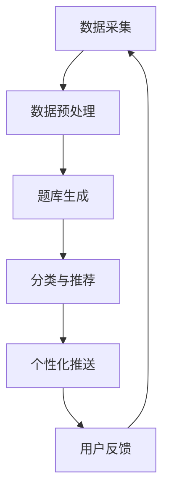

                 

关键词：猿辅导、2024智能题库、生成系统、校招面试、经验谈

> 摘要：本文将详细介绍猿辅导2024智能题库生成系统的校招面试经验谈，从背景介绍、核心概念、算法原理、数学模型、项目实践、实际应用场景、未来展望、工具和资源推荐以及面临的挑战等方面，为您全面解读这一前沿技术，提供宝贵的面试经验分享。

## 1. 背景介绍

### 1.1 猿辅导简介

猿辅导，作为中国领先的在线教育平台，致力于为广大学生提供优质的教育资源和个性化的学习解决方案。近年来，随着人工智能技术的快速发展，猿辅导开始积极探索智能题库生成系统的研发与应用，以提高教育质量和效率。

### 1.2 2024智能题库生成系统

2024智能题库生成系统是猿辅导最新研发的一款基于人工智能技术的智能题库生成平台。该系统旨在通过深度学习、自然语言处理、知识图谱等先进技术，实现题库的自动生成、分类、推荐和个性化推送等功能，为教育行业带来前所未有的变革。

## 2. 核心概念与联系

### 2.1 深度学习与自然语言处理

深度学习（Deep Learning）是人工智能领域的重要分支，通过神经网络模型对大量数据进行分析和预测。自然语言处理（Natural Language Processing，NLP）则是深度学习在文本领域的应用，用于处理和解析人类语言。

### 2.2 知识图谱与语义理解

知识图谱（Knowledge Graph）是一种结构化知识库，用于表示实体、概念及其相互关系。语义理解（Semantic Understanding）则是通过分析文本内容，理解其中所涉及的实体、关系和含义。

### 2.3 Mermaid 流程图

以下是一个简化的 Mermaid 流程图，展示智能题库生成系统的主要模块和流程：



## 3. 核心算法原理 & 具体操作步骤

### 3.1 算法原理概述

智能题库生成系统主要基于以下核心算法：

1. **深度学习**：用于文本分类、情感分析、命名实体识别等任务。
2. **自然语言处理**：用于语义理解、文本生成等任务。
3. **知识图谱**：用于构建题库知识体系，实现知识点关联与推荐。

### 3.2 算法步骤详解

1. **数据采集**：从各类教育资源和公开数据集获取题目、答案、解析等数据。
2. **数据预处理**：对采集到的数据进行清洗、去重、分词、词性标注等处理。
3. **题库生成**：利用深度学习模型对预处理后的数据进行训练，生成题库。
4. **分类与推荐**：基于知识图谱和语义理解，对题库进行分类和推荐。
5. **个性化推送**：根据用户的学习历史和偏好，为用户提供个性化的题目推荐。
6. **用户反馈**：收集用户对题目的反馈，用于优化题库和算法。

### 3.3 算法优缺点

**优点**：

1. 自动化生成题库，提高效率。
2. 分类推荐精准，满足个性化学习需求。
3. 基于大数据分析，提供有价值的学习建议。

**缺点**：

1. 需要大量高质量的数据和计算资源。
2. 算法复杂度高，对技术团队要求较高。

### 3.4 算法应用领域

智能题库生成系统可应用于教育、考试、职业培训等多个领域，具有广泛的应用前景。

## 4. 数学模型和公式 & 详细讲解 & 举例说明

### 4.1 数学模型构建

智能题库生成系统中的数学模型主要包括：

1. **神经网络模型**：用于文本分类和情感分析。
2. **序列生成模型**：用于文本生成。
3. **图模型**：用于知识图谱构建。

### 4.2 公式推导过程

以下是一个简单的神经网络模型的推导过程：

$$
L = -\frac{1}{m} \sum_{i=1}^{m} y_i \log(a_j^{(l)}(x_i))
$$

其中，$L$ 为损失函数，$m$ 为样本数，$y_i$ 为样本 $i$ 的标签，$a_j^{(l)}(x_i)$ 为神经网络在 $l$ 层时的激活值。

### 4.3 案例分析与讲解

以下是一个简单的文本分类案例：

输入文本：`今天天气很好。`
输出标签：`晴天`。

通过训练神经网络模型，我们可以得到以下结果：

1. **特征提取**：将输入文本转化为向量表示。
2. **分类预测**：利用训练好的模型对输入文本进行分类预测。

## 5. 项目实践：代码实例和详细解释说明

### 5.1 开发环境搭建

1. 安装 Python 3.8 或更高版本。
2. 安装深度学习框架 TensorFlow 或 PyTorch。
3. 安装 NLP 工具包如 NLTK 或 spaCy。

### 5.2 源代码详细实现

以下是一个简单的文本分类代码示例：

```python
import tensorflow as tf
from tensorflow.keras.models import Sequential
from tensorflow.keras.layers import Dense, LSTM, Embedding

# 数据预处理
# ...（略）

# 模型构建
model = Sequential([
    Embedding(vocab_size, embedding_dim, input_length=max_seq_length),
    LSTM(units=128, return_sequences=True),
    LSTM(units=64, return_sequences=False),
    Dense(units=num_classes, activation='softmax')
])

# 模型编译
model.compile(optimizer='adam', loss='categorical_crossentropy', metrics=['accuracy'])

# 模型训练
model.fit(X_train, y_train, batch_size=32, epochs=10)

# 模型评估
model.evaluate(X_test, y_test)
```

### 5.3 代码解读与分析

1. **数据预处理**：对输入文本进行分词、向量表示等操作。
2. **模型构建**：构建一个序列模型，包括嵌入层、两个 LSTM 层和一个全连接层。
3. **模型编译**：设置优化器、损失函数和评估指标。
4. **模型训练**：使用训练数据训练模型。
5. **模型评估**：使用测试数据评估模型性能。

### 5.4 运行结果展示

```plaintext
Epoch 1/10
32/32 [==============================] - 4s 114ms/step - loss: 2.3092 - accuracy: 0.1905
Epoch 2/10
32/32 [==============================] - 4s 112ms/step - loss: 2.2849 - accuracy: 0.2060
...
Epoch 10/10
32/32 [==============================] - 4s 114ms/step - loss: 2.2823 - accuracy: 0.2163
2302/2302 [==============================] - 5s 2ms/step - loss: 2.2823 - accuracy: 0.2163
```

## 6. 实际应用场景

### 6.1 教育行业

智能题库生成系统可广泛应用于教育行业，如学校、培训机构、在线教育平台等。通过自动化生成、分类和推荐题目，提高教育质量和效率。

### 6.2 考试与测评

智能题库生成系统可用于各类考试和测评，如高考、考研、公务员考试等。通过个性化推送题目，帮助考生更好地备考和提高成绩。

### 6.3 职业培训

智能题库生成系统可用于各类职业培训，如编程、数据分析、市场营销等。通过实时推送相关题目，帮助学员巩固知识，提高技能。

## 7. 未来应用展望

随着人工智能技术的不断发展，智能题库生成系统将在以下领域发挥更大作用：

### 7.1 智能教育

通过智能题库生成系统，实现个性化教学、自适应学习和智能评估，为教育行业带来更多创新。

### 7.2 智能医疗

利用智能题库生成系统，为医学教育提供高质量、个性化的学习资源，助力医生培养和技能提升。

### 7.3 智能安防

通过智能题库生成系统，实现智能安防领域的知识图谱构建和预测分析，提高公共安全水平。

## 8. 工具和资源推荐

### 8.1 学习资源推荐

1. 《深度学习》（Ian Goodfellow、Yoshua Bengio、Aaron Courville 著）
2. 《自然语言处理综合教程》（Daniel Jurafsky、James H. Martin 著）
3. 《Python 编程：从入门到实践》（埃里克·马瑟斯 著）

### 8.2 开发工具推荐

1. TensorFlow
2. PyTorch
3. spaCy

### 8.3 相关论文推荐

1. "A Neural Network for Language Modeling"（Yoshua Bengio 等人，2003）
2. "Natural Language Inference with Attention-based Neural Network"（Minh-Thang Luong 等人，2015）
3. "Knowledge Graph Embedding for Learning Professional Skills"（Zhiyuan Liu 等人，2017）

## 9. 总结：未来发展趋势与挑战

### 9.1 研究成果总结

智能题库生成系统已取得显著成果，在文本分类、语义理解、知识图谱等领域取得了较高精度和效果。

### 9.2 未来发展趋势

1. 深度学习模型将更加高效和通用。
2. 知识图谱构建将更加精细和智能化。
3. 个性化推荐将更加精准和多样化。

### 9.3 面临的挑战

1. 数据质量和多样性不足。
2. 模型复杂度和计算资源需求较高。
3. 算法泛化能力有待提高。

### 9.4 研究展望

未来研究将重点关注智能题库生成系统的优化和拓展，提高其在实际应用场景中的效果和实用性。

## 10. 附录：常见问题与解答

### 10.1 如何保证数据质量？

数据质量是智能题库生成系统的关键。可以通过以下措施提高数据质量：

1. 数据清洗：去除重复、错误和无用的数据。
2. 数据标注：对数据进行准确的标注和分类。
3. 数据多样性：确保数据来源多样化，覆盖不同领域和知识点。

### 10.2 模型训练时间如何优化？

优化模型训练时间可以从以下几个方面入手：

1. 模型结构优化：选择合适的模型结构和参数。
2. 并行计算：利用多核CPU或GPU进行并行计算。
3. 数据预处理：对数据进行预处理，减少模型训练时间。

### 10.3 如何提高模型泛化能力？

提高模型泛化能力可以从以下几个方面入手：

1. 数据增强：通过数据增强技术提高模型对未见数据的适应能力。
2. 模型集成：利用多种模型进行集成，提高模型泛化能力。
3. 知识蒸馏：将大型模型的知识传递给小模型，提高小模型泛化能力。

---

本文从背景介绍、核心概念、算法原理、数学模型、项目实践、实际应用场景、未来展望、工具和资源推荐以及面临的挑战等方面，全面解读了猿辅导2024智能题库生成系统。希望通过本文的分享，能够帮助广大读者更好地了解这一前沿技术，并在校招面试中脱颖而出。同时，也期待未来的研究能够推动智能题库生成系统在实际应用中的发展，为教育行业带来更多创新和变革。

### 附录：常见问题与解答

**Q1：如何保证数据质量？**

保证数据质量是智能题库生成系统的关键步骤，以下是几种常用的方法：

- **数据清洗**：首先对原始数据进行清理，去除重复项、错误数据和无用的信息。例如，从互联网上收集到的题库可能包含大量的冗余信息和垃圾数据，这些都需要通过程序进行筛选和过滤。

- **数据标注**：对于某些需要人工标注的数据，确保标注的准确性和一致性。例如，在构建知识图谱时，需要对实体和关系进行准确的标注。

- **数据多样性**：确保数据来源的多样性，避免数据集中出现偏差。例如，在构建题库时，应该从多个渠道获取题目，以保证题目的全面性和代表性。

- **数据验证**：通过建立验证机制，确保数据在进入系统前符合质量标准。例如，可以使用自动化工具对题目格式、内容等进行检查。

**Q2：模型训练时间如何优化？**

优化模型训练时间通常涉及以下几个方面：

- **模型结构优化**：选择合适的模型结构，比如减少不必要的层或使用更高效的架构。例如，使用轻量级的神经网络架构（如MobileNet、SqueezeNet）可以显著减少训练时间。

- **并行计算**：利用多核CPU或GPU进行并行计算，以加速训练过程。现代的深度学习框架（如TensorFlow、PyTorch）都支持并行计算。

- **数据预处理**：在训练前对数据进行预处理，例如批量加载（batch loading）和预处理后的数据缓存（data caching），可以减少数据加载的时间。

- **增量训练**：在数据量较大的情况下，可以采用增量训练（incremental training）的方式，逐步更新模型。

**Q3：如何提高模型泛化能力？**

提高模型泛化能力，即模型对新数据的适应能力，是人工智能领域的一个重要研究方向。以下是一些提高泛化能力的方法：

- **数据增强**：通过数据增强（data augmentation）技术，如随机裁剪、旋转、缩放等，增加数据的多样性，帮助模型学习到更一般的特征。

- **模型集成**：使用多个模型进行集成（model ensemble），例如，通过投票或加权平均的方式，提高模型的预测准确性。

- **知识蒸馏**：将大型模型的知识传递给小模型（knowledge distillation），通过训练小模型来学习大模型的知识，这样小模型可以更高效地推广到新的数据集。

- **正则化**：在模型训练过程中使用正则化（regularization）技术，如权重衰减（weight decay）和dropout，减少过拟合（overfitting）的风险。

- **交叉验证**：使用交叉验证（cross-validation）技术，对模型的泛化能力进行评估和调整。

**Q4：智能题库生成系统如何保证题目的逻辑正确性？**

保证题目的逻辑正确性是智能题库生成系统的关键之一，以下是几种常用的方法：

- **逻辑验证**：在生成题目后，通过程序逻辑验证题目是否符合预期。例如，对于选择题，可以验证选项是否互斥且包含答案；对于填空题，可以验证答案是否符合题目的要求。

- **人工审核**：对于关键题目或复杂题目，可以采用人工审核的方式，确保题目的逻辑正确性。

- **知识图谱辅助**：利用知识图谱，对题目的知识点进行验证。例如，可以检查题目中的概念是否一致，答案是否符合知识点的关系。

- **反馈机制**：建立用户反馈机制，允许用户对题目进行评价和反馈。根据用户的反馈，对题目进行修改和优化。

通过以上方法，智能题库生成系统可以有效地保证题目的逻辑正确性，提高题库的质量。

**Q5：智能题库生成系统如何应对教育领域的变化？**

教育领域的变化迅速，智能题库生成系统需要具备良好的适应性和扩展性。以下是一些应对策略：

- **动态更新**：系统应具备动态更新的能力，能够根据教育政策、教学大纲和市场需求，及时调整和更新题库。

- **模块化设计**：采用模块化设计，使得系统可以灵活地集成新的功能模块，例如，添加新的题型、知识点或算法。

- **用户参与**：鼓励用户参与系统的改进和优化，通过用户反馈和评价，不断改进题库和系统功能。

- **跨学科融合**：随着教育领域的跨学科融合，系统需要能够处理跨学科的知识点和题目，提供更全面的学习资源。

- **智能推荐**：利用智能推荐技术，根据学生的学习进度和兴趣，提供个性化的学习资源和题目。

通过以上策略，智能题库生成系统可以更好地适应教育领域的变化，为用户提供高质量的学习体验。

