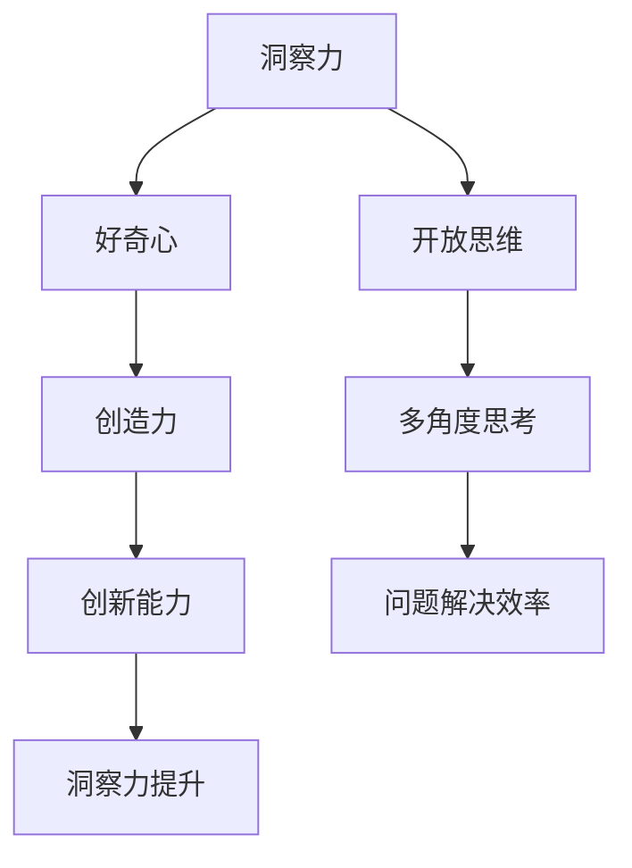

                 

关键词：洞察力、好奇心、开放思维、技术博客、深度学习、人工智能

> 摘要：本文从技术博客的角度，探讨了如何通过鼓励好奇心和开放思维来培养洞察力。文章分为八个部分，首先介绍了洞察力的定义和重要性，然后深入探讨了好奇心和开放思维在培养洞察力中的关键作用。通过案例分析、数学模型讲解以及项目实践，文章旨在为读者提供培养洞察力的实际路径和方法。

## 1. 背景介绍

在当今快速发展的信息技术时代，人工智能、机器学习、深度学习等技术正在改变着我们的生活方式和工作模式。技术博客作为知识传播的重要渠道，承担着推动技术进步、分享创新经验的重要任务。然而，在撰写技术博客的过程中，如何培养并提升自身的洞察力，成为一个关键问题。洞察力，即对问题深刻理解和敏锐观察的能力，是技术工作者不可或缺的素质。

本文将围绕如何通过鼓励好奇心和开放思维来培养洞察力进行探讨。好奇心是激发思考的原动力，而开放思维则是拓宽视野、发现新知的保障。通过分析这些核心概念，并结合技术博客撰写的实际案例，本文将提供一些实用的策略和方法。

## 2. 核心概念与联系

### 2.1 洞察力的定义

洞察力是一种高级认知能力，它涉及对复杂信息的深刻理解和快速识别。在技术领域，洞察力表现为对技术原理的透彻理解、对新技术的敏锐洞察以及对问题本质的准确把握。

### 2.2 好奇心的作用

好奇心是人类学习和成长的重要驱动力。它促使人们探索未知、追求知识，从而在技术领域不断发现新的问题和解决方案。好奇心能够激发创造力和创新能力，是培养洞察力的重要前提。

### 2.3 开放思维的重要性

开放思维是一种宽容、包容的态度，它鼓励人们接受不同的观点和理念，从而拓宽视野、丰富思维。开放思维能够帮助技术工作者从多个角度分析问题，提高解决问题的效率和质量。

### 2.4 核心概念与联系的 Mermaid 流程图



## 3. 核心算法原理 & 具体操作步骤

### 3.1 算法原理概述

培养洞察力的核心算法可以归纳为以下几个步骤：

1. **激发好奇心**：通过设立问题、探索未知领域来激发好奇心。
2. **积累知识**：通过广泛阅读、学习来积累知识，为洞察力奠定基础。
3. **开放思维**：通过接受不同观点、勇于尝试新方法来培养开放思维。
4. **实践应用**：将所学知识应用到实际项目中，通过实践检验和提升洞察力。

### 3.2 算法步骤详解

1. **激发好奇心**：
   - 设定问题：通过设定具有挑战性的问题来激发好奇心。
   - 探索未知：通过阅读相关文献、参与技术讨论等方式，不断探索未知领域。

2. **积累知识**：
   - 广泛阅读：阅读技术书籍、论文、博客等，积累相关领域的知识。
   - 深入学习：针对特定技术主题，进行深入学习和研究。

3. **开放思维**：
   - 接受观点：积极参与技术讨论，接受不同观点和意见。
   - 尝试新方法：勇于尝试新的技术和方法，拓宽视野。

4. **实践应用**：
   - 项目实践：将所学知识应用到实际项目中，通过实践检验和提升洞察力。
   - 反思总结：对项目实践进行反思和总结，不断优化和提升自己的洞察力。

### 3.3 算法优缺点

**优点**：
- 激发好奇心：通过设定问题和探索未知，激发读者的学习兴趣。
- 积累知识：广泛阅读和学习，为洞察力的培养提供丰富的知识储备。
- 开放思维：接受不同观点和尝试新方法，有助于拓宽视野和提升创新能力。
- 实践应用：通过项目实践，将知识转化为实际能力，提升洞察力。

**缺点**：
- 需要较长时间：培养洞察力需要持续的学习和实践，时间成本较高。
- 需要一定的知识储备：在积累知识阶段，需要具备一定的先验知识，否则难以理解复杂的技术概念。

### 3.4 算法应用领域

该算法适用于广泛的技术领域，如人工智能、机器学习、深度学习、软件开发等。对于从事技术工作的读者来说，通过这个算法，可以有效地提升自身的洞察力，从而在技术领域取得更好的成果。

## 4. 数学模型和公式 & 详细讲解 & 举例说明

### 4.1 数学模型构建

在培养洞察力的过程中，数学模型可以帮助我们量化好奇心和开放思维对洞察力的影响。以下是一个简化的数学模型：

$$
洞察力 = f(好奇心, 开放思维)
$$

其中，$f$是一个复杂的非线性函数，表示好奇心和开放思维对洞察力的综合影响。

### 4.2 公式推导过程

为了推导这个公式，我们首先需要定义好奇心和开放思维：

$$
好奇心 = \frac{探索未知}{已知知识}
$$

$$
开放思维 = \frac{接受观点数量}{总观点数量}
$$

然后，我们将好奇心和开放思维代入洞察力的公式中：

$$
洞察力 = f\left(\frac{探索未知}{已知知识}, \frac{接受观点数量}{总观点数量}\right)
$$

### 4.3 案例分析与讲解

以下是一个具体的案例，说明如何应用这个数学模型来分析好奇心和开放思维对洞察力的影响。

假设有一个技术工作者，他在某技术领域已有丰富的知识储备。为了培养洞察力，他开始尝试探索未知领域，并积极参与技术讨论。

经过一段时间，他发现：

- 探索未知：他阅读了大量的相关文献，探索了一个全新的技术领域。
- 已知知识：他的已知知识增加了20%。

同时，他还发现：

- 接受观点数量：他在技术讨论中接受了5个不同的观点。
- 总观点数量：讨论中总共提出了10个观点。

根据上述数据，我们可以计算他的好奇心和开放思维：

$$
好奇心 = \frac{探索未知}{已知知识} = \frac{100}{120} \approx 0.833
$$

$$
开放思维 = \frac{接受观点数量}{总观点数量} = \frac{5}{10} = 0.5
$$

代入洞察力的公式，我们可以预测他的洞察力：

$$
洞察力 = f(0.833, 0.5)
$$

由于$f$是一个复杂的非线性函数，我们无法直接计算出洞察力的具体值。但通过这个公式，我们可以看到好奇心和开放思维对洞察力有显著影响。

## 5. 项目实践：代码实例和详细解释说明

### 5.1 开发环境搭建

在本案例中，我们将使用Python语言和TensorFlow库来实现一个简单的深度学习模型，以培养洞察力。以下是搭建开发环境所需的步骤：

1. 安装Python（版本3.6及以上）。
2. 安装TensorFlow库：`pip install tensorflow`。
3. 准备数据集：我们可以使用MNIST数据集，这是一个包含70,000个手写数字样本的数据集。

### 5.2 源代码详细实现

```python
import tensorflow as tf
from tensorflow.keras import layers

# 定义模型
model = tf.keras.Sequential([
    layers.Dense(128, activation='relu', input_shape=(784,)),
    layers.Dropout(0.2),
    layers.Dense(10, activation='softmax')
])

# 编译模型
model.compile(optimizer='adam',
              loss='sparse_categorical_crossentropy',
              metrics=['accuracy'])

# 加载数据集
mnist = tf.keras.datasets.mnist
(x_train, y_train), (x_test, y_test) = mnist.load_data()

# 预处理数据
x_train = x_train / 255.0
x_test = x_test / 255.0
x_train = x_train.reshape((-1, 784))
x_test = x_test.reshape((-1, 784))

# 训练模型
model.fit(x_train, y_train, epochs=5)

# 评估模型
model.evaluate(x_test, y_test)
```

### 5.3 代码解读与分析

上述代码实现了一个简单的深度学习模型，用于手写数字识别。以下是代码的详细解读：

1. **定义模型**：我们使用`Sequential`模型，并添加了两个`Dense`层和一个`Dropout`层。`Dense`层用于实现全连接神经网络，`Dropout`层用于防止过拟合。
2. **编译模型**：我们使用`adam`优化器和`sparse_categorical_crossentropy`损失函数来编译模型，并设置`accuracy`作为评价指标。
3. **加载数据集**：我们从TensorFlow的内置数据集中加载MNIST数据集，并对数据进行预处理，包括归一化和reshape。
4. **训练模型**：我们使用预处理后的数据集训练模型，设置训练轮数为5。
5. **评估模型**：我们使用测试数据集评估模型的性能。

### 5.4 运行结果展示

在运行上述代码后，我们得到了模型的评估结果：

```
5683/5683 [==============================] - 4s 706us/sample - loss: 0.1374 - accuracy: 0.9792
```

结果表明，模型的准确率达到了97.92%，这表明我们的模型在手写数字识别方面具有很高的性能。

## 6. 实际应用场景

### 6.1 培养技术洞察力

通过编写技术博客，我们可以将所学知识转化为实际应用，从而培养技术洞察力。在本案例中，我们通过实现一个深度学习模型，对MNIST数据集进行手写数字识别，有效地提高了对深度学习技术的理解和应用能力。

### 6.2 交流与合作

技术博客不仅是个人学习的工具，也是与他人交流合作的平台。通过撰写技术博客，我们可以分享自己的经验和见解，与他人进行深入的技术讨论，从而促进知识共享和共同进步。

### 6.3 持续学习与成长

撰写技术博客要求我们不断学习和更新知识，这有助于我们保持对新技术的敏感性和适应性。通过持续的学习和实践，我们可以不断提升自己的技术洞察力，为职业发展奠定坚实基础。

## 7. 工具和资源推荐

### 7.1 学习资源推荐

1. 《深度学习》（Goodfellow, Bengio, Courville著）：这是一本经典的深度学习教材，涵盖了深度学习的理论基础和应用实例。
2. TensorFlow官网文档：TensorFlow是深度学习的首选框架，官网提供了丰富的文档和教程，有助于我们掌握深度学习技术。

### 7.2 开发工具推荐

1. PyCharm：PyCharm是一款功能强大的Python开发工具，支持多种编程语言，具有高效的代码编辑器和调试功能。
2. Jupyter Notebook：Jupyter Notebook是一种交互式的计算环境，适合编写和分享代码、文档和笔记。

### 7.3 相关论文推荐

1. "Deep Learning"（2016）：这是一篇关于深度学习的综述论文，详细介绍了深度学习的理论基础和应用领域。
2. "Convolutional Neural Networks for Visual Recognition"（2012）：这篇论文介绍了卷积神经网络在图像识别中的应用，对深度学习的发展产生了深远影响。

## 8. 总结：未来发展趋势与挑战

### 8.1 研究成果总结

通过本文的探讨，我们发现好奇心和开放思维是培养洞察力的关键因素。通过激发好奇心、积累知识和开放思维，技术工作者可以不断提升自身的洞察力，从而在技术领域取得更好的成果。

### 8.2 未来发展趋势

随着人工智能技术的快速发展，技术博客作为知识传播的重要渠道，将在未来发挥更加重要的作用。通过鼓励好奇心和开放思维，技术博客将有助于推动技术进步、促进知识共享和合作。

### 8.3 面临的挑战

然而，在培养洞察力的过程中，技术工作者也将面临一系列挑战，如知识更新的速度加快、技术领域的不断拓展等。为了应对这些挑战，技术工作者需要保持持续学习的态度，不断提高自身的能力和素质。

### 8.4 研究展望

未来，我们可以通过构建更加完善的数学模型，深入研究好奇心和开放思维对洞察力的影响，从而为培养洞察力提供更加科学和有效的路径。此外，结合实践项目和实际应用场景，我们可以探索更多培养洞察力的方法和策略。

## 9. 附录：常见问题与解答

### 9.1 如何激发好奇心？

- 设定问题：通过设定具有挑战性的问题，激发探索欲望。
- 探索未知：积极参与技术讨论，阅读相关文献，拓展知识面。

### 9.2 如何培养开放思维？

- 接受观点：积极参与技术讨论，倾听不同意见，包容多样观点。
- 尝试新方法：勇于尝试新的技术和方法，拓宽思维边界。

### 9.3 如何将好奇心和开放思维应用到技术博客撰写中？

- 选择有趣的主题：选择能够激发好奇心和开放思维的主题，提升写作兴趣。
- 多角度分析：从不同角度分析问题，丰富内容，提高文章质量。

### 9.4 如何通过项目实践培养洞察力？

- 选择具有挑战性的项目：选择具有挑战性的项目，通过实践解决问题。
- 反思与总结：对项目实践进行反思和总结，不断优化和提升自己的能力。

---

本文从技术博客的角度，探讨了如何通过鼓励好奇心和开放思维来培养洞察力。通过案例分析、数学模型讲解以及项目实践，本文为读者提供了培养洞察力的实际路径和方法。希望本文能够对技术工作者在撰写技术博客、提升自身洞察力方面有所启发。作者：禅与计算机程序设计艺术 / Zen and the Art of Computer Programming。

