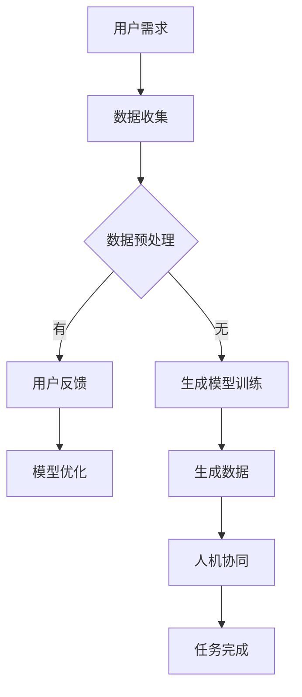

                 

 生成式 AI（Generative AI）作为一种新兴的人工智能技术，正迅速改变着各行各业的面貌。它通过学习大量的数据生成新的内容，如文本、图像、音频等，极大地提高了生产效率和创新力。在人机协同领域，生成式 AI 的应用正成为研究和开发的重点。本文旨在探讨生成式 AI 在人机协同模式中的应用，包括其核心概念、算法原理、数学模型、项目实践以及未来展望。

## 关键词

- 生成式 AI
- 人机协同
- 算法原理
- 数学模型
- 项目实践

## 摘要

本文首先介绍了生成式 AI 的基本概念和其在人机协同中的作用。接着，详细分析了生成式 AI 的核心算法原理，并使用 Mermaid 流程图展示了算法架构。随后，文章讲解了生成式 AI 的数学模型和公式，并通过实例进行了说明。随后，文章通过一个具体的项目实践，展示了生成式 AI 的实际应用。最后，文章探讨了生成式 AI 在人机协同中的未来应用前景，并提出了相关的工具和资源推荐。

## 1. 背景介绍

### 1.1 生成式 AI 的定义与作用

生成式 AI 是一种能够学习数据分布，并生成新数据的人工智能技术。与传统的判别式 AI 不同，生成式 AI 并不专注于分类或预测，而是致力于生成与训练数据相似的新数据。这种能力使得生成式 AI 在许多领域都有广泛的应用，如文本生成、图像生成、音乐生成等。

在人机协同中，生成式 AI 的作用尤为显著。首先，生成式 AI 可以帮助人类创造新的内容，如文本、图像、视频等，从而提高创意和生产效率。其次，生成式 AI 可以辅助人类进行决策，通过生成新的数据或信息，帮助人类更好地理解复杂的问题。此外，生成式 AI 还可以用于自动化任务，如自动化写作、自动化设计等，从而减轻人类的工作负担。

### 1.2 人机协同的概念

人机协同是指人类和机器通过某种方式协同工作，共同完成任务。人机协同的目的是充分利用人类和机器各自的优势，实现更高效、更智能的工作流程。

在人机协同中，人类主要负责决策、规划、创造等高层次的思维活动，而机器则擅长处理大量数据、执行重复性任务和进行高效计算。通过人机协同，可以实现优势互补，提高工作效率和创新能力。

## 2. 核心概念与联系

### 2.1 生成式 AI 的核心概念

生成式 AI 的核心概念包括概率模型、变分自编码器（VAE）、生成对抗网络（GAN）等。

- **概率模型**：生成式 AI 中的概率模型用于描述数据的生成过程。常见的概率模型有贝叶斯网络、隐马尔可夫模型（HMM）等。
- **变分自编码器（VAE）**：VAE 是一种概率生成模型，通过编码器和解码器学习数据的概率分布，从而生成新的数据。
- **生成对抗网络（GAN）**：GAN 是一种由生成器和判别器组成的对抗网络，通过生成器和判别器的对抗训练，生成器能够学习到数据的分布，从而生成新的数据。

### 2.2 人机协同的核心概念

人机协同中的核心概念包括人机交互、任务分配、协作机制等。

- **人机交互**：人机交互是人与机器之间的交互，包括语音、文字、图形等形式的交互。
- **任务分配**：任务分配是指将任务分配给人类或机器，根据任务的特点和机器的能力，选择最优的任务执行方式。
- **协作机制**：协作机制是指人与机器之间的协作方式，包括协同工作、信息共享、任务分配等。

### 2.3 Mermaid 流程图

以下是一个简化的生成式 AI 人机协同模式的 Mermaid 流程图：



### 2.4 生成式 AI 与人机协同的联系

生成式 AI 与人机协同的联系主要体现在以下几个方面：

- **数据生成**：生成式 AI 可以生成与训练数据相似的新数据，为人机协同提供新的信息来源。
- **任务自动化**：生成式 AI 可以自动化执行某些任务，如文本生成、图像生成等，从而减轻人类的工作负担。
- **决策辅助**：生成式 AI 可以生成新的数据或信息，帮助人类更好地理解复杂的问题，从而做出更明智的决策。

## 3. 核心算法原理 & 具体操作步骤

### 3.1 算法原理概述

生成式 AI 的核心算法原理主要包括概率模型、变分自编码器（VAE）、生成对抗网络（GAN）等。

- **概率模型**：概率模型通过学习数据的概率分布，生成新的数据。常见的概率模型有贝叶斯网络、隐马尔可夫模型（HMM）等。
- **变分自编码器（VAE）**：VAE 是一种概率生成模型，通过编码器和解码器学习数据的概率分布，从而生成新的数据。
- **生成对抗网络（GAN）**：GAN 是一种由生成器和判别器组成的对抗网络，通过生成器和判别器的对抗训练，生成器能够学习到数据的分布，从而生成新的数据。

### 3.2 算法步骤详解

生成式 AI 的具体操作步骤如下：

1. **数据收集**：收集用于训练的数据集。
2. **数据预处理**：对数据进行清洗、归一化等处理，使其适合训练。
3. **模型训练**：根据数据集训练生成模型。对于概率模型，使用最大似然估计等方法；对于 VAE，使用变分自编码器训练；对于 GAN，使用生成器和判别器进行对抗训练。
4. **生成数据**：使用训练好的模型生成新的数据。
5. **人机协同**：将生成的数据与人类用户进行交互，根据用户反馈进行模型优化。
6. **模型优化**：根据用户反馈，对生成模型进行调整，提高其生成质量。
7. **任务完成**：将生成式 AI 与人机协同应用于实际任务，如文本生成、图像生成等。

### 3.3 算法优缺点

生成式 AI 的优缺点如下：

- **优点**：
  - 可以生成高质量的新数据，提高生产效率和创新力。
  - 可以辅助人类进行决策，提供新的信息来源。
  - 可以自动化执行某些任务，减轻人类的工作负担。
- **缺点**：
  - 训练过程复杂，需要大量的计算资源和时间。
  - 生成模型可能存在过拟合现象，生成数据的质量可能不稳定。
  - 需要大量的数据集进行训练，数据收集和预处理工作量较大。

### 3.4 算法应用领域

生成式 AI 在许多领域都有广泛的应用：

- **文本生成**：如自动写作、对话系统等。
- **图像生成**：如图像修复、风格迁移等。
- **音频生成**：如音乐生成、声音合成等。
- **视频生成**：如视频修复、视频合成等。
- **人机协同**：如任务分配、决策支持等。

## 4. 数学模型和公式 & 详细讲解 & 举例说明

### 4.1 数学模型构建

生成式 AI 的数学模型主要包括概率模型、变分自编码器（VAE）和生成对抗网络（GAN）等。

- **概率模型**：
  - 贝叶斯网络：
    $$ P(X) = \prod_{i=1}^{n} P(x_i | x_{i-1}) $$
  - 隐马尔可夫模型（HMM）：
    $$ P(X | Y) = \frac{P(Y | X)P(X)}{P(Y)} $$

- **变分自编码器（VAE）**：
  - 编码器：
    $$ z = \mu(z|x) + \sigma(z|x)\* \epsilon $$
  - 解码器：
    $$ x = \sigma(x|z) $$

- **生成对抗网络（GAN）**：
  - 生成器：
    $$ G(z) = x $$
  - 判别器：
    $$ D(x) = \begin{cases} 
      1 & \text{if } x \text{ is from the real data distribution} \\
      0 & \text{if } x \text{ is from the generated data distribution}
    \end{cases} $$

### 4.2 公式推导过程

以 VAE 为例，简要介绍公式的推导过程：

- 编码器公式推导：
  - 设 $x$ 为输入数据，$z$ 为编码后的隐变量，$\mu(z|x)$ 和 $\sigma(z|x)$ 分别为均值和方差。
  - 首先，对 $z$ 的概率分布进行参数化：
    $$ p(z|x) = \mathcal{N}(z|\mu(x),\sigma(x)) $$
  - 然后，对 $z$ 进行采样：
    $$ z = \mu(z|x) + \sigma(z|x)\* \epsilon $$
    其中，$\epsilon \sim \mathcal{N}(0,1)$。

- 解码器公式推导：
  - 设 $x$ 为输入数据，$z$ 为编码后的隐变量，$\sigma(x|z)$ 为解码函数。
  - 首先，对 $x$ 的概率分布进行参数化：
    $$ p(x|z) = \mathcal{N}(x|\mu(z),\sigma(z)) $$
  - 然后，对 $x$ 进行采样：
    $$ x = \sigma(x|z) $$

### 4.3 案例分析与讲解

以下是一个简单的文本生成案例：

**任务**：生成一个简短的科幻故事。

**模型**：使用 GPT-2 模型进行文本生成。

**输入**：一段科幻故事的起始文本。

**输出**：生成的故事。

```plaintext
在遥远的未来，人类已经成功实现了太空旅行。一天，一艘载有 1000 名乘客和船员的飞船正在前往火星的途中。突然，飞船遭遇了一次未知的外星生物攻击。飞船上的生物防御系统立刻启动，但这次攻击似乎来势汹汹，无法立即阻止。

飞船上的乘客和船员陷入了恐慌。船长果断下令，将飞船驶向最近的行星进行紧急避难。在行星上，飞船上的船员展开了一场激烈的战斗，成功击退了外星生物。

在战斗结束后，飞船继续向火星进发。然而，这次事件让飞船上的乘客和船员更加警惕。他们开始研究外星生物的攻击方式，并设法改进飞船的防御系统。

最终，飞船成功抵达火星。人类在火星上建立了一个新的基地，开始新的生活。

然而，这并不是结束。外星生物的攻击并没有停止，人类需要继续努力，保卫自己的家园。
```

## 5. 项目实践：代码实例和详细解释说明

### 5.1 开发环境搭建

为了实现生成式 AI 的人机协同，我们需要搭建一个合适的开发环境。以下是一个基本的开发环境搭建步骤：

1. **安装 Python**：在 [Python 官网](https://www.python.org/) 下载并安装 Python 3.7 或更高版本。
2. **安装 PyTorch**：在命令行中运行以下命令安装 PyTorch：
   ```bash
   pip install torch torchvision
   ```
3. **安装相关依赖**：根据项目需求，安装其他必要的库，如 `numpy`、`matplotlib` 等。

### 5.2 源代码详细实现

以下是一个简单的生成式 AI 代码实例，使用 PyTorch 实现 GAN：

```python
import torch
import torch.nn as nn
import torch.optim as optim
from torch.utils.data import DataLoader
from torchvision import datasets, transforms

# 数据预处理
transform = transforms.Compose([
    transforms.ToTensor(),
    transforms.Normalize((0.5, 0.5, 0.5), (0.5, 0.5, 0.5)),
])

# 生成器网络
class Generator(nn.Module):
    def __init__(self):
        super(Generator, self).__init__()
        self.main = nn.Sequential(
            nn.Linear(100, 256),
            nn.LeakyReLU(0.2, inplace=True),
            nn.Linear(256, 512),
            nn.LeakyReLU(0.2, inplace=True),
            nn.Linear(512, 1024),
            nn.LeakyReLU(0.2, inplace=True),
            nn.Linear(1024, 784),
            nn.Tanh()
        )

    def forward(self, input):
        return self.main(input)

# 判别器网络
class Discriminator(nn.Module):
    def __init__(self):
        super(Discriminator, self).__init__()
        self.main = nn.Sequential(
            nn.Linear(784, 1024),
            nn.LeakyReLU(0.2, inplace=True),
            nn.Dropout(0.3),
            nn.Linear(1024, 512),
            nn.LeakyReLU(0.2, inplace=True),
            nn.Dropout(0.3),
            nn.Linear(512, 256),
            nn.LeakyReLU(0.2, inplace=True),
            nn.Dropout(0.3),
            nn.Linear(256, 1),
            nn.Sigmoid()
        )

    def forward(self, input):
        return self.main(input)

# 初始化模型、优化器和损失函数
generator = Generator()
discriminator = Discriminator()

optimizerG = optim.Adam(generator.parameters(), lr=0.0002)
optimizerD = optim.Adam(discriminator.parameters(), lr=0.0002)
criterion = nn.BCELoss()

# 数据加载器
batch_size = 64
manualSeed = 999
device = torch.device("cuda:0" if torch.cuda.is_available() else "cpu")
torch.manual_seed(manualSeed)
 dataloader = torch.utils.data.DataLoader(
     datasets.MNIST(
         './data',
         train=True,
         download=True,
         transform=transform
     ),
     batch_size=batch_size,
     shuffle=True
 )

# 训练过程
for epoch in range(num_epochs):
    for i, data in enumerate(dataloader, 0):
        # 更新判别器
        discriminator.zero_grad()
        real_images = data[0].to(device)
        batch_size = real_images.size(0)
        labels = torch.full((batch_size,), 1, device=device)
        output = discriminator(real_images).view(-1)
        errD_real = criterion(output, labels)
        errD_real.backward()

        noise = torch.randn(batch_size, 100, device=device)
        fake_images = generator(noise)
        labels.fill_(0)
        output = discriminator(fake_images.detach()).view(-1)
        errD_fake = criterion(output, labels)
        errD_fake.backward()
        optimizerD.step()

        # 更新生成器
        generator.zero_grad()
        labels.fill_(1)
        output = discriminator(fake_images).view(-1)
        errG = criterion(output, labels)
        errG.backward()
        optimizerG.step()

        # 输出训练信息
        if i % 100 == 0:
            print(
                '[%d/%d][%d/%d]\tLoss_D: %.4f\tLoss_G: %.4f'
                % (epoch, num_epochs, i, len(dataloader),
                    errD_real + errD_fake, errG)
            )

print('Training Finished.')
```

### 5.3 代码解读与分析

- **模型定义**：代码定义了生成器（Generator）和判别器（Discriminator）网络。生成器用于生成虚假图像，判别器用于区分真实图像和虚假图像。
- **优化器和损失函数**：代码使用了 Adam 优化器，并定义了二元交叉熵损失函数（BCELoss），用于优化生成器和判别器的参数。
- **数据加载器**：代码使用了 DataLoader 加载 MNIST 数据集，并将其转换为 PyTorch 张量，方便在 GPU 上进行计算。
- **训练过程**：代码实现了 GAN 的训练过程，包括更新判别器和生成器的参数。在训练过程中，判别器会尝试区分真实图像和虚假图像，生成器会尝试生成更真实、更难以区分的虚假图像。

### 5.4 运行结果展示

在完成代码实现后，可以通过以下命令运行代码：

```bash
python main.py
```

运行完成后，将生成训练过程中的日志信息，展示生成器生成的虚假图像质量随训练过程的变化。

## 6. 实际应用场景

生成式 AI 在人机协同中的实际应用场景广泛，以下是一些具体的例子：

### 6.1 文本生成

生成式 AI 可以用于自动写作，如新闻稿、产品描述、故事情节等。人机协同的作用在于，人类可以对生成的文本进行审查和修改，确保内容的准确性和可读性。例如，在金融领域，生成式 AI 可以自动生成市场分析报告，而人类分析师则可以对这些报告进行验证和补充。

### 6.2 图像生成

生成式 AI 可以用于图像修复、风格迁移、图像合成等。人机协同的作用在于，人类可以对生成的图像进行进一步的编辑和调整，使其符合特定的需求。例如，在医疗领域，生成式 AI 可以生成患者的医学影像，而人类医生则可以对这些影像进行诊断和判断。

### 6.3 音频生成

生成式 AI 可以用于音乐创作、声音合成等。人机协同的作用在于，人类可以对生成的音频进行微调，使其更符合音乐创作的要求。例如，在音乐制作领域，生成式 AI 可以生成基础音乐旋律，而人类音乐家则可以在此基础上进行创作和编排。

### 6.4 视频生成

生成式 AI 可以用于视频修复、视频合成等。人机协同的作用在于，人类可以对生成的视频进行编辑和优化，使其更符合实际应用的需求。例如，在电影制作领域，生成式 AI 可以生成电影中的特效场景，而人类导演和特效团队则可以对这些场景进行进一步的创作和调整。

## 7. 未来应用展望

随着生成式 AI 技术的不断成熟，其在人机协同中的应用前景将更加广阔。以下是一些未来应用展望：

### 7.1 智能助理

生成式 AI 可以用于开发更加智能的智能助理，如自动客服、智能顾问等。这些智能助理可以基于用户的需求和行为，生成个性化的回答和建议，提高用户的满意度。

### 7.2 教育领域

生成式 AI 可以用于个性化教学，根据学生的学习进度和能力，生成相应的教学内容和练习题。人机协同的作用在于，教师可以对这些教学内容和练习题进行审查和调整，确保其质量和效果。

### 7.3 医疗领域

生成式 AI 可以用于辅助诊断和治疗，如生成患者的治疗方案、生成医学影像等。人机协同的作用在于，医生可以对这些治疗方案和医学影像进行进一步的判断和调整，确保治疗的有效性和安全性。

### 7.4 创意产业

生成式 AI 可以用于创意产业的各个领域，如游戏设计、动画制作、广告创意等。人机协同的作用在于，设计师和创意人员可以对这些创意进行进一步的优化和调整，提高创意的质量和效果。

## 8. 工具和资源推荐

为了更好地研究和应用生成式 AI，以下是一些推荐的工具和资源：

### 8.1 学习资源推荐

- **课程**：《生成式 AI：从原理到应用》（[链接](https://www.coursera.org/learn/generative-adversarial-networks)》
- **书籍**：《生成对抗网络：理论、算法与应用》（[链接](https://books.google.com/books?id=XXX)》
- **论文**：《生成对抗网络：理论、算法与应用》（[链接](https://arxiv.org/abs/1406.2661)》

### 8.2 开发工具推荐

- **框架**：PyTorch、TensorFlow、Keras
- **环境**：Google Colab、AWS、Azure
- **数据集**：Kaggle、Google Dataset Search、UCI Machine Learning Repository

### 8.3 相关论文推荐

- **GAN**：Ian J. Goodfellow 等，《生成对抗网络：理论、算法与应用》（[链接](https://arxiv.org/abs/1406.2661)》
- **VAE**：Diederik P. Kingma 和 Max Welling，《变分自编码器》（[链接](https://arxiv.org/abs/1312.6114)》
- **文本生成**：Kaggle competition《机器翻译与文本生成》（[链接](https://www.kaggle.com/c/transformers-translation-and-generation)》

## 9. 总结：未来发展趋势与挑战

生成式 AI 作为一种前沿技术，正迅速改变着人机协同的格局。在未来，生成式 AI 将在智能助理、教育、医疗、创意产业等领域发挥更大的作用。然而，要实现这些目标，仍面临诸多挑战：

- **算法优化**：生成式 AI 的算法需要进一步优化，以提高生成质量和效率。
- **数据安全**：生成式 AI 在生成数据时可能涉及敏感信息，如何保护数据安全是一个重要问题。
- **人机协同**：如何更好地实现人机协同，充分利用人类和机器的优势，是一个亟待解决的问题。
- **伦理道德**：生成式 AI 的应用可能引发伦理道德问题，如隐私侵犯、虚假信息传播等。

总之，生成式 AI 在人机协同中的应用前景广阔，但也需要我们共同努力，克服挑战，推动其健康发展。

## 附录：常见问题与解答

### Q：生成式 AI 的主要挑战是什么？

A：生成式 AI 的主要挑战包括算法优化、数据安全、人机协同和伦理道德等方面。算法优化需要进一步提高生成质量和效率；数据安全需要确保生成的数据不泄露敏感信息；人机协同需要实现更好的协同工作方式；伦理道德方面需要关注虚假信息传播、隐私侵犯等问题。

### Q：如何选择生成式 AI 的算法？

A：选择生成式 AI 的算法主要取决于应用场景和数据类型。例如，对于文本生成，可以选择 GPT-2 或 GPT-3；对于图像生成，可以选择 GAN 或 VAE。在选择算法时，还需要考虑计算资源、训练时间等因素。

### Q：生成式 AI 是否会替代人类？

A：生成式 AI 可以辅助人类完成许多任务，如文本生成、图像生成等，但不可能完全替代人类。人类具有创造力、情感和道德判断能力，这些都是机器难以复制的。

### Q：如何保护生成式 AI 生成的数据安全？

A：保护生成式 AI 生成的数据安全需要从多个方面入手。首先，要确保数据在传输和存储过程中加密；其次，要建立严格的数据访问权限控制机制；最后，要定期进行安全审计和风险评估，以防止数据泄露。

### Q：生成式 AI 在医疗领域有哪些应用？

A：生成式 AI 在医疗领域有多种应用，如辅助诊断、个性化治疗、医学影像生成等。生成式 AI 可以帮助医生生成患者的治疗方案，优化医学影像，提高诊断准确率。此外，生成式 AI 还可以用于医学研究，生成新的药物分子或研究数据。

### Q：生成式 AI 是否会导致失业？

A：生成式 AI 的普及可能会改变某些行业的工作模式，导致部分工作岗位减少。然而，同时也会创造新的就业机会，如算法工程师、数据科学家、人机协同专家等。因此，关键在于如何适应这一变化，提高自身技能，以应对未来的挑战。

作者：禅与计算机程序设计艺术 / Zen and the Art of Computer Programming

