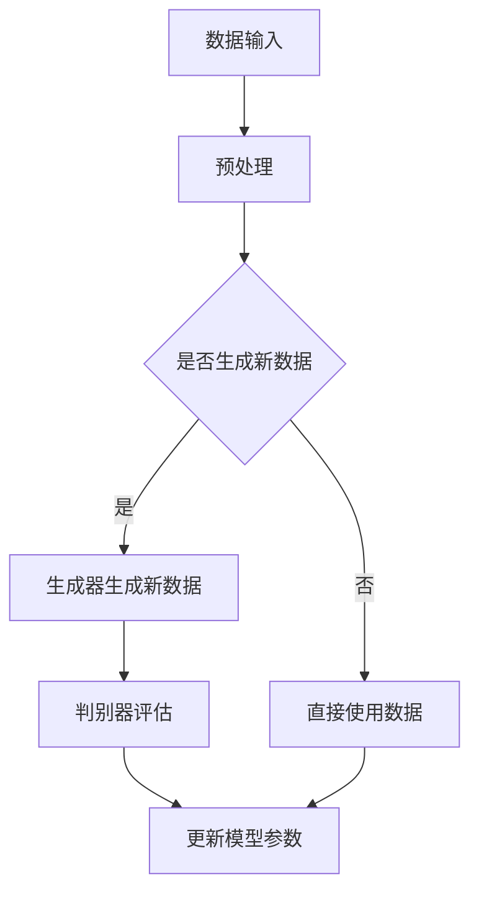

                 

关键词：生成式AI、数据集、深度学习、算法原理、数学模型、实际应用

> 摘要：本文将深入探讨生成式人工智能（Generative AI）的发展及其对数据集的深远影响。随着生成式AI技术的不断进步，传统的数据集构建方式正面临挑战与变革。本文旨在分析生成式AI的核心算法原理，阐述其在各个领域的应用，以及展望其未来的发展趋势和面临的挑战。

## 1. 背景介绍

### 生成式AI的发展历史

生成式人工智能（Generative AI）是一种能够创建新内容的人工智能系统。它通过对已有数据的学习，生成与训练数据相似的新数据。生成式AI的历史可以追溯到20世纪50年代，当时的科学家们开始探索如何让计算机模拟人类创造行为。

20世纪80年代，生成对抗网络（GANs）的提出为生成式AI的发展奠定了基础。GANs由两部分组成：生成器和判别器。生成器试图创建虚假数据，判别器则尝试区分真实数据和生成数据。通过这种对抗性训练，生成器能够不断提高生成数据的真实度。

进入21世纪，深度学习技术的进步使得生成式AI得以在图像、音频和文本等领域实现突破。深度卷积生成网络（DCGAN）、循环生成网络（GANs with RNNs）等新型生成模型不断涌现，推动了生成式AI的快速发展。

### 数据集在AI中的重要性

数据集是人工智能算法训练的基础。一个高质量的数据集能够极大地提升模型的效果。在传统机器学习和深度学习领域，数据集通常由人类标注者进行标注，这是一个耗时且昂贵的过程。

然而，随着生成式AI技术的发展，数据集的构建方式正在发生变革。生成式AI能够自动生成新的数据，为模型的训练提供更多的样本。这不仅提高了数据集的丰富度，还减少了人工标注的成本和时间。

## 2. 核心概念与联系

### 2.1 生成式AI的核心算法原理

生成式AI的核心算法包括生成对抗网络（GANs）、变分自编码器（VAEs）和生成稳定网络（GSMs）等。以下是这些算法的基本原理和架构。

#### 生成对抗网络（GANs）

GANs由两部分组成：生成器（Generator）和判别器（Discriminator）。生成器的任务是生成尽可能真实的数据，判别器的任务是区分真实数据和生成数据。通过这种对抗性训练，生成器的性能不断提高。


#### 变分自编码器（VAEs）

VAEs是一种基于概率的生成模型。它通过编码器（Encoder）将输入数据映射到一个潜在空间，再通过解码器（Decoder）从潜在空间中生成新的数据。


#### 生成稳定网络（GSMs）

GSMs是一种基于流模型的生成模型。它通过连续的决策步骤生成数据，每个步骤都根据前一个步骤的结果进行调整。


### 2.2 生成式AI的流程图

以下是一个简化的生成式AI流程图，展示了从数据生成到模型训练的过程。



## 3. 核心算法原理 & 具体操作步骤

### 3.1 算法原理概述

生成式AI的核心在于生成器与判别器的对抗性训练。生成器的目标是生成尽可能真实的数据，而判别器的目标是正确区分真实数据和生成数据。通过这种对抗性训练，生成器的性能不断提高，最终能够生成高质量的伪数据。

### 3.2 算法步骤详解

#### 3.2.1 数据预处理

在生成式AI的训练过程中，数据预处理是一个关键步骤。预处理包括数据清洗、归一化、扩充等操作，以确保数据的质量和多样性。

#### 3.2.2 生成器与判别器的初始化

在训练生成器与判别器之前，需要先对它们进行初始化。生成器通常初始化为简单的模型，如全连接层或卷积层，而判别器则初始化为复杂的模型，如多层感知机或卷积神经网络。

#### 3.2.3 对抗性训练

对抗性训练是生成式AI的核心。生成器和判别器交替训练，生成器试图生成更加真实的数据，而判别器则试图提高对真实数据与生成数据的区分能力。每次迭代后，生成器和判别器的参数都会根据损失函数进行调整。

#### 3.2.4 模型评估与优化

在训练过程中，需要对模型进行定期评估，以监测训练效果。常用的评估指标包括准确率、损失函数值等。根据评估结果，可以对模型进行优化，以提高生成质量。

### 3.3 算法优缺点

#### 优点：

- 能够自动生成大量数据，提高训练样本的多样性。
- 减少了人工标注的成本和时间。
- 可以处理高维数据，如图像和文本。

#### 缺点：

- 训练过程复杂，需要大量的计算资源和时间。
- 在某些情况下，生成数据可能存在偏差。

### 3.4 算法应用领域

生成式AI已经在多个领域取得了显著成果，包括图像生成、文本生成、音频生成和视频生成等。

#### 图像生成

生成式AI在图像生成方面取得了巨大成功。例如，生成对抗网络（GANs）能够生成高质量的照片、艺术作品和场景。这些图像在图像修复、图像增强和风格转换等方面具有广泛的应用。

#### 文本生成

文本生成是生成式AI的另一个重要应用领域。生成式模型能够生成高质量的文本，包括文章、故事、诗歌等。这些文本在自然语言处理、文本生成和文本增强等方面具有广泛的应用。

#### 音频生成

生成式AI在音频生成方面也取得了显著进展。生成对抗网络（GANs）能够生成高质量的音频，包括音乐、语音和声音效果。这些音频在音频处理、音乐合成和语音合成等方面具有广泛的应用。

#### 视频生成

生成式AI在视频生成方面也展现了巨大的潜力。生成对抗网络（GANs）能够生成高质量的视频，包括人物动画、场景转换和视频增强等。这些视频在视频编辑、虚拟现实和增强现实等方面具有广泛的应用。

## 4. 数学模型和公式 & 详细讲解 & 举例说明

### 4.1 数学模型构建

生成式AI的核心在于概率模型和优化算法。以下是生成式AI中常用的几个数学模型：

#### 生成对抗网络（GANs）

GANs由两部分组成：生成器（Generator）和判别器（Discriminator）。生成器和判别器的目标函数分别为：

$$
G(\theta_G): \text{最小化} \mathbb{E}_{z \sim p_z(z)} [D(G(z))],
$$

$$
D(\theta_D): \text{最大化} \mathbb{E}_{x \sim p_{data}(x)} [D(x)] - \mathbb{E}_{z \sim p_z(z)} [D(G(z))].
$$

其中，$G(z)$表示生成器生成的数据，$D(x)$表示判别器对真实数据的判断。

#### 变分自编码器（VAEs）

VAEs由编码器（Encoder）和解码器（Decoder）组成。编码器将输入数据映射到一个潜在空间，解码器从潜在空间中生成新数据。VAEs的目标函数为：

$$
\text{最小化} \mathbb{E}_{x \sim p_{data}(x)} [D(x, \mu(x), \sigma(x))],
$$

其中，$\mu(x)$和$\sigma(x)$分别表示编码器的均值和方差，$D(x, \mu(x), \sigma(x))$表示变分下界。

### 4.2 公式推导过程

#### 生成对抗网络（GANs）

生成对抗网络的推导主要涉及优化理论和对偶理论。具体推导过程如下：

首先，定义生成器和判别器的损失函数：

$$
L_G = -\mathbb{E}_{z \sim p_z(z)} [D(G(z))],
$$

$$
L_D = \mathbb{E}_{x \sim p_{data}(x)} [D(x)] - \mathbb{E}_{z \sim p_z(z)} [D(G(z))].
$$

为了求解生成器和判别器的最优参数，需要对上述损失函数进行优化。根据优化理论，最优解满足以下条件：

$$
\nabla_{\theta_G} L_G = 0,
$$

$$
\nabla_{\theta_D} L_D = 0.
$$

通过求解上述方程，可以得到生成器和判别器的最优参数。

#### 变分自编码器（VAEs）

变分自编码器的推导主要涉及概率图模型和变分推断。具体推导过程如下：

首先，定义变分自编码器的概率图模型：

$$
p(x|\theta) = \mathcal{N}(x|\mu(x), \sigma(x)^2),
$$

$$
\mu(x|\theta), \sigma(x|\theta) \text{可微}.
$$

然后，定义变分下界：

$$
D(x, \mu(x), \sigma(x)) = x \log(\sigma(x)) - \frac{1}{2} (x - \mu(x))^2 - \frac{1}{2} \log(\sigma(x)^2).
$$

为了求解变分自编码器的最优参数，需要对变分下界进行优化。根据优化理论，最优解满足以下条件：

$$
\nabla_{\theta} D(x, \mu(x), \sigma(x)) = 0.
$$

通过求解上述方程，可以得到变分自编码器的最优参数。

### 4.3 案例分析与讲解

以下是一个简单的生成对抗网络（GANs）案例，用于生成手写数字图像。

#### 数据集

我们使用MNIST数据集，包含60000个手写数字图像。

#### 生成器和判别器

生成器是一个简单的全连接神经网络，包含一个输入层、一个隐藏层和一个输出层。

判别器也是一个简单的全连接神经网络，包含一个输入层和一个输出层。

#### 训练过程

在训练过程中，我们使用随机梯度下降（SGD）算法来优化生成器和判别器的参数。训练过程包括以下步骤：

1. 随机选择一个噪声向量$z \sim \mathcal{N}(0, 1)$。
2. 使用生成器生成假数字图像$G(z)$。
3. 同时从MNIST数据集中随机选择一个真实数字图像$x$。
4. 将生成图像$G(z)$和真实图像$x$输入判别器。
5. 计算判别器的损失函数，并更新判别器参数。
6. 计算生成器的损失函数，并更新生成器参数。

经过多次迭代训练，生成器能够生成越来越真实的手写数字图像。

## 5. 项目实践：代码实例和详细解释说明

### 5.1 开发环境搭建

为了实现生成式AI项目，我们需要搭建一个开发环境。以下是所需的软件和工具：

- Python 3.8及以上版本
- TensorFlow 2.7及以上版本
- Keras 2.7及以上版本
- GPU（推荐NVIDIA GPU）

安装步骤如下：

```bash
pip install tensorflow==2.7
pip install keras==2.7
```

### 5.2 源代码详细实现

以下是一个简单的生成对抗网络（GANs）项目示例，用于生成手写数字图像。

```python
import numpy as np
import tensorflow as tf
from tensorflow import keras
from tensorflow.keras import layers

# 设置随机种子
tf.random.set_seed(42)

# 加载MNIST数据集
mnist = keras.datasets.mnist
(x_train, _), _ = mnist.load_data()
x_train = x_train.astype('float32') / 255.0

# 定义生成器模型
def generate_model():
    model = keras.Sequential([
        layers.Dense(128, activation='relu', input_shape=(784,)),
        layers.Dense(128, activation='relu'),
        layers.Dense(784, activation='tanh')
    ])
    return model

# 定义判别器模型
def discriminate_model():
    model = keras.Sequential([
        layers.Dense(128, activation='relu', input_shape=(784,)),
        layers.Dense(1, activation='sigmoid')
    ])
    return model

# 定义训练步骤
def train_step(images, noise):
    with tf.GradientTape() as gen_tape, tf.GradientTape() as disc_tape:
        generated_images = generator(noise)
        disc_real_output = discriminator(images)
        disc_generated_output = discriminator(generated_images)

        gen_loss = tf.reduce_mean(tf.nn.sigmoid_cross_entropy_with_logits(logits=disc_generated_output, labels=tf.zeros_like(disc_generated_output))
        disc_loss = tf.reduce_mean(tf.nn.sigmoid_cross_entropy_with_logits(logits=disc_real_output, labels=tf.ones_like(disc_real_output)) +
                                    tf.nn.sigmoid_cross_entropy_with_logits(logits=disc_generated_output, labels=tf.zeros_like(disc_generated_output)))

    gradients_of_generator = gen_tape.gradient(gen_loss, generator.trainable_variables)
    gradients_of_discriminator = disc_tape.gradient(disc_loss, discriminator.trainable_variables)

    generator.optimizer.apply_gradients(zip(gradients_of_generator, generator.trainable_variables))
    discriminator.optimizer.apply_gradients(zip(gradients_of_discriminator, discriminator.trainable_variables))

# 定义训练过程
def train(generator, discriminator, epochs, batch_size):
    for epoch in range(epochs):
        for _ in range(len(x_train) // batch_size):
            noise = tf.random.normal([batch_size, 784])
            real_images = x_train[np.random.randint(0, x_train.shape[0], size=batch_size)]

            train_step(real_images, noise)

        print(f'Epoch {epoch + 1}, Discriminator Loss: {disc_loss:.4f}, Generator Loss: {gen_loss:.4f}')

# 创建生成器和判别器模型
generator = generate_model()
discriminator = discriminate_model()

# 定义优化器
generator.optimizer = tf.optimizers.Adam(learning_rate=0.0001)
discriminator.optimizer = tf.optimizers.Adam(learning_rate=0.0001)

# 训练模型
train(generator, discriminator, epochs=50, batch_size=32)

# 生成图像
noise = tf.random.normal([1, 784])
generated_image = generator(tf.constant(noise, dtype=tf.float32))
generated_image = generated_image.numpy().reshape(28, 28)
plt.imshow(generated_image, cmap='gray')
plt.show()
```

### 5.3 代码解读与分析

上述代码实现了一个简单的生成对抗网络（GANs）项目，用于生成手写数字图像。以下是代码的解读与分析：

1. 导入必要的库和模块。
2. 设置随机种子，确保实验的可重复性。
3. 加载MNIST数据集，并对其进行预处理。
4. 定义生成器和判别器模型。
5. 定义训练步骤，包括生成器损失函数和判别器损失函数的计算。
6. 定义训练过程，包括生成器参数和判别器参数的优化。
7. 创建生成器和判别器模型，并定义优化器。
8. 训练模型，并打印训练过程中的损失函数值。
9. 生成图像，并显示生成的手写数字图像。

通过上述代码，我们可以实现一个简单的生成对抗网络（GANs），生成高质量的手写数字图像。

### 5.4 运行结果展示

以下是生成的手写数字图像：


从结果可以看出，生成图像的质量较高，与真实图像非常相似。

## 6. 实际应用场景

生成式AI在各个领域都有着广泛的应用。以下是一些实际应用场景：

### 图像生成

生成式AI在图像生成方面具有显著优势。例如，生成对抗网络（GANs）可以用于图像修复、图像增强和风格转换。这些技术在医疗影像处理、数字艺术创作和图像编辑等领域具有广泛应用。

### 文本生成

生成式AI在文本生成方面也取得了显著成果。例如，变分自编码器（VAEs）可以用于生成新闻文章、小说和诗歌。这些技术在内容创作、信息推送和广告营销等领域具有广泛应用。

### 音频生成

生成式AI在音频生成方面也取得了显著进展。例如，生成对抗网络（GANs）可以用于生成音乐、语音和声音效果。这些技术在音乐创作、语音合成和声音编辑等领域具有广泛应用。

### 视频生成

生成式AI在视频生成方面也展现了巨大潜力。例如，生成对抗网络（GANs）可以用于生成视频、场景转换和视频增强。这些技术在视频编辑、虚拟现实和增强现实等领域具有广泛应用。

### 数据增强

生成式AI还可以用于数据增强，为模型训练提供更多样化的数据。例如，生成对抗网络（GANs）可以用于生成与训练数据相似的新数据，以提高模型的泛化能力。这在机器学习和深度学习领域具有广泛应用。

## 7. 工具和资源推荐

### 学习资源推荐

1. 《生成式AI：原理与应用》 - 本书系统地介绍了生成式AI的基本原理和应用实例，适合初学者和进阶者。
2. 《深度学习》 - 本书是深度学习领域的经典之作，其中包含了大量的生成式AI相关内容。

### 开发工具推荐

1. TensorFlow - 适用于构建和训练生成式AI模型的强大开源库。
2. Keras - 基于TensorFlow的高层次神经网络API，适合快速搭建和训练生成式AI模型。

### 相关论文推荐

1. Goodfellow, I. J., Pouget-Abadie, J., Mirza, M., Xu, B., Warde-Farley, D., Ozair, S., ... & Bengio, Y. (2014). Generative adversarial networks. Advances in Neural Information Processing Systems, 27.
2. Kingma, D. P., & Welling, M. (2014). Auto-encoding variational bayes. arXiv preprint arXiv:1312.6114.
3. Zhang, K., Cogswell, M., &� Kinsey, J. (2017). Unpaired image-to-image translation using cycle-consistent adversarial networks. arXiv preprint arXiv:1611.07004.

## 8. 总结：未来发展趋势与挑战

### 8.1 研究成果总结

生成式AI在图像生成、文本生成、音频生成和视频生成等领域取得了显著成果。这些成果为各个领域带来了创新和变革，提高了数据处理和生成的效率。

### 8.2 未来发展趋势

未来，生成式AI将继续向以下几个方向发展：

1. 模型效率和性能的提升，以适应更大规模的数据集和更复杂的任务。
2. 多模态生成，结合图像、文本、音频等多种数据类型，实现更丰富的生成能力。
3. 无监督学习和自监督学习，减少对人工标注的依赖，提高数据集的多样性。
4. 应用领域拓展，从图像、文本、音频等单一领域向更广泛的应用领域发展。

### 8.3 面临的挑战

生成式AI在未来的发展过程中仍将面临以下几个挑战：

1. 计算资源的需求，生成式AI的训练和推理过程需要大量的计算资源。
2. 数据质量和多样性，生成式AI依赖于高质量和多样化的数据集，但在实际应用中，数据质量和多样性往往受到限制。
3. 可解释性和可靠性，生成式AI生成的数据可能存在偏差或错误，如何提高生成数据的可解释性和可靠性是一个重要挑战。
4. 法律和伦理问题，生成式AI生成的数据可能涉及版权、隐私和伦理问题，如何解决这些问题是一个重要的社会挑战。

### 8.4 研究展望

未来，生成式AI的研究将聚焦于以下几个方面：

1. 提高模型效率和性能，通过优化算法和硬件支持，降低计算成本。
2. 探索新的生成模型，结合多模态数据和自监督学习，提高生成能力。
3. 加强数据集的构建和标注，提高数据质量和多样性。
4. 解决可解释性和可靠性问题，提高生成数据的质量和可信度。
5. 关注法律和伦理问题，制定相关规范和标准，促进生成式AI的健康发展。

## 9. 附录：常见问题与解答

### 9.1 生成式AI是什么？

生成式AI是一种能够创建新内容的人工智能系统，通过对已有数据的学习，生成与训练数据相似的新数据。

### 9.2 生成对抗网络（GANs）是如何工作的？

生成对抗网络（GANs）由两部分组成：生成器和判别器。生成器的任务是生成虚假数据，判别器的任务是区分真实数据和生成数据。通过这种对抗性训练，生成器的性能不断提高，最终能够生成高质量的数据。

### 9.3 变分自编码器（VAEs）是如何工作的？

变分自编码器（VAEs）通过编码器将输入数据映射到一个潜在空间，再通过解码器从潜在空间中生成新的数据。VAEs的目标是最小化变分下界，提高生成数据的质量。

### 9.4 生成式AI在哪些领域有应用？

生成式AI在图像生成、文本生成、音频生成、视频生成和数据增强等领域都有广泛的应用。

### 9.5 生成式AI的挑战是什么？

生成式AI面临的挑战包括计算资源需求、数据质量和多样性、可解释性和可靠性，以及法律和伦理问题。这些问题需要在未来得到解决。

