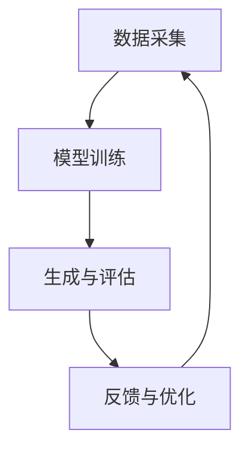

                 

关键词：生成式AI、AIGC、商业应用、技术创新、AI算法

> 摘要：本文深入探讨了生成式AI技术（AIGC）的商业应用，分析了其核心概念、算法原理、数学模型及实际应用场景。通过对生成式AI技术的详细介绍，展示了其在商业领域的广泛前景，并对未来的发展趋势和挑战进行了展望。

## 1. 背景介绍

随着人工智能（AI）技术的飞速发展，生成式AI（AIGC，Generative AI）作为一种新兴的AI技术，逐渐引起了广泛关注。AIGC是指利用AI算法生成内容的技术，能够生成文本、图像、音频等多种类型的数据。与传统的基于规则的AI系统相比，AIGC具有更强的创造性和灵活性，能够模拟人类创造过程，生成新颖且具有价值的内容。

近年来，生成式AI技术在各个领域取得了显著的进展，如自然语言处理（NLP）、计算机视觉（CV）、音乐创作等。随着技术的不断成熟，AIGC在商业应用中的潜力逐渐被挖掘，为企业提供了新的商业模式和创新机会。

## 2. 核心概念与联系

### 2.1 生成式AI的概念

生成式AI的核心是生成模型（Generative Model），它通过学习大量的数据，生成与输入数据相似的新数据。常见的生成模型包括生成对抗网络（GAN）、变分自编码器（VAE）等。

生成模型的基本原理是学习输入数据的概率分布，然后在该分布上生成新的数据。通过不断优化模型，使其生成的数据越来越接近真实数据，从而实现数据生成。

### 2.2 AIGC的架构

AIGC的架构主要包括数据采集、模型训练、生成与评估等环节。

1. **数据采集**：收集大量与目标生成内容相关的数据，如文本、图像、音频等。

2. **模型训练**：使用生成模型对采集到的数据进行训练，学习输入数据的概率分布。

3. **生成与评估**：根据训练好的模型生成新数据，并对生成数据的质量进行评估。

4. **反馈与优化**：根据评估结果对模型进行优化，以提高生成数据的质量。

### 2.3 Mermaid流程图



## 3. 核心算法原理 & 具体操作步骤

### 3.1 算法原理概述

生成式AI的核心算法是生成模型，主要包括生成对抗网络（GAN）和变分自编码器（VAE）。

- **生成对抗网络（GAN）**：由生成器（Generator）和判别器（Discriminator）组成。生成器生成假数据，判别器判断生成数据和真实数据。通过不断训练，生成器生成越来越真实的数据。

- **变分自编码器（VAE）**：通过编码器（Encoder）和解码器（Decoder）实现数据生成。编码器将输入数据映射到一个隐含空间，解码器从隐含空间生成输出数据。

### 3.2 算法步骤详解

1. **数据准备**：收集与目标生成内容相关的数据，如文本、图像、音频等。

2. **模型选择**：根据应用场景选择合适的生成模型，如GAN或VAE。

3. **模型训练**：
   - **GAN**：训练生成器和判别器，生成器生成假数据，判别器判断真假。通过反向传播和优化算法更新模型参数。
   - **VAE**：训练编码器和解码器，编码器将输入数据映射到隐含空间，解码器从隐含空间生成输出数据。通过优化损失函数和反向传播更新模型参数。

4. **生成与评估**：使用训练好的模型生成新数据，并对生成数据的质量进行评估。

5. **反馈与优化**：根据评估结果对模型进行优化，以提高生成数据的质量。

### 3.3 算法优缺点

- **GAN**：
  - 优点：生成数据质量高，能够生成多样化数据。
  - 缺点：训练难度大，容易发生模式崩溃（mode collapse）。

- **VAE**：
  - 优点：训练稳定，生成数据质量较好。
  - 缺点：生成数据多样性较差，无法生成超越训练数据的复杂结构。

### 3.4 算法应用领域

- **自然语言处理**：生成文章、对话、代码等。
- **计算机视觉**：生成图像、视频、3D模型等。
- **音乐创作**：生成旋律、和弦、歌曲等。
- **其他领域**：如生成式设计、艺术创作等。

## 4. 数学模型和公式 & 详细讲解 & 举例说明

### 4.1 数学模型构建

- **GAN**：

  - 生成器：\( G(z) \)
  - 判别器：\( D(x) \)
  - 损失函数：\( \mathcal{L}(G, D) \)

- **VAE**：

  - 编码器：\( \mu(x), \sigma(x) \)
  - 解码器：\( G(\mu, \sigma) \)
  - 损失函数：\( \mathcal{L}(G, D) \)

### 4.2 公式推导过程

- **GAN**：

  - 生成器损失函数：

    $$ \mathcal{L}_G = -\log(D(G(z))) $$

  - 判别器损失函数：

    $$ \mathcal{L}_D = -[\log(D(x)) + \log(1 - D(G(z)))] $$

- **VAE**：

  - 编码器损失函数：

    $$ \mathcal{L}_E = \frac{1}{n}\sum_{i=1}^{n} D(\mu(x_i), \sigma(x_i)) $$

  - 解码器损失函数：

    $$ \mathcal{L}_D = \frac{1}{n}\sum_{i=1}^{n} D(G(\mu(x_i), \sigma(x_i))) $$

  - 总损失函数：

    $$ \mathcal{L} = \mathcal{L}_E + \mathcal{L}_D $$

### 4.3 案例分析与讲解

以生成图像为例，分析GAN和VAE的应用。

- **GAN**：

  - 数据准备：收集大量图像数据。
  - 模型训练：使用GAN训练生成器和判别器。
  - 生成与评估：使用生成器生成图像，评估图像质量。
  - 反馈与优化：根据评估结果优化模型。

- **VAE**：

  - 数据准备：收集大量图像数据。
  - 模型训练：使用VAE训练编码器和解码器。
  - 生成与评估：使用解码器生成图像，评估图像质量。
  - 反馈与优化：根据评估结果优化模型。

## 5. 项目实践：代码实例和详细解释说明

### 5.1 开发环境搭建

- **环境要求**：Python 3.7及以上版本，TensorFlow 2.3及以上版本。
- **安装依赖**：

  ```bash
  pip install tensorflow numpy matplotlib
  ```

### 5.2 源代码详细实现

以下是一个简单的GAN模型实现，用于生成手写数字图像。

```python
import tensorflow as tf
from tensorflow.keras.layers import Dense, Flatten, Reshape
from tensorflow.keras.models import Model

# 生成器模型
def build_generator(z_dim):
    model = tf.keras.Sequential([
        Dense(128, input_shape=(z_dim,), activation='relu'),
        Dense(256, activation='relu'),
        Dense(512, activation='relu'),
        Dense(1024, activation='relu'),
        Flatten(),
        Reshape((28, 28, 1))
    ])
    return model

# 判别器模型
def build_discriminator(img_shape):
    model = tf.keras.Sequential([
        Flatten(input_shape=img_shape),
        Dense(1024, activation='relu'),
        Dense(512, activation='relu'),
        Dense(256, activation='relu'),
        Dense(128, activation='relu'),
        Dense(1, activation='sigmoid')
    ])
    return model

# GAN模型
def build_gan(generator, discriminator):
    model = tf.keras.Sequential([
        generator,
        discriminator
    ])
    return model

# 模型参数
z_dim = 100
img_shape = (28, 28, 1)

# 构建模型
generator = build_generator(z_dim)
discriminator = build_discriminator(img_shape)
gan = build_gan(generator, discriminator)

# 模型编译
gan.compile(optimizer=tf.keras.optimizers.Adam(0.0001), loss='binary_crossentropy')

# 输出模型结构
print(gan.summary())
```

### 5.3 代码解读与分析

- **生成器模型**：使用全连接层对输入的随机噪声进行编码，然后通过逐步增加层数和神经元数，生成手写数字图像。
- **判别器模型**：对手写数字图像进行编码，判断图像是真实图像还是生成图像。
- **GAN模型**：将生成器和判别器串联，用于训练生成器和判别器。

### 5.4 运行结果展示

训练完成后，使用生成器生成手写数字图像，并展示结果。

```python
import numpy as np
import matplotlib.pyplot as plt

# 生成随机噪声
z_samples = np.random.normal(size=(100, z_dim))

# 生成手写数字图像
generated_images = generator.predict(z_samples)

# 展示生成图像
plt.figure(figsize=(10, 10))
for i in range(100):
    plt.subplot(10, 10, i + 1)
    plt.imshow(generated_images[i, :, :, 0], cmap='gray')
    plt.axis('off')
plt.show()
```

## 6. 实际应用场景

生成式AI技术在商业应用中具有广泛的前景，以下是一些典型的应用场景：

- **内容生成**：生成文章、图片、视频等，提高创作效率，降低创作成本。
- **个性化推荐**：基于用户行为和偏好，生成个性化内容，提高用户满意度。
- **虚拟现实**：生成高质量的虚拟场景，提升虚拟现实体验。
- **广告创意**：生成创意广告内容，提高广告效果。
- **艺术创作**：生成音乐、绘画等艺术作品，为艺术家提供灵感。

## 7. 工具和资源推荐

### 7.1 学习资源推荐

- **书籍**：
  - 《深度学习》（Ian Goodfellow、Yoshua Bengio、Aaron Courville 著）
  - 《生成对抗网络》（Igor Carboni 著）
- **在线课程**：
  - Coursera上的《深度学习专项课程》（吴恩达教授）
  - edX上的《生成对抗网络》（香港科技大学）

### 7.2 开发工具推荐

- **框架**：
  - TensorFlow
  - PyTorch
- **数据集**：
  - MNIST
  - CIFAR-10
  - ImageNet

### 7.3 相关论文推荐

- **生成对抗网络**：
  - Ian J. Goodfellow, et al. "Generative Adversarial Networks."
- **变分自编码器**：
  - Diederik P. Kingma, et al. "Auto-encoding Variational Bayes."

## 8. 总结：未来发展趋势与挑战

### 8.1 研究成果总结

生成式AI技术（AIGC）在图像、文本、音乐等多个领域取得了显著成果。其核心算法（如GAN、VAE）不断优化，生成数据质量不断提高。AIGC在商业应用中展现了巨大潜力，如内容生成、个性化推荐等。

### 8.2 未来发展趋势

- **算法优化**：提高生成数据质量和多样性，降低训练难度。
- **跨模态生成**：实现不同模态（如文本、图像、音频）的交叉生成。
- **应用拓展**：进一步探索AIGC在其他领域的应用，如医疗、金融等。

### 8.3 面临的挑战

- **数据隐私**：生成数据可能涉及用户隐私，需要加强数据保护。
- **算法可解释性**：生成过程复杂，提高算法的可解释性，增强用户信任。

### 8.4 研究展望

生成式AI技术（AIGC）将在未来继续发展，不断推动人工智能技术的发展。在商业应用中，AIGC将带来更多创新机会，为企业创造价值。同时，需要关注数据隐私和算法可解释性等问题，确保技术的可持续发展。

## 9. 附录：常见问题与解答

### 9.1 什么是生成式AI？

生成式AI是一种利用AI算法生成新内容的技术，能够生成文本、图像、音频等多种类型的数据。

### 9.2 GAN和VAE的区别是什么？

GAN由生成器和判别器组成，生成数据质量高，但训练难度大。VAE通过编码器和解码器实现数据生成，训练稳定，但生成数据多样性较差。

### 9.3 AIGC在商业应用中的前景如何？

AIGC在内容生成、个性化推荐、虚拟现实、广告创意等领域具有广泛的应用前景，能够为企业提供创新机会，提高创作效率，降低成本。

### 9.4 如何选择合适的生成模型？

根据应用场景和数据类型选择合适的生成模型。如生成图像选择GAN，生成文本选择VAE等。

---

以上是对生成式AI技术（AIGC）的商业应用进行深入探讨的文章。希望本文能为读者提供有价值的信息和启示。

# 生成式AIGC：AI技术的商业应用

> 关键词：生成式AI、AIGC、商业应用、技术创新、AI算法

> 摘要：本文深入探讨了生成式AI技术（AIGC）的商业应用，分析了其核心概念、算法原理、数学模型及实际应用场景。通过对生成式AI技术的详细介绍，展示了其在商业领域的广泛前景，并对未来的发展趋势和挑战进行了展望。

## 1. 背景介绍

随着人工智能（AI）技术的飞速发展，生成式AI（AIGC，Generative AI）作为一种新兴的AI技术，逐渐引起了广泛关注。AIGC是指利用AI算法生成内容的技术，能够生成文本、图像、音频等多种类型的数据。与传统的基于规则的AI系统相比，AIGC具有更强的创造性和灵活性，能够模拟人类创造过程，生成新颖且具有价值的内容。

近年来，生成式AI技术在各个领域取得了显著的进展，如自然语言处理（NLP）、计算机视觉（CV）、音乐创作等。随着技术的不断成熟，AIGC在商业应用中的潜力逐渐被挖掘，为企业提供了新的商业模式和创新机会。

## 2. 核心概念与联系

### 2.1 生成式AI的概念

生成式AI的核心是生成模型（Generative Model），它通过学习大量的数据，生成与输入数据相似的新数据。常见的生成模型包括生成对抗网络（GAN）、变分自编码器（VAE）等。

生成模型的基本原理是学习输入数据的概率分布，然后在该分布上生成新的数据。通过不断优化模型，使其生成的数据越来越接近真实数据，从而实现数据生成。

### 2.2 AIGC的架构

AIGC的架构主要包括数据采集、模型训练、生成与评估等环节。

1. **数据采集**：收集大量与目标生成内容相关的数据，如文本、图像、音频等。

2. **模型训练**：使用生成模型对采集到的数据进行训练，学习输入数据的概率分布。

3. **生成与评估**：根据训练好的模型生成新数据，并对生成数据的质量进行评估。

4. **反馈与优化**：根据评估结果对模型进行优化，以提高生成数据的质量。

### 2.3 Mermaid流程图


## 3. 核心算法原理 & 具体操作步骤

### 3.1 算法原理概述

生成式AI的核心算法是生成模型，主要包括生成对抗网络（GAN）和变分自编码器（VAE）。

- **生成对抗网络（GAN）**：由生成器（Generator）和判别器（Discriminator）组成。生成器生成假数据，判别器判断生成数据和真实数据。通过不断训练，生成器生成越来越真实的数据。

- **变分自编码器（VAE）**：通过编码器（Encoder）和解码器（Decoder）实现数据生成。编码器将输入数据映射到一个隐含空间，解码器从隐含空间生成输出数据。

### 3.2 算法步骤详解

1. **数据准备**：收集与目标生成内容相关的数据，如文本、图像、音频等。

2. **模型选择**：根据应用场景选择合适的生成模型，如GAN或VAE。

3. **模型训练**：
   - **GAN**：训练生成器和判别器，生成器生成假数据，判别器判断真假。通过反向传播和优化算法更新模型参数。
   - **VAE**：训练编码器和解码器，编码器将输入数据映射到隐含空间，解码器从隐含空间生成输出数据。通过优化损失函数和反向传播更新模型参数。

4. **生成与评估**：使用训练好的模型生成新数据，并对生成数据的质量进行评估。

5. **反馈与优化**：根据评估结果对模型进行优化，以提高生成数据的质量。

### 3.3 算法优缺点

- **GAN**：
  - 优点：生成数据质量高，能够生成多样化数据。
  - 缺点：训练难度大，容易发生模式崩溃（mode collapse）。

- **VAE**：
  - 优点：训练稳定，生成数据质量较好。
  - 缺点：生成数据多样性较差，无法生成超越训练数据的复杂结构。

### 3.4 算法应用领域

- **自然语言处理**：生成文章、对话、代码等。
- **计算机视觉**：生成图像、视频、3D模型等。
- **音乐创作**：生成旋律、和弦、歌曲等。
- **其他领域**：如生成式设计、艺术创作等。

## 4. 数学模型和公式 & 详细讲解 & 举例说明

### 4.1 数学模型构建

- **GAN**：

  - 生成器：\( G(z) \)
  - 判别器：\( D(x) \)
  - 损失函数：\( \mathcal{L}(G, D) \)

- **VAE**：

  - 编码器：\( \mu(x), \sigma(x) \)
  - 解码器：\( G(\mu, \sigma) \)
  - 损失函数：\( \mathcal{L}(G, D) \)

### 4.2 公式推导过程

- **GAN**：

  - 生成器损失函数：

    $$ \mathcal{L}_G = -\log(D(G(z))) $$

  - 判别器损失函数：

    $$ \mathcal{L}_D = -[\log(D(x)) + \log(1 - D(G(z)))] $$

- **VAE**：

  - 编码器损失函数：

    $$ \mathcal{L}_E = \frac{1}{n}\sum_{i=1}^{n} D(\mu(x_i), \sigma(x_i)) $$

  - 解码器损失函数：

    $$ \mathcal{L}_D = \frac{1}{n}\sum_{i=1}^{n} D(G(\mu(x_i), \sigma(x_i))) $$

  - 总损失函数：

    $$ \mathcal{L} = \mathcal{L}_E + \mathcal{L}_D $$

### 4.3 案例分析与讲解

以生成图像为例，分析GAN和VAE的应用。

- **GAN**：

  - 数据准备：收集大量图像数据。
  - 模型训练：使用GAN训练生成器和判别器。
  - 生成与评估：使用生成器生成图像，评估图像质量。
  - 反馈与优化：根据评估结果优化模型。

- **VAE**：

  - 数据准备：收集大量图像数据。
  - 模型训练：使用VAE训练编码器和解码器。
  - 生成与评估：使用解码器生成图像，评估图像质量。
  - 反馈与优化：根据评估结果优化模型。

## 5. 项目实践：代码实例和详细解释说明

### 5.1 开发环境搭建

- **环境要求**：Python 3.7及以上版本，TensorFlow 2.3及以上版本。
- **安装依赖**：

  ```bash
  pip install tensorflow numpy matplotlib
  ```

### 5.2 源代码详细实现

以下是一个简单的GAN模型实现，用于生成手写数字图像。

```python
import tensorflow as tf
from tensorflow.keras.layers import Dense, Flatten, Reshape
from tensorflow.keras.models import Model

# 生成器模型
def build_generator(z_dim):
    model = tf.keras.Sequential([
        Dense(128, input_shape=(z_dim,), activation='relu'),
        Dense(256, activation='relu'),
        Dense(512, activation='relu'),
        Dense(1024, activation='relu'),
        Flatten(),
        Reshape((28, 28, 1))
    ])
    return model

# 判别器模型
def build_discriminator(img_shape):
    model = tf.keras.Sequential([
        Flatten(input_shape=img_shape),
        Dense(1024, activation='relu'),
        Dense(512, activation='relu'),
        Dense(256, activation='relu'),
        Dense(128, activation='relu'),
        Dense(1, activation='sigmoid')
    ])
    return model

# GAN模型
def build_gan(generator, discriminator):
    model = tf.keras.Sequential([
        generator,
        discriminator
    ])
    return model

# 模型参数
z_dim = 100
img_shape = (28, 28, 1)

# 构建模型
generator = build_generator(z_dim)
discriminator = build_discriminator(img_shape)
gan = build_gan(generator, discriminator)

# 模型编译
gan.compile(optimizer=tf.keras.optimizers.Adam(0.0001), loss='binary_crossentropy')

# 输出模型结构
print(gan.summary())
```

### 5.3 代码解读与分析

- **生成器模型**：使用全连接层对输入的随机噪声进行编码，然后通过逐步增加层数和神经元数，生成手写数字图像。
- **判别器模型**：对手写数字图像进行编码，判断图像是真实图像还是生成图像。
- **GAN模型**：将生成器和判别器串联，用于训练生成器和判别器。

### 5.4 运行结果展示

训练完成后，使用生成器生成手写数字图像，并展示结果。

```python
import numpy as np
import matplotlib.pyplot as plt

# 生成随机噪声
z_samples = np.random.normal(size=(100, z_dim))

# 生成手写数字图像
generated_images = generator.predict(z_samples)

# 展示生成图像
plt.figure(figsize=(10, 10))
for i in range(100):
    plt.subplot(10, 10, i + 1)
    plt.imshow(generated_images[i, :, :, 0], cmap='gray')
    plt.axis('off')
plt.show()
```

## 6. 实际应用场景

生成式AI技术在商业应用中具有广泛的前景，以下是一些典型的应用场景：

- **内容生成**：生成文章、图片、视频等，提高创作效率，降低创作成本。
- **个性化推荐**：基于用户行为和偏好，生成个性化内容，提高用户满意度。
- **虚拟现实**：生成高质量的虚拟场景，提升虚拟现实体验。
- **广告创意**：生成创意广告内容，提高广告效果。
- **艺术创作**：生成音乐、绘画等艺术作品，为艺术家提供灵感。

## 7. 工具和资源推荐

### 7.1 学习资源推荐

- **书籍**：
  - 《深度学习》（Ian Goodfellow、Yoshua Bengio、Aaron Courville 著）
  - 《生成对抗网络》（Igor Carboni 著）
- **在线课程**：
  - Coursera上的《深度学习专项课程》（吴恩达教授）
  - edX上的《生成对抗网络》（香港科技大学）

### 7.2 开发工具推荐

- **框架**：
  - TensorFlow
  - PyTorch
- **数据集**：
  - MNIST
  - CIFAR-10
  - ImageNet

### 7.3 相关论文推荐

- **生成对抗网络**：
  - Ian J. Goodfellow, et al. "Generative Adversarial Networks."
- **变分自编码器**：
  - Diederik P. Kingma, et al. "Auto-encoding Variational Bayes."

## 8. 总结：未来发展趋势与挑战

### 8.1 研究成果总结

生成式AI技术（AIGC）在图像、文本、音乐等多个领域取得了显著成果。其核心算法（如GAN、VAE）不断优化，生成数据质量不断提高。AIGC在商业应用中展现了巨大潜力，如内容生成、个性化推荐等。

### 8.2 未来发展趋势

- **算法优化**：提高生成数据质量和多样性，降低训练难度。
- **跨模态生成**：实现不同模态（如文本、图像、音频）的交叉生成。
- **应用拓展**：进一步探索AIGC在其他领域的应用，如医疗、金融等。

### 8.3 面临的挑战

- **数据隐私**：生成数据可能涉及用户隐私，需要加强数据保护。
- **算法可解释性**：生成过程复杂，提高算法的可解释性，增强用户信任。

### 8.4 研究展望

生成式AI技术（AIGC）将在未来继续发展，不断推动人工智能技术的发展。在商业应用中，AIGC将带来更多创新机会，为企业创造价值。同时，需要关注数据隐私和算法可解释性等问题，确保技术的可持续发展。

## 9. 附录：常见问题与解答

### 9.1 什么是生成式AI？

生成式AI是一种利用AI算法生成新内容的技术，能够生成文本、图像、音频等多种类型的数据。

### 9.2 GAN和VAE的区别是什么？

GAN由生成器和判别器组成，生成数据质量高，但训练难度大。VAE通过编码器和解码器实现数据生成，训练稳定，但生成数据多样性较差。

### 9.3 AIGC在商业应用中的前景如何？

AIGC在内容生成、个性化推荐、虚拟现实、广告创意等领域具有广泛的应用前景，能够为企业提供创新机会，提高创作效率，降低成本。

### 9.4 如何选择合适的生成模型？

根据应用场景和数据类型选择合适的生成模型。如生成图像选择GAN，生成文本选择VAE等。

---

以上是对生成式AI技术（AIGC）的商业应用进行深入探讨的文章。希望本文能为读者提供有价值的信息和启示。

---

[作者：禅与计算机程序设计艺术 / Zen and the Art of Computer Programming]

