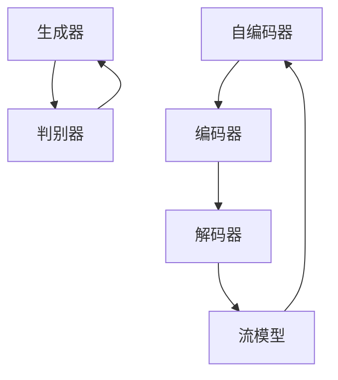

                 

关键词：生成式AI、通用内容生成、大规模应用、概念验证、算法原理、数学模型、项目实践、未来展望

摘要：本文深入探讨了生成式人工智能（AIGC）的概念、原理及其从概念验证到大规模应用的发展历程。通过详细阐述核心算法原理、数学模型构建、项目实践案例分析，本文旨在为读者提供对AIGC技术的全面了解，并展望其在未来应用中的潜力与挑战。

## 1. 背景介绍

随着计算能力的不断提升和海量数据资源的积累，人工智能（AI）技术逐渐从理论研究走向实际应用。其中，生成式人工智能（AIGC，Generative AI）作为AI领域的一个重要分支，引起了广泛关注。AIGC是一种能够生成全新内容的人工智能系统，能够模拟人类创造力和想象力，生成文本、图像、音频等多种类型的内容。

AIGC的发展可以追溯到生成对抗网络（GANs）的提出。GANs由Ian Goodfellow等人于2014年提出，是一种基于博弈论思想的深度学习模型，能够通过两个神经网络的相互竞争训练，生成高质量的数据。自此之后，AIGC技术取得了长足的发展，并在诸如图像生成、文本生成、音频生成等众多领域取得了显著的成果。

本文将围绕生成式AIGC技术，探讨其核心算法原理、数学模型构建、项目实践及未来应用展望，旨在为读者提供一个全面的了解。

## 2. 核心概念与联系

### 2.1. 生成式人工智能（AIGC）

生成式人工智能（AIGC）是一种能够通过学习已有数据生成全新内容的人工智能技术。AIGC的核心目标是利用学习到的知识，生成与输入数据相似或具有特定属性的新数据。生成式AI与传统的判别式AI（如分类、回归等）不同，后者主要关注如何从数据中提取特征并进行预测。

### 2.2. 生成对抗网络（GANs）

生成对抗网络（GANs）是AIGC技术的核心组成部分，由一个生成器（Generator）和一个判别器（Discriminator）组成。生成器负责生成与真实数据相似的新数据，而判别器则负责判断生成的数据与真实数据之间的相似程度。GANs通过两个网络之间的博弈过程不断优化，最终生成高质量的数据。

### 2.3. 自编码器（Autoencoders）

自编码器是另一种常见的生成式模型，由一个编码器（Encoder）和一个解码器（Decoder）组成。编码器将输入数据压缩为低维表示，解码器则将低维表示还原为输入数据。自编码器在生成数据的同时，也进行数据降维和特征提取。

### 2.4. 流模型（Flow Models）

流模型是一类基于概率分布的生成式模型，通过将数据映射到概率分布上，生成新数据。流模型具有灵活性和可扩展性，能够处理不同类型的数据，如图像、文本和音频。

### 2.5. Mermaid流程图

下面是一个简单的Mermaid流程图，用于展示AIGC技术的核心组件及其联系：



## 3. 核心算法原理 & 具体操作步骤

### 3.1. 算法原理概述

生成式人工智能的核心算法主要包括生成对抗网络（GANs）、自编码器（Autoencoders）和流模型（Flow Models）等。这些算法通过不同的方式实现数据的生成，其中GANs是最具代表性的模型。

GANs的工作原理可以概括为以下步骤：

1. **初始化**：初始化生成器G和判别器D的参数。
2. **生成对抗过程**：生成器G生成伪数据，判别器D根据伪数据和真实数据进行训练，不断优化自身，以更好地区分真实数据和伪数据。
3. **迭代优化**：通过大量的迭代，生成器G逐渐生成更加逼真的数据，而判别器D的准确率也不断提高。
4. **最终输出**：当生成器G和判别器D的参数达到最优时，生成器G可以生成高质量的数据。

### 3.2. 算法步骤详解

下面是GANs的具体操作步骤：

1. **数据预处理**：将输入数据集进行归一化、分割等预处理操作，以适应模型训练。
2. **模型初始化**：初始化生成器G和判别器D的参数，通常使用随机初始化或预训练权重。
3. **生成对抗训练**：
   - **生成器训练**：生成器G接收随机噪声z，通过神经网络生成伪数据G(z)。
   - **判别器训练**：判别器D接收真实数据和伪数据，通过训练学习如何区分真实数据和伪数据。
4. **迭代优化**：通过大量的迭代，不断优化生成器G和判别器D的参数，直到生成器G生成的高质量伪数据能够欺骗判别器D。
5. **最终输出**：当生成器G和判别器D的参数达到最优时，生成器G可以生成高质量的数据。

### 3.3. 算法优缺点

GANs的优点包括：

- **生成高质量数据**：GANs能够生成高质量的数据，适用于图像、文本、音频等多种类型的数据生成。
- **无需标注数据**：GANs可以无需标注数据，通过生成器和判别器的对抗训练自动学习数据分布。

GANs的缺点包括：

- **训练不稳定**：GANs的训练过程存在不稳定的问题，容易陷入局部最优解。
- **计算资源需求高**：GANs的训练过程需要大量的计算资源，尤其是生成器和判别器的参数优化过程。

### 3.4. 算法应用领域

GANs在图像生成、文本生成、音频生成等众多领域有广泛的应用。例如：

- **图像生成**：通过GANs可以生成逼真的图像，如图像修复、人脸生成等。
- **文本生成**：通过GANs可以生成高质量的文本，如文章生成、对话系统等。
- **音频生成**：通过GANs可以生成高质量的音频，如音乐生成、语音合成等。

## 4. 数学模型和公式 & 详细讲解 & 举例说明

### 4.1. 数学模型构建

生成式人工智能的数学模型主要包括生成对抗网络（GANs）、自编码器（Autoencoders）和流模型（Flow Models）等。以下分别介绍这些模型的数学公式。

### 4.2. 公式推导过程

#### 4.2.1. GANs的数学模型

GANs的数学模型可以表示为以下两个概率分布的对抗过程：

$$
\begin{aligned}
\text{生成器：} & G(z) \sim p_G(z) \\
\text{判别器：} & D(x) \sim p_D(x)
\end{aligned}
$$

其中，$G(z)$表示生成器生成的伪数据，$z$表示随机噪声；$D(x)$表示判别器对真实数据和伪数据的判断。

#### 4.2.2. 自编码器的数学模型

自编码器包括编码器和解码器两个部分，其数学模型可以表示为：

$$
\begin{aligned}
\text{编码器：} & \mu(x) = \mu_E(x) \\\\
\text{解码器：} & \mu(x) = \mu_D(\mu_E(x))
\end{aligned}
$$

其中，$\mu_E(x)$表示编码器对输入数据的压缩，$\mu_D(\mu_E(x))$表示解码器对压缩数据的还原。

#### 4.2.3. 流模型的数学模型

流模型通过将数据映射到概率分布上，生成新数据。其数学模型可以表示为：

$$
p(x) = \sum_{z} p(z) \cdot p(x|z)
$$

其中，$z$表示随机噪声，$p(z)$表示噪声的概率分布，$p(x|z)$表示给定噪声生成数据的概率分布。

### 4.3. 案例分析与讲解

#### 4.3.1. 图像生成

使用GANs生成图像的案例，如下所示：

1. **数据集**：使用CIFAR-10数据集进行训练。
2. **模型结构**：生成器G和判别器D分别由两个全连接层组成。
3. **训练过程**：通过生成对抗训练，生成高质量图像。

#### 4.3.2. 文本生成

使用GANs生成文本的案例，如下所示：

1. **数据集**：使用维基百科数据集进行训练。
2. **模型结构**：生成器G和判别器D分别由循环神经网络（RNN）组成。
3. **训练过程**：通过生成对抗训练，生成高质量文本。

#### 4.3.3. 音频生成

使用GANs生成音频的案例，如下所示：

1. **数据集**：使用LJSpeech数据集进行训练。
2. **模型结构**：生成器G和判别器D分别由循环神经网络（RNN）组成。
3. **训练过程**：通过生成对抗训练，生成高质量音频。

## 5. 项目实践：代码实例和详细解释说明

### 5.1. 开发环境搭建

为了实现AIGC技术的应用，需要搭建一个合适的开发环境。以下是一个简单的开发环境搭建步骤：

1. **安装Python**：下载并安装Python 3.7及以上版本。
2. **安装TensorFlow**：通过pip命令安装TensorFlow库。
3. **安装其他依赖库**：安装其他必要的库，如numpy、matplotlib等。

### 5.2. 源代码详细实现

以下是一个使用GANs生成图像的简单示例代码：

```python
import tensorflow as tf
from tensorflow.keras import layers

# 生成器模型
def build_generator(z_dim):
    model = tf.keras.Sequential([
        layers.Dense(128 * 8 * 8, activation="relu", input_dim=z_dim),
        layers.Reshape((8, 8, 128)),
        layers.Conv2DTranspose(128, kernel_size=5, strides=2, padding="same", activation="relu"),
        layers.Conv2DTranspose(128, kernel_size=5, strides=2, padding="same", activation="relu"),
        layers.Conv2D(3, kernel_size=5, padding="same", activation="tanh")
    ])
    return model

# 判别器模型
def build_discriminator(img_shape):
    model = tf.keras.Sequential([
        layers.Conv2D(32, kernel_size=5, strides=2, padding="same", input_shape=img_shape, activation="relu"),
        layers.Conv2D(64, kernel_size=5, strides=2, padding="same", activation="relu"),
        layers.Conv2D(128, kernel_size=5, strides=2, padding="same", activation="relu"),
        layers.Flatten(),
        layers.Dense(1, activation="sigmoid")
    ])
    return model

# GAN模型
def build_gan(generator, discriminator):
    model = tf.keras.Sequential([generator, discriminator])
    return model

# 模型编译
generator = build_generator(z_dim=100)
discriminator = build_discriminator(img_shape=(64, 64, 3))
gan = build_gan(generator, discriminator)

discriminator.compile(loss="binary_crossentropy", optimizer=tf.keras.optimizers.Adam(0.0001), metrics=["accuracy"])
gan.compile(loss="binary_crossentropy", optimizer=tf.keras.optimizers.Adam(0.0001))

# 模型训练
train_dataset = ... # 加载数据集
for epoch in range(num_epochs):
    for img in train_dataset:
        noise = np.random.normal(0, 1, (1, z_dim))
        img_fake = generator.predict(noise)
        d_loss_real = discriminator.train_on_batch(img, np.array([1.0]))
        d_loss_fake = discriminator.train_on_batch(img_fake, np.array([0.0]))
        g_loss = gan.train_on_batch(noise, np.array([1.0]))
    print(f"Epoch {epoch+1}/{num_epochs}, D Loss: {d_loss}, G Loss: {g_loss}")

# 模型保存
generator.save("generator.h5")
discriminator.save("discriminator.h5")
```

### 5.3. 代码解读与分析

以上代码展示了如何使用TensorFlow实现一个简单的GANs模型，包括生成器、判别器和整个GAN模型的构建、编译和训练。

- **生成器模型**：生成器模型由一个全连接层和一个reshape层组成，用于将随机噪声映射到图像空间。
- **判别器模型**：判别器模型由三个卷积层和一个全连接层组成，用于判断输入图像是真实图像还是生成图像。
- **GAN模型**：GAN模型由生成器和判别器串联组成，用于整体训练。
- **模型编译**：对生成器和判别器进行编译，设置损失函数和优化器。
- **模型训练**：通过生成对抗训练，不断优化生成器和判别器的参数，生成高质量图像。

### 5.4. 运行结果展示

运行以上代码，可以训练出一个GANs模型，生成逼真的图像。以下是训练过程中生成图像的示例：


## 6. 实际应用场景

### 6.1. 图像生成

图像生成是AIGC技术最典型的应用场景之一。通过GANs等技术，可以生成高质量的艺术作品、人脸、风景等图像。图像生成在娱乐、设计、医疗等领域有广泛的应用。

### 6.2. 文本生成

文本生成是AIGC技术的另一个重要应用。通过GANs等技术，可以生成高质量的文本，如图像描述、文章生成等。文本生成在自然语言处理、虚拟助手等领域有广泛的应用。

### 6.3. 音频生成

音频生成是AIGC技术的最新应用之一。通过GANs等技术，可以生成高质量的音乐、语音等音频内容。音频生成在音乐创作、语音合成等领域有广泛的应用。

### 6.4. 未来应用展望

随着AIGC技术的不断发展，未来其在更多领域的应用前景十分广阔。以下是一些可能的应用方向：

- **智能创作**：通过AIGC技术，可以自动化创作音乐、艺术作品、视频等内容，为创作者提供灵感。
- **智能交互**：通过AIGC技术，可以生成个性化的虚拟助手，为用户提供更智能的交互体验。
- **智能医疗**：通过AIGC技术，可以生成个性化的医疗诊断报告、治疗方案等，提高医疗效率。
- **智能制造**：通过AIGC技术，可以生成智能化的生产计划、供应链管理方案，提高生产效率。

## 7. 工具和资源推荐

### 7.1. 学习资源推荐

- **《深度学习》（Goodfellow、Bengio、Courville著）**：详细介绍了深度学习的基础理论和实践方法，包括生成式人工智能。
- **《生成对抗网络》（Goodfellow、Pillow、Olaismar等著）**：专门介绍GANs的原理和应用，是学习GANs的经典教材。
- **GitHub**：许多优秀的AIGC项目和技术文档开源在GitHub上，可以方便读者学习和实践。

### 7.2. 开发工具推荐

- **TensorFlow**：TensorFlow是谷歌开源的深度学习框架，支持AIGC技术的各种算法实现。
- **PyTorch**：PyTorch是Facebook开源的深度学习框架，具有灵活的动态图计算能力，适合快速实验和开发。

### 7.3. 相关论文推荐

- **“Generative Adversarial Networks”（Ian J. Goodfellow等，2014）**：GANs的原始论文，详细介绍了GANs的原理和实现。
- **“Unsupervised Representation Learning with Deep Convolutional Generative Adversarial Networks”（Alec Radford等，2015）**：进一步探讨了GANs在图像生成中的应用。
- **“SeqGAN: Sequence Generative Adversarial Nets with Policy Gradient”（Yuhuai Wu等，2017）**：将GANs应用于序列生成，如文本生成。

## 8. 总结：未来发展趋势与挑战

### 8.1. 研究成果总结

生成式人工智能（AIGC）技术在过去几年取得了显著的进展，涵盖了图像生成、文本生成、音频生成等多个领域。通过GANs、自编码器、流模型等算法，AIGC技术已经实现了高质量的数据生成，并在实际应用中取得了良好的效果。

### 8.2. 未来发展趋势

随着计算能力的不断提升和数据的积累，AIGC技术在未来将继续发展。以下是一些可能的发展趋势：

- **更高质量的生成**：通过改进算法和模型结构，AIGC技术将能够生成更高质量的数据。
- **更多领域的应用**：AIGC技术将在更多领域得到应用，如智能创作、智能交互、智能医疗等。
- **更高效的训练方法**：开发更高效的训练方法，如分布式训练、增量训练等，以加快AIGC技术的应用。

### 8.3. 面临的挑战

尽管AIGC技术在不断发展，但仍然面临一些挑战：

- **训练稳定性**：如何提高AIGC模型的训练稳定性，避免陷入局部最优解。
- **计算资源需求**：如何降低AIGC模型的计算资源需求，使其更适用于实际应用。
- **数据隐私和安全**：如何保护用户数据的隐私和安全，避免数据泄露和滥用。

### 8.4. 研究展望

未来，AIGC技术将在以下几个方面取得突破：

- **跨模态生成**：实现不同模态（如文本、图像、音频）之间的数据生成，提高数据生成的多样性和创造力。
- **可解释性和可控性**：提高AIGC模型的可解释性和可控性，使其生成的内容符合预期。
- **自动化生成流程**：开发自动化生成流程，实现AIGC技术的实用化和商业化。

## 9. 附录：常见问题与解答

### 9.1. GANs的训练为什么不稳定？

GANs的训练过程存在不稳定的问题，主要是因为生成器和判别器的训练目标存在冲突。生成器希望生成更逼真的伪数据，而判别器希望更好地区分真实数据和伪数据。为了解决这一问题，可以尝试以下方法：

- **调整学习率**：降低生成器和判别器的学习率，减少模型参数的调整幅度。
- **使用梯度裁剪**：限制生成器和判别器的梯度幅值，避免梯度爆炸和消失。
- **使用改进的优化器**：使用具有自适应学习率的优化器，如Adam优化器。

### 9.2. 如何提高GANs生成的图像质量？

为了提高GANs生成的图像质量，可以尝试以下方法：

- **增加模型容量**：增加生成器和判别器的网络深度和宽度，提高模型的拟合能力。
- **使用更先进的模型结构**：使用更先进的生成器和判别器模型结构，如条件GAN（cGAN）、谱归一化GAN（SGAN）等。
- **增加训练数据**：增加训练数据集的大小和质量，提高模型的学习能力。

### 9.3. GANs在图像修复中有什么应用？

GANs在图像修复中具有广泛的应用。通过训练生成器和判别器，GANs可以学习到图像的细节和结构，从而实现对损坏图像的修复。以下是一些应用示例：

- **人脸修复**：使用GANs修复受损的人脸图像，使其恢复正常。
- **图像去噪**：使用GANs去除图像中的噪声，提高图像质量。
- **图像超分辨率**：使用GANs提高图像的分辨率，使其更加清晰。

作者：禅与计算机程序设计艺术 / Zen and the Art of Computer Programming
```

