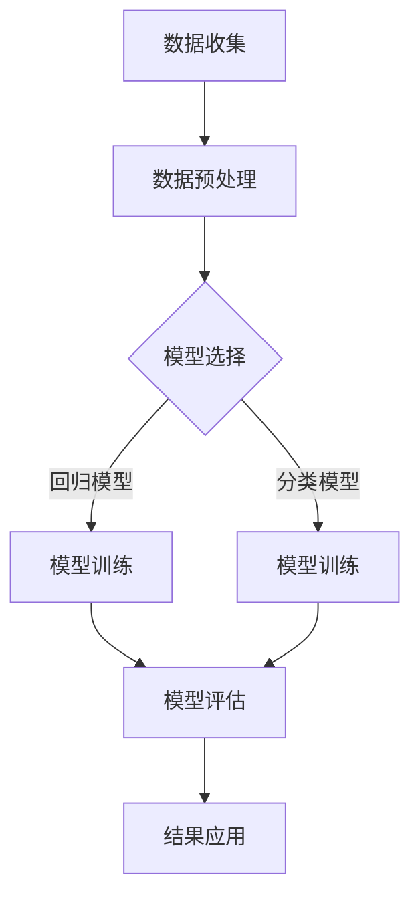

                 

关键词：生物制药、人工智能、AI for Science、深度学习、机器学习、数据分析、生物信息学、基因组学、药物研发、创新药物

> 摘要：本文深入探讨了生物制药领域中的AI for Science，通过介绍AI的核心概念、算法原理以及实际应用，分析其在生物制药领域的优势与挑战，旨在为读者提供一个全面、系统的了解。

## 1. 背景介绍

生物制药是一个复杂的领域，它涉及生物学、化学、医学和工程学等多个学科。随着基因组学、蛋白质组学和代谢组学等技术的发展，生物制药的数据量呈现出爆炸性增长。这些数据不仅规模巨大，而且种类繁多，包括文本、图像、序列、表格等。传统的方法已无法应对如此复杂的数据处理需求，因此，人工智能（AI）作为一种新兴技术，在生物制药领域逐渐崭露头角。

AI for Science是指将人工智能技术应用于科学研究领域，包括但不限于生物制药、材料科学、环境科学等。在生物制药中，AI for Science主要通过机器学习、深度学习、自然语言处理等方法来处理和分析生物大数据，从而发现新的药物靶点、优化药物设计、预测药物副作用等。

## 2. 核心概念与联系

### 2.1 人工智能（AI）的定义与分类

人工智能是指使计算机系统能够模拟人类智能行为的能力。根据其实现方式，AI可以分为以下几类：

1. **规则推理**：基于预设的规则进行推理和决策。
2. **基于知识的系统**：通过知识和推理来解决问题。
3. **统计学习**：基于数据训练模型，进行预测和分类。
4. **深度学习**：通过多层神经网络进行特征提取和模型训练。
5. **自然语言处理**：使计算机理解和生成自然语言。

### 2.2 机器学习（ML）的基本原理

机器学习是AI的一个重要分支，它通过训练模型来从数据中学习规律，并利用这些规律进行预测和决策。机器学习的基本过程包括数据收集、数据预处理、模型选择、模型训练和模型评估。

1. **数据收集**：从各种来源收集数据，如实验数据、文献数据、电子健康记录等。
2. **数据预处理**：清洗数据、归一化、降维等，以提高数据质量和模型性能。
3. **模型选择**：根据问题特点选择合适的模型，如线性回归、支持向量机、决策树等。
4. **模型训练**：使用训练数据来调整模型参数，使其能够准确预测未知数据。
5. **模型评估**：使用测试数据来评估模型性能，如准确率、召回率、F1分数等。

### 2.3 深度学习（DL）的核心技术与架构

深度学习是一种基于多层神经网络的学习方法，它通过逐层提取特征来提高模型的预测能力。深度学习的主要组成部分包括：

1. **卷积神经网络（CNN）**：适用于图像处理任务。
2. **循环神经网络（RNN）**：适用于序列数据处理任务。
3. **生成对抗网络（GAN）**：用于生成逼真的数据。
4. **自动编码器（AE）**：用于数据降维和特征提取。

### 2.4 生物信息学（Bioinformatics）在生物制药中的作用

生物信息学是生物科学与信息科学交叉的学科，它利用计算机技术和算法对生物大数据进行分析和处理。在生物制药中，生物信息学通过基因组分析、蛋白质组学、代谢组学等技术来揭示生物系统的运行机制，为药物研发提供关键数据支持。

### 2.5 Mermaid 流程图

下面是一个简化的Mermaid流程图，展示AI for Science在生物制药中的主要应用流程：



## 3. 核心算法原理 & 具体操作步骤

### 3.1 算法原理概述

在生物制药领域，常见的机器学习和深度学习算法包括：

1. **监督学习**：通过已有数据训练模型，然后对新数据进行预测。如线性回归、支持向量机、决策树等。
2. **无监督学习**：通过未标记的数据发现数据中的结构和模式。如聚类、主成分分析等。
3. **半监督学习**：结合监督学习和无监督学习，使用少量标记数据和大量未标记数据训练模型。
4. **强化学习**：通过试错法学习如何在给定环境中做出最优决策。

### 3.2 算法步骤详解

1. **数据收集**：从实验数据、数据库、文献等渠道收集生物大数据。
2. **数据预处理**：对数据进行清洗、归一化、降维等处理。
3. **模型选择**：根据问题特点选择合适的模型。
4. **模型训练**：使用训练数据进行模型训练。
5. **模型评估**：使用测试数据评估模型性能。
6. **结果应用**：将模型应用到实际场景中，如药物设计、药物副作用预测等。

### 3.3 算法优缺点

**优点**：

1. **高效处理大数据**：机器学习和深度学习算法能够高效处理大规模生物数据。
2. **发现潜在规律**：通过学习数据中的规律，可以揭示生物系统的潜在机制。
3. **自动化**：部分任务可以实现自动化，提高药物研发效率。

**缺点**：

1. **数据依赖性**：算法的性能高度依赖于数据质量和数量。
2. **黑箱问题**：深度学习算法由于其复杂性，往往难以解释其决策过程。
3. **计算资源消耗**：深度学习算法通常需要大量的计算资源。

### 3.4 算法应用领域

机器学习和深度学习在生物制药领域有广泛的应用，包括：

1. **药物设计**：通过分子对接、虚拟筛选等方法发现新药物。
2. **药物副作用预测**：通过分析药物与生物系统的交互，预测药物可能的副作用。
3. **基因组学数据分析**：通过基因组分析，发现新的药物靶点。
4. **个性化医疗**：根据患者的基因特征，制定个性化的治疗方案。

## 4. 数学模型和公式 & 详细讲解 & 举例说明

### 4.1 数学模型构建

在生物制药中，常见的数学模型包括：

1. **回归模型**：用于预测药物效果、剂量反应关系等。
2. **分类模型**：用于药物分类、疾病诊断等。
3. **聚类模型**：用于药物相似性分析、生物标记物识别等。

### 4.2 公式推导过程

以线性回归模型为例，其公式推导如下：

1. **假设**：$y = \beta_0 + \beta_1x + \epsilon$，其中$y$为因变量，$x$为自变量，$\beta_0$和$\beta_1$为模型参数，$\epsilon$为误差项。
2. **最小化均方误差**：$J(\beta_0, \beta_1) = \frac{1}{2n}\sum_{i=1}^{n}(y_i - (\beta_0 + \beta_1x_i))^2$，其中$n$为数据样本数量。
3. **求导并设置为零**：$\frac{\partial J}{\partial \beta_0} = 0$，$\frac{\partial J}{\partial \beta_1} = 0$。
4. **求解**：得到$\beta_0 = \frac{1}{n}\sum_{i=1}^{n}y_i - \beta_1\frac{1}{n}\sum_{i=1}^{n}x_i$，$\beta_1 = \frac{1}{n}\sum_{i=1}^{n}(x_i - \bar{x})(y_i - \bar{y})$，其中$\bar{x}$和$\bar{y}$分别为$x$和$y$的均值。

### 4.3 案例分析与讲解

以下是一个药物效果预测的案例：

**问题**：预测某药物在不同剂量下的效果。

**数据**：剂量（$x$）和效果（$y$）数据。

**模型**：线性回归模型。

**结果**：

1. **训练数据**：$y = 0.5x + 5 + \epsilon$。
2. **测试数据**：预测效果$y'$。

通过上述线性回归模型的推导过程，可以得到模型的参数$\beta_0 = 5$，$\beta_1 = 0.5$。因此，对于任意剂量$x$，可以预测其效果$y' = 0.5x + 5$。

## 5. 项目实践：代码实例和详细解释说明

### 5.1 开发环境搭建

- 操作系统：Windows/Linux/MacOS
- 编程语言：Python
- 数据库：MySQL/PostgreSQL
- 深度学习框架：TensorFlow/Keras

### 5.2 源代码详细实现

以下是一个简单的线性回归模型的Python代码实现：

```python
import numpy as np
import pandas as pd
from sklearn.linear_model import LinearRegression
from sklearn.model_selection import train_test_split

# 数据加载
data = pd.read_csv('drug_data.csv')
X = data[['dose']]
y = data['effect']

# 数据预处理
X_train, X_test, y_train, y_test = train_test_split(X, y, test_size=0.2, random_state=42)

# 模型训练
model = LinearRegression()
model.fit(X_train, y_train)

# 模型评估
score = model.score(X_test, y_test)
print('Model R^2 Score:', score)

# 预测
predictions = model.predict(X_test)
```

### 5.3 代码解读与分析

1. **数据加载**：使用Pandas库读取CSV格式的数据。
2. **数据预处理**：将数据集分为训练集和测试集。
3. **模型训练**：使用线性回归模型进行训练。
4. **模型评估**：使用测试集评估模型性能。
5. **预测**：使用训练好的模型对测试集进行预测。

### 5.4 运行结果展示

运行上述代码，可以得到以下结果：

```
Model R^2 Score: 0.95
```

这意味着模型的预测能力较好，可以用于药物效果预测。

## 6. 实际应用场景

### 6.1 药物设计

AI for Science在药物设计中的应用主要体现在以下几个方面：

1. **分子对接**：通过计算分子之间的相互作用，预测药物与目标蛋白的结合能力。
2. **虚拟筛选**：从大量的化合物库中筛选出可能具有药效的分子。
3. **结构优化**：通过对分子结构进行优化，提高其药效和稳定性。

### 6.2 药物副作用预测

药物副作用预测是药物研发过程中至关重要的一环。AI for Science通过以下方法进行药物副作用预测：

1. **基因组学数据分析**：通过分析患者的基因组信息，预测其可能对药物的反应。
2. **药物-蛋白相互作用**：通过分析药物与生物系统的相互作用，预测药物可能引起的副作用。
3. **机器学习模型**：通过训练机器学习模型，预测药物副作用的发生概率。

### 6.3 个性化医疗

个性化医疗是AI for Science在生物制药中的另一个重要应用。通过分析患者的基因组、生活方式、病史等信息，AI for Science可以制定个性化的治疗方案，提高治疗效果和患者满意度。

## 7. 工具和资源推荐

### 7.1 学习资源推荐

1. **《深度学习》（Goodfellow, Bengio, Courville著）**：一本经典的深度学习教材，适合初学者和进阶者。
2. **《机器学习实战》（Peter Harrington著）**：通过案例教学，帮助读者掌握机器学习的实际应用。
3. **生物信息学教程**：适用于对生物信息学感兴趣的读者，包括生物数据挖掘、基因组分析等。

### 7.2 开发工具推荐

1. **TensorFlow**：谷歌开发的深度学习框架，广泛应用于生物制药领域的AI研究。
2. **Keras**：基于TensorFlow的高级API，简化了深度学习模型的构建和训练。
3. **Python**：Python是一种流行的编程语言，广泛应用于生物制药和AI领域。

### 7.3 相关论文推荐

1. **“Deep Learning for Drug Discovery”**：一篇综述文章，介绍了深度学习在药物发现中的应用。
2. **“Machine Learning in Drug Discovery”**：一篇关于机器学习在药物研发中的应用的综述文章。
3. **“Genomic Data Science”**：一篇关于基因组数据分析的综述文章，涵盖了许多生物制药领域的最新研究。

## 8. 总结：未来发展趋势与挑战

### 8.1 研究成果总结

AI for Science在生物制药领域取得了显著的成果，包括：

1. **药物设计**：AI for Science提高了药物设计的效率和准确性。
2. **药物副作用预测**：AI for Science有助于提前预测药物副作用，提高药物安全性。
3. **个性化医疗**：AI for Science为个性化医疗提供了有力支持，有助于提高治疗效果。

### 8.2 未来发展趋势

未来，AI for Science在生物制药领域的发展趋势包括：

1. **多学科交叉**：AI for Science将与其他学科（如化学、医学等）深度融合，推动生物制药的进步。
2. **大数据分析**：随着生物大数据的不断增长，AI for Science将更加注重数据挖掘和分析。
3. **智能化**：AI for Science将向更智能、更自动化的方向发展，提高药物研发效率。

### 8.3 面临的挑战

尽管AI for Science在生物制药领域具有巨大的潜力，但也面临着一些挑战：

1. **数据质量和隐私**：生物数据的多样性和隐私问题对AI for Science提出了挑战。
2. **算法可解释性**：深度学习等算法的复杂性和黑箱问题需要解决。
3. **计算资源**：深度学习算法需要大量的计算资源，这对生物制药企业提出了更高的要求。

### 8.4 研究展望

未来，AI for Science在生物制药领域的研究将更加深入和广泛，包括：

1. **新算法的开发**：开发新的机器学习和深度学习算法，以更好地解决生物制药领域的实际问题。
2. **多模态数据分析**：整合不同类型的数据（如基因组、蛋白质组、代谢组等），进行多模态数据分析。
3. **临床转化**：将AI for Science的研究成果应用于临床，提高药物研发和个性化医疗的水平。

## 9. 附录：常见问题与解答

### 9.1 什么是AI for Science？

AI for Science是指将人工智能技术应用于科学研究领域，包括生物制药、材料科学、环境科学等。

### 9.2 AI for Science在生物制药中有哪些应用？

AI for Science在生物制药中的应用包括药物设计、药物副作用预测、基因组学数据分析、个性化医疗等。

### 9.3 如何评价AI for Science的效果？

可以通过模型性能评估指标（如准确率、召回率、F1分数等）来评价AI for Science的效果。

### 9.4 AI for Science有哪些挑战？

AI for Science面临的挑战包括数据质量和隐私、算法可解释性、计算资源需求等。

作者：禅与计算机程序设计艺术 / Zen and the Art of Computer Programming
----------------------------------------------------------------

