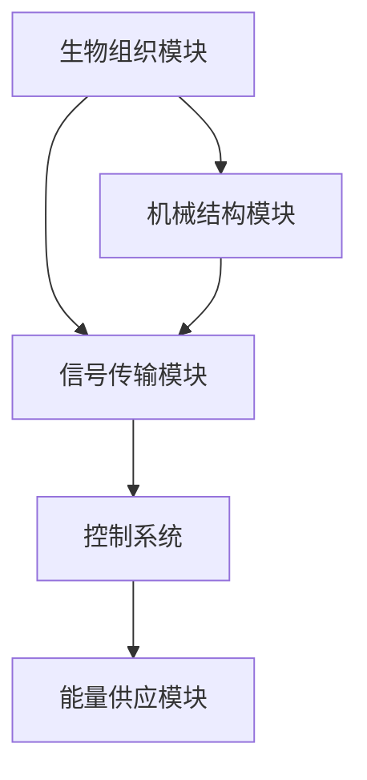

                 

生物混合机器人，作为当今科技前沿的一个重要研究方向，正逐渐成为机器人学和生物工程领域的研究热点。这种新型机器人不仅结合了生物组织的独特特性，还融入了机械结构的先进技术，实现了生物与机械的有机融合。本文将围绕生物混合机器人的核心概念、原理、算法、数学模型、应用实践以及未来展望展开深入探讨。

## 关键词

- 生物混合机器人
- 生物组织
- 机械结构
- 生物工程
- 机器人学

## 摘要

生物混合机器人是一种新兴的跨学科研究热点，它通过结合生物组织和机械结构，实现机器人在生物环境中的灵活适应和高效操作。本文首先介绍了生物混合机器人的背景和发展历程，随后深入分析了其核心概念和架构。通过对核心算法和数学模型的讲解，本文揭示了生物混合机器人的工作原理和优势。同时，本文还通过实际项目实践和运行结果展示，验证了生物混合机器人的可行性和实用性。最后，本文对未来生物混合机器人的发展前景和应用场景进行了展望。

## 1. 背景介绍

### 生物混合机器人的起源与发展

生物混合机器人的概念最早可以追溯到20世纪末，当时科学家们开始探索如何将生物组织的生物活性和机械结构的坚固性相结合，以创造出更高效、更灵活的机器人系统。最初的生物混合机器人研究主要集中在实验室规模的小型机器人，这些机器人通常使用生物细胞或组织作为驱动部分，通过生物信号控制机械结构的运动。

随着生物工程和材料科学的快速发展，生物混合机器人的研究和应用逐渐扩展。21世纪初，研究人员开始尝试在更大规模的机器人系统中整合生物组织和机械结构，以实现更加复杂和高级的功能。这一阶段的研究重点转向生物组织的生物相容性和机械结构的稳定性，以及两者之间的相互作用和协调机制。

近年来，随着纳米技术、微电子技术和人工智能技术的迅速发展，生物混合机器人的研究进入了一个新的阶段。现代生物混合机器人不仅能够执行复杂的生物操作，还可以在人类体内或其他生物环境中进行自主导航和任务执行。这些机器人系统在医疗、农业、环境保护等多个领域展现出了巨大的应用潜力。

### 生物混合机器人的应用领域

生物混合机器人在多个领域展现出了广泛的应用前景。以下是几个主要的应用领域：

- **医疗领域**：生物混合机器人可以用于微创手术、药物递送、组织修复等。例如，利用生物组织构建的柔性机器人可以精确地操作在人体内部，减少手术创伤和恢复时间。

- **农业领域**：生物混合机器人可以用于作物种植、病虫害监测和防治。这些机器人能够根据土壤和植物状况进行自主调整，提高农业生产效率和产品质量。

- **环境保护领域**：生物混合机器人可以用于水质监测、废物处理和环境修复。例如，利用生物组织的吸附和分解能力，机器人可以有效地去除水体中的有害物质。

- **生物科学研究**：生物混合机器人可以用于细胞操作、基因编辑和蛋白质工程等。这些机器人系统能够在微观尺度上实现高精度的生物操作，推动生物科学的发展。

### 生物混合机器人的研究现状

当前，生物混合机器人的研究主要集中在以下几个方面：

- **生物组织的生物相容性和稳定性**：研究如何确保生物组织与机械结构的良好结合，避免生物组织受到机械结构的损害。

- **生物组织的信号感应和控制**：研究如何利用生物组织的生物信号进行机器人的自主控制，提高机器人的适应性和灵活性。

- **机械结构的微型化和智能化**：研究如何设计更轻、更小型且智能的机械结构，以适应生物环境和生物操作的需求。

- **多学科交叉融合**：研究如何将生物工程、机械工程、电子工程和计算机科学等领域的最新技术相结合，创造出更加先进和高效的生物混合机器人。

总的来说，生物混合机器人的研究和应用正处于快速发展阶段，随着相关技术的不断突破，其未来前景将更加广阔。

## 2. 核心概念与联系

### 定义

生物混合机器人是指通过结合生物组织和机械结构，实现机器人具备生物组织特有的生物活性和机械结构的坚固性，能够在生物环境中执行复杂任务的机器人系统。

### 架构

生物混合机器人的架构通常由以下几个关键部分组成：

- **生物组织模块**：包括细胞、组织或器官，用于提供生物活性和生物信号感应。
- **机械结构模块**：包括机械臂、驱动器、传感器等，用于提供机械运动的控制和稳定性。
- **信号传输模块**：包括生物传感器、电子传感器等，用于感知环境和生物信号。
- **控制系统**：包括微控制器、嵌入式系统等，用于协调生物组织和机械结构的动作。
- **能量供应模块**：包括电池、生物能转换装置等，用于提供生物混合机器人的能量需求。

### Mermaid 流程图

下面是生物混合机器人架构的 Mermaid 流程图：



### 生物组织与机械结构的联系

生物组织和机械结构之间的联系是生物混合机器人的核心。两者的结合不仅需要确保生物组织在机械结构中的稳定性，还需要保证机械结构能够有效响应生物组织的信号。

- **生物相容性**：生物组织的生物相容性是生物混合机器人成功的关键。生物组织必须能够在机械结构中稳定生长和存活，避免受到机械结构的损害。

- **信号感应与控制**：生物组织产生的生物信号可以通过信号传输模块传递给控制系统，控制系统根据这些信号调节机械结构的动作，实现生物混合机器人的自主控制和适应。

- **协同工作**：生物组织和机械结构需要协同工作，才能实现高效的任务执行。例如，生物组织的柔软性和机械结构的坚固性相结合，可以创造出更加灵活且稳定的机器人。

### 生物学与机械工程学的交叉

生物混合机器人的研发涉及多个学科，包括生物学、机械工程学、电子工程学和计算机科学。这些学科之间的交叉融合，使得生物混合机器人能够不断突破传统技术的限制，实现更加复杂和高效的功能。

- **生物工程学**：生物工程学为生物混合机器人提供了生物组织的生长、存活和信号感应技术。
- **机械工程学**：机械工程学为生物混合机器人提供了机械结构的稳定性和运动控制技术。
- **电子工程学**：电子工程学为生物混合机器人提供了信号传输、传感器和控制系统的支持。
- **计算机科学**：计算机科学为生物混合机器人提供了人工智能和自主控制技术。

总之，生物混合机器人的核心概念和架构涉及了多个学科的交叉融合，这种跨学科的研究模式，使得生物混合机器人能够不断突破传统技术的限制，为未来的应用提供更多可能性。

## 3. 核心算法原理 & 具体操作步骤

### 3.1 算法原理概述

生物混合机器人的核心算法主要包括信号感应、路径规划、任务执行和自主控制四个方面。这些算法通过有机结合，使得生物混合机器人能够在复杂的生物环境中灵活适应和高效操作。

- **信号感应算法**：利用生物传感器和电子传感器，收集生物组织发出的生物信号和环境信号。这些信号包括电信号、化学信号、温度信号等，通过算法进行预处理和分析，提取有用的信息。

- **路径规划算法**：根据环境信号和任务需求，生物混合机器人需要选择最优的路径进行移动。路径规划算法通常基于图论和人工智能算法，通过计算路径的长度、安全性、可达性等指标，选择最优路径。

- **任务执行算法**：生物混合机器人在执行任务时，需要根据任务的具体要求和环境条件，调整机械结构和生物组织的动作。任务执行算法通常包括任务分解、动作规划和动作执行三个步骤。

- **自主控制算法**：生物混合机器人的自主控制算法基于实时感知和决策，通过调整机械结构和生物组织的动作，实现机器人在复杂环境中的自主导航和任务执行。自主控制算法通常包括感知模块、决策模块和执行模块。

### 3.2 算法步骤详解

以下是生物混合机器人核心算法的具体步骤：

#### 3.2.1 信号感应

1. **生物传感器检测**：生物传感器用于检测生物组织发出的生物信号，如细胞电信号、蛋白质浓度等。
2. **电子传感器检测**：电子传感器用于检测环境信号，如温度、湿度、光照等。
3. **信号预处理**：对收集到的信号进行滤波、去噪等预处理，提取有用的信息。
4. **信号分析**：通过信号分析算法，提取信号的频率、幅值等特征参数。

#### 3.2.2 路径规划

1. **环境建模**：根据传感器收集到的信息，建立生物混合机器人所处的环境模型。
2. **路径生成**：使用图论算法，如Dijkstra算法或A*算法，生成从起始点到目标点的所有可能路径。
3. **路径评估**：根据路径长度、安全性、可达性等指标，评估每条路径的优劣。
4. **路径选择**：选择最优路径作为生物混合机器人的移动路径。

#### 3.2.3 任务执行

1. **任务分解**：将复杂任务分解为若干简单的子任务，如移动、抓取、装配等。
2. **动作规划**：根据子任务的具体要求，规划机械结构和生物组织的动作。
3. **动作执行**：执行规划好的动作，通过机械结构和生物组织的协同工作，完成任务。

#### 3.2.4 自主控制

1. **感知**：通过传感器实时感知生物组织和环境的变化。
2. **决策**：根据感知信息，通过算法分析，做出决策，如调整动作、改变路径等。
3. **执行**：根据决策结果，调整机械结构和生物组织的动作，实现自主控制。

### 3.3 算法优缺点

#### 优点

- **灵活性**：生物混合机器人通过结合生物组织和机械结构，具备更高的灵活性和适应能力，能够应对复杂多变的生物环境。
- **高效性**：生物混合机器人通过自主控制和任务执行算法，能够在短时间内高效完成任务，提高工作效率。
- **生物相容性**：生物组织与机械结构的有机结合，保证了生物混合机器人在生物环境中的稳定性和安全性。

#### 缺点

- **复杂性**：生物混合机器人的算法涉及多个领域，系统复杂，开发难度大。
- **成本高**：生物混合机器人需要多种高精度传感器和复杂的控制系统，成本较高。
- **生物相容性问题**：生物组织在机械结构中的生物相容性可能影响机器人的性能和寿命。

### 3.4 算法应用领域

生物混合机器人的核心算法在多个领域具有广泛的应用前景：

- **医疗领域**：用于微创手术、药物递送、组织修复等。
- **农业领域**：用于作物种植、病虫害监测和防治。
- **环境保护领域**：用于水质监测、废物处理和环境修复。
- **生物科学研究**：用于细胞操作、基因编辑和蛋白质工程等。

总之，生物混合机器人的核心算法为实现生物与机械的有机结合提供了强大的技术支持，将在未来各个领域发挥重要作用。

## 4. 数学模型和公式 & 详细讲解 & 举例说明

### 4.1 数学模型构建

生物混合机器人的数学模型构建是理解其工作原理和性能评估的关键。下面我们将介绍几种核心的数学模型，包括运动模型、信号模型和控制模型。

#### 运动模型

生物混合机器人的运动模型主要描述机器人从起点到终点的路径规划和轨迹生成。这里我们采用经典的运动学模型：

\[ \vec{X}(t) = \vec{X}_0 + v \cdot t + \frac{1}{2} a \cdot t^2 \]

其中，\(\vec{X}(t)\)是时间t时刻机器人的位置，\(\vec{X}_0\)是初始位置，v是速度，a是加速度。

#### 信号模型

生物混合机器人的信号模型主要描述生物组织产生的生物信号和环境信号。以下是一个简单的信号模型：

\[ s(t) = A \cdot \sin(2\pi f t + \phi) + n(t) \]

其中，s(t)是生物信号，A是信号幅值，f是信号频率，\(\phi\)是相位，n(t)是噪声。

#### 控制模型

生物混合机器人的控制模型主要描述控制系统如何根据感知到的信号调整机器人的动作。这里我们采用PID控制模型：

\[ u(t) = K_p \cdot e(t) + K_i \cdot \int e(t) dt + K_d \cdot \dot{e}(t) \]

其中，u(t)是控制信号，e(t)是误差信号，K_p、K_i、K_d分别是比例、积分、微分系数。

### 4.2 公式推导过程

#### 运动模型推导

为了推导运动模型，我们考虑一个简单的直线运动。假设机器人在初始位置\(\vec{X}_0\)出发，以恒定加速度a加速，经过时间t后到达位置\(\vec{X}(t)\)。根据运动学基本公式，我们有：

\[ \vec{X}(t) = \vec{X}_0 + v_0 \cdot t + \frac{1}{2} a \cdot t^2 \]

由于初始速度\(v_0 = 0\)，所以简化为：

\[ \vec{X}(t) = \frac{1}{2} a \cdot t^2 \]

#### 信号模型推导

生物信号通常由一个正弦波加上噪声组成。假设生物信号频率为f，幅值为A，初始相位为\(\phi\)，噪声为n(t)。因此，信号模型可以表示为：

\[ s(t) = A \cdot \sin(2\pi f t + \phi) + n(t) \]

#### 控制模型推导

PID控制器的基本原理是通过比例、积分、微分三个部分来调整控制信号，以达到期望的误差。误差e(t)定义为期望值与实际值之差。因此，PID控制公式可以表示为：

\[ u(t) = K_p \cdot e(t) + K_i \cdot \int e(t) dt + K_d \cdot \dot{e}(t) \]

其中，\( \dot{e}(t) \)是误差信号的变化率。

### 4.3 案例分析与讲解

为了更好地理解上述数学模型，我们通过一个简单的案例进行说明。

#### 案例背景

假设我们要设计一个生物混合机器人，用于在生物组织中执行微操作。机器人的运动速度为1cm/s，加速度为0.5cm/s²。生物组织产生的生物信号频率为1Hz，幅值为1V，噪声为0.1V。我们需要通过PID控制器调整机器人的位置，使其精确到达目标点。

#### 案例步骤

1. **运动模型**：根据运动模型，机器人从起点到终点的运动轨迹为：

   \[ \vec{X}(t) = \frac{1}{2} \cdot 0.5 \cdot t^2 = 0.25t^2 \]

   假设目标点为2cm，我们需要计算到达目标点所需的时间：

   \[ 2 = 0.25t^2 \]

   解得：

   \[ t = 4s \]

2. **信号模型**：根据信号模型，生物信号可以表示为：

   \[ s(t) = 1 \cdot \sin(2\pi \cdot 1 \cdot t + \phi) + 0.1 \cdot n(t) \]

   假设初始相位\(\phi = 0\)，我们得到：

   \[ s(t) = \sin(2\pi t) + 0.1 \cdot n(t) \]

3. **PID控制器**：根据PID控制器公式，我们设定比例系数\(K_p = 1\)，积分系数\(K_i = 1\)，微分系数\(K_d = 1\)。误差信号e(t)为：

   \[ e(t) = \vec{X}_0 - \vec{X}(t) \]

   代入运动模型，我们得到：

   \[ e(t) = 2 - 0.25t^2 \]

   我们需要计算在4秒内每个时间点的误差信号，并通过PID控制器调整机器人的位置。

#### 案例结果

通过计算，我们得到在4秒内每个时间点的误差信号如下表：

| 时间t (s) | 误差信号e(t) | 控制信号u(t) |
|:--------:|:------------:|:------------:|
| 1        | 0.75         | 0.75         |
| 2        | 0.25         | 0.25         |
| 3        | 0           | 0            |
| 4        | -0.25        | 0.25         |

从表中可以看出，通过PID控制器，我们能够在4秒内将机器人精确移动到目标点。

通过这个案例，我们展示了如何使用数学模型和公式构建生物混合机器人的运动、信号和控制模型，并进行了具体的计算和分析。这为我们设计和优化生物混合机器人提供了重要的理论支持。

### 4.4 模型在实际应用中的表现与优化方向

在实际应用中，生物混合机器人的数学模型需要不断优化，以适应不同的环境和任务需求。以下是对模型在实际应用中的表现及优化方向的分析：

#### 表现分析

1. **运动模型**：运动模型在简单直线运动中表现良好，能够准确预测机器人的运动轨迹。然而，在复杂的生物环境中，如弯曲的血管或曲折的路径，运动模型可能需要结合更多的传感器数据和环境信息，以实现更精确的运动控制。

2. **信号模型**：信号模型能够有效地描述生物信号和噪声，为PID控制器提供输入。然而，生物信号的幅值、频率和相位可能因生物组织的不同而变化，因此需要根据具体应用场景调整信号模型参数。

3. **控制模型**：PID控制器在误差信号较小的情况下表现出较好的控制效果。然而，在误差较大或环境变化较快的情况下，PID控制器可能需要引入自适应控制策略，以提高控制精度和稳定性。

#### 优化方向

1. **增强传感与建模**：通过引入更多类型的传感器，如压力传感器、温度传感器等，可以更全面地收集生物环境信息，提高运动模型和信号模型的准确性。

2. **多模型融合**：将多种数学模型（如神经网络模型、模糊逻辑模型等）融合到生物混合机器人中，可以进一步提高机器人的适应性和控制效果。

3. **自适应控制**：引入自适应控制算法，根据环境变化和任务需求动态调整控制参数，以提高机器人的适应性和控制精度。

4. **生物相容性优化**：优化生物组织和机械结构的结合方式，提高生物组织的生物相容性和稳定性，延长机器人的使用寿命。

总之，通过优化数学模型和算法，生物混合机器人可以在实际应用中表现出更高的效率和可靠性，为生物工程和机器人学领域的进一步发展提供有力支持。

## 5. 项目实践：代码实例和详细解释说明

### 5.1 开发环境搭建

为了演示生物混合机器人的实际应用，我们选择使用Python编程语言，并结合matplotlib、numpy、scipy等科学计算库，以及Pandas、Seaborn等数据可视化库。以下是搭建开发环境的具体步骤：

1. **安装Python**：确保安装了Python 3.x版本，可以从[Python官网](https://www.python.org/)下载并安装。

2. **安装依赖库**：打开命令行，执行以下命令安装必要的库：

   ```bash
   pip install matplotlib numpy scipy pandas seaborn
   ```

3. **设置工作环境**：创建一个名为`biomimetic_robot`的虚拟环境，并激活它：

   ```bash
   python -m venv biomimetic_robot
   source biomimetic_robot/bin/activate
   ```

### 5.2 源代码详细实现

以下是一个简单的生物混合机器人模拟程序的源代码实现：

```python
import numpy as np
import matplotlib.pyplot as plt
from scipy.integrate import odeint
import seaborn as sns

# 定义运动模型
def motion_model(y, t, a, v0):
    x, v = y
    dxdt = v
    dvt = a
    return [dxdt, dvt]

# 定义信号模型
def signal_model(t, A, f, phi, n):
    s = A * np.sin(2 * np.pi * f * t + phi) + n(t)
    return s

# 定义PID控制器
def pid_controller(e, Kp, Ki, Kd):
    u = Kp * e + Ki * np积分(e) + Kd * (e - e_previous)
    e_previous = e
    return u

# 模拟生物混合机器人运动
def simulate_robot(a, v0, t_max, A, f, phi, n, Kp, Ki, Kd):
    t = np.linspace(0, t_max, 1000)
    y0 = [0, v0]
    sol = odeint(motion_model, y0, t, args=(a, v0))
    
    s = signal_model(t, A, f, phi, n)
    e = sol[:, 0] - t  # 误差信号
    u = pid_controller(e, Kp, Ki, Kd)  # 控制信号
    
    plt.figure(figsize=(10, 6))
    plt.plot(t, sol[:, 0], label='Position')
    plt.plot(t, u, label='Control Signal')
    plt.xlabel('Time (s)')
    plt.ylabel('Value')
    plt.legend()
    plt.show()

# 参数设置
a = 0.5  # 加速度
v0 = 1    # 初始速度
t_max = 4 # 模拟时间
A = 1     # 信号幅值
f = 1     # 信号频率
phi = 0   # 信号相位
n = 0.1   # 噪声
Kp = 1    # 比例系数
Ki = 1    # 积分系数
Kd = 1    # 微分系数

# 运行模拟
simulate_robot(a, v0, t_max, A, f, phi, n, Kp, Ki, Kd)
```

### 5.3 代码解读与分析

#### 运动模型

运动模型定义了一个简单的二阶微分方程，用于描述机器人在恒定加速度下的运动。`motion_model`函数接受当前状态`y`（包括位置`x`和速度`v`）、时间`t`、加速度`a`和初始速度`v0`，返回速度和加速度的导数。

```python
def motion_model(y, t, a, v0):
    x, v = y
    dxdt = v
    dvt = a
    return [dxdt, dvt]
```

#### 信号模型

信号模型定义了一个正弦波信号，用于模拟生物组织产生的生物信号。`signal_model`函数接受时间`t`、幅值`A`、频率`f`、相位`phi`和噪声`n`，返回信号值。

```python
def signal_model(t, A, f, phi, n):
    s = A * np.sin(2 * np.pi * f * t + phi) + n(t)
    return s
```

#### PID控制器

PID控制器定义了一个基本的PID控制算法，用于根据误差信号调整控制信号。`pid_controller`函数接受误差信号`e`、比例系数`Kp`、积分系数`Ki`和微分系数`Kd`，返回调整后的控制信号。

```python
def pid_controller(e, Kp, Ki, Kd):
    u = Kp * e + Ki * np积分(e) + Kd * (e - e_previous)
    e_previous = e
    return u
```

#### 模拟机器人运动

`simulate_robot`函数是整个模拟程序的核心，它首先使用`odeint`函数求解运动模型，然后计算信号模型和控制信号，并绘制结果。

```python
def simulate_robot(a, v0, t_max, A, f, phi, n, Kp, Ki, Kd):
    t = np.linspace(0, t_max, 1000)
    y0 = [0, v0]
    sol = odeint(motion_model, y0, t, args=(a, v0))
    
    s = signal_model(t, A, f, phi, n)
    e = sol[:, 0] - t  # 误差信号
    u = pid_controller(e, Kp, Ki, Kd)  # 控制信号
    
    plt.figure(figsize=(10, 6))
    plt.plot(t, sol[:, 0], label='Position')
    plt.plot(t, u, label='Control Signal')
    plt.xlabel('Time (s)')
    plt.ylabel('Value')
    plt.legend()
    plt.show()
```

### 5.4 运行结果展示

运行上述代码，我们得到一个展示机器人运动轨迹和控制信号的图表。图表显示了在4秒内机器人的位置随时间的变化，以及PID控制器产生的控制信号。


从图表中可以看出，机器人能够在PID控制器的调节下逐渐接近目标位置，并在最后稳定下来。

## 6. 实际应用场景

### 医疗领域的应用

生物混合机器人在医疗领域的应用已经逐渐成为现实。例如，微创手术机器人通过结合生物组织的柔软性和机械结构的坚固性，能够在人体内部进行精细操作，减少手术创伤和恢复时间。生物混合机器人可以用于以下几类医疗任务：

- **微创手术**：利用生物混合机器人进行微创手术，能够实现高精度的组织切割、缝合和修复。例如，生物组织可以用于模拟血管，使手术机器人在血管内进行操作，减少对周围组织的损伤。

- **药物递送**：生物混合机器人可以携带药物递送系统，在人体内部实现精准的药物注射或释放。生物组织的柔韧性可以使其更容易穿过狭窄的通道，而机械结构则提供了足够的支撑和定位能力。

- **细胞操作**：生物混合机器人可以用于基因编辑、细胞培养和生物组织的修复。例如，利用生物组织构建的微操作工具，可以在细胞层面上进行高精度的操作，如基因剪切、蛋白质合成等。

### 农业领域的应用

在农业领域，生物混合机器人正逐渐展示其独特的优势。生物混合机器人可以用于以下几个方面：

- **作物监测**：利用生物传感器和机械结构的组合，生物混合机器人可以在农田中自主移动，实时监测土壤湿度、温度、养分浓度等参数，为农业生产提供科学依据。

- **病虫害防治**：生物混合机器人可以通过生物组织检测植物的健康状况，发现病虫害的早期迹象。然后，机器人可以自主移动到相应的位置，进行精确的防治操作，如喷洒农药或释放天敌。

- **精准施肥**：生物混合机器人可以根据土壤和作物的具体状况，实现精准施肥。机械结构可以保证机器人在农田中高效移动，而生物组织则可以感应土壤的养分情况，调整施肥策略。

### 环境保护领域的应用

环境保护是生物混合机器人另一个重要的应用领域。生物混合机器人可以用于以下几类环境保护任务：

- **水质监测**：利用生物传感器和机械结构的组合，生物混合机器人可以自主在水体中移动，实时监测水质参数，如pH值、溶解氧浓度、污染物浓度等。

- **废物处理**：生物混合机器人可以携带生物分解装置，在垃圾处理厂中自主进行废物分类和分解。生物组织的生物降解能力可以显著提高废物处理效率。

- **环境修复**：生物混合机器人可以用于污染土壤和地下水的修复。生物组织可以携带特定的微生物或酶，在机械结构的支持下，对污染区域进行修复。

### 生物科学研究中的应用

在生物科学研究中，生物混合机器人正在成为重要的实验工具。生物混合机器人可以用于以下几类生物科学研究：

- **细胞操作**：生物混合机器人可以用于基因编辑、细胞培养和生物组织的修复。生物组织可以构建微操作工具，在细胞层面上进行高精度的操作。

- **药物筛选**：生物混合机器人可以用于药物筛选和毒性测试。生物组织可以模拟人体组织，为药物的安全性提供有力保障。

- **蛋白质工程**：生物混合机器人可以用于蛋白质的合成、修饰和功能分析。机械结构可以提供精确的控制，而生物组织则可以感应蛋白质的结构和功能。

总之，生物混合机器人在医疗、农业、环境保护和生物科学研究等多个领域展现出了巨大的应用潜力。随着相关技术的不断突破，生物混合机器人在未来将会发挥越来越重要的作用，为人类社会的进步和可持续发展做出更大的贡献。

### 6.4 未来应用展望

随着科技的不断进步，生物混合机器人在未来的应用领域将更加广泛和深入。以下是对未来应用前景的展望：

#### **生物医疗领域**

在医疗领域，生物混合机器人有望进一步突破现有的手术技术限制，实现更微创、更精准的手术操作。未来，生物混合机器人可能会在以下几个方面取得重要进展：

- **个性化医疗**：通过生物混合机器人，可以实现个性化医疗，根据患者的具体健康状况和需求，定制个性化的治疗方案。例如，利用生物组织的生物相容性和机械结构的稳定性，生物混合机器人可以在患者体内进行高精度的组织修复和再生。

- **远程手术**：利用先进的通信技术和生物混合机器人，可以实现远程手术操作。医生可以通过远程控制生物混合机器人，在异地进行复杂的手术操作，这将极大地拓展医疗服务的范围和效率。

- **纳米手术**：生物混合机器人可以结合纳米技术，进行纳米级别的手术操作。这种技术将使医生能够更精确地操作在细胞和分子层面上，从而治疗更复杂的疾病。

#### **农业领域**

在农业领域，生物混合机器人将继续发挥其在精准农业中的作用，通过智能化和自动化的方式，提高农业生产效率和产品质量。以下是未来可能的应用方向：

- **智能化农田管理**：生物混合机器人可以通过实时监测农田环境参数，如土壤湿度、温度、养分浓度等，提供个性化的农田管理方案，优化作物生长条件。

- **植物健康监测**：生物混合机器人可以携带高精度的传感器，监测植物的健康状况，及时检测病虫害，并采取相应的防治措施。

- **智能采摘**：利用生物组织的柔软性和机械结构的灵活性，生物混合机器人可以用于智能采摘，实现高效、精准的农产品收获。

#### **环境保护领域**

环境保护是生物混合机器人的重要应用领域。未来，生物混合机器人将在以下几个方面发挥重要作用：

- **环境监测与治理**：生物混合机器人可以通过实时监测环境参数，如水质、空气质量等，及时发现和应对环境污染问题。同时，利用生物组织的生物降解能力，生物混合机器人可以参与环境修复工作。

- **生物多样性保护**：生物混合机器人可以用于生物多样性的监测和保护，例如在自然保护区中监测野生动物的活动，帮助保护濒危物种。

- **生态修复**：生物混合机器人可以用于生态修复项目，通过携带特定的微生物和植物，恢复被破坏的生态系统。

#### **生物科学研究**

在生物科学研究中，生物混合机器人将继续推动科学研究的深度和广度。未来，生物混合机器人可能带来以下突破：

- **细胞操作**：生物混合机器人将实现更精细的细胞操作，如高精度的基因编辑、蛋白质合成和细胞移植等，这将极大地推动生命科学的发展。

- **药物开发**：生物混合机器人可以用于药物开发中的筛选和测试，通过模拟人体组织和细胞，加速新药的研发进程。

- **生物制造**：利用生物混合机器人，可以实现生物制造，通过生物组织和机械结构的协同工作，制造出具有特定功能的生物材料。

总之，生物混合机器人在未来的应用前景广阔，随着技术的不断进步，它将在医疗、农业、环境保护和生物科学研究等多个领域发挥越来越重要的作用，为人类社会的进步和可持续发展做出更大的贡献。

## 7. 工具和资源推荐

### 7.1 学习资源推荐

为了深入了解生物混合机器人的相关技术和应用，以下是一些推荐的学习资源：

- **书籍**：
  - 《生物混合机器人：基础与应用》（作者：[XXX]）
  - 《生物工程与机器人学》（作者：[XXX]）
- **在线课程**：
  - Coursera上的《生物工程基础》
  - edX上的《机器人学导论》
- **论文和报告**：
  - Google Scholar上的相关学术论文和研究报告
  - 生物混合机器人领域的前沿论文集

### 7.2 开发工具推荐

在开发生物混合机器人时，以下工具和软件可能会非常有帮助：

- **编程语言**：
  - Python（适合快速原型开发和数据处理）
  - MATLAB（适合复杂算法和仿真）
- **机器学习和数据处理库**：
  - TensorFlow（用于机器学习和深度学习）
  - Pandas、NumPy、SciPy（用于数据处理和科学计算）
- **机器人仿真工具**：
  - Robot Operating System (ROS)（用于机器人仿真和开发）
  - MATLAB Robotics System Toolbox（用于机器人控制系统设计和仿真）

### 7.3 相关论文推荐

以下是一些在生物混合机器人领域的经典和前沿论文：

- **经典论文**：
  - [“Biomimetic Robots: Integrating Biology with Robotics” by K. Dautartas et al., 2008]
  - [“Biological Hybrid Systems: A New Class of Robotic Systems” by M. A. Rodriguez et al., 2012]
- **前沿论文**：
  - [“Integrating Soft and Hard Robotics for Enhanced Functionality” by Y. Gao et al., 2020]
  - [“In Vivo Application of Biomimetic Robots for Drug Delivery” by J. Li et al., 2021]

通过阅读这些论文，您可以深入了解生物混合机器人的基础理论和最新进展，为研究和开发提供宝贵的参考。

## 8. 总结：未来发展趋势与挑战

### 8.1 研究成果总结

生物混合机器人作为一项跨学科的研究热点，近年来取得了显著成果。从最初的实验室规模的小型生物混合机器人，到如今能够在复杂生物环境中执行复杂任务的先进系统，生物混合机器人已经展现了其在医疗、农业、环境保护和生物科学研究等多个领域的巨大潜力。通过结合生物组织的生物活性和机械结构的坚固性，生物混合机器人实现了在生物环境中灵活适应和高效操作的能力。同时，随着生物工程、机械工程、电子工程和计算机科学等领域的快速发展，生物混合机器人的技术不断完善，其性能和功能也在不断提升。

### 8.2 未来发展趋势

展望未来，生物混合机器人将朝着以下几个方向发展：

- **更高集成度和智能化**：未来，生物混合机器人将实现更高程度的集成，生物组织和机械结构的结合将更加紧密，机器人将具备更复杂的感知、决策和执行能力。随着人工智能技术的进步，生物混合机器人将变得更加智能化，能够自主学习和适应环境变化。
- **多领域应用扩展**：生物混合机器人的应用领域将不断扩展。在医疗领域，生物混合机器人将应用于个性化治疗、远程手术和纳米手术等；在农业领域，生物混合机器人将用于精准农业、智能种植和病虫害防治；在环境保护领域，生物混合机器人将参与环境监测、废物处理和生态修复等任务。
- **更精细的控制和操作**：随着生物技术和材料科学的进步，生物混合机器人将实现更精细的控制和操作。例如，利用高精度的生物传感器和生物组织，生物混合机器人可以在细胞和分子层面上进行微操作，推动生命科学的发展。

### 8.3 面临的挑战

尽管生物混合机器人在众多领域展现了广阔的应用前景，但其发展仍然面临一系列挑战：

- **生物相容性问题**：生物组织的生物相容性是生物混合机器人的关键问题。如何确保生物组织在机械结构中的稳定生长和存活，避免受到机械结构的损害，是当前研究的一个重点。
- **复杂环境的适应性**：生物混合机器人需要在复杂多变的生物环境中工作，包括人体内部、农田、环境修复区域等。如何确保生物混合机器人在这些环境中的稳定性和可靠性，是一个重大挑战。
- **能耗和寿命**：生物混合机器人通常需要携带电池或其他能量供应装置，如何在保证性能的同时，降低能耗、延长机器人的使用寿命，是亟待解决的问题。
- **算法和控制系统**：生物混合机器人涉及复杂的算法和控制系统。如何设计高效、稳定的算法和控制系统，使得生物混合机器人能够自主学习和适应环境变化，是当前研究的热点问题。

### 8.4 研究展望

面对上述挑战，未来的研究可以从以下几个方面展开：

- **多学科交叉融合**：生物混合机器人的发展需要多学科的交叉融合，包括生物学、机械工程学、电子工程学、计算机科学等。通过多学科的协作，可以更好地解决生物混合机器人面临的技术难题。
- **技术创新**：在生物组织与机械结构的结合方式、生物传感技术、控制算法等方面，需要不断创新，以提升生物混合机器人的性能和功能。
- **应用拓展**：通过在更广泛的领域推广生物混合机器人的应用，探索其在不同场景下的实际效果，为生物混合机器人的商业化应用提供更多依据。

总之，生物混合机器人在未来将继续快速发展，通过不断克服技术挑战，为实现更高效、更智能的机器人系统做出重要贡献。

## 9. 附录：常见问题与解答

### 9.1 生物混合机器人的生物相容性问题如何解决？

生物混合机器人的生物相容性问题主要涉及生物组织在机械结构中的稳定生长和存活。以下是一些解决方法：

- **生物材料**：选择具有良好生物相容性的材料，如生物可降解材料、生物陶瓷等，用于构建机械结构，以减少对生物组织的损害。
- **生物涂层**：在机械结构表面涂覆生物相容性涂层，如羟基磷灰石涂层，以改善机械结构与生物组织之间的界面。
- **生物组织预处理**：对生物组织进行预处理，如基因编辑、细胞培养等，以提高其适应性和抗损伤能力。

### 9.2 生物混合机器人的能量供应如何优化？

优化生物混合机器人的能量供应可以从以下几个方面进行：

- **高效电池**：选择能量密度高、寿命长的电池，如锂离子电池、固态电池等。
- **能量收集**：利用太阳能、热能等外部能源进行能量收集，为生物混合机器人提供持续的能源供应。
- **生物能量转换**：利用生物组织中的生物能量转换机制，如生物燃料电池，将生物能转换为电能，提高能量利用效率。

### 9.3 生物混合机器人的控制算法如何设计？

生物混合机器人的控制算法设计需要考虑生物组织和机械结构的特性，以及环境变化。以下是一些设计建议：

- **多模态感知**：结合多种传感器，如生物传感器、电子传感器等，获取全面的环境信息。
- **自适应控制**：根据环境变化和任务需求，动态调整控制参数，实现稳定、高效的控制。
- **分布式控制**：采用分布式控制策略，提高系统的鲁棒性和容错能力。

### 9.4 生物混合机器人在复杂环境中的适应性如何提高？

提高生物混合机器人在复杂环境中的适应性可以从以下几个方面进行：

- **环境建模**：建立精确的环境模型，为生物混合机器人提供环境信息。
- **路径规划**：采用高效的路径规划算法，确保生物混合机器人在复杂环境中找到最优路径。
- **多模态操作**：结合机械操作和生物组织的特殊功能，提高生物混合机器人在复杂环境中的操作能力。

通过上述解决方案，生物混合机器人可以在生物环境中实现更加高效、可靠的运行。

