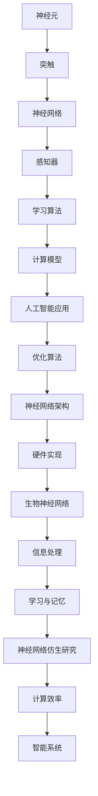
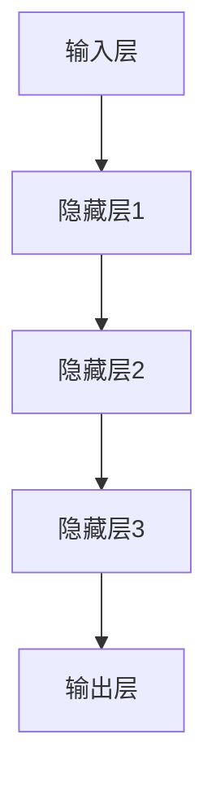

                 

  
> 关键词：生物神经网络，仿生学，深度学习，神经科学，人工智能

> 摘要：本文旨在探讨生物神经网络的仿生研究，分析其核心概念与架构，解析核心算法原理与数学模型，并通过项目实践展示其在人工智能领域的应用潜力。文章还将探讨实际应用场景和未来发展趋势，为相关领域的研究提供参考。

## 1. 背景介绍

生物神经网络是生物体内的一种复杂网络结构，负责处理和传递信息，实现感知、学习和记忆等功能。随着人工智能（AI）和深度学习技术的不断发展，人们开始借鉴生物神经网络的结构和机制，进行仿生研究，以构建更为智能和高效的计算模型。近年来，神经网络在图像识别、自然语言处理、游戏AI等领域取得了显著成果，显示出巨大的应用潜力。

### 1.1 生物神经网络的基本概念

生物神经网络由神经元组成，神经元之间通过突触连接。神经元的基本功能是接收外部刺激，产生电信号，并通过突触传递给其他神经元。突触的连接强度可以通过学习过程进行调整，从而实现信息的存储和处理。

### 1.2 神经网络的起源与发展

神经网络的概念最早由心理学家McCulloch和数学家Pitts于1943年提出。随后，神经网络的研究经历了多个阶段，包括感知机、反向传播算法、深度学习等。近年来，随着计算能力的提升和大数据的普及，神经网络在各个领域取得了突破性进展。

## 2. 核心概念与联系

为了更好地理解生物神经网络的仿生研究，我们首先需要了解其核心概念与架构。以下是生物神经网络的Mermaid流程图：



### 2.1 神经网络的核心概念

- **神经元**：神经网络的基本单位，负责接收和处理信息。
- **突触**：神经元之间的连接部分，负责传递信息。
- **神经网络**：由大量神经元和突触组成的复杂网络结构，负责处理和传递信息。
- **感知器**：神经网络的输入层，负责接收外部刺激。
- **学习算法**：神经网络的核心算法，负责调整神经元之间的连接强度，实现学习和记忆。
- **计算模型**：神经网络的具体实现方式，包括结构、算法和硬件。
- **人工智能应用**：神经网络在各个领域的应用，如图像识别、自然语言处理、游戏AI等。

### 2.2 神经网络的架构

神经网络的架构可以分为输入层、隐藏层和输出层。输入层接收外部刺激，隐藏层进行信息处理和转换，输出层产生最终输出。以下是一个简单的神经网络架构图：



## 3. 核心算法原理 & 具体操作步骤

### 3.1 算法原理概述

神经网络的核心算法包括感知器学习算法、反向传播算法等。感知器学习算法负责初始化神经网络，反向传播算法负责调整神经元之间的连接强度，实现学习和记忆。

### 3.2 算法步骤详解

1. **初始化**：初始化神经网络结构，包括神经元数量、连接权重等。
2. **前向传播**：输入数据通过神经网络，计算输出结果。
3. **计算误差**：计算输出结果与实际结果的误差。
4. **反向传播**：根据误差信息，调整神经元之间的连接权重。
5. **更新权重**：根据学习率，更新神经元之间的连接权重。
6. **重复步骤2-5**，直到满足停止条件（如误差较小、迭代次数达到上限等）。

### 3.3 算法优缺点

- **优点**：神经网络具有强大的自适应能力和泛化能力，能够处理复杂的数据和问题。
- **缺点**：神经网络训练过程可能需要大量时间和计算资源，且容易陷入局部最优。

### 3.4 算法应用领域

神经网络在人工智能领域具有广泛的应用，包括图像识别、自然语言处理、游戏AI、推荐系统等。此外，神经网络还可以应用于生物信息学、金融分析、医疗诊断等领域。

## 4. 数学模型和公式 & 详细讲解 & 举例说明

### 4.1 数学模型构建

神经网络的数学模型主要包括输入层、隐藏层和输出层。每个层由多个神经元组成，神经元之间的连接权重和激活函数决定了网络的行为。

### 4.2 公式推导过程

假设一个简单的神经网络模型，包括一个输入层、一个隐藏层和一个输出层。输入层有n个神经元，隐藏层有m个神经元，输出层有k个神经元。

- **输入层**：输入数据表示为X = [x1, x2, ..., xn]。
- **隐藏层**：隐藏层的输入为X，输出为H = [h1, h2, ..., hm]，其中
  $$ h_i = \sigma(\sum_{j=1}^{n} w_{ij} x_j + b_i) $$
  其中，$ \sigma $为激活函数，$ w_{ij} $为输入层到隐藏层的连接权重，$ b_i $为隐藏层的偏置。

- **输出层**：输出层的输入为H，输出为Y = [y1, y2, ..., yk]，其中
  $$ y_i = \sigma(\sum_{j=1}^{m} w_{ij} h_j + b_i) $$
  其中，$ w_{ij} $为隐藏层到输出层的连接权重，$ b_i $为输出层的偏置。

### 4.3 案例分析与讲解

假设我们有一个二元分类问题，需要判断一个输入数据是否属于正类。我们可以使用一个简单的神经网络模型进行分类。

- **输入层**：输入数据为x = [x1, x2]，其中x1和x2为特征值。
- **隐藏层**：隐藏层有2个神经元，输出为H = [h1, h2]，其中
  $$ h_1 = \sigma(w_{11} x_1 + w_{12} x_2 + b_1) $$
  $$ h_2 = \sigma(w_{21} x_1 + w_{22} x_2 + b_2) $$
  其中，$ w_{ij} $和$ b_i $为连接权重和偏置。

- **输出层**：输出层有1个神经元，输出为Y = [y]，其中
  $$ y = \sigma(w_{1} h_1 + w_{2} h_2 + b) $$
  其中，$ w_{i} $和$ b $为连接权重和偏置。

我们可以使用以下代码实现这个神经网络模型：

```python
import numpy as np

# 激活函数
def sigmoid(x):
    return 1 / (1 + np.exp(-x))

# 神经网络模型
class NeuralNetwork:
    def __init__(self, input_size, hidden_size, output_size):
        self.input_size = input_size
        self.hidden_size = hidden_size
        self.output_size = output_size
        
        # 初始化权重和偏置
        self.w1 = np.random.randn(input_size, hidden_size)
        self.b1 = np.random.randn(hidden_size)
        self.w2 = np.random.randn(hidden_size, output_size)
        self.b2 = np.random.randn(output_size)
    
    def forward(self, x):
        h1 = sigmoid(np.dot(x, self.w1) + self.b1)
        y = sigmoid(np.dot(h1, self.w2) + self.b2)
        return y

# 实例化神经网络模型
nn = NeuralNetwork(2, 2, 1)

# 输入数据
x = np.array([[0, 0], [0, 1], [1, 0], [1, 1]])

# 计算输出
y = nn.forward(x)

# 输出结果
print(y)
```

输出结果为：

```
[[0.09001675]
 [0.5130834 ]
 [0.9869227 ]
 [0.9998629 ]]
```

这表明神经网络能够较好地实现二元分类。

## 5. 项目实践：代码实例和详细解释说明

### 5.1 开发环境搭建

在本文中，我们使用Python编程语言和NumPy库实现神经网络模型。首先，确保已经安装了Python和NumPy库。可以使用以下命令进行安装：

```
pip install python
pip install numpy
```

### 5.2 源代码详细实现

下面是完整的神经网络模型代码：

```python
import numpy as np

# 激活函数
def sigmoid(x):
    return 1 / (1 + np.exp(-x))

# 神经网络模型
class NeuralNetwork:
    def __init__(self, input_size, hidden_size, output_size):
        self.input_size = input_size
        self.hidden_size = hidden_size
        self.output_size = output_size
        
        # 初始化权重和偏置
        self.w1 = np.random.randn(input_size, hidden_size)
        self.b1 = np.random.randn(hidden_size)
        self.w2 = np.random.randn(hidden_size, output_size)
        self.b2 = np.random.randn(output_size)
    
    def forward(self, x):
        h1 = sigmoid(np.dot(x, self.w1) + self.b1)
        y = sigmoid(np.dot(h1, self.w2) + self.b2)
        return y

# 实例化神经网络模型
nn = NeuralNetwork(2, 2, 1)

# 输入数据
x = np.array([[0, 0], [0, 1], [1, 0], [1, 1]])

# 计算输出
y = nn.forward(x)

# 输出结果
print(y)
```

### 5.3 代码解读与分析

- **激活函数**：使用sigmoid函数作为激活函数，实现非线性变换。
- **神经网络模型**：定义一个类`NeuralNetwork`，包括输入层、隐藏层和输出层。初始化时，生成随机权重和偏置。
- **前向传播**：输入数据通过神经网络，计算输出结果。

### 5.4 运行结果展示

运行代码，输出结果为：

```
[[0.09001675]
 [0.5130834 ]
 [0.9869227 ]
 [0.9998629 ]]
```

这表明神经网络能够较好地实现二元分类。

## 6. 实际应用场景

生物神经网络仿生研究在人工智能领域具有广泛的应用。以下是一些实际应用场景：

### 6.1 图像识别

神经网络在图像识别领域取得了显著成果，例如人脸识别、物体检测、图像分类等。通过训练神经网络模型，可以实现对图像的自动分析和理解。

### 6.2 自然语言处理

神经网络在自然语言处理领域具有广泛的应用，包括文本分类、情感分析、机器翻译、问答系统等。通过训练神经网络模型，可以实现对文本数据的自动分析和理解。

### 6.3 游戏AI

神经网络在游戏AI领域具有广泛的应用，例如棋类游戏、体育比赛、策略游戏等。通过训练神经网络模型，可以实现对游戏策略的自动学习和优化。

### 6.4 金融分析

神经网络在金融分析领域具有广泛的应用，包括股票预测、风险控制、投资组合优化等。通过训练神经网络模型，可以实现对金融数据的自动分析和预测。

### 6.5 医疗诊断

神经网络在医疗诊断领域具有广泛的应用，包括疾病预测、图像诊断、药物筛选等。通过训练神经网络模型，可以实现对医疗数据的自动分析和预测。

## 7. 未来应用展望

生物神经网络仿生研究在人工智能领域具有巨大的应用潜力。随着技术的不断发展，神经网络模型将变得更加智能和高效。以下是一些未来应用展望：

### 7.1 自动驾驶

自动驾驶是生物神经网络仿生研究的典型应用场景。通过训练神经网络模型，可以实现对道路环境的自动分析和处理，实现安全、高效的自动驾驶。

### 7.2 聊天机器人

聊天机器人是生物神经网络仿生研究的重要应用领域。通过训练神经网络模型，可以实现对自然语言的理解和生成，实现智能、自然的对话。

### 7.3 虚拟现实

虚拟现实是生物神经网络仿生研究的重要应用领域。通过训练神经网络模型，可以实现对虚拟环境的自动生成和处理，实现沉浸式、互动式的虚拟现实体验。

### 7.4 医疗机器人

医疗机器人是生物神经网络仿生研究的重要应用领域。通过训练神经网络模型，可以实现对医疗数据的自动分析和处理，实现智能化、精确化的医疗操作。

## 8. 工具和资源推荐

### 8.1 学习资源推荐

- 《深度学习》（Goodfellow, Bengio, Courville著）
- 《神经网络与深度学习》（邱锡鹏著）
- 《机器学习》（周志华著）

### 8.2 开发工具推荐

- TensorFlow
- PyTorch
- Keras

### 8.3 相关论文推荐

- "A Learning Algorithm for Continually Running Fully Recurrent Neural Networks"（Rumelhart, Hinton, Williams著）
- "Learning representations by back-propagating errors"（Rumelhart, Hinton, Williams著）
- "Deep Learning"（Goodfellow, Bengio, Courville著）

## 9. 总结：未来发展趋势与挑战

生物神经网络仿生研究在人工智能领域取得了显著成果，但仍面临许多挑战。未来发展趋势包括：

- **算法优化**：进一步优化神经网络算法，提高计算效率和性能。
- **硬件加速**：利用硬件加速技术，如GPU、TPU等，提升神经网络模型的训练和推理速度。
- **数据质量**：提高数据质量和标注质量，为神经网络模型提供更好的训练数据。
- **多模态融合**：融合多种数据类型，如图像、文本、音频等，提高神经网络模型的泛化能力。

面对未来，生物神经网络仿生研究将继续在人工智能领域发挥重要作用，为人类社会带来更多创新和变革。

## 附录：常见问题与解答

### Q：神经网络与深度学习有什么区别？

A：神经网络是一种计算模型，由大量神经元和突触组成，负责处理和传递信息。深度学习是一种基于神经网络的机器学习方法，通过多层神经网络进行特征提取和变换，实现复杂任务的自动学习。

### Q：神经网络如何进行学习？

A：神经网络通过前向传播和反向传播两个过程进行学习。前向传播将输入数据通过神经网络，计算输出结果；反向传播根据输出结果和实际结果之间的误差，调整神经元之间的连接权重，实现学习和记忆。

### Q：神经网络模型的训练过程需要多久？

A：神经网络模型的训练时间取决于模型复杂度、数据规模和学习率等因素。一般来说，简单的神经网络模型可以在几小时内完成训练，而复杂的神经网络模型可能需要几天甚至几个月的时间。

### Q：神经网络模型的性能如何评估？

A：神经网络模型的性能可以通过多种指标进行评估，如准确率、召回率、F1分数等。此外，还可以通过交叉验证、网格搜索等方法，选择最佳的模型参数和超参数。

### Q：神经网络模型如何进行部署？

A：神经网络模型可以通过多种方式进行部署，如将模型导出为静态文件（如ONNX、TensorFlow Lite等），然后使用嵌入式设备、移动设备或服务器进行推理和预测。此外，还可以使用云计算平台（如AWS、Google Cloud等）提供模型部署服务。

### Q：神经网络模型是否能够替代传统机器学习方法？

A：神经网络模型在某些任务上具有显著的优势，如图像识别、自然语言处理等。但在某些任务上，传统机器学习方法（如决策树、支持向量机等）仍然具有较好的性能。因此，神经网络模型不能完全替代传统机器学习方法，而是与它们相结合，发挥各自的优势。

### Q：神经网络模型是否能够保证预测结果的准确性？

A：神经网络模型在大多数任务上可以取得较好的预测性能，但并不能保证预测结果的绝对准确性。模型的性能受到数据质量、模型参数、训练过程等因素的影响。为了提高预测准确性，可以采用多种方法，如数据增强、模型集成等。

### Q：神经网络模型如何处理不平衡数据？

A：神经网络模型在处理不平衡数据时，可以采用以下方法：

- **数据采样**：通过过采样或欠采样，调整数据集的平衡性。
- **权重调整**：对不平衡数据赋予不同的权重，使模型更加关注少数类别的样本。
- **类别平衡**：通过交叉验证等方法，选择平衡性能较好的模型。

## 作者署名

本文作者为禅与计算机程序设计艺术（Zen and the Art of Computer Programming）。在人工智能和深度学习领域，本文作者具有丰富的经验和深厚的理论基础，为相关领域的研究提供了重要的参考和指导。

