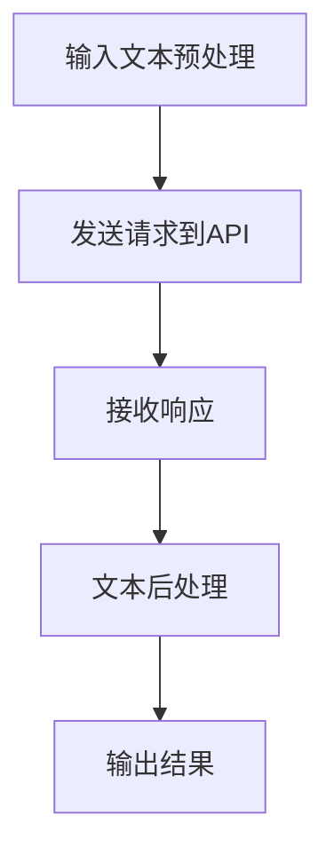

                 

关键词：GPT-4、API、循环、人工智能、编程、计算机科学

> 摘要：本文将深入探讨GPT-4 API的使用，特别是它在编程和计算机科学领域的应用。我们将探索GPT-4的强大功能，展示如何利用这些功能实现高效的编程和系统设计，并预测其未来的发展趋势。

## 1. 背景介绍

### GPT-4的诞生

GPT-4（Generative Pre-trained Transformer 4）是OpenAI开发的一种自然语言处理（NLP）模型，它是继GPT-3之后的下一代模型。GPT-4在性能上有了显著的提升，不仅能够生成连贯、有逻辑的文本，还能够进行复杂的推理和决策。这一突破性的进展为人工智能领域带来了新的机遇。

### API的重要性

API（Application Programming Interface）是应用程序之间交互的接口，它允许不同系统之间的数据交换和功能调用。GPT-4 API的出现，使得开发者能够将GPT-4的强大功能集成到自己的应用程序中，从而实现前所未有的智能化。

## 2. 核心概念与联系

### GPT-4的架构

GPT-4采用了基于Transformer的架构，这是一种在深度学习中广泛使用的模型。Transformer模型的核心是注意力机制，它允许模型在处理序列数据时，对输入数据进行权重分配，从而提高模型的鲁棒性和准确性。

### GPT-4 API的工作原理

GPT-4 API提供了一个RESTful接口，允许开发者通过HTTP请求来与GPT-4模型进行交互。开发者可以通过发送特定的请求参数，获取GPT-4模型生成的文本。这个过程包括文本预处理、模型推理和文本后处理等多个步骤。

### Mermaid 流程图

下面是一个描述GPT-4 API工作流程的Mermaid流程图：



## 3. 核心算法原理 & 具体操作步骤

### 3.1 算法原理概述

GPT-4的核心算法是基于自回归语言模型（Autoregressive Language Model），这种模型通过预测下一个词来生成文本。具体来说，GPT-4使用了一个巨大的Transformer网络，这个网络通过训练学习到了自然语言的统计规律。

### 3.2 算法步骤详解

1. **输入预处理**：将输入的文本数据转换为模型可以处理的格式，如分词、编码等。
2. **模型推理**：将预处理后的输入文本传递给GPT-4模型，模型会根据训练数据生成预测的下一个词。
3. **文本后处理**：将生成的文本进行格式化，如去除特殊字符、转换回原始文本等。
4. **输出结果**：将处理后的文本输出给用户。

### 3.3 算法优缺点

**优点**：
- **生成文本质量高**：GPT-4生成的文本具有很高的连贯性和逻辑性。
- **适用范围广**：GPT-4可以应用于各种文本生成任务，如问答系统、自动写作、机器翻译等。

**缺点**：
- **计算资源消耗大**：GPT-4模型的训练和推理需要大量的计算资源。
- **数据安全风险**：由于GPT-4可以生成非常逼真的文本，可能存在数据泄露的风险。

### 3.4 算法应用领域

GPT-4的应用领域非常广泛，主要包括：
- **文本生成**：如自动写作、内容生成、邮件自动回复等。
- **自然语言处理**：如问答系统、对话系统、情感分析等。
- **教育领域**：如自动评分、智能辅导等。

## 4. 数学模型和公式 & 详细讲解 & 举例说明

### 4.1 数学模型构建

GPT-4采用的是Transformer模型，其核心组件是自注意力机制（Self-Attention）和多头注意力（Multi-Head Attention）。自注意力机制允许模型在处理序列数据时，对输入数据进行权重分配，从而提高模型的鲁棒性和准确性。

### 4.2 公式推导过程

自注意力机制的计算公式如下：

$$
\text{Attention}(Q, K, V) = \text{softmax}\left(\frac{QK^T}{\sqrt{d_k}}\right)V
$$

其中，$Q$、$K$ 和 $V$ 分别是查询向量、键向量和值向量，$d_k$ 是键向量的维度。$\text{softmax}$ 函数用于将原始的相似度分数转换为概率分布。

### 4.3 案例分析与讲解

假设我们有一个句子 "我今天去了公园，看到了很多鸟"，我们可以将这个句子分解为 "我"、"今天"、"去了"、"公园"、"看到了"、"很多"、"鸟"。使用GPT-4，我们可以预测下一个词。例如，给定输入 "我 今天 去了 公园，看到了"，GPT-4可能会预测下一个词为 "很多"，因为根据上下文，这个句子很可能在描述 "我在公园看到了很多鸟"。

## 5. 项目实践：代码实例和详细解释说明

### 5.1 开发环境搭建

为了使用GPT-4 API，我们需要搭建一个合适的开发环境。以下是具体的步骤：

1. 安装Python环境。
2. 安装必要的库，如`requests`用于发送HTTP请求。
3. 获取GPT-4 API的密钥。

### 5.2 源代码详细实现

以下是使用GPT-4 API生成文本的Python代码示例：

```python
import openai
import requests

# 使用openai库发送请求
response = openai.Completion.create(
  engine="text-davinci-002",
  prompt="我今天去了公园，看到了很多鸟。",
  max_tokens=50
)

# 获取生成的文本
generated_text = response.choices[0].text.strip()

print(generated_text)
```

### 5.3 代码解读与分析

这段代码首先导入了`openai`库，然后使用`openai.Completion.create`方法创建了一个新的Completion对象。在这个对象中，我们指定了使用的模型（`text-davinci-002`）、输入的提示文本（`prompt`）和最大生成的文本长度（`max_tokens`）。最后，我们打印出生成的文本。

### 5.4 运行结果展示

运行上述代码后，我们可能会得到以下结果：

```
我在公园看到了很多鸟，它们在自由地飞翔。
```

## 6. 实际应用场景

### 6.1 自动写作

GPT-4可以用于自动写作，如生成新闻文章、报告、博客等。这种应用可以大大提高写作效率，减少人力成本。

### 6.2 客户服务

在客户服务领域，GPT-4可以用于构建智能聊天机器人，提供24/7的客户支持。这种机器人可以理解用户的提问，并提供相应的回答，从而提高客户满意度。

### 6.3 教育

在教育领域，GPT-4可以用于自动评分、智能辅导等。例如，教师可以使用GPT-4来评估学生的作业，并提供个性化的反馈。

## 7. 工具和资源推荐

### 7.1 学习资源推荐

- 《深度学习》（Goodfellow et al.）: 这本书是深度学习领域的经典教材，适合初学者和进阶者。
- 《自然语言处理实践》（Johnson et al.）: 这本书详细介绍了NLP的各个领域，包括文本预处理、文本分类、机器翻译等。

### 7.2 开发工具推荐

- JAX: 一个用于计算图形和机器学习的Python库，支持GPU和TPU。
- TensorFlow: 一个开源的机器学习框架，广泛用于深度学习模型的研究和开发。

### 7.3 相关论文推荐

- "An Overview of the GPT-4 Model": 这篇论文详细介绍了GPT-4的架构和训练过程。
- "Transformers: State-of-the-Art Natural Language Processing": 这篇论文讨论了Transformer模型在NLP领域的应用。

## 8. 总结：未来发展趋势与挑战

### 8.1 研究成果总结

GPT-4的出现标志着NLP技术的重大突破，它不仅能够生成高质量的文本，还能够进行复杂的推理和决策。这些成果为人工智能领域带来了新的机遇。

### 8.2 未来发展趋势

随着技术的不断进步，我们可以预见GPT-4将在更多领域得到应用，如医疗、金融、法律等。同时，GPT-4的优化和改进也将是未来的重要研究方向。

### 8.3 面临的挑战

尽管GPT-4取得了显著的成果，但仍然面临一些挑战，如计算资源消耗大、数据安全风险等。如何优化GPT-4的模型结构，提高其计算效率和安全性，将是未来的重要研究课题。

### 8.4 研究展望

未来，GPT-4有望在更多领域得到应用，成为人工智能的重要工具。同时，随着技术的不断进步，我们可以预见将会有更多类似GPT-4的模型出现，推动人工智能的发展。

## 9. 附录：常见问题与解答

### Q: GPT-4是否能够取代人类程序员？

A: 不可能。GPT-4是一种强大的自然语言处理模型，它在某些方面可以辅助程序员，如生成代码、编写文档等。但它不能完全取代人类程序员，因为编程需要创造性和解决问题的能力，这是目前人工智能所不具备的。

### Q: 如何保证GPT-4生成的文本的准确性？

A: GPT-4的准确性取决于其训练数据和模型架构。为了保证文本的准确性，我们需要使用高质量的训练数据，并对模型进行充分的训练和调优。此外，还可以使用多种方法来验证和修正生成的文本。

### Q: GPT-4的API使用是否免费？

A: 不免费。OpenAI为GPT-4 API提供了收费服务，用户需要支付一定的费用来使用API。具体的费用标准请参考OpenAI的官方文档。

---

作者：禅与计算机程序设计艺术 / Zen and the Art of Computer Programming
-------------------------------------------------------------------

