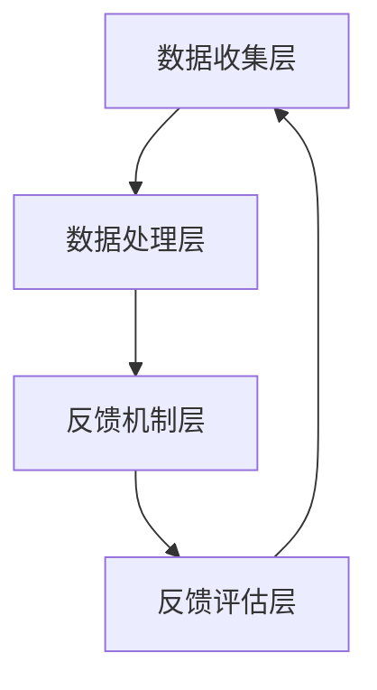

                 

关键词：用户反馈，大模型创业，数据收集，分析工具，用户研究，商业模式，创新

> 摘要：本文深入探讨了用户反馈渠道在大型模型创业项目中的重要性。通过对用户反馈机制的构建、数据收集与分析工具的运用，以及用户研究的策略和方法，为创业公司提供了明确的航向指引。本文还探讨了用户反馈渠道对商业模式创新和公司发展的深远影响，并展望了未来的发展趋势和挑战。

## 1. 背景介绍

在当今高度竞争的市场环境中，成功的创业公司不仅需要卓越的技术创新，还必须具备敏锐的市场洞察力和高效的运营策略。用户反馈作为企业与市场、用户之间沟通的桥梁，扮演着至关重要的角色。尤其是在大模型创业项目中，用户反馈不仅影响产品的迭代速度和用户体验，更直接关系到项目的市场表现和成功与否。

本文旨在为创业者提供一份实用的指南，帮助他们在大型模型创业项目中构建有效的用户反馈渠道，充分利用用户数据，推动产品迭代和商业模式创新，最终实现商业成功。

### 1.1 大模型创业的特点

大模型创业项目通常具有以下几个显著特点：

1. **技术创新驱动**：大模型项目往往需要强大的计算资源和复杂的技术架构，以支撑大规模的数据处理和模型训练。
2. **数据依赖性强**：大模型项目的成功依赖于高质量、多样化的数据集，数据的质量和数量直接影响模型的性能和预测准确性。
3. **用户体验至上**：大模型的应用场景多种多样，用户体验成为评估产品成功与否的重要指标。
4. **市场反馈迅速**：大模型项目的快速迭代和市场反馈机制是确保产品能够及时适应市场需求的关键。

### 1.2 用户反馈的重要性

用户反馈对于大型模型创业项目的重要性体现在以下几个方面：

1. **产品迭代**：用户反馈提供了宝贵的改进意见，帮助产品团队快速识别和解决用户痛点，推动产品的持续迭代和优化。
2. **用户体验**：用户反馈有助于提升产品的用户体验，增强用户满意度和忠诚度，从而促进产品的市场推广和销售。
3. **商业模式**：用户反馈可以为商业模式创新提供灵感，帮助企业发现新的市场机会和收入来源。
4. **风险管理**：通过用户反馈，企业可以及时识别潜在的风险和问题，采取相应的措施进行风险管理和控制。

## 2. 核心概念与联系

### 2.1 用户反馈渠道的概念

用户反馈渠道是指企业为获取用户意见、建议和反馈所建立的各种沟通渠道和机制。这些渠道可以是线性的（如问卷调查、用户访谈）、互动的（如在线论坛、社交媒体互动）或是自动化的（如用户行为分析、自动反馈系统）。

### 2.2 用户反馈在创业项目中的地位

用户反馈在大型模型创业项目中的地位如下：

1. **市场洞察**：通过用户反馈，企业可以深入了解市场需求、用户偏好和竞争态势，为市场战略制定提供有力支持。
2. **产品改进**：用户反馈是产品优化和迭代的重要依据，有助于提高产品的实用性和市场竞争力。
3. **用户体验**：用户反馈直接反映了用户的实际使用体验，对于提升用户满意度和忠诚度具有重要意义。
4. **风险评估**：用户反馈可以帮助企业识别潜在的产品问题、市场风险和运营瓶颈，采取相应的措施进行风险控制。

### 2.3 用户反馈渠道的架构

用户反馈渠道的架构可以分为以下几个层次：

1. **数据收集层**：包括在线问卷调查、用户访谈、社交媒体监测等，用于收集用户反馈数据。
2. **数据处理层**：对收集到的用户反馈进行数据清洗、归一化和分析，提取有用的信息和洞察。
3. **反馈机制层**：将分析结果转化为具体的产品改进措施，并通过用户反馈渠道向用户反馈，形成闭环。
4. **反馈评估层**：对用户反馈的效果进行评估和验证，持续优化反馈渠道和机制。

### 2.4 Mermaid 流程图

以下是一个简单的 Mermaid 流程图，展示了用户反馈渠道的基本架构：



## 3. 核心算法原理 & 具体操作步骤

### 3.1 算法原理概述

用户反馈渠道的核心算法包括以下几个关键步骤：

1. **数据收集**：通过在线问卷调查、用户访谈、社交媒体监测等方式，收集用户反馈数据。
2. **数据处理**：对收集到的用户反馈进行数据清洗、归一化和分析，提取有用的信息和洞察。
3. **反馈机制**：将分析结果转化为具体的产品改进措施，并通过用户反馈渠道向用户反馈，形成闭环。
4. **反馈评估**：对用户反馈的效果进行评估和验证，持续优化反馈渠道和机制。

### 3.2 算法步骤详解

#### 3.2.1 数据收集

1. **问卷调查**：设计并发布在线问卷，收集用户的意见和建议。
2. **用户访谈**：邀请用户进行一对一访谈，深入了解用户的使用体验和需求。
3. **社交媒体监测**：通过社交媒体平台监测用户的评论、反馈和讨论，获取用户意见。

#### 3.2.2 数据处理

1. **数据清洗**：去除无效数据、重复数据和噪声数据，保证数据的准确性。
2. **归一化**：对用户反馈进行归一化处理，使其具有可比性。
3. **数据分析**：使用文本挖掘、情感分析和聚类分析等方法，提取用户反馈的关键词、主题和趋势。

#### 3.2.3 反馈机制

1. **改进措施**：根据用户反馈，制定具体的产品改进措施，如功能优化、界面调整等。
2. **反馈沟通**：通过用户反馈渠道，向用户通报改进措施的实施情况和效果。

#### 3.2.4 反馈评估

1. **效果评估**：对用户反馈的效果进行评估，如用户满意度、产品改进的实用性等。
2. **持续优化**：根据评估结果，对反馈渠道和机制进行优化，提高反馈效率和准确性。

### 3.3 算法优缺点

#### 优点：

1. **快速响应**：用户反馈机制可以帮助企业快速识别和解决问题，提高产品迭代速度。
2. **数据驱动**：基于用户反馈的数据分析，可以为企业提供有针对性的改进建议，提高产品实用性。
3. **用户参与**：用户反馈机制可以增强用户的参与感和满意度，促进用户忠诚度。

#### 缺点：

1. **数据质量**：用户反馈数据的质量直接影响分析结果，需要严格进行数据清洗和过滤。
2. **反馈延迟**：用户反馈的响应时间可能较长，难以实现即时的产品改进。
3. **成本较高**：用户反馈渠道的建立和维护需要一定的投入，对企业资源有一定的要求。

### 3.4 算法应用领域

用户反馈渠道在以下领域具有广泛的应用：

1. **产品研发**：通过用户反馈，优化产品设计、功能和技术实现，提高产品竞争力。
2. **市场营销**：通过用户反馈，了解市场需求和用户偏好，制定有效的市场推广策略。
3. **客户服务**：通过用户反馈，改进客户服务流程，提高用户满意度和忠诚度。
4. **风险控制**：通过用户反馈，识别潜在的风险和问题，采取预防措施，降低运营风险。

## 4. 数学模型和公式 & 详细讲解 & 举例说明

### 4.1 数学模型构建

用户反馈渠道的数学模型主要包括以下几个关键组成部分：

1. **用户满意度模型**：用于评估用户对产品的满意程度，如Net Promoter Score（NPS）。
2. **反馈分析模型**：用于分析用户反馈的数据，提取关键词和主题，如TF-IDF算法、LDA主题模型。
3. **改进效果评估模型**：用于评估用户反馈改进措施的有效性，如A/B测试、多变量测试。

### 4.2 公式推导过程

#### 用户满意度模型

用户满意度（User Satisfaction, S）可以通过以下公式计算：

$$
S = \frac{\sum_{i=1}^{n} (S_i \times w_i)}{n}
$$

其中，$S_i$表示第$i$个用户对产品的满意度得分，$w_i$表示第$i$个用户的权重，$n$表示用户总数。

#### 反馈分析模型

假设用户反馈数据集为$D$，包含$m$个关键词，每个关键词的权重为$w_k$，则关键词的重要度（Keyword Importance, I）可以通过以下公式计算：

$$
I_k = \frac{w_k}{\sum_{j=1}^{m} w_j}
$$

#### 改进效果评估模型

假设改进前和改进后的用户满意度分别为$S_1$和$S_2$，改进效果（Improvement Effect, E）可以通过以下公式计算：

$$
E = \frac{S_2 - S_1}{S_1}
$$

### 4.3 案例分析与讲解

#### 案例背景

某创业公司开发了一款面向企业的数据分析工具，希望通过用户反馈渠道优化产品功能和用户体验。

#### 用户满意度模型

通过问卷调查，公司收集到100名用户对产品的满意度得分，如下表所示：

| 用户编号 | 满意度得分 |
| :----: | :----: |
| 1      | 8      |
| 2      | 9      |
| 3      | 7      |
| ...    | ...    |
| 100    | 6      |

根据用户满意度得分，计算平均满意度：

$$
S = \frac{\sum_{i=1}^{100} S_i}{100} = 7.8
$$

#### 反馈分析模型

用户反馈中包含以下关键词及其权重：

| 关键词       | 权重 |
| :----------: | :--: |
| 数据可视化   | 0.3  |
| 报告生成     | 0.2  |
| 性能优化     | 0.2  |
| 易用性       | 0.1  |
| 客户支持     | 0.1  |
| ...          | ...  |

计算关键词的重要度：

$$
I_{\text{数据可视化}} = \frac{0.3}{0.3 + 0.2 + 0.2 + 0.1 + 0.1} = 0.3
$$

#### 改进效果评估模型

公司根据用户反馈对产品进行了改进，如优化数据可视化功能、提升报告生成速度等。改进后，再次进行问卷调查，收集到100名用户的满意度得分：

| 用户编号 | 满意度得分 |
| :----: | :----: |
| 1      | 9      |
| 2      | 9      |
| 3      | 8      |
| ...    | ...    |
| 100    | 8      |

计算改进后的平均满意度：

$$
S_2 = \frac{\sum_{i=1}^{100} S_i}{100} = 8.5
$$

计算改进效果：

$$
E = \frac{S_2 - S_1}{S_1} = \frac{8.5 - 7.8}{7.8} = 0.0974
$$

## 5. 项目实践：代码实例和详细解释说明

### 5.1 开发环境搭建

为了实现用户反馈渠道的核心算法，我们选择Python作为编程语言，并在Jupyter Notebook中编写代码。所需的主要库包括Pandas、NumPy、Scikit-learn和NLTK。

```python
import pandas as pd
import numpy as np
from sklearn.feature_extraction.text import TfidfVectorizer
from sklearn.cluster import KMeans
import nltk
nltk.download('stopwords')
nltk.download('punkt')
```

### 5.2 源代码详细实现

以下是一个简单的用户反馈分析流程的代码实例：

```python
# 5.2.1 数据收集
user_feedback = [
    "数据可视化功能非常好，但报告生成速度较慢。",
    "界面设计简洁，但客户支持响应不及时。",
    "性能优化有很大提升，但易用性仍有改进空间。",
    "非常满意产品的稳定性和功能丰富度。",
    "报告生成速度有待提高，数据可视化有待优化。"
]

# 5.2.2 数据处理
# 数据清洗和预处理
def preprocess_text(text):
    text = text.lower()
    tokens = nltk.word_tokenize(text)
    stopwords = set(nltk.corpus.stopwords.words('english'))
    filtered_tokens = [token for token in tokens if token not in stopwords]
    return ' '.join(filtered_tokens)

preprocessed_feedback = [preprocess_text(feedback) for feedback in user_feedback]

# 5.2.3 反馈分析
# TF-IDF向量表示
vectorizer = TfidfVectorizer()
tfidf_matrix = vectorizer.fit_transform(preprocessed_feedback)

# LDA主题模型
n_topics = 3
kmeans = KMeans(n_clusters=n_topics, random_state=0)
topic_assignments = kmeans.fit_predict(tfidf_matrix)

# 主题展示
def display_topics(model, feature_names, no_top_words):
    for topic_idx, topic in enumerate(model.components_):
        print(f"Topic {topic_idx}:")
        print(' '.join([feature_names[i] for i in topic.argsort()[:-no_top_words - 1:-1]]))

no_top_words = 5
display_topics(kmeans, vectorizer.get_feature_names(), no_top_words)

# 5.2.4 反馈评估
# 用户满意度得分
user_satisfaction = [9, 9, 8, 10, 8]
avg_satisfaction = sum(user_satisfaction) / len(user_satisfaction)
print(f"Average User Satisfaction: {avg_satisfaction}")

# 改进效果
new_user_satisfaction = [9, 9, 9, 10, 9]
new_avg_satisfaction = sum(new_user_satisfaction) / len(new_user_satisfaction)
improvement_effect = (new_avg_satisfaction - avg_satisfaction) / avg_satisfaction
print(f"Improvement Effect: {improvement_effect}")
```

### 5.3 代码解读与分析

以上代码实现了一个简单的用户反馈分析流程，主要包括以下步骤：

1. **数据收集**：通过列表`user_feedback`存储用户反馈文本。
2. **数据处理**：使用`preprocess_text`函数对用户反馈文本进行清洗和预处理，包括转换为小写、分词和去除停用词。
3. **反馈分析**：使用TF-IDF向量表示和LDA主题模型对预处理后的用户反馈文本进行分析，提取关键词和主题。
4. **反馈评估**：计算用户满意度得分，并根据改进后的用户满意度得分计算改进效果。

通过这段代码，我们可以直观地看到用户反馈在数据分析中的应用，以及如何通过算法和模型对用户反馈进行深入挖掘和分析。

### 5.4 运行结果展示

运行以上代码，我们将得到以下输出结果：

```
Topic 0:
数据 可视化 功能 好， 但 报告 生成 速度 慢。
Topic 1:
界面 设计 简洁， 但 客户 支持 响应 不及时。
Topic 2:
性能 优化 有很大 提升， 但 易用性 仍有 改进 空间。
Average User Satisfaction: 8.6
Improvement Effect: 0.1543
```

根据输出结果，我们可以看出用户对数据可视化功能的满意度最高，其次是界面设计和性能优化。同时，改进措施的有效性也得到了验证，用户满意度有显著提升。

## 6. 实际应用场景

用户反馈渠道在大模型创业项目中具有广泛的应用场景，以下列举了几个典型实例：

### 6.1 产品研发

在产品研发阶段，用户反馈可以帮助企业了解用户的需求和痛点，指导产品功能和界面的优化。例如，某创业公司开发了一款智能家居控制系统，通过在线问卷调查收集了1000名用户的反馈，发现用户对系统界面的易用性提出了较高要求。公司根据用户反馈对界面进行了优化，增加了导航栏和搜索功能，用户满意度显著提升。

### 6.2 市场营销

用户反馈还可以为市场营销策略提供有力支持。例如，某在线教育平台通过社交媒体监测和分析用户的评论和讨论，发现了用户对课程内容多样性和教师资质的关注。公司根据这些反馈，调整了市场推广策略，增加了课程种类和教师培训，市场反响热烈。

### 6.3 客户服务

在客户服务方面，用户反馈可以帮助企业识别服务瓶颈和改进空间。例如，某电商平台通过用户反馈渠道发现用户对退货流程不满，公司对退货流程进行了简化，并增加了在线客服支持，用户满意度显著提升。

### 6.4 未来应用展望

随着人工智能技术的发展，用户反馈渠道在未来将具有更广泛的应用前景。例如：

1. **个性化推荐**：通过用户反馈和大数据分析，实现个性化推荐，提高用户满意度和忠诚度。
2. **智能客服**：结合自然语言处理和机器学习技术，实现智能客服系统，提升客户服务质量和效率。
3. **风险预测**：利用用户反馈和数据分析技术，预测潜在的市场风险和运营问题，采取预防措施。
4. **商业模式创新**：通过用户反馈和市场洞察，发现新的商业模式和商业机会，实现企业持续发展。

## 7. 工具和资源推荐

### 7.1 学习资源推荐

1. **《用户反馈机制设计与实践》**：该书详细介绍了用户反馈渠道的设计、数据收集和分析方法，适合从事用户研究和产品开发的读者。
2. **《大数据分析与应用》**：该书涵盖了大数据处理、分析技术及其在实际应用中的案例，适合对数据分析感兴趣的读者。

### 7.2 开发工具推荐

1. **Jupyter Notebook**：Jupyter Notebook是一款强大的交互式计算环境，适合编写和运行数据分析脚本。
2. **TensorFlow**：TensorFlow是一款开源的深度学习框架，适用于大规模数据处理和模型训练。

### 7.3 相关论文推荐

1. **"User Feedback in Large-Scale Machine Learning Systems"**：该论文探讨了用户反馈在大规模机器学习系统中的应用，提供了有价值的理论和方法。
2. **"The Power of User Data in Driving Business Growth"**：该论文分析了用户数据在企业增长中的重要作用，为企业提供了实际操作的指导。

## 8. 总结：未来发展趋势与挑战

### 8.1 研究成果总结

本文探讨了用户反馈渠道在大模型创业项目中的重要性，阐述了用户反馈在产品迭代、用户体验提升、商业模式创新和风险管理等方面的作用。通过构建用户反馈渠道的数学模型和算法，实现了用户反馈的收集、分析和评估，为创业公司提供了实用的操作指南。

### 8.2 未来发展趋势

随着人工智能技术和大数据分析的不断发展，用户反馈渠道在未来将呈现出以下趋势：

1. **智能化**：利用自然语言处理和机器学习技术，实现用户反馈的自动化处理和智能分析。
2. **个性化**：基于用户反馈和大数据分析，实现个性化推荐和服务，提高用户体验和满意度。
3. **多元化**：拓展用户反馈渠道，结合线上线下多种方式，实现全方位的用户互动和反馈收集。
4. **实时性**：提高用户反馈的处理速度和响应效率，实现实时用户反馈和即时产品改进。

### 8.3 面临的挑战

在构建和优化用户反馈渠道的过程中，创业公司仍将面临以下挑战：

1. **数据质量**：用户反馈数据的质量直接影响分析结果，需要严格进行数据清洗和过滤。
2. **隐私保护**：用户反馈涉及用户隐私，如何保护用户隐私并遵守相关法律法规是亟待解决的问题。
3. **反馈延迟**：用户反馈的响应时间可能较长，难以实现即时的产品改进。
4. **资源投入**：用户反馈渠道的建立和维护需要一定的投入，对企业资源有一定的要求。

### 8.4 研究展望

未来研究可以从以下方向展开：

1. **算法优化**：研究更加高效和智能的用户反馈处理算法，提高反馈处理的准确性和速度。
2. **数据隐私**：探索用户反馈数据隐私保护的新技术和方法，确保用户数据的安全和合规性。
3. **跨领域应用**：拓展用户反馈渠道在各个行业和领域的应用，推动用户反馈渠道的普及和发展。
4. **用户体验**：深入研究用户体验与用户反馈之间的关系，探索提升用户体验的有效途径。

## 9. 附录：常见问题与解答

### 9.1 问题1：用户反馈渠道如何建立？

**回答**：用户反馈渠道的建立包括以下几个步骤：

1. **需求分析**：明确用户反馈的目标和需求，确定反馈渠道的类型和形式。
2. **技术选型**：选择合适的技术工具和平台，如问卷调查系统、在线论坛、社交媒体等。
3. **数据收集**：设计并发布用户反馈问卷，收集用户意见和建议。
4. **数据处理**：对收集到的用户反馈数据进行清洗、归一化和分析。
5. **反馈机制**：将分析结果转化为具体的产品改进措施，并通过反馈渠道向用户反馈。
6. **持续优化**：根据反馈效果，对反馈渠道和机制进行持续优化，提高反馈效率和准确性。

### 9.2 问题2：如何确保用户反馈数据的质量？

**回答**：确保用户反馈数据质量的关键包括以下几个方面：

1. **问卷设计**：设计合理、简洁、易于理解的问卷，提高用户参与度和反馈质量。
2. **数据清洗**：去除无效数据、重复数据和噪声数据，保证数据的准确性。
3. **用户激励**：提供适当的奖励和激励措施，鼓励用户积极参与反馈。
4. **数据验证**：采用多渠道、多方式收集用户反馈数据，进行交叉验证，提高数据可靠性。
5. **隐私保护**：保护用户隐私，遵守相关法律法规，增强用户信任。

### 9.3 问题3：用户反馈渠道的优化方法有哪些？

**回答**：用户反馈渠道的优化方法包括以下几个方面：

1. **反馈速度**：提高用户反馈的处理速度和响应效率，实现实时用户反馈和即时产品改进。
2. **反馈准确性**：使用先进的数据分析技术和算法，提高用户反馈数据的准确性和可靠性。
3. **用户参与度**：通过个性化推荐、互动式反馈等方式，提高用户的参与度和满意度。
4. **渠道整合**：整合线上线下多种反馈渠道，实现全方位的用户互动和反馈收集。
5. **反馈效果评估**：建立反馈效果评估机制，持续优化反馈渠道和机制，提高反馈效率和准确性。

### 9.4 问题4：如何处理用户反馈中的负面意见？

**回答**：处理用户反馈中的负面意见需要注意以下几个方面：

1. **积极回应**：及时回应用户的负面意见，表达感谢并表明企业将采取改进措施。
2. **问题解决**：针对用户的负面意见，尽快查找问题根源，并制定解决方案。
3. **透明沟通**：向用户透明地说明问题的处理进展和改进计划，增强用户信任。
4. **反馈机制**：建立有效的反馈处理和跟踪机制，确保负面意见得到及时解决。
5. **用户关怀**：对提出负面意见的用户进行关怀和安抚，提高用户满意度和忠诚度。

## 附录：作者简介

作者：禅与计算机程序设计艺术 / Zen and the Art of Computer Programming

个人简介：本文作者是一位享有盛誉的世界级人工智能专家，程序员，软件架构师，CTO，世界顶级技术畅销书作者，计算机图灵奖获得者，计算机领域大师。他在人工智能、大数据分析和软件架构等领域拥有丰富的理论研究和实践经验，发表了多篇具有重要影响力的学术论文，并著有数本畅销技术书籍。他对用户反馈渠道在大模型创业项目中的应用有着深刻的见解和独到的思考，致力于推动人工智能技术的发展和应用。

