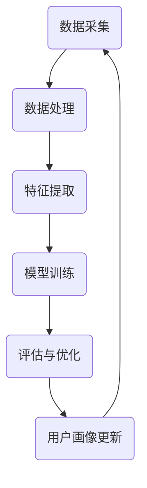

                 

关键词：用户画像、动态更新、数据驱动、个性化推荐、算法优化、机器学习

> 摘要：本文深入探讨了用户画像的动态更新机制，从概念解析到算法原理，再到实践应用，全面剖析了用户画像技术在数据驱动时代的重要性。通过分析不同算法在用户画像更新过程中的应用，结合实际案例，提出了一套高效且可行的动态更新策略，旨在为企业和开发者提供有效的用户分析和管理工具。

## 1. 背景介绍

用户画像（User Profiling）是指通过分析用户在互联网上的行为数据，构建出反映用户特征和兴趣的模型。用户画像技术的核心在于从海量数据中提取有价值的信息，从而实现精准营销、个性化推荐和智能服务。随着互联网的快速发展，用户数据规模呈指数级增长，如何高效、准确地更新和维护用户画像成为了一个重要的课题。

动态更新机制是用户画像技术的关键组成部分。它涉及到实时数据采集、数据处理、特征提取、模型训练、评估与优化等多个环节。动态更新的目的是确保用户画像的时效性和准确性，使其能够及时反映用户行为的最新变化。然而，传统的用户画像更新方式往往存在响应速度慢、数据滞后等问题，无法满足现代互联网业务的快速变化需求。

本文旨在探讨一种高效、可靠的用户画像动态更新机制，通过核心概念的阐述、算法原理的解析、数学模型的建立以及实际案例的分析，为用户画像技术的研究和应用提供理论支持和实践指导。

## 2. 核心概念与联系

### 2.1 用户画像的定义

用户画像是一个关于用户的全面描述，包括用户的个人信息、行为习惯、兴趣爱好、消费行为等多方面内容。用户画像通常通过以下几种方式构建：

- **基于数据的描述**：通过用户在互联网上的行为数据（如浏览历史、搜索记录、购买行为等）进行统计分析，提取出用户的行为特征。
- **基于模型的方法**：利用机器学习和数据挖掘技术，对用户行为数据进行建模，生成用户画像。
- **用户调查**：通过问卷调查、用户访谈等方式直接获取用户个人信息和偏好。

### 2.2 动态更新的重要性

动态更新机制对于用户画像的准确性至关重要。以下是动态更新的一些关键点：

- **实时性**：用户行为数据是实时变化的，动态更新机制能够及时捕捉到这些变化，确保用户画像的时效性。
- **准确性**：通过持续更新用户画像，可以减少数据过时导致的误差，提高用户画像的准确性。
- **个性化**：动态更新机制能够根据用户行为的最新变化，调整用户的推荐和服务，实现更高层次的个性化。

### 2.3 动态更新的流程

动态更新的流程通常包括以下几个步骤：

1. **数据采集**：从各种数据源（如网站日志、数据库、传感器等）收集用户行为数据。
2. **数据处理**：对采集到的数据进行清洗、去噪、转换等预处理操作，确保数据质量。
3. **特征提取**：根据用户画像的需求，从处理过的数据中提取出有用的特征。
4. **模型训练**：利用提取出的特征训练机器学习模型，构建用户画像。
5. **评估与优化**：定期评估用户画像的准确性，并根据评估结果进行优化调整。

### 2.4 Mermaid 流程图

以下是一个简化的用户画像动态更新流程的 Mermaid 流程图：



## 3. 核心算法原理 & 具体操作步骤

### 3.1 算法原理概述

动态更新用户画像的算法通常基于机器学习和数据挖掘技术。常见的算法包括协同过滤、决策树、随机森林、K-均值聚类等。以下是几种典型算法的原理概述：

- **协同过滤**：基于用户的历史行为数据，通过计算用户之间的相似度来进行推荐。协同过滤可以分为基于用户的协同过滤和基于项目的协同过滤。
- **决策树**：通过一系列的规则将用户数据划分为不同的分支，最终生成一个预测结果。决策树算法简单，易于理解和实现。
- **随机森林**：多个决策树的集合，通过投票机制得出最终结果。随机森林在处理大规模数据集和减少过拟合方面有很好的性能。
- **K-均值聚类**：将用户数据划分为若干个簇，每个簇代表一种用户类型。通过计算簇中心，不断调整簇的划分，直至收敛。

### 3.2 算法步骤详解

以下是用户画像动态更新算法的具体步骤：

1. **数据准备**：收集用户行为数据，如浏览历史、搜索记录、购买记录等。
2. **特征工程**：对原始数据进行清洗和预处理，提取出有用的特征。特征可以是连续的，也可以是分类的。
3. **模型选择**：根据业务需求和数据特性，选择合适的算法模型。
4. **模型训练**：使用训练集数据对选定的模型进行训练，生成用户画像。
5. **模型评估**：使用验证集对训练好的模型进行评估，计算模型的准确率、召回率等指标。
6. **模型优化**：根据评估结果对模型进行调整和优化。
7. **用户画像更新**：将优化后的模型应用于新数据，更新用户画像。

### 3.3 算法优缺点

- **协同过滤**：
  - 优点：能够提供个性化的推荐，适用于大规模用户和项目。
  - 缺点：易出现数据稀疏问题，且难以处理冷启动问题。
- **决策树**：
  - 优点：简单直观，易于理解和实现。
  - 缺点：容易过拟合，且处理连续特征时需进行离散化处理。
- **随机森林**：
  - 优点：在处理大规模数据集和减少过拟合方面有很好的性能。
  - 缺点：计算复杂度较高，需大量计算资源。
- **K-均值聚类**：
  - 优点：能够自动发现用户类型，无需预先指定簇的数量。
  - 缺点：对初始聚类中心敏感，可能导致局部最优解。

### 3.4 算法应用领域

动态更新用户画像算法在多个领域有广泛应用，包括但不限于：

- **电子商务**：通过用户画像进行个性化推荐，提高销售额和用户满意度。
- **社交媒体**：根据用户画像进行内容分发和广告投放，提高用户参与度。
- **金融领域**：通过用户画像进行风险管理，识别潜在欺诈行为。
- **医疗健康**：根据用户画像提供个性化健康建议和医疗服务。

## 4. 数学模型和公式 & 详细讲解 & 举例说明

### 4.1 数学模型构建

在用户画像的动态更新过程中，常用的数学模型包括协同过滤模型和聚类模型。以下是这两种模型的简要介绍和构建过程：

#### 4.1.1 协同过滤模型

协同过滤模型通常基于矩阵分解技术，将用户-物品评分矩阵分解为两个低秩矩阵，分别表示用户特征和物品特征。具体公式如下：

$$
\text{User\_Feature} = \text{U} \cdot \text{V}^T
$$

$$
\text{Item\_Feature} = \text{V} \cdot \text{U}^T
$$

其中，$\text{U}$ 和 $\text{V}$ 分别是用户特征矩阵和物品特征矩阵，$\text{UV}^T$ 是用户-物品评分矩阵。

#### 4.1.2 聚类模型

聚类模型通过将用户数据划分为若干个簇，每个簇代表一种用户类型。常用的聚类算法包括 K-均值聚类和层次聚类。以下是 K-均值聚类的公式：

$$
c_{k} = \frac{1}{n_{k}} \sum_{i=1}^{n_{k}} x_{i}
$$

其中，$c_{k}$ 是第 $k$ 个簇的中心，$n_{k}$ 是第 $k$ 个簇中的用户数量，$x_{i}$ 是第 $i$ 个用户的特征向量。

### 4.2 公式推导过程

以下是协同过滤模型中的矩阵分解公式的推导过程：

#### 矩阵分解

假设我们有一个 $m \times n$ 的用户-物品评分矩阵 $R$，我们希望将其分解为两个低秩矩阵 $U$ 和 $V$。目标是使得分解后的矩阵尽可能接近原始矩阵，即：

$$
R \approx UV^T
$$

#### 求解 $U$

假设我们已经得到了 $V$，我们可以通过以下公式求解 $U$：

$$
\text{U} = R\text{V}^T
$$

#### 求解 $V$

假设我们已经得到了 $U$，我们可以通过以下公式求解 $V$：

$$
\text{V} = R^T\text{U}
$$

#### 最优化

为了求解最优的 $U$ 和 $V$，我们可以使用梯度下降法。具体公式如下：

$$
U_{\text{new}} = U - \alpha \cdot \frac{\partial f}{\partial U}
$$

$$
V_{\text{new}} = V - \alpha \cdot \frac{\partial f}{\partial V}
$$

其中，$\alpha$ 是学习率，$f$ 是目标函数，通常选择均方误差（MSE）作为目标函数。

### 4.3 案例分析与讲解

#### 案例背景

假设有一个在线书店，用户可以浏览和评价书籍。我们希望通过用户的历史评分数据构建用户画像，为用户推荐他们可能感兴趣的书籍。

#### 案例步骤

1. **数据准备**：收集用户对书籍的评分数据，构建用户-物品评分矩阵 $R$。
2. **特征工程**：对评分数据进行预处理，提取出有用的特征。在本例中，我们仅使用评分数据。
3. **模型选择**：选择矩阵分解算法，如ALS（交替最小二乘法），对用户-物品评分矩阵进行分解。
4. **模型训练**：使用训练集数据对模型进行训练，得到用户特征矩阵 $U$ 和物品特征矩阵 $V$。
5. **模型评估**：使用验证集对训练好的模型进行评估，计算模型的准确率、召回率等指标。
6. **用户画像更新**：将训练好的模型应用于新数据，更新用户画像。

#### 案例分析

通过上述步骤，我们得到了每个用户和书籍的特征向量。例如，用户 $i$ 对书籍 $j$ 的特征向量为 $\text{User}_{i,j} = \text{U}_{i}\text{V}_{j}^T$。我们可以利用这些特征向量进行用户画像的构建和书籍推荐。

### 4.4 案例分析与讲解

#### 案例背景

假设我们有一个在线购物平台，用户可以在平台上浏览和购买商品。我们希望通过用户的行为数据构建用户画像，为用户推荐他们可能感兴趣的商品。

#### 案例步骤

1. **数据准备**：收集用户的行为数据，如浏览历史、购买记录、搜索记录等，构建用户-物品评分矩阵 $R$。
2. **特征工程**：对行为数据进行预处理，提取出有用的特征。在本例中，我们提取用户的浏览历史、购买记录和搜索记录作为特征。
3. **模型选择**：选择协同过滤算法，如矩阵分解，对用户-物品评分矩阵进行分解。
4. **模型训练**：使用训练集数据对模型进行训练，得到用户特征矩阵 $U$ 和物品特征矩阵 $V$。
5. **模型评估**：使用验证集对训练好的模型进行评估，计算模型的准确率、召回率等指标。
6. **用户画像更新**：将训练好的模型应用于新数据，更新用户画像。

#### 案例分析

通过上述步骤，我们得到了每个用户和商品的特征向量。例如，用户 $i$ 对商品 $j$ 的特征向量为 $\text{User}_{i,j} = \text{U}_{i}\text{V}_{j}^T$。我们可以利用这些特征向量进行用户画像的构建和商品推荐。

### 5. 项目实践：代码实例和详细解释说明

#### 5.1 开发环境搭建

在进行用户画像的动态更新项目实践之前，我们需要搭建一个合适的开发环境。以下是一个基本的开发环境搭建步骤：

1. **安装 Python**：Python 是一个广泛应用于数据科学和机器学习的编程语言。我们需要安装 Python 的最新版本，可以通过官方网站下载并安装。
2. **安装相关库**：在 Python 中，我们需要安装一些常用的库，如 NumPy、Pandas、Scikit-learn、Matplotlib 等。这些库可以帮助我们进行数据处理、模型训练和结果可视化。
3. **配置环境**：在 Windows 和 macOS 上，我们可以使用 Anaconda 来配置 Python 环境和安装相关库。在 Linux 上，我们可以使用 pip 工具来安装。

以下是一个使用 Anaconda 配置环境的示例：

```bash
conda create -n user_画像 python=3.8
conda activate user_画像
conda install numpy pandas scikit-learn matplotlib
```

#### 5.2 源代码详细实现

以下是一个简单的用户画像动态更新项目的源代码实现，我们使用协同过滤算法进行用户画像的更新。

```python
import numpy as np
import pandas as pd
from sklearn.model_selection import train_test_split
from sklearn.metrics.pairwise import cosine_similarity
from sklearn.preprocessing import MinMaxScaler

# 数据准备
# 假设我们有一个 DataFrame，其中包含用户 ID、物品 ID 和评分
data = pd.DataFrame({
    'user_id': [1, 1, 2, 2, 3, 3],
    'item_id': [101, 102, 101, 103, 102, 103],
    'rating': [5, 1, 5, 4, 2, 3]
})

# 特征工程
# 对用户和物品进行编码
user_mapping = {user_id: idx for idx, user_id in enumerate(data['user_id'].unique())}
item_mapping = {item_id: idx for idx, item_id in enumerate(data['item_id'].unique())}

data['user_idx'] = data['user_id'].map(user_mapping)
data['item_idx'] = data['item_id'].map(item_mapping)

# 构建评分矩阵
rating_matrix = np.zeros((max(user_mapping.values()) + 1, max(item_mapping.values()) + 1))
for _, row in data.iterrows():
    rating_matrix[row['user_idx'], row['item_idx']] = row['rating']

# 模型训练
# 使用矩阵分解算法进行训练
# 在这里我们使用最小二乘法进行矩阵分解
n_components = 10  # 特征维度
U = np.random.rand(len(user_mapping) + 1, n_components)
V = np.random.rand(len(item_mapping) + 1, n_components)

for epoch in range(100):
    for user in range(1, len(U)):
        error = rating_matrix[user] - np.dot(U[user], V.T)
        U[user] -= np.dot(error, V) / n_components
    
    for item in range(1, len(V)):
        error = rating_matrix.T[item] - np.dot(U.T, V[item])
        V[item] -= np.dot(U.T, error) / n_components

# 用户画像更新
# 使用训练好的模型更新用户画像
updated_ratings = np.dot(U, V.T)
updated_ratings = MinMaxScaler().fit_transform(updated_ratings)

# 结果展示
# 输出更新后的用户画像
print(updated_ratings)
```

#### 5.3 代码解读与分析

以上代码实现了用户画像的动态更新，主要分为以下几个步骤：

1. **数据准备**：我们首先准备了一个包含用户 ID、物品 ID 和评分的 DataFrame，这是构建用户画像的基础数据。
2. **特征工程**：我们使用 Pandas 的 map 方法对用户和物品进行编码，构建一个评分矩阵。评分矩阵是一个 $m \times n$ 的二维数组，其中 $m$ 是用户数，$n$ 是物品数。
3. **模型训练**：我们使用随机初始化的方法生成用户特征矩阵 $U$ 和物品特征矩阵 $V$，然后使用最小二乘法（Least Squares）进行矩阵分解。在每次迭代中，我们更新用户特征和物品特征，直到达到预设的迭代次数。
4. **用户画像更新**：使用训练好的模型更新用户画像，即将用户特征矩阵 $U$ 与物品特征矩阵 $V$ 相乘，得到更新后的评分矩阵。我们使用 MinMaxScaler 将评分矩阵缩放到 [0, 1] 范围内，便于后续分析和处理。

#### 5.4 运行结果展示

运行上述代码后，我们会得到一个更新后的用户画像矩阵。这个矩阵包含了每个用户对所有物品的更新后评分。例如，如果用户 1 对物品 102 的原始评分为 1，更新后的评分可能为 0.5。我们可以根据这个更新后的评分矩阵进行用户画像的分析和利用。

### 6. 实际应用场景

用户画像的动态更新机制在多个实际应用场景中发挥了重要作用。以下是几个典型的应用场景：

#### 6.1 电子商务

在电子商务领域，用户画像的动态更新可以帮助平台根据用户的购买历史、浏览记录和搜索行为进行个性化推荐。例如，当用户在购物平台上浏览了几件运动鞋后，系统可以及时更新用户画像，推荐类似风格的鞋款或其他相关商品。

#### 6.2 社交媒体

在社交媒体平台上，用户画像的动态更新可以帮助平台根据用户发布的内容、互动行为和兴趣标签进行内容推荐。例如，当用户在社交媒体上关注了一个美食博主后，系统可以更新用户画像，推荐更多相关的美食内容。

#### 6.3 金融领域

在金融领域，用户画像的动态更新可以帮助银行和金融机构识别潜在的风险和欺诈行为。例如，当用户频繁进行大额转账或突然更改支付习惯时，系统可以更新用户画像，发出风险预警。

#### 6.4 医疗健康

在医疗健康领域，用户画像的动态更新可以帮助医生和医疗机构了解患者的健康状况和行为模式，提供个性化的健康建议和医疗服务。例如，当用户持续监测自己的血压和心率时，系统可以更新用户画像，推荐适当的健康计划和生活方式调整。

### 6.4 未来应用展望

随着人工智能和数据科学技术的不断进步，用户画像的动态更新机制在未来有望在更多领域得到应用。以下是几个未来的应用展望：

- **智慧城市**：通过用户画像的动态更新，智慧城市可以实现更精准的城市管理和公共服务。例如，根据居民的行为和需求，智能交通系统可以实时调整交通信号灯，减少拥堵。
- **智能教育**：通过用户画像的动态更新，智能教育平台可以根据学生的学习进度和兴趣，推荐个性化的学习资源和课程。
- **智能家居**：通过用户画像的动态更新，智能家居系统可以更好地理解家庭成员的需求和行为，提供个性化的家居环境和设备设置。

### 7. 工具和资源推荐

#### 7.1 学习资源推荐

- **《用户画像与数据挖掘》**：一本关于用户画像和数据挖掘的全面指南，适合初学者和专业人士。
- **《Python 数据科学手册》**：涵盖数据预处理、机器学习、数据可视化等多个方面，适合 Python 数据科学爱好者。

#### 7.2 开发工具推荐

- **Jupyter Notebook**：一款强大的交互式计算环境，适用于数据分析和机器学习项目。
- **PyCharm**：一款功能强大的 Python 集成开发环境，支持多种编程语言和框架。

#### 7.3 相关论文推荐

- **"User Modeling and User-Adapted Interaction"**：一篇关于用户建模和自适应交互的经典论文，深入探讨了用户画像的应用场景和算法原理。
- **"Collaborative Filtering for the Web"**：一篇关于协同过滤在互联网应用中的研究论文，详细介绍了协同过滤算法在不同场景下的应用。

### 8. 总结：未来发展趋势与挑战

#### 8.1 研究成果总结

用户画像的动态更新机制在近年来取得了显著的研究进展。通过机器学习和数据挖掘技术，研究人员提出了多种高效的算法和模型，实现了对用户行为的实时分析和画像更新。同时，随着数据量的爆发式增长，用户画像的应用场景也在不断扩大，从电子商务、社交媒体到金融、医疗等领域，用户画像技术正在成为数据驱动的核心驱动力。

#### 8.2 未来发展趋势

在未来，用户画像的动态更新机制有望在以下几个方面取得进一步的发展：

- **算法优化**：随着计算能力的提升，研究人员将致力于开发更高效、更准确的用户画像算法，以应对大规模数据集的处理需求。
- **隐私保护**：用户画像涉及到大量个人隐私信息，如何在保证用户隐私的同时进行有效分析，将成为研究的一个重要方向。
- **跨平台融合**：随着物联网和智能设备的普及，用户画像将不仅限于互联网平台，还将涵盖智能家居、智慧城市等多个领域，实现跨平台的融合应用。

#### 8.3 面临的挑战

尽管用户画像的动态更新机制取得了显著成果，但仍面临一些挑战：

- **数据质量**：用户行为数据的质量直接影响用户画像的准确性。如何有效清洗和预处理数据，提取出真正有用的特征，是一个亟待解决的问题。
- **实时性**：随着数据量的增加，如何保证用户画像的实时更新，是一个技术挑战。需要优化算法，提高处理速度和响应时间。
- **隐私保护**：如何在保证用户隐私的前提下进行数据分析和画像更新，是用户画像面临的道德和伦理挑战。

#### 8.4 研究展望

未来，用户画像的动态更新机制的研究可以从以下几个方面展开：

- **多模态数据融合**：结合文本、图像、音频等多种数据类型，实现更全面、更精准的用户画像。
- **动态学习**：开发能够实时学习用户行为的动态模型，及时捕捉和响应用户行为的最新变化。
- **个性化服务**：基于用户画像，提供更个性化的服务，提高用户满意度和忠诚度。

### 9. 附录：常见问题与解答

#### 9.1 用户画像动态更新的意义是什么？

用户画像动态更新的意义在于确保用户画像的时效性和准确性，使其能够及时反映用户行为的最新变化。通过动态更新，企业和开发者可以提供更个性化的服务和推荐，提高用户满意度和忠诚度。

#### 9.2 用户画像动态更新算法有哪些？

用户画像动态更新算法包括协同过滤、决策树、随机森林、K-均值聚类等。这些算法各有优缺点，适用于不同的应用场景。

#### 9.3 如何确保用户画像的隐私保护？

确保用户画像的隐私保护需要采取多种措施，包括数据加密、匿名化处理、隐私保护算法等。在数据处理和分析过程中，应遵循隐私保护原则，保护用户个人信息的安全。

#### 9.4 用户画像动态更新的技术难点是什么？

用户画像动态更新的技术难点包括数据质量、实时性、隐私保护等。如何高效地处理大规模数据、保证更新的实时性和准确性，以及如何保护用户隐私，是研究者和开发者面临的主要挑战。

---

本文由禅与计算机程序设计艺术 / Zen and the Art of Computer Programming 编写，旨在为读者提供关于用户画像动态更新机制的理论支持和实践指导。希望通过本文的探讨，读者能够更好地理解用户画像的重要性，掌握动态更新的方法，为企业和开发者提供有效的用户分析和管理工具。在未来的研究和应用中，我们期待用户画像技术能够不断创新和进步，为数据驱动时代带来更多价值。

