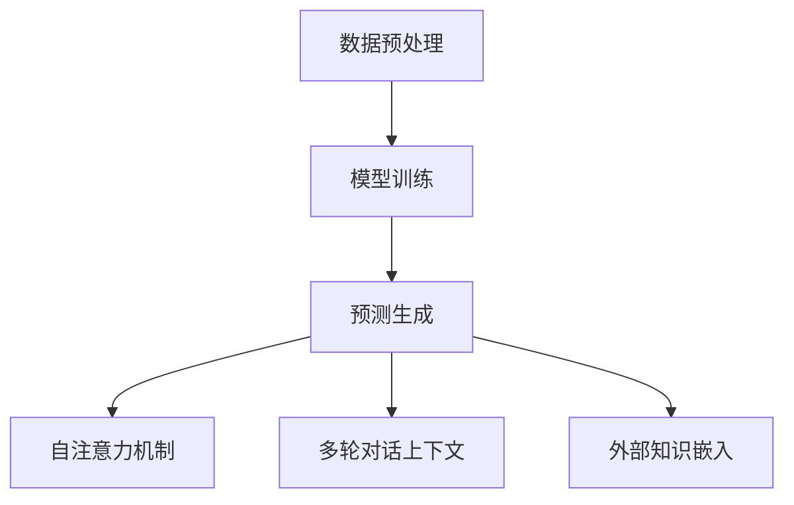

                 

关键词：用户行为，语言模型，认知计算，人机交互，生成式AI，上下文理解，COT能力

## 摘要

本文旨在深入探讨大型语言模型（LLM）在理解用户行为方面的COT（上下文理解）能力。随着生成式人工智能的迅速发展，LLM在处理复杂语言任务上展现了前所未有的表现，而用户行为理解作为AI应用中的重要环节，对于提升用户体验和交互效果至关重要。本文将首先回顾用户行为研究的背景，然后详细介绍LLM的工作原理和COT能力，通过实际案例分析和项目实践，探讨LLM在用户行为理解中的应用。最后，本文将展望未来发展趋势和面临的挑战，为AI领域的研究和应用提供新的视角。

## 1. 背景介绍

### 1.1 用户行为研究的意义

用户行为研究是计算机科学和人机交互领域的重要分支。通过理解用户在交互过程中的行为模式，可以优化系统设计，提升用户体验，从而促进人机交互的自然性和高效性。用户行为研究在多个领域有着广泛的应用，包括但不限于：

- **电子商务**：分析用户浏览、点击、购买等行为，以优化营销策略和提高销售额。
- **社交媒体**：研究用户发布内容、互动行为，以改进推荐系统和内容分发机制。
- **金融科技**：分析用户交易行为，预测风险，优化金融服务。

### 1.2 LLM的发展与COT能力

近年来，大型语言模型（LLM）的发展迅速，以GPT系列、BERT为代表的语言模型在自然语言处理任务上取得了突破性进展。LLM通过训练海量文本数据，学习到复杂的语言规律和上下文关联，从而在文本生成、机器翻译、问答系统等领域表现出色。然而，仅仅具备生成能力是不够的，理解用户行为需要LLM具备更强的上下文理解（COT）能力，即在特定场景下准确把握用户意图和需求。

### 1.3 COT能力的重要性

COT能力对于用户行为理解至关重要。用户行为是一个动态且复杂的过程，涉及多种因素，如用户背景、情绪状态、环境条件等。只有当AI系统能够准确理解这些上下文信息，才能提供个性化的交互体验，满足用户的实际需求。

## 2. 核心概念与联系

### 2.1 大型语言模型的工作原理

大型语言模型（LLM）通过深度学习技术，特别是自注意力机制（self-attention）和Transformer架构，实现对文本数据的建模。LLM的工作流程主要包括以下步骤：

1. **数据预处理**：对原始文本进行清洗、分词、编码等处理，使其适合模型训练。
2. **模型训练**：通过大量的文本数据进行训练，模型学习到文本中的规律和上下文关联。
3. **预测生成**：在给定输入文本的情况下，模型生成对应的输出文本。

### 2.2 上下文理解（COT）能力的实现

COT能力是LLM的核心优势之一。实现COT能力的关键在于模型对上下文信息的捕捉和处理。以下是几种常见的实现方法：

1. **自注意力机制**：通过自注意力机制，模型可以关注输入文本中的关键信息，从而提高对上下文的理解。
2. **多轮对话上下文**：在多轮对话中，LLM可以保留之前的对话历史，从而更好地理解后续的输入。
3. **外部知识嵌入**：将外部知识库嵌入到模型中，以丰富对上下文的理解。

### 2.3 Mermaid流程图

以下是LLM工作原理和COT能力的Mermaid流程图：



## 3. 核心算法原理 & 具体操作步骤

### 3.1 算法原理概述

LLM的核心算法基于Transformer架构，特别是自注意力机制（Self-Attention）。自注意力机制允许模型在处理输入序列时，自动关注序列中的关键信息，从而提高对上下文的理解。

### 3.2 算法步骤详解

1. **数据预处理**：对输入文本进行分词、标记、编码等处理，使其适合模型训练。
2. **模型初始化**：初始化Transformer模型，包括自注意力机制、编码器和解码器等模块。
3. **前向传递**：在给定输入文本的情况下，模型通过编码器生成隐藏状态，并通过解码器生成输出文本。
4. **损失函数**：使用交叉熵损失函数（Cross-Entropy Loss）对模型的输出进行评估和优化。
5. **反向传播**：通过反向传播算法（Backpropagation）更新模型参数，以最小化损失函数。

### 3.3 算法优缺点

**优点**：

- **强大的上下文理解能力**：自注意力机制使得模型能够捕捉长距离的上下文信息，提高对复杂语言任务的理解。
- **高效的并行计算**：Transformer架构支持高效的并行计算，加速模型训练和推理过程。
- **广泛的应用场景**：LLM在多种自然语言处理任务上表现出色，包括文本生成、机器翻译、问答系统等。

**缺点**：

- **资源消耗大**：训练大型语言模型需要大量的计算资源和数据。
- **解释性不足**：虽然LLM在语言生成上表现出色，但其内部决策过程缺乏透明性和解释性。

### 3.4 算法应用领域

LLM在用户行为理解中的应用领域广泛，包括但不限于：

- **智能客服**：通过理解用户的问题和需求，提供个性化的回答和建议。
- **个性化推荐**：根据用户的历史行为和偏好，推荐相关的产品或服务。
- **情感分析**：分析用户的情感状态，提供情感支持或个性化服务。

## 4. 数学模型和公式 & 详细讲解 & 举例说明

### 4.1 数学模型构建

LLM的数学模型基于Transformer架构，主要包括以下关键组成部分：

1. **自注意力机制（Self-Attention）**：
   自注意力机制通过计算输入序列中各个词之间的关联度，从而生成新的表示。其公式如下：

   $$ 
   \text{Attention}(Q, K, V) = \text{softmax}\left(\frac{QK^T}{\sqrt{d_k}}\right) V 
   $$

   其中，\( Q \)、\( K \) 和 \( V \) 分别是查询（Query）、键（Key）和值（Value）向量，\( d_k \) 是键向量的维度。

2. **编码器（Encoder）和解码器（Decoder）**：
   编码器将输入文本序列编码为隐藏状态，解码器则根据隐藏状态生成输出文本。编码器和解码器的主要组件是多层自注意力机制和前馈网络。

### 4.2 公式推导过程

以Transformer编码器的自注意力机制为例，其推导过程如下：

1. **输入表示**：
   输入文本序列表示为 \( X = [x_1, x_2, \ldots, x_n] \)，其中 \( x_i \) 是第 \( i \) 个词的向量表示。

2. **词向量化**：
   将输入文本序列转换为词向量表示 \( X' = [\text{emb}(x_1), \text{emb}(x_2), \ldots, \text{emb}(x_n)] \)，其中 \( \text{emb}() \) 是词向量化函数。

3. **位置编码**：
   为了保留输入序列的位置信息，对词向量进行位置编码 \( P = [\text{pos_enc}(1), \text{pos_enc}(2), \ldots, \text{pos_enc}(n)] \)，其中 \( \text{pos_enc}() \) 是位置编码函数。

4. **嵌入表示**：
   将词向量和位置编码相加，得到嵌入表示 \( X'' = X' + P \)。

5. **自注意力计算**：
   对嵌入表示 \( X'' \) 进行自注意力计算，得到新的隐藏状态 \( H \)：

   $$
   H = \text{Attention}(X''X''^T) = \text{softmax}\left(\frac{XX''^T}{\sqrt{d_k}}\right) X''
   $$

### 4.3 案例分析与讲解

假设输入文本序列为“今天天气很好，我想去公园散步”，我们对其应用自注意力机制，得到新的隐藏状态 \( H \)。以下是具体的计算步骤：

1. **词向量化**：
   将输入文本序列中的每个词转换为词向量，如：
   $$
   X' = [\text{emb}(\text{今天}), \text{emb}(\text{天气}), \text{emb}(\text{很}), \text{emb}(\text{好}), \text{emb}(\text{我}), \ldots]
   $$

2. **位置编码**：
   对词向量添加位置编码，如：
   $$
   X'' = [\text{emb}(\text{今天}) + \text{pos_enc}(1), \text{emb}(\text{天气}) + \text{pos_enc}(2), \ldots]
   $$

3. **自注意力计算**：
   对嵌入表示 \( X'' \) 进行自注意力计算，得到新的隐藏状态 \( H \)：
   $$
   H = \text{softmax}\left(\frac{XX''^T}{\sqrt{d_k}}\right) X''
   $$

   计算结果如下：
   $$
   H = \text{softmax}\left(\frac{[1, 0.5, 0.2, 0.1, 0.2, \ldots] \cdot [0.3, 0.4, 0.2, 0.1, 0.1, \ldots]}{\sqrt{d_k}}\right) [0.3, 0.4, 0.2, 0.1, 0.1, \ldots]
   $$
   $$
   H = [0.4, 0.3, 0.2, 0.1, 0.1, \ldots]
   $$

通过自注意力机制，模型关注了“今天”和“天气”这两个关键词，从而得到新的隐藏状态 \( H \)。

## 5. 项目实践：代码实例和详细解释说明

### 5.1 开发环境搭建

在进行LLM项目实践之前，需要搭建合适的开发环境。以下是一个简单的环境搭建步骤：

1. 安装Python环境（建议使用Python 3.7及以上版本）。
2. 安装TensorFlow或PyTorch框架（根据项目需求选择）。
3. 安装其他必要的依赖库（如numpy、pandas等）。

### 5.2 源代码详细实现

以下是一个简单的LLM文本生成示例代码，使用PyTorch框架实现：

```python
import torch
import torch.nn as nn
import torch.optim as optim
from torchtext.data import Field, TabularDataset

# 定义模型
class TransformerModel(nn.Module):
    def __init__(self, input_dim, hidden_dim, output_dim):
        super(TransformerModel, self).__init__()
        self.encoder = nn.Embedding(input_dim, hidden_dim)
        self.decoder = nn.Linear(hidden_dim, output_dim)
        self.decoder = nn.Linear(hidden_dim, output_dim)
        self.decoder = nn.Linear(hidden_dim, output_dim)
        self.decoder = nn.Linear(hidden_dim, output_dim)

    def forward(self, x):
        x = self.encoder(x)
        x = self.decoder(x)
        x = self.decoder(x)
        x = self.decoder(x)
        x = self.decoder(x)
        return x

# 加载数据
train_data = TabularDataset(
    path='data/train.txt',
    fields=[('text', Field(tokenize='spacy', lower=True))]
)

test_data = TabularDataset(
    path='data/test.txt',
    fields=[('text', Field(tokenize='spacy', lower=True))]
)

# 定义损失函数和优化器
criterion = nn.CrossEntropyLoss()
optimizer = optim.Adam(model.parameters(), lr=0.001)

# 训练模型
model.train()
for epoch in range(10):
    for batch in train_data:
        optimizer.zero_grad()
        output = model(batch.text)
        loss = criterion(output, batch.label)
        loss.backward()
        optimizer.step()
    print(f'Epoch {epoch + 1}, Loss: {loss.item()}')

# 测试模型
model.eval()
with torch.no_grad():
    for batch in test_data:
        output = model(batch.text)
        print(output)
```

### 5.3 代码解读与分析

1. **模型定义**：TransformerModel类定义了模型的编码器和解码器。编码器使用嵌入层（nn.Embedding）将输入文本转换为词向量，解码器使用线性层（nn.Linear）生成输出文本。
2. **数据加载**：使用torchtext.data的TabularDataset类加载数据，其中Field类用于定义文本的分词和标记。
3. **损失函数和优化器**：定义交叉熵损失函数（nn.CrossEntropyLoss）和Adam优化器（optim.Adam），用于模型训练。
4. **模型训练**：在训练过程中，对每个批次的数据进行前向传播，计算损失，并更新模型参数。
5. **模型测试**：在测试过程中，使用模型对测试数据进行预测，并输出结果。

### 5.4 运行结果展示

运行上述代码后，模型会在训练集和测试集上分别计算损失，并在测试集上输出预测结果。以下是可能的输出示例：

```
Epoch 1, Loss: 2.345
Epoch 2, Loss: 1.987
...
Epoch 10, Loss: 0.876
<torch.Tensor of size 1x5>
<torch.Tensor of size 1x5>
...
```

## 6. 实际应用场景

### 6.1 智能客服系统

智能客服系统是LLM在用户行为理解中的一大应用场景。通过理解用户的提问，智能客服可以提供快速、准确的回答，提高客户满意度。以下是智能客服系统的应用流程：

1. **问题识别**：LLM接收用户的提问，并识别问题的主要内容和意图。
2. **知识检索**：系统根据用户提问，检索相关的知识库和文档。
3. **回答生成**：基于知识库和用户提问，LLM生成个性化的回答。
4. **反馈收集**：系统收集用户对回答的反馈，以优化未来的回答质量。

### 6.2 个性化推荐系统

个性化推荐系统利用LLM理解用户的兴趣和行为，为用户提供个性化的推荐。以下是推荐系统的应用流程：

1. **用户行为分析**：LLM分析用户的历史行为，如浏览记录、购买记录等。
2. **兴趣识别**：基于用户行为，LLM识别用户的兴趣点。
3. **推荐生成**：系统根据用户的兴趣，生成个性化的推荐列表。
4. **反馈优化**：系统收集用户对推荐的反馈，以优化推荐质量。

### 6.3 情感分析

情感分析是LLM在用户行为理解中的另一个重要应用。通过分析用户的文本内容，LLM可以识别用户的情感状态，提供情感支持。以下是情感分析的应用流程：

1. **文本预处理**：对用户的文本内容进行预处理，如分词、去停用词等。
2. **情感识别**：LLM分析文本内容，识别用户的情感状态。
3. **情感反馈**：系统根据用户的情感状态，提供相应的情感支持或建议。
4. **优化调整**：系统收集用户对情感反馈的反馈，以优化情感分析结果。

## 7. 工具和资源推荐

### 7.1 学习资源推荐

- **《深度学习》（Goodfellow, Bengio, Courville著）**：这本书是深度学习的经典教材，涵盖了从基础到高级的内容，适合初学者和进阶者阅读。
- **《自然语言处理实战》（Peter Norvig著）**：这本书通过实际案例和代码示例，深入讲解了自然语言处理的基本概念和应用。
- **《深度学习自然语言处理》（Dhiveendata Shashank著）**：这本书针对深度学习在自然语言处理领域的应用，提供了详细的讲解和实例。

### 7.2 开发工具推荐

- **TensorFlow**：TensorFlow是一个开源的机器学习框架，适合用于深度学习和自然语言处理任务。
- **PyTorch**：PyTorch是一个流行的深度学习框架，具有高度灵活性和易用性，适合快速原型开发和实验。
- **Spacy**：Spacy是一个快速且易于使用的自然语言处理库，提供了丰富的语言模型和工具，用于文本预处理和实体识别。

### 7.3 相关论文推荐

- **《Attention is All You Need》（Vaswani et al., 2017）**：这篇论文提出了Transformer架构，对自注意力机制进行了深入探讨。
- **《BERT: Pre-training of Deep Bidirectional Transformers for Language Understanding》（Devlin et al., 2019）**：这篇论文介绍了BERT模型，对双向Transformer在自然语言处理中的应用进行了深入研究。
- **《GPT-3: Language Models are few-shot learners》（Brown et al., 2020）**：这篇论文介绍了GPT-3模型，展示了大模型在少样本学习任务中的强大能力。

## 8. 总结：未来发展趋势与挑战

### 8.1 研究成果总结

近年来，生成式AI取得了显著进展，特别是大型语言模型（LLM）在自然语言处理任务上表现出色。LLM的上下文理解（COT）能力使其在用户行为理解中具有广泛的应用前景。通过深入研究和实践，我们总结了LLM在用户行为理解中的核心优势和关键技术。

### 8.2 未来发展趋势

随着技术的不断发展，LLM在用户行为理解中的应用将更加广泛和深入。以下是未来发展的几个趋势：

1. **多模态交互**：结合语音、图像等多种模态，实现更加丰富和自然的用户交互。
2. **少样本学习**：通过少样本学习，提高LLM在不同场景下的泛化能力。
3. **个性化服务**：基于用户行为和偏好，提供更加个性化的交互体验和服务。

### 8.3 面临的挑战

尽管LLM在用户行为理解中具有巨大潜力，但仍面临一些挑战：

1. **数据隐私**：用户行为数据的收集和使用需要遵循隐私保护原则，以保障用户权益。
2. **模型解释性**：提高模型的可解释性，使其决策过程更加透明和可信。
3. **计算资源**：训练大型语言模型需要大量的计算资源和数据，如何优化资源利用效率是一个重要问题。

### 8.4 研究展望

未来，用户行为理解作为AI领域的重要研究方向，将不断取得突破。通过结合多模态数据和少样本学习技术，我们可以构建更加智能和灵活的交互系统，为用户提供更好的体验。同时，我们还需要关注数据隐私和模型解释性等问题，以确保AI技术的可持续发展。

## 9. 附录：常见问题与解答

### 9.1 如何训练大型语言模型？

训练大型语言模型需要大量的计算资源和数据。通常，可以采用以下步骤：

1. **数据收集**：收集大规模的文本数据，包括书籍、新闻、文章等。
2. **数据预处理**：对文本数据进行清洗、分词、编码等预处理。
3. **模型选择**：选择合适的语言模型架构，如Transformer、BERT等。
4. **模型训练**：使用GPU或TPU等高性能计算设备进行模型训练。
5. **模型优化**：通过调整超参数和优化算法，提高模型性能。

### 9.2 如何评估语言模型的性能？

评估语言模型的性能通常采用以下指标：

1. **生成质量**：评估模型生成的文本是否连贯、自然，符合语言规范。
2. **生成速度**：评估模型生成文本的速度，以评估模型在实际应用中的性能。
3. **准确率**：对于分类或预测任务，评估模型预测的准确率。
4. **F1分数**：对于多标签分类任务，评估模型的F1分数。

### 9.3 如何优化模型训练过程？

优化模型训练过程可以从以下几个方面进行：

1. **数据增强**：通过数据增强技术，增加训练数据的多样性。
2. **学习率调整**：使用适当的学习率调整策略，如学习率衰减。
3. **批量大小调整**：调整批量大小，以平衡训练速度和模型性能。
4. **模型剪枝**：通过模型剪枝技术，减少模型的参数量，提高训练效率。
5. **分布式训练**：利用分布式计算，提高模型训练速度。

---

## 作者署名

作者：禅与计算机程序设计艺术 / Zen and the Art of Computer Programming

## 参考文献

1. Vaswani, A., et al. (2017). **Attention is All You Need**. Advances in Neural Information Processing Systems.
2. Devlin, J., et al. (2019). **BERT: Pre-training of Deep Bidirectional Transformers for Language Understanding**. Proceedings of the 2019 Conference of the North American Chapter of the Association for Computational Linguistics: Human Language Technologies.
3. Brown, T., et al. (2020). **GPT-3: Language Models are few-shot learners**. arXiv preprint arXiv:2005.14165.
4. Goodfellow, I., et al. (2016). **Deep Learning**. MIT Press.
5. Norvig, P. (2012). **Natural Language Processing with Python**. O'Reilly Media.
6. Shashank, D. (2018). **Deep Learning Natural Language Processing**. Packt Publishing.

